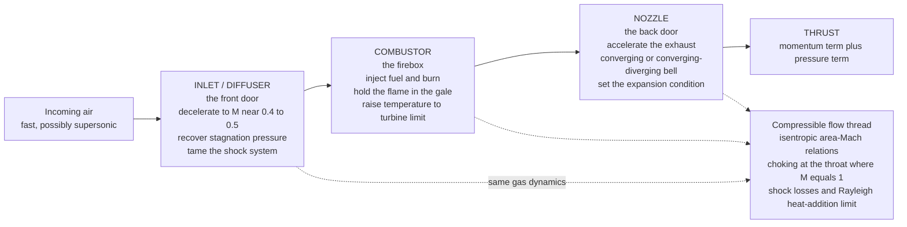

# ✈️ Inlets, Combustors, and Nozzles

> [!abstract] TL;DR
> An engine's **core** does the glamorous work of burning fuel, but three unglamorous flow-path components decide whether the engine works at all: the **inlet**, the **combustor**, and the **nozzle**. The **inlet (diffuser)** is the front door — it must **decelerate** the incoming air to a Mach number the compressor can swallow ($M\approx0.4$–$0.5$) while **recovering** as much **stagnation pressure** as possible; at supersonic flight it must do this through a carefully staged system of **oblique-then-normal shocks**, because a single strong shock throws away too much total pressure. The **combustor** is the firebox — it must **burn fuel in a hurricane** of high-speed air without blowing the flame out, using **recirculation zones** and **swirlers** to anchor the flame, then raise the gas temperature to the turbine limit while keeping pressure loss, exit-temperature streaks, and emissions ($\text{NO}_x$, soot) in check. The **nozzle** is the back door — it **accelerates** the hot gas to make thrust: a **converging** nozzle for subsonic or choked exhaust, and a **converging-diverging (de Laval)** nozzle to push the flow supersonic in afterburning jets and rockets, where the **expansion condition** ($p_e$ versus ambient $p_a$: under-, over-, or perfectly expanded) sets how much thrust you actually get. A single thread of **compressible gas dynamics** — isentropic area-Mach relations, **choking** at throats, and shock and heat-addition losses — ties all three together, and getting any one doorway wrong chokes the whole engine.

---

## Intuition

**Analogy first.** Picture a wood-burning stove that has to run while strapped to the front of a speeding train. The **fire** in the middle is the exciting part, but the fire is useless unless the *doorways* are right. You need a **front door** that takes the gale of oncoming air and calms it down before it reaches the fire — fling the door wide open into a 500-mph wind and the draft rips the fire apart; the door has to slow the air and hand it over gently. You need a **firebox** designed so the flame can survive that draft — a sheltered pocket where the fire can hide from the wind and keep re-lighting itself, or a single gust blows it out. And you need a **back door** shaped to turn the hot exhaust into a hard, fast jet pushing you forward rather than letting it dribble out.

That is exactly a jet or rocket engine. The **inlet** is the front door: it must **decelerate** the rushing air — and at supersonic speeds, tame it through **shock waves** — before handing it to the compressor "calmly." The **combustor** is the firebox: it must **hold the flame** in a torrent of air moving faster than a hurricane, burning fuel efficiently without flaming out. The **nozzle** is the back door: it **shapes and accelerates** the exhaust to squeeze out maximum thrust, and at supersonic exit speeds must **flare into a bell** to keep accelerating the gas past the speed of sound. The core cycle only delivers its promised thrust and efficiency if all three doorways are done right — which is why propulsion engineers spend as much time on the plumbing as on the fire.

The deep idea to carry into the mathematics: all three components are **compressible-flow devices**, governed by the same gas dynamics — how area change, heat addition, and shocks move a gas along the sonic line $M=1$.

---

## How It Works

### Core mechanics

1. **Inlet / diffuser — capture and decelerate.** The inlet's job is *deceleration*, the opposite of the nozzle. Slowing a gas raises its static pressure (a diffuser trades velocity for pressure), and the figure of merit is **pressure recovery** $\pi_d = p_{0,\text{exit}}/p_{0,\infty}$ — the fraction of the freestream **stagnation** (total) pressure that survives to the compressor face. For **subsonic** flight the inlet is a simple diverging duct and recovery is near-perfect. For **supersonic** flight you cannot just diffuse smoothly, because decelerating supersonic gas requires *converging* area and any deceleration ends in a **shock**. A single **normal shock** at high Mach destroys a huge fraction of total pressure, so supersonic inlets stage the deceleration through **oblique shocks** (off spikes, ramps, or cones) that each remove a slice of Mach number cheaply, ending in a weak terminal normal shock — **external compression** (spike ahead of the lip) or **internal/mixed compression**. Along the way engineers fight **flow distortion** (uneven pressure at the compressor face), **buzz** (an unsteady shock oscillation), **unstart** (the shock system being violently expelled forward), and **boundary-layer** buildup that is bled or diverted away.

2. **Combustor — burn without blowing out.** Compressed air enters the combustor at $M\approx0.05$–$0.3$ (the diffuser has slowed it deliberately, because you cannot hold a flame in fast flow). Fuel is injected and burned at **nearly constant pressure**, raising the gas temperature toward the **turbine inlet temperature limit** — the hottest the turbine blades can survive. The central challenge is **flame stabilization**: a flame propagates only at a modest speed, so in a duct where the air moves faster than the flame, the flame would be swept away unless it is **anchored**. Combustors create low-velocity **recirculation zones** (behind bluff-body flame holders, or via **swirlers**) where hot products circulate back to continuously re-ignite the incoming mixture. The flow is organized into a rich **primary zone** (stable burning), a **secondary/intermediate zone** (complete the burn), and a **dilution zone** (cool the gas with bypass air and tailor a uniform **exit temperature profile** so no hot streak destroys a turbine blade). Design targets: high **combustion efficiency**, low **pressure loss**, wide stability limits (no **flameout**), and low **emissions** ($\text{NO}_x$, soot, CO, unburned hydrocarbons).

3. **Nozzle — accelerate to make thrust.** The nozzle converts the combustor's high-pressure, high-temperature gas into a fast jet. By the **area-velocity relation**, a **converging** passage accelerates subsonic flow, so a simple converging nozzle suffices when the exhaust is subsonic or just **choked** ($M=1$ at the exit). To go **supersonic** you must add a **diverging** section after the throat — the **converging-diverging (de Laval)** nozzle of afterburning jets and every rocket. Thrust is momentum plus a pressure term: $F=\dot m\,V_e+(p_e-p_a)A_e$. The **expansion condition** compares exit pressure $p_e$ to ambient $p_a$: **perfectly expanded** ($p_e=p_a$, pressure term zero, maximum efficiency), **under-expanded** ($p_e>p_a$, gas keeps expanding outside, plumes bulge — common at high altitude), or **over-expanded** ($p_e<p_a$, ambient squeezes the jet, oblique shocks and possibly flow separation — common at sea level for a vacuum-optimized bell). Variable-geometry nozzles and **thrust vectoring** adapt the throat/exit area and jet direction across the flight envelope.

4. **The gas-dynamics thread.** All three are the same physics wearing different hats. **Isentropic area-Mach** relations govern the diffuser and nozzle; **choking at the throat** ($M=1$ at an area minimum) sets the nozzle's mass flow and the inlet's capture; **normal- and oblique-shock** relations govern supersonic inlet recovery and off-design nozzle plumes; and **Rayleigh flow** (heat addition in a duct) governs how combustion raises the **stagnation temperature** and imposes a **thermal-choking** limit — you cannot add so much heat that the subsonic flow is driven past $M=1$ without the upstream conditions readjusting.

### Flow / architecture



---

## Key Concepts

### Secondary Level

- **Three doorways, one engine.** The inlet is the front door that slows the air down, the combustor is the firebox that burns the fuel, and the nozzle is the back door that speeds the exhaust up to push you forward. Get any one wrong and the engine fails.
- **The inlet slows air down.** Air rushes at an engine far too fast for the compressor to handle, so the inlet acts like a funnel-in-reverse, calming the airflow before it reaches the spinning blades.
- **Supersonic inlets use shock waves on purpose.** Above the speed of sound, an inlet cannot slow the air gently — it steps the air down through a staircase of shock waves so it loses as little "push" as possible.
- **The combustor must not blow out the flame.** The air inside is moving like a hurricane, so the combustor builds sheltered pockets where the flame can hide and keep re-lighting itself instead of being blown out.
- **The nozzle is bell-shaped for a reason.** To make exhaust go faster than sound, the nozzle first narrows to a throat, then flares outward — exactly the shape you see on a rocket engine.
- **Perfect exhaust matches the outside air.** A nozzle works best when its exhaust pressure equals the surrounding air pressure; too high or too low wastes thrust.

### Undergraduate Level

- **Inlet pressure recovery:** $\pi_d = p_{0,\text{exit}}/p_{0,\infty}$; near $1.0$ for subsonic inlets, but it falls in supersonic flight and directly scales engine thrust and specific fuel consumption.
- **Why shocks matter for inlets.** Total pressure is conserved in smooth (isentropic) diffusion but **drops** across a shock. One strong **normal shock** is far lossier than several weak **oblique shocks** doing the same total deceleration — the reason supersonic inlets use spikes/ramps and shock trains.
- **Combustor as constant-pressure heat addition.** Ideal-cycle combustors add heat at roughly constant static pressure, raising **stagnation temperature** $T_0$ to the turbine limit; real combustors incur a few percent total-pressure loss.
- **Flame holding.** A turbulent flame speed is far below the duct velocity, so a stable flame requires a **recirculation zone** (bluff body or swirler) that recycles hot products to anchor combustion; exceed the stability envelope and you get **flameout**.
- **Nozzle types.** Converging nozzle accelerates subsonic flow and **chokes** at $M=1$ when the pressure ratio is high enough; converging-diverging (de Laval) nozzle continues acceleration to **supersonic** exit.
- **Thrust equation:** $F=\dot m\,V_e+(p_e-p_a)A_e$; the pressure term is zero only at **perfect expansion** ($p_e=p_a$).
- **Expansion states:** under-expanded ($p_e>p_a$), perfectly expanded ($p_e=p_a$), over-expanded ($p_e<p_a$); a fixed-geometry nozzle is off-design across altitude, trading thrust for simplicity.
- **Choked mass flow** through a nozzle throat is set entirely by throat area and upstream stagnation conditions, independent of back pressure once sonic.

### Graduate Level

- **Area-Mach relation (closed form):** $\left(\dfrac{A}{A^\*}\right)^2=\dfrac{1}{M^2}\left[\dfrac{2}{\gamma+1}\left(1+\dfrac{\gamma-1}{2}M^2\right)\right]^{\frac{\gamma+1}{\gamma-1}}$ — double-valued (one subsonic, one supersonic solution per area ratio), which is why the same diverging duct diffuses subsonic flow but accelerates supersonic flow; back pressure selects the branch.
- **Normal-shock total-pressure recovery:** $\dfrac{p_{0,2}}{p_{0,1}}=\left[\dfrac{\frac{\gamma+1}{2}M_1^2}{1+\frac{\gamma-1}{2}M_1^2}\right]^{\frac{\gamma}{\gamma-1}}\left[\dfrac{\gamma+1}{2\gamma M_1^2-(\gamma-1)}\right]^{\frac{1}{\gamma-1}}$; it collapses rapidly with $M_1$, motivating oblique-shock **external/internal compression** inlets and the empirical **MIL-E-5008B** recovery schedule $\eta=1-0.075(M-1)^{1.35}$ for $1<M<5$.
- **Inlet operability:** **started vs unstarted** internal-compression inlets (Kantrowitz limit on self-starting contraction ratio), **buzz** (shock-boundary-layer-driven instability), **distortion** indices (DC60) feeding compressor stall margin, and boundary-layer **bleed/diverter** budgets.
- **Rayleigh flow and thermal choking:** frictionless constant-area heat addition drives the Mach number toward $1$ from *both* sides; the stagnation-temperature ratio $\dfrac{T_0}{T_0^\*}=\dfrac{(\gamma+1)M^2\left[2+(\gamma-1)M^2\right]}{(1+\gamma M^2)^2}$ maxes out at $M=1$, so there is a **maximum heat** addable before the flow chokes and upstream conditions must readjust — a hard limit on combustor and ramjet/scramjet loading.
- **Combustion modeling:** turbulent flame speed and residence time set the **loading parameter**; **NOx** scales with peak flame temperature (Zeldovich mechanism), driving **lean-premixed** and staged designs; pattern factor and profile factor quantify exit-temperature nonuniformity protecting the turbine.
- **Nozzle thrust coefficient:** $C_F=\sqrt{\dfrac{2\gamma^2}{\gamma-1}\left(\dfrac{2}{\gamma+1}\right)^{\frac{\gamma+1}{\gamma-1}}\left[1-\left(\dfrac{p_e}{p_0}\right)^{\frac{\gamma-1}{\gamma}}\right]}+\left(\dfrac{p_e}{p_0}-\dfrac{p_a}{p_0}\right)\dfrac{A_e}{A_t}$; the pressure term makes fixed-geometry nozzles suboptimal off-design, and severe over-expansion triggers **shock-induced separation** (the practical floor on sea-level operation of vacuum bells).

---

## Python Demo

```python
# The flow-path components as compressible-flow devices, four ways:
#   (a) NOZZLE AREA-MACH/PRESSURE: the converging-diverging (de Laval) nozzle
#       area ratio A/A* and static/stagnation pressure p/p0 vs Mach number --
#       one subsonic branch (converging) and one supersonic branch (diverging),
#       meeting at the choked throat M = 1 (the area minimum).
#   (b) NOZZLE THRUST: thrust coefficient C_F vs nozzle pressure ratio
#       NPR = p0/pa for a FIXED-geometry bell, marking over-expanded,
#       perfectly expanded, and under-expanded operation.
#   (c) INLET pressure recovery vs flight Mach: a single NORMAL SHOCK (lossy)
#       vs the MIL-E-5008B multi-shock schedule (why supersonic inlets stage
#       the deceleration through oblique shocks).
#   (d) COMBUSTOR Rayleigh heat addition: stagnation-temperature ratio T0/T0*
#       vs Mach -- heat drives the flow toward M = 1, the THERMAL-CHOKING limit.
# Hand-rolled gas dynamics. Requires: numpy, matplotlib (no scipy).
import numpy as np
import matplotlib.pyplot as plt

gamma = 1.4                      # ratio of specific heats (air)
gm1   = gamma - 1.0
gp1   = gamma + 1.0

# ---------- shared gas-dynamics helpers -------------------------------
def area_ratio(M):
    """A / A_star for isentropic quasi-1D flow (A_star = sonic throat area)."""
    return (1.0 / M) * ((2.0 / gp1) * (1.0 + 0.5 * gm1 * M**2)) ** (gp1 / (2.0 * gm1))

def p_over_p0(M):
    """Isentropic static/stagnation pressure ratio."""
    return (1.0 + 0.5 * gm1 * M**2) ** (-gamma / gm1)

def normal_shock_p0_ratio(M1):
    """Stagnation-pressure recovery p0_2/p0_1 across a normal shock (M1 > 1)."""
    a = (0.5 * gp1 * M1**2) / (1.0 + 0.5 * gm1 * M1**2)
    b = gp1 / (2.0 * gamma * M1**2 - gm1)
    return a ** (gamma / gm1) * b ** (1.0 / gm1)

def rayleigh_T0_ratio(M):
    """Rayleigh-flow stagnation-temperature ratio T0/T0* (=1 at M=1)."""
    return (gp1 * M**2 * (2.0 + gm1 * M**2)) / (1.0 + gamma * M**2) ** 2

# =====================================================================
# (a) NOZZLE area-Mach and pressure
# =====================================================================
M_sub = np.linspace(0.06, 1.0, 300)
M_sup = np.linspace(1.0, 3.6, 300)
print("=== de Laval nozzle ===")
print(f"A/A* at throat M=1.0      = {area_ratio(1.0):.3f}  (minimum area, choked)")
print(f"A/A* at exit  M=3.0       = {area_ratio(3.0):.2f}   (exit must flare wide)")
print(f"p/p0 at exit  M=3.0       = {p_over_p0(3.0):.4f}  (deep expansion)")

# =====================================================================
# (b) NOZZLE thrust coefficient vs nozzle pressure ratio (fixed geometry)
# =====================================================================
Me   = 2.5                                   # fixed exit Mach (fixed area ratio)
eps  = area_ratio(Me)                         # Ae/At (fixed geometry)
peP0 = p_over_p0(Me)                          # exit/chamber pressure (fixed)
NPR_design = 1.0 / peP0                        # p0/pa for perfect expansion
CF_mom = np.sqrt((2.0 * gamma**2 / gm1) *
                 (2.0 / gp1) ** (gp1 / gm1) *
                 (1.0 - peP0 ** (gm1 / gamma)))
NPR    = np.linspace(4.0, 60.0, 400)
CF     = CF_mom + (peP0 - 1.0 / NPR) * eps     # add pressure-thrust term
print("\n=== nozzle thrust (fixed bell, exit M=2.5) ===")
print(f"area ratio Ae/At           = {eps:.3f}")
print(f"design NPR (perfect exp.)  = {NPR_design:.1f}")
print(f"C_F at design              = {CF_mom:.3f}")

# =====================================================================
# (c) INLET pressure recovery vs flight Mach
# =====================================================================
M_fl   = np.linspace(0.2, 5.0, 400)
rec_ns = np.where(M_fl <= 1.0, 1.0, normal_shock_p0_ratio(np.maximum(M_fl, 1.0001)))
rec_ml = np.where(M_fl <= 1.0, 1.0, 1.0 - 0.075 * (M_fl - 1.0) ** 1.35)
print("\n=== inlet pressure recovery at M=3 ===")
print(f"single normal shock        = {normal_shock_p0_ratio(3.0):.3f}")
print(f"MIL-E-5008B (shock train)  = {1.0 - 0.075 * (3.0 - 1.0) ** 1.35:.3f}")

# =====================================================================
# (d) COMBUSTOR Rayleigh heat addition (subsonic branch)
# =====================================================================
M_ray = np.linspace(0.10, 1.0, 300)
T0r   = rayleigh_T0_ratio(M_ray)
print("\n=== combustor Rayleigh flow ===")
print(f"T0/T0* at M=0.2 (inlet)    = {rayleigh_T0_ratio(0.2):.3f}")
print(f"T0/T0* at M=1.0 (choked)   = {rayleigh_T0_ratio(1.0):.3f}  (thermal-choke max)")

# =====================================================================
# PLOTS
# =====================================================================
fig, ax = plt.subplots(2, 2, figsize=(13, 9))
fig.suptitle("Inlets, Combustors, and Nozzles: component gas dynamics",
             fontsize=15, fontweight="bold")

# A: nozzle area-Mach + pressure
axA  = ax[0, 0]
axA.plot(area_ratio(M_sub), M_sub, color="#1f77b4", lw=2.4,
         label="subsonic branch (converging)")
axA.plot(area_ratio(M_sup), M_sup, color="#d62728", lw=2.4,
         label="supersonic branch (diverging)")
axA.scatter([1.0], [1.0], color="k", zorder=5)
axA.annotate("throat: M = 1, CHOKED", (1.0, 1.0), textcoords="offset points",
             xytext=(14, -4), fontsize=8,
             arrowprops=dict(arrowstyle="->", lw=0.8))
axA.set_xscale("log")
axA.set_xlabel("area ratio  A / A*")
axA.set_ylabel("Mach number  M")
axA.set_title("A. de Laval nozzle: converge to throat, diverge to go supersonic")
axA.legend(fontsize=8, loc="upper right")
axA.grid(alpha=0.3, which="both")
axAt = axA.twinx()
axAt.plot(area_ratio(M_sup), p_over_p0(M_sup), color="#2ca02c", lw=1.6, ls="--")
axAt.set_ylabel("p / p0 on supersonic branch (dashed)", color="#2ca02c")
axAt.tick_params(axis="y", labelcolor="#2ca02c")

# B: nozzle thrust vs NPR
axB = ax[0, 1]
axB.plot(NPR, CF, color="#9467bd", lw=2.4)
axB.axvline(NPR_design, color="k", ls="--", lw=1.2)
axB.scatter([NPR_design], [CF_mom], color="#d62728", zorder=5)
axB.annotate("perfect\nexpansion\n(pe = pa)", (NPR_design, CF_mom),
             textcoords="offset points", xytext=(10, -34), fontsize=8)
axB.axvspan(4.0, NPR_design, color="#ffd0d0", alpha=0.4)
axB.axvspan(NPR_design, 60.0, color="#cfe8ff", alpha=0.4)
axB.text(0.5 * (4 + NPR_design), CF.min() + 0.02, "over-expanded\npe < pa",
         fontsize=8, ha="center")
axB.text(0.5 * (NPR_design + 60), CF.min() + 0.02, "under-expanded\npe > pa",
         fontsize=8, ha="center")
axB.set_xlabel("nozzle pressure ratio  NPR = p0 / pa")
axB.set_ylabel("thrust coefficient  C_F")
axB.set_title("B. Fixed bell: thrust peaks near perfect expansion")
axB.grid(alpha=0.3)

# C: inlet pressure recovery
axC = ax[1, 0]
axC.plot(M_fl, rec_ns, color="#d62728", lw=2.4, label="single normal shock")
axC.plot(M_fl, rec_ml, color="#1f77b4", lw=2.4, label="MIL-E-5008B shock train")
axC.axvline(1.0, color="k", ls=":", lw=1.0)
axC.text(1.05, 0.25, "supersonic:\nrecovery falls,\nuse oblique shocks", fontsize=8)
axC.set_xlabel("flight Mach number  M")
axC.set_ylabel("inlet pressure recovery  p0,exit / p0,inf")
axC.set_ylim(0, 1.05)
axC.set_title("C. Inlet recovery: one strong shock is far lossier than many weak")
axC.legend(fontsize=8, loc="lower left")
axC.grid(alpha=0.3)

# D: combustor Rayleigh heat addition
axD = ax[1, 1]
axD.plot(M_ray, T0r, color="#8c564b", lw=2.4)
axD.scatter([1.0], [1.0], color="#d62728", zorder=5)
axD.annotate("M = 1: THERMAL CHOKE\n(max heat addable)", (1.0, 1.0),
             textcoords="offset points", xytext=(-140, -30), fontsize=8,
             arrowprops=dict(arrowstyle="->", lw=0.8))
axD.annotate("", xy=(0.55, rayleigh_T0_ratio(0.55)),
             xytext=(0.2, rayleigh_T0_ratio(0.2)),
             arrowprops=dict(arrowstyle="->", color="#ff7f0e", lw=2.0))
axD.text(0.22, 0.55, "adding heat\ndrives M toward 1", fontsize=8, color="#ff7f0e")
axD.set_xlabel("Mach number  M  (subsonic combustor flow)")
axD.set_ylabel("stagnation-temperature ratio  T0 / T0*")
axD.set_title("D. Combustor Rayleigh flow: heat addition chokes at M = 1")
axD.grid(alpha=0.3)

plt.tight_layout(rect=[0, 0, 1, 0.96])
plt.savefig("inlets_combustors_and_nozzles.png", dpi=130)
plt.show()
```

Running the script prints the nozzle area ratios ($A/A^\*=1$ at the sonic throat, widening to $\approx4.2$ at a Mach-3 exit), the fixed-bell design NPR ($\approx17$ for an exit-Mach-2.5 nozzle) at which thrust peaks, the collapse of inlet recovery with flight Mach (a single normal shock at $M=3$ keeps only $\approx0.33$ of total pressure, while a staged shock train keeps $\approx0.85$), and the Rayleigh thermal-choke ceiling where $T_0/T_0^\*\to1$ at $M=1$. The four panels visualize each: the double-valued nozzle area-Mach curve pinching to the choked throat, the thrust-coefficient hump straddling perfect expansion, the two inlet-recovery curves diverging above $M=1$, and the heat-addition arrow marching the combustor flow toward the sonic wall.

---

## Real-World Applications

- **Concorde and the SR-71 variable inlets.** Both used **external-compression, variable-geometry** supersonic inlets — Concorde's movable ramps and the SR-71's translating **spike** repositioned the oblique-shock system with Mach number to keep the terminal normal shock weak and recovery high. On the SR-71 the inlet did the majority of the cycle's compression at cruise; an **unstart** (the shock system blowing forward) produced violent yaw and was a defining operational hazard.
- **Modern jet-engine annular combustors.** Engines like the CFM56 and GE9X use **swirl-stabilized** annular combustors with primary/dilution zones; **RQL (rich-burn/quick-quench/lean-burn)** and **lean-premixed (DLE/TAPS)** designs exist specifically to cut **NOx** by controlling peak flame temperature while preserving flame stability and altitude relight.
- **Rocket engine bells.** The Space Shuttle Main Engine (RS-25) and Merlin/Raptor use large-area-ratio **de Laval** nozzles. Sea-level-optimized first stages run **over-expanded** at liftoff (visible oblique "shock diamonds" / Mach disks) and approach perfect expansion as they climb; vacuum upper stages use huge area ratios that would flow-separate at sea level, hence the **altitude-compensating** interest in aerospikes.
- **Afterburning fighter nozzles.** Military engines (F119, EJ200) use **variable-geometry converging-diverging** nozzles that open the throat and exit area when the afterburner lights, and the F-22's **two-dimensional** nozzles add **thrust vectoring** for pitch authority.
- **Ramjets and scramjets.** With no compressor, the **inlet** does *all* the compression through shocks and the **nozzle** does all the expansion; in a scramjet the combustor burns fuel in **supersonic** flow, where **thermal choking** (Rayleigh limit) is a live design constraint on how much heat can be added.
- **Wind tunnels and gas turbines for power.** Supersonic wind tunnels are de Laval nozzles run in reverse of a rocket's purpose; stationary gas turbines for electricity use the same combustor and turbine-inlet-temperature logic, trading flight-envelope robustness for emissions and efficiency.

---

## Common Pitfalls

- **Treating the inlet like "just a duct."** The inlet's **pressure recovery** multiplies straight through to thrust and fuel burn; a few points of lost total pressure at the compressor face can erase the gains from an expensive core improvement. At supersonic speeds the inlet, not the compressor, often dominates the cycle.
- **Using one strong normal shock to decelerate supersonic flow.** A single normal shock at high Mach is thermodynamically wasteful — total pressure plummets. Real inlets *stage* the deceleration through several **oblique shocks**, each removing Mach number cheaply. Forgetting this makes any supersonic inlet look hopeless.
- **Trying to hold a flame in fast flow.** Turbulent flame speeds are tens of m/s while combustor through-flow is hundreds of m/s. Without a deliberate **recirculation zone** (bluff body, swirler) the flame is simply blown downstream and out. Novice combustor designs that "streamline" the flow for low loss often **flame out**.
- **Ignoring the exit temperature profile.** High average combustor exit temperature is worthless if it arrives as **hot streaks**; a poor pattern factor burns through turbine blades even when the mean temperature is within limits. The dilution zone exists for this, not for efficiency.
- **Assuming a diverging nozzle always accelerates the flow.** Only supersonic flow accelerates in a diverging duct; a converging-diverging nozzle fed below its design pressure ratio can run **entirely subsonic** in the diverging section, or stand a **normal shock** inside it. The area shape alone does not guarantee supersonic exit — the pressure ratio must be high enough.
- **Designing a fixed nozzle for one altitude.** A sea-level-perfect nozzle is badly **under-expanded** in vacuum (lost thrust), and a vacuum-perfect nozzle is badly **over-expanded** at sea level (shocks, separation, side loads). Fixed geometry is always a compromise; variable geometry or altitude compensation is the fix.
- **Confusing static and stagnation properties across components.** The combustor raises **stagnation** temperature; the nozzle converts stagnation pressure into velocity; the inlet's job is stated in **stagnation-pressure recovery**. Mixing static and total quantities corrupts every thrust and efficiency estimate.
- **Forgetting thermal choking in heat-addition ducts.** In ramjets, scramjets, and afterburners you cannot keep adding heat indefinitely — **Rayleigh flow** drives the Mach number toward $1$, and at the choke limit the upstream flow must readjust (or the inlet unstarts). Heat release is bounded by gas dynamics, not just by available fuel.

---

## Related Concepts

- [[Compressible_Flow_and_Gas_Dynamics]] — the parent physics: Mach number, isentropic relations, the area-velocity relation, and choking that govern all three components here.
- [[Shock_Waves_and_Supersonic_Flow]] — the oblique- and normal-shock relations behind supersonic **inlet** compression and off-design **nozzle** plumes, and the total-pressure loss that sets recovery.
- [[Compressible_Flow_and_Propulsion]] — the mechanical-engineering companion covering the same nozzle/diffuser gas dynamics from a turbomachinery and cycle-analysis angle.
- [[Laws_of_Thermodynamics]] — the adiabatic energy balance and stagnation enthalpy that make the combustor's heat addition and the nozzle's expansion thermodynamically inseparable.
- [[Chemical_Kinetics]] — reaction rates, ignition, and flame speed underlying **flame holding**, combustion efficiency, and blowout limits in the combustor.
- [[Chemical_Thermodynamics]] — heats of combustion, adiabatic flame temperature, and specific heats that fix how much the combustor can raise $T_0$ and where the turbine-temperature limit bites.

*Aerospace-Engineering siblings referenced in prose (to be built in this Propulsion section): Air_Breathing_Propulsion, Gas_Turbine_Engine_Cycles, Rocket_Propulsion_Fundamentals, Supersonic_and_Hypersonic_Aerodynamics.*

---

## Review Questions

1. **(Secondary)** Explain, using the stove-on-a-train analogy, why a jet engine needs three different "doorways" and what each one does. Why must a rocket nozzle first narrow and then flare out to make the exhaust go faster than sound?
2. **(Undergraduate)** A supersonic inlet must decelerate $M=2.5$ air. (a) Explain why sending it through a single strong normal shock wastes far more stagnation pressure than sending it through two weak oblique shocks followed by a weak normal shock. (b) A combustor then adds heat at nearly constant pressure — what property does it raise, and what physically limits how much heat you can add before the flow chokes? (c) The exhaust feeds a fixed converging-diverging nozzle; sketch how thrust varies as the vehicle climbs from sea level to vacuum, labeling the over-expanded, perfectly expanded, and under-expanded regions.
3. **(Graduate)** A fixed-geometry de Laval nozzle is designed for exit Mach $M_e=3.0$ from a chamber at $p_0$. (a) Using the isentropic relations, find $A_e/A_t$ and $p_e/p_0$, and hence the nozzle pressure ratio for perfect expansion. (b) Write the thrust coefficient $C_F$ and explain why the pressure-thrust term makes this nozzle suboptimal at both sea level and vacuum, and what limits how over-expanded it can run before flow separation. (c) For the combustor upstream, use the Rayleigh $T_0/T_0^\*$ relation to explain the **thermal-choking** limit, and connect the stagnation-pressure loss of an in-nozzle normal shock during startup to entropy and the [[Laws_of_Thermodynamics|second law]].

---

## Sources

- Philip G. Hill & Carl R. Peterson — *Mechanics and Thermodynamics of Propulsion*, 2nd ed. (Addison-Wesley, 1992) — inlets, combustors, and nozzles within full engine-cycle analysis.
- Jack D. Mattingly — *Elements of Gas Turbine Propulsion* / *Elements of Propulsion: Gas Turbines and Rockets* (AIAA, 2006) — component performance, inlet recovery schedules, and nozzle off-design behavior.
- John D. Anderson Jr. — *Modern Compressible Flow: With Historical Perspective*, 3rd ed. (McGraw-Hill, 2003) — isentropic area-Mach relations, shocks, and nozzle/diffuser gas dynamics.
- Arthur H. Lefebvre & Dilip R. Ballal — *Gas Turbine Combustion: Alternative Fuels and Emissions*, 3rd ed. (CRC Press, 2010) — flame stabilization, combustor zones, exit temperature profile, and emissions.
- NASA Glenn Research Center — "Nozzle Design: Converging-Diverging (CD) Nozzle" and "Inlet Performance", [grc.nasa.gov](https://www.grc.nasa.gov/www/k-12/airplane/nozzle.html).

---

#aerospace-engineering #propulsion #nozzle #combustor #inlet
