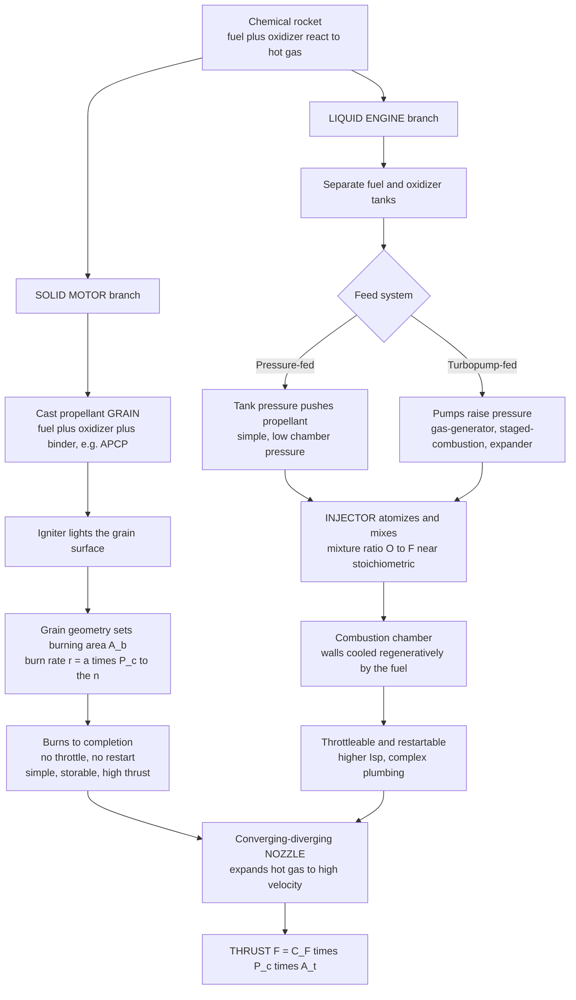

# 🚀 Liquid and Solid Rocket Engines

> [!abstract] TL;DR
> There are two ways to build a **chemical rocket**, and they trade **control for simplicity**. A **solid rocket motor** casts fuel and oxidizer together into a rubbery **solid grain**; you light it and it burns unstoppably to completion — dead simple, storable for years, huge thrust density, but **no throttle and no off-switch**, and the **grain geometry** is what programs the thrust-versus-time curve through the burn-rate law $r = a\,P_c^{\,n}$. A **liquid rocket engine** pumps separate **liquid fuel and oxidizer** into a combustion chamber through a **pressure-fed** or **turbopump** feed system; because valves gate the flow, it can be **throttled, shut down, and restarted**, tuned to a **mixture ratio** near — but deliberately fuel-rich of — stoichiometric for peak **specific impulse ($I_{sp}$)**, and cooled by running cryogenic fuel through the chamber walls (**regenerative cooling**). The price of that control is turbopumps, plumbing, cryogenics, and **combustion instability**. Real vehicles mix and match: solids for cheap brute **boost** (strap-on boosters, missiles), liquids for the efficient, controllable **main propulsion** that puts payloads in orbit and lands stages back.

---

## Intuition

**Analogy:** Think of two ways to make fire do work for you.

A **solid rocket** is a **firework**. The fuel and the oxidizer are already mixed and packed into one solid stick. You touch a flame to it, and from that instant you are only a spectator: it roars to life and burns to completion on its own schedule. There is no knob to turn it down, no button to put it out, and no way to relight it. In exchange for surrendering all control you get something wonderfully simple — a device with essentially no moving parts that you can seal in a tube, store in a silo for twenty years, and fire the instant you need it.

A **liquid rocket** is a **blowtorch with valves**. The fuel and the oxidizer live in separate tanks, and you feed them into the flame through taps you control. Open the taps wider and the flame roars; ease them back and it settles; close them and it goes out; open them again and it relights. That controllability is exactly what you want for steering a rocket to orbit or setting a booster down on a landing pad — but paying for it means building fearsome plumbing: pumps that move tonnes of cryogenic liquid per second, injectors that spray it into a fine mist, and chamber walls cooled by the very fuel about to be burned.

The whole art of rocketry lives in that trade: **solids buy simplicity and storability by giving up control; liquids buy control and efficiency by taking on complexity.**

---

## How It Works

### Core Mechanics

Both families obey the same bottom line: burn propellant to make hot high-pressure gas, then let a **converging–diverging nozzle** expand it to enormous exhaust velocity. Thrust is
$$F = \dot{m}\,V_e + (P_e - P_a)\,A_e = C_F\,P_c\,A_t,$$
and efficiency is measured by **specific impulse** $I_{sp} = F / (\dot{m}\,g_0)$, the effective exhaust velocity in seconds. Where the two families differ is *everything upstream of the nozzle* — how the propellant is stored and delivered.

**Solid rocket motors:**

1. **The grain is the whole engine.** Fuel, oxidizer, and a rubbery **binder** are mixed into a slurry and cast into a solid block — the **grain**. A common modern formulation is **APCP** (ammonium-perchlorate oxidizer + aluminium fuel + HTPB binder). Chamber, tank, and injector all collapse into this one cast part.
2. **It burns on its surface, layer by layer.** An igniter lights the exposed surface, and the flame front eats **inward, perpendicular to the surface**, at a **burn rate** given by Vieille's / Saint-Robert's law $r = a\,P_c^{\,n}$ — pressure-sensitive with exponent $n$.
3. **Grain geometry programs the thrust curve.** Thrust $\propto \dot m \propto \rho_p\,A_b\,r$, so the instantaneous **burning-surface area $A_b$** sets the thrust. Carve the grain so $A_b$ stays constant (an **end-burner** or a well-designed **star**) and you get a **neutral** flat thrust; a plain **internal-burning tube** grows its port as it burns, so $A_b$ rises → **progressive** thrust; an outside-in **external-burning rod** shrinks → **regressive** thrust. The engineer draws the thrust-time profile *before* casting, by choosing a cross-section.
4. **Pressure sets itself.** Generation $\rho_p A_b\,a P_c^n$ must equal the nozzle's swallowing rate $P_c A_t / c^\*$, giving the equilibrium chamber pressure $P_c = (\rho_p\,a\,c^\*\,K_n)^{1/(1-n)}$ with $K_n = A_b/A_t$. **Stability demands $n < 1$**; if $n \ge 1$ a pressure bump raises burn rate faster than the nozzle can vent, and pressure runs away to a burst.

**Liquid rocket engines:**

1. **Two tanks, one chamber.** Fuel and oxidizer are stored as liquids and delivered to a single combustion chamber. Delivery is either **pressure-fed** (tank ullage pressure pushes the propellant — simple, but the whole tank must hold chamber-plus pressure, capping $P_c$ low) or **turbopump-fed** (pumps raise pressure, decoupling tank weight from chamber pressure).
2. **The engine cycle decides how to drive the pump.** A **gas-generator (open) cycle** burns a little propellant to spin the turbine and dumps that gas overboard — simple, mild performance loss (Merlin, F-1). **Staged combustion (closed)** burns a fuel-rich or oxidizer-rich preburner and routes *all* that gas through the main chamber — high $P_c$ and high $I_{sp}$ at great complexity (RS-25, RD-180, Raptor). **Expander** cycles heat the fuel in the cooling jacket and use *that* to drive the turbine (RL10). **Electric-pump** cycles spin the pumps with battery-driven motors (Rutherford).
3. **The injector makes the fire.** It atomizes and mixes the two streams into a fine, well-blended spray so combustion is fast, complete, and — hopefully — stable.
4. **Mixture ratio is tuned, not maximized.** The **oxidizer-to-fuel ratio $O/F$** is set **near but deliberately fuel-rich of stoichiometric**: since $I_{sp} \propto \sqrt{T_c / \bar{M}}$, running slightly fuel-rich lowers the exhaust **molecular weight $\bar M$** (leftover light species like $\mathrm{H_2}$) more than it lowers the temperature, so peak $I_{sp}$ sits at a *lower* $O/F$ than peak temperature.
5. **Regenerative cooling.** Cryogenic fuel is circulated through channels in the chamber and nozzle walls before injection, carrying away the multi-megawatt heat flux and pre-heating the propellant — the walls survive gas hotter than their own melting point.
6. **You keep the knobs.** Throttling, shutdown, and restart all follow from simply moving valves — impossible for a lit solid.

### Flow / Architecture



---

## Key Concepts

### Secondary (intuition-level)
- **Solid = firework, liquid = blowtorch-with-valves.** Solid: mix-and-cast, light once, burns till gone. Liquid: two tanks, valves, can be dialed and switched.
- **Thrust comes from throwing mass fast.** More hot gas ($\dot m$) at higher exhaust speed ($V_e$) means more thrust.
- **Specific impulse $I_{sp}$ is fuel economy** — how many seconds of thrust you get per unit weight of propellant. Higher is better; hydrogen–oxygen is the champion.
- **Solids are strong and simple but uncontrollable; liquids are efficient and controllable but complicated.** That single sentence explains most launch-vehicle design choices.

### Undergraduate (core relations)
- **Thrust equation:** $F = \dot m V_e + (P_e - P_a) A_e = C_F P_c A_t$, decomposing performance into a **thrust coefficient $C_F$** (the nozzle's job) and **characteristic velocity $c^\*$** (the chamber's job), with $I_{sp} = F/(\dot m g_0)$.
- **Solid burn-rate law:** $r = a\,P_c^{\,n}$ (Saint-Robert). The exponent $n$ governs pressure sensitivity; the coefficient $a$ carries temperature sensitivity of the propellant.
- **Internal ballistics equilibrium:** $P_c = (\rho_p\,a\,c^\*\,K_n)^{1/(1-n)}$, $K_n = A_b/A_t$. **Design rule: $n<1$ for a stable motor.**
- **Grain classification:** neutral / progressive / regressive, set by how $A_b$ evolves as the web burns back (end-burner, tube/BATES, star, wagon-wheel, finocyl).
- **Mixture ratio $O/F$ and $I_{sp}\propto\sqrt{T_c/\bar M}$:** peak $I_{sp}$ is fuel-rich of the stoichiometric (peak-temperature) point because reducing exhaust molecular weight beats the temperature loss.
- **Feed systems and cycles:** pressure-fed vs turbopump; gas-generator, staged-combustion, expander, electric-pump — a ladder trading complexity for chamber pressure and $I_{sp}$.
- **Common propellant combinations:** LOX/RP-1 (dense, cheap kerosene), LOX/LH₂ (highest $I_{sp}$, bulky), LOX/CH₄ (methalox — clean, reusable, storable-ish), **hypergolics** (NTO/hydrazine — self-igniting, storable), and **hybrids** (solid fuel + liquid oxidizer).

### Graduate (deeper mechanisms)
- **Combustion instability:** acoustic modes of the chamber couple to the flame's heat release (Rayleigh criterion), producing **chugging** (low-frequency feed coupling), **buzzing**, and destructive high-frequency **screech**; mitigated with **acoustic baffles**, resonator cavities, and injector redesign.
- **Erosive burning:** high crossflow velocity along a solid grain port augments the local burn rate beyond $a P_c^n$, distorting the pressure trace and the neutral-burn design.
- **Two-phase and $c^\*$-efficiency losses:** condensed $\mathrm{Al_2O_3}$ particles in metallized solids lag the gas (velocity/thermal lag), and finite mixing gives real $c^\*$ below theoretical; captured by combustion and nozzle efficiencies.
- **Oxidizer-rich staged combustion:** the Soviet/Russian route (RD-170/180) runs an oxygen-rich preburner to avoid carbon deposition, demanding exotic oxidation-resistant alloys — a materials problem as much as a fluids one.
- **Regenerative-cooling design:** channel sizing balances heat flux, coolant pressure drop, and wall thermal stress; repeated firing drives **low-cycle thermal fatigue and creep** of the hot-gas wall (the "doghouse" failure in reusable engines).
- **Throttling physics:** deep throttling upsets injector pressure drop and can invite instability; solutions include pintle injectors (Merlin, Apollo LM descent) and dual-manifold designs.
- **Thrust termination:** solids can only be "shut off" by blowing open reverse ports to null net thrust or quench pressure — never as clean as closing a liquid valve.

---

## Python Demo

```python
# Two views of chemical-rocket engineering:
#   (LEFT)  SOLID grain geometry programs the thrust-vs-time curve via burning
#           surface area A_b, coupled through the burn-rate law r = a * Pc^n and
#           the internal-ballistics equilibrium Pc = (rho_p * a * c_star * A_b/At)^(1/(1-n)).
#   (RIGHT) LIQUID mixture ratio (O/F): specific impulse peaks FUEL-RICH of
#           stoichiometric because Isp ~ sqrt(Tc / Mbar) and running rich lowers
#           exhaust molecular weight faster than it lowers temperature.
import numpy as np
import matplotlib.pyplot as plt

# ----------------------------------------------------------------------
# (a) SOLID MOTOR: thrust-time curves for three grain geometries
# ----------------------------------------------------------------------
rho_p   = 1800.0     # propellant density [kg/m^3]  (APCP-like)
a_coef  = 3.0e-5     # burn-rate coefficient (SI, Pc in Pa) for r = a*Pc^n
n_exp   = 0.35       # pressure exponent (< 1 for stability)
c_star  = 1550.0     # characteristic velocity [m/s]
Cf      = 1.5        # thrust coefficient
At      = 0.010      # throat area [m^2]
L0      = 1.0        # grain length [m]
Ro      = 0.15       # outer radius [m]
ri0     = 0.04       # initial port radius (internal-burning) [m]

def burning_area(geom, w):
    """Burning surface area A_b as a function of web burned w [m]."""
    if geom == "end_burner":          # cigarette burn: constant cross-section -> NEUTRAL
        return np.pi * Ro**2 * np.ones_like(w)
    if geom == "internal_tube":       # port grows outward -> PROGRESSIVE
        return 2*np.pi*(ri0 + w)*L0
    if geom == "external_rod":        # burns outside-in, perimeter shrinks -> REGRESSIVE
        return 2*np.pi*np.maximum(Ro - w, 1e-3)*L0

configs = {
    "end_burner":    ("End-burner (neutral)",   L0),          # web = grain length
    "internal_tube": ("Internal tube (progressive)", Ro-ri0), # web = wall thickness
    "external_rod":  ("External rod (regressive)",   Ro),     # web = full radius
}

fig, (ax1, ax2) = plt.subplots(1, 2, figsize=(13, 5.2))

for geom, (label, web_max) in configs.items():
    w  = np.linspace(0.0, web_max*0.999, 400)
    Ab = burning_area(geom, w)
    # Internal-ballistics equilibrium chamber pressure at each instant:
    Pc = (rho_p * a_coef * c_star * (Ab/At))**(1.0/(1.0 - n_exp))  # [Pa]
    r  = a_coef * Pc**n_exp                                        # burn rate [m/s]
    F  = Cf * Pc * At                                             # thrust [N]
    # Convert web-marching to a time base: dt = dw / r
    dw = np.gradient(w)
    t  = np.cumsum(dw / r)
    ax1.plot(t, F/1e3, lw=2.2, label=label)

ax1.set_title("(a) Solid motor: grain geometry programs thrust")
ax1.set_xlabel("Time  [s]")
ax1.set_ylabel("Thrust  [kN]")
ax1.grid(alpha=0.3); ax1.legend()

# ----------------------------------------------------------------------
# (b) LIQUID ENGINE: specific impulse vs mixture ratio O/F
#     Isp ~ sqrt(Tc / Mbar); peak sits fuel-rich of stoichiometric.
# ----------------------------------------------------------------------
def isp_curve(OF, OF_stoich, Tc_max, Tc_spread, M_lo, M_hi, M_center, M_width, peak_target):
    Tc   = Tc_max * np.exp(-((OF - OF_stoich)/Tc_spread)**2)      # chamber temp peaks at stoich
    Mbar = M_lo + (M_hi - M_lo)/(1.0 + np.exp(-(OF - M_center)/M_width))  # rises with O/F
    raw  = np.sqrt(Tc/Mbar)
    return raw * (peak_target/raw.max()), Tc, Mbar

OF_h = np.linspace(2.0, 9.0, 400)      # LOX/LH2
OF_k = np.linspace(1.5, 4.5, 400)      # LOX/RP-1
Isp_h, _, _ = isp_curve(OF_h, 8.0, 3600, 4.5, 4.0, 18.0, 5.0, 1.5, 450.0)
Isp_k, _, _ = isp_curve(OF_k, 3.4, 3700, 1.6, 14.0, 26.0, 3.4, 0.8, 350.0)

ax2.plot(OF_h, Isp_h, lw=2.2, color="tab:blue",  label="LOX / LH2")
ax2.plot(OF_k, Isp_k, lw=2.2, color="tab:red",   label="LOX / RP-1")
# stoichiometric points (dashed) vs peak-Isp points (dots)
for OF_s, c in [(8.0, "tab:blue"), (3.4, "tab:red")]:
    ax2.axvline(OF_s, color=c, ls="--", alpha=0.5)
ax2.plot(OF_h[Isp_h.argmax()], Isp_h.max(), "o", color="tab:blue")
ax2.plot(OF_k[Isp_k.argmax()], Isp_k.max(), "o", color="tab:red")
ax2.annotate("peak Isp is FUEL-RICH\nof stoichiometric (dashed)",
             xy=(OF_h[Isp_h.argmax()], Isp_h.max()),
             xytext=(4.6, 300), fontsize=9,
             arrowprops=dict(arrowstyle="->", color="gray"))
ax2.set_title("(b) Liquid engine: Isp vs mixture ratio O/F")
ax2.set_xlabel("Mixture ratio  O/F")
ax2.set_ylabel("Specific impulse  Isp  [s]")
ax2.grid(alpha=0.3); ax2.legend()

plt.tight_layout()
plt.savefig("rocket_engines.png", dpi=120)
print("End-burner  -> flat (neutral) thrust")
print("Internal tube -> rising (progressive) thrust")
print("External rod  -> falling (regressive) thrust")
print(f"LOX/LH2 peak Isp at O/F = {OF_h[Isp_h.argmax()]:.2f}  (stoichiometric ~ 8.0)")
print(f"LOX/RP-1 peak Isp at O/F = {OF_k[Isp_k.argmax()]:.2f}  (stoichiometric ~ 3.4)")
```

**What the plot shows.** *Left:* three grains fed with the *same* propellant produce three completely different thrust histories — flat, rising, and falling — purely because their cross-sections make the burning area evolve differently. This is why solid-motor design is really *grain* design. *Right:* for both propellant pairs the specific-impulse curve peaks *to the left of* (fuel-rich of) the stoichiometric line, because dropping the exhaust molecular weight buys more than the temperature loss costs — so real engines never run stoichiometric.

---

## Real-World Applications

> **Solid boosters (brute launch boost).** The Space Shuttle SRBs and today's SLS boosters, Ariane 5/6 EAP/ESR strap-ons, Vega's P80 first stage, and countless missiles (Minuteman, Trident, most air-to-air weapons) all exploit the solid's storability, instant readiness, and enormous thrust density to shove a heavy stack off the pad or out of a silo. A cast grain sits ready for decades and lights in milliseconds — attributes no liquid engine can match.

> **Merlin (SpaceX Falcon 9), LOX/RP-1, gas-generator cycle.** Deliberately a *simple* liquid: an open cycle sacrifices a few seconds of $I_{sp}$ for robustness and cheap mass-production. Crucially it is **deep-throttleable and restartable**, which is exactly what lets a Falcon 9 first stage relight for its boostback and landing burns — the defining trick of reusable flight, impossible with a solid.

> **Raptor (SpaceX Starship), LOX/CH₄, full-flow staged combustion.** The extreme end of the liquid ladder: both propellants are fully gasified in preburners and injected as gas, achieving very high chamber pressure and $I_{sp}$ while keeping turbine temperatures manageable. Methane is chosen partly because it can, in principle, be manufactured on Mars (Sabatier) — cycle choice driven by mission architecture.

> **RS-25 / SSME (Shuttle, now SLS), LOX/LH₂, staged combustion.** The high-$I_{sp}$ workhorse: hydrogen's low molecular weight gives ~450 s vacuum $I_{sp}$, and staged combustion wrings out the chamber pressure. The cost is cryogenic hydrogen's bulk and its notorious leak-proneness — a direct illustration of the storability-versus-performance trade.

> **Hypergolic and hybrid niches.** The Apollo Lunar Module descent engine used **throttleable hypergolic** propellants (NTO/Aerozine-50) that ignite on contact — no igniter to fail during a Moon landing. Spacecraft thrusters (Draco, and most satellite RCS) use storable hypergolics for years-long dormancy. **Hybrids** (solid HTPB fuel + liquid/gaseous N₂O oxidizer) power SpaceShipTwo, sitting in the middle: throttleable and safer to handle than a premixed solid, simpler than a full bipropellant liquid.

---

## Common Pitfalls

- **"A solid can be shut down like a liquid."** It cannot. Once the grain is lit it burns to completion; the only recourse is a **thrust-termination port** that vents or quenches the chamber. Mission designs that assume mid-burn shutdown of a solid are wrong.
- **Grain cracks are catastrophic, not cosmetic.** A crack exposes fresh surface, spiking $A_b$ and therefore $P_c$; the pressure can overrun the case and burst it (a "CATO"). This is why solids are X-rayed and handled gently, and why temperature-cycling that cracks the grain-liner bond is so dangerous.
- **Choosing a propellant with $n \ge 1$.** If the burn-rate exponent reaches or exceeds 1, a pressure rise increases generation faster than the nozzle can vent it — chamber pressure runs away. Stable motors keep $n$ safely below 1.
- **Confusing stoichiometric with optimal mixture ratio.** Peak flame *temperature* is at stoichiometric, but peak $I_{sp}$ is **fuel-rich**, because $I_{sp}\propto\sqrt{T_c/\bar M}$ and running rich lowers exhaust molecular weight. Tuning $O/F$ to max temperature *wastes* performance.
- **Chasing temperature and ignoring molecular weight.** A hotter flame is not automatically a better engine. LOX/LH₂ beats denser combos precisely because its light $\mathrm{H_2}$-laden exhaust has tiny $\bar M$, not because it is the hottest.
- **Underestimating combustion instability.** Smooth steady-state design says nothing about acoustic coupling; engines that ran fine can suddenly develop destructive screech. Baffles, resonators, and injector tuning are not optional polish — they are core stability engineering.
- **Forgetting turbopumps are a single point of failure.** Cavitation, bearing wear, and turbine-blade thermal fatigue in a device spinning at tens of thousands of rpm dominate liquid-engine reliability. Pressure-fed designs trade performance for eliminating this whole failure class.
- **Treating cryogens as storable.** LOX and especially LH₂ boil off continuously; a cryogenic stage cannot loiter for months. Long-dormancy missions use hypergolics or solids instead.
- **Ignoring thermal fatigue of cooled walls.** Reusable engines cycle the hot-gas wall through huge temperature swings; **low-cycle fatigue and creep** limit firing life long before any single-firing margin is reached.

---

## Related Concepts

- [[Compressible_Flow_and_Propulsion]] — the converging–diverging nozzle, choking at the throat, and isentropic expansion that both engine families share to turn chamber pressure into exhaust velocity.
- [[Pumps_Compressors_and_Turbines]] — the turbomachinery at the heart of every high-performance liquid engine; a rocket turbopump is a turbine-driven pump operating at extreme power density.
- [[Laws_of_Thermodynamics]] — the energy conversion (chemical → thermal → kinetic) and the entropy accounting behind every chamber and nozzle process.
- [[Chemical_Thermodynamics]] — flame temperature, heats of reaction, and equilibrium products that set $T_c$ and exhaust composition, and hence $I_{sp}$.
- [[Stoichiometry_and_the_Mole]] — the mole-based reaction accounting that defines the stoichiometric mixture ratio and why real engines run fuel-rich of it.
- [[Chemical_Kinetics]] — reaction-rate physics underlying propellant burn rate and the completeness of combustion in the chamber.
- [[Fatigue_Creep_and_High_Temperature_Failure]] — the material limits on regeneratively cooled walls, turbine blades, and reusable hot-gas structures.

Within this propulsion section, this note sits beside its siblings *Rocket_Propulsion_Fundamentals* (thrust, $I_{sp}$, and $c^\*$ from first principles), *Inlets_Combustors_and_Nozzles* (the internal gas-path components in detail), *The_Rocket_Equation_and_Launch_Vehicles* (how engine choice drives staging and vehicle sizing), and *Electric_and_Advanced_Propulsion* (the high-$I_{sp}$, low-thrust alternative for in-space maneuvering).

---

## Review Questions

1. **(Secondary)** Explain, using the firework-versus-blowtorch analogy, why a solid rocket motor cannot be throttled or shut down mid-burn, whereas a liquid engine can. What does each design gain in return for what it gives up?
2. **(Undergraduate)** A solid motor uses a plain internal-burning cylindrical grain with inhibited ends. Sketch the qualitative thrust-time curve and explain, in terms of burning-surface area $A_b$, why it is progressive. How would you reshape the cross-section to make the burn neutral instead?
3. **(Undergraduate)** Given $I_{sp}\propto\sqrt{T_c/\bar M}$, explain why a liquid engine is run at a mixture ratio *fuel-rich* of stoichiometric rather than at the point of maximum chamber temperature. Illustrate with LOX/LH₂.
4. **(Graduate)** For a solid propellant the equilibrium chamber pressure is $P_c=(\rho_p\,a\,c^\*\,K_n)^{1/(1-n)}$. Derive the stability requirement on the pressure exponent $n$, and describe physically what happens to a motor whose propellant has $n>1$ after a small pressure perturbation.
5. **(Graduate)** You must design the main engine for a reusable first stage that has to relight for a landing burn, and separately select strap-on boosters for extra liftoff thrust. Which engine family and which feed cycle would you choose for each role, and what are the dominant failure modes and material limits you would design against?

---

## Sources

- Sutton, G. P. & Biblarz, O. — *Rocket Propulsion Elements* (9th ed., Wiley). The standard text on both solid and liquid engines, internal ballistics, and nozzle theory.
- Humble, R. W., Henry, G. N. & Larson, W. J. — *Space Propulsion Analysis and Design* (McGraw-Hill). Systems-level treatment of engine cycles, feed systems, and propellant selection.
- Huzel, D. K. & Huang, D. H. — *Modern Engineering for Design of Liquid-Propellant Rocket Engines* (AIAA Progress in Astronautics and Aeronautics, Vol. 147). The classic liquid-engine and turbopump design reference.
- Turner, M. J. L. — *Rocket and Spacecraft Propulsion: Principles, Practice and New Developments* (Springer). Accessible coverage of chemical rockets, cycles, and mission context.

---

#aerospace-engineering #propulsion #rocket-engine #liquid-propellant #solid-motor
