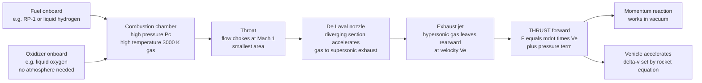

# 🚀 Rocket Propulsion Fundamentals

> [!abstract] TL;DR
> A **rocket** is the ultimate *throw-stuff-backward-to-go-forward* machine, and its defining trick is that it carries **both fuel and oxidizer onboard** — so it needs no atmosphere and works in the vacuum of space where jets and props are useless. Thrust is a pure **momentum reaction**: a combustion chamber makes hot, high-pressure gas, and a converging–diverging **de Laval nozzle** accelerates that gas to a hypersonic exhaust, giving $F = \dot m\,V_e + (P_e - P_a)A_e$ (momentum thrust plus pressure thrust). Its "fuel economy" is the **specific impulse** $I_{sp} = V_e/g_0$, measured in seconds — thrust per unit weight-flow of propellant. The cruel constraint of spaceflight is the **Tsiolkovsky rocket equation** $\Delta v = I_{sp}\,g_0\ln(m_0/m_f)$: because the achievable velocity change grows only with the **logarithm** of the mass ratio, reaching low Earth orbit ($\sim 9.4$ km/s including gravity and drag losses) demands mass ratios so large that a rocket is almost entirely propellant. That "tyranny of the rocket equation" is exactly why launchers must **stage** — dropping empty tanks and engines to sum $\Delta v$ across stages — and it dictates every choice of propellant, geometry, and mission profile in spaceflight.

---

## Intuition

**Analogy:** Stand on a **frictionless skateboard** with a stack of bricks and start hurling them backward, one after another. Each brick you throw shoves *you* the other way — Newton's third law, made physical. Throw bricks faster or throw heavier bricks, and you accelerate harder. A rocket is the same machine taken to a screaming extreme: instead of bricks it flings a **continuous jet of blazing-hot gas** out its tail at several kilometres per second, and the reaction lifts thousands of tonnes off the launch pad.

The magic ingredient — the thing that separates a rocket from a jet engine or a propeller — is that the rocket **brings its own oxygen**. A jet scoops air from the atmosphere to burn its fuel; take away the air and it dies. A rocket carries an **oxidizer** (liquid oxygen, say) right alongside its fuel, so it can burn and thrust in the total vacuum of space, where there is nothing to push against and nothing to breathe. It does not push against the ground or the air; it pushes against the **momentum of its own exhaust**.

But there is a cruel catch, and it governs everything about spaceflight. To go faster you must throw more gas backward — yet that gas is **propellant you have to carry**, and every kilogram of propellant is itself mass you must accelerate. Early in the burn your rocket is dragging along all the fuel it hasn't used yet. The result is that your final speed grows only with the **logarithm** of how much propellant you started with: to go twice as fast you need *far* more than twice the fuel. This is the "tyranny of the rocket equation," and it is why getting to orbit is so brutally hard, and why rockets throw away pieces of themselves on the way up.

---

## How It Works

### Core Mechanics

**1. Self-contained combustion — no atmosphere required.** A rocket stores a **fuel** (e.g. RP-1 kerosene, liquid hydrogen, or a solid rubber-like grain) and an **oxidizer** (e.g. liquid oxygen, or an oxidizer baked into a solid propellant). Because both reactants are onboard, combustion proceeds identically at sea level or in deep space. This is the fundamental distinction from an **air-breathing** engine (turbojet, ramjet), which must ingest atmospheric oxygen and therefore cannot operate in vacuum.

**2. Thrust is a momentum reaction.** Propellants burn in a **combustion chamber** at high pressure $P_c$ (tens to hundreds of bar) and high temperature (2,500–3,600 K), producing gas that the nozzle expels rearward at exhaust velocity $V_e$. By conservation of momentum, ejecting mass at rate $\dot m$ produces a forward force. Including the pressure imbalance at the nozzle exit plane, the full thrust is
$$F = \dot m\,V_e + (P_e - P_a)\,A_e,$$
where the first term is **momentum thrust** and the second is **pressure thrust** — $P_e$ is the exhaust pressure at the nozzle exit, $P_a$ the ambient pressure, and $A_e$ the exit area. In vacuum $P_a = 0$, so the pressure term *adds* to thrust; that is why the same engine produces more thrust in space than at sea level.

**3. The de Laval nozzle converts heat into directed speed.** A **converging–diverging (de Laval) nozzle** is the heart of a rocket. Hot subsonic gas accelerates through the **converging** section until it **chokes** at the **throat**, reaching Mach 1 exactly where the area is smallest. In the **diverging** section, a remarkable feature of *supersonic compressible flow* takes over: expanding the area now *accelerates* the gas further, converting thermal energy (high $T$, high $P$) into ordered kinetic energy (high $V_e$). The exhaust leaves at Mach 3–5+, hypersonic and cold. This is the same compressible-flow physics developed in [[Compressible_Flow_and_Gas_Dynamics]].

**4. Performance metrics — how good is the engine?**
- **Effective exhaust velocity** $c$: bundling the pressure term into an equivalent momentum term, $F = \dot m\,c$ where $c = V_e + (P_e - P_a)A_e/\dot m$.
- **Specific impulse** $I_{sp} = c/g_0 = F/(\dot m\,g_0)$: the single most important number in rocketry — thrust produced per unit **weight-flow** of propellant, measured in **seconds**. It is the rocket's "fuel economy." Solids give $\sim 250$ s, kerosene/LOX $\sim 300$–350 s, hydrogen/LOX $\sim 450$ s, and electric (ion) thrusters $3{,}000$–5,000 s (with tiny thrust). $g_0 = 9.80665\ \mathrm{m/s^2}$ here is a **defined constant**, not local gravity.
- **Characteristic velocity** $c^* = P_c A_t/\dot m$: measures the *combustion chamber* efficiency (propellant energy release), independent of the nozzle.
- **Thrust coefficient** $C_F = F/(P_c A_t)$: measures the *nozzle* efficiency. Together $F = C_F\,c^*\,\dot m$ neatly separates "how good is the burn" from "how good is the nozzle."

**5. The Tsiolkovsky rocket equation — the law of spaceflight.** Integrating $F = \dot m\,c$ over a burn (with $\dot m = -dm/dt$) gives the **rocket equation**:
$$\Delta v = c\,\ln\!\frac{m_0}{m_f} = I_{sp}\,g_0\,\ln\!\frac{m_0}{m_f},$$
where $m_0$ is the initial (fuelled) mass, $m_f$ the final (empty) mass, and $m_0/m_f$ the **mass ratio**. The achievable velocity change $\Delta v$ scales with the **logarithm** of the mass ratio — the defining brutality of spaceflight. Reaching low Earth orbit requires an orbital speed of $\sim 7.8$ km/s *plus* roughly $1.5$–2 km/s of **gravity, drag, and steering losses**, for a total $\Delta v \approx 9.4$ km/s. With $I_{sp} = 350$ s ($c \approx 3.43$ km/s) that demands a mass ratio of $e^{9.4/3.43} \approx 15.5$ — the vehicle must be about **93% propellant** by mass, leaving a razor-thin budget for structure, engines, and payload.

**6. Staging defeats the tyranny.** Tanks, engines, and structure impose a **structural coefficient** $\varepsilon = m_{\text{struct}}/(m_{\text{struct}}+m_{\text{prop}}) \approx 0.05$–0.10, which caps a single stage's usable mass ratio — a single stage simply cannot carry enough propellant *and* survive the rocket equation to reach orbit with useful payload. The solution is **staging**: stack rockets and **drop each empty stage** once its propellant is spent, so the upper stages need not accelerate dead tankage. Because $\Delta v$ adds across stages, $\Delta v_{\text{total}} = \sum_i I_{sp,i}\,g_0\ln(m_{0,i}/m_{f,i})$, multi-stage vehicles reach orbital velocity where a single stage falls short. This is why essentially every orbital launcher stages.

**7. Nozzle expansion and altitude.** A nozzle is **optimally expanded** when $P_e = P_a$ (all pressure thrust converted to momentum thrust). But $P_a$ falls from sea level to zero as the rocket climbs, so a fixed nozzle is a compromise: **over-expanded** low down ($P_e < P_a$, risking flow separation and side loads) and **under-expanded** high up ($P_e > P_a$, leaving performance on the table). Sea-level stages use short, low-expansion nozzles; vacuum stages use huge bell nozzles. **Thrust-to-weight ratio** $F/(m_0 g) > 1$ is mandatory for liftoff — the engine must out-push gravity — whereas upper stages can accept $F/W < 1$.

### Flow / Architecture



---

## Key Concepts

### Secondary Level

- **Throw mass back, go forward.** A rocket flings hot gas out the back at enormous speed; the gas pushes the rocket forward. That is the *only* thing making thrust — the same reason a fired gun kicks your shoulder.
- **It carries its own air.** Unlike a car or a jet, a rocket carries **oxidizer** as well as fuel, so it can burn in the vacuum of space where there is no oxygen. It does *not* push against the ground or the air.
- **Specific impulse = fuel economy.** The number $I_{sp}$ (in seconds) says how much "bang" you get per kilogram of propellant. Higher is better: hydrogen rockets sip fuel more efficiently than solid rockets.
- **The fuel problem is vicious.** To go faster you need more fuel — but that fuel is *heavy*, and you have to accelerate it too. So going twice as fast needs far more than twice the fuel. Most of a rocket is propellant.
- **Why rockets fall apart on the way up.** Because dragging empty fuel tanks is wasteful, rockets are built in **stages** and throw away each empty piece — lighter is faster.

### Undergraduate Level

- **Thrust equation.** $F = \dot m\,V_e + (P_e - P_a)A_e$: momentum thrust plus pressure thrust. In vacuum ($P_a=0$) thrust is highest; at sea level the atmosphere subtracts from it.
- **Specific impulse and effective exhaust velocity.** $I_{sp} = c/g_0 = F/(\dot m\,g_0)$, with $c = V_e + (P_e-P_a)A_e/\dot m$ the effective exhaust velocity. Note $g_0 = 9.80665$ m/s² is a *defined constant*.
- **Tsiolkovsky rocket equation.** $\Delta v = I_{sp}\,g_0\ln(m_0/m_f)$; $\Delta v$ grows only **logarithmically** with mass ratio $m_0/m_f$. LEO needs $\Delta v \approx 9.4$ km/s including losses.
- **The de Laval nozzle.** Converging section accelerates subsonic flow to Mach 1 at the throat; the diverging section then accelerates the now-supersonic flow further. Expansion ratio $A_e/A_t$ sets the exit Mach number and design altitude.
- **Chamber vs nozzle metrics.** $c^* = P_c A_t/\dot m$ rates combustion; $C_F = F/(P_c A_t)$ rates the nozzle; $F = C_F\,c^*\,\dot m$.
- **Staging.** Structural coefficient $\varepsilon$ limits a single stage; total $\Delta v$ is the sum over stages, each with its own $I_{sp}$ and mass ratio. Thrust-to-weight $> 1$ is required for liftoff.

### Graduate Level

- **Ideal rocket theory.** Assuming steady, isentropic, one-dimensional flow of a calorically perfect gas, $V_e = \sqrt{\dfrac{2\gamma}{\gamma-1}\dfrac{R T_c}{M}\left[1-\left(\dfrac{P_e}{P_c}\right)^{(\gamma-1)/\gamma}\right]}$ — exhaust velocity rises with chamber temperature $T_c$, with low molecular weight $M$ (why hydrogen wins), and with pressure ratio $P_c/P_e$.
- **Area–Mach relation and choking.** The quasi-1D $\dfrac{A}{A_t} = \dfrac{1}{M}\left[\dfrac{2}{\gamma+1}\left(1+\dfrac{\gamma-1}{2}M^2\right)\right]^{(\gamma+1)/2(\gamma-1)}$ fixes the expansion ratio for a target exit Mach number; the throat is sonic ($M=1$) at maximum mass flux.
- **Off-design nozzle behaviour.** Over-expanded nozzles ($P_e < P_a$) can suffer **shock-induced boundary-layer separation** and dangerous side loads; under-expanded flow ($P_e > P_a$) expands past the lip. Altitude-compensating concepts (aerospike, dual-bell) chase the ideal $P_e = P_a$ across the trajectory — connected to the shock structure of [[Shock_Waves_and_Supersonic_Flow]].
- **Optimal staging.** Minimising liftoff mass for a required $\Delta v$ across $N$ stages is a constrained optimisation (Lagrange multipliers); for identical $I_{sp}$ and $\varepsilon$, the optimum splits $\Delta v$ **equally** among stages, and there are diminishing returns beyond three stages.
- **Losses and the $\Delta v$ budget.** Real ascent $\Delta v$ integrates gravity loss $\int g\sin\gamma\,dt$, drag loss $\int (D/m)\,dt$, and steering loss; trajectory optimisation (e.g. gravity turns) minimises their sum, typically $1.5$–2 km/s to LEO.
- **Combustion and real-gas effects.** Chamber conditions come from chemical-equilibrium computation (frozen vs shifting equilibrium in the nozzle); $c^*$ efficiency, two-phase flow in solids, and finite-rate kinetics all degrade the ideal $I_{sp}$.

---

## Python Demo

```python
# Rocket Propulsion Fundamentals, visualised in four panels:
#   (A) TSIOLKOVSKY ROCKET EQUATION: delta-v vs mass ratio for several Isp,
#       with the LEO requirement (~9.4 km/s) marked -- the logarithmic "tyranny."
#   (B) THRUST vs ALTITUDE: F = mdot*Ve + (Pe - Pa)*Ae, decomposed into
#       momentum thrust and pressure thrust from sea level to vacuum.
#   (C) STAGING: achievable delta-v vs number of stages for a fixed overall
#       payload fraction -- why a single stage cannot reach orbit.
#   (D) THE TYRANNY: mass ratio REQUIRED for LEO vs specific impulse -- low Isp
#       demands astronomically large (impractical) mass ratios.
# Requires: numpy, matplotlib
import numpy as np
import matplotlib.pyplot as plt

g0 = 9.80665          # standard gravity used to define Isp [m/s^2]
dv_LEO = 9400.0       # delta-v to low Earth orbit incl. losses [m/s]

# ==================================================================
# (A) TSIOLKOVSKY: delta-v vs mass ratio for several specific impulses
#     delta-v = Isp * g0 * ln(m0/mf)
# ==================================================================
MR = np.linspace(1.0, 30.0, 500)                  # mass ratio m0/mf
Isp_set = [250, 300, 350, 450]                    # solid, kerolox, kerolox-vac, hydrolox
labels_A = ["Isp 250 s (solid)", "Isp 300 s (kerolox SL)",
            "Isp 350 s (kerolox vac)", "Isp 450 s (hydrolox)"]

print("=== Mass ratio required for LEO (delta-v = 9.4 km/s) ===")
for Isp in Isp_set:
    MR_req = np.exp(dv_LEO / (Isp * g0))
    prop_frac = 100.0 * (1.0 - 1.0 / MR_req)
    print(f"Isp = {Isp:3d} s -> mass ratio {MR_req:5.1f}"
          f"  ({prop_frac:.1f}% propellant by mass)")

# ==================================================================
# (B) THRUST vs ALTITUDE:  F = mdot*Ve + (Pe - Pa)*Ae
#     A kerolox-class engine; ambient pressure falls with altitude.
# ==================================================================
mdot = 250.0          # propellant mass flow [kg/s]
Ve   = 2900.0         # nozzle exit velocity [m/s]
Pe   = 70e3           # nozzle exit pressure [Pa] (fixed geometry)
Ae   = 1.0            # nozzle exit area [m^2]

alt_km = np.linspace(0, 60, 400)
# simple isothermal-ish atmosphere: Pa = P0 * exp(-h / H)
Pa = 101325.0 * np.exp(-alt_km / 7.0)             # ambient pressure [Pa]
F_mom  = mdot * Ve                                # momentum thrust (constant)
F_pres = (Pe - Pa) * Ae                           # pressure thrust (grows w/ alt)
F_tot  = F_mom + F_pres
Isp_alt = F_tot / (mdot * g0)                     # specific impulse vs altitude
print("\n=== Thrust: sea level vs vacuum ===")
print(f"Sea level: F = {F_tot[0]/1e3:6.1f} kN,  Isp = {Isp_alt[0]:5.1f} s")
print(f"Vacuum   : F = {F_tot[-1]/1e3:6.1f} kN,  Isp = {Isp_alt[-1]:5.1f} s"
      f"  (+{100*(F_tot[-1]/F_tot[0]-1):.1f}% thrust)")

# ==================================================================
# (C) STAGING: delta-v vs number of stages for fixed payload fraction.
#     N identical stages, structural coeff eps, overall payload frac PF.
#     Per-stage mass fraction above p = PF^(1/N);
#     dv = N * Ve * ln( 1 / (1 - (1-eps)*(1-p)) )
# ==================================================================
Isp_stage = 350.0
Ve_stage  = Isp_stage * g0
eps       = 0.08          # structural coefficient (8% dead mass per stage)
PF        = 0.01          # deliver 1% of liftoff mass to orbit
N_stages  = np.array([1, 2, 3, 4, 5])
dv_stages = []
for N in N_stages:
    p  = PF ** (1.0 / N)                           # mass fraction carried up per stage
    MR_i = 1.0 / (1.0 - (1.0 - eps) * (1.0 - p))   # per-stage mass ratio
    dv_stages.append(N * Ve_stage * np.log(MR_i))
dv_stages = np.array(dv_stages)
print("\n=== Staging (Isp 350 s, eps 0.08, 1% payload) ===")
for N, dv in zip(N_stages, dv_stages):
    ok = "reaches LEO" if dv >= dv_LEO else "falls short"
    print(f"{N} stage(s): delta-v = {dv/1000:5.2f} km/s  ({ok})")

# ==================================================================
# (D) THE TYRANNY: mass ratio required for LEO vs specific impulse
#     MR = exp(delta-v / (Isp * g0))
# ==================================================================
Isp_axis = np.linspace(150, 500, 400)
MR_needed = np.exp(dv_LEO / (Isp_axis * g0))
props = {"Solid": 250, "Kerolox": 330, "Hypergolic": 320, "Hydrolox": 450}

# ==================================================================
# PLOTS: 2 x 2 grid
# ==================================================================
fig, ax = plt.subplots(2, 2, figsize=(14, 10))
fig.suptitle("Rocket Propulsion: The Rocket Equation, Thrust, and Staging",
             fontsize=15, fontweight="bold")

# --- A. Tsiolkovsky rocket equation ---
axA = ax[0, 0]
colors = ["#d62728", "#ff7f0e", "#1f77b4", "#2ca02c"]
for Isp, lab, col in zip(Isp_set, labels_A, colors):
    axA.plot(MR, Isp * g0 * np.log(MR) / 1000.0, lw=2.4, color=col, label=lab)
axA.axhline(dv_LEO / 1000.0, ls="--", color="k", lw=1.3)
axA.annotate("LEO ~ 9.4 km/s", xy=(22, dv_LEO/1000.0),
             xytext=(16, dv_LEO/1000.0 + 1.2), fontsize=9,
             arrowprops=dict(arrowstyle="->"))
axA.set_xlabel("mass ratio  m0 / mf")
axA.set_ylabel("delta-v  [km/s]")
axA.set_title("A. Rocket equation: delta-v grows only with ln(mass ratio)")
axA.legend(fontsize=8, loc="lower right"); axA.grid(alpha=0.3)

# --- B. thrust vs altitude ---
axB = ax[0, 1]
axB.plot(alt_km, F_tot / 1e3, lw=2.6, color="#1f77b4", label="total thrust F")
axB.plot(alt_km, F_mom * np.ones_like(alt_km) / 1e3, ls="--",
         color="#7f7f7f", lw=1.6, label="momentum thrust (mdot*Ve)")
axB.fill_between(alt_km, F_mom/1e3, F_tot/1e3, color="#ffe0b0", alpha=0.7,
                 label="pressure thrust (Pe-Pa)*Ae")
axB.set_xlabel("altitude  [km]")
axB.set_ylabel("thrust  [kN]")
axB.set_title("B. Thrust rises with altitude (Pa drops toward vacuum)")
axB.legend(fontsize=8, loc="center right"); axB.grid(alpha=0.3)

# --- C. staging ---
axC = ax[1, 0]
bars = axC.bar(N_stages, dv_stages / 1000.0, color="#2ca02c", alpha=0.85,
               edgecolor="k")
for N, dv in zip(N_stages, dv_stages):
    bars[N-1].set_color("#d62728" if dv < dv_LEO else "#2ca02c")
axC.axhline(dv_LEO / 1000.0, ls="--", color="k", lw=1.3)
axC.annotate("LEO ~ 9.4 km/s", xy=(4.5, dv_LEO/1000.0),
             xytext=(3.0, dv_LEO/1000.0 + 1.0), fontsize=9,
             arrowprops=dict(arrowstyle="->"))
axC.set_xlabel("number of stages  N")
axC.set_ylabel("achievable delta-v  [km/s]")
axC.set_title("C. Staging: single stage falls short, staging reaches orbit")
axC.set_xticks(N_stages); axC.grid(alpha=0.3, axis="y")

# --- D. required mass ratio vs Isp (the tyranny) ---
axD = ax[1, 1]
axD.plot(Isp_axis, MR_needed, lw=2.6, color="#9467bd")
for name, Isp in props.items():
    mr = np.exp(dv_LEO / (Isp * g0))
    axD.scatter([Isp], [mr], color="#d62728", zorder=5)
    axD.annotate(f"{name}\n(Isp {Isp})", xy=(Isp, mr),
                 xytext=(Isp - 8, mr + 3), fontsize=8, ha="right")
axD.set_xlabel("specific impulse  Isp  [s]")
axD.set_ylabel("mass ratio required for LEO")
axD.set_title("D. The tyranny: low Isp demands huge mass ratios")
axD.grid(alpha=0.3)

plt.tight_layout(rect=[0, 0, 1, 0.95])
plt.show()
```

**What it shows.** Panel **A** is the rocket equation itself: $\Delta v$ curves upward but *bends over* — doubling the mass ratio does **not** double the velocity, because $\Delta v \propto \ln(m_0/m_f)$. Where each curve crosses the dashed LEO line ($9.4$ km/s), read off the required mass ratio: a hydrolox engine ($I_{sp}=450$) needs only $\sim 8.5$, while a solid ($I_{sp}=250$) needs an absurd $\sim 46$. Panel **B** decomposes **thrust** into a constant momentum term and a growing pressure term — as the rocket climbs and $P_a$ falls to zero, total thrust rises by 10–15%, the reason vacuum-rated engines outperform their sea-level thrust. Panel **C** is the payoff of **staging**: with realistic dead mass ($\varepsilon = 0.08$), a single stage (red) cannot reach $9.4$ km/s, but two or more stages (green) clear orbit comfortably — with diminishing returns past three. Panel **D** hammers the tyranny from the other side: the mass ratio *required* to reach LEO explodes as $I_{sp}$ falls, which is why high specific impulse is the holy grail of propulsion.

---

## Real-World Applications

> **Example — SpaceX Falcon 9.** A textbook illustration of every principle in this note. Its two **stages** each run kerosene/LOX **Merlin** engines: nine sea-level Merlins (short, low-expansion nozzles) lift off with thrust-to-weight above 1, then the first stage separates and a single **Merlin Vacuum** with a large bell nozzle (optimised for $P_a \approx 0$) pushes the payload to orbital velocity — staging in action, summing $\Delta v$ to clear the $\sim 9.4$ km/s barrier. The vehicle is roughly 95% propellant by mass at liftoff, exactly as the rocket equation demands, and the first stage's return-and-landing reserves precious $\Delta v$ that would otherwise go to payload.

- **Saturn V (Apollo).** Three stages: the first burned RP-1/LOX in five F-1 engines (still the highest-thrust liquid engines ever flown), the upper two burned high-$I_{sp}$ hydrogen/LOX. Staging is the *only* way it delivered astronauts to the Moon.
- **Space Shuttle Main Engine (RS-25) and solid boosters.** Hydrolox RS-25s achieve $\sim 450$ s $I_{sp}$ (efficient but low thrust-to-weight); paired **solid rocket boosters** trade efficiency for enormous thrust at liftoff — the classic high-thrust/low-$I_{sp}$ role of solids.
- **Upper-stage and apogee kick engines.** Hypergolic (self-igniting) storable propellants like MMH/N2O4 power satellite station-keeping and deep-space maneuvers where reliable restart matters more than peak $I_{sp}$.
- **Ion and Hall-effect thrusters.** Electric propulsion (Dawn, Starlink satellites, deep-space probes) reaches $I_{sp}$ of $3{,}000$–5,000 s — sipping propellant — but with milli-newton thrust, so it accelerates for months. The rocket equation rewards the huge exhaust velocity with tiny propellant mass.
- **Sounding rockets and hobby motors.** Solid grains provide simple, storable, high-thrust impulse for suborbital science and amateur rocketry, at the price of no throttle and no shutdown.

---

## Common Pitfalls

- **Thinking the rocket pushes against the air or the ground.** It does neither. Thrust is a **momentum reaction** against the ejected exhaust — which is exactly why rockets work in vacuum and jets do not. The atmosphere only *reduces* thrust via the $-P_a A_e$ term.
- **Confusing thrust with efficiency.** High thrust and high $I_{sp}$ are different virtues. Solid boosters and the F-1 have huge thrust but modest $I_{sp}$; ion thrusters have superb $I_{sp}$ but negligible thrust. You need thrust-to-weight $> 1$ to lift off *and* good $I_{sp}$ to reach orbit — hence staging with different engine types.
- **Reasoning linearly about the rocket equation.** $\Delta v$ grows only with the **logarithm** of mass ratio. Adding 10% more propellant does **not** add 10% more $\Delta v$; near the top of the mass-ratio curve you pay enormous propellant for tiny velocity gains. This misconception makes single-stage-to-orbit look easier than it is.
- **Ignoring the pressure-thrust term and nozzle mismatch.** A sea-level nozzle used in vacuum leaves performance unclaimed (under-expanded); a vacuum nozzle at sea level can **flow-separate** and generate destructive side loads (over-expanded). Nozzle expansion ratio must match the design altitude.
- **Forgetting gravity, drag, and steering losses.** Orbital velocity is $\sim 7.8$ km/s, but you must budget $\sim 9.4$ km/s to LEO. Sizing a rocket to the *orbital* speed alone will leave it stranded suborbital.
- **Using local gravity in $I_{sp}$.** The $g_0$ in $I_{sp} = c/g_0$ and $\Delta v = I_{sp}\,g_0\ln(m_0/m_f)$ is the **defined constant** $9.80665$ m/s², not the gravity at your altitude or planet. It is just a unit conversion baked into the "seconds" definition of specific impulse.

---

## Related Concepts

- [[Compressible_Flow_and_Gas_Dynamics]] — the converging–diverging (de Laval) nozzle, choking at the throat, and supersonic expansion that turns chamber heat into exhaust velocity all live here.
- [[Shock_Waves_and_Supersonic_Flow]] — over- and under-expanded nozzle behaviour, shock diamonds, and flow separation are governed by the shock physics of supersonic gas dynamics.
- [[Compressible_Flow_and_Propulsion]] — the mechanical-engineering companion tying nozzle flow, thrust, and propulsion cycles together for both air-breathing and rocket engines.
- [[Orbital_Mechanics_and_Celestial_Dynamics]] — where the $\Delta v$ produced by a rocket gets *spent*: orbital velocities, transfer maneuvers, and the mission $\Delta v$ budgets that size every vehicle.
- [[Newtons_Laws_and_Kinematics]] — the third-law momentum-reaction principle and the variable-mass dynamics from which the rocket equation is derived.
- [[Airfoils_and_Wing_Theory]] — the aerodynamics sibling; airfoils generate lift by turning air, while rockets generate thrust by ejecting mass — complementary faces of reaction-based flight.

This note is the propulsion cornerstone of the *Aerospace_Engineering / Propulsion* section. Its sibling notes carry the story forward: *Air_Breathing_Propulsion* (turbojets, turbofans, and ramjets that scoop atmospheric oxygen and cannot fly in vacuum), *Liquid_and_Solid_Rocket_Engines* (turbopumps, combustion cycles, grain geometry, and the hardware behind $\dot m$ and $P_c$), *Electric_and_Advanced_Propulsion* (ion, Hall, and nuclear-thermal concepts that trade thrust for extreme $I_{sp}$), *The_Rocket_Equation_and_Launch_Vehicles* (multi-stage $\Delta v$ budgeting, ascent trajectories, and vehicle sizing), and *Orbital_Mechanics_and_Astrodynamics* (spending that $\Delta v$ on orbits, transfers, and interplanetary trajectories).

---

## Review Questions

1. **Secondary:** A friend argues that a rocket must be pushing against the air to move, "like a swimmer pushing off a pool wall." Explain why this is wrong, why a rocket actually works *better* in the vacuum of space, and what it truly pushes against. Then explain in plain terms why a rocket has to carry something *besides* fuel.
2. **Undergraduate:** A single-stage rocket has $I_{sp} = 340$ s and must achieve $\Delta v = 9.4$ km/s to reach LEO. (a) Compute the required mass ratio $m_0/m_f$ and the propellant mass fraction. (b) If the structural coefficient is $\varepsilon = 0.08$, is a *useful payload* possible in a single stage — why or why not? (c) Show quantitatively how splitting the mission into two equal $\Delta v$ stages changes the required per-stage mass ratio, and explain why this helps.
3. **Graduate:** Starting from $F = \dot m\,c$ and $\dot m = -dm/dt$, derive the Tsiolkovsky rocket equation and identify every assumption. Then explain, using the ideal-nozzle exhaust-velocity relation, why liquid-hydrogen/LOX achieves higher $I_{sp}$ than kerosene/LOX despite hydrogen's lower flame temperature, and discuss the practical penalties (density, tankage, boil-off) that keep dense propellants competitive for first stages.

---

## Sources

- G. P. Sutton & O. Biblarz — *Rocket Propulsion Elements*, 9th ed. (Wiley, 2016) — the definitive reference on thrust, nozzles, specific impulse, and the rocket equation.
- P. G. Hill & C. R. Peterson — *Mechanics and Thermodynamics of Propulsion*, 2nd ed. (Addison-Wesley, 1992) — rigorous treatment of nozzle flow, chamber thermodynamics, and both air-breathing and rocket cycles.
- R. W. Humble, G. N. Henry & W. J. Larson — *Space Propulsion Analysis and Design* (McGraw-Hill, 1995) — systems-level design, $\Delta v$ budgeting, staging, and propellant selection.
- M. J. L. Turner — *Rocket and Spacecraft Propulsion*, 3rd ed. (Springer/Praxis, 2009) — accessible derivations of the rocket equation, staging, and electric propulsion.
- NASA Glenn Research Center — "Beginner's Guide to Rockets: Rocket Thrust, Specific Impulse, and the Ideal Rocket Equation," grc.nasa.gov.

---

#aerospace-engineering #propulsion #rocket #rocket-equation #specific-impulse
