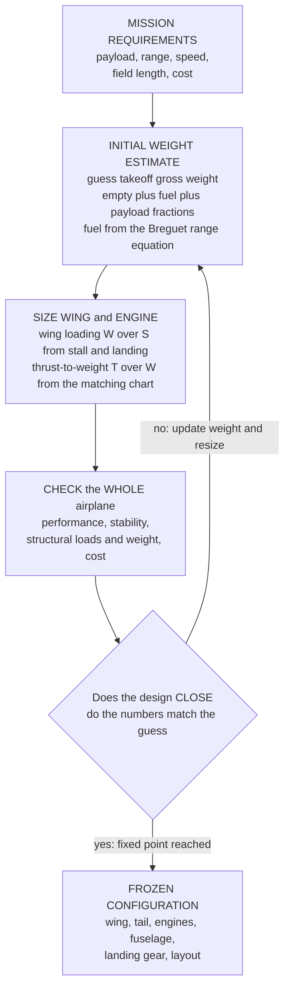

# ✈️ Aircraft Design and Configuration: Sizing and Shaping a Machine to a Mission

> [!abstract] TL;DR
> **Aircraft design** is the integrative craft where every aeronautical discipline meets: given a **mission** — carry *this* payload *this* far at *this* speed out of *this* runway for *this* cost — the designer must **size** and **shape** a single flying machine that satisfies all of it at once. The catch is that everything **couples**: a bigger wing lifts more but weighs and drags more; more fuel gives range but adds weight that needs more lift that needs a bigger wing that needs more fuel. So design proceeds in three phases — **conceptual → preliminary → detail** — and it **iterates**, because the answer feeds back into its own assumptions. Two pillars carry the conceptual phase. **(1) Initial weight sizing:** estimate **takeoff gross weight** $W_0$ from weight fractions — payload plus an **empty-weight fraction** (from statistical trends of past aircraft) plus a **fuel fraction** (from the **Breguet range equation**) — and *iterate to convergence*, because $W_0$ appears on both sides. The design "**closes**" when the guess equals the result: a **fixed point**. **(2) Wing and engine sizing:** plot the **constraint (matching) diagram** of **thrust-to-weight $T/W$ versus wing loading $W/S$**, where takeoff, climb, cruise, maneuver, and stall/landing each carve a boundary; the requirements together fence off a **feasible design space**, and the **design point** is its best corner — the smallest engine (min $T/W$) on the smallest wing (max $W/S$) that still meets everything. Then come the **configuration choices** — wing position, sweep, aspect ratio, and airfoil; tail arrangement (conventional, T-tail, canard, flying wing); engine number and placement; landing gear; fuselage layout — settled through **trade studies** and, in modern practice, **multidisciplinary design optimization (MDO)** driven by **CFD** and fast iteration. The deep truth is that there is **no free lunch**: range trades against payload, speed against efficiency, stability against agility. Design is not maximizing one number; it is **orchestrating a thousand coupled trade-offs** into a machine that *just barely works, everywhere, at once*. This is the **systems-engineering heart of aeronautics**, and the same mindset — requirements → size → iterate → optimize — governs spacecraft and every complex machine.

---

## Intuition

**Analogy:** Designing an aircraft is like solving a puzzle where **every piece pushes on every other**. Make the wings bigger for more lift and you have just added drag and weight. Add fuel for more range and you have added weight — which needs more lift, which needs a bigger wing, which needs more fuel, which needs... The design does not have a "start here, finish there" solution; it only **closes** when all these circular demands finally balance and the airplane you *drew* matches the airplane the numbers *demand*. That balance is a **fixed point**: a size that reproduces itself. So an engineer does not compute an airplane in one shot — they **guess** one. They start from a mission ("carry 180 passengers 6000 km"), sketch a plausible size, run the whole machine through its own equations, get a *different* size out, feed that back in, and repeat until the airplane stops changing. Only then does it exist.

That is why aircraft design is less about one clever part and more about **orchestrating trade-offs**. There is no single genius wing or magic engine; there is only a wing that is big enough to land slowly but small enough to cruise cheaply, an engine strong enough to climb on one engine out but light enough not to eat the payload, a fuselage roomy enough for the passengers but slim enough to slip through the air. Every discipline in this vault — aerodynamics, propulsion, structures, stability, control — hands the designer a demand, and design is the art of satisfying all of them **simultaneously and just barely**, because any margin you leave is weight, cost, or performance you gave away. A great aircraft is not the one that is best at any one thing; it is the one where a thousand competing requirements were balanced into a machine that works everywhere in its envelope, at once.

---

## How It Works

### Core Mechanics

Conceptual design turns a **mission** into a **sized, shaped configuration** through a converging loop. The mechanism has five moving parts.

1. **Start from the mission requirements.** Everything begins with what the aircraft must *do*: **payload** (passengers, cargo), **range**, **cruise speed** and altitude, **field length** (takeoff and landing runway), **climb** and one-engine-out gradients, plus economic and regulatory constraints — **cost**, **certification**, noise, emissions. These are not design choices; they are the *boundary conditions* the design must satisfy. A mission is written as a **profile** — warm-up, takeoff, climb, cruise, loiter/reserve, descent, land — each segment burning fuel and setting a requirement.

2. **Estimate takeoff gross weight $W_0$ — and iterate, because it appears on both sides.** The whole airplane's weight is a bookkeeping identity: $W_0 = W_{\text{crew}} + W_{\text{payload}} + W_{\text{fuel}} + W_{\text{empty}}$. Crew and payload are *fixed* by the mission. Fuel and empty weight are written as **fractions of $W_0$ itself**, giving the sizing equation
$$W_0 = \dfrac{W_{\text{crew}} + W_{\text{payload}}}{1 - \left(\tfrac{W_f}{W_0}\right) - \left(\tfrac{W_e}{W_0}\right)}.$$
The **empty-weight fraction** $W_e/W_0$ comes from **statistical trends** of historical aircraft (a mild function of $W_0$ — big jets run ~0.45–0.55). The **fuel fraction** $W_f/W_0$ comes from multiplying the mission segments' fuel fractions, with the cruise leg set by the **Breguet range equation**. Because $W_e/W_0$ depends on $W_0$, you must **guess $W_0$, compute the right-hand side, and repeat** until the answer stops moving — the design **closes** at a fixed point (the Python demo below shows exactly this convergence).

3. **The Breguet range equation — why fuel and range couple.** For a jet in cruise, range is $R = \dfrac{V}{c}\,\dfrac{L}{D}\,\ln\!\dfrac{W_i}{W_{i+1}}$, where $V$ is speed, $c$ is **thrust-specific fuel consumption**, $L/D$ is the **lift-to-drag ratio**, and $W_i/W_{i+1}$ is the start/end cruise weight ratio. Inverted, it tells you the fuel fraction a given range demands — and it rewards high **aerodynamic efficiency** ($L/D$) and efficient engines ($c$). This single equation is why long-range aircraft chase slender, high-aspect-ratio wings and high-bypass turbofans, and why *range trades directly against payload* (both are weight the fuel must haul).

4. **Size the wing and engine with the constraint (matching) diagram.** With $W_0$ known, two numbers define the aircraft's character: **wing loading** $W/S$ (weight per wing area — how "wing-heavy" it is) and **thrust-to-weight** $T/W$ (installed thrust per weight — how "engine-heavy" it is). Each requirement becomes a curve on a $T/W$-vs-$W/S$ plot: **stall/landing** sets a *maximum* $W/S$ (a vertical wall — land slowly, you need a big wing); **takeoff field length** demands $T/W$ rising with $W/S$; **cruise** and **climb** (especially the one-engine-out gradient) each carve a curve saying $T/W$ must be *at least* this. The requirements together fence off a **feasible design space**, and the **design point** is its best corner: the **smallest engine (minimum $T/W$)** on the **smallest wing (maximum $W/S$)** that still satisfies every constraint. Typically the wing is sized by **landing/stall** and the engine by **cruise or one-engine-out climb** — you can read which requirement is "binding" straight off the chart.

5. **Choose the configuration, then check and iterate the whole airplane.** With size fixed, the *shape* is chosen through **trade studies**: **wing** position (high/mid/low), **sweep** (delays transonic drag), **aspect ratio** (high cuts induced drag, costs structural weight), and **airfoil**; **tail** arrangement (conventional, **T-tail**, **canard**, or **flying wing**); **engine** number and placement (wing-mounted, aft-fuselage); **landing gear**; and **fuselage** layout. Each choice ripples: a heavier tail moves the center of gravity, changing stability and control-surface sizing; a thinner wing raises drag; a bigger engine shifts weight and balance. So the design is **re-checked** — performance, stability, structural loads, weight, cost — and the loop runs again. **Preliminary design** refines this with real aerodynamics (**CFD**, wind tunnels) and structural analysis; **detail design** then defines every rib, fastener, and system. Modern practice folds the whole loop into **multidisciplinary design optimization (MDO)**, letting the computer trade aerodynamics, structures, propulsion, and controls *simultaneously* toward a mass- and cost-optimal design.

### Flow / Architecture



---

## Key Concepts

### Secondary Level

- **Design starts with a job, not a shape.** Every aircraft begins as a **mission**: carry so many people so far, so fast, out of a runway this long, for a price. The designer's task is to build the machine that does *exactly* that — no more, no less.
- **Everything is connected.** Make the wings bigger and the plane gets heavier and draggier. Add fuel for more range and it gets heavier, so it needs more lift, so it needs bigger wings. You cannot change one thing without changing everything — that is the whole difficulty and the whole fun.
- **The design "closes."** Because the answer feeds back into the question, you cannot compute an airplane in one go — you **guess** a size, run the numbers, get a new size, and repeat until it stops changing. When the airplane you drew matches the numbers, the design has *closed*.
- **Big wing or big engine.** Two dials set an aircraft's personality: how much wing it has (for slow, safe landings and gentle takeoffs) and how much engine (for climb and speed). More of either is safer but heavier and costlier — the designer picks the smallest of both that still does the job.
- **No free lunch.** You cannot have long range *and* huge payload *and* high speed *and* a short runway *and* low cost all at once. Design is choosing the **best balance**, not winning at everything.

### Undergraduate Level

- **The takeoff-weight sizing equation.** $W_0 = (W_{\text{crew}} + W_{\text{payload}})\,/\,(1 - W_f/W_0 - W_e/W_0)$. Payload/crew are fixed; **fuel** and **empty** fractions are functions of $W_0$, so this is solved by **fixed-point iteration** — the mathematical face of "the design closes."
- **Empty-weight fraction from statistics.** $W_e/W_0 = A\,W_0^{\,C}$ with regression constants $A, C$ per aircraft class (e.g. jet transport $A\approx 1.02,\ C\approx -0.06$ in pounds). It captures how structural efficiency scales — bigger aircraft are a *smaller* fraction empty.
- **Fuel fraction via Breguet.** Multiply segment mass fractions; the cruise leg uses $\frac{W_{i+1}}{W_i} = \exp\!\big(\!-\frac{R\,c}{V\,(L/D)}\big)$ and loiter uses $\exp\!\big(\!-\frac{E\,c}{L/D}\big)$. A reserve/trapped-fuel factor (~1.06) tops it off.
- **Wing loading $W/S$.** Sets stall speed $V_{\text{stall}} = \sqrt{\tfrac{2\,(W/S)}{\rho\,C_{L,\max}}}$, takeoff/landing distance, ride quality, and cruise altitude. **High $W/S$** = small efficient wing but fast, long takeoff/landing; **low $W/S$** = big wing, slow landing, gusty ride.
- **Thrust-to-weight $T/W$.** Sets climb rate, acceleration, ceiling, and one-engine-out safety. Transports run $T/W \approx 0.25$–$0.35$; fighters exceed $1.0$.
- **The constraint/matching diagram.** On $T/W$-vs-$W/S$ axes, master equation
$$\frac{T}{W} = \frac{q\,C_{D0}}{(W/S)} + \frac{(W/S)}{q\,\pi e\, AR}\,n^2 + \frac{1}{V}\frac{dh}{dt} + \frac{1}{g}\frac{dV}{dt}$$
generates cruise, climb, and maneuver curves; stall/landing gives a vertical $W/S$ limit; takeoff gives a rising line. The **feasible region** is above all curves and left of the wall; the **design point** is its min-$T/W$, max-$W/S$ corner.
- **The drag polar.** $C_D = C_{D0} + \frac{C_L^2}{\pi e\, AR}$ — parasite plus induced drag — is the aerodynamic input the whole sizing rests on; maximum $L/D$ occurs where the two drag terms are equal.

### Graduate Level

- **Coupled convergence and design closure.** The sizing loop is a nonlinear fixed-point map $W_0^{(k+1)} = f(W_0^{(k)})$; convergence is fast when $|f'| < 1$, which holds because $W_e/W_0$ varies weakly with $W_0$. Preliminary design nests *inner* loops (aero–structure aeroelastic tailoring, propulsion cycle matching) inside this *outer* weight loop — a hierarchy of fixed points.
- **Constraint analysis as constrained optimization.** The matching diagram is literally a 2-D **feasible region** defined by inequality constraints; the design point is a **KKT** solution — the optimum sits where the active constraints' gradients balance the objective (usually minimize $T/W$, i.e. thrust/fuel/cost, or a weighted cost function). Which constraints are *active* tells you what limits the design.
- **Multidisciplinary design optimization (MDO).** Formal coupling of aerodynamics, structures, propulsion, controls, and trajectory into one optimization, handled by architectures such as **MDF** (multidisciplinary feasible), **IDF** (individual discipline feasible), and **collaborative optimization**; **adjoint-based** gradients make high-dimensional shape optimization tractable (thousands of design variables via CFD). This is the modern industrialization of the hand-iterated loop.
- **Aeroelastic and load-driven sizing.** Structural weight is set by the **flight envelope** (V-n diagram) and by **aeroelastic** constraints — divergence, control reversal, and **flutter** — which couple the aerodynamic and structural design and can move the optimum away from the pure aerodynamic sweet spot.
- **Stability–performance trade and relaxed static stability.** Center-of-gravity placement, tail volume coefficients, and static margin set stability *and* trim drag; **relaxed static stability** with fly-by-wire trades natural stability for reduced trim drag and agility — a deliberate coupling of the controls and performance disciplines.
- **Sensitivity, robustness, and margins.** Real design carries **margins** for weight growth, uncertainty, and off-design conditions; sensitivity of $W_0$ to a change in payload, range, $L/D$, or $c$ (the "growth factor") quantifies how a local change ripples through the whole vehicle — a small empty-weight overrun can *snowball* into a large $W_0$ increase.

---

## Python Demo

```python
# AIRCRAFT CONCEPTUAL DESIGN IN ONE FIGURE, numpy + matplotlib only.
#
#   Panel A -- the CONSTRAINT / MATCHING DIAGRAM: thrust-to-weight (T/W) vs
#              wing loading (W/S). Each mission requirement carves a curve:
#              takeoff, climb and cruise say "T/W must be AT LEAST this",
#              stall/landing says "W/S must be AT MOST this". The FEASIBLE
#              region is the sliver satisfying all of them; the DESIGN POINT
#              is its best corner -- the SMALLEST engine (min T/W) on the
#              SMALLEST wing (max W/S) that still meets every requirement.
#
#   Panel B -- the DESIGN "CLOSING" as a FIXED POINT: takeoff gross weight is
#              guessed, used to estimate the empty-weight fraction, which
#              resets the weight, and so on. Because bigger planes need more
#              structure to carry themselves, the estimate chases its own tail
#              until it CONVERGES -- the design closes.
import numpy as np
import matplotlib.pyplot as plt

# =====================================================================
# (A) CONSTRAINT / MATCHING DIAGRAM  (all mapped to sea-level static T/W)
# =====================================================================
rho_SL = 1.225                        # sea-level density [kg/m^3]

# --- stall / landing: a MAX wing loading (a vertical wall) ---
CLmax_land = 2.40                     # max lift coeff, full flaps
V_app      = 62.0                     # approach / stall speed [m/s]
WS_max = 0.5 * rho_SL * V_app**2 * CLmax_land          # [N/m^2]

# --- takeoff field length: rising line (takeoff-parameter correlation) ---
K_TO = 25000.0                        # takeoff constant [N/m^2]
TW_takeoff = lambda WS: WS / K_TO

# --- cruise: U-shaped curve, mapped to sea-level static T/W ---
CD0, AR, e_cr = 0.018, 9.0, 0.80
k_cr  = 1.0 / (np.pi * e_cr * AR)                      # induced-drag factor
q_cr  = 0.5 * 0.365 * 230.0**2                         # cruise dyn. pressure (11 km, 230 m/s)
beta  = 0.95                          # cruise weight / takeoff weight
alpha = 0.23                          # cruise thrust / sea-level static thrust (lapse)
TW_cruise = lambda WS: (beta / alpha) * (q_cr * CD0 / WS + k_cr * WS / q_cr)

# --- climb gradient (one-engine-out 2nd segment): U-shaped, dirtier drag ---
CD0_cl, e_cl = 0.030, 0.75
k_cl  = 1.0 / (np.pi * e_cl * AR)
q_cl  = 0.5 * rho_SL * 90.0**2                         # climb dyn. pressure
G     = 0.024                         # required climb gradient (2.4%)
OEI   = 2.0                           # twin, one engine out -> survivor supplies ~2x
TW_climb = lambda WS: OEI * (q_cl * CD0_cl / WS + k_cl * WS / q_cl + G)

WS       = np.linspace(1500, WS_max, 500)
envelope = np.maximum.reduce([TW_takeoff(WS), TW_cruise(WS), TW_climb(WS)])
i_star   = np.argmin(envelope)        # best (min-T/W) feasible corner
WS_star, TW_star = WS[i_star], envelope[i_star]

# =====================================================================
# (B) WEIGHT ITERATION: does the design CLOSE? (Raymer takeoff-weight buildup)
#     W0 = (Wcrew + Wpayload) / (1 - Wf/W0 - We/W0),   We/W0 = A * W0^C
# =====================================================================
W_fixed = 40000.0                     # crew + payload [lb]  (~180 pax)
Wf_frac = 0.280                       # mission fuel fraction (Breguet-based)
A, C    = 1.02, -0.06                 # empty-weight trend, jet transport (W0 in lb)

empty_frac = lambda W0: A * W0**C

W0, history = 150000.0, [150000.0]    # initial GUESS [lb]
for _ in range(12):
    W0 = W_fixed / (1.0 - Wf_frac - empty_frac(W0))
    history.append(W0)
history       = np.array(history)
W0_converged  = history[-1]

# ------------------------------ plotting ------------------------------
fig, (axA, axB) = plt.subplots(1, 2, figsize=(14, 6))
fig.suptitle("Aircraft Conceptual Design: sizing to a mission, and the design closing",
             fontsize=13, fontweight="bold")

# Panel A: constraint / matching diagram
axA.plot(WS, TW_takeoff(WS), color="#ff7f0e", lw=2.2, label="takeoff field length")
axA.plot(WS, TW_cruise(WS),  color="#1f77b4", lw=2.2, label="cruise")
axA.plot(WS, TW_climb(WS),   color="#2ca02c", lw=2.2, label="climb gradient (one-engine-out)")
axA.axvline(WS_max, color="#d62728", lw=2.2, label="stall / landing (max W/S)")
axA.fill_between(WS, envelope, 0.6, color="#9edae5", alpha=0.45)     # feasible region
axA.text(3100, 0.44, "FEASIBLE\nDESIGN SPACE", fontsize=10, color="#0b5563",
         fontweight="bold", ha="center")
axA.scatter([WS_star], [TW_star], color="k", zorder=6, s=70)
axA.annotate(f"DESIGN POINT\nW/S = {WS_star:.0f} N/m^2\nT/W = {TW_star:.2f}",
             xy=(WS_star, TW_star), xytext=(WS_star - 2700, TW_star + 0.12),
             fontsize=8.5, fontweight="bold",
             arrowprops=dict(arrowstyle="->", lw=1.3))
axA.set_xlim(1500, WS_max * 1.05)
axA.set_ylim(0.10, 0.55)
axA.set_xlabel("wing loading  W/S  [N/m^2]   (larger -> smaller wing)")
axA.set_ylabel("thrust-to-weight  T/W   (larger -> bigger engine)")
axA.set_title("A. Constraint / matching diagram\nevery requirement carves the feasible space")
axA.legend(loc="upper left", fontsize=8)
axA.grid(alpha=0.3)

# Panel B: weight convergence
axB.plot(range(len(history)), history / 1000, "o-", color="#1f77b4", lw=2.2)
axB.axhline(W0_converged / 1000, ls="--", color="#d62728", lw=1.5,
            label=f"converged W0 = {W0_converged/1000:.1f}k lb")
axB.set_xlabel("iteration")
axB.set_ylabel("takeoff gross weight  W0  [thousand lb]")
axB.set_title("B. The design 'closes': W0 as a fixed point\nW0 = (crew+payload) / (1 - Wf/W0 - We/W0)")
axB.legend(loc="upper right", fontsize=9)
axB.grid(alpha=0.3)

plt.tight_layout(rect=[0, 0, 1, 0.95])
plt.show()

# ------------------------------ console ------------------------------
print(f"stall/landing  -> max wing loading  W/S = {WS_max:7.0f} N/m^2")
print(f"design point   -> W/S = {WS_star:7.0f} N/m^2 ,  T/W = {TW_star:.3f}")
print(f"weight closes  -> W0  = {W0_converged:9,.0f} lb   "
      f"(empty frac {empty_frac(W0_converged):.3f}, fuel frac {Wf_frac:.3f})")
```

Running this prints the sizing results and draws two panels that *are* conceptual design. **Panel A** is the **constraint (matching) diagram**: the orange **takeoff** line rises with $W/S$, the blue **cruise** and green **one-engine-out climb** curves each set a floor on $T/W$, and the red vertical wall is the **stall/landing** limit on $W/S$. The shaded sliver is the **feasible design space**, and the black dot is the **design point** — here the wing is pushed right up against the **landing/stall** wall (smallest wing) while **cruise** sets the required thrust (smallest engine that still meets it). Change the mission — a shorter runway drags the wall left, a hotter climb requirement lifts the green curve — and the whole feasible region and its best corner move. **Panel B** shows the design **closing**: from a deliberately wrong initial guess of 150k lb, the takeoff-weight estimate chases its own tail and **converges in a few iterations** to a self-consistent ~177k lb — the **fixed point** at which the airplane you assumed equals the airplane the numbers demand. That convergence, and that feasible-region corner, are the two computational hearts of every conceptual design.

---

## Real-World Applications

> **Example — the Boeing 737 vs the Airbus A320 family, one constraint diagram apart.** Both were sized to nearly the same mission — ~150–180 passengers, ~5000–6000 km, common-length runways — so both land near the same spot on a matching diagram, yet their *configuration* choices diverged and compounded over decades. The 737's low-slung, wing-mounted engines (a 1960s low-wing choice) left little ground clearance, which constrained fan diameter (bypass ratio, hence cruise fuel burn) and forced the flattened nacelles and re-cambered inlets of the later MAX — a fifty-year ripple from one early configuration decision. The A320's taller gear and later start gave more clearance for larger-diameter, higher-bypass fans. Same mission, same sizing arithmetic, different frozen configuration — and the trade-offs echoed through every derivative. This is design closure and configuration lock-in in the real economy of aviation.

- **Airliner sizing and the range–payload chart.** Every commercial jet ships with a **payload-range diagram** — the direct output of the Breguet-plus-weight sizing loop — showing how carrying more passengers forces trading away range (fuel volume is fixed, so payload and fuel weight compete). Airlines route-plan directly off this curve; it *is* the sizing equation made operational.
- **Fighter design and the maneuver constraint.** Combat aircraft add **sustained-turn** ($n>1$) and **specific-excess-power** constraints to the matching diagram, driving $T/W$ above 1.0 and wing loadings and sweeps unlike any transport. The F-16's relaxed static stability plus fly-by-wire is a textbook stability-for-agility trade read straight off the constraint analysis.
- **Bizjets, regionals, and field-length lock.** Aircraft sold on the promise of operating from short or high-altitude runways are often **wing-sized by the stall/landing wall** (as in the demo), accepting a larger, slightly draggier wing to guarantee the field performance the mission demands.
- **Blended-wing-body and novel configurations.** NASA/Boeing X-48 and modern BWB studies revisit the *configuration* branch entirely — merging wing and fuselage for higher $L/D$ — but must re-close the whole design against stability, cabin layout, and evacuation constraints, showing how a shape change re-opens every coupled requirement.
- **MDO in industry.** Airframers run **adjoint-based CFD shape optimization** and coupled aero-structural MDO over thousands of variables to shave drag counts and structural pounds — the industrial descendant of the hand-iterated loop, and exactly where gradient-based optimization meets aircraft design.
- **Spacecraft and launch vehicles.** The identical mindset — mission $\Delta v$ and payload → mass fractions → iterate the rocket equation to closure → configure staging — sizes launch vehicles, showing that "requirements → size → iterate → optimize" is the systems-engineering backbone across all of aerospace.

---

## Common Pitfalls

- **Trying to compute the airplane in one pass.** The sizing equation has $W_0$ on both sides; treating it as a one-shot calculation (or forgetting that $W_e/W_0$ depends on $W_0$) gives a wrong or non-converging answer. Design **closes** by **iteration** to a fixed point — you must loop until the guess reproduces itself.
- **Optimizing one discipline in isolation.** The single deadliest mistake. Picking the aerodynamically "best" wing, the lightest structure, or the most efficient engine *independently* almost always makes the whole vehicle worse, because each choice shifts weight, balance, drag, and loads elsewhere. Aircraft design is **multidisciplinary**; the optimum of the system is not the sum of the optima of its parts.
- **Confusing "biggest/fastest/longest" with "best."** There is **no free lunch**: range trades against payload, speed against efficiency, stability against agility, low field length against cruise efficiency. A design that maximizes one metric usually violates another requirement. The goal is a **balanced** point that satisfies *all* constraints, not a record in one.
- **Ignoring which constraint is binding.** Reading the matching diagram carelessly, engineers oversize the wing when the engine is the limit (or vice versa). Always identify the **active constraint** — is the wing set by landing or by cruise? is the engine set by climb or by takeoff? — because that is where design effort and margin actually pay off.
- **Underestimating the growth factor (weight snowball).** Because everything is carried by the fuel that is carried by the structure, a small local weight overrun **amplifies**: adding a kilogram of payload or empty weight can add several kilograms of $W_0$ once fuel and structure grow to haul it. Optimistic component estimates compound into a badly oversized aircraft.
- **Freezing the configuration too early.** Locking the wing position, engine placement, or tail type before the design has closed bakes in constraints that echo through every derivative for decades (see the 737 example). Conversely, leaving *everything* open forever never converges. Knowing *when* to freeze each choice is the systems-engineering craft.
- **Treating margins as waste.** Every stability margin, structural safety factor, and reserve-fuel allowance is weight and cost — but cutting them to "optimize" removes the buffer against uncertainty, off-design conditions, and growth. Mature design **budgets** margins deliberately rather than eliminating them.

---

## Related Concepts

*This note is the integrative capstone of the Flight Mechanics and Performance section; its sibling notes supply the disciplines that the design loop balances. **Aircraft_Performance** provides the range, climb, and field-length equations (Breguet, takeoff/landing distance) that become the constraint curves here. **Aircraft_Stability_and_Flight_Dynamics** sets the tail sizing, center-of-gravity limits, and static-margin trades behind the configuration choices. **Airframe_Loads_and_the_Flight_Envelope** (the V-n diagram) drives the structural weight that feeds the empty-weight fraction. **Aerospace_Structures_and_Airframes** turns those loads into the lightweight airframe whose mass closes the sizing loop. And **Spacecraft_Systems_Engineering** shows the same requirements-to-closure mindset applied beyond the atmosphere.*

**The aerospace disciplines this design balances**
- [[Aerospace_Engineering_Overview]] — the vault hub; this note is Pillar 3's systems-engineering capstone where all six pillars are integrated into a vehicle
- [[Airfoils_and_Wing_Theory]] — the wing geometry (aspect ratio, sweep, airfoil) chosen in the configuration step, and the source of the lift and drag the sizing rests on
- [[Air_Breathing_Propulsion]] — the engine that thrust-to-weight $T/W$ sizes, and the thrust-specific fuel consumption $c$ that sets the Breguet fuel fraction
- [[Boundary_Layers_and_Aerodynamic_Drag]] — where parasite drag $C_{D0}$ comes from, the input to the drag polar and the cruise/climb constraint curves

**Aerodynamic foundations (Fluid Dynamics vault)**
- [[Lift_Drag_and_Aerodynamics]] — the drag polar $C_D = C_{D0} + C_L^2/(\pi e\,AR)$ and $L/D$ ratio that the Breguet equation and matching diagram both consume
- [[Aerodynamics_and_Aerospace_Applications]] — the CFD and wind-tunnel methods that turn conceptual sizing into a validated preliminary design

**Design method and optimization (cross-vault)**
- [[Machine_Design_Principles]] — the general engineering-design discipline (requirements, iteration, safety factors, trade studies) of which aircraft design is the ultimate coupled example
- [[KKT_Conditions]] — the constrained-optimization theory that *is* the matching diagram: the design point is a KKT solution on the feasible region's active constraints
- [[Gradient_Descent]] — the gradient-based engine behind modern adjoint MDO, which optimizes shape and sizing over thousands of variables
- [[Technical_Roadmapping]] — the software-world analog of requirements-driven, iteratively-closed planning: the same systems-engineering discipline of turning goals into a convergent design

---

## Review Questions

**Secondary**
1. An engineer is told to design an aircraft to "carry 180 passengers 6000 km out of a 2500 m runway." Explain, in your own words, why the engineer cannot just calculate the airplane in one step and instead has to **guess a size and repeat**. Give one example of how making the wings bigger forces *other* parts of the design to change.

**Undergraduate**
2. On a thrust-to-weight ($T/W$) versus wing-loading ($W/S$) constraint diagram, the stall/landing requirement is a vertical line, the takeoff requirement is a line rising to the right, and cruise and climb are curves. (a) Shade the feasible region and explain why the best design point sits at its **minimum-$T/W$, maximum-$W/S$ corner**. (b) If the mission adds a *shorter* landing runway, which curve moves and which way, and what happens to the required wing size? (c) Using the Breguet range equation, explain why increasing required range forces the fuel fraction — and therefore $W_0$ — up.

**Graduate**
3. A preliminary design converges to a takeoff gross weight $W_0$, then a structures review reports the wing will come in 8% heavier than assumed. (a) Explain, via the sizing equation and the "growth factor," why the final $W_0$ increase will be *larger* than 8%. (b) Frame the conceptual-design loop as a constrained optimization: what is the objective, what are the active constraints at the design point, and how does this map onto the KKT conditions? (c) Discuss one way this hand-iterated loop is generalized by multidisciplinary design optimization (MDO), and one coupling (e.g. aeroelastic, stability-trim, or engine-integration) that would be missed by optimizing each discipline separately.

---

## Sources

- D. P. Raymer — *Aircraft Design: A Conceptual Approach*, 6th ed. (AIAA Education Series, 2018) — the standard conceptual-design text; source of the weight-fraction sizing method and the constraint diagram
- J. D. Anderson — *Aircraft Performance and Design* (McGraw-Hill, 1999) — performance foundations and the design-integration viewpoint
- J. Roskam — *Airplane Design* (Parts I–VIII) (DARcorporation) — the classic multi-volume treatment of preliminary sizing and configuration layout
- E. Torenbeek — *Synthesis of Subsonic Airplane Design* (Delft University Press / Springer, 1982) — rigorous synthesis of aerodynamics, structures, and weights in the design loop
- J. R. R. A. Martins & A. Ning — *Engineering Design Optimization* (Cambridge University Press, 2021) — modern MDO methods, adjoint gradients, and coupled architectures

---

#aerospace-engineering #aircraft-design #conceptual-design #wing-loading #systems-engineering
