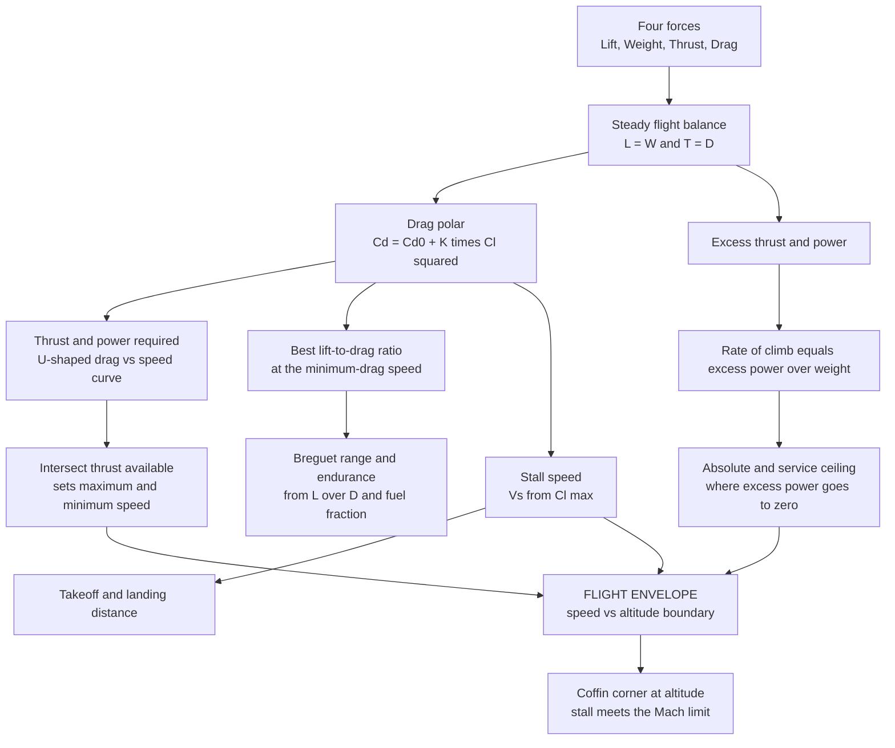

# ✈️ Aircraft Performance

> [!abstract] TL;DR
> Once you know an aircraft's **lift**, **drag**, and **thrust**, performance is just careful **bookkeeping of a tug-of-war**. Steady flight demands two balances: **lift beats weight** ($L=W$) so it stays up, and **thrust beats drag** ($T=D$) so it holds speed. The single object that unlocks everything is the **drag polar**, $C_D = C_{D,0} + \dfrac{C_L^2}{\pi\,AR\,e}$ — parasite drag that grows with speed, plus induced drag that grows at low speed. Turn the polar into a **thrust-required curve** (drag versus airspeed, the classic U-shape) and where it crosses **thrust available** you read off **maximum and minimum speed**; its lowest point is the **minimum-drag speed**, where the **lift-to-drag ratio** peaks — a glider with $L/D=50$ glides 50 km for every 1 km it sinks, and a jet cruises near this point for best range. The **stall speed** $V_s=\sqrt{2W/(\rho S C_{L,\max})}$ sets the slow-flight limit, takeoff and landing distances, and turn margins. **Leftover thrust** (excess power over weight) becomes **rate of climb**, vanishing at the **ceiling**; the **Breguet equations** convert $L/D$ and fuel fraction into **range and endurance**. Draw all these limits — stall, thrust, structure, and Mach — in the speed-altitude plane and you have the **flight envelope**, whose "coffin corner" at altitude is where stall speed and the Mach limit squeeze together. Performance analysis is the first thing a designer or airline computes: it sizes the aircraft, sets payload-range and fuel burn, and fixes the safety margins.

---

## Intuition

**Analogy:** Think of a cruising aircraft as frozen in the middle of two simultaneous **tug-of-war** contests. In the vertical rope, **lift pulls up** against **weight pulling down**; in the horizontal rope, **thrust pulls forward** against **drag pulling back**. To fly straight and level, both ropes must be dead even — lift ties weight, thrust ties drag. Everything a pilot cares about is what happens when you give one side a little extra: the **leftover thrust** (thrust minus drag) is spare energy that the aircraft spends buying altitude — that is your **climb**; the **leftover lift** you can still summon before the wing gives up sets **how slowly you can safely fly**, the stall.

The magic number that ties the two ropes together is the **lift-to-drag ratio**, $L/D$. It is literally the **glide number**: a sailplane with $L/D = 50$ travels 50 kilometres forward for every 1 kilometre it descends, and even with engines off it is the ratio that decides how far you coast. Fly at the airspeed where $L/D$ is largest and drag is at its minimum, so the least thrust — and the least fuel — is needed to stay up. From that one balance, plus how much fuel you carry and how hard gravity pulls, drop out all the questions the discipline exists to answer: **how far** (range), **how high** (ceiling), **how fast** (max speed), **how long** (endurance), and **how short a runway** (field length). Performance is aerodynamics and propulsion, cashed out in kilometres, minutes, and litres.

---

## How It Works

### Core Mechanics

**1. The two balances of steady flight.** For unaccelerated, level flight the four forces cancel in pairs: **$L = W$** (lift equals weight) and **$T = D$** (thrust equals drag). Break the vertical balance and the aircraft climbs or descends; break the horizontal balance and it speeds up or slows down. Performance analysis is the systematic study of *how far you can push these imbalances* given the available thrust and fuel.

**2. The drag polar — the master curve.** All of aerodynamics enters performance through one relation between the drag coefficient and the lift coefficient:
$$C_D = C_{D,0} + \frac{C_L^2}{\pi\,AR\,e} = C_{D,0} + K\,C_L^2, \qquad K=\frac{1}{\pi\,AR\,e}.$$
$C_{D,0}$ is the **parasite (zero-lift) drag** — skin friction and form drag that grows with speed; the second term is **induced drag**, the price of making lift, worst at low speed. (The induced term is the finite-wing penalty derived in [[Airfoils_and_Wing_Theory]]; the parasite term comes from the boundary-layer physics of [[Boundary_Layers_and_Aerodynamic_Drag]].)

**3. The thrust-required curve and the min-drag / best-$L/D$ speed.** Because $L=W$ fixes $C_L = W/(qS)$ with $q=\tfrac12\rho V^2$, the **thrust required** to balance drag is
$$T_R = D = \underbrace{qS\,C_{D,0}}_{\text{parasite, }\propto V^2} + \underbrace{\frac{K\,W^2}{qS}}_{\text{induced, }\propto 1/V^2}.$$
Plotted against airspeed this is the famous **U-shaped curve**: induced drag dominates the slow left branch, parasite drag the fast right branch. Its **minimum** is where the two are equal, giving the **maximum lift-to-drag ratio**
$$\left(\frac{L}{D}\right)_{\max} = \frac{1}{2\sqrt{C_{D,0}\,K}}, \qquad \text{at } C_L=\sqrt{C_{D,0}/K},$$
flown at the **minimum-drag speed** $V_{md}=\sqrt{\dfrac{2W}{\rho S}\sqrt{K/C_{D,0}}}$. Crucially, the *value* of minimum drag, $D_{\min}=W/(L/D)_{\max}$, is **independent of altitude** — only the speed at which you meet it changes.

**4. Maximum and minimum speed.** Overlay the **thrust available** $T_A$ (for a jet, roughly constant with speed at fixed throttle; for a propeller, roughly constant *power*, so thrust falls with speed). Wherever $T_A$ crosses the thrust-required curve, $T=D$ can be satisfied: the **fast crossing is the maximum speed** $V_{\max}$, the **slow crossing a thrust-limited minimum speed** (usually irrelevant because stall intervenes first).

**5. Stall speed — the low-speed wall.** The wing cannot make lift beyond $C_{L,\max}$, so there is a hard slowest speed at which $L=W$ still holds:
$$V_s=\sqrt{\frac{2W}{\rho\,S\,C_{L,\max}}}.$$
Stall speed sets the **takeoff and landing speeds** (typically $1.1$–$1.3\,V_s$), the **field lengths**, and — scaled by load factor as $V_s\sqrt{n}$ — the **maneuvering** boundary. High-lift flaps and slats raise $C_{L,\max}$ precisely to shrink $V_s$ for slow, short landings.

**6. Climb from excess power.** Spare thrust is spare energy. The **rate of climb** is the excess power divided by weight,
$$RC=\frac{P_{\text{avail}}-P_{\text{req}}}{W}=\frac{(T-D)\,V}{W},\qquad \sin\gamma=\frac{T-D}{W},$$
where $\gamma$ is the climb angle. As altitude rises, thin air erodes thrust while $D_{\min}$ stays fixed; when the **maximum** excess power falls to zero the aircraft can climb no more — the **absolute ceiling**. The **service ceiling** is where $RC$ drops to a small standard value (about $0.5\ \mathrm{m/s}$, or $100\ \mathrm{ft/min}$).

**7. Range and endurance — the Breguet equations.** Integrating fuel burn against the balance gives, for a **jet** (thrust-specific fuel consumption $c_t$) and a **propeller** aircraft (power-specific consumption $c$, prop efficiency $\eta_p$):

| Quantity | Jet | Propeller |
|---|---|---|
| **Range** | $R=\dfrac{V}{c_t}\dfrac{L}{D}\ln\dfrac{W_0}{W_1}$, best at max $C_L^{1/2}/C_D$ | $R=\dfrac{\eta_p}{c}\dfrac{L}{D}\ln\dfrac{W_0}{W_1}$, best at max $L/D$ |
| **Endurance** | $E=\dfrac{1}{c_t}\dfrac{L}{D}\ln\dfrac{W_0}{W_1}$, best at max $L/D$ | best at max $C_L^{3/2}/C_D$ |

Note the twist: a **jet flies farthest slightly faster than its best-$L/D$ speed**, a prop farthest exactly at best $L/D$. Range grows with the log of the **fuel fraction** $W_0/W_1$, so payload trades against fuel — the origin of the **payload-range diagram**.

**8. Takeoff and landing ground roll.** Field length scales as $s_{TO}\propto \dfrac{W^2}{\rho\,S\,C_{L,\max}\,T}$: heavy, hot-and-high (low $\rho$), or under-powered means a long runway; more wing, more flap, or more thrust shortens it.

**9. The flight envelope.** Sweep these limits across altitude and speed and you bound a region — **stall on the left, thrust-limited maximum speed and the Mach/compressibility limit on the right, structural load factor and dynamic-pressure limits on top**. This closed region is the **flight envelope**. High up, stall speed (true airspeed) climbs while the Mach limit effectively descends, and the two boundaries pinch together into the notorious **coffin corner**, where any speed change risks either stall or shock-induced buffet.

### Flow / Architecture



---

## Key Concepts

### Secondary Level

- **Flight is a double tug-of-war.** Lift versus weight holds you up; thrust versus drag holds your speed. Even both ropes and you cruise straight and level.
- **Leftover thrust climbs.** Push thrust past drag and the spare energy lifts you higher — that surplus, shared out per kilogram, *is* your rate of climb. Run out of surplus and you have reached your ceiling.
- **Leftover lift sets your slowest speed.** There is a limit to how much lift a wing can squeeze from slow air. Below the **stall speed** the wing can no longer hold the aircraft up — which is exactly why runways and landing speeds exist.
- **The glide number, $L/D$.** Lift-to-drag is how many kilometres forward you travel per kilometre you sink. A glider at $L/D=50$ glides 50 km from just 1 km high; airliners cruise near their best $L/D$ (about 18) to sip the least fuel.
- **Everything falls out of these balances.** How far, how high, how fast, how long, and how short a runway — all are the same four forces weighed against fuel and gravity.

### Undergraduate Level

- **Drag polar.** $C_D=C_{D,0}+K C_L^2$ with $K=1/(\pi\,AR\,e)$: parasite plus induced drag, the input to every performance formula.
- **Thrust required.** $T_R=qS C_{D,0}+K W^2/(qS)$; a U-shaped curve whose minimum gives $(L/D)_{\max}=1/(2\sqrt{C_{D,0}K})$ at $C_L=\sqrt{C_{D,0}/K}$ (parasite drag = induced drag).
- **Max / min speed.** Intersections of thrust available with the thrust-required curve; $V_{\max}\approx\sqrt{2T_A/(\rho S C_{D,0})}$ when parasite drag dominates.
- **Stall speed.** $V_s=\sqrt{2W/(\rho S C_{L,\max})}$; sets low-speed limit, takeoff/landing speeds ($\sim1.2\,V_s$), and (with load factor) the maneuver boundary $V_s\sqrt{n}$.
- **Climb & ceiling.** $RC=(T-D)V/W$; best-climb speed maximizes excess power; absolute ceiling where max $RC\to0$, service ceiling at $RC=0.5\ \mathrm{m/s}$.
- **Breguet range/endurance.** Jet range peaks at max $C_L^{1/2}/C_D$, jet endurance and prop range at max $L/D$, prop endurance at max $C_L^{3/2}/C_D$; range $\propto \ln(W_0/W_1)$.
- **Altitude effects.** $D_{\min}$ is altitude-independent, but $V_{md}\propto1/\sqrt{\rho}$ and power required $P_R=D V$ rise with altitude, while jet thrust lapses with density.

### Graduate Level

- **Specific excess power and energy height.** Define energy height $h_e=h+V^2/(2g)$; then $P_s=\dfrac{dh_e}{dt}=\dfrac{(T-D)V}{W}$. Contours of $P_s$ in the speed-altitude plane (Rutowski / Boyd energy-maneuverability diagrams) give optimal climb paths and let two aircraft be compared instantly — a fighter's edge is where its $P_s$ contour dominates.
- **Optimal climb and cruise.** Minimum-time climbs follow $P_s$ ridgelines, not constant airspeed; **cruise-climb** (drifting up as fuel burns to hold the optimum $C_L$) beats stepped constant-altitude cruise for range, and airlines approximate it with **step climbs**.
- **Coffin corner.** At high altitude the stall speed (TAS) rises as $1/\sqrt{\rho}$ while the buffet/drag-divergence Mach number fixes an upper speed; the two boundaries converge, leaving a vanishing speed band where the aircraft is simultaneously near stall and near compressibility buffet.
- **Compressibility and the real polar.** The clean parabolic polar fails transonically: **wave drag** ($C_{D,\text{wave}}$) and the Mach-dependent drag rise reshape $V_{\max}$, best-range speed, and the ceiling — the propulsion side is developed via [[Compressible_Flow_and_Propulsion]].
- **Payload-range diagram.** The characteristic kinked curve (payload-limited, then fuel-volume/MTOW-limited, then structurally fuel-limited) is the commercial statement of the Breguet equation and the primary aircraft-sizing artifact.
- **Point-mass performance models.** Treating the aircraft as a point mass with the polar plus thrust/SFC decks, trajectory optimization (indirect/direct methods) yields fuel- or time-optimal profiles used in flight-management systems.

---

## Python Demo

```python
# Aircraft performance straight from the DRAG POLAR, in four panels:
#   (A) THRUST REQUIRED (drag) vs airspeed -- the classic U-shaped curve --
#       with thrust available; marks stall speed, min-drag / best-L/D speed,
#       and the max-speed intersection.
#   (B) RATE OF CLIMB vs airspeed at sea level (excess power / weight);
#       marks the best-climb speed and the maximum rate of climb.
#   (C) MAX RATE OF CLIMB vs altitude -> the service and absolute CEILING
#       (where excess power falls to zero).
#   (D) FLIGHT ENVELOPE: stall speed and max speed vs altitude, the two
#       boundaries pinching toward the "coffin corner".
# Requires: numpy, matplotlib
import numpy as np
import matplotlib.pyplot as plt

# ------------------------------------------------------------------
# Generic light-jet model
# ------------------------------------------------------------------
W       = 180_000.0      # weight [N]  (~18,350 kg)
S       = 30.0           # wing area [m^2]
AR      = 8.0            # aspect ratio
e       = 0.85           # Oswald efficiency
CD0     = 0.020          # parasite (zero-lift) drag coefficient
CLmax   = 1.5            # max lift coefficient (clean)
K       = 1.0 / (np.pi * AR * e)          # induced-drag factor
Ta0     = 25_000.0       # sea-level thrust available [N]
Mmax    = 0.80           # max operating Mach (compressibility limit)
rho0, g = 1.225, 9.80665

# International Standard Atmosphere (troposphere + lower stratosphere)
def isa(h):
    if h <= 11_000.0:
        T = 288.15 - 0.0065 * h
        p = 101_325.0 * (T / 288.15) ** 5.2559
    else:
        T = 216.65
        p = 22_632.0 * np.exp(-g * (h - 11_000.0) / (287.0 * 216.65))
    rho = p / (287.0 * T)
    a   = np.sqrt(1.4 * 287.0 * T)         # speed of sound
    return rho, a

def thrust_available(h):                    # jet thrust lapses with density
    rho, _ = isa(h)
    return Ta0 * (rho / rho0) ** 0.8

def drag(V, h):                             # thrust required = drag, from polar
    rho, _ = isa(h)
    q = 0.5 * rho * V**2
    return q * S * CD0 + K * W**2 / (q * S)

def Vstall(h):
    rho, _ = isa(h)
    return np.sqrt(2.0 * W / (rho * S * CLmax))

# ---- derived reference numbers (sea level) ----
LDmax  = 1.0 / (2.0 * np.sqrt(CD0 * K))
CL_md  = np.sqrt(CD0 / K)
Vmd0   = np.sqrt(2.0 * W / (rho0 * S) * np.sqrt(K / CD0))
Dmin   = W / LDmax
Vs0    = Vstall(0.0)
print("=== Sea-level performance references ===")
print(f"(L/D)_max         = {LDmax:.1f}")
print(f"min-drag speed    = {Vmd0:.1f} m/s   (best L/D)")
print(f"minimum drag      = {Dmin:,.0f} N  (altitude-independent)")
print(f"stall speed       = {Vs0:.1f} m/s")

# ==================================================================
# (A) THRUST REQUIRED vs SPEED at sea level
# ==================================================================
V   = np.linspace(0.9 * Vs0, 300.0, 600)
TR  = drag(V, 0.0)
# max speed = fast crossing of drag with thrust available
above = V[TR <= Ta0]
Vmax0 = above.max() if above.size else np.nan
print(f"max speed (S.L.)  = {Vmax0:.1f} m/s")

# ==================================================================
# (B) RATE OF CLIMB vs SPEED at sea level
# ==================================================================
Vc  = np.linspace(Vs0, Vmax0, 400)
ROC = (Ta0 - drag(Vc, 0.0)) * Vc / W
i_best = np.argmax(ROC)
print(f"best-climb speed  = {Vc[i_best]:.1f} m/s,  max ROC = {ROC[i_best]:.1f} m/s")

# ==================================================================
# (C) MAX RATE OF CLIMB vs ALTITUDE -> CEILING
# ==================================================================
alts = np.linspace(0.0, 15_000.0, 160)
ROCmax = np.empty_like(alts)
for j, h in enumerate(alts):
    Vg = np.linspace(Vstall(h), 320.0, 300)
    rc = (thrust_available(h) - drag(Vg, h)) * Vg / W
    ROCmax[j] = max(rc.max(), -1.0)         # clip deep negatives for plotting
# service ceiling: ROC = 0.5 m/s (100 ft/min); absolute: ROC = 0
def cross(alts, y, level):
    s = np.where(np.diff(np.sign(y - level)))[0]
    if s.size == 0:
        return np.nan
    k = s[0]
    return np.interp(level, [y[k+1], y[k]], [alts[k+1], alts[k]])
h_service  = cross(alts, ROCmax, 0.5)
h_absolute = cross(alts, ROCmax, 0.0)
print(f"service ceiling   = {h_service:,.0f} m")
print(f"absolute ceiling  = {h_absolute:,.0f} m")

# ==================================================================
# (D) FLIGHT ENVELOPE: stall & max-speed boundaries vs altitude
# ==================================================================
env_alt, Vs_line, Vhi_line = [], [], []
for h in np.linspace(0.0, 16_000.0, 200):
    rho, a = isa(h)
    Ta = thrust_available(h)
    # solve drag(V)=Ta as a quadratic in u=V^2:  A u^2 - Ta u + C = 0
    A = 0.5 * rho * S * CD0
    C = 2.0 * K * W**2 / (rho * S)
    disc = Ta**2 - 4.0 * A * C
    if disc < 0:                            # thrust cannot balance drag -> ceiling
        break
    Vthrust = np.sqrt((Ta + np.sqrt(disc)) / (2.0 * A))
    Vmach   = Mmax * a                      # compressibility limit
    Vhi     = min(Vthrust, Vmach)
    Vs      = np.sqrt(2.0 * W / (rho * S * CLmax))
    if Vhi <= Vs:                           # boundaries meet -> coffin corner
        env_alt.append(h); Vs_line.append(Vs); Vhi_line.append(Vhi)
        break
    env_alt.append(h); Vs_line.append(Vs); Vhi_line.append(Vhi)
env_alt = np.array(env_alt)

# ==================================================================
# PLOTS: 2 x 2 grid
# ==================================================================
fig, ax = plt.subplots(2, 2, figsize=(14, 10))
fig.suptitle("Aircraft Performance from the Drag Polar",
             fontsize=15, fontweight="bold")

# --- A. thrust required vs speed ---
axA = ax[0, 0]
axA.plot(V, TR, color="#1f77b4", lw=2.6, label="thrust required (drag)")
axA.axhline(Ta0, color="#2ca02c", lw=2.0, label="thrust available")
axA.axvline(Vs0, color="#d62728", ls="--", lw=1.4)
axA.scatter([Vmd0], [Dmin], color="#ff7f0e", zorder=5)
axA.scatter([Vmax0], [Ta0], color="#2ca02c", zorder=5)
axA.annotate("stall speed", xy=(Vs0, Ta0*0.9),
             xytext=(Vs0+8, Ta0*1.15), fontsize=8, color="#d62728",
             arrowprops=dict(arrowstyle="->", color="#d62728"))
axA.annotate(f"min drag / best L/D\n{Vmd0:.0f} m/s", xy=(Vmd0, Dmin),
             xytext=(Vmd0+15, Dmin+7000), fontsize=8, color="#ff7f0e",
             arrowprops=dict(arrowstyle="->", color="#ff7f0e"))
axA.annotate(f"max speed\n{Vmax0:.0f} m/s", xy=(Vmax0, Ta0),
             xytext=(Vmax0-70, Ta0+8000), fontsize=8, color="#2ca02c",
             arrowprops=dict(arrowstyle="->", color="#2ca02c"))
axA.set_xlabel("airspeed  V [m/s]"); axA.set_ylabel("force [N]")
axA.set_title("A. Thrust required (U-shaped) vs thrust available")
axA.set_ylim(0, 60_000); axA.legend(fontsize=8); axA.grid(alpha=0.3)

# --- B. rate of climb vs speed ---
axB = ax[0, 1]
axB.plot(Vc, ROC, color="#1f77b4", lw=2.6)
axB.scatter([Vc[i_best]], [ROC[i_best]], color="#d62728", zorder=5)
axB.annotate(f"best climb\n{Vc[i_best]:.0f} m/s, {ROC[i_best]:.0f} m/s",
             xy=(Vc[i_best], ROC[i_best]),
             xytext=(Vc[i_best]+10, ROC[i_best]-6), fontsize=8, color="#d62728",
             arrowprops=dict(arrowstyle="->", color="#d62728"))
axB.axhline(0, color="k", lw=0.6)
axB.set_xlabel("airspeed  V [m/s]"); axB.set_ylabel("rate of climb [m/s]")
axB.set_title("B. Climb = excess power / weight (sea level)")
axB.grid(alpha=0.3)

# --- C. max ROC vs altitude -> ceiling ---
axC = ax[1, 0]
axC.plot(ROCmax, alts, color="#1f77b4", lw=2.6)
axC.axvline(0.0, color="k", lw=0.8)
if not np.isnan(h_service):
    axC.axhline(h_service, color="#ff7f0e", ls="--", lw=1.2)
    axC.annotate(f"service ceiling\n{h_service:,.0f} m", xy=(0.5, h_service),
                 xytext=(3.0, h_service-1500), fontsize=8, color="#ff7f0e")
if not np.isnan(h_absolute):
    axC.axhline(h_absolute, color="#d62728", ls="--", lw=1.2)
    axC.annotate(f"absolute ceiling\n{h_absolute:,.0f} m", xy=(0.0, h_absolute),
                 xytext=(3.0, h_absolute+300), fontsize=8, color="#d62728")
axC.set_xlabel("max rate of climb [m/s]"); axC.set_ylabel("altitude [m]")
axC.set_title("C. Excess power vanishes -> the ceiling")
axC.grid(alpha=0.3)

# --- D. flight envelope ---
axD = ax[1, 1]
axD.plot(Vs_line, env_alt, color="#d62728", lw=2.4, label="stall boundary")
axD.plot(Vhi_line, env_alt, color="#2ca02c", lw=2.4,
         label="thrust / Mach limit")
axD.fill_betweenx(env_alt, Vs_line, Vhi_line, color="#dbeafe", alpha=0.8)
axD.scatter([Vs_line[-1]], [env_alt[-1]], color="k", zorder=5)
axD.annotate("coffin corner", xy=(Vs_line[-1], env_alt[-1]),
             xytext=(Vs_line[-1]-90, env_alt[-1]-1800), fontsize=9,
             arrowprops=dict(arrowstyle="->"))
axD.set_xlabel("true airspeed  V [m/s]"); axD.set_ylabel("altitude [m]")
axD.set_title("D. The flight envelope")
axD.legend(fontsize=8, loc="lower right"); axD.grid(alpha=0.3)

plt.tight_layout(rect=[0, 0, 1, 0.95])
plt.show()
```

**What it shows.** Panel **A** is the heart of performance: the **thrust-required (drag) curve** dips to a minimum at the **best-$L/D$ speed** (where parasite and induced drag are equal) and crosses the flat **thrust-available** line at the **maximum speed**; the stall speed marks the leftmost usable point. Panel **B** turns the *gap* between those two curves into **rate of climb** — excess power over weight — peaking at the best-climb speed. Panel **C** stacks that maximum climb rate over altitude: as thin air erodes thrust, the surplus shrinks to zero at the **absolute ceiling**, with the **service ceiling** where it falls to $0.5\ \mathrm{m/s}$. Panel **D** draws the **flight envelope** — stall on the left, thrust-and-Mach limit on the right — the two walls converging into the **coffin corner** high up, exactly where the level-flight quadratic loses its real solution.

---

## Real-World Applications

> **Example — airline cruise and the payload-range diagram (Boeing 737 / Airbus A320).** Every airline route is a Breguet-equation calculation. Dispatchers pick a **long-range cruise (LRC)** speed a few percent above the best-$L/D$ speed, trading about 1 % range for several percent more speed, then **step-climb** (FL330 → FL350 → FL370) so the jet drifts upward toward its optimum $C_L$ as fuel burns off — an approximation to the ideal continuous **cruise-climb**. The aircraft's certified **payload-range diagram** — the kinked curve of how much cargo it can carry versus how far — comes straight from $R \propto (L/D)\ln(W_0/W_1)$, and it is the single chart that decides whether a route is even flyable with a full load.

- **Sailplanes and best glide.** Competition glider pilots fly **speed-to-fly** theory: cruise fast between thermals, slow to best-$L/D$ speed in sinking air — a live optimization of the same drag polar, chasing $L/D$ above 50.
- **Takeoff performance and balanced field length.** Airlines compute $V_1$/$V_R$/$V_2$ from $V_s$, runway length, temperature (density altitude), and slope for *every* departure; a hot, high airport shrinks $\rho$ and lengthens the ground roll, sometimes forcing a weight (payload) offload.
- **The coffin corner — the U-2 and high-altitude flight.** Lockheed's U-2 cruises near 21 km, where stall speed and Mach buffet close to within a few knots; pilots hand-fly a razor-thin band, and the envelope, not the engine, is the limit.
- **Fighter energy-maneuverability.** John Boyd's specific-excess-power ($P_s$) diagrams reduced dogfight performance to who owns more energy at each speed-altitude point, directly shaping the F-15 and F-16 designs.
- **eVTOL and endurance drones.** Long-loiter UAVs are sized at **max $C_L^{3/2}/C_D$** for endurance, driving very high aspect ratios and low wing loading — the propeller-endurance corner of the performance map.

---

## Common Pitfalls

- **Confusing airspeeds (IAS/EAS vs TAS).** Stall in *equivalent* airspeed is nearly constant, but the *true* airspeed at stall rises with altitude as $1/\sqrt{\rho}$. Mixing up which airspeed a performance number is quoted in produces wildly wrong ceilings, ranges, and the coffin corner.
- **Assuming min-drag speed is the max-range speed.** True only for propellers. A **jet's best range** is at max $C_L^{1/2}/C_D$ — *faster* than best $L/D$ — while jet *endurance* and prop *range* sit at max $L/D$, and prop endurance at max $C_L^{3/2}/C_D$. Using the wrong optimum quietly wastes fuel.
- **Treating thrust as constant with altitude.** Jet thrust **lapses** roughly with density; propeller power falls with density too. Forgetting the lapse over-predicts ceiling and high-altitude climb badly.
- **Forgetting that minimum drag is altitude-independent but power required is not.** $D_{\min}=W/(L/D)_{\max}$ never changes, yet $P_R=D\cdot V$ climbs with altitude because $V_{md}$ grows — which is *why* the ceiling exists even though drag looks unchanged.
- **Ignoring weight change in cruise.** Range depends on $\ln(W_0/W_1)$; flying a fixed altitude and speed as fuel burns drifts the aircraft off its optimum $C_L$. Cruise-climb or step-climb recovers the loss.
- **Neglecting compressibility at altitude.** The tidy parabolic polar breaks down transonically; wave drag and drag divergence cap the high-speed side and create the Mach wall of the envelope. A subsonic polar over-predicts $V_{\max}$ up high.
- **Using still-air, unfactored takeoff/landing distances.** Real field length must include wind, density altitude, runway slope/contamination, and regulatory safety factors — the still-air ground roll is only the starting point.

---

## Related Concepts

- [[Airfoils_and_Wing_Theory]] — supplies the induced-drag term $C_L^2/(\pi\,AR\,e)$, the finite-wing lift slope, and $C_{L,\max}$ that fix the drag polar and stall speed used throughout this note.
- [[Boundary_Layers_and_Aerodynamic_Drag]] — the origin of the parasite-drag coefficient $C_{D,0}$ (skin friction and form drag) that anchors the right branch of the thrust-required curve.
- [[Lift_Drag_and_Aerodynamics]] — the parent aerodynamics survey defining the force coefficients and the full drag decomposition that performance analysis integrates over a mission.
- [[Aerodynamics_and_Aerospace_Applications]] — the CFD/aerospace-applications companion where drag polars and high-lift devices are computed rather than assumed.
- [[Newtons_Laws_and_Kinematics]] — the four-force balance ($L=W$, $T=D$) and the momentum/acceleration bookkeeping that all performance rests on.
- [[Work_Energy_and_Conservation]] — the energy view behind rate of climb, energy height $h_e=h+V^2/2g$, and specific excess power.
- [[External_Flow_and_Aerodynamics]] — the mechanical-engineering treatment of drag on immersed bodies, parallel to the aerospace drag polar.
- [[Compressible_Flow_and_Propulsion]] — where thrust available, specific fuel consumption, and the compressibility limits that reshape the high-speed envelope come from.
- [[Aerospace_Engineering_Overview]] — the vault entry point situating performance within the four forces and the six pillars of aerospace.

This note opens the *Aerospace_Engineering / Flight Mechanics and Performance* section (S03). Its siblings extend the story: *Aircraft_Stability_and_Flight_Dynamics* asks whether a disturbed aircraft returns to trim and how control surfaces command it; *Airframe_Loads_and_the_Flight_Envelope* adds the structural load-factor and gust limits that cap the envelope drawn here; *Aircraft_Design_and_Configuration* uses these performance equations to *size* the wing, weight, and engine; and *Air_Breathing_Propulsion* provides the thrust-available and fuel-consumption decks that close every calculation above.

---

## Review Questions

1. **Secondary:** Explain flight as two tug-of-war contests, and say what "leftover thrust" and "leftover lift" each buy the pilot. Then justify why a glider with a lift-to-drag ratio of 50 can travel 50 km after being released from an altitude of 1 km — and what would change if its $L/D$ were only 25.
2. **Undergraduate:** An aircraft has $W = 180{,}000\ \mathrm{N}$, $S = 30\ \mathrm{m^2}$, $C_{D,0}=0.020$, $AR=8$, $e=0.85$, and $C_{L,\max}=1.5$, with $25{,}000\ \mathrm{N}$ of sea-level thrust. (a) Compute $K$, $(L/D)_{\max}$, and the minimum drag. (b) Find the sea-level stall speed and the min-drag (best-$L/D$) speed. (c) Does the aircraft have enough thrust for level flight, and roughly what is its maximum speed if parasite drag dominates there? (d) At which speed condition would you cruise this *jet* for maximum range, and is it faster or slower than best $L/D$?
3. **Graduate:** Using specific excess power $P_s=(T-D)V/W$, explain physically why the absolute ceiling occurs exactly where the level-flight thrust-equals-drag equation loses its real solution, and connect this to $D_{\min}$ being altitude-independent while thrust lapses. Then explain how the stall (TAS) boundary and the Mach-limit boundary converge into the coffin corner at altitude, and argue whether a cruise-climb or a constant-altitude cruise gives more range for a given fuel load.

---

## Sources

- J. D. Anderson — *Aircraft Performance and Design* (McGraw-Hill, 1999) — the definitive undergraduate treatment of the drag polar, thrust/power required, range, endurance, and the flight envelope.
- J. D. Anderson — *Introduction to Flight*, 8th ed. (McGraw-Hill, 2016) — Chs. 6–7 (level flight, climb, range and the Breguet equations, takeoff and landing) for the beginning aerospace engineer.
- D. P. Raymer — *Aircraft Design: A Conceptual Approach*, 6th ed. (AIAA, 2018) — performance constraints, sizing, and the payload-range diagram as used in real design.
- G. J. J. Ruijgrok — *Elements of Airplane Performance*, 2nd ed. (Delft Academic Press, 2009) — a rigorous, performance-focused text on point-mass flight, climb, cruise, and field performance.
- B. N. Pamadi — *Performance, Stability, Dynamics, and Control of Airplanes*, 3rd ed. (AIAA, 2015) — bridges performance into stability and dynamics, including energy methods and $P_s$ diagrams.

---

#aerospace-engineering #flight-mechanics #aircraft-performance #drag-polar #range
