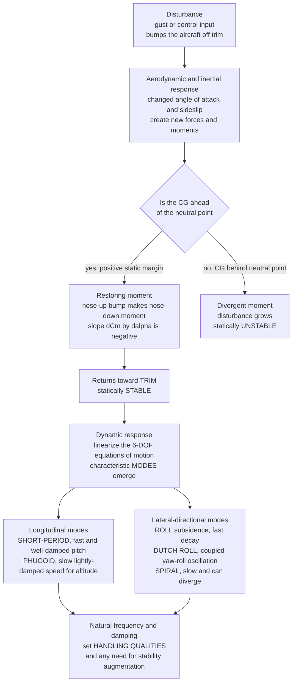

# 🛩️ Aircraft Stability and Flight Dynamics

> [!abstract] TL;DR
> **Aircraft stability** asks a deceptively simple question: after a gust bumps the aircraft off its steady flight, does it come **back on its own**, or does it wander off and require the pilot to fight it? The answer splits in two. **Static stability** is the *initial tendency* — a stable aircraft generates a **restoring moment** the instant it is disturbed, and for **longitudinal (pitch)** motion this requires the **center of gravity (CG)** to lie **ahead of the neutral point (NP)**, giving a negative pitching-moment slope $\mathrm{d}C_m/\mathrm{d}\alpha < 0$ (nose-up bump makes a nose-down moment). The distance from CG to NP, measured in fractions of the mean chord, is the **static margin** — the single number that sets how strongly the aircraft self-corrects, and it trades directly against **maneuverability** (which is exactly why modern fighters fly with a *relaxed or negative* static margin and lean on **fly-by-wire** to stay pointed the right way). The **horizontal tail** supplies the balancing moment, the **vertical fin** gives directional (yaw) stability, and **wing dihedral** gives lateral (roll) stability; **trim** is the equilibrium where all moments cancel and the elevator sets the trimmed angle of attack and speed. **Dynamic stability** is the *whole time history*: linearize the **six-degree-of-freedom equations of motion** about trim and the aircraft's response decomposes into characteristic **modes**, each an oscillation or subsidence with its own **natural frequency and damping** — longitudinally the fast well-damped **short-period** and the slow lightly-damped **phugoid** (a speed-for-altitude exchange), and laterally the fast **roll subsidence**, the coupled yaw-roll **Dutch roll**, and the slow, sometimes-divergent **spiral**. Stability is what makes an aircraft *flyable, safe, and pleasant to handle*; it drives CG limits and weight-and-balance, tail sizing, and the need for stability augmentation — the bridge from raw performance to control and the foundation of **handling qualities**.

---

## Intuition

**Analogy:** Nudge a marble resting at the bottom of a **bowl** and it rolls right back to the middle — that is **stability**. A well-designed aircraft is exactly that marble: hit it with a gust, and it *naturally* returns to steady flight with no pilot input at all. Now flip the bowl over and balance the marble on the **dome** on top: the tiniest nudge and it accelerates away, never to return — that is **instability**. The whole game of aircraft stability is deciding which kind of bowl you have built, and the shape of the bowl is set by *where you put the center of gravity relative to the wing's balance point*, the **neutral point**. Put the CG **ahead** of the neutral point and you get the right-way-up bowl: the plane self-corrects. Slide the CG **behind** it and you get the dome: every disturbance grows. The gap between the two, in fractions of the wing's chord, is the **static margin** — how deep and steep the bowl is.

But real aircraft do something the marble in a still bowl does not: they **oscillate** on the way back, just like a car's suspension. Drive a car over a bump and it does not snap instantly to level — it bounces, and a *good* suspension bounces once or twice and settles (well damped) while a *worn* one wallows for ages (lightly damped). An aircraft has several of these characteristic wobbles at once, each with its own rhythm and its own name: the quick, crisp pitch bobble called the **short-period**; the slow, graceful porpoising trade of speed for height called the **phugoid**; and, side to side, a coupled wag of nose and wings called **Dutch roll**. Stability is not just *whether* it comes back — it is *how it comes back*, and that "how" is what pilots feel as good or bad handling.

---

## How It Works

### Core Mechanics

**1. Two questions, two kinds of stability.** *Static stability* asks only about the **first instant** after a disturbance: does the aircraft generate a moment that pushes it **back** toward equilibrium (stable), leaves it where it is (neutral), or drives it **further away** (unstable)? *Dynamic stability* asks about the **entire subsequent motion**: even a statically stable aircraft can oscillate, and dynamic stability decides whether those oscillations **damp out** over time, persist, or grow. An aircraft must be statically stable to have a hope of being dynamically stable, but static stability alone is not enough — the wobbles still have to die away.

**2. Longitudinal static stability and the neutral point.** Consider a pitch (nose-up/nose-down) disturbance that momentarily increases the **angle of attack** $\alpha$. Every lifting surface has an **aerodynamic center**, but the aircraft as a whole has a special balance point called the **neutral point (NP)** — the CG location at which the total pitching moment does *not* change with $\alpha$. The stability condition is:

$$\frac{\mathrm{d}C_m}{\mathrm{d}\alpha} = C_{L_\alpha}\,(h - h_{np}) < 0 \quad\Longleftrightarrow\quad \text{CG ahead of NP } (h < h_{np}),$$

where $h = x_{cg}/\bar c$ and $h_{np} = x_{np}/\bar c$ are the CG and neutral-point positions as fractions of the mean aerodynamic chord $\bar c$. If the CG is ahead of the NP, a nose-up disturbance ($+\Delta\alpha$) produces a **nose-down** restoring moment ($-\Delta C_m$) — the bowl is right-way-up.

**3. Static margin: the strength of the bowl.** The stability *margin* is literally the distance from CG to neutral point:

$$K_n \equiv \text{static margin} = h_{np} - h = -\frac{C_{m_\alpha}}{C_{L_\alpha}}.$$

A large positive static margin (say $+0.2\bar c$) gives a deep, steep bowl — strong self-correction, but a sluggish, "nose-heavy" aircraft that resists maneuvering. A small margin gives a shallow bowl — light, agile, but twitchy. **Zero** margin means the CG sits exactly on the neutral point (neutral stability); **negative** margin means the CG is behind the NP and the aircraft is statically **unstable**. This is the central design trade: **stability versus maneuverability**. Combat aircraft deliberately choose a **relaxed (near-zero) or negative** static margin for agility, then delegate second-by-second stabilization to a **fly-by-wire** computer that commands the controls faster than any human could — the F-16 was the first production jet flown this way.

**4. The tail, the fin, and dihedral.** The **horizontal tail (stabilizer)** is what usually puts the neutral point behind the CG in the first place: sitting on a long moment arm, it contributes a strongly stabilizing $\mathrm{d}C_m/\mathrm{d}\alpha$ and provides the **balancing moment** that lets the aircraft trim. **Directional (yaw) static stability** ($C_{n_\beta} > 0$, the "weathercock" tendency to point into the relative wind) comes chiefly from the **vertical fin**. **Lateral (roll) static stability** ($C_{l_\beta} < 0$, a rolling moment that rights a dropped wing after a sideslip) comes chiefly from **wing dihedral** — the upward V of the wings.

**5. Trim.** *Trim* is the equilibrium state where all three moments (pitch, roll, yaw) balance and the aircraft flies "hands-off." Longitudinally, deflecting the **elevator** shifts the whole $C_m$-vs-$\alpha$ line up or down, moving the **trim angle of attack** (where $C_m = 0$) and therefore the **trim airspeed**. Setting the trim is how a pilot chooses a cruise speed and relieves stick force.

**6. Dynamic modes from the equations of motion.** Write the full **six-degree-of-freedom (6-DOF)** rigid-body equations — three force equations and three moment equations in body/stability axes — then **linearize** them for **small perturbations about trim**. The aerodynamic forces and moments are expressed through **stability derivatives** (e.g. $C_{m_\alpha}$, $C_{m_q}$, $C_{l_\beta}$), and the linear system conveniently **decouples** into a **longitudinal** set (symmetric: pitch, speed, altitude) and a **lateral-directional** set (asymmetric: roll, yaw, sideslip). The eigenvalues of each set are the **characteristic modes**:

- **Short-period** (longitudinal): a **fast, well-damped** pitch oscillation at nearly constant speed — the aircraft rapidly finds its new angle of attack. Frequency scales with pitch stiffness $C_{m_\alpha}$; damping with $C_{m_q}$.
- **Phugoid** (longitudinal): a **slow, lightly-damped** oscillation at nearly constant angle of attack in which the aircraft **trades speed for altitude** and back — dive to gain speed, climb to lose it. Lanchester's estimate $\omega_p \approx \sqrt{2}\,g/V$ gives periods of tens of seconds and very low damping $\zeta_p \approx 1/(\sqrt{2}\,L/D)$.
- **Roll subsidence** (lateral): a **fast, heavily-damped, non-oscillatory** decay — roll rate dies out quickly after an aileron input.
- **Dutch roll** (lateral): a **coupled yaw-roll oscillation** — the nose wags while the wings rock out of phase; often the most annoying mode to damp, and the usual target of a **yaw damper**.
- **Spiral** (lateral): a **very slow** mode, non-oscillatory, that can be gently **convergent or divergent**; a slowly divergent spiral (a gradually tightening, descending turn) is common and acceptable because the pilot easily corrects it.

Each mode's **natural frequency and damping ratio** are what determine **handling qualities** — whether the aircraft feels crisp or sloppy, and whether it needs **stability augmentation**.

### Flow / Architecture



---

## Key Concepts

### Secondary Level

- **Stable means it comes back by itself.** Like a marble in a bowl, a stable aircraft returns to steady flight after a gust with no pilot action. An unstable one — a marble on an upturned bowl — runs away from the smallest bump.
- **It is all about balance and the balance point.** Where the aircraft's **center of gravity** sits relative to the wing's **balance point** decides everything. CG in front of it: the plane self-corrects. CG behind it: the plane diverges. This is why loading an aircraft correctly (weight and balance) is a safety matter, not a formality.
- **The tail keeps the nose steady.** The small **horizontal tail** at the back is what makes most aircraft naturally hold their nose steady; the **vertical fin** works like a weathervane to keep the nose pointing into the wind.
- **A disturbed plane wobbles, then settles.** Just like a car's suspension after a bump, a disturbed aircraft oscillates in characteristic wobbles before settling. Some are quick, some are slow — they even have names like **phugoid** (a slow porpoising) and **Dutch roll** (a side-to-side wag).
- **Fighters cheat on purpose.** Modern fighter jets are built *slightly unstable* to be super-agile, and a **computer (fly-by-wire)** constantly nudges the controls to keep them flyable — something no human could do fast enough alone.

### Undergraduate Level

- **Static stability condition (pitch).** $\dfrac{\mathrm{d}C_m}{\mathrm{d}\alpha} = C_{L_\alpha}(h - h_{np}) < 0$: the CG position $h$ must be ahead of the neutral point $h_{np}$ (both in fractions of mean chord $\bar c$).
- **Static margin.** $K_n = h_{np} - h = -C_{m_\alpha}/C_{L_\alpha}$. Positive = stable; larger = stiffer/less maneuverable; zero = neutral (CG at NP); negative = unstable. Typical transport: $+0.05$ to $+0.20\bar c$.
- **Trim.** The elevator sets the $C_m$-intercept; the trim point is where $C_m = 0$, fixing the trimmed $\alpha$ and hence trimmed airspeed. Moving CG forward raises stick-force-per-g and stall/trim speed.
- **Directional and lateral stability.** Weathercock stability $C_{n_\beta} > 0$ (mainly the fin); dihedral effect $C_{l_\beta} < 0$ (mainly wing dihedral, sweep, and high-wing placement).
- **Longitudinal dynamic modes.** *Short-period*: fast ($\omega_{sp}\sim$ 1–5 rad/s), well damped ($\zeta\sim 0.3$–$0.7$), constant speed. *Phugoid*: slow ($\omega_p \approx \sqrt{2}\,g/V$, period tens of seconds), lightly damped ($\zeta_p \approx 1/(\sqrt 2\,L/D)$), constant $\alpha$, exchanging kinetic and potential energy.
- **Lateral-directional modes.** *Roll subsidence* (fast, non-oscillatory, first-order); *Dutch roll* (coupled yaw-roll oscillation, often poorly damped); *spiral* (slow, can be mildly divergent).
- **Damped second-order response.** Each oscillatory mode behaves like a spring-mass-damper: $\ddot x + 2\zeta\omega_n\dot x + \omega_n^2 x = 0$, with damped frequency $\omega_d = \omega_n\sqrt{1-\zeta^2}$ — the same mathematics as [[Mechanical_Vibrations]].

### Graduate Level

- **6-DOF equations of motion.** The rigid-body equations $m(\dot{\mathbf V} + \boldsymbol\omega\times\mathbf V) = \mathbf F$ and $\mathbf I\dot{\boldsymbol\omega} + \boldsymbol\omega\times(\mathbf I\boldsymbol\omega) = \mathbf M$, expressed in **body axes**, coupled to kinematic (Euler-angle/quaternion) and navigation equations. Gyroscopic and inertial cross-coupling ($I_{xz}$, $pq$, $qr$ terms) are what tie roll and yaw together — see [[Rotational_Dynamics]].
- **Linearization and stability axes.** Small-perturbation expansion about a trim reference yields $\dot{\mathbf x} = A\mathbf x + B\mathbf u$, the **state-space** form of [[State_Space_Models_in_Control]]. Choosing **stability axes** (x-axis along the trim velocity) simplifies the decoupling into longitudinal ($u,\ w\ \text{or}\ \alpha,\ q,\ \theta$) and lateral-directional ($\beta,\ p,\ r,\ \phi$) subsystems.
- **Stability derivatives.** The entries of $A$ are dimensional stability derivatives ($X_u$, $Z_w$, $M_w$, $M_q$, $M_{\dot\alpha}$, $L_\beta$, $N_\beta$, $Y_\beta$, ...), obtained from the aerodynamic coefficients. Short-period natural frequency $\omega_{sp}\approx\sqrt{-M_\alpha}$ and damping from $M_q + M_{\dot\alpha}$; phugoid from the slow speed/altitude eigenpair.
- **Modal analysis.** The eigenvalues of the longitudinal and lateral $A$ matrices are the modes; complex-conjugate pairs give oscillations ($\omega_n$, $\zeta$), real roots give subsidences/divergences. Root locations move with CG, speed, and altitude — a CG aft of the NP pushes the short-period pair into the right half-plane.
- **Handling qualities and flying-quality standards.** MIL-STD-1797 / Cooper-Harper map $(\omega_n,\zeta)$ of each mode, plus the **CAP** (Control Anticipation Parameter) and time constants, onto Level 1/2/3 pilot ratings — turning eigenvalues into "how it feels."
- **Stability augmentation.** Yaw dampers (feed back yaw rate to the rudder to damp Dutch roll), pitch dampers, and full **fly-by-wire** control laws synthetically place the closed-loop poles — the point where flight dynamics hands off to [[Feedback_Control_Fundamentals]] and its [[Transfer_Functions]] view of the loop. Deliberately unstable airframes are stabilized entirely in software.

---

## Python Demo

```python
# AIRCRAFT STABILITY AND FLIGHT DYNAMICS, in four panels:
#
#   (A) STATIC STABILITY: pitching-moment coefficient Cm vs angle of attack.
#       Cm = Cm0 + Cm_alpha * alpha, with Cm_alpha = -(static margin)*CL_alpha.
#       NEGATIVE slope (CG ahead of neutral point) = STABLE and self-trimming;
#       positive slope (CG behind NP) = UNSTABLE.
#   (B) STATIC MARGIN: how dCm/dalpha changes as the CG moves through the
#       chord, crossing zero exactly at the NEUTRAL POINT.
#   (C) SHORT-PERIOD MODE: a fast, well-damped pitch oscillation.
#   (D) PHUGOID MODE: a slow, lightly-damped speed-for-altitude exchange.
#
# Requires: numpy, matplotlib
import numpy as np
import matplotlib.pyplot as plt

# =====================================================================
# (A) STATIC LONGITUDINAL STABILITY: Cm vs angle of attack
# =====================================================================
CL_alpha = 0.10                       # wing-body lift-curve slope [per deg]
Cm0      = 0.10                       # zero-alpha (nose-up) pitching moment
alpha    = np.linspace(-4, 14, 400)   # angle of attack [deg]

# static margin = fraction of chord the CG sits AHEAD of the neutral point
SMs   = [0.30, 0.15, 0.00, -0.15]
names = ["SM = +0.30  very stable", "SM = +0.15  stable",
         "SM =  0.00  neutral (CG at NP)", "SM = -0.15  UNSTABLE"]
cols  = ["#1f77b4", "#2ca02c", "#7f7f7f", "#d62728"]

print("=== Static longitudinal stability ===")
for SM, nm in zip(SMs, names):
    Cm_alpha = -SM * CL_alpha                      # slope dCm/dalpha [per deg]
    if Cm_alpha != 0:
        a_trim = -Cm0 / Cm_alpha                   # alpha where Cm = 0
        tag = "stable trim" if Cm_alpha < 0 else "unstable equilibrium"
        print(f"{nm:32s}: dCm/dalpha = {Cm_alpha:+.4f}/deg, "
              f"trim alpha = {a_trim:+5.1f} deg ({tag})")
    else:
        print(f"{nm:32s}: dCm/dalpha =  0.0000/deg, no unique trim (neutral)")

# =====================================================================
# (B) STATIC MARGIN vs CG POSITION: dCm/dalpha crosses zero at the NP
# =====================================================================
h_np = 0.40                            # neutral point at 40% mean chord
h    = np.linspace(0.15, 0.55, 400)    # CG position [fraction of chord]
Cm_alpha_h = CL_alpha * (h - h_np)     # <0 stable (CG ahead of NP)

# =====================================================================
# (C)+(D) DYNAMIC MODES: free response of an underdamped 2nd-order system
#     x'' + 2*zeta*wn*x' + wn^2 x = 0,  initial displacement x0, zero rate
# =====================================================================
def mode_response(t, wn, zeta, x0):
    wd = wn * np.sqrt(1.0 - zeta**2)                    # damped frequency
    env = x0 * np.exp(-zeta * wn * t)                   # decay envelope
    return env * (np.cos(wd*t) + (zeta*wn/wd)*np.sin(wd*t)), env

# Short-period: fast and well damped (nearly constant airspeed)
wn_sp, z_sp = 3.0, 0.50
t_sp = np.linspace(0, 8, 800)
dalpha, env_sp = mode_response(t_sp, wn_sp, z_sp, 4.0)   # 4 deg AoA kick

# Phugoid: slow and lightly damped (constant AoA, speed <-> altitude)
wn_ph, z_ph = 0.14, 0.05
t_ph = np.linspace(0, 120, 1200)
dV, env_ph = mode_response(t_ph, wn_ph, z_ph, 15.0)     # 15 m/s speed kick

def summarize(name, wn, z):
    wd = wn*np.sqrt(1-z**2)
    print(f"{name:14s}: wn = {wn:5.2f} rad/s, zeta = {z:.2f}, "
          f"period = {2*np.pi/wd:6.2f} s, "
          f"time-to-half = {np.log(2)/(z*wn):6.2f} s")

print("\n=== Longitudinal dynamic modes ===")
summarize("short-period", wn_sp, z_sp)
summarize("phugoid",      wn_ph, z_ph)

# ------------------------------ plotting ------------------------------
fig, ax = plt.subplots(2, 2, figsize=(14, 10))
fig.suptitle("Aircraft Stability and Flight Dynamics: "
             "Static Stability and the Longitudinal Modes",
             fontsize=15, fontweight="bold")

# A: Cm vs alpha for several static margins
axA = ax[0, 0]
for SM, nm, c in zip(SMs, names, cols):
    Cm = Cm0 + (-SM * CL_alpha) * alpha
    axA.plot(alpha, Cm, lw=2.4, color=c, label=nm)
axA.axhline(0, color="k", lw=0.8)
axA.annotate("trim: Cm = 0", xy=(3.3, 0), xytext=(6.5, 0.18),
             fontsize=9, arrowprops=dict(arrowstyle="->"))
axA.text(-3.5, -0.28, "negative slope = STABLE\n(nose-up -> nose-down moment)",
         fontsize=8.5, color="#1f77b4")
axA.text(-3.5, 0.30, "positive slope = UNSTABLE", fontsize=8.5, color="#d62728")
axA.set_xlabel("angle of attack  alpha  [deg]")
axA.set_ylabel("pitching-moment coefficient  Cm")
axA.set_title("A. Static stability: the sign of dCm/dalpha")
axA.legend(fontsize=8, loc="lower left"); axA.grid(alpha=0.3)

# B: static margin / slope vs CG position, neutral point where it crosses zero
axB = ax[0, 1]
axB.plot(h, Cm_alpha_h, color="#9467bd", lw=2.6)
axB.axhline(0, color="k", lw=0.8)
axB.axvline(h_np, ls="--", color="#d62728", lw=1.6)
axB.fill_between(h, Cm_alpha_h, 0, where=(h < h_np),
                 color="#d0f0d0", alpha=0.7)
axB.fill_between(h, Cm_alpha_h, 0, where=(h > h_np),
                 color="#f5d0d0", alpha=0.7)
axB.annotate("NEUTRAL POINT\nh_np = 0.40 c", xy=(h_np, 0),
             xytext=(0.44, -0.010), fontsize=9, color="#d62728",
             arrowprops=dict(arrowstyle="->", color="#d62728"))
axB.text(0.18, -0.020, "CG ahead of NP\nSTABLE", fontsize=9, color="#2a7a2a")
axB.text(0.46, 0.008, "CG behind NP\nUNSTABLE", fontsize=9, color="#a83232")
axB.set_xlabel("CG position  h = x_cg / chord")
axB.set_ylabel("slope  dCm/dalpha  [per deg]")
axB.set_title("B. Static margin = distance from CG to neutral point")
axB.grid(alpha=0.3)

# C: short-period response (fast, well damped)
axC = ax[1, 0]
axC.plot(t_sp, dalpha, color="#1f77b4", lw=2.2, label="pitch / AoA response")
axC.plot(t_sp,  env_sp, ls="--", color="#ff7f0e", lw=1.4, label="decay envelope")
axC.plot(t_sp, -env_sp, ls="--", color="#ff7f0e", lw=1.4)
axC.axhline(0, color="k", lw=0.6)
axC.set_xlabel("time  [s]")
axC.set_ylabel("angle-of-attack perturbation  [deg]")
axC.set_title(f"C. SHORT-PERIOD: fast, well damped "
              f"(wn={wn_sp} rad/s, zeta={z_sp})")
axC.legend(fontsize=8); axC.grid(alpha=0.3)

# D: phugoid response (slow, lightly damped)
axD = ax[1, 1]
axD.plot(t_ph, dV, color="#2ca02c", lw=2.2, label="airspeed perturbation")
axD.plot(t_ph,  env_ph, ls="--", color="#ff7f0e", lw=1.4, label="decay envelope")
axD.plot(t_ph, -env_ph, ls="--", color="#ff7f0e", lw=1.4)
axD.axhline(0, color="k", lw=0.6)
axD.set_xlabel("time  [s]")
axD.set_ylabel("airspeed perturbation  [m/s]")
axD.set_title(f"D. PHUGOID: slow, lightly damped "
              f"(wn={wn_ph} rad/s, zeta={z_ph})")
axD.legend(fontsize=8); axD.grid(alpha=0.3)

plt.tight_layout(rect=[0, 0, 1, 0.95])
plt.show()
```

**What it shows.** Panel **A** is the heartbeat of static stability: the pitching-moment coefficient $C_m$ plotted against angle of attack for several **static margins**. A **negative slope** (CG ahead of the neutral point) means a nose-up disturbance creates a nose-down restoring moment — the line crosses $C_m = 0$ at a genuine, *stable* **trim** point. The **flat** line (SM $=0$) is neutral, and the **positive-slope** line (SM $=-0.15$) is unstable. Panel **B** turns the CG into a dial: sliding the CG through the chord moves $\mathrm{d}C_m/\mathrm{d}\alpha$ straight through zero exactly at the **neutral point** ($h_{np} = 0.40\bar c$), with the whole stable region shaded green ahead of it. Panels **C** and **D** are the two longitudinal **dynamic modes** as damped second-order responses: the **short-period** settling in a couple of seconds (fast, well damped, $\zeta = 0.5$) versus the **phugoid** lazily oscillating over more than a minute (slow, lightly damped, $\zeta = 0.05$) — the same spring-mass-damper mathematics, two wildly different rhythms, exactly what a pilot feels as a quick pitch bobble versus a slow speed-and-altitude porpoise.

---

## Real-World Applications

> **Example — the F-16 and relaxed static stability.** The General Dynamics F-16 was the first production fighter designed with **negative longitudinal static margin** (its CG sits *behind* the subsonic neutral point). Aerodynamically it is a diverging marble on a dome — untouched, it would tumble in a fraction of a second. What makes it not just flyable but famously agile is a **fly-by-wire** flight-control computer that measures pitch rate and angle of attack and drives the horizontal tail dozens of times per second to *synthetically* place the closed-loop poles in the stable half-plane. The instability is a feature: with no built-in "nose-heaviness" to fight, the jet points and maneuvers with minimal control effort. This is the clearest possible illustration that in modern aircraft, **stability is a design variable to be chosen**, not a fixed gift of the airframe — and that the choice is inseparable from the control system.

- **Weight and balance / CG limits.** Every aircraft has a published **CG envelope**; loading passengers, cargo, and fuel must keep the CG **ahead of the aft limit** (to preserve a minimum static margin and controllable stall) and **behind the forward limit** (to keep enough elevator authority to flare and rotate). Getting this wrong has caused fatal accidents — stability is a daily operational discipline, not just theory.
- **Yaw dampers on jetliners.** The lightly-damped **Dutch roll** of swept-wing transports would make for an uncomfortable, fuel-wasting wag; virtually every airliner carries a **yaw damper** that feeds back yaw rate to the rudder to damp the mode automatically, a textbook stability-augmentation loop.
- **Tail (empennage) sizing.** The horizontal and vertical tail areas and moment arms are sized precisely to place the neutral point and set $C_{n_\beta}$ and $C_{m_\alpha}$ — the aircraft's whole configuration layout (tail volume coefficients) flows from stability requirements.
- **Flight-test envelope expansion.** New aircraft are flight-tested to measure the frequency and damping of each mode across the envelope, verifying they meet **handling-quality** standards (e.g. MIL-STD-1797, Cooper-Harper Level 1) before certification.
- **Spin and stall behavior.** Departure from controlled flight, spin entry, and recovery all hinge on how directional/lateral stability and pitch behave at high angle of attack — driving wing washout, dihedral, and fin design.
- **Drones and eVTOL.** Small fixed-wing UAVs and emerging air taxis are often statically unstable or marginal for compactness and are stabilized by onboard autopilots — the same relaxed-stability-plus-feedback philosophy scaled down.

---

## Common Pitfalls

- **Confusing static with dynamic stability.** Static stability only says the *first* response is restoring; it says nothing about whether the ensuing oscillation damps. An aircraft can be statically stable yet dynamically unstable (a growing oscillation). Both must be checked — the modes, not just the slope, decide flyability.
- **Forgetting that CG position sets stability.** Stability is not a fixed property of the airframe — it slides with loading. The *same* aircraft is docile with a forward CG and dangerous with an aft CG. Treating the published CG limits as bureaucratic red tape rather than the boundary of the stable region is how loading accidents happen.
- **Assuming "more stable is better."** A large static margin makes the aircraft resist *all* pitch changes, including the ones the pilot commands — heavy, sluggish, poor maneuverability, high trim drag. Good design targets an *appropriate* margin for the mission, not the maximum.
- **Ignoring the phugoid because it is slow.** Its long period tempts designers to dismiss it, but a lightly-damped or divergent phugoid steadily degrades ride quality and, in instrument conditions or on autopilot dropout, can build into large speed and altitude excursions before anyone reacts.
- **Neglecting lateral-directional coupling.** Analyzing roll and yaw separately hides **Dutch roll** and **spiral** behavior, which are inherently coupled through the cross-inertia and the dihedral/weathercock effects. Over-doing dihedral to fix spiral stability worsens Dutch roll, and vice versa — the two must be balanced together.
- **Linearizing and then flying outside the linear range.** The neat modal picture comes from small-perturbation linearization about trim. Near stall, at high angle of attack, or in large maneuvers the aerodynamics go nonlinear (stall hysteresis, departure, inertia coupling) and the tidy phugoid/short-period story breaks down — exactly where many upsets occur.

---

## Related Concepts

- [[Newtons_Laws_and_Kinematics]] — the force-and-motion bedrock: an aircraft is a rigid body whose translational trim ($\sum\mathbf F = 0$) and rotational trim ($\sum\mathbf M = 0$) are the equilibrium that stability perturbs.
- [[Rotational_Dynamics]] — moments of inertia, angular momentum, and the gyroscopic cross-coupling ($I_{xz}$, roll-yaw inertia coupling) that tie the lateral-directional modes together in the 6-DOF equations.
- [[Mechanical_Vibrations]] — every oscillatory mode (short-period, phugoid, Dutch roll) is a damped second-order system with natural frequency and damping ratio; this is the shared spring-mass-damper mathematics.
- [[State_Space_Models_in_Control]] — the linearized equations of motion $\dot{\mathbf x} = A\mathbf x + B\mathbf u$; the modes are the eigenvalues of $A$, and modal analysis is eigenvalue analysis.
- [[Transfer_Functions]] — the input-output (elevator-to-pitch, rudder-to-yaw) view of the same dynamics, where the modes appear as poles and handling is read off pole locations.
- [[Feedback_Control_Fundamentals]] — how stability augmentation (yaw dampers) and fly-by-wire close the loop to *place* the modes and stabilize deliberately unstable airframes.

This note sits in the *Aerospace_Engineering / Flight Mechanics and Performance* section and is the control-and-dynamics companion to its siblings: *Aircraft_Performance* (which turns the trimmed, stable flight established here into range, endurance, climb, and the flight envelope), *Flight_Control_and_Handling_Qualities* (which quantifies how the modal frequencies and damping map onto pilot ratings), *Aircraft_Design_and_Configuration* (where tail sizing and CG placement are chosen to *achieve* the static margin and mode frequencies discussed above), and *Avionics_and_Flight_Control_Systems* (the fly-by-wire and stability-augmentation hardware that realizes synthetic stability). Upstream, the aerodynamic stability derivatives it relies on come from the aerodynamics section's *Airfoils_and_Wing_Theory* and the *Aerospace_Engineering_Overview* hub.

---

## Review Questions

**Secondary**
1. Using the marble-and-bowl picture, explain the difference between a **stable** and an **unstable** aircraft, and state in plain words where the **center of gravity** must sit relative to the wing's balance point for the aircraft to correct itself after a gust. Why might an airline care exactly how cargo and passengers are loaded?

**Undergraduate**
2. An aircraft has a wing-body lift-curve slope $C_{L_\alpha} = 0.10\,/\text{deg}$, a neutral point at $h_{np} = 0.42\bar c$, and its CG at $h = 0.30\bar c$. (a) Compute the static margin and the pitching-moment slope $\mathrm{d}C_m/\mathrm{d}\alpha$, and state whether it is statically stable. (b) If ballast is moved aft so the CG shifts to $h = 0.45\bar c$, what happens to the stability, and physically why? (c) Sketch how the short-period pole would move as the CG crosses the neutral point.

**Graduate**
3. A swept-wing transport shows an acceptably damped short-period and spiral but a **lightly-damped Dutch roll** that pilots find objectionable. (a) Explain, in terms of the lateral-directional stability derivatives ($C_{n_\beta}$, $C_{l_\beta}$, $C_{n_r}$) and cross-inertia, why increasing wing dihedral to improve spiral stability can *worsen* Dutch roll. (b) Describe how a **yaw-rate feedback** (yaw damper) stabilizes the mode, and frame the design as pole placement on the lateral-directional $A$ matrix. (c) Why can a mildly divergent spiral be acceptable while a divergent short-period cannot?

---

## Sources

- B. Etkin & L. D. Reid — *Dynamics of Flight: Stability and Control*, 3rd ed. (Wiley, 1996) — the standard reference on static/dynamic stability, stability derivatives, and the modes.
- R. C. Nelson — *Flight Stability and Automatic Control*, 2nd ed. (McGraw-Hill, 1998) — accessible treatment of static margin, longitudinal and lateral-directional dynamics, and augmentation.
- M. V. Cook — *Flight Dynamics Principles*, 3rd ed. (Butterworth-Heinemann, 2013) — 6-DOF equations of motion, linearization, and modal analysis in state-space form.
- B. L. Stevens & F. L. Lewis — *Aircraft Control and Simulation*, 3rd ed. (Wiley, 2015) — the modeling-and-control bridge from flight dynamics to fly-by-wire and stability augmentation.

---

#aerospace-engineering #flight-dynamics #stability #phugoid #equations-of-motion
