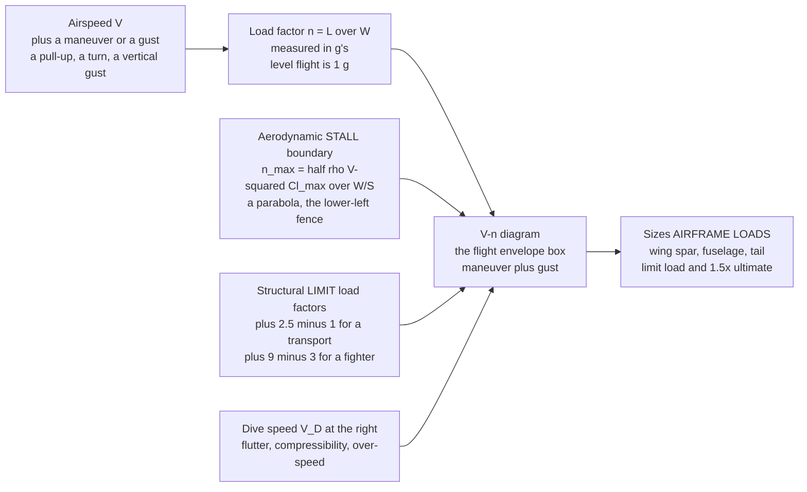

# ✈️ Airframe Loads and the Flight Envelope

> [!abstract] TL;DR
> Every aircraft has a **safe operating box** in the plane of **airspeed** and **load factor** — the "g's" it pulls — and the drawing of that box is the **V-n (or V-g) diagram**, the **flight envelope**. The single most important number is the **load factor** $n = L/W$: the ratio of the lift the wing is making to the aircraft's weight. Straight-and-level flight is **1 g**; a $60^\circ$ banked turn is **2 g**; a hard pull-up can be many g. The envelope is fenced on four sides. Its **lower-left curve** is the **aerodynamic stall boundary** $n_{max} = \tfrac12\rho V^2 C_{L,max}/(W/S)$ — a parabola, because the wing simply cannot generate more lift than $C_{L,max}$ allows, so at low speed you *cannot* pull hard g even if you want to. Its **top and bottom** are the **positive and negative limit load factors** ($+2.5/-1$ for an airliner, $+9/-3$ for a fighter) — these are **structural** fences beyond which the airframe yields. Its **right wall** is the **dive speed** $V_D$, where **flutter**, **compressibility**, and over-pressure lurk. Overlaid on top is a second, **gust envelope**: a vertical gust of wind suddenly changes the wing's angle of attack and slams on load factor — worse at high speed and low wing loading — so turbulence sizes the structure too. The point where the stall parabola meets the structural ceiling is the **maneuvering speed / corner speed** $V_A$: the slowest speed at which you can reach the g-limit, and the fastest you can yank full control deflection without over-stressing the airframe. Structures are then built to a **limit load** (max expected in service, no permanent deformation) and a **1.5x ultimate load** (never fails). The envelope is therefore two things at once: the **safety boundary** pilots must stay inside, and the **fundamental loads input** that sizes the wing spar, fuselage, and tail — built *just* strong enough to survive the box's corners, because every extra kilogram of structure is a kilogram not carrying passengers.

---

## Intuition

**Analogy:** Think of an aircraft as living inside an invisible **box** drawn on a chart. The horizontal axis of the box is how **fast** you fly; the vertical axis is how **hard** you maneuver — how many **g's** you pull. Stay inside the box and the airplane is happy. Push out through the **left wall** (too slow) and the wings can no longer hold you up: they **stall** and the aircraft falls. Push up through the **ceiling** (too many g in a violent pull-up or turn) and the wings, straining under many times the aircraft's weight, literally begin to **bend and break**. Push out through the **right wall** (too fast) and the structure meets flutter and shock waves that can tear it apart. A fighter pilot's box is tall — it allows **9 g** — because the airframe is massively reinforced; an airliner's box is short, maybe **2.5 g**, because reinforcing to 9 g would bury the payload under steel and spar caps.

Now the key insight: **every gust of turbulence, every steep turn, every pull-out from a dive is just a single dot plotted somewhere inside this box.** Engineers draw the box first — they call it the **V-n diagram**, load factor (g's) plotted against airspeed — and then they build the entire airframe to *just barely* survive the box's four **corners**, plus a safety margin, and **not one gram more**. The corners of the box are the worst combinations of speed and g the airplane will ever legally see, so if the structure lives through the corners it lives through everything inside. That is the whole discipline of airframe loads: draw the safe box, find its most brutal corners, and build the lightest possible structure that survives them.

---

## How It Works

### Core Mechanics

**1. Load factor is the wing's workload.** The **load factor** $n = L/W$ measures how much lift the wing is producing relative to the weight it carries, expressed in **g's**. In steady level flight $L = W$, so $n = 1$. Bank the aircraft to angle $\phi$ in a level turn and the wing must lift harder to both support the weight *and* turn: $n = 1/\cos\phi$, so a $60^\circ$ bank gives $n = 2$. Pull up sharply and $n$ climbs further. Load factor is felt directly by everything on board — a $2.5$ g pull makes a 70 kg pilot weigh 175 kg — and, crucially, it is the **structural demand** on the airframe: the wing spar must carry $n$ times the weight.

**2. Load factor drives the accelerated stall.** Because lift equals $\tfrac12\rho V^2 S\,C_L$, and the wing stalls at a fixed $C_{L,max}$, the stall speed *rises* with load factor. The 1-g stall speed is $V_s = \sqrt{2(W/S)/(\rho\,C_{L,max})}$; under load factor $n$ the **accelerated stall speed** becomes
$$V_{s,n} = V_s\sqrt{n}.$$
Pull 4 g and your stall speed **doubles**. This is why an aircraft can stall at high speed in a hard maneuver — the *accelerated* stall.

**3. The aerodynamic (stall) boundary — the parabola.** Set $L = nW$ at maximum lift and solve for the load factor the wing can *aerodynamically* reach at a given speed:
$$n_{max}(V) = \frac{\tfrac12 \rho V^2 C_{L,max}}{W/S}.$$
This is a **parabola** in the V-n plane rising from the origin. Below and to the left of it you simply cannot go — the wing cannot make that much lift. It forms the **left/lower boundary** of the envelope: at low speed the g-limit is set by *aerodynamics*, not structure.

**4. The structural boundary — the limit load factors.** The parabola cannot rise forever; at some load factor the *structure* becomes the limit. Horizontal lines at the **positive and negative limit load factors** cap the envelope top and bottom. Airworthiness codes set these: transport aircraft (FAR/CS-25) use roughly $+2.5$ to $-1$; utility aircraft $+4.4/-1.8$; aerobatic $+6/-3$; fighters $+9/-3$. Beyond the limit load, the airframe yields (permanent deformation); well beyond it, it fails.

**5. Corner speed / maneuvering speed $V_A$.** Where the stall parabola meets the positive structural ceiling is the **corner** of the envelope, at the **maneuvering speed** $V_A = V_s\sqrt{n_{limit}}$. This corner is doubly special: it is the *slowest* speed at which the aircraft can reach its g-limit, and it is the *fastest* speed at which full, abrupt control deflection stalls the wing *before* it over-stresses the structure. Above $V_A$, yanking full control input can exceed the limit load and bend the airframe — which is exactly why pilots slow to $V_A$ in severe turbulence.

**6. The right wall — dive speed $V_D$.** The envelope is closed on the right by the **design dive speed** $V_D$ (with the never-exceed $V_{NE}$ just inside it). This limit is not about g at all; it guards against **flutter** (destructive aeroelastic vibration), **compressibility/shock** effects near the speed of sound, and sheer dynamic-pressure loads. Beyond $V_D$ the structure and control surfaces are not certified to survive.

**7. The gust envelope — turbulence loads.** A separate envelope accounts for **vertical gusts**. A sudden upward gust of velocity $U_{de}$ changes the wing's angle of attack by $\Delta\alpha \approx U_{de}/V$, adding a load factor increment
$$\Delta n = \frac{K_g\,\rho\,V\,a\,U_{de}}{2\,(W/S)},$$
where $a$ is the lift-curve slope and $K_g$ a gust-alleviation factor. Two lessons fall out: the gust increment **grows with airspeed** (gust lines fan outward at high V), and it is **worse for low wing loading** $W/S$ — light, lightly loaded aircraft are tossed harder by turbulence. For many aircraft the gust envelope pokes *outside* the maneuver envelope at high speed, so **turbulence, not maneuvering, sizes the structure.**

**8. From envelope to airframe — limit and ultimate loads.** The envelope's corners give the worst load factors, which combine with weight, speed, and mass distribution into **critical load cases**. The structure is then designed to two levels: the **limit load** (the maximum expected in service — the airframe must show *no permanent deformation*) and the **ultimate load** = **1.5 x limit** (the airframe must not *fail*, though it may deform). The factor **1.5** is the classic airframe **factor of safety**, small by civil-engineering standards precisely because weight is so precious. Load sources beyond maneuver and gust include **landing impact**, **cabin pressurization** (fuselage as a pressure vessel, a major fatigue driver), and **ground handling** — each generating its own critical cases that size the spar, frames, and tail.

### Flow / Architecture



---

## Key Concepts

### Secondary Level

- **The safe box.** An airplane can only fly inside an invisible box of speed and hardness-of-maneuver. Too slow and the wings **stall** and stop lifting; too many **g's** or too fast and the wings can **break off**. Engineers draw this box before they build the plane.
- **Load factor is g's.** "Pulling g's" means the wings are lifting several times the aircraft's weight. Level flight is **1 g**. A tight turn is a couple of g. A fighter jet in a dogfight pulls up to **9 g** — nine times its own weight pressing down on the wings and the pilot.
- **Fighters get a bigger box than airliners.** A fighter is built to survive 9 g; an airliner only about 2.5 g. Building an airliner to 9 g would make it so heavy it could not carry passengers — so its box is deliberately small, and pilots keep it far from the edges.
- **Turbulence pushes you toward the walls.** A strong gust of wind suddenly makes the wings lift harder, jumping you up (or down) inside the box. That is why the seatbelt sign comes on and pilots slow down in rough air — slowing shrinks how hard a gust can hit you.
- **Built just strong enough.** The whole airframe is made only strong enough to survive the corners of its box, with a safety margin, and no heavier — because every extra kilogram of structure is a kilogram of passengers or fuel you cannot carry.

### Undergraduate Level

- **Load factor.** $n = L/W$ (in g's). Level flight: $n=1$. Level banked turn: $n = 1/\cos\phi$ ($60^\circ \Rightarrow 2$ g). The load factor sets both the **structural demand** ($n \times$ weight through the spar) and the **accelerated stall speed** $V_{s,n} = V_s\sqrt{n}$.
- **The maneuver V-n diagram.** Lower-left **stall parabola** $n_{max} = \tfrac12\rho V^2 C_{L,max}/(W/S)$; top/bottom **limit load factors** $n_{+}, n_{-}$; right wall **dive speed** $V_D$. The stall curve and the ceiling meet at the **corner (maneuvering) speed** $V_A = V_s\sqrt{n_{+}}$.
- **Stall speed and wing loading.** $V_s = \sqrt{2(W/S)/(\rho C_{L,max})}$. Higher **wing loading** $W/S$ raises stall speed (and shrinks gust response); higher $C_{L,max}$ (flaps) lowers it.
- **Gust load factor.** $\Delta n = K_g \rho V a\,U_{de}/(2(W/S))$ — linear in airspeed and inversely proportional to wing loading; the **gust lines** on the V-n diagram fan out from the 1-g point and can exceed the maneuver limits at high speed.
- **Limit vs ultimate load.** **Limit** = max expected in service (no permanent set). **Ultimate** = $1.5 \times$ limit (no failure). The **factor of safety** of 1.5 is the airframe standard; the **margin of safety** MS $= (\text{allowable}/\text{applied}) - 1 \ge 0$.
- **Load sources and critical cases.** Maneuver, gust/turbulence, landing impact, cabin pressurization, and ground handling each generate load cases; the envelope corners plus these size the wing spar (bending), fuselage (bending + pressure hoop stress), and tail (balancing and maneuver loads).

### Graduate Level

- **Regulatory basis.** FAR/CS-25 §25.333 defines the combined **maneuver and gust envelope**; §25.337 sets maneuvering limit load factors ($+2.5$ up to a weight-dependent minimum, $-1.0$); §25.341 specifies the **discrete (1-cos) gust** and **continuous turbulence (PSD, von Kármán)** models; §25.303 fixes the **1.5 factor of safety**. These regulations *are* the loads specification the structure is certified against.
- **Discrete gust and the (1-cos) shape.** Modern codes replace the sharp-edged gust with a tuned $U = (U_{ds}/2)(1 - \cos(2\pi s/H))$ profile over gust gradients $H$; the aircraft's **dynamic** (not quasi-static) response is computed, and the worst $H$ is searched — coupling aeroelasticity and flight dynamics into the loads.
- **Continuous turbulence and PSD loads.** For flexible aircraft, atmospheric turbulence is modeled as a stationary random process (von Kármán spectrum); loads are obtained from the **frequency-response** of the elastic airframe, giving design envelopes of correlated load quantities (e.g. wing-root bending vs torsion).
- **Corner speed and dynamics.** $V_A$ (corner speed) simultaneously maximizes turn rate for a given g-limit and marks the boundary between aerodynamically-limited and structurally-limited maneuvering — central to both structural sizing and air-combat energy maneuverability.
- **Maneuver-load alleviation (MLA/GLA).** Active control (spoilers, ailerons, direct-lift) sheds outboard load in gusts/maneuvers to *reduce* wing-root bending moment, permitting lighter structure or higher aspect ratio — the loads envelope becomes a control-design target, not just a fixed input.
- **From load factor to internal loads.** The envelope gives external load factors; converting to spar-cap stresses, shear flows, and frame loads requires the mass and stiffness distribution (inertia relief), balancing tail loads, and a full **finite-element** internal-loads model — then fatigue and **damage-tolerance** analysis over the load *spectrum*, not just the static envelope corners.

---

## Python Demo

```python
# Airframe loads and the flight envelope in two panels, numpy + matplotlib only.
#
#   (a) THE V-n DIAGRAM (maneuver envelope) for a transport-category aircraft:
#         * lower/left AERODYNAMIC STALL boundary  n = 0.5*rho*V^2*Clmax/(W/S)
#           -- a parabola: you cannot pull more g than the wing can lift.
#         * top/bottom STRUCTURAL LIMIT load factors  n_pos = +2.5, n_neg = -1.0
#         * right wall at the DIVE SPEED  V_D (flutter / over-speed).
#         * the corner where parabola meets ceiling = MANEUVERING SPEED  V_A.
#       Overlaid: GUST LINES -- a vertical gust adds load factor
#           dn = Kg*rho*V*a*Ude / (2*(W/S)),  which grows with airspeed
#           (steeper / farther out at high speed) and can poke OUTSIDE
#           the maneuver box -- i.e. turbulence sizes the structure too.
#
#   (b) LIMIT vs ULTIMATE load and the MARGIN OF SAFETY:
#           limit load  ->  ultimate = 1.5 * limit (factor of safety)
#           design allowable strength is set just above ultimate;
#           margin of safety  MS = allowable/ultimate - 1.
import numpy as np
import matplotlib.pyplot as plt

# ---------------------------- aircraft data (SI) ----------------------------
rho   = 1.225      # air density at sea level [kg/m^3]
W_S   = 3000.0     # wing loading W/S [N/m^2]
Clmax_pos = 1.50   # max lift coefficient, positive (flaps up)
Clmax_neg = 1.00   # max lift coefficient magnitude, negative (inverted)
n_pos = 2.5        # positive structural limit load factor (transport)
n_neg = -1.0       # negative structural limit load factor
a_lift = 5.7       # lift-curve slope [per rad]
Kg     = 0.80      # gust alleviation factor
V_D    = 180.0     # design dive speed [m/s]
V_C    = 150.0     # design cruise speed [m/s]

# ---- reference stall speeds and corner (maneuvering) speed ----
Vs  = np.sqrt(2.0 * W_S / (rho * Clmax_pos))       # 1-g stall speed
VsN = np.sqrt(2.0 * W_S / (rho * Clmax_neg))       # 1-g stall, inverted
Va  = Vs  * np.sqrt(n_pos)                          # corner / maneuvering speed
VaN = VsN * np.sqrt(abs(n_neg))                     # negative corner speed
print("=== Flight envelope key speeds ===")
print(f"  1-g stall speed   Vs = {Vs:6.1f} m/s")
print(f"  maneuvering speed Va = {Va:6.1f} m/s  (= Vs*sqrt({n_pos}))")
print(f"  dive speed        Vd = {V_D:6.1f} m/s")
print(f"  accelerated stall at n=2.5 -> Vs*sqrt(2.5) = {Vs*np.sqrt(2.5):.1f} m/s")

# ------------------------- build the maneuver envelope -----------------------
def n_stall_pos(V):  return 0.5 * rho * V**2 * Clmax_pos / W_S
def n_stall_neg(V):  return -0.5 * rho * V**2 * Clmax_neg / W_S

V_up   = np.linspace(0, Va,  200)      # positive stall parabola up to corner
V_top  = np.linspace(Va, V_D, 120)     # flat positive ceiling to dive speed
V_dn   = np.linspace(0, VaN, 200)      # negative stall parabola
V_bot  = np.linspace(VaN, V_C, 120)    # flat negative floor to cruise speed
V_ramp = np.linspace(V_C, V_D, 60)     # negative floor ramps to 0 at V_D

# ------------------------------- gust lines ----------------------------------
def dn_gust(V, Ude):                    # gust load-factor increment
    return Kg * rho * V * a_lift * Ude / (2.0 * W_S)
Vg = np.linspace(0, V_D, 100)
Ude_high, Ude_low = 20.0, 10.0          # rough- and moderate-gust velocities [m/s]

# ================================ plotting ==================================
fig, (axL, axR) = plt.subplots(1, 2, figsize=(14, 6))
fig.suptitle("Airframe Loads and the Flight Envelope",
             fontsize=14, fontweight="bold")

# ---- (a) the V-n diagram ----
axL.plot(V_up,  n_stall_pos(V_up),  color="#1f77b4", lw=2.4)
axL.plot(V_top, np.full_like(V_top, n_pos), color="#1f77b4", lw=2.4)
axL.plot(V_dn,  n_stall_neg(V_dn),  color="#1f77b4", lw=2.4)
axL.plot(V_bot, np.full_like(V_bot, n_neg), color="#1f77b4", lw=2.4)
axL.plot(V_ramp, n_neg + (0 - n_neg)*(V_ramp - V_C)/(V_D - V_C),
         color="#1f77b4", lw=2.4)
axL.plot([V_D, V_D], [0, n_pos], color="#1f77b4", lw=2.4, label="maneuver envelope")

# gust lines fanning out from the 1-g point
for Ude, style in [(Ude_high, "-"), (Ude_low, "--")]:
    axL.plot(Vg, 1 + dn_gust(Vg, Ude), color="#d62728", lw=1.6, ls=style,
             label=f"gust  Ude={Ude:.0f} m/s")
    axL.plot(Vg, 1 - dn_gust(Vg, Ude), color="#d62728", lw=1.6, ls=style)

# annotate the key features
axL.axhline(1.0, color="gray", lw=0.8, ls=":")
axL.scatter([Va], [n_pos], color="k", zorder=6)
axL.annotate("corner / maneuvering\nspeed  V_A", xy=(Va, n_pos),
             xytext=(Va-58, n_pos+0.55), fontsize=8,
             arrowprops=dict(arrowstyle="->"))
axL.annotate("STALL parabola\n(aerodynamic limit)", xy=(Vs*1.3, n_stall_pos(Vs*1.3)),
             xytext=(8, 1.9), fontsize=8, color="#1f77b4",
             arrowprops=dict(arrowstyle="->", color="#1f77b4"))
axL.text(V_D-2, n_pos+0.12, "V_D", fontsize=8, ha="right")
axL.axhline(n_pos, color="gray", lw=0.6, ls=":")
axL.text(5, n_pos+0.08, "positive limit +2.5", fontsize=7, color="gray")
axL.text(5, n_neg-0.22, "negative limit -1.0", fontsize=7, color="gray")
axL.set_xlabel("airspeed  V  [m/s]")
axL.set_ylabel("load factor  n  [g]")
axL.set_title("(a) V-n diagram: maneuver envelope + gust lines")
axL.set_xlim(0, V_D*1.05); axL.set_ylim(n_neg-1.5, n_pos+1.4)
axL.axhline(0, color="k", lw=0.6)
axL.legend(loc="lower right", fontsize=7); axL.grid(alpha=0.3)

# ---- (b) limit vs ultimate load and margin of safety ----
limit_n     = n_pos                     # limit load factor
ultimate_n  = 1.5 * limit_n             # 1.5x factor of safety
allowable_n = 4.10                      # design strength (as-built capability)
MS = allowable_n / ultimate_n - 1.0
print("\n=== Structural strength ladder ===")
print(f"  limit load     = {limit_n:4.2f} g   (no permanent deformation)")
print(f"  ultimate load  = {ultimate_n:4.2f} g   (= 1.5x limit, no failure)")
print(f"  design strength= {allowable_n:4.2f} g   (as-built allowable)")
print(f"  margin of safety MS = allowable/ultimate - 1 = {MS:+.2f}")

bars = ["limit\n(2.5 g)", "ultimate\n(3.75 g)", "design\nstrength"]
vals = [limit_n, ultimate_n, allowable_n]
cols = ["#2ca02c", "#ff7f0e", "#7f7f7f"]
axR.bar(bars, vals, color=cols, width=0.6, edgecolor="k")
axR.annotate("", xy=(1, ultimate_n), xytext=(1, limit_n),
             arrowprops=dict(arrowstyle="<->", color="k"))
axR.text(1.08, (limit_n+ultimate_n)/2, "x1.5\nfactor\nof safety", fontsize=8)
axR.annotate("", xy=(2, allowable_n), xytext=(2, ultimate_n),
             arrowprops=dict(arrowstyle="<->", color="#d62728"))
axR.text(2.10, (ultimate_n+allowable_n)/2, f"margin\nof safety\nMS={MS:+.2f}",
         fontsize=8, color="#d62728")
axR.axhline(limit_n, color="#2ca02c", lw=1, ls=":")
axR.set_ylabel("load factor  n  [g]")
axR.set_title("(b) Limit -> Ultimate (x1.5) and the margin of safety")
axR.set_ylim(0, allowable_n+0.8); axR.grid(alpha=0.3, axis="y")

plt.tight_layout(rect=[0, 0, 1, 0.95])
plt.show()
```

**What it shows.** Panel **(a)** is the classic **V-n diagram**. The blue curve is the flight envelope: it rises from the origin along the **aerodynamic stall parabola** (you cannot pull more g than the wing can lift), turns the **corner at the maneuvering speed** $V_A$ into the flat **+2.5 g structural ceiling**, runs right to the **dive speed** $V_D$, and closes off the bottom with the negative-g stall parabola and the $-1$ g floor. The red **gust lines** fan out from the 1-g point and grow steeper with airspeed — at high speed the rough-air gust ($U_{de}=20$ m/s) line pokes *above* the +2.5 g maneuver ceiling, the visual proof that **turbulence, not maneuvering, can size the structure**. Panel **(b)** shows the **strength ladder**: the **limit load** (2.5 g, no permanent deformation) is multiplied by the **1.5 factor of safety** to the **ultimate load** (3.75 g, no failure), and the as-built **design strength** sits just above it, leaving a small positive **margin of safety**. That thin margin is deliberate — the airframe is built *just* strong enough to survive the envelope's corners, because every extra kilogram of structure is a kilogram of payload lost.

---

## Real-World Applications

> **Example — the airliner V-n diagram (Airbus A320 / Boeing 737, FAR/CS-25).** A transport is certified to a maneuvering envelope of about **+2.5 g / -1.0 g**, with the positive limit reduced at very low and very high weight. Its structure is proven to **1.5 x** those numbers at the **ultimate** level and to show no permanent set at the **limit** level. In practice the airliner spends its whole life near the 1-g line; the envelope corners are reached only in an emergency pull-up or the certification test rig. The **gust envelope** usually dominates the design of the outer wing and rear fuselage, which is why the seatbelt sign and the published **turbulence-penetration speed** (a $V_A$-like speed) matter so much — flying slower shrinks every gust's $\Delta n$.

> **Example — the fighter's tall box (F-16, F/A-18) and corner speed.** A modern fighter is built to **+9 g / -3 g**, and a huge fraction of its empty weight is structure to survive that box. In air combat, pilots fly at **corner speed** $V_A$ — the exact corner of the envelope where the aircraft achieves its maximum instantaneous turn rate: any slower and it stalls before reaching 9 g; any faster and it hits the structural limit before it can turn as tightly. The F-16's fly-by-wire system includes a **g-limiter** that electronically prevents the pilot from commanding a load factor outside the envelope, protecting the airframe from over-stress in the heat of a dogfight.

> **Example — pressurization, landing, and fatigue.** Not all critical loads come from the V-n diagram. Every flight, the fuselage inflates like a balloon to maintain cabin altitude, cycling **hoop stress** in the skin; each landing thumps the gear and wing with an impact load factor. These repeated cycles — one per flight — drive **fatigue** and **damage-tolerance** design of the fuselage and wing. The 1988 Aloha Airlines 737 fuselage failure and the earlier de Havilland Comet disasters are grim reminders that the flight-envelope static loads are only half the story; the airframe must survive tens of thousands of pressurization and gust cycles over its service life (see the sibling *Fatigue_and_Damage_Tolerance*).

---

## Common Pitfalls

- **Confusing load factor with acceleration or speed.** Load factor $n = L/W$ is the *lift-to-weight ratio*, not the airspeed and not the rate of acceleration. An aircraft in a steady 2 g turn is not speeding up at all — its lift is simply twice its weight. Reading the vertical axis of the V-n diagram as "acceleration" or the g's as "how fast" muddles every load calculation.
- **Thinking you can pull the limit g at any speed.** Below the maneuvering speed $V_A$ you *cannot* reach the structural limit — the wing stalls first (the parabola is below the ceiling). The full g-limit is only available at and above $V_A$. Students who assume 2.5 g is achievable at stall speed have the envelope upside down.
- **Ignoring the gust envelope.** Sizing an airframe to the maneuver envelope alone can badly under-design it: for many transports the **gust lines exceed the maneuver limits** at high speed, so turbulence is the governing case for the outer wing and tail. The maneuver box is necessary but not sufficient.
- **Treating "ultimate" as an operating limit.** The **ultimate load** (1.5 x limit) is a *no-failure* proof requirement, not a routine operating condition. The airframe is only guaranteed *no permanent deformation* up to the **limit** load; flying between limit and ultimate can yield the structure. Pilots operate to the limit, not the ultimate.
- **Assuming heavier weight always shrinks the box the same way.** Higher weight lowers the *available* positive limit load factor (§25.337) and raises stall speeds, shifting the corners; lower wing loading makes the *gust* response worse. The envelope is not a fixed box — it breathes with weight, altitude (density), and configuration (flaps).
- **Forgetting that stall speed rises with g.** The accelerated stall $V_{s,n} = V_s\sqrt{n}$ means an aircraft can stall at well above its placarded 1-g stall speed during a hard turn or pull-up. Many loss-of-control accidents are accelerated stalls in a steep turn, not slow-flight stalls.
- **Building in a bigger margin "to be safe."** In aerospace, unnecessary structural margin is not free safety — it is dead weight that removes payload, range, or performance. The 1.5 factor and thin margins are a deliberate, regulated optimum; over-building is its own failure.

---

## Related Concepts

- [[Lift_Drag_and_Aerodynamics]] — the lift equation $L = \tfrac12\rho V^2 S\,C_L$ and $C_{L,max}$ that set the stall boundary and every load factor on the V-n diagram; the envelope is aerodynamics made into a design box.
- [[Newtons_Laws_and_Kinematics]] — load factor is Newton's second law in the pull-up and the turn: the net lift beyond weight is the centripetal/vertical acceleration the airframe and occupants feel.
- [[Rotational_Dynamics]] — the circular-motion and banked-turn mechanics behind $n = 1/\cos\phi$ and the load factor demanded by a given turn rate and radius.
- [[Stress_Strain_and_Deformation]] — the limit load (no permanent set = stay elastic) and ultimate load (no fracture) are statements about the material's stress-strain curve; the envelope's loads become spar-cap stresses here.
- [[Failure_Fatigue_and_Fracture]] — why ultimate = 1.5 x limit guards against static failure, and why repeated envelope excursions plus pressurization drive fatigue and fracture of the airframe.
- [[Fatigue_Creep_and_High_Temperature_Failure]] — the materials-science view of the cyclic loading (gusts, pressurization, landings) that, alongside the static envelope, governs airframe life.

This note is the **loads foundation** of the *Aerospace_Engineering / Flight Mechanics and Performance* section. Its sibling notes carry the story onward: *Aircraft_Performance* turns the drag polar, stall speed, and thrust into range, climb, and the operational speed envelope; *Aircraft_Stability_and_Flight_Dynamics* adds the weight-and-balance / CG envelope and the response that the gust and maneuver loads act through; *Aerospace_Structures_and_Airframes* takes these external loads and sizes the spar, ribs, and frames; *Structural_Dynamics_and_Loads* extends the quasi-static envelope to dynamic gust and flutter response; and *Fatigue_and_Damage_Tolerance* covers the cyclic-load life that the static envelope corners alone do not capture.

---

## Review Questions

1. **Secondary:** Explain, using the idea of a "safe box" of speed and g's, why an airliner's box only allows about 2.5 g while a fighter's allows 9 g — and why the airliner is *not* simply built weaker or more cheaply. What happens if a pilot flies out through the left wall of the box? Out through the ceiling?
2. **Undergraduate:** An aircraft has a 1-g stall speed $V_s = 60$ m/s and a positive limit load factor of $+2.5$. (a) Find its maneuvering (corner) speed $V_A$. (b) At $V = 100$ m/s the pilot pulls to the aerodynamic stall boundary; using $n = (V/V_s)^2$ at $C_{L,max}$, what load factor is reached, and is the wing stall-limited or structure-limited there? (c) Explain physically why abrupt full up-elevator is *safe* (from an over-stress standpoint) below $V_A$ but dangerous above it.
3. **Graduate:** A transport's gust line at the dive speed exceeds its +2.5 g maneuver ceiling. (a) Using $\Delta n = K_g\rho V a\,U_{de}/(2(W/S))$, explain how airspeed, wing loading, and lift-curve slope each shift the gust load factor, and why a lightly-loaded, high-aspect-ratio wing is more gust-critical. (b) Discuss why FAR/CS-25 moved from a sharp-edged gust to a tuned (1-cos) discrete gust and a PSD continuous-turbulence model, and what dynamic (aeroelastic) effect that captures that a quasi-static V-n diagram misses. (c) How would active maneuver-/gust-load alleviation change the *design* envelope, and what does it buy structurally?

---

## Sources

- D. P. Raymer — *Aircraft Design: A Conceptual Approach*, 6th ed. (AIAA, 2018) — Ch. 14 (structures and loads): the V-n diagram, load factors, and how the envelope sizes the airframe.
- T. H. G. Megson — *Aircraft Structures for Engineering Students*, 6th ed. (Butterworth-Heinemann, 2017) — airframe loads, load factor, gust and maneuver envelopes, limit and ultimate loads.
- M. C.-Y. Niu — *Airframe Structural Design*, 2nd ed. (Conmilit Press, 1999) — practical airframe loads, critical load cases, and factor-of-safety practice.
- FAA — *Federal Aviation Regulations Part 25 (Airworthiness Standards: Transport Category)*, §§25.301–25.341 (loads, flight loads, maneuvering and gust conditions, factor of safety); EASA CS-25 equivalent.
- J. D. Anderson — *Introduction to Flight*, 8th ed. (McGraw-Hill, 2016) — Ch. 6: load factor, the V-n diagram, and the flight envelope for the beginning aerospace engineer.

---

#aerospace-engineering #flight-envelope #load-factor #V-n-diagram #airframe-loads
