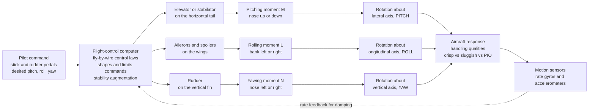

# 🕹️ Flight Control and Handling Qualities

> [!abstract] TL;DR
> **Flight control** is how a pilot steers an aircraft about its **three rotational axes** — **pitch** (nose up/down, worked by the **elevator** or all-moving **stabilator** on the tail), **roll** (banking, worked by the **ailerons** on the wings plus **spoilers**), and **yaw** (nose left/right, worked by the **rudder** on the fin). Each hinged surface deflects the airflow to create an **aerodynamic moment** about one body axis; secondary controls — **flaps/slats** for high lift, **trim tabs**, **spoilers/airbrakes** — reshape the whole flight. How well the aircraft responds to those inputs — crisp and predictable versus sluggish, twitchy, or prone to **pilot-induced oscillation (PIO)** — is its **handling (flying) qualities**, a partly *subjective* property made rigorous by the **Cooper–Harper rating scale** and by **MIL-spec** requirements that pin the frequency and damping of the aircraft's natural modes (the **short-period** in pitch, the **Dutch roll** in yaw/roll) into acceptable boxes. The technology evolved from **direct mechanical/cable** linkages, through **hydraulically boosted** controls, to modern **fly-by-wire (FBW)**: sensors + a flight-control computer running **control laws** + electrically driven actuators. FBW does far more than move surfaces — it adds **stability augmentation (SAS)**, **envelope protection**, and, crucially, it can fly a **deliberately unstable** airframe (**relaxed static stability**) that would be uncontrollable by hand, buying agility and efficiency. The unifying idea is **feedback**: measure the aircraft's motion, feed it back through the actuators, and *shape the handling qualities in software* — the reason a raw, unstable jet can feel like a natural extension of the pilot's hand.

---

## Intuition

**Analogy:** Flying an aircraft is like steering in **three rotational directions at once**. Imagine you are holding a model plane and you can twist it three ways: tip the **nose up and down** (pitch), **bank it left and right** like leaning into a turn (roll), and swing the **nose left and right** like shaking your head "no" (yaw). A real aircraft twists about those same three axes using **three sets of hinged flaps** — the **elevator** on the tail for pitch, the **ailerons** on the wings for roll, and the **rudder** on the fin for yaw. When the pilot moves a control, a flap deflects, the airflow is bent, and the bent air pushes the aircraft to rotate about that one axis. That is the whole mechanism: hinge a flap into the wind, and the wind twists the aircraft for you.

Now the subtler half. **Handling qualities** is not about *whether* the plane responds — it is about how it *feels*. Does it answer your input crisply and predictably, settling right where you wanted, or does it lag sluggishly, jerk over-sensitively, or worst of all start **swinging back and forth** as you chase it with corrections that arrive a half-second too late — a **pilot-induced oscillation**? A great-handling aircraft feels like an **extension of the pilot's hands**; you *think* the maneuver and it happens. A poor-handling one seems to **fight back**, and no amount of skill fully hides it. The final twist of the modern era: the best-flying jets are often the ones that are, aerodynamically, the *worst* — deliberately **unstable** for agility — but a computer sits between the stick and the surfaces, silently damping and reshaping every command so the raw, twitchy airframe presents a smooth, docile face to the pilot. That computer-in-the-loop is **fly-by-wire**, and it is why a knife-edge-unstable fighter can be easier to land than a 1950s trainer.

---

## How It Works

### Core Mechanics

**1. Three axes, three moments, three primary controls.** An aircraft is a rigid body free to rotate about three body axes through its center of gravity: the **longitudinal** (roll) axis, the **lateral** (pitch) axis, and the **vertical** (yaw) axis. A control surface works by deflecting to change the local airfoil camber, which changes the lift on that surface, which creates a **moment** about the corresponding axis:
- **Pitch** — the **elevator** (a hinged flap on the horizontal stabilizer) or a one-piece all-moving **stabilator**; deflecting it up pushes the tail down and the nose up, generating pitching moment $M$.
- **Roll** — the **ailerons** deflect *differentially* (one up, one down) so one wing gains lift and the other loses it, generating rolling moment $L$; **spoilers** on the upper wing assist by dumping lift on the down-going side (and avoid the aileron's tendency to twist the wing at high speed).
- **Yaw** — the **rudder** on the vertical fin swings the tail sideways, generating yawing moment $N$; it coordinates turns and counters engine-out asymmetry.

**2. Secondary controls reshape the flight, not just the attitude.** **Flaps** and **slats** are high-lift devices that add camber/area for slow takeoff and landing (they change the *whole* force balance, not one moment). **Trim tabs** (or a trimmable stabilizer, or FBW auto-trim) zero out the steady stick force so the pilot need not hold pressure. **Spoilers/airbrakes** kill lift and add drag for descent and — deployed symmetrically on the ground — dump lift onto the wheels for braking.

**3. Control power, hinge moments, and effectiveness.** The **control power** is how much moment a surface produces per degree of deflection (e.g. the pitch-control derivative $C_{m_{\delta_e}}$). But a surface fights back: the airflow exerts a **hinge moment** the pilot (or actuator) must overcome — the physical reason large fast aircraft need **hydraulic boost** or **fly-by-wire** actuators rather than a cable to the pilot's muscles. Crucially, **control-surface effectiveness is not constant**: it *collapses* near **stall** (separated flow no longer responds to deflection — so ailerons can quit while the rudder still bites) and behaves erratically in the **transonic** regime (shock waves on the surface can even *reverse* the sense of a control).

**4. Handling qualities = the feel, made measurable.** How easily and precisely a pilot can fly a task is captured qualitatively by the **Cooper–Harper rating scale** (a decision-tree yielding 1 = excellent to 10 = uncontrollable, grouped into **Level 1** satisfactory, **Level 2** acceptable-but-degraded, **Level 3** controllable-but-deficient). It is pinned quantitatively by **flying-qualities specifications** (historically **MIL-F-8785C**, later **MIL-STD-1797**) that place the aircraft's **dynamic modes** into required boxes of **natural frequency** and **damping ratio** — chiefly the fast **short-period** oscillation (pitch) and the coupled **Dutch roll** (yaw–roll wobble) — plus limits on control sensitivity and stick force per g. Get the damping or sensitivity wrong and the aircraft feels sluggish, twitchy, or PIO-prone even though every part "works."

**5. The flight-control system: from cables to computers.** Three generations coexist:
- **Mechanical/reversible** — pushrods, cables, and pulleys connect the stick directly to the surfaces; the pilot feels real aerodynamic forces. Simple and robust; impractical for large or fast aircraft.
- **Hydraulically boosted (power-assisted)** — hydraulic actuators supply the muscle; an **artificial feel** system feeds the pilot synthetic stick forces since the real hinge moments are hidden.
- **Fly-by-wire (FBW)** — the stick/pedals become **electrical transducers**; their signals go to a **flight-control computer** that runs **control laws** and commands the actuators. There is no direct mechanical path.

**6. What fly-by-wire buys.** Because a computer sits in the loop, it can add **feedback** the airframe never had. **Stability augmentation (SAS)** feeds back measured **rate** (pitch/roll/yaw-rate gyros) and other states to synthesize damping — a **yaw damper** tames Dutch roll; a pitch-rate feedback tightens the short-period. **Envelope protection** limits angle of attack, load factor, bank, and speed so the pilot *cannot* stall or overstress the aircraft. And most profoundly, FBW can stabilize a **deliberately unstable** airframe (**relaxed static stability**): moving the CG aft or shrinking the tail makes the bare aircraft statically unstable — impossible to fly by hand — but the computer damps the divergence hundreds of times a second, trading hand-flyability (which the pilot never sees) for **agility, reduced trim drag, and efficiency**. Control laws are **gain-scheduled** across the envelope (gains vary with speed, altitude, configuration) and run on **redundant** (triplex/quadruplex, often dissimilar) channels for safety.

**7. It is control theory in the sky.** Everything above is a **feedback control** problem: the airframe is the *plant*, the pilot and computer are *controllers*, the surfaces are *actuators*, and handling qualities are the *closed-loop response* — rise time, overshoot, damping, and delay. This is where aerodynamics, stability, and control engineering meet, and it ties directly into the **avionics and guidance–navigation–control (GNC)** stack that automates the whole loop.

### Flow / Architecture



---

## Key Concepts

### Secondary Level

- **Three ways to twist a plane.** Pitch = nose up/down, roll = tipping the wings like leaning into a turn, yaw = nose left/right. Every maneuver is a mix of these three.
- **Three sets of flaps do the twisting.** The **elevator** on the tail pitches, the **ailerons** on the wings roll (one goes up while the other goes down), and the **rudder** on the tail fin yaws. Move a flap into the wind and the wind twists the plane.
- **Handling qualities = how the plane feels.** A good-handling aircraft answers the pilot instantly and predictably, like a well-tuned car. A bad one is sluggish, jumpy, or starts wobbling — sometimes worse the harder the pilot tries to fix it (a **pilot-induced oscillation**).
- **Modern jets have a computer in between.** Instead of cables from the stick to the flaps, **fly-by-wire** sends the pilot's command to a computer that decides how to move the surfaces — smoothing the ride and stopping the pilot from stalling or over-stressing the plane.
- **Why the computer matters.** Some modern jets are built *unstable* on purpose so they turn faster and fly more efficiently. A human could never fly them, but the computer corrects them hundreds of times a second, so to the pilot they feel perfectly normal.

### Undergraduate Level

- **Body-axis moments and control derivatives.** Rotation is governed by moment equations about the roll, pitch, and yaw axes. Control effectiveness is captured by derivatives such as $C_{m_{\delta_e}}$ (pitch per elevator), $C_{l_{\delta_a}}$ (roll per aileron), $C_{n_{\delta_r}}$ (yaw per rudder). **Control power** is the moment available; it degrades near stall and transonically.
- **The dynamic modes set the feel.** Longitudinal motion splits into the fast, well-damped **short-period** (angle-of-attack/pitch-rate oscillation, a few rad/s) and the slow **phugoid** (speed/altitude trade). Lateral–directional motion has the **roll subsidence** (fast decay), the slow **spiral** mode, and the lightly damped **Dutch roll** (coupled yaw–roll snake). Handling specs bound each mode's $\omega_n$ and $\zeta$.
- **Cooper–Harper and levels.** Pilots rate task workload/performance 1–10; specs group modes into **Level 1/2/3**. A short-period with $\zeta \approx 0.7$ and appropriate frequency (via the **CAP**, control-anticipation parameter) is Level 1; too little damping or too much delay drops it toward Level 3.
- **Static vs relaxed stability.** A statically stable aircraft has $C_{m_\alpha} < 0$ (a nose-up disturbance makes a nose-down restoring moment). **Relaxed static stability** deliberately moves toward $C_{m_\alpha} \ge 0$ (CG aft of the neutral point) for agility and reduced trim drag — flyable *only* with continuous augmentation.
- **Stability augmentation = rate feedback.** A **yaw damper** feeds yaw rate to the rudder to damp Dutch roll; a **pitch damper** feeds pitch rate to the elevator to raise short-period damping. This is proportional/rate feedback — the same machinery as a [[PID_Control]] loop applied to the airframe.
- **Adverse yaw and coordination.** Deflected ailerons add drag on the up-going (down-aileron) wing, yawing the nose *away* from the turn; the rudder (or a FBW turn-coordination law) cancels it. Missing this makes a roll feel "dirty."

### Graduate Level

- **Linearized flight dynamics and pole placement.** About a trim point, the equations linearize into decoupled longitudinal and lateral–directional state-space systems $\dot{x} = Ax + Bu$; the eigenvalues of $A$ *are* the modes (short-period, phugoid, Dutch roll, roll, spiral). Full-state feedback $u = -Kx$ (LQR or eigenstructure assignment) relocates those poles to hit handling-quality boxes — the modern design method (see [[State_Space_Models_in_Control]]).
- **Handling-quality criteria as constraints on the loop.** Beyond mode $\omega_n$/$\zeta$: the **CAP** ties short-period frequency to load-factor sensitivity; **Bandwidth/phase-delay** and **Gibson dropback** criteria bound the closed-loop pitch response; the **Neal–Smith** criterion models pilot compensation. These translate directly into loop-shaping targets on the augmented system.
- **PIO and the pilot as a variable-gain element.** Pilot-induced oscillations are closed-loop instabilities of the **pilot + aircraft + actuator** system. **Category II PIO** stems from **rate-limiting** of actuators, which injects an amplitude-dependent phase lag: as the pilot pushes harder, the effective delay grows, phase margin vanishes, and a limit cycle locks in. Time delay from FBW computation/filtering is a prime PIO driver (McRuer crossover model).
- **Gain scheduling and dynamic pressure.** Control effectiveness scales with dynamic pressure $\bar q = \tfrac12 \rho V^2$, so a fixed-gain controller that is crisp at approach is nervous at cruise; gains are **scheduled** on airspeed, altitude, Mach, and configuration, with interpolation and stability guarantees across the schedule.
- **Actuator, aeroservoelastic, and redundancy limits.** Real actuators have **rate and position limits** and finite bandwidth; **aeroservoelastic** coupling (control laws exciting structural bending/flutter modes) forces notch filters and structural-mode-control loops. **Control reversal** occurs when high-$\bar q$ wing twist from aileron deflection overpowers the aileron's own moment. Flight safety demands **triplex/quadruplex, often dissimilar-redundant** channels with voting and reconfiguration.
- **Nonlinear and modern control laws.** High-angle-of-attack, thrust-vectoring, and envelope-protection logic pushes beyond linear methods into **dynamic inversion**, **gain-scheduled $H_\infty$**, **incremental nonlinear dynamic inversion (INDI)**, and, increasingly, learning-based/adaptive augmentation — all still judged by the same Cooper–Harper yardstick.

---

## Python Demo

```python
# Flight control and handling qualities in one figure, numpy + matplotlib only.
#
#   (a) CONTROL-SURFACE RESPONSE (pitch-rate response to a STEP ELEVATOR input).
#       Model the aircraft's SHORT-PERIOD pitch mode as a 2nd-order system and
#       plot the pitch-rate q(t) after a step elevator deflection. Compare:
#         - a WELL-DAMPED aircraft  (zeta ~ 0.65): crisp, small overshoot,
#           settles fast  -> Level 1 handling.
#         - a POORLY-DAMPED aircraft (zeta ~ 0.12): big overshoot, ringing,
#           slow to settle -> oscillatory, PIO-prone -> Level 3.
#       We read off rise/overshoot/settling and relate them to handling boxes.
#
#   (b) FLY-BY-WIRE / STABILITY AUGMENTATION (SAS).
#       Take a BARE AIRFRAME with RELAXED STATIC STABILITY (statically UNSTABLE:
#       one positive eigenvalue -> pitch-rate diverges, unflyable by hand).
#       Close a rate/alpha feedback loop  delta_e = cmd - K @ [alpha, q]  and
#       show the SAME airframe become a crisp, well-damped response. That single
#       transformation IS the essence of modern fly-by-wire flight control.
import numpy as np
import matplotlib.pyplot as plt

# ------------------------------------------------------------------ #
# Fixed-step RK4 integrator (no scipy needed)
# ------------------------------------------------------------------ #
def rk4(f, x0, t):
    x = np.zeros((len(t), len(x0)))
    x[0] = np.asarray(x0, dtype=float)
    for i in range(len(t) - 1):
        dt = t[i + 1] - t[i]
        k1 = f(x[i],            t[i])
        k2 = f(x[i] + 0.5*dt*k1, t[i] + 0.5*dt)
        k3 = f(x[i] + 0.5*dt*k2, t[i] + 0.5*dt)
        k4 = f(x[i] + dt*k3,     t[i] + dt)
        x[i + 1] = x[i] + (dt / 6.0) * (k1 + 2*k2 + 2*k3 + k4)
    return x

# ================================================================== #
# (a) SHORT-PERIOD PITCH-RATE STEP RESPONSE: well- vs poorly-damped
#     y'' + 2*zeta*wn*y' + wn^2 * y = wn^2 * Kss * u(t)   ->  steady q = Kss
# ================================================================== #
def second_order(zeta, wn, Kss):
    def f(x, t):
        y, yd = x
        ydd = wn**2 * Kss - 2.0*zeta*wn*yd - wn**2 * y
        return np.array([yd, ydd])
    return f

t   = np.linspace(0.0, 6.0, 1500)
Kss = 4.0                                    # steady pitch rate [deg/s] per unit step
wn  = 3.5                                     # short-period natural frequency [rad/s]
q_good = rk4(second_order(0.65, wn, Kss), [0.0, 0.0], t)[:, 0]   # Level-1 feel
q_poor = rk4(second_order(0.12, wn, Kss), [0.0, 0.0], t)[:, 0]   # ringy, PIO-prone

def metrics(q, t, ss, band=0.05):
    overshoot = (q.max() - ss) / ss * 100.0                       # percent
    outside   = np.where(np.abs(q - ss) > band * ss)[0]
    t_settle  = t[outside[-1]] if len(outside) else 0.0           # 5% settling time
    return overshoot, t_settle

os_g, ts_g = metrics(q_good, t, Kss)
os_p, ts_p = metrics(q_poor, t, Kss)
print("=== (a) Short-period pitch-rate step response ===")
print(f"  well-damped  zeta=0.65 : overshoot {os_g:5.1f} % , 5% settling {ts_g:4.2f} s  -> crisp (Level 1)")
print(f"  poorly-damped zeta=0.12 : overshoot {os_p:5.1f} % , 5% settling {ts_p:4.2f} s  -> ringing (Level 3)")

# ================================================================== #
# (b) BARE (UNSTABLE) AIRFRAME  vs  SAS-AUGMENTED, state = [alpha, q]
#     xdot = A x + B * delta_e ,  q = x[1]
#     A[1,0] = M_alpha > 0  ->  statically UNSTABLE (relaxed static stability)
# ================================================================== #
A = np.array([[-1.0,  1.0],
              [ 4.0, -0.4]])                  # M_alpha = +4 -> unstable bare airframe
B = np.array([-0.1, -6.0])                    # elevator effectiveness [Z_de, M_de]
K = np.array([-0.9, -0.18])                   # SAS gains on [alpha, q]:  delta_e = cmd - K@x
delta_cmd = -1.0                              # step elevator command (sign -> nose up, q>0)

A_aug = A - np.outer(B, K)                     # closed-loop:  xdot = (A - B K) x + B*cmd

def make_airframe(Amat):
    def f(x, t):
        return Amat @ x + B * delta_cmd
    return f

t2 = np.linspace(0.0, 4.0, 1200)
q_bare = rk4(make_airframe(A),     [0.0, 0.0], t2)[:, 1]   # diverges (unstable)
q_augm = rk4(make_airframe(A_aug), [0.0, 0.0], t2)[:, 1]   # crisp & stable

print("\n=== (b) Fly-by-wire stability augmentation ===")
print(f"  bare-airframe eigenvalues      : {np.round(np.linalg.eigvals(A), 3)}   (a POSITIVE root -> unstable)")
print(f"  SAS-augmented eigenvalues      : {np.round(np.linalg.eigvals(A_aug), 3)}   (both LHP -> stable)")
wn_a = np.sqrt(np.linalg.det(A_aug)); zeta_a = -np.trace(A_aug) / (2.0 * wn_a)
print(f"  augmented short-period         : wn = {wn_a:4.2f} rad/s , zeta = {zeta_a:4.2f}  -> well-damped")

# ------------------------------ plotting ------------------------------ #
fig, (axL, axR) = plt.subplots(1, 2, figsize=(14, 6))
fig.suptitle("Flight Control and Handling Qualities: damping, feel, and fly-by-wire",
             fontsize=13, fontweight="bold")

# (a) well- vs poorly-damped elevator step response
axL.axhline(Kss, color="gray", ls="--", lw=1, label="commanded steady pitch rate")
axL.axhspan(0.95*Kss, 1.05*Kss, color="#e8f0e8", alpha=0.8)      # 5% settling band
axL.plot(t, q_good, color="#1f77b4", lw=2.6, label=f"well-damped  zeta=0.65  (crisp, Level 1)")
axL.plot(t, q_poor, color="#d62728", lw=2.2, label=f"poorly-damped zeta=0.12  (ringy, Level 3)")
axL.annotate("overshoot + ringing\n= sluggish, twitchy,\nPIO-prone feel",
             xy=(t[np.argmax(q_poor)], q_poor.max()),
             xytext=(2.2, Kss*1.55), fontsize=8, color="#d62728",
             arrowprops=dict(arrowstyle="->", color="#d62728"))
axL.set_xlabel("time after step elevator input  [s]")
axL.set_ylabel("pitch rate  q  [deg/s]")
axL.set_title("(a) Control response: damping sets the FEEL")
axL.legend(loc="lower right", fontsize=8)
axL.grid(alpha=0.3)

# (b) bare (unstable) vs SAS-augmented
axR.plot(t2, q_bare, color="#d62728", lw=2.4, label="bare airframe (relaxed stability): DIVERGES")
axR.plot(t2, q_augm, color="#1f77b4", lw=2.6, label="fly-by-wire SAS: crisp & stable")
axR.axhline(q_augm[-1], color="gray", ls="--", lw=1)
axR.annotate("unstable pitch-rate\ndivergence\n(unflyable by hand)",
             xy=(t2[np.argmax(q_bare > 6.0)] if np.any(q_bare > 6.0) else t2[-1], 6.0),
             xytext=(1.2, 5.2), fontsize=8, color="#d62728",
             arrowprops=dict(arrowstyle="->", color="#d62728"))
axR.annotate("feedback  delta_e = cmd - K[alpha, q]\nre-shapes the SAME airframe",
             xy=(2.0, q_augm[-1]), xytext=(1.6, -1.4), fontsize=8, color="#1f77b4",
             arrowprops=dict(arrowstyle="->", color="#1f77b4"))
axR.set_ylim(-2.0, 6.5)
axR.set_xlabel("time after step elevator command  [s]")
axR.set_ylabel("pitch rate  q  [deg/s]")
axR.set_title("(b) Fly-by-wire: turning an UNSTABLE jet crisp")
axR.legend(loc="upper left", fontsize=8)
axR.grid(alpha=0.3)

plt.tight_layout(rect=[0, 0, 1, 0.95])
plt.show()
```

Running this prints the numbers and draws two panels. The **left panel** is the essence of **handling qualities**: both aircraft receive the same step elevator input, but the **well-damped** one ($\zeta = 0.65$) rises quickly to the commanded pitch rate with only a small overshoot and settles inside the 5% band in about a second — it feels *crisp and predictable* (Level 1). The **poorly-damped** one ($\zeta = 0.12$) overshoots hugely and **rings** for seconds — the aircraft keeps oscillating after the pilot has stopped moving the stick, exactly the trait that invites over-correction and **pilot-induced oscillation** (Level 3). The **right panel** is the essence of **fly-by-wire**: the bare airframe has **relaxed static stability** — its state matrix has a *positive* eigenvalue, so its pitch rate **diverges** and no human could stabilize it by hand. Closing a simple **rate/angle-of-attack feedback loop** ($\delta_e = \text{cmd} - K\,[\alpha, q]$) moves *both* poles into the left half-plane and reshapes the very same airframe into a **crisp, well-damped** response. That is stability augmentation in one equation — measure the motion, feed it back through the actuator, and *design the handling qualities in software*.

---

## Real-World Applications

> **Example — the F-16, first production relaxed-static-stability fly-by-wire fighter.** The General Dynamics F-16 was deliberately built **statically unstable** in pitch (CG aft of the neutral point) to sharpen its maneuverability and cut trim drag — precisely the diverging bare airframe of the demo's right panel. Its quadruplex analog (later digital) **fly-by-wire** system damps that instability continuously; without it the jet would tumble in a fraction of a second. The same program is a textbook lesson in **handling-quality pitfalls**: early flight testing suffered **pilot-induced oscillations**, and a high-gain, rate-limited pitch loop drove the very first landing attempts into ringing, informing decades of PIO-avoidance design.

> **Example — the Airbus A320 side-stick with envelope protection.** The A320 (1988) brought digital FBW to airliners: the pilot flies a small **side-stick** whose signals pass through **control laws** that command **load factor** in pitch and **roll rate** in roll (not raw surface deflection), while **flight-envelope protection** hard-limits angle of attack, bank, speed, and g so the aircraft *cannot* be stalled or overstressed in normal law. This trades direct control for consistent, forgiving handling qualities across the flight envelope — and it introduced its own new failure class, **mode confusion** (crews misreading which control law is active after a reversion), now a core human-factors concern.

> **Example — yaw dampers and Dutch roll on every swept-wing jet.** Swept-wing transports (from the Boeing 707 onward) have a lightly damped **Dutch roll** — an annoying, sometimes divergent yaw–roll wallow. The fix is a **yaw damper**: a stability-augmentation loop that feeds **yaw rate** to the rudder to synthesize the damping the airframe lacks. It is the demo's SAS idea applied to the lateral–directional axis, and it runs quietly on essentially every jet you have flown on. The Boeing 777 and 787 extend this to full FBW with structural-mode and gust-load alleviation.

> **Example — PIO in flight test: the Space Shuttle and YF-22.** During the Shuttle's 1977 approach-and-landing tests, a control-law time delay drove a lateral **PIO** on the final free-flight touchdown. In 1992 a **YF-22** prototype was lost when a rate-limited flight-control interaction produced a divergent pitch PIO near the runway. Both are the poorly-damped, delayed closed loop of the demo taken to its dangerous limit — vivid proof that a high-performance aircraft can be *unflyable* if its handling qualities are wrong, which is exactly why flying-qualities specifications exist.

---

## Common Pitfalls

- **Pilot-induced oscillation (PIO).** A closed-loop instability of the *pilot + aircraft + actuator* system, not of the aircraft alone. It is triggered by excessive **time delay** (FBW computation, filtering) and by **actuator rate-limiting** (which adds amplitude-dependent phase lag): the harder the pilot chases the error, the more the effective delay grows until a divergent limit cycle locks in. Avoid it by minimizing loop delay, providing rate-limit margin, and testing high-gain tasks (landing, air-to-air tracking, refueling).
- **Confusing control power with static stability.** A surface producing a big moment (high control power) tells you nothing about whether the aircraft *returns* to trim after a disturbance (static stability, $C_{m_\alpha}$). A relaxed-stability jet has ample control power *and* is unstable; a docile trainer may be very stable but control-limited. They are independent axes of design.
- **Ignoring the dynamic modes' damping and frequency.** An aircraft can have correct trim, adequate control power, and still handle badly if the **short-period** or **Dutch roll** damping/frequency sits in a Level 2/3 box — feeling sluggish, twitchy, or ringy. Design and certification must place $\omega_n$ and $\zeta$ inside the flying-qualities boundaries, not just "make it fly."
- **Over-sensitive versus sluggish controls.** Too much control sensitivity (moment per stick inch) makes the aircraft twitchy and PIO-prone; too little makes it feel like flying a truck and forces large, laggy inputs. The right **stick force per g** and command gain are a handling-quality target, not an afterthought — and they must be scheduled across the envelope.
- **Forgetting control effectiveness collapses at the edges.** Near **stall**, separated flow can render ailerons useless (roll control lost) while the rudder still works — the reason for stall-recovery technique and for wing **washout**. **Transonically**, shock waves can weaken or even *reverse* a control. Assuming constant effectiveness across the envelope mis-sizes surfaces and control laws.
- **Adverse yaw and uncoordinated rolls.** Deflected ailerons drag the up-going wing back, yawing the nose *out of* the turn; without rudder (or a FBW turn-coordination law) the roll feels dirty and the ball swings. This is a handling defect, not just an efficiency loss.
- **Treating fly-by-wire as "uncrashable."** Envelope protection reduces some risks but adds **mode confusion**, reversion behavior, sensor-failure handling, and **aeroservoelastic** coupling (control laws exciting structural/flutter modes). FBW moves the failure modes, it does not delete them — hence redundancy, dissimilar channels, and notch filtering.
- **Gain-schedule gaps and dynamic-pressure surprises.** Control effectiveness scales with $\bar q = \tfrac12\rho V^2$, so a controller tuned at approach is nervous at cruise (and vice versa). Sparse or poorly-blended **gain schedules** leave pockets of degraded handling — always validate the *whole* envelope, including configuration and CG extremes.

---

## Related Concepts

**Control theory — the machinery under every flight-control law**
- [[Feedback_Control_Fundamentals]] — the closed-loop plant/controller/actuator framework; a flight-control system is this loop with the airframe as plant and handling qualities as the closed-loop response.
- [[PID_Control]] — proportional/rate feedback is exactly what a pitch damper or yaw damper does to synthesize damping the airframe lacks.
- [[State_Space_Models_in_Control]] — the linearized $\dot{x}=Ax+Bu$ flight-dynamics model whose eigenvalues *are* the short-period, phugoid, and Dutch-roll modes; full-state feedback $u=-Kx$ relocates them to meet handling-quality boxes.
- [[Feedback_and_Control_Systems]] — the electrical-engineering companion on feedback, stability margins, and loop shaping that underpin gain-scheduled control laws.
- [[Control_of_Mechanical_Systems]] — actuator dynamics, servo control, and the mechatronic hardware (sensors + computers + actuators) that physically realize fly-by-wire.

**Mechanics — why moments rotate the aircraft**
- [[Rotational_Dynamics]] — the rigid-body torque/angular-momentum physics behind pitching, rolling, and yawing moments about the three body axes.

This note sits in the *Aerospace_Engineering / Flight Mechanics and Performance* section, where flight control ties together aerodynamics, stability, and control. Its sibling notes carry the story further: *Aircraft_Stability_and_Flight_Dynamics* derives the static and dynamic stability, the neutral point, and the modes (short-period, phugoid, Dutch roll, spiral) whose damping this note reshapes; *Aircraft_Performance* turns forces and controllability into speed, range, turn, and envelope limits; *Avionics_and_Flight_Control_Systems* details the sensors, computers, actuators, and redundancy that implement fly-by-wire; and *Guidance_Navigation_and_Control* closes the outer loop, automating the inner control loops this note describes into autopilots and autonomous flight.

---

## Review Questions

**Secondary**
1. Name the three axes an aircraft can rotate about and the control surface used for each. Using the "extension of the pilot's hands" idea, explain in plain words what makes an aircraft feel *good* to fly versus *bad*, and describe what a pilot-induced oscillation is.

**Undergraduate**
2. A short-period pitch mode is modeled as a second-order system with natural frequency $\omega_n = 4$ rad/s. (a) Qualitatively compare the step pitch-rate response for damping ratios $\zeta = 0.7$ versus $\zeta = 0.15$ — which is Level 1 and which is PIO-prone, and why? (b) A **yaw damper** feeds yaw rate to the rudder; explain, in feedback-control terms, how this raises the damping of the Dutch roll mode without a pilot in the loop.
3. Explain **relaxed static stability**: what is changed about the aircraft ($C_{m_\alpha}$, CG, tail), what is gained (agility, drag), and why the bare airframe is unflyable by hand while fly-by-wire makes it docile. Relate your answer to the diverging-versus-augmented pitch response in the demo.

**Graduate**
4. You are given the linearized longitudinal state-space model $\dot{x} = Ax + B\delta_e$ with $x = [\alpha, q]$ of a statically unstable airframe (one right-half-plane eigenvalue). (a) Design a full-state feedback $\delta_e = -Kx$ (conceptually, via pole placement or LQR) that yields a short-period with $\zeta \approx 0.7$ and an appropriate frequency, and state how you would verify the result against a handling-quality criterion such as CAP or bandwidth/phase-delay. (b) Explain how **actuator rate-limiting** and **loop time delay** can turn this well-designed loop into a Category II PIO, and what design measures (rate margin, delay budget, gain scheduling on $\bar q$) mitigate it. (c) Discuss why the controller must be gain-scheduled across the flight envelope and what redundancy the flight-control computer requires for certification.

---

## Sources

- M. V. Cook — *Flight Dynamics Principles*, 3rd ed. (Butterworth-Heinemann, 2013) — modes, stability, control, and handling-qualities framework in state-space form.
- B. L. Stevens, F. L. Lewis & E. N. Johnson — *Aircraft Control and Simulation*, 3rd ed. (Wiley, 2016) — nonlinear/linear flight dynamics, control-law design, and fly-by-wire simulation.
- R. C. Nelson — *Flight Stability and Automatic Control*, 2nd ed. (McGraw-Hill, 1998) — static/dynamic stability, control surfaces, and stability-augmentation systems.
- D. McRuer, I. Ashkenas & D. Graham — *Aircraft Dynamics and Automatic Control* (Princeton University Press, 1973) — the classic treatment of handling qualities, the crossover pilot model, and PIO.
- G. E. Cooper & R. P. Harper — *The Use of Pilot Rating in the Evaluation of Aircraft Handling Qualities*, NASA TN D-5153 (1969) — the origin of the Cooper–Harper rating scale.

---

#aerospace-engineering #flight-control #handling-qualities #fly-by-wire #control-surfaces
