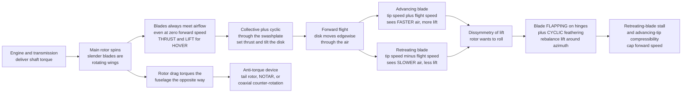

# 🚁 Rotorcraft and Helicopter Aeromechanics

> [!abstract] TL;DR
> A **helicopter is a fixed-wing aircraft that carries its own wing around in a circle.** Rather than fly forward to force air over a stationary wing, it **spins slender wings** — the rotor blades — so they always meet oncoming air and make lift even at **zero forward speed**: it can **hover**. The cheapest theory, **momentum (actuator-disk) theory**, treats the rotor as a thin disk that flings air downward; it gives the **hover induced velocity** $v_i = \sqrt{T/(2\rho A)}$ and **ideal induced power** $P = T\,v_i = T^{3/2}/\sqrt{2\rho A}$. The single most important number that falls out is **disk loading** $T/A$: a *big* rotor spreads the thrust over a *large* disk, needs only a *gentle* downwash, and therefore **sips power** — which is why helicopters have enormous rotors and jets cannot hover economically. **Blade-element theory** adds airfoil detail, and the **figure of merit** scores real hover efficiency against the ideal. Control comes from the **swashplate**: **collective** pitch changes all blades together to set total thrust, while **cyclic** pitch varies each blade's pitch around the azimuth to **tilt the rotor disk** and thus pitch and roll the aircraft. But spinning a wing has a price. The **torque** needed to drive the rotor tries to spin the fuselage the *other* way, demanding an **anti-torque device** — a **tail rotor**, **NOTAR**, or **coaxial/tandem** counter-rotating rotors. And in forward flight the **advancing blade** (tip speed *plus* flight speed) meets much faster air than the **retreating blade** (tip speed *minus* flight speed), so lift becomes lopsided — the **dissymmetry of lift** — resolved by letting blades **flap** on hinges and by cyclic feathering. That asymmetry, plus **retreating-blade stall** and **advancing-blade compressibility**, sets the forward-speed limit; hazards like **vortex ring state (settling with power)** and the life-saving trick of **autorotation** round out a beautiful, inherently unstable balancing act that gives rotorcraft their unique gift: **vertical takeoff, hover, and low-speed flight.**

---

## Intuition

**Analogy:** A helicopter is a plane that carries its own wing around in a circle. An airplane must *fly forward* to make a river of air rush over its fixed wing and generate lift; take away the forward speed and the wing is useless. A helicopter cheats the deal: instead of moving the whole machine to feed air to a stationary wing, it **spins the wings themselves**. The rotor blades are just long, slender wings whirling around a mast, so they *always* have air rushing over them — even when the fuselage hangs perfectly still in the sky. That is the entire secret of the **hover**: keep the wings moving through the air by spinning them, and you no longer need the body to move at all.

But this cleverness sends a bill, and the bill has three lines. **First**, driving a wing around a circle takes **torque**, and Newton's third law insists on paying it back: the engine twists the rotor one way, so the rotor twists the *fuselage* the other way — without a fix, the cabin would spin like a top under a stuck merry-go-round. That is why a helicopter needs a **tail rotor** (or a second, counter-spinning rotor) purely to hold its nose straight. **Second**, the moment the helicopter tries to *go somewhere*, its spinning wing becomes lopsided: on one side a blade slices **into** the wind (its own rotation *plus* the flight speed) and lifts hard, while on the opposite side a blade sweeps **backward with** the wind (its rotation *minus* the flight speed) and lifts feebly. One side heaves up, the other sags — and the whole machine wants to roll over. Engineers tame this **dissymmetry of lift** by hanging the blades on **flapping hinges** and by feathering their pitch cyclically as they whirl around, so each blade quietly trims its own lift twice per revolution. **Third**, mishandle the descent and the rotor can sink into its own downwash and stop working — the deadly **vortex ring state**, or "settling with power." Fighting torque, balancing an ever-lopsided wing, and dodging its own wake make the rotorcraft the most delicate, most capable, and least naturally stable flying machine humans build.

---

## How It Works

### Core Mechanics

**1. The rotor is a rotating wing — hover needs no forward flight.** Each blade is a slender airfoil moving through the air at its local speed $\Omega r$ (rotor angular rate $\Omega$ times radius $r$), so it makes lift by exactly the physics of any wing — pressure difference, circulation, downwash. Because the *blades* move even when the *aircraft* does not, a rotor produces **thrust at zero airspeed**. Point that thrust up and it becomes weight-supporting lift: the machine **hovers**. Point it slightly forward and the same thrust also pulls the helicopter ahead.

**2. Momentum (actuator-disk) theory — the cheapest hover model.** Replace the messy spinning blades with a single thin **actuator disk** of area $A = \pi R^2$ that adds momentum to the air passing through it. Conserving mass, momentum, and energy for a rotor producing thrust $T$ in still air gives the **induced velocity** (the downwash the rotor pumps through its own disk):
$$v_i = \sqrt{\frac{T}{2\rho A}}\,,$$
and the **ideal induced power** needed to make that thrust:
$$P_{\text{ideal}} = T\,v_i = \frac{T^{3/2}}{\sqrt{2\rho A}}\,.$$
Far below the rotor the wake has accelerated to $2v_i$ and contracted to half the disk area — the classic actuator-disk result.

**3. Disk loading is destiny.** Group the terms and the key ratio is **disk loading** $DL = T/A$, thrust per unit disk area:
$$\frac{P_{\text{ideal}}}{T} = v_i = \sqrt{\frac{DL}{2\rho}}\,.$$
Power *per unit thrust* grows as the **square root of disk loading**. A rotor with a *big* disk (low $DL$) needs only a *gentle* downwash and therefore very little power to hover; a small disk (high $DL$) must fling a thin, fast jet of air and burns power lavishly. This one relation explains why helicopters wear rotors many metres across, why **tiltrotors** (smaller, higher-$DL$ proprotors) hover less efficiently than helicopters, and why a **lift jet** (tiny effective disk, enormous $DL$) can hover but drinks fuel doing it.

**4. Figure of merit — grading real hover.** Real rotors are worse than the ideal because blades have profile drag and non-uniform inflow. The **figure of merit** scores hover efficiency:
$$FM = \frac{P_{\text{ideal}}}{P_{\text{actual}}} = \frac{T\,v_i}{P_{\text{actual}}}\,,$$
typically $0.6$–$0.8$ for a good rotor. **Blade-element theory** — integrating the lift and drag of each spanwise strip using airfoil data, then marrying it to momentum theory ("blade-element-momentum") — supplies the profile losses and the twist/taper design levers that push $FM$ upward.

**5. Control: collective, cyclic, and the swashplate.** A helicopter is flown by changing **blade pitch**, not by ailerons. Two independent commands are fed through a **swashplate** (a non-rotating plate coupled to a rotating one):
- **Collective pitch** raises or lowers the pitch of *all* blades equally, changing *total* rotor thrust — the up/down control.
- **Cyclic pitch** raises the pitch on one side of the disk and lowers it on the other, *once per revolution*, so the rotor makes more lift on one side. The disk **tilts**, and with it the thrust vector — tilting the disk forward pitches the nose down and drives the helicopter forward; tilting it sideways rolls and slides it. Cyclic is the pitch/roll control.

**6. The anti-torque problem.** Driving the rotor against its aerodynamic drag requires **torque**, and the reaction torque tries to spin the fuselage opposite to the rotor. Every rotorcraft must cancel it:
- a **tail rotor** — a small sideways-thrusting rotor on a boom, using $10$–$15\%$ of engine power purely to hold heading;
- **NOTAR** — "no tail rotor," blowing air through the tailboom to steer the rotor wake;
- **coaxial** (two rotors on one mast, e.g. Kamov) or **tandem** (two rotors fore-and-aft, e.g. Chinook) — counter-rotating pairs whose torques cancel, needing no tail rotor at all.

**7. Forward flight and the dissymmetry of lift.** Fly forward at speed $V$ and superpose it on the rotation. Define the azimuth $\psi$ (measured from the tail). The **advancing** blade ($\psi = 90^\circ$) sees local speed $\Omega r + V$; the **retreating** blade ($\psi = 270^\circ$) sees $\Omega r - V$. Since lift scales with the *square* of speed, the advancing side wants to lift far harder than the retreating side — the **dissymmetry of lift** — and an unhinged rotor would roll the aircraft over. Two mechanisms fix it: **flapping hinges** let each blade rise on the fast advancing side (increasing its flow angle downward, which *cuts* its angle of attack and hence its lift) and drop on the slow retreating side (*raising* its angle of attack and lift), automatically evening the two sides; and **cyclic feathering** trims the residual. The cost is a growing **reverse-flow region** near the retreating root (where $\Omega r < V$ and the blade flies *backward*) and, at high speed, **retreating-blade stall** — the retreating blade runs out of speed, is pitched up to compensate, and stalls — while the advancing tip approaches the speed of sound and suffers **compressibility drag**. These two, closing in from opposite sides of the disk, set the **maximum forward speed** of a helicopter.

**8. The power-required bucket, autorotation, and hazards.** Total power in forward flight is the sum of three parts: **induced power** (making lift — huge in hover, *falls* with speed as the disk meets more air to work on), **profile power** (spinning the blades against their own drag — roughly flat, rising slowly), and **parasite power** (dragging the fuselage — negligible slow, growing as $V^3$). Their sum dips to a minimum at some mid speed then climbs — the characteristic **power bucket** — which defines the speeds for minimum power (best endurance/loiter) and best range. If the engine quits, a pilot can enter **autorotation**: descend so the *upflowing* air spins the rotor like a windmill, storing energy in rotor RPM, then flare to trade that energy for a soft touchdown — the rotorcraft's built-in glide. The great killers are **vortex ring state (settling with power)** — descending vertically into the rotor's own downwash so the blades churn a doughnut of recirculating air, lose thrust, and sink faster the more collective you pull — and retreating-blade stall at the high-speed edge.

**9. The rotor as a coupled dynamic system.** Each blade can **flap** (out of plane), **lag** (in plane, driven by Coriolis and drag, controlled by lag dampers), and **twist** (torsion/feathering). These couple through the hub and with the airframe, producing rich dynamics — and dangerous resonances. **Ground resonance** (blade lag motion coupling with the landing-gear-on-ground modes) and **air resonance** can destroy a machine in seconds if the lag dampers or gear are mistuned; taming them is a **rotordynamics and vibration** problem as much as an aerodynamic one.

### Flow / Architecture



---

## Key Concepts

### Secondary Level

- **Spin the wing instead of the plane.** A helicopter's rotor blades are just long thin wings whirling around a mast, so they always have air rushing over them — that is how it makes lift standing still and can **hover**. An airplane must fly forward to do the same job.
- **Big rotors sip power.** A wide rotor pushes a *lot* of air down *gently*, which takes little power; a small rotor must blast a *little* air down *fast*, which is thirsty. That is why helicopters have such huge blades and why jets cannot hover cheaply.
- **Fighting the twist.** Spinning the rotor tries to spin the body the opposite way. The little **tail rotor** on the boom pushes sideways to stop the cabin from turning — that is its whole job.
- **The lopsided wing.** When a helicopter flies forward, the blade going *into* the wind lifts hard and the blade going *back with* the wind lifts weakly, so the rotor is lopsided and wants to tip over. Clever hinges and pitch changes even it out.
- **Sticks in the cockpit.** Pulling up the **collective** makes all blades bite harder and the helicopter rises; tilting the **cyclic** tips the spinning disk so the machine leans and slides that way; the **pedals** work the tail rotor to spin the nose left or right.
- **The engine-out trick.** If the engine dies, the pilot lets the falling air keep the rotor spinning like a windmill (**autorotation**) and glides to a landing — a helicopter does not just drop.

### Undergraduate Level

- **Momentum theory (hover).** For an actuator disk of area $A = \pi R^2$ making thrust $T$: induced velocity $v_i = \sqrt{T/(2\rho A)}$; ideal power $P = T v_i = T^{3/2}/\sqrt{2\rho A}$; wake far below accelerates to $2v_i$ and contracts to $A/2$.
- **Disk loading and power loading.** $DL = T/A$; $P/T = v_i = \sqrt{DL/(2\rho)}$, so power per thrust grows as $\sqrt{DL}$. Low disk loading (big rotor) is efficient hover; **power loading** $T/P$ is its inverse and a headline metric.
- **Figure of merit.** $FM = P_{\text{ideal}}/P_{\text{actual}} = T v_i / P_{\text{actual}}$, typically $0.6$–$0.8$; captures profile drag and non-ideal inflow losses.
- **Blade-element-momentum theory.** Integrate section lift/drag ($dL, dD$) over the span using airfoil polars and match to the local induced inflow; yields thrust, torque, twist/taper optima, and $FM$ that momentum theory alone cannot give.
- **Advance ratio and dissymmetry.** $\mu = V/(\Omega R)$; local blade speed $U = \Omega r + V\sin\psi$, so dynamic pressure varies strongly with azimuth $\psi$. Advancing side ($\psi=90^\circ$) fast, retreating side ($\psi=270^\circ$) slow; a **reverse-flow region** of radius $\approx \mu R$ appears at the retreating root.
- **Flapping and cyclic.** Flapping hinges convert the lift asymmetry into blade *up/down motion* that self-corrects angle of attack; first-harmonic cyclic pitch tilts the tip-path plane and hence the thrust vector. Collective sets magnitude, cyclic sets direction.
- **Anti-torque options.** Tail rotor (uses roughly $10$–$15\%$ of power), NOTAR, or coaxial/tandem counter-rotating rotors that cancel torque internally.
- **Power-required curve.** $P_{\text{total}} = P_{\text{induced}}(\downarrow V) + P_{\text{profile}}(\approx \text{flat}) + P_{\text{parasite}}(\propto V^3)$; the sum is a **bucket** giving minimum-power and best-range speeds; excess power sets climb rate and ceiling.
- **Autorotation and hazards.** Engine-out descent driving the rotor as a windmill; the height-velocity ("dead man's") curve; **vortex ring state / settling with power** in vertical descent; **retreating-blade stall** at high $\mu$.

### Graduate Level

- **Glauert forward-flight inflow.** In edgewise flight the mean induced velocity solves $v_i = v_h^2/\sqrt{V^2 + v_i^2}$ (with $v_h = \sqrt{T/2\rho A}$); induced power falls roughly as $\sim T^2/(2\rho A V)$ at speed, formalising the power-bucket dip. Non-uniform inflow models (Glauert, Drees, Pitt–Peters dynamic inflow) capture the fore-aft and lateral inflow gradients that drive off-axis flapping response.
- **Rotor as a rotating dynamic system.** Coupled **flap-lag-torsion** blade equations in the rotating frame, with periodic (azimuth-dependent) coefficients; **Coleman/multiblade coordinate transform** maps them to the non-rotating hub to reveal collective, cyclic, and reactionless modes and their coupling with fuselage rigid-body and elastic modes.
- **Aeroelastic and aeromechanical instabilities.** **Ground resonance** (lag mode coupling with landing-gear modes on the ground — a classic Coleman mechanical-instability problem cured by lag and gear damping) and **air resonance** in flight; **pitch-flap flutter** and **flap-lag** instability; the essential role of lag dampers and elastomeric bearings.
- **Retreating-blade stall and dynamic stall.** At high $\mu$ the retreating blade experiences large, rapidly changing angle of attack; **dynamic stall** — transient lift overshoot then abrupt loss with a shed leading-edge vortex and large nose-down pitching moment — drives control loads and vibration, and (with advancing-tip compressibility) bounds the flight envelope.
- **Wake and vortex modelling.** The rotor sheds a strongly rolled-up tip-vortex **helical wake**; free-wake, vortex-lattice, and CFD methods capture **blade-vortex interaction (BVI)** noise and the recirculating toroidal wake of **vortex ring state**; momentum theory breaks down in the turbulent-wake and vortex-ring descent regimes.
- **Configuration aeromechanics.** **Tiltrotors** (proprotor whirl flutter, high disk loading, conversion-corridor loads), **coaxial/ABC rotors** (lift-offset to load the advancing sides of both rotors and beat the retreating-stall limit — X2/Raider), compound helicopters (auxiliary thrust and wings to offload the rotor), and **eVTOL/multirotor** control by differential RPM rather than a swashplate.
- **Vibration and loads.** The rotor is an $N_b$-per-rev vibration source; hub loads at blade-passage frequency demand isolation and active control; the whole field sits at the intersection of unsteady aerodynamics, structural dynamics, and rotordynamics.

---

## Python Demo

```python
# Rotorcraft aeromechanics in four panels (numpy + matplotlib only):
#
#   (A) HOVER MOMENTUM THEORY: induced velocity v_i = sqrt(T/(2*rho*A)) and
#       ideal induced power P = T*v_i, both vs rotor thrust for a fixed rotor.
#
#   (B) WHY BIG ROTORS SIP POWER: ideal power-per-thrust P/T = sqrt(DL/(2*rho))
#       vs DISK LOADING DL = T/A, with real aircraft classes marked. Low disk
#       loading (big rotor) = cheap hover; high disk loading (lift jet) = thirsty.
#
#   (C) FORWARD-FLIGHT ASYMMETRY: local blade dynamic pressure around the
#       azimuth, U/(Omega*R) = 1 + mu*sin(psi), squared, for several advance
#       ratios mu = V/(Omega*R). Advancing side (psi=90) lifts hard, retreating
#       side (psi=270) barely -- the dissymmetry of lift (and reverse flow).
#
#   (D) THE POWER BUCKET: total power vs forward speed = induced (falls) +
#       profile (flat) + parasite (~V^3). The sum dips to a minimum then climbs.
import numpy as np
import matplotlib.pyplot as plt

# -------------------- helicopter parameters (UH-60-class) --------------------
rho   = 1.225                 # air density [kg/m^3]
g     = 9.81                  # gravity [m/s^2]
mass  = 9000.0                # gross mass [kg]
T     = mass * g              # weight = hover thrust [N]  (~88.3 kN)
R     = 8.18                  # main-rotor radius [m]
A     = np.pi * R**2          # disk area [m^2]  (~210 m^2)
OmegaR = 220.0                # blade-tip speed Omega*R [m/s]
f_flat = 2.0                  # equivalent flat-plate parasite area [m^2]

v_h = np.sqrt(T / (2 * rho * A))            # hover induced velocity [m/s]
P_ideal_hover = T * v_h                     # ideal hover power [W]
FM = 0.72                                   # assumed figure of merit
P_actual_hover = P_ideal_hover / FM         # real hover power [W]

print("=== Hover momentum theory (design point) ===")
print(f"disk loading  T/A          = {T/A:8.1f} N/m^2  ({(T/A)/g:5.1f} kg/m^2)")
print(f"induced velocity v_h       = {v_h:8.2f} m/s")
print(f"ideal hover power P=T*v_h  = {P_ideal_hover/1e3:8.1f} kW")
print(f"figure of merit FM         = {FM:8.2f}")
print(f"actual hover power         = {P_actual_hover/1e3:8.1f} kW")

# ============================ (A) hover vs thrust ============================
T_arr = np.linspace(0.2*T, 1.6*T, 400)
vi_arr = np.sqrt(T_arr / (2 * rho * A))     # induced velocity
P_arr  = T_arr * vi_arr                      # ideal induced power

# ==================== (B) power-per-thrust vs disk loading ===================
DL = np.logspace(1.3, 4.0, 400)             # disk loading [N/m^2], ~20..10000
PoverT = np.sqrt(DL / (2 * rho))            # ideal power per unit thrust [W/N]
# representative classes: (label, disk loading N/m^2)
classes = [("large multirotor\ndrone", 120.0),
           ("helicopter", T/A),
           ("tiltrotor\nproprotor", 900.0),
           ("lift jet\n(Harrier-class)", 6000.0)]

# ==================== (C) forward-flight blade asymmetry =====================
psi = np.linspace(0, 360, 500)              # azimuth [deg], 0 = tail
mus = [0.10, 0.25, 0.40]                    # advance ratios V/(Omega*R)
def q_ratio(mu):                            # local dyn. pressure / tip-hover q
    u = 1.0 + mu * np.sin(np.deg2rad(psi))  # U/(Omega*R) at the tip
    return u * np.abs(u)                     # sign-preserving square (reverse flow<0)

# ======================= (D) power-required bucket ===========================
V = np.linspace(0.5, 95.0, 400)             # forward speed [m/s]
# induced power: Glauert forward-flight inflow  vi = v_h^2 / sqrt(V^2 + vi^2)
vi = np.full_like(V, v_h)
for _ in range(200):                        # fixed-point iteration (vectorised)
    vi = v_h**2 / np.sqrt(V**2 + vi**2)
P_ind = T * vi                              # induced power [W]
mu_V  = V / OmegaR
P_prof = 0.28e6 * (1.0 + 4.65 * mu_V**2)    # profile power [W], mild rise
P_par  = 0.5 * rho * V**3 * f_flat          # parasite power [W] ~ V^3
P_tot  = P_ind + P_prof + P_par
i_min  = int(np.argmin(P_tot))
print("\n=== Forward-flight power bucket ===")
print(f"minimum-power speed        = {V[i_min]:8.1f} m/s ({V[i_min]*1.944:5.0f} kt)")
print(f"minimum total power        = {P_tot[i_min]/1e3:8.1f} kW")
print(f"hover total power (approx) = {(P_ind[0]+P_prof[0]):.0f} W "
      f"= {(P_ind[0]+P_prof[0])/1e3:.0f} kW")

# =============================== plotting ===================================
fig, ax = plt.subplots(2, 2, figsize=(14, 10))
fig.suptitle("Rotorcraft Aeromechanics: Hover, Disk Loading, Asymmetry, and the Power Bucket",
             fontsize=14, fontweight="bold")

# --- A. hover: induced velocity and power vs thrust ---
axA = ax[0, 0]
axA.plot(T_arr/1e3, vi_arr, color="#1f77b4", lw=2.6, label="induced velocity v_i")
axA.axvline(T/1e3, ls="--", color="#7f7f7f", lw=1.0)
axA.scatter([T/1e3], [v_h], color="#1f77b4", zorder=5)
axA.set_xlabel("rotor thrust  T  [kN]")
axA.set_ylabel("induced velocity  v_i  [m/s]", color="#1f77b4")
axA.tick_params(axis="y", labelcolor="#1f77b4")
axA.set_title("A. Hover momentum theory:  v_i and P = T v_i")
axA2 = axA.twinx()
axA2.plot(T_arr/1e3, P_arr/1e3, color="#d62728", lw=2.6, label="ideal power P")
axA2.scatter([T/1e3], [P_ideal_hover/1e3], color="#d62728", zorder=5)
axA2.set_ylabel("ideal induced power  P  [kW]", color="#d62728")
axA2.tick_params(axis="y", labelcolor="#d62728")
axA.annotate("design\nhover point", xy=(T/1e3, v_h),
             xytext=(T/1e3*0.45, v_h*1.05), fontsize=8,
             arrowprops=dict(arrowstyle="->"))
axA.grid(alpha=0.3)

# --- B. power-per-thrust vs disk loading (log-log) ---
axB = ax[0, 1]
axB.loglog(DL, PoverT, color="#2ca02c", lw=2.6)
for lab, dl in classes:
    axB.scatter([dl], [np.sqrt(dl/(2*rho))], color="#d62728", zorder=5)
    axB.annotate(lab, xy=(dl, np.sqrt(dl/(2*rho))),
                 xytext=(dl*0.55, np.sqrt(dl/(2*rho))*1.6), fontsize=8)
axB.set_xlabel("disk loading  DL = T / A  [N/m^2]")
axB.set_ylabel("ideal power per thrust  P/T = v_i  [W/N]")
axB.set_title("B. Big rotors sip power  (low disk loading)")
axB.grid(alpha=0.3, which="both")

# --- C. forward-flight blade dynamic-pressure asymmetry ---
axC = ax[1, 0]
cols = ["#1f77b4", "#ff7f0e", "#d62728"]
for mu, c in zip(mus, cols):
    axC.plot(psi, q_ratio(mu), color=c, lw=2.4, label=f"mu = {mu:.2f}")
axC.axhline(0, color="k", lw=0.8)
axC.axvline(90,  ls=":", color="#7f7f7f", lw=1.0)
axC.axvline(270, ls=":", color="#7f7f7f", lw=1.0)
axC.text(92, axC.get_ylim()[1]*0.80, "advancing\n(psi=90)", fontsize=8)
axC.text(200, -0.4, "retreating\n(psi=270)\nreverse flow < 0", fontsize=8)
axC.set_xlabel("blade azimuth  psi  [deg]  (0 = tail)")
axC.set_ylabel("local dynamic pressure  U|U| / (Omega R)^2")
axC.set_title("C. Dissymmetry of lift around the disk")
axC.set_xticks([0, 90, 180, 270, 360])
axC.legend(fontsize=8, loc="upper right"); axC.grid(alpha=0.3)

# --- D. power-required bucket ---
axD = ax[1, 1]
axD.plot(V, P_ind/1e3,  color="#1f77b4", lw=2.0, label="induced (falls)")
axD.plot(V, P_prof/1e3, color="#2ca02c", lw=2.0, label="profile (flat)")
axD.plot(V, P_par/1e3,  color="#ff7f0e", lw=2.0, label="parasite (~V^3)")
axD.plot(V, P_tot/1e3,  color="#d62728", lw=2.8, label="TOTAL")
axD.scatter([V[i_min]], [P_tot[i_min]/1e3], color="k", zorder=5)
axD.annotate("min-power speed\n(best loiter)", xy=(V[i_min], P_tot[i_min]/1e3),
             xytext=(V[i_min]+8, P_tot[i_min]/1e3+120), fontsize=8,
             arrowprops=dict(arrowstyle="->"))
axD.set_xlabel("forward speed  V  [m/s]")
axD.set_ylabel("power required  [kW]")
axD.set_title("D. The power bucket vs forward speed")
axD.legend(fontsize=8, loc="upper center"); axD.grid(alpha=0.3)

plt.tight_layout(rect=[0, 0, 1, 0.95])
plt.show()
```

**What it shows.** Panel **A** is pure momentum theory: induced velocity $v_i = \sqrt{T/(2\rho A)}$ rises with the square root of thrust while ideal power $P = T v_i$ climbs faster (as $T^{3/2}$); the marked design point is the hover condition. Panel **B** is the punchline of hover efficiency — ideal power *per unit thrust* grows as $\sqrt{DL}$, so the big-rotor **helicopter** sits low and cheap on the curve, the **tiltrotor** costs more, and a **lift jet** (tiny disk, huge disk loading) burns power to hover. Panel **C** plots the local blade dynamic pressure around the azimuth for three advance ratios: the **advancing** side ($\psi=90^\circ$) spikes while the **retreating** side ($\psi=270^\circ$) collapses and, at $\mu=0.40$, even goes *negative* near where the blade flies backward — the reverse-flow region and the visible root of retreating-blade stall. Panel **D** builds the **power bucket** from its three parts: induced power (dominant in hover) falls with speed, parasite power ($\propto V^3$) takes over at the top end, and their sum dips to a minimum-power speed (best endurance/loiter) before climbing again toward the maximum-speed limit.

---

## Real-World Applications

> **Example — the utility helicopter (Sikorsky UH-60 Black Hawk / Airbus H145).** A conventional single-main-rotor helicopter is every equation in this note made metal. Its large-diameter main rotor keeps **disk loading** low (a few hundred N/m²) so it can hover on far less power than its weight would suggest; a fully articulated hub with **flapping and lag hinges** plus a **swashplate** delivering **collective and cyclic** lets it hover, translate, and bank; and a **tail rotor** burns roughly a tenth of the engine power purely to cancel main-rotor torque and steer the nose. Pilots respect the **height-velocity curve** (avoiding low-and-slow states with no autorotation margin), fly near the **minimum-power speed** to loiter, and are trained hard against **vortex ring state** on steep approaches — exactly the hazards the theory predicts.

- **Search-and-rescue and medevac (Leonardo AW139, Coast Guard MH-60).** The unique ability to **hover** over a cliff, ship deck, or highway and hold position in **ground effect** is the whole mission; hover power margin and precise cyclic control in gusts are the design drivers.
- **Heavy lift — tandem and crane helicopters (Boeing CH-47 Chinook, Sikorsky S-64).** Tandem counter-rotating rotors cancel torque *and* double the lifting disk area (lower effective disk loading), letting the Chinook sling loads a single rotor could not; construction and firefighting depend on this hover payload.
- **Coaxial and compound speed demons (Sikorsky-Boeing SB-1 Defiant, Sikorsky X2/Raider).** Rigid **coaxial** rotors use *lift offset* — loading the advancing side of each rotor while unloading the stalled retreating side — to smash through the **retreating-blade-stall** speed limit that caps conventional helicopters near 300 km/h.
- **Tiltrotors (Bell-Boeing V-22 Osprey, Bell V-280 Valor).** Rotate the proprotors up to hover like a helicopter (accepting high disk loading and modest hover efficiency), then forward to cruise like a turboprop at nearly twice a helicopter's speed — the aeromechanics trade hover efficiency for range and speed, and must survive **proprotor whirl flutter**.
- **The eVTOL and drone revolution (Joby, Volocopter, DJI multirotors).** Urban-air-mobility craft and quadcopters are rotorcraft too — but they control attitude by varying **rotor RPM** differentially instead of a swashplate. Their many small rotors mean *high* disk loading and hungry hover, which is exactly why battery energy density, not aerodynamics, is the binding constraint on how long they can fly.

---

## Common Pitfalls

- **Confusing disk loading with wing loading.** A rotor's efficiency in hover is governed by **disk loading** $T/A$ (thrust over swept disk area), not by blade area. Sizing a rotor by blade area alone, or forgetting that halving the radius *quadruples* the disk loading and roughly *doubles* the hover power per thrust, leads to hopelessly thirsty designs — the mistake that makes small-rotor VTOLs so power-limited.
- **Treating hover power as constant with forward speed.** Induced power is largest in **hover** and *falls* as the helicopter moves and the disk meets fresh air; students who assume hover is the low-power condition invert the truth. Minimum power occurs at a mid speed (the power bucket), which is why loitering helicopters fly, not hover.
- **Ignoring the dissymmetry of lift.** Analysing forward flight as if both sides of the disk lift equally predicts a rotor that rolls the aircraft over. The advancing/retreating speed asymmetry is *first-order*, and flapping plus cyclic are not refinements but *necessities*; omit them and the physics is simply wrong.
- **Mistaking vortex ring state for "not enough power."** Settling with power feels like insufficient thrust, so the instinct is to pull *more* collective — which feeds the recirculating toroidal wake and increases the sink rate. The correct escape is to gain forward airspeed to fly *out* of the rotor's own downwash; misdiagnosing it has killed crews.
- **Forgetting the anti-torque budget.** The tail rotor (or NOTAR) consumes $10$–$15\%$ of engine power and can itself lose authority (**loss of tail-rotor effectiveness** in certain wind azimuths). Designers who "find" extra hover power by ignoring anti-torque demand overpredict payload and can create a directional-control hazard.
- **Overlooking rotor dynamics and resonance.** A rotor is a lightly damped rotating structure with **flap, lag, and torsion** modes that couple to the airframe. Neglecting lag damping or landing-gear tuning invites **ground/air resonance** that can shake a helicopter apart in seconds — an aeromechanics failure, not merely aerodynamic.
- **Assuming a helicopter is stable like an airplane.** Rotorcraft are inherently **unstable** and cross-coupled (a cyclic input to pitch also rolls and yaws). Expecting hands-off stability, or ignoring the need for stabilising bars, dampers, or fly-by-wire augmentation, is a classic naive error.

---

## Related Concepts

- [[Rotational_Dynamics]] — the rigid-body rotation, angular momentum, torque, and gyroscopic precession that govern the spinning rotor, the reaction torque the anti-torque system must cancel, and the phase lag between a cyclic input and the disk's response.
- [[Lift_Drag_and_Aerodynamics]] — the lift and drag coefficients, dynamic pressure, and force framework that each rotating blade section obeys; blade-element theory is airfoil aerodynamics applied strip-by-strip along a rotating wing.
- [[Vorticity_and_Circulation]] — the bound circulation on each blade and the rolled-up helical **tip-vortex wake** behind the rotor, whose recirculation *is* vortex ring state and whose blade-vortex interaction drives rotor noise.
- [[Balancing_and_Rotordynamics]] — the rotating-machinery dynamics, whirl, and balancing that underlie hub loads, blade flap/lag/torsion coupling, and the ground- and air-resonance instabilities unique to rotorcraft.
- [[Mechanical_Vibrations]] — the modal analysis, resonance, and damping theory behind the once-per-rev and blade-passage vibration that dominates rotorcraft ride quality, fatigue, and isolation design.

This note sits in the *Aerospace_Engineering / Flight Mechanics and Performance* section and specialises rotary-wing flight. Its sibling notes carry the fixed-wing and systems story: *Aircraft_Performance* (turning thrust, power, and drag into range, endurance, climb, and ceiling — the fixed-wing analogue of the power-bucket analysis here), *Airfoils_and_Wing_Theory* (the lift, stall, and circulation of the wing sections that a rotor blade is built from), *Aircraft_Stability_and_Flight_Dynamics* (the stability and control axes that a helicopter possesses but must actively augment, being inherently unstable), and *Unmanned_Aircraft_and_Autonomy* (the multirotor and eVTOL platforms whose RPM-based control and high disk loading are direct applications of rotor aeromechanics).

---

## Review Questions

**Secondary**
1. Explain, using the idea that "a helicopter carries its own wing around in a circle," how a helicopter can hover while an airplane cannot. Then describe two problems that spinning the wing creates — one about the fuselage wanting to spin, and one about the lift being lopsided in forward flight — and name the parts that fix each.

**Undergraduate**
2. A helicopter of mass $4500\ \text{kg}$ has a rotor of radius $R = 6.5\ \text{m}$ (air density $\rho = 1.225\ \text{kg/m}^3$). (a) Compute the disk loading, the hover induced velocity $v_i = \sqrt{T/(2\rho A)}$, and the ideal hover power $P = T v_i$. (b) If the figure of merit is $FM = 0.70$, what actual power does hover require? (c) A designer proposes shrinking the rotor to $R = 4.0\ \text{m}$ to fit a smaller pad. Recompute the disk loading and ideal hover power, and explain *quantitatively* why small rotors are so power-hungry.
3. Sketch the power-required-versus-forward-speed curve and identify the three contributing powers (induced, profile, parasite) and how each varies with speed. Explain why a helicopter's *minimum-power* speed is not zero, and why retreating-blade stall (not simply "not enough thrust") sets the *high-speed* end of the envelope.

**Graduate**
4. Starting from the local blade velocity $U = \Omega r + V\sin\psi$ and advance ratio $\mu = V/(\Omega R)$, (a) explain the origin of the reverse-flow region and estimate its size at $\mu = 0.35$. (b) Describe how flapping-hinge motion converts the resulting lift asymmetry into a self-trimming angle-of-attack change, and how first-harmonic cyclic pitch relates the tip-path-plane tilt to the applied control. (c) Discuss how a rigid **coaxial lift-offset** rotor (X2-type) or a **compound** configuration circumvents the retreating-blade-stall speed limit, and what new aeroelastic or structural penalties each incurs.

---

## Sources

- J. G. Leishman — *Principles of Helicopter Aerodynamics*, 2nd ed. (Cambridge University Press, 2006) — the standard modern text on momentum/blade-element theory, forward-flight aerodynamics, wakes, and rotor performance.
- W. Johnson — *Helicopter Theory* (Princeton University Press, 1980; Dover reprint) — comprehensive treatment of rotor aerodynamics, dynamics, aeroelasticity, and stability.
- R. W. Prouty — *Helicopter Performance, Stability, and Control* (Krieger, 1990) — engineering-oriented performance and handling-qualities reference.
- A. R. S. Bramwell, G. Done & D. Balmford — *Bramwell's Helicopter Dynamics*, 2nd ed. (Butterworth-Heinemann, 2001) — rotor dynamics, flap/lag/torsion, and ground/air resonance.
- G. J. Leishman — "The Helicopter: Thinking Forward, Looking Back" and NASA/AGARD rotorcraft aeromechanics reports — historical and applied context on hover, forward-flight limits, and configurations.

---

#aerospace-engineering #rotorcraft #helicopter #hover #rotor-aerodynamics
