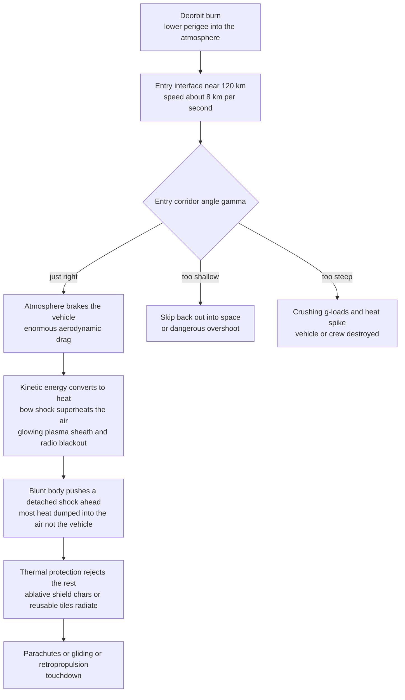

# 🔥 Atmospheric Reentry and Hypersonics

> [!abstract] TL;DR
> **Atmospheric reentry** is the physics of getting home from space, and it is a **giant energy-disposal problem**. An object in low Earth orbit carries a colossal store of kinetic plus potential energy — about $\tfrac12 V^2 \approx 30\ \text{MJ/kg}$ at $V \approx 7.8$ km/s, and half again more coming back from the Moon at $\sim 11$ km/s — and **all of it must be shed before touchdown**. The only free brake available is the atmosphere itself, and braking that hard converts the energy into **ferocious heat**: the air rammed and compressed behind the vehicle's **bow shock** is superheated to thousands of kelvin — hotter than the Sun's surface — wrapping the craft in a glowing **plasma sheath** that blacks out radio. The trajectory must thread an **entry corridor**: too **steep** and deceleration g-loads and heating spike beyond survivable limits; too **shallow** and the vehicle **skips** back off the atmosphere into space. Two design triumphs tame the heat. First, the **blunt-body insight** (Allen and Eggers, 1953): a rounded, *not* pointed, nose pushes a strong **detached shock** out ahead of the vehicle that dumps most of the heat into the surrounding air rather than the structure — stagnation heating scales as $\dot q \sim \sqrt{\rho/R_n}\,V^3$, so a **larger nose radius $R_n$ lowers heating**. Second, a **thermal-protection system (TPS)** — ablative shields that char and carry heat away, or reusable insulating tiles — rejects the residual load. The remarkable Allen-Eggers result is that **peak deceleration depends only on entry velocity and flight-path angle, not on the vehicle's mass**. Reentry governs the design of every returning spacecraft, from Apollo and Soyuz capsules to the Space Shuttle, sample-return probes, ICBM warheads, and Mars landers — and the same hypersonic aerothermodynamics drives hypersonic weapons and defense.

---

## Intuition

**Analogy:** Coming home from orbit is the *hardest* part of the whole trip. Picture a car doing 100 mph that has to stop in a few seconds using nothing but its brakes — the brakes would glow red-hot and disintegrate. Now scale that up almost three-hundred-fold: a returning capsule is moving at roughly **8 kilometres every second**, and it has no brakes at all. Its only way to slow down is to *ram into the air* and let friction and compression bleed off its speed. But there is no free lunch in physics — that staggering amount of motion energy cannot simply vanish; it has to go **somewhere**, and where it goes is **heat**. The air piled up in front of the vehicle is crushed and superheated to *thousands* of degrees, hotter than the surface of the Sun, until it glows and turns into a sheath of electrically charged plasma so thick that radio signals cannot get through — the famous **communications blackout**.

Here is the beautiful, counterintuitive trick that makes survival possible. You might think a returning spacecraft should be sharp and pointed like a bullet, to slice cleanly through the air. It is exactly the opposite: the best reentry shape is **blunt and rounded**. A blunt nose shoves a thick wall of shocked air — a **detached bow shock** — *out ahead* of the vehicle, and that cushion of superheated air carries most of the heat away downstream into the atmosphere instead of soaking it into the skin of the craft. Blunt is cool; sharp burns up. And the path home is a razor's edge: dive in **too steeply** and the deceleration crushes the crew and the heating incinerates the shield; skim in **too shallowly** and you **bounce off the atmosphere back into space** like a stone skipping on a pond. Reentry engineering is the art of threading that needle.

---

## How It Works

### Core Mechanics

**1. The energy problem is the whole story.** An object in low Earth orbit moves at $V \approx 7.8$ km/s, giving a specific kinetic energy $\tfrac12 V^2 \approx 30$ MJ/kg — comparable to the chemical energy in TNT, for *every kilogram* of spacecraft. Returning from the Moon the entry speed is near $11$ km/s (specific energy $\sim 60$ MJ/kg). There is no propellant-efficient way to brake all of that with rockets (it would take as much fuel to stop as it took to launch), so spacecraft **use the atmosphere as a brake**. The central challenge is not *stopping* — the air will always stop you — but managing the **heat** that braking produces without destroying the vehicle or the crew.

**2. The entry corridor: too steep vs too shallow.** The flight-path angle $\gamma$ (the angle below the local horizon at entry interface, typically taken at $\sim 120$ km) must fall inside a narrow **entry corridor**:
- **Too steep** (large $\gamma$): the vehicle plunges into dense air fast, producing **excessive deceleration** (g-loads that crush structure and crew) and a short, intense **heating** spike.
- **Too shallow** (small $\gamma$): aerodynamic lift and the shallow geometry cause the vehicle to **skip** back out of the atmosphere into space, or to overshoot the landing site and stay aloft dangerously long.
For Apollo the lunar-return corridor was only about $\pm 1^\circ$ wide. **Lift** widens it: a vehicle with usable lift-to-drag ratio $L/D$ (Apollo $\approx 0.3$, Shuttle $\approx 1$) can **fly the corridor**, modulate its trajectory by rolling the lift vector, stretch the range, and shave the peak g-loads and heating that a purely **ballistic** (zero-lift) capsule must endure.

**3. Ballistic coefficient sets how deep you penetrate.** The single parameter that governs a ballistic entry is the **ballistic coefficient**
$$\beta = \frac{m}{C_d A},$$
mass over drag area. A **low-$\beta$** vehicle (light, big, high-drag — a capsule or a parachute) decelerates high in the thin upper atmosphere; a **high-$\beta$** vehicle (dense, slender — an ICBM warhead) knifes deep into dense air before slowing, arriving fast and low. High $\beta$ means higher peak heating and a shorter, more violent entry.

**4. The Allen-Eggers ballistic solution — and the mass-independence surprise.** Neglecting gravity and lift during the intense deceleration phase and assuming an exponential atmosphere $\rho = \rho_0 e^{-h/H}$, H. Julian Allen and A. J. Eggers integrated the ballistic entry in closed form:
$$\frac{V}{V_E} = \exp\!\left[-\frac{\rho_0 H}{2\,\beta \sin\gamma}\,e^{-h/H}\right].$$
Differentiating gives the **peak deceleration**
$$a_{\max} = \frac{V_E^2 \sin\gamma}{2\,e\,H}, \qquad \text{occurring at } V = \frac{V_E}{\sqrt e} \approx 0.607\,V_E.$$
The startling result: **peak deceleration depends only on entry velocity $V_E$, flight-path angle $\gamma$, and scale height $H$ — not on the vehicle's mass or ballistic coefficient at all.** A feather and a cannonball entering at the same speed and angle feel the same peak g. The ballistic coefficient only shifts *where* (what altitude) that peak occurs, not how big it is.

**5. Aeroheating comes from the shock, not friction.** The intuition that reentry heat is "air friction" is wrong. The dominant heat source is the **compression** of air across the vehicle's **bow shock**: a strong shock converts ordered kinetic energy into thermal energy, raising the gas behind it (the shock layer) to many thousands of kelvin (see *[[Shock_Waves_and_Supersonic_Flow]]* and *[[Compressible_Flow_and_Gas_Dynamics]]*). Some of that heat is then transferred to the wall by **convection** and, at high speeds, **radiation** (see *[[Convection_and_Radiation]]*). The engineering scaling for **stagnation-point convective heat flux** is the Sutton-Graves correlation
$$\dot q_s = k\sqrt{\frac{\rho}{R_n}}\;V^3,$$
so heating rises with the *cube* of velocity and the *square root* of density, and **falls with the square root of the nose radius $R_n$**.

**6. The blunt-body insight (why not a needle?).** Because $\dot q_s \propto 1/\sqrt{R_n}$, a **large, blunt nose radius** *reduces* stagnation heating. A blunt body pushes a **detached bow shock** that stands well off the surface, creating a thick, hot shock layer that carries the compressed thermal energy **downstream into the wake and the free stream** instead of conducting it into the vehicle. A sharp, slender body keeps the shock attached and hugging the skin, concentrating heat right at the tip. Allen and Eggers realized this in 1953 and it inverted intuition: the **blunter** the reentry vehicle, the **cooler** it runs. Every crewed capsule since Mercury has been blunt.

**7. Convective vs radiative heating, and real-gas effects.** At orbital speeds (LEO) heating is almost entirely **convective**. But **radiative heating** from the incandescent shock-layer gas scales as a very high power of velocity (roughly $V^8$ to $V^{12}$), so it is negligible for LEO entry but becomes a dominant threat at **lunar-return ($\sim 11$ km/s), Mars-return, and sample-return speeds ($> 12$ km/s)**. At these temperatures the air is no longer a perfect gas: molecules undergo **vibrational excitation**, then **dissociation** ($\text{O}_2, \text{N}_2 \to \text{O}, \text{N}$), and finally **ionization**, often out of chemical equilibrium — the **real-gas / high-temperature aerothermodynamics** that ties directly to the hypersonics of the sibling aero note.

**8. The plasma sheath and communications blackout.** Ionization of the shock-layer air produces a conductive **plasma sheath** around the vehicle. Free electrons reflect and absorb radio waves below a critical frequency, causing the well-known **reentry communications blackout** (about four minutes for Apollo, sixteen for the Shuttle's long glide). Antennas on the leeward side, higher frequencies, or relay through a satellite above (as the Shuttle used TDRS) mitigate it.

**9. Thermal protection systems (TPS) reject the residual heat.** Whatever heat the blunt shock cannot dump into the air must be handled by the shield:
- **Ablative shields** (Apollo, Soyuz, Orion, sample-return capsules): a resin-based material **chars, pyrolyzes, and erodes**, carrying heat away with the departing mass and blocking the wall with an insulating char layer. Single-use but extremely robust.
- **Reusable insulating tiles / blankets** (Space Shuttle): low-density silica tiles that radiate heat away and insulate a cool aluminium structure — reusable but fragile.
- **Hot structures** (leading edges, X-15): high-temperature materials (reinforced carbon-carbon) that run hot and re-radiate.
This connects to the sibling structures note *Thermal_Protection_Systems* and to conductive shielding physics in *[[Convection_and_Radiation]]*.

**10. Descent and landing.** After the hypersonic phase bleeds off most of the energy, the vehicle is subsonic and slow. Final descent uses **parachutes** (capsules), **retropropulsion** (Falcon 9 booster, Mars landers' powered descent), or **gliding** to a runway (Shuttle). **Mars EDL (entry-descent-landing)** is uniquely brutal: the thin CO₂ atmosphere is too tenuous to brake fully yet thick enough to heat, forcing the "seven minutes of terror" combination of heat shield, supersonic parachute, and rockets or skycrane.

### Flow / Architecture



---

## Key Concepts

### Secondary Level

- **Getting home is the hard part.** A returning spacecraft is moving at about 8 km every second, and *all* that speed has to be gotten rid of before it lands. It has no brakes — so it uses the **air itself** as a brake.
- **Speed turns into heat.** Braking that hard cannot make the energy disappear; it turns into **heat**. The air in front gets crushed and superheated until it glows brighter and hotter than the surface of the Sun, and wraps the craft in glowing plasma that blocks radio.
- **Blunt, not pointed.** The clever trick is to make the nose **round and blunt**, not sharp. A blunt nose pushes a wall of hot air out in front that carries the heat away into the sky, keeping the vehicle cooler. Sharp things burn up.
- **A narrow path home.** Come in **too steep** and you burn up or get crushed; come in **too shallow** and you **skip off** the atmosphere back into space, like a flat stone skipping on water. You must aim for the thin band in between.

### Undergraduate Level

- **The energy problem.** Specific kinetic energy $\tfrac12 V^2 \approx 30$ MJ/kg at LEO, $\sim 60$ MJ/kg from the Moon — the quantity the atmosphere must dissipate as heat.
- **Ballistic coefficient** $\beta = m/(C_d A)$: high $\beta$ penetrates deep and heats hard; low $\beta$ (blunt, light) decelerates high and gently.
- **Entry corridor:** the window in flight-path angle $\gamma$ between skip-out (too shallow) and excessive g-load / heating (too steep). Lift-to-drag ratio $L/D$ widens it and lets the vehicle fly a controlled trajectory (ballistic vs lifting entry).
- **Allen-Eggers ballistic solution:** $V/V_E = \exp[-\tfrac{\rho_0 H}{2\beta\sin\gamma}e^{-h/H}]$, with **peak deceleration** $a_{\max} = V_E^2\sin\gamma/(2eH)$ at $V \approx 0.607\,V_E$ — **independent of mass**.
- **Stagnation-point heating** (Sutton-Graves): $\dot q_s = k\sqrt{\rho/R_n}\,V^3$ — cube of velocity, inverse square-root of nose radius. **Blunt (large $R_n$) means cooler.**
- **Blunt-body principle:** a detached bow shock dumps most of the heat into the flow; convection dominates at orbital speed.
- **Plasma sheath and communications blackout:** ionized shock-layer air reflects radio, cutting off communication for minutes.

### Graduate Level

- **Coupled trajectory-heating tradeoff.** Steep entry (large $\gamma$ or high $\beta$) minimizes total *integrated* heat load $Q = \int \dot q\,dt$ (short exposure) but maximizes **peak** heat rate and g-load; shallow entry does the reverse. Ablative shields are sized by integrated load $Q$; structural limits are set by peak $\dot q$ and peak g. The corridor optimization balances the two.
- **Fay-Riddell stagnation heating:** the rigorous convective correlation $\dot q_s \propto \sqrt{\rho_e \mu_e}\,(\text{d}u_e/\text{d}x)^{1/2}(h_0 - h_w)$ with a Lewis-number correction for dissociation energy recombining catalytically at the wall — hence **surface catalycity** matters (a non-catalytic TPS runs cooler).
- **Real-gas / non-equilibrium aerothermodynamics.** Behind a strong shock the perfect-gas $\gamma=1.4$ fails: vibrational relaxation, finite-rate dissociation and ionization, thermochemical non-equilibrium, and radiative transport from the shock layer must be modeled (CFD with reacting-gas chemistry). Radiative heating $\dot q_r$ scales as a high power of $V$ and dominates above $\sim 10$–12 km/s.
- **Lifting entry guidance.** Bank-angle modulation of the lift vector (Apollo, Shuttle, Orion) actively steers within the corridor to hit a landing target while respecting g and heating constraints — a real-time trajectory-optimization / guidance problem.
- **Aerocapture and aerobraking.** Using a single or repeated atmospheric pass to shed orbital energy and *capture* into orbit (rather than land), trading propellant for TPS mass at other planets.
- **Mars EDL scaling problem.** The thin CO₂ atmosphere gives too little drag to fully decelerate high-$\beta$ vehicles yet enough to heat them, so supersonic parachutes deploy at Mach 2, and the terminal phase needs powered descent or skycrane — the "supersonic retropropulsion" frontier.

---

## Python Demo

```python
# Atmospheric reentry: trajectory, deceleration, and stagnation heating.
# Uses the classic ALLEN-EGGERS ballistic solution in an exponential atmosphere
# (numpy + matplotlib, no scipy).
#
#   (A) VELOCITY vs ALTITUDE for several entry angles -- the deceleration corridor.
#   (B) DECELERATION (g-load) vs altitude -- peak-g marked; the Allen-Eggers
#       surprise that peak g is INDEPENDENT of mass / ballistic coefficient.
#   (C) STAGNATION HEAT RATE vs altitude -- q ~ sqrt(rho/Rn)*V^3, peak heating
#       marked; steeper entry = higher, briefer heat pulse.
#   (D) BLUNT-BODY effect: peak heat rate vs nose radius Rn -- q_peak ~ 1/sqrt(Rn),
#       so a blunter nose runs cooler.
import numpy as np
import matplotlib.pyplot as plt

# ---- constants ----
g0    = 9.80665      # standard gravity, m/s^2
rho0  = 1.225        # sea-level air density, kg/m^3
H     = 7200.0       # atmospheric scale height, m
VE    = 7800.0       # entry-interface velocity (LEO), m/s
k_SG  = 1.7415e-4    # Sutton-Graves constant: q[W/m^2] = k*sqrt(rho/Rn)*V^3

beta_ref = 400.0     # reference ballistic coefficient m/(Cd*A), kg/m^2 (a capsule)
Rn_ref   = 0.5       # reference nose radius, m
h = np.linspace(120e3, 20e3, 3000)          # altitude: entry interface down, m
rho = rho0 * np.exp(-h / H)

def allen_eggers_V(h, gamma_deg, beta):
    """Allen-Eggers ballistic velocity vs altitude."""
    g = np.radians(gamma_deg)
    A = rho0 * H / (2.0 * beta * np.sin(g))
    return VE * np.exp(-A * np.exp(-h / H))

def decel_g(h, gamma_deg, beta):
    """Drag deceleration in Earth g's."""
    V = allen_eggers_V(h, gamma_deg, beta)
    a = rho0 * np.exp(-h / H) * V**2 / (2.0 * beta)   # m/s^2
    return a / g0

def heat_rate(h, gamma_deg, beta, Rn):
    """Sutton-Graves stagnation heat flux in W/cm^2."""
    V = allen_eggers_V(h, gamma_deg, beta)
    rho_h = rho0 * np.exp(-h / H)
    q_Wm2 = k_SG * np.sqrt(rho_h / Rn) * V**3         # W/m^2
    return q_Wm2 / 1e4                                # -> W/cm^2

gammas = [3.0, 6.0, 9.0]                              # entry flight-path angles, deg
colors = ["#1f77b4", "#ff7f0e", "#d62728"]

print("=== Allen-Eggers peak deceleration (beta =", beta_ref, "kg/m^2) ===")
for gd in gammas:
    gpk = decel_g(h, gd, beta_ref)
    analytic = VE**2 * np.sin(np.radians(gd)) / (2.0 * np.e * H) / g0
    print(f" gamma = {gd:4.1f} deg -> peak g (numeric) = {gpk.max():5.1f},"
          f"  analytic V_E^2 sin g /(2eH) = {analytic:5.1f}")

# demonstrate mass-independence: same gamma, two very different beta
g_lo = decel_g(h, 6.0, 200.0).max()
g_hi = decel_g(h, 6.0, 800.0).max()
print(f"\n mass-independence check (gamma=6 deg):"
      f" peak g at beta=200 -> {g_lo:.1f},  beta=800 -> {g_hi:.1f}  (identical)")

print("\n=== Peak stagnation heating (Rn =", Rn_ref, "m) ===")
for gd in gammas:
    q = heat_rate(h, gd, beta_ref, Rn_ref)
    print(f" gamma = {gd:4.1f} deg -> peak q = {q.max():6.1f} W/cm^2"
          f"  at altitude {h[q.argmax()]/1000:4.1f} km")

# ======================= PLOTS =======================
fig, ax = plt.subplots(2, 2, figsize=(14, 10))
fig.suptitle("Atmospheric Reentry: Trajectory, Deceleration, and Heating "
             "(Allen-Eggers ballistic entry)", fontsize=15, fontweight="bold")

# --- A. velocity vs altitude ---
axA = ax[0, 0]
for gd, c in zip(gammas, colors):
    V = allen_eggers_V(h, gd, beta_ref)
    axA.plot(V / 1000.0, h / 1000.0, lw=2.4, color=c, label=f"entry angle {gd:.0f} deg")
axA.set_xlabel("velocity  [km/s]")
axA.set_ylabel("altitude  [km]")
axA.set_title("A. Velocity vs altitude: steeper = deeper, sharper braking")
axA.legend(fontsize=9); axA.grid(alpha=0.3)

# --- B. deceleration (g-load) vs altitude ---
axB = ax[0, 1]
for gd, c in zip(gammas, colors):
    gpk = decel_g(h, gd, beta_ref)
    axB.plot(gpk, h / 1000.0, lw=2.4, color=c, label=f"{gd:.0f} deg, peak {gpk.max():.0f} g")
    i = gpk.argmax()
    axB.scatter(gpk[i], h[i] / 1000.0, color=c, zorder=5)
# overlay beta = 800 for gamma = 6 deg (dashed): SAME peak, deeper altitude
gpk2 = decel_g(h, 6.0, 800.0)
axB.plot(gpk2, h / 1000.0, lw=1.6, color="#ff7f0e", ls="--",
         label="6 deg, beta x2 (same peak-g)")
axB.set_xlabel("deceleration  [Earth g]")
axB.set_ylabel("altitude  [km]")
axB.set_title("B. g-load: peak is mass-INDEPENDENT (Allen-Eggers)")
axB.legend(fontsize=8); axB.grid(alpha=0.3)

# --- C. stagnation heat rate vs altitude ---
axC = ax[1, 0]
for gd, c in zip(gammas, colors):
    q = heat_rate(h, gd, beta_ref, Rn_ref)
    axC.plot(q, h / 1000.0, lw=2.4, color=c, label=f"{gd:.0f} deg, peak {q.max():.0f}")
    i = q.argmax()
    axC.scatter(q[i], h[i] / 1000.0, color=c, zorder=5)
axC.set_xlabel("stagnation heat rate  [W/cm^2]")
axC.set_ylabel("altitude  [km]")
axC.set_title("C. Heating q ~ sqrt(rho/Rn)*V^3: peaks HIGHER than peak-g")
axC.legend(fontsize=8, title="Rn = 0.5 m"); axC.grid(alpha=0.3)

# --- D. blunt-body effect: peak heating vs nose radius ---
axD = ax[1, 1]
Rn_axis = np.linspace(0.2, 3.0, 80)
qpk = np.array([heat_rate(h, 6.0, beta_ref, Rn).max() for Rn in Rn_axis])
axD.plot(Rn_axis, qpk, lw=2.6, color="#9467bd")
axD.fill_between(Rn_axis, qpk, alpha=0.15, color="#9467bd")
axD.annotate("sharp nose:\nHOT", xy=(Rn_axis[3], qpk[3]),
             xytext=(0.6, qpk[3]), fontsize=9,
             arrowprops=dict(arrowstyle="->"))
axD.annotate("blunt nose:\ncooler", xy=(2.5, qpk[-6]),
             xytext=(1.7, qpk[-1] + 40), fontsize=9,
             arrowprops=dict(arrowstyle="->"))
axD.set_xlabel("nose radius  Rn  [m]")
axD.set_ylabel("peak stagnation heat rate  [W/cm^2]")
axD.set_title("D. Blunt-body insight: peak q ~ 1/sqrt(Rn)")
axD.grid(alpha=0.3)

plt.tight_layout(rect=[0, 0, 1, 0.95])
plt.show()
```

**What it shows.** Panel **A** traces the deceleration corridor: all three trajectories enter at 7.8 km/s, but the **steeper** 9-degree path plunges to lower altitude before shedding its speed, while the **shallow** 3-degree path bleeds off velocity gently and high up. Panel **B** is the Allen-Eggers punchline — the peak deceleration grows with entry angle (roughly $8\,g$, $17\,g$, $25\,g$ for 3, 6, 9 degrees) yet the dashed curve, computed with **double the ballistic coefficient**, reaches the *identical* peak g and only shifts to a lower altitude: **peak deceleration is set by geometry and speed, not by mass**. Panel **C** plots the Sutton-Graves stagnation heat rate; note it **peaks at a higher altitude than the g-load** (heating is worst while the vehicle is still fast in thinner air), and a steeper entry gives a taller but briefer heat pulse. Panel **D** is the blunt-body triumph in one curve: because $\dot q \propto 1/\sqrt{R_n}$, doubling the nose radius drops peak heating by about 30 percent — which is exactly why every crewed capsule wears a big, rounded heat shield instead of a needle-sharp nose.

---

## Real-World Applications

> **Example — Apollo command module (lunar return).** Apollo returned from the Moon at $\sim 11$ km/s, the most demanding crewed reentry ever flown. Its solution embodies every principle here: a **blunt, gumdrop-shaped ablative heat shield** (AVCOAT, which charred and eroded to carry heat away), a small offset center of mass giving $L/D \approx 0.3$ so the guidance computer could **bank-modulate the lift vector** and fly the razor-thin ($\pm 1^\circ$) lunar-return corridor, and a peak deceleration held to a survivable $\sim 6$–$7\,g$. At 11 km/s **radiative** shock-layer heating was significant, not just convective — a threat absent from LEO entries.

> **Example — Space Shuttle Orbiter.** The Shuttle chose the opposite TPS philosophy: **reusable silica tiles and reinforced carbon-carbon** leading edges instead of an ablator, and a high-$L/D$ (~1) lifting body that flew a long, cross-ranging hypersonic glide, spreading the heat load over a gentler, longer entry to a runway landing. Its fragile tiles were also its Achilles heel — the 2003 **Columbia** disaster was a breach of the RCC wing leading edge that let plasma into the structure, a tragic reminder that reentry is a make-or-break phase with zero margin for a TPS failure.

> **Example — Stardust sample-return capsule.** The fastest human-made reentry on record: Stardust returned comet dust in 2006 at **12.9 km/s**, hitting peak heating near $1000$ W/cm². Its small, steep-angle **PICA** (phenolic-impregnated carbon ablator) shield — the same material family later scaled up for SpaceX Dragon and NASA's Mars Science Laboratory — survived the extreme integrated heat load precisely because a steep ballistic entry minimizes total exposure time.

> **Example — Mars EDL (Perseverance / Curiosity).** Mars entry is uniquely hard: the CO₂ atmosphere is ~1 percent of Earth's density — too thin to fully brake yet thick enough to heat. Perseverance used a **blunt 70-degree sphere-cone PICA heat shield** for the hypersonic phase, a **supersonic disk-gap-band parachute** deployed at Mach ~1.7, and a rocket-powered **skycrane** for the final touchdown — the "seven minutes of terror" chaining all the reentry physics of this note into one autonomous sequence.

> **Example — ICBM reentry vehicles.** Warheads are the **high-$\beta$** extreme: dense, slender, sharp-nosed cones designed to knife through the atmosphere at very steep angles and high $\beta$, reaching the ground fast and low with minimal atmospheric deflection — trading enormous heating (handled by carbon-carbon or graphite nose tips) for accuracy and short exposure. Hypersonic glide vehicles blend this with lift for maneuvering reentry.

---

## Common Pitfalls

- **Thinking reentry heat is "air friction."** The dominant heat source is **compression across the bow shock**, not skin friction. This is why a *blunt* body — which stands the shock off and dumps heat into the flow — runs cooler than a streamlined one. Reasoning by friction leads you to the wrong (pointed) shape entirely.
- **Assuming a steeper entry is safer because it is quicker.** Steep entry does shorten exposure and lower the *integrated* heat load, but it **spikes the peak deceleration and peak heat rate** — which is what actually breaks structures and crews. The corridor is a two-sided constraint: too steep is as fatal as too shallow.
- **Believing a heavier vehicle decelerates harder.** The Allen-Eggers result says **peak g is independent of mass** (it depends only on $V_E$, $\gamma$, $H$). Mass and ballistic coefficient change the *altitude* of peak deceleration and the heat load, not the peak g itself. Sizing g-limits from mass is a category error.
- **Sizing TPS from peak temperature alone.** The shield is threatened by **heat flux and total integrated heat load** $Q = \int \dot q\,dt$, not by the stagnation *temperature*. High temperature at very low density (upper atmosphere) can be benign; it is the altitude band of peak flux, and its time integral, that consume ablator.
- **Using a perfect-gas ($\gamma=1.4$) model for the shock layer.** At reentry speeds the air **dissociates and ionizes**; a perfect-gas analysis mispredicts shock standoff, temperature, and heating. Real-gas (equilibrium or non-equilibrium) chemistry is mandatory — the same lesson as the hypersonics aero note.
- **Forgetting radiative heating at high entry speeds.** Convection dominates at LEO speeds, but radiative heating scales as a steep power of velocity and becomes co-dominant above $\sim 10$–12 km/s (lunar, Mars, and sample return). Designing a fast-entry shield with a convection-only model badly under-predicts the load.
- **Ignoring the communications blackout in mission design.** The plasma sheath cuts radio for minutes during peak heating; guidance, telemetry, and abort logic must be autonomous through the blackout or relayed from above.

---

## Related Concepts

- [[Orbital_Mechanics_and_Celestial_Dynamics]] — supplies the entry conditions: the orbital velocity ($\sim 7.8$ km/s at LEO), the deorbit burn that sets the flight-path angle $\gamma$, and the energy state the atmosphere must dissipate.
- [[Shock_Waves_and_Supersonic_Flow]] — the physics of the **bow shock** whose compression, not friction, superheats the shock-layer air; the source of nearly all reentry heating.
- [[Compressible_Flow_and_Gas_Dynamics]] — Mach number, isentropic and shock relations, and the high-temperature real-gas machinery that governs the hypersonic shock layer.
- [[Convection_and_Radiation]] — the two heat-transfer modes that carry shock-layer energy to the wall (convective at orbital speed, radiative at lunar/planetary speeds) and set the TPS load.
- [[Laws_of_Thermodynamics]] — the energy-conversion and entropy-increase principles underlying the irreversible conversion of kinetic energy into shock-layer heat.

Within the *Aerospace_Engineering* vault this note pairs, in prose, with several siblings: *Supersonic_and_Hypersonic_Aerodynamics* (the aero and shock-physics companion, which frames the hypersonic flowfield while this note takes the reentry-vehicle and thermal view), *Orbital_Mechanics_and_Astrodynamics* (which sets up the deorbit and entry state), *Thermal_Protection_Systems* (the structures-side deep dive on ablators, tiles, and hot structures), and *Spacecraft_Systems_Engineering* (which budgets TPS mass, g-limits, and the entry corridor at the mission level).

---

## Review Questions

1. **(Secondary)** A spacecraft returning from orbit is moving at about 8 km/s and has no brakes. Explain, in plain language, where all that energy goes, why the vehicle glows and superheats, and why designers make the nose **blunt and round** instead of sharp like a bullet.
2. **(Secondary)** What does it mean to say a returning capsule can "skip off the atmosphere," and why is coming in *too shallow* just as dangerous as coming in *too steep*?
3. **(Undergraduate)** Using the Allen-Eggers result $a_{\max} = V_E^2 \sin\gamma/(2eH)$, estimate the peak deceleration (in g) for a LEO ballistic entry with $V_E = 7.8$ km/s, $\gamma = 6^\circ$, and scale height $H = 7.2$ km. Then explain why doubling the vehicle's mass leaves this peak unchanged, and what *does* change.
4. **(Undergraduate)** The stagnation heat rate scales as $\dot q \sim \sqrt{\rho/R_n}\,V^3$. A design team wants to halve the peak heating on a capsule. Quantitatively, by what factor must they increase the nose radius $R_n$, and why does a blunter shape reduce heating even though it has *more* drag?
5. **(Undergraduate → Graduate)** Contrast a **steep** and a **shallow** ballistic entry in terms of peak deceleration, peak heat rate, and *integrated* heat load $Q = \int \dot q\,dt$. If your thermal shield is ablation-mass-limited but your structure is g-limited, which entry do you prefer, and how does adding lift ($L/D > 0$) change the tradeoff?
6. **(Graduate)** Explain why **radiative** heating is negligible for a Space Shuttle LEO entry but a first-order design driver for a lunar-return or sample-return capsule, and why a perfect-gas ($\gamma = 1.4$) analysis of the shock layer will mispredict both the standoff distance and the wall heat flux. Name the real-gas phenomena responsible.

---

## Sources

- Anderson, J. D. — *Hypersonic and High-Temperature Gas Dynamics*, 2nd ed. (AIAA Education Series, 2006) — blunt-body aerothermodynamics, stagnation heating, and real-gas effects.
- Regan, F. J., and Anandakrishnan, S. M. — *Dynamics of Atmospheric Re-Entry* (AIAA Education Series, 1993) — entry trajectories, the entry corridor, and reentry-vehicle dynamics.
- Allen, H. J., and Eggers, A. J. — *A Study of the Motion and Aerodynamic Heating of Ballistic Missiles Entering the Earth's Atmosphere at High Supersonic Speeds*, NACA Report 1381 (1958) — the original blunt-body and ballistic-entry analysis.
- Wertz, J. R., and Larson, W. J. (eds.) — *Space Mission Analysis and Design (SMAD)*, 3rd ed. (Microcosm/Springer, 1999) — systems-level entry, TPS sizing, and mission $\Delta v$/EDL budgeting.
- Sutton, K., and Graves, R. A. — *A General Stagnation-Point Convective-Heating Equation for Arbitrary Gas Mixtures*, NASA TR R-376 (1971) — the $\dot q \sim \sqrt{\rho/R_n}\,V^3$ heating correlation.

---

#aerospace-engineering #reentry #hypersonics #heat-shield #blunt-body
