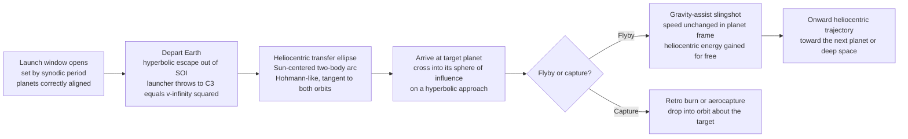

# 🪐 Interplanetary Trajectories and Gravity Assists

> [!abstract] TL;DR
> **Interplanetary trajectory design** is the art of moving a spacecraft between planets *within the tyranny of the rocket equation* — where every extra kilometer-per-second of $\Delta v$ costs propellant exponentially. The master tool is the **patched-conic method**: instead of solving one impossibly complex many-body problem, you *stitch together* three simple two-body arcs — a **hyperbolic escape** out of the departure planet's **sphere of influence (SOI)**, a Sun-centered **heliocentric transfer ellipse** (usually a **Hohmann-like** arc tangent to both planetary orbits), and a **hyperbolic arrival** at the target — matching them at the SOI boundaries where the **hyperbolic excess velocity** $v_\infty$ (and its square, the launch energy $C_3 = v_\infty^2$) is the currency. Because *both* planets orbit the Sun, a minimum-energy transfer only works if the target is at the right place when you arrive, so launches are possible only during periodic **launch windows** set by the **synodic period** (Mars: ~26 months); mission designers map the cost with **porkchop plots** of $\Delta v$ versus departure and arrival dates. The real magic is the **gravity assist** (slingshot): a close **flyby** rotates the spacecraft's velocity *for free* — in the planet's frame the speed is unchanged, but in the Sun's frame the craft *steals* a sliver of the planet's orbital momentum and gains (or sheds) heliocentric energy. This one trick turned unreachable destinations into routine ones — Voyager's Grand Tour, Cassini's VVEJGA to Saturn, Galileo, New Horizons, and Parker Solar Probe all ride on slingshots. Patched conics, launch windows, and gravity assists are the three pillars beneath every planetary mission ever flown.

---

## Intuition

**Analogy:** Suppose you want to hit a target on the far side of a merry-go-round, but you can only afford *one small shove*. You can't just point at where the target is now — by the time your marble crawls across, the target has spun away. You have to lead it: shove the marble onto a long curving path timed so the marble and the target arrive at the *same spot at the same instant*. And the merry-go-round only lines up for a good shot every so often — miss the moment, and you wait for it to come around again. That is a **launch window**, and the long curving path is your **heliocentric transfer**.

Now the second trick. Sending a probe to Jupiter by brute force would need impossibly much fuel, so instead you play **cosmic billiards**. Swing your marble close past a *moving* bumper — like a ping-pong ball bouncing off the front of a moving truck — and it comes away *faster*, having borrowed a bit of the truck's motion. The truck barely slows; the ball leaps ahead by kilometers per second, and it cost you nothing. That is a **gravity assist**. Voyager toured all four giant planets on almost no propellant by bouncing from one to the next, each giant flinging it onward to the following one. The planets lost a truly imperceptible amount of orbital speed; the tiny probe gained enough to leave the solar system forever.

The whole discipline is these two ideas braided together: *time your long ellipse to meet a moving planet, then let big planets throw you around for free.*

---

## How It Works

### Core Mechanics

1. **Why not just point and fire?** The **Tsiolkovsky rocket equation** ($\Delta v = v_e \ln(m_0/m_f)$) makes $\Delta v$ *exponentially* expensive in propellant. A direct, high-thrust "aim-and-burn" toward a planet would demand a $\Delta v$ no chemical stage can supply. So interplanetary design is fundamentally about **spending the least $\Delta v$** to reach a moving target — which means exploiting the Sun's gravity and, when possible, other planets' momentum.

2. **The patched-conic approximation.** The true problem — a spacecraft pulled by the Sun *and* every planet at once — has no closed-form solution. The **patched-conic method** cheats brilliantly: at any instant, assume *only one body* dominates the spacecraft's motion, so the path is a simple **two-body conic** (ellipse, parabola, or hyperbola). Reality is then divided into zones and the conics **patched** at the boundaries:
   - **Near the departure planet** → a **hyperbola** relative to that planet (escape).
   - **Between planets** → an **ellipse** relative to the **Sun** (the heliocentric transfer).
   - **Near the target planet** → a **hyperbola** relative to it (arrival / capture).

3. **The sphere of influence (SOI) — where the conics switch.** The boundary of each planet's zone is its **sphere of influence**, of radius $r_{SOI} \approx a_p \left(\dfrac{m_p}{M_\odot}\right)^{2/5}$, where $a_p$ is the planet's orbital radius and $m_p$ its mass. Inside the SOI the planet's pull dominates; outside, the Sun's does. The patch happens *at the SOI*: the velocity the spacecraft has *relative to the planet* as it crosses the SOI is the **hyperbolic excess velocity** $v_\infty$ — the leftover speed the escape hyperbola still carries "at infinity."

4. **$v_\infty$ and $C_3$ — the launch-energy currency.** On the departure hyperbola, energy conservation gives the burnout speed needed: $v_{burnout} = \sqrt{v_\infty^2 + 2\mu_p/r_0}$, where $\mu_p = Gm_p$. The quantity $v_\infty^2$ is the **characteristic energy** $C_3 = v_\infty^2$ (twice the specific orbital energy of the departure hyperbola). Every launch vehicle is rated by the mass it can throw to a given $C_3$ — it is *the* number that couples the launcher to the interplanetary trajectory.

5. **The heliocentric transfer — a Hohmann-like ellipse.** Between SOIs, the spacecraft is on a Sun-centered orbit. The cheapest two-impulse transfer between two (near-)circular coplanar orbits is the **Hohmann transfer**: an ellipse **tangent to both** planetary orbits, with **perihelion** at the inner orbit and **aphelion** at the outer. Its semi-major axis is $a_t = \tfrac12(r_1 + r_2)$, and the required speeds come from the **vis-viva** equation $v^2 = \mu_\odot\!\left(\tfrac{2}{r} - \tfrac{1}{a}\right)$. The heliocentric $\Delta v$ is the *difference* between the transfer-ellipse speed and the planet's circular speed at each end — and this heliocentric $\Delta v$ becomes the $v_\infty$ you must supply at each planet.

6. **Launch windows and the synodic period.** A Hohmann arc takes a *fixed* transfer time $t_t = \pi\sqrt{a_t^3/\mu_\odot}$ (half the ellipse period — 259 days for Earth→Mars). For the target to actually *be at aphelion when you arrive*, it must lead the departure planet by a specific **phase angle** at launch: $\alpha = \pi - n_2\, t_t$, where $n_2$ is the target's mean motion. That geometry only recurs once per **synodic period** $T_{syn} = \left|\dfrac{1}{T_1} - \dfrac{1}{T_2}\right|^{-1}$ (Earth–Mars ≈ 780 days ≈ 26 months). Miss the window and you wait for the alignment to come around. Designers explore the full trade with **porkchop plots** — contour maps of required $C_3$ / $\Delta v$ over a grid of departure and arrival dates (solved via **Lambert's problem**), whose closed "porkchop"-shaped contours reveal the cheapest launch days.

7. **The gravity assist — stealing momentum for free.** Fly close past a planet and you follow a **hyperbola in the planet's frame**. Energy conservation in that frame means your speed *relative to the planet* is **unchanged** ($|v_{\infty,\text{in}}| = |v_{\infty,\text{out}}|$) — but your **direction rotates** by the **turning angle** $\delta$, where $\sin\!\frac{\delta}{2} = \frac{1}{e}$ and the hyperbola's eccentricity is $e = 1 + \dfrac{r_p\, v_\infty^2}{\mu_p}$ (closer periapsis $r_p$ → larger turn). Now switch to the **Sun's frame**: your heliocentric velocity is $\vec v_{helio} = \vec V_{planet} + \vec v_\infty$. Because $\vec v_\infty$ *rotated* while $\vec V_{planet}$ stayed the same, your heliocentric **speed changes** — you gain up to $\Delta v_{helio} = 2 v_\infty \sin\!\frac{\delta}{2} = 2 v_\infty / e$ (maximized by a close, slow-relative flyby). The energy comes from the planet's orbital motion; by momentum conservation the planet slows by an utterly negligible amount (its mass is ~$10^{24}$× the probe's).

8. **Trailing vs leading edge — boost or brake.** Pass *behind* the planet (trailing edge) and it drags you forward → heliocentric **speedup** (outbound to the giants). Pass *ahead* (leading edge) and you lose heliocentric speed → a **gravity brake**, used to fall inward toward the Sun (Parker Solar Probe uses seven Venus flybys to shed energy and dive toward the corona).

9. **Advanced options.** **Low-energy transfers** exploit the **Interplanetary Transport Network** — tubes of trajectories threading the Sun–planet **Lagrange points** and **weak stability boundaries**; far cheaper in $\Delta v$ but far slower. **Aerobraking / aerocapture** dumps arrival $\Delta v$ into a planet's atmosphere instead of propellant. **Low-thrust electric** trajectories replace impulsive burns with gentle continuous spirals. These extend, but never replace, the patched-conic backbone.

### Flow / Architecture



---

## Key Concepts

### Secondary (intuitive foundations)
- **Launch window:** you can only leave for another planet during short, periodic openings, because both planets keep moving and must line up. Mars opens roughly every 26 months.
- **Transfer orbit:** the spacecraft coasts most of the way on a long ellipse around the **Sun**, engines off — gravity does the steering. You burn only briefly at the start and (if capturing) at the end.
- **Slingshot / gravity assist:** swinging close past a moving planet flings the probe faster (or slower) *without fuel*, like a ball rebounding off a moving truck. It is how missions reach the outer planets cheaply.
- **The planet barely notices:** the probe gains kilometers per second while the giant planet loses an amount too small to ever measure — energy and momentum are exchanged, not created.

### Undergraduate (the working toolkit)
- **Patched-conic method:** decompose the trajectory into a departure hyperbola, a heliocentric transfer ellipse, and an arrival hyperbola, each a two-body conic, patched at the **sphere of influence**.
- **Sphere of influence:** $r_{SOI} \approx a_p (m_p/M_\odot)^{2/5}$ — the radius inside which the planet's gravity, not the Sun's, governs the motion.
- **Hyperbolic excess velocity & $C_3$:** $v_\infty$ is the residual planet-relative speed at the SOI; $C_3 = v_\infty^2$ is the launch **characteristic energy** rating a booster.
- **Hohmann transfer & vis-viva:** $a_t = \tfrac12(r_1+r_2)$; speeds from $v^2 = \mu_\odot(2/r - 1/a)$; transfer time $t_t = \pi\sqrt{a_t^3/\mu_\odot}$.
- **Synodic period & phase angle:** $T_{syn} = |1/T_1 - 1/T_2|^{-1}$; required lead angle $\alpha = \pi - n_2 t_t$ sets the launch geometry.
- **Gravity-assist turning angle:** $\sin(\delta/2) = 1/e$, $e = 1 + r_p v_\infty^2/\mu_p$; free heliocentric gain $\Delta v = 2 v_\infty \sin(\delta/2)$.

### Graduate (deeper structure)
- **Lambert's problem & porkchop plots:** given two position vectors and a time of flight, solve for the connecting conic; sweeping departure/arrival dates yields the $\Delta v$/$C_3$ contour maps that drive real launch planning.
- **Optimal flyby speed:** free $\Delta v = 2 v_\infty/(1 + r_p v_\infty^2/\mu_p)$ is *maximized* at $v_\infty^\star = \sqrt{\mu_p/r_p}$ — too slow and the turn is small in absolute terms, too fast and the planet can't bend the path enough.
- **Multi-flyby sequences & resonant orbits:** chains like Cassini's **VVEJGA** (Venus-Venus-Earth-Jupiter-Gravity-Assist) and $V_\infty$-leveraging **resonant returns** compound tiny gains into enormous ones; the design space is combinatorial and often solved with global optimization.
- **Circular restricted three-body problem (CR3BP):** beyond patched conics lie the **Jacobi constant**, **Lagrange points**, **invariant manifolds**, and **weak stability boundaries** — the mathematical basis of the low-energy **Interplanetary Transport Network**.
- **Low-thrust optimal control:** electric-propulsion transfers replace impulses with continuous-thrust arcs solved by Pontryagin's maximum principle or direct collocation.

---

## Python Demo

```python
# Interplanetary trajectory design demo (numpy + matplotlib):
#   (a) Sun-centered HOHMANN transfer Earth -> Mars: transfer ellipse geometry,
#       heliocentric delta-v, transfer time, required phase angle, synodic window.
#   (b) GRAVITY ASSIST at Jupiter: a flyby rotates v_infinity (speed unchanged in
#       the planet frame) but changes heliocentric speed in the Sun frame. We plot
#       the velocity-vector diagram and the free heliocentric delta-v vs geometry.
import numpy as np
import matplotlib.pyplot as plt

# ---------- Constants (km, s) ----------
MU_SUN = 1.32712440018e11      # Sun GM  [km^3/s^2]
AU     = 1.495978707e8         # km
r_E    = 1.000 * AU            # Earth heliocentric radius (circular approx)
r_M    = 1.524 * AU            # Mars  heliocentric radius

# =========================================================
# (a) HOHMANN INTERPLANETARY TRANSFER  Earth -> Mars
# =========================================================
v_E = np.sqrt(MU_SUN / r_E)                       # Earth circular speed
v_M = np.sqrt(MU_SUN / r_M)                        # Mars  circular speed

a_t    = 0.5 * (r_E + r_M)                         # transfer semi-major axis
v_peri = np.sqrt(MU_SUN * (2.0/r_E - 1.0/a_t))     # transfer speed at perihelion (departure)
v_apo  = np.sqrt(MU_SUN * (2.0/r_M - 1.0/a_t))     # transfer speed at aphelion   (arrival)

dv_depart = v_peri - v_E                           # heliocentric injection
dv_arrive = v_M - v_apo                            # heliocentric arrival match
dv_total  = dv_depart + dv_arrive

t_transfer = np.pi * np.sqrt(a_t**3 / MU_SUN)      # half-ellipse period [s]
t_days     = t_transfer / 86400.0

n_M   = np.sqrt(MU_SUN / r_M**3)                    # Mars mean motion [rad/s]
phase = np.pi - n_M * t_transfer                    # required lead angle at launch

T_E   = 2*np.pi*np.sqrt(r_E**3/MU_SUN)
T_M   = 2*np.pi*np.sqrt(r_M**3/MU_SUN)
T_syn = 1.0 / abs(1.0/T_E - 1.0/T_M)                # synodic period [s]
T_syn_months = T_syn/86400.0/30.44

print("=== Hohmann transfer  Earth -> Mars ===")
print(f"departure dv   = {dv_depart:6.3f} km/s")
print(f"arrival   dv   = {dv_arrive:6.3f} km/s")
print(f"total     dv   = {dv_total:6.3f} km/s (heliocentric)")
print(f"transfer time  = {t_days:6.1f} days")
print(f"phase angle    = {np.degrees(phase):6.1f} deg (Mars ahead of Earth)")
print(f"synodic period = {T_syn/86400.0:6.1f} days = {T_syn_months:.1f} months\n")

# =========================================================
# (b) GRAVITY ASSIST (slingshot) at Jupiter
# =========================================================
MU_JUP = 1.26686534e8          # Jupiter GM [km^3/s^2]
R_JUP  = 71492.0               # km
V_JUP  = 13.06                 # Jupiter heliocentric speed [km/s]

v_inf  = 5.6                   # hyperbolic excess speed rel. to Jupiter [km/s]
r_p    = 5.0 * R_JUP           # flyby periapsis radius

e_hyp  = 1.0 + r_p * v_inf**2 / MU_JUP             # flyby hyperbola eccentricity
delta  = 2.0 * np.arcsin(1.0 / e_hyp)              # velocity turning angle [rad]

# Planet frame: |v_inf| fixed, direction rotates by delta. Pick an incoming
# direction that yields a heliocentric BOOST (rotate v_inf toward planet motion +x).
beta_in  = np.radians(150.0)
v_in_p   = v_inf * np.array([np.cos(beta_in),          np.sin(beta_in)])
v_out_p  = v_inf * np.array([np.cos(beta_in - delta),  np.sin(beta_in - delta)])

Vp          = np.array([V_JUP, 0.0])               # Jupiter velocity, Sun frame
v_in_helio  = Vp + v_in_p                           # spacecraft heliocentric BEFORE
v_out_helio = Vp + v_out_p                          # spacecraft heliocentric AFTER

speed_before = np.linalg.norm(v_in_helio)
speed_after  = np.linalg.norm(v_out_helio)
dv_helio     = np.linalg.norm(v_out_helio - v_in_helio)   # = 2 v_inf sin(delta/2)

print("=== Jupiter gravity assist ===")
print(f"turning angle    = {np.degrees(delta):6.1f} deg")
print(f"free helio dv    = {dv_helio:6.3f} km/s  (= 2 v_inf sin(delta/2))")
print(f"heliocentric speed  {speed_before:5.2f} -> {speed_after:5.2f} km/s")
print(f"speed gained     = {speed_after - speed_before:6.3f} km/s (no propellant)")

# ---------- Figure ----------
fig, ax = plt.subplots(2, 2, figsize=(13, 11))

# (0,0) Hohmann transfer geometry
th = np.linspace(0, 2*np.pi, 400)
ax[0,0].plot(r_E*np.cos(th)/AU, r_E*np.sin(th)/AU, 'b-',  lw=1.2, label="Earth orbit")
ax[0,0].plot(r_M*np.cos(th)/AU, r_M*np.sin(th)/AU, 'r--', lw=1.2, label="Mars orbit")
e_t   = (r_M - r_E) / (r_M + r_E)                    # transfer eccentricity
nu    = np.linspace(0, np.pi, 200)                   # perihelion(+x) -> aphelion(-x)
r_orb = a_t * (1 - e_t**2) / (1 + e_t*np.cos(nu))
ax[0,0].plot(r_orb*np.cos(nu)/AU, r_orb*np.sin(nu)/AU, 'g-', lw=2.4, label="transfer ellipse")
ax[0,0].plot(0, 0, 'yo', ms=14, label="Sun")
ax[0,0].plot(r_E/AU, 0, 'bo', ms=9)                  # departure
ax[0,0].plot(-r_M/AU, 0, 'ro', ms=9)                 # arrival
ax[0,0].annotate("depart", (r_E/AU, 0),  textcoords="offset points", xytext=(6, 10))
ax[0,0].annotate("arrive", (-r_M/AU, 0), textcoords="offset points", xytext=(-40, 10))
ax[0,0].set_title(f"(a) Hohmann Earth->Mars: dv={dv_total:.2f} km/s, {t_days:.0f} d")
ax[0,0].set_xlabel("x [AU]"); ax[0,0].set_ylabel("y [AU]")
ax[0,0].legend(loc="upper right", fontsize=8); ax[0,0].axis("equal"); ax[0,0].grid(alpha=0.3)

# (0,1) Gravity-assist velocity vectors in the Sun frame
o = np.zeros(2)
ax[0,1].quiver(*o, *Vp,          angles='xy', scale_units='xy', scale=1, color='k',  width=0.010, label="V_planet")
ax[0,1].quiver(*o, *v_in_helio,  angles='xy', scale_units='xy', scale=1, color='b',  width=0.008, label="v_helio in")
ax[0,1].quiver(*o, *v_out_helio, angles='xy', scale_units='xy', scale=1, color='g',  width=0.008, label="v_helio out")
ax[0,1].quiver(*v_in_helio, *(v_out_helio - v_in_helio), angles='xy', scale_units='xy', scale=1,
               color='r', width=0.006, label="free dv")
ax[0,1].set_title(f"(b) Sun-frame slingshot: +{speed_after-speed_before:.2f} km/s")
ax[0,1].set_xlabel("Vx [km/s]"); ax[0,1].set_ylabel("Vy [km/s]")
ax[0,1].legend(fontsize=8); ax[0,1].axis("equal"); ax[0,1].grid(alpha=0.3)

# (1,0) Free heliocentric dv vs flyby periapsis (closer = bigger kick)
rp_arr = np.linspace(1.05, 30, 300) * R_JUP
e_arr  = 1 + rp_arr * v_inf**2 / MU_JUP
dv_rp  = 2 * v_inf * np.sin(np.arcsin(1/e_arr))      # = 2 v_inf / e
ax[1,0].plot(rp_arr/R_JUP, dv_rp, 'm-', lw=2)
ax[1,0].axvline(r_p/R_JUP, color='gray', ls=':', label=f"our flyby ({r_p/R_JUP:.0f} R_J)")
ax[1,0].set_title("(c) Free heliocentric dv vs flyby periapsis")
ax[1,0].set_xlabel("periapsis radius [Jupiter radii]"); ax[1,0].set_ylabel("max free dv [km/s]")
ax[1,0].legend(fontsize=8); ax[1,0].grid(alpha=0.3)

# (1,1) Free dv vs v_inf: optimum at v_inf* = sqrt(mu/r_p)
vinf_arr  = np.linspace(1, 30, 300)
e_v       = 1 + r_p * vinf_arr**2 / MU_JUP
dv_v      = 2 * vinf_arr / e_v
vinf_star = np.sqrt(MU_JUP / r_p)
ax[1,1].plot(vinf_arr, dv_v, 'c-', lw=2)
ax[1,1].axvline(vinf_star, color='k', ls='--', label=f"optimum v_inf = {vinf_star:.1f} km/s")
ax[1,1].set_title("(d) Free dv vs approach v_infinity")
ax[1,1].set_xlabel("v_infinity [km/s]"); ax[1,1].set_ylabel("free heliocentric dv [km/s]")
ax[1,1].legend(fontsize=8); ax[1,1].grid(alpha=0.3)

plt.tight_layout()
plt.show()
```

Running it prints a heliocentric Hohmann budget of about **5.6 km/s** over **259 days** with a required Mars lead angle near **44 deg** and a **26-month** synodic window, then shows the Jupiter flyby converting ~5.6 km/s of *free* velocity rotation into a heliocentric speed gain of nearly **10 km/s** — no propellant spent. Panel (d) makes the graduate point visible: the free $\Delta v$ peaks at $v_\infty^\star=\sqrt{\mu_p/r_p}$, so *how fast* you arrive at the giant is itself a design variable.

---

## Real-World Applications

- **Voyager 1 & 2 Grand Tour (1977–):** a once-in-176-year alignment of Jupiter, Saturn, Uranus, and Neptune let Voyager 2 slingshot from each giant to the next, touring all four on a propellant budget that could never have reached even Saturn directly. Voyager 1's Jupiter and Saturn assists flung it onto solar-system escape — now the most distant human object.
- **Cassini–Huygens to Saturn (1997–2004):** the **VVEJGA** sequence — Venus, Venus, Earth, Jupiter Gravity Assists — banked enough energy for a 5,700 kg spacecraft that no launcher could have thrown to Saturn on a direct trajectory.
- **Galileo to Jupiter (1989):** a **VEEGA** (Venus-Earth-Earth) route reached Jupiter after the Shuttle-era upper stage limited its direct capability.
- **MESSENGER to Mercury & Parker Solar Probe:** reaching the inner solar system needs to *shed* orbital energy. MESSENGER used one Earth, two Venus, and three Mercury flybys as **gravity brakes**; Parker Solar Probe uses seven Venus flybys to spiral ever closer to the Sun.
- **New Horizons to Pluto (2006–2015):** a single Jupiter gravity assist shaved roughly three years off the cruise, delivering the fastest-ever Earth-departure spacecraft to Pluto.
- **Every Mars mission:** launches cluster in the ~26-month **windows**, and mission planners pick their launch day off a **porkchop plot** trading $C_3$ against arrival velocity.

---

## Common Pitfalls

- **"Point at the planet and burn."** You must *lead* a moving target: aim the transfer at where the planet *will be* on arrival, which is what the phase angle and launch window encode. Firing at the planet's current position misses by tens of millions of kilometers.
- **Thinking a gravity assist creates energy.** In the *planet's* frame speed is unchanged — nothing is created. The heliocentric gain is a **momentum exchange** with the planet; the planet loses exactly the energy the probe gains (multiplied down by its vastly larger mass, so it is unmeasurable).
- **Ignoring the launch window.** Treating any date as launchable inflates $\Delta v$ enormously off-window. Missing a Mars window costs ~26 months of waiting, not a small penalty.
- **Trusting patched conics too far.** The SOI patch is an *approximation*; near the boundary and during long flybys the real many-body dynamics matter. Patched conics are for *preliminary design* — final trajectories are refined with full n-body integration and navigation updates.
- **Over-close flybys.** Lowering periapsis increases the turn and the free $\Delta v$, but atmospheres, radiation belts (Jupiter's are brutal), and collision risk set hard floors on $r_p$. There is also an **optimal approach $v_\infty$**: arriving too fast, the planet cannot bend your path enough to help.
- **Forgetting the arrival cost.** A cheap transfer often dumps you at the target with a large $v_\infty$; capturing into orbit then demands a big retro burn (or aerocapture). Minimizing departure $\Delta v$ alone can maximize the *total* mission $\Delta v$.

---

## Related Concepts

- [[Orbital_Mechanics_and_Celestial_Dynamics]] — the two-body foundation: Kepler's laws, conic sections, the vis-viva equation, and Lagrange points that every patched-conic arc is built from.
- [[Rocket_Propulsion_Fundamentals]] — the Tsiolkovsky rocket equation and specific impulse that make $\Delta v$ exponentially precious and thus force the use of Hohmann transfers and gravity assists.
- [[Work_Energy_and_Conservation]] — conservation of energy and momentum, the exact principles that explain why a slingshot gains heliocentric energy while the planet loses a negligible sliver.
- [[Newtons_Laws_and_Kinematics]] — universal gravitation and momentum, the mechanics underneath every hyperbolic flyby and heliocentric ellipse.
- [[Giant_Planets_and_Their_Moons]] — the massive Jupiter and Saturn whose deep gravity wells make them the workhorse slingshot targets for outer-planet and escape trajectories.

This note sits in the astronautics track alongside its section siblings — an Orbital Mechanics and Astrodynamics overview, Orbital Maneuvers and Transfers (impulsive burns, plane changes), Electric and Advanced Propulsion (low-thrust spiral trajectories), and Atmospheric Reentry and Hypersonics (aerocapture and arrival) — which extend the ideas here from preliminary trajectory design into full mission design.

---

## Review Questions

1. **(Secondary)** In plain terms, why can a spacecraft speed up during a gravity assist without burning any fuel, even though its speed relative to the planet does not change? Where does the extra speed come from?
2. **(Secondary/Undergraduate)** Why can't we launch to Mars whenever we like? Explain what a launch window is and why Earth–Mars windows recur roughly every 26 months.
3. **(Undergraduate)** Using the patched-conic idea, list the three conic arcs of an Earth-to-Jupiter trajectory and state which body dominates each. What physical quantity is matched at each sphere-of-influence boundary?
4. **(Undergraduate)** Given a Hohmann transfer with semi-major axis $a_t$, derive the transfer time and explain how you would compute the required phase angle between departure and target planets.
5. **(Undergraduate/Graduate)** For a flyby with eccentricity $e = 1 + r_p v_\infty^2/\mu_p$, show that the free heliocentric velocity change is $2v_\infty/e$. Would you lower $r_p$ or raise it to get a bigger kick — and what physically limits how low you can go?
6. **(Graduate)** The free $\Delta v$ from a flyby is $2v_\infty/(1 + r_p v_\infty^2/\mu_p)$. Show it is maximized at $v_\infty^\star = \sqrt{\mu_p/r_p}$ and interpret why arriving both too slowly and too quickly reduces the benefit.
7. **(Graduate / scenario)** You must send a heavy orbiter to Saturn but the launcher can only reach $C_3$ sufficient for Jupiter. Sketch how a multi-flyby sequence (e.g. VVEJGA) and resonant returns let you build up the needed energy, and name one drawback versus a direct trajectory.

---

## Sources

- Curtis, H. D. *Orbital Mechanics for Engineering Students* (4th ed., Butterworth-Heinemann, 2019) — patched-conic method, interplanetary trajectories, and gravity-assist derivations with worked examples.
- Vallado, D. A. *Fundamentals of Astrodynamics and Applications* (4th ed., Microcosm/Springer, 2013) — Lambert's problem, porkchop plots, and mission-design formulations.
- Battin, R. H. *An Introduction to the Mathematics and Methods of Astrodynamics* (Rev. ed., AIAA, 1999) — rigorous treatment of conic transfers, the three-body problem, and trajectory optimization.
- Wertz, J. R. & Larson, W. J. (eds.) *Space Mission Analysis and Design (SMAD)* (3rd ed., Microcosm Press/Springer, 1999) — end-to-end mission design, $\Delta v$ budgets, and launch-window analysis.

---

#aerospace-engineering #astrodynamics #interplanetary #gravity-assist #launch-window
