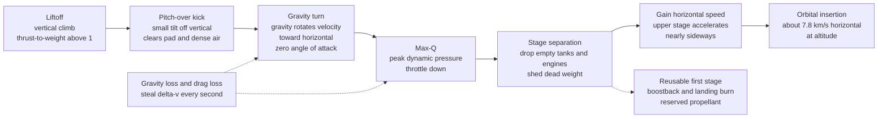

# 🚀 Launch Vehicles and Ascent Trajectories

> [!abstract] TL;DR
> Reaching orbit is not about going **up** — it is about going **sideways insanely fast**: you must accelerate to roughly $7.8$ km/s *horizontally* at altitude (over twenty times a rifle bullet) while clawing out of the thick lower atmosphere. A launch vehicle supplies that orbital speed **plus** the velocity that gravity and drag steal along the way, so the real target is an ideal **$\Delta v$ budget of about $9.3$–$9.5$ km/s to LEO**. It gets there with a **gravity turn** — launch vertically to clear the pad and dense air, then pitch over early so gravity itself gently rotates the velocity vector toward horizontal, converting almost all the remaining thrust into orbital speed with near-zero steering loss. Because a single tank cannot survive the [[Rocket_Propulsion_Fundamentals|rocket equation]], vehicles **stage** — dropping empty tanks and engines like a climber shedding spent oxygen bottles — to sum $\Delta v$ across stages. The brutal bottom line is that only about **2–4% of liftoff mass** reaches orbit, which is why launch has historically been spaceflight's greatest cost and risk barrier, and why **reusability** (propulsive boostback and landing) is now rewriting the economics of access to space.

---

## Intuition

**Analogy:** Imagine you want to throw a ball so hard it never comes back down — not because it flies away from Earth, but because it keeps **falling and missing the ground**, curving around the planet forever. That is an orbit: perpetual free-fall at a speed so high the horizon drops away as fast as you fall toward it. To get there you do **not** mainly need to go *high* — a hundred kilometres of altitude is trivial. You need to go **sideways at about 7.8 km/s**, more than twenty times faster than a rifle bullet. Altitude is just the cheap part that lifts you above the air so that ferocious sideways sprint isn't burned up by drag.

So a rocket does **not** fly straight up like a firework. It lifts off vertically only long enough to clear the launch tower and punch through the densest air, then it deliberately **tips over** into a graceful **gravity turn**: it points slightly off vertical, and from then on lets *gravity itself* pull the nose down, slowly swinging the flight path from straight-up toward flat-and-sideways. By the time it is above most of the atmosphere it is flying nearly horizontal, pouring almost all of its thrust into orbital speed rather than fighting to hold itself up. Every second of the climb, though, **gravity and air drag quietly rob a little velocity** — the "losses" you must pay for on top of the raw orbital speed — and to keep the sprint alive the rocket **sheds spent stages**, dropping empty tanks and engines because hauling dead weight to orbit is the enemy. Launch is a carefully choreographed race against gravity, drag, and the rocket's own mass.

---

## How It Works

### Core Mechanics

**1. The ascent problem — orbit is a sideways velocity target.** A circular orbit at altitude $h$ requires speed $v_{\text{orb}} = \sqrt{\mu/(R_\oplus + h)}$; for low Earth orbit ($h\approx 200$ km) that is about **$7.8$ km/s, horizontal**. Altitude alone is nearly free — getting to 100 km costs only a few hundred m/s of "up." The expensive job is the sideways speed, and it must be delivered **above the atmosphere** so drag doesn't eat it.

**2. The $\Delta v$ budget — orbital speed plus the losses.** The rocket equation gives the *ideal* velocity a vehicle can produce; the ascent spends that on three things:
$$\Delta v_{\text{ideal}} = \underbrace{v_{\text{orb}}}_{\approx 7.8\ \text{km/s}} + \underbrace{\int g\sin\gamma\,dt}_{\text{gravity loss}} + \underbrace{\int \frac{D}{m}\,dt}_{\text{drag loss}} + \underbrace{\Delta v_{\text{steer}}}_{\text{steering loss}}.$$
- **Gravity loss** ($1.0$–$2.0$ km/s): while the flight path angle $\gamma$ is steep, thrust fights gravity instead of building horizontal speed. It vanishes as $\gamma\to 0$ (horizontal) — the whole point of turning over early.
- **Drag loss** ($0.1$–$0.3$ km/s): the atmosphere resists the climb, peaking near **max-Q**.
- **Steering loss** (small): any thrust vectored *across* the velocity is wasted for propulsion. A gravity turn keeps thrust aligned with velocity (near-zero angle of attack), so steering loss is nearly zero — that is *why* the gravity turn is used.

Summing these, the ideal **$\Delta v$ to LEO is about $9.3$–$9.5$ km/s**, even though orbital speed is only $7.8$.

**3. The gravity turn — let gravity do the steering.** Launch **vertically** (to clear the pad and minimize time in dense air), then apply a small **pitch-over kick** a few degrees off vertical. From that moment the thrust is held **along the velocity vector** (zero angle of attack, zero side load), and gravity's component perpendicular to the velocity, $g\cos\gamma$, slowly rotates $\gamma$ from $90^\circ$ toward $0^\circ$:
$$\dot\gamma = -\frac{\left(g - v^2/(R_\oplus+h)\right)\cos\gamma}{v}.$$
As orbital speed is approached, $v^2/(R_\oplus+h)\to g$ and the turn rate self-limits — the trajectory naturally flattens into orbit. The tension is between **going up** (escape the drag) and **going sideways** (gain orbital speed); the gravity turn threads that needle. Around **max-Q** (peak dynamic pressure $q=\tfrac12\rho v^2$, typically 11–14 km altitude and 30–35 kPa), vehicles often **throttle down** to limit aerodynamic and structural loads.

**4. Staging — beat the tyranny of the rocket equation.** Tank, engine, and structural mass impose a **structural coefficient** $\varepsilon = m_{\text{struct}}/(m_{\text{struct}}+m_{\text{prop}})\approx 0.05$–$0.10$, which caps a single stage's usable mass ratio. A single stage simply cannot carry enough propellant *and* survive the [[Rocket_Propulsion_Fundamentals|Tsiolkovsky rocket equation]] to reach $9.4$ km/s with useful payload. The fix is to **stage**: stack rockets and **drop each empty stage** once its propellant is spent, so upper stages needn't accelerate dead tankage. Because $\Delta v$ adds,
$$\Delta v_{\text{total}} = \sum_i I_{sp,i}\,g_0\ln\frac{m_{0,i}}{m_{f,i}}.$$
Stages can be **serial** (stacked, ignited in sequence) or **parallel** (strap-on boosters firing alongside the core). **Optimal staging** chooses the mass split that minimizes gross liftoff weight (GLOW) for a required payload; for identical $I_{sp}$ and $\varepsilon$, the optimum splits $\Delta v$ **equally** among stages, with diminishing returns beyond three.

**5. Launch-vehicle design — the razor-thin margins.** Liftoff demands **thrust-to-weight $> 1$** (typically 1.2–1.5) so the engines out-push gravity; upper stages can accept $T/W < 1$. Propellant choice trades **specific impulse against density** (dense kerosene for punchy first stages, high-$I_{sp}$ hydrogen or efficient upper stages). A **payload fairing** shrouds the cargo through the atmosphere and is jettisoned once drag is negligible. The sobering result: **payload is typically only ~2–4% of GLOW** — everything else is propellant and structure thrown away or flown back.

**6. Launch sites and azimuths — geography is a free $\Delta v$.** Earth's eastward rotation gives a **free velocity boost** of up to $v_{\text{eq}}=2\pi R_\oplus/T \approx 0.46$ km/s at the equator for a due-east launch — which is why equatorial sites are prized. The launch **azimuth** $\beta$ sets the orbital **inclination** $i$ via $\cos i = \sin\beta\cos L$, where $L$ is the site latitude. A hard consequence: **inclination $\geq$ latitude** for a direct launch — you cannot reach an orbit less inclined than your launch site without an expensive dogleg or plane change.

**7. Expendable vs reusable — the economics revolution.** Historically launchers were **expendable**: every stage was thrown away, so each flight rebuilt a skyscraper's worth of hardware. **Reusable** vehicles fly the first stage back and land it propulsively (a **boostback burn** to cancel downrange velocity, an entry burn, and a landing burn), amortizing the most expensive hardware across many flights. The cost is real: recovery propellant is **reserved** rather than spent on payload, trimming performance by roughly 30–40% — but the per-kilogram cost collapse has transformed access to space.

### Flow / Architecture



---

## Key Concepts

### Secondary Level

- **Orbit is sideways, not up.** To orbit you must go *fast enough sideways* (about 7.8 km/s) that you keep falling around the Earth and never hit the ground. Height is the easy part; **speed** is the hard part.
- **Rockets tip over on purpose.** A rocket goes straight up only briefly, then leans over into a **gravity turn** so gravity swings it toward flying flat and fast — pouring its push into orbital speed instead of just holding itself up.
- **Gravity and air steal speed.** Every second of climb, gravity and air drag rob a little velocity — the "losses" — so a rocket must supply *more* than orbital speed to make it.
- **Drop the dead weight.** Because empty tanks are just baggage, rockets are built in **stages** and throw away each spent piece — lighter is faster.
- **Almost all of it is fuel.** Only a few percent of a rocket's liftoff weight actually reaches orbit; the rest is propellant and discarded hardware.

### Undergraduate Level

- **$\Delta v$ budget.** $\Delta v_{\text{ideal}} = v_{\text{orb}} + \text{gravity loss} + \text{drag loss} + \text{steering loss} \approx 9.3$–$9.5$ km/s to LEO, versus $v_{\text{orb}}=\sqrt{\mu/(R_\oplus+h)}\approx 7.8$ km/s.
- **Gravity and drag losses.** Gravity loss $=\int g\sin\gamma\,dt$ (large while steep, zero when horizontal); drag loss $=\int (D/m)\,dt$ with $D=\tfrac12\rho v^2 C_d A$, peaking at **max-Q**.
- **Gravity turn dynamics.** Hold thrust along velocity (zero AoA); $\dot\gamma = -(g - v^2/(R_\oplus+h))\cos\gamma / v$ flattens the path naturally. Small pitch kick initiates it; the turn is self-limiting near orbital speed.
- **Staging.** Structural coefficient $\varepsilon = m_{\text{struct}}/(m_{\text{struct}}+m_{\text{prop}})$ caps a single stage; total $\Delta v$ is the sum over stages. Liftoff needs $T/W > 1$; per-stage payload fraction $\lambda = (n^{-1}-\varepsilon)/(1-\varepsilon)$ with mass ratio $n=e^{\Delta v_i/(I_{sp}g_0)}$.
- **Launch azimuth.** $\cos i = \sin\beta\cos L$; **inclination $\geq$ latitude**. Due-east equatorial launch gains Earth's rotation $\approx 0.46$ km/s.
- **Payload fraction.** GLOW is dominated by propellant; only **~2–4%** reaches orbit for a chemical launcher.

### Graduate Level

- **Optimal staging as constrained optimization.** Minimizing GLOW (or maximizing payload) for a fixed $\Delta v_{\text{total}}=\sum \Delta v_i$ is a Lagrange-multiplier problem ([[Lagrange_Multipliers]]); for identical $I_{sp}$ and $\varepsilon$ the optimum is an **equal $\Delta v$ split**, and marginal returns collapse past three stages. Heterogeneous stages give a transcendental stationarity condition solved numerically.
- **Trajectory optimization / optimal ascent guidance.** Minimizing total loss is an optimal-control problem (Pontryagin's minimum principle); the powered-flight optimum is a **linear/bilinear-tangent steering law** ($\tan\theta$ affine in time), of which the gravity turn is a robust, near-optimal, zero-AoA approximation. Numerically, ascent shaping is often solved by gradient-based methods ([[Gradient_Descent]]) or direct collocation.
- **Round-Earth, rotating-frame effects.** The $v^2/(R_\oplus+h)$ centrifugal relief term flattens the turn; the launch frame's rotation adds the eastward carry velocity and Coriolis terms. J2 is negligible during the minutes-long ascent but sets the target injection state.
- **Structural and aero-load limits.** Max-Q and the product $q\cdot\alpha$ (dynamic pressure times angle of attack) bound bending loads; **load relief** guidance and throttle buckets keep the vehicle inside its envelope, sometimes trading a little $\Delta v$ for structural margin.
- **Reusability $\Delta v$ accounting.** Recovery reserves must fund boostback, entry, and landing burns from the ascent budget; the recovered-vs-expendable payload gap (often 30–40%) is a systems-level trade of marginal launch cost against manufacturing cost amortized over flight cadence.

---

## Python Demo

```python
# Launch Vehicles and Ascent Trajectories -- two studies in four panels:
#
#  ASCENT TRAJECTORY (panels A, B, C): integrate a simplified 2D gravity-turn
#  ascent of a two-stage rocket (thrust, gravity, drag, changing mass, staging).
#    A: altitude vs downrange -- the path tipping from vertical to horizontal.
#    B: speed and flight-path-angle vs time -- the gravity turn from 90 deg to ~0.
#    C: delta-v BUDGET -- ideal (rocket equation) = achieved speed + gravity loss
#       + drag loss, exposing the "losses" you must pay on top of orbital speed.
#
#  STAGING OPTIMIZATION (panel D): overall payload fraction vs the delta-v split
#  between two stages for the ~9.4 km/s orbital budget -- the optimal split, and
#  why a SINGLE stage cannot reach orbit at all.
#
# Requires: numpy, matplotlib
import numpy as np
import matplotlib.pyplot as plt

# ------------------------------------------------------------------ constants
g0   = 9.80665        # standard gravity for Isp [m/s^2]
Re   = 6.371e6        # Earth radius [m]
mu   = 3.986e14       # Earth gravitational parameter [m^3/s^2]
rho0 = 1.225          # sea-level air density [kg/m^3]
Hsc  = 7500.0         # atmospheric scale height [m]

# ------------------------------------------------------- two-stage launcher
Cd   = 0.30                          # drag coefficient
Adia = 3.66                          # body diameter [m]
Aref = np.pi * (Adia / 2.0) ** 2     # reference area [m^2]

prop1, dry1, Isp1, T1 = 395700.0, 25600.0, 300.0, 7.60e6   # stage 1
prop2, dry2, Isp2, T2 =  92670.0,  3900.0, 348.0, 0.981e6  # stage 2
payload = 12000.0
mdot1, mdot2 = T1 / (Isp1 * g0), T2 / (Isp2 * g0)

GLOW         = prop1 + dry1 + prop2 + dry2 + payload
m_stage1_end = GLOW - prop1              # stage-1 propellant exhausted
m_after_sep  = m_stage1_end - dry1       # drop empty stage-1 structure
m_burnout    = m_after_sep - prop2       # stage-2 propellant exhausted
print(f"GLOW = {GLOW/1e3:.1f} t   liftoff T/W = {T1/(GLOW*g0):.2f}"
      f"   payload fraction = {payload/GLOW*100:.2f}%")

# ---------------------------------------------- integrate the gravity turn
dt      = 0.05
t_kick  = 10.0                 # seconds of vertical flight before pitch-over
kick    = np.radians(2.0)      # pitch-over kick angle

t, v, gam, h, x, m = 0.0, 1e-3, np.pi/2, 0.0, 0.0, GLOW
grav_loss = drag_loss = 0.0
stage, kicked = 1, False
T_h, H_h, X_h, V_h, G_h = [], [], [], [], []

while True:
    T, mdot = (T1, mdot1) if stage == 1 else (T2, mdot2)
    g   = mu / (Re + h) ** 2
    rho = rho0 * np.exp(-max(h, 0.0) / Hsc)
    D   = 0.5 * rho * v * v * Cd * Aref

    if (not kicked) and t >= t_kick:      # apply the pitch-over kick once
        gam, kicked = np.pi/2 - kick, True

    dv   = T / m - D / m - g * np.sin(gam)
    dgam = -(g - v * v / (Re + h)) * np.cos(gam) / v if kicked else 0.0
    dh   = v * np.sin(gam)
    dx   = (Re / (Re + h)) * v * np.cos(gam)

    grav_loss += g * np.sin(gam) * dt
    drag_loss += (D / m) * dt
    T_h.append(t); H_h.append(h); X_h.append(x); V_h.append(v); G_h.append(np.degrees(gam))

    v += dv*dt; gam += dgam*dt; h += dh*dt; x += dx*dt; m -= mdot*dt; t += dt

    if stage == 1 and m <= m_stage1_end:  # stage separation
        m, stage = m_after_sep, 2
    if (stage == 2 and m <= m_burnout) or h < 0 or t > 1000:
        break

T_h = np.array(T_h); H_h = np.array(H_h)/1e3; X_h = np.array(X_h)/1e3
V_h = np.array(V_h)/1e3; G_h = np.array(G_h)
achieved = V_h[-1] * 1e3
ideal_dv = (Isp1*g0*np.log(GLOW/m_stage1_end)
            + Isp2*g0*np.log(m_after_sep/m_burnout))
print(f"\nIdeal delta-v (rocket eq) = {ideal_dv/1e3:.2f} km/s")
print(f"  gravity loss = {grav_loss/1e3:.2f} km/s")
print(f"  drag loss    = {drag_loss/1e3:.2f} km/s")
print(f"  achieved speed at burnout = {achieved/1e3:.2f} km/s "
      f"at {H_h[-1]:.0f} km, path angle {G_h[-1]:.0f} deg")

# ------------------------------------------------ staging optimization
dv_req, Isp_s, eps = 9400.0, 350.0, 0.08
c_s = Isp_s * g0

def payload_fraction(dv, c, eps):
    n = np.exp(dv / c)                    # stage mass ratio m0/mf
    return (1.0/n - eps) / (1.0 - eps)    # <0 means infeasible

f    = np.linspace(0.05, 0.95, 400)       # fraction of total dv to stage 1
lam1 = payload_fraction(f*dv_req,      c_s, eps)
lam2 = payload_fraction((1-f)*dv_req,  c_s, eps)
PF2  = np.where((lam1 > 0) & (lam2 > 0), lam1*lam2, np.nan)
i_best = np.nanargmax(PF2)
PF1  = payload_fraction(dv_req, c_s, eps)  # single stage -> negative
print(f"\nSingle stage payload fraction = {PF1*100:.2f}%  "
      f"({'FEASIBLE' if PF1 > 0 else 'IMPOSSIBLE'})")
print(f"Best two-stage split: {f[i_best]*100:.0f}/{(1-f[i_best])*100:.0f} "
      f"-> payload fraction {PF2[i_best]*100:.2f}%")

# ---------------------------------------------------------------- plots
fig, ax = plt.subplots(2, 2, figsize=(14, 10))
fig.suptitle("Ascent to Orbit: Gravity Turn, Delta-v Budget, and Staging",
             fontsize=15, fontweight="bold")

# A: trajectory
axA = ax[0, 0]
axA.plot(X_h, H_h, lw=2.6, color="#1f77b4")
axA.scatter([0], [0], color="#2ca02c", zorder=5, label="liftoff")
axA.scatter([X_h[-1]], [H_h[-1]], color="#d62728", zorder=5, label="burnout")
axA.set_xlabel("downrange  [km]"); axA.set_ylabel("altitude  [km]")
axA.set_title("A. Gravity-turn trajectory: vertical then nearly horizontal")
axA.legend(fontsize=9); axA.grid(alpha=0.3)

# B: speed and flight path angle vs time
axB = ax[0, 1]
axB.plot(T_h, V_h, lw=2.6, color="#1f77b4", label="speed [km/s]")
axB.set_xlabel("time  [s]"); axB.set_ylabel("speed  [km/s]", color="#1f77b4")
axB.tick_params(axis="y", labelcolor="#1f77b4"); axB.grid(alpha=0.3)
axB2 = axB.twinx()
axB2.plot(T_h, G_h, lw=2.2, ls="--", color="#d62728", label="flight path angle")
axB2.set_ylabel("flight path angle  [deg]", color="#d62728")
axB2.tick_params(axis="y", labelcolor="#d62728")
axB.set_title("B. Speed climbs as the path angle falls 90 deg -> horizontal")

# C: delta-v budget
axC = ax[1, 0]
axC.bar(0, achieved/1e3, color="#2ca02c", label="achieved speed")
axC.bar(0, grav_loss/1e3, bottom=achieved/1e3, color="#ff7f0e", label="gravity loss")
axC.bar(0, drag_loss/1e3, bottom=(achieved+grav_loss)/1e3, color="#9467bd", label="drag loss")
axC.axhline(ideal_dv/1e3, ls="--", color="k", lw=1.4)
axC.text(0.32, ideal_dv/1e3, f"ideal {ideal_dv/1e3:.1f} km/s", va="center", fontsize=9)
axC.set_xlim(-0.8, 0.9); axC.set_xticks([])
axC.set_ylabel("delta-v  [km/s]")
axC.set_title("C. Delta-v budget: ideal = achieved + gravity + drag losses")
axC.legend(fontsize=8, loc="upper right")

# D: staging optimization
axD = ax[1, 1]
axD.plot(f*100, PF2*100, lw=2.6, color="#1f77b4")
axD.scatter(f[i_best]*100, PF2[i_best]*100, color="#d62728", zorder=5,
            label=f"optimum {f[i_best]*100:.0f}/{(1-f[i_best])*100:.0f}")
axD.axvline(50, ls=":", color="#7f7f7f", lw=1.4, label="equal split")
axD.axhline(0, ls="-", color="k", lw=0.8)
axD.text(50, PF2[i_best]*100*0.35,
         "single stage:\npayload fraction < 0\n(cannot reach orbit)",
         ha="center", fontsize=8.5, color="#d62728")
axD.set_xlabel("delta-v fraction assigned to stage 1  [%]")
axD.set_ylabel("overall payload fraction  [%]")
axD.set_title("D. Optimal staging for the 9.4 km/s orbital budget")
axD.legend(fontsize=8, loc="lower center"); axD.grid(alpha=0.3)

plt.tight_layout(rect=[0, 0, 1, 0.95])
plt.show()
```

**What it shows.** Panels **A** and **B** are the gravity turn made visible: the vehicle rises vertically, takes a small pitch kick, and then the path angle (dashed red) slides steadily from $90^\circ$ toward horizontal while speed (blue) climbs — the trajectory in **A** arcs from straight-up over into a long, flat, downrange sprint, exactly the "go sideways, not up" strategy. Panel **C** is the sobering **$\Delta v$ budget**: the ideal velocity the rocket equation delivers is not all useful speed — a stacked chunk is siphoned off as **gravity loss** (dominant, paid while the climb is steep) and a smaller slice as **drag loss**, so the *achieved* speed is well below the *ideal*. That gap is precisely why a launcher must be sized to ~9.4 km/s, not 7.8. Panel **D** is the **staging** payoff: sweeping the split of the $9.4$ km/s budget between two stages traces a hump that peaks near an **equal split** (for identical $I_{sp}$ and $\varepsilon$), while a **single stage's payload fraction is negative** — physically impossible — the quantitative reason essentially every orbital rocket stages. (The simplified integrator is illustrative; real vehicles fine-tune the pitch program and often over- or under-perform this toy budget, but the qualitative story is exact.)

---

## Real-World Applications

> **Example — SpaceX Falcon 9.** The clearest live illustration of this entire note. It launches vertically from Cape Canaveral, pitches into a **gravity turn**, and **throttles down through max-Q**. Nine sea-level Merlin engines (short, low-expansion nozzles, $T/W>1$) power the first stage; after separation a single Merlin Vacuum with a large bell nozzle drives the upper stage nearly horizontal to orbital velocity — **staging** summing $\Delta v$ to clear the ~9.4 km/s barrier. The vehicle is roughly 95% propellant by mass, and its defining innovation is **reusability**: the first stage performs a **boostback burn** to cancel downrange velocity, an entry burn, and a **propulsive landing** on a droneship or pad — reserving propellant that would otherwise lift payload, in exchange for amortizing the most expensive hardware across dozens of flights.

- **Saturn V (Apollo).** A three-stage serial-staged giant: an RP-1/LOX first stage (five F-1 engines, still the highest-thrust liquid engines ever flown) followed by two high-$I_{sp}$ hydrogen/LOX stages. Staging was the *only* way it delivered a translunar $\Delta v$.
- **Space Shuttle.** **Parallel staging** with two solid rocket boosters strapped to the orbiter and external tank; the SSMEs deliberately **throttled down to ~65% ("the bucket")** through max-Q to protect the stack, then throttled back up.
- **Soyuz from Baikonur.** Site latitude ~46°, so the ISS orbit sits at **51.6° inclination** — a direct consequence of $i \geq L$ and the historical need to drop stages over land, not a free choice.
- **Ariane 5/6 from Kourou.** French Guiana at ~5° latitude exploits nearly the **full 0.46 km/s equatorial rotation bonus** and cheap access to low-inclination geostationary transfer orbits — a geography-driven commercial edge.
- **SpaceX Starship.** Pushes reusability to the limit: **both** stages are designed to fly back and land, targeting order-of-magnitude reductions in cost-to-orbit and reframing launch as routine transportation.

---

## Common Pitfalls

- **Thinking you must go "up" to reach orbit.** Altitude is cheap; the hard, expensive quantity is **horizontal speed** (~7.8 km/s). Rockets spend most of their energy accelerating sideways, not climbing — which is why they tip over so early.
- **Sizing to orbital speed instead of the $\Delta v$ budget.** Building a vehicle for 7.8 km/s leaves it stranded suborbital. You must budget **~9.4 km/s** to cover gravity, drag, and steering losses.
- **Pitching over too aggressively.** A large kick or high angle of attack turns the vehicle too fast, drives up **steering loss** and aerodynamic $q\cdot\alpha$ loads, and can send it back into the atmosphere. The gravity turn works precisely because thrust stays aligned with velocity (near-zero AoA).
- **Forgetting $T/W > 1$ at liftoff.** An efficient high-$I_{sp}$ engine with too little thrust cannot lift off — it just sits and burns. First stages need thrust-to-weight above one; efficiency is the upper stage's job.
- **Ignoring the inclination floor $i \geq L$.** You cannot directly reach an inclination lower than your launch latitude. Forcing it demands a costly **dogleg** or on-orbit **plane change** — one of the most $\Delta v$-expensive maneuvers there is.
- **Assuming reusability is free performance.** Boostback, entry, and landing burns are funded from the **ascent** budget; recovering the first stage typically costs 30–40% of expendable payload. The win is economic (amortized hardware), not a free lunch in $\Delta v$.
- **Confusing payload fraction with structural fraction.** Only ~2–4% of GLOW reaches orbit; the structural coefficient $\varepsilon$ (dead mass per stage) is a *different* number, and mixing them up wrecks staging estimates.

---

## Related Concepts

- [[Orbital_Mechanics_and_Celestial_Dynamics]] — where the ascent *delivers* the payload: the orbital velocities ($\sqrt{\mu/r}$), inclinations, and injection states that the launch trajectory is designed to hit.
- [[Newtons_Laws_and_Kinematics]] — the third-law momentum reaction and the variable-mass, curvilinear dynamics from which the ascent equations of motion (and the rocket equation) are built.
- [[Compressible_Flow_and_Propulsion]] — the aerodynamics of max-Q and the nozzle/thrust physics that set the vehicle's drag and thrust as it accelerates through the atmosphere.
- [[Lagrange_Multipliers]] — the constrained-optimization machinery behind **optimal staging**: minimize GLOW subject to $\sum \Delta v_i = \Delta v_{\text{total}}$, yielding the equal-split result for identical stages.
- [[Gradient_Descent]] — the numerical optimization used for **ascent trajectory shaping** and pitch-program design once the gravity turn is refined into an optimal-control solution.

This note is the **trajectory-and-systems** view of getting to orbit; the underlying propellant physics lives in its propulsion companions [[Rocket_Propulsion_Fundamentals]] (the Tsiolkovsky rocket equation, specific impulse, and thrust that define the $\Delta v$ this vehicle can produce) and [[Liquid_and_Solid_Rocket_Engines]] (the hardware that sets thrust and mass flow, and the sea-level-versus-vacuum nozzle trade). Its *Astronautics_and_Orbital_Mechanics* siblings carry the story onward: [[Orbital_Mechanics_and_Astrodynamics]] (the orbits this ascent injects into) and [[Orbital_Maneuvers_and_Transfers]] (spending the remaining $\Delta v$ on Hohmann transfers, plane changes, and rendezvous).

---

## Review Questions

1. **Secondary:** A friend says "to reach space you just need a rocket powerful enough to fly straight up past the atmosphere." Explain why that gets you *to* space but **not into orbit**, why a rocket deliberately tips over early instead of flying straight up, and what "the losses" are that make a rocket need to supply *more* than orbital speed.
2. **Undergraduate:** A launch site sits at latitude $28.5^\circ$. (a) Compute the free eastward velocity from Earth's rotation for a due-east launch, and state the minimum orbital inclination achievable directly. (b) If orbital speed for the target LEO is $7.8$ km/s and total ascent losses are $1.6$ km/s, what ideal $\Delta v$ must the vehicle produce, and roughly how does that change if the same rocket launches from the equator? (c) Using $\lambda=(n^{-1}-\varepsilon)/(1-\varepsilon)$ with $\varepsilon=0.08$ and $I_{sp}=350$ s, argue why a single stage cannot deliver positive payload for a $9.4$ km/s budget.
3. **Graduate:** For a two-stage vehicle with identical $I_{sp}$ and structural coefficient $\varepsilon$ and a fixed total $\Delta v$, set up the Lagrange-multiplier problem that maximizes overall payload fraction and show that the optimum is an **equal $\Delta v$ split**. Then discuss quantitatively how first-stage **reusability** changes this trade: where does the boostback/landing reserve come from, why does it reduce payload by 30–40%, and under what cadence assumptions does it still win economically?

---

## Sources

- H. D. Curtis — *Orbital Mechanics for Engineering Students*, 4th ed. (Butterworth-Heinemann, 2020) — ascent dynamics, the $\Delta v$ budget, and launch-to-orbit trajectory analysis.
- G. P. Sutton & O. Biblarz — *Rocket Propulsion Elements*, 9th ed. (Wiley, 2016) — flight performance, gravity/drag losses, staging, and the rocket equation.
- J. R. Wertz & W. J. Larson (eds.) — *Space Mission Analysis and Design (SMAD)*, 3rd ed. (Microcosm/Springer, 1999) — launch systems, $\Delta v$ budgeting, launch sites, azimuths, and vehicle sizing.
- M. J. L. Turner — *Rocket and Spacecraft Propulsion*, 3rd ed. (Springer/Praxis, 2009) — accessible derivations of ascent trajectories, multi-stage optimization, and launch-vehicle design.
- NASA Glenn Research Center — "Beginner's Guide to Rockets: Flight Trajectories and Ascent," grc.nasa.gov — introductory treatment of gravity turns, max-Q, and staging.

---

#aerospace-engineering #launch-vehicle #ascent #gravity-turn #staging
