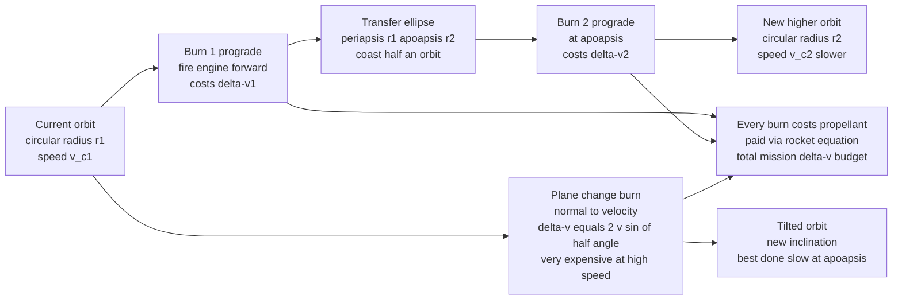

# 🛰️ Orbital Maneuvers and Transfers

> [!abstract] TL;DR
> **Orbital maneuvering** is the art of changing your orbit with rocket burns, and its universal currency is **delta-v** — the velocity change every maneuver "spends," paid for out of propellant through the Tsiolkovsky rocket equation. Because $\Delta v$ costs exponentially in propellant mass, mission design is fundamentally a **delta-v budget**. A short burn is treated as an **impulsive** velocity change: fire **prograde** to raise the *opposite* side of your orbit, **retrograde** to lower it, or **normal** to tilt the plane. The workhorse transfer between two coplanar circular orbits is the **Hohmann transfer** — two tangential burns joined by a half-ellipse, provably the minimum-$\Delta v$ two-burn transfer; for very large radius ratios (beyond $r_2/r_1 \approx 11.94$) the three-burn **bi-elliptic transfer** can beat it by detouring out to a high apoapsis and back. **Plane changes** are brutally expensive — $\Delta v = 2v\sin(\Delta\theta/2)$ scales with orbital *speed*, so tilting an orbit is best done at high altitude where you move slowly, or folded into another burn. To **rendezvous** with a target you exploit the maddening logic of orbits: to catch something ahead of you, you drop to a *lower, faster* orbit and speed up by slowing down. These maneuvers underlie every mission phase after launch — reaching GEO, deploying and maintaining constellations, docking with the ISS, servicing satellites, and deorbiting — and the delta-v budget they generate is what sizes the propellant and decides whether a mission is even possible.

---

## Intuition

**Analogy:** Imagine you are a race-car driver on a circular track, except your car has no steering wheel and no brakes in the ordinary sense — the *only* control you have is an engine that fires forward or backward, and every push burns a precious, non-refillable tank of fuel. That fuel, measured as **delta-v** (how much you can change your velocity), is your entire budget for the whole race; when it runs out, you are stuck forever in whatever orbit you happen to be in.

Now the weird part. On this cosmic racetrack, hitting the gas does **not** simply make you go faster in a straight line — it lifts you into a *bigger, slower* lane on the far side of the track. Push forward at one point and half a lap later you have climbed to a higher orbit where, paradoxically, you are now travelling *slower* than before. So to hop up one lane cleanly, you fire once to start climbing, coast halfway around, then fire again at the top to settle into the new lane — that elegant two-burn hop is the **Hohmann transfer**, the most fuel-efficient lane change there is. Want to tilt the *plane* of the whole track sideways instead? That is like trying to shove a speeding freight train off its rails at right angles — the faster you are going, the more violently expensive it becomes, which is why you save any tilting for the slow, high parts of the orbit. And when you finally want to pull alongside the space station to dock, you do not chase it directly like a car; you drop *below* it into a lower, faster lane to catch up, then rise gently to meet it — the counterintuitive slow-dance of orbital **rendezvous**, where you speed up by slowing down.

---

## How It Works

### Core Mechanics

1. **The currency is delta-v.** Every maneuver is quantified by the vector velocity change $\Delta \vec v$ it requires. Adding up all the $\Delta v$ a mission needs — launch, transfers, plane changes, rendezvous, station-keeping, deorbit — gives the **delta-v budget**. This single number, fed through the rocket equation $m_0/m_f = e^{\Delta v / (I_{sp} g_0)}$, dictates how much propellant the vehicle must carry, and therefore whether the mission closes at all. Because the cost is *exponential* in $\Delta v$, saving a few hundred m/s can mean tonnes of propellant.

2. **Impulsive burns.** A chemical-rocket burn lasts seconds to minutes — short compared with an orbit of hours — so it is idealized as an **impulsive** maneuver: an instantaneous change of velocity at a single point, with the position unchanged. The direction of the burn relative to the velocity vector sets what it does:
   - **Prograde** (along velocity): adds energy, raising the *opposite* side of the orbit (raise your apoapsis by burning at periapsis).
   - **Retrograde** (against velocity): removes energy, lowering the opposite side (this is how you deorbit).
   - **Radial** (toward/away from the primary): rotates the apse line, changing the *orientation* of the ellipse with little energy change.
   - **Normal** (perpendicular to the orbital plane): tilts the plane — changes inclination or right ascension of the ascending node (RAAN).

3. **The vis-viva backbone.** Every burn magnitude comes from differencing speeds given by the vis-viva equation $v = \sqrt{\mu\left(\tfrac{2}{r} - \tfrac{1}{a}\right)}$, where $\mu = GM$, $r$ is current radius, and $a$ is the semi-major axis of the orbit you are on. A maneuver simply changes which orbit (which $a$) you are on at the burn point.

4. **The Hohmann transfer — the workhorse.** To move between coplanar circular orbits of radii $r_1$ and $r_2$, ride a **transfer ellipse** tangent to both: periapsis at $r_1$, apoapsis at $r_2$, semi-major axis $a_t = (r_1 + r_2)/2$. Two prograde burns do the job. Burn 1 at $r_1$ raises you onto the ellipse: $\Delta v_1 = v_p - v_{c1}$. Coast half an orbit (transfer time $t = \pi\sqrt{a_t^3/\mu}$) to apoapsis at $r_2$, then Burn 2 circularizes: $\Delta v_2 = v_{c2} - v_a$. For two impulsive burns it is provably the **minimum-$\Delta v$** transfer.

5. **The bi-elliptic transfer.** For very large radius ratios, a three-burn detour can beat Hohmann: burn hard at $r_1$ to fling apoapsis out to a huge intermediate radius $r_b > r_2$, coast up, do a small prograde burn at $r_b$ to raise periapsis to $r_2$, coast back down, then retro-burn to circularize at $r_2$. Because the middle burn happens where you move *slowly*, plane and energy changes there are cheap. Bi-elliptic wins when $r_2/r_1 \gtrsim 11.94$ (and unconditionally beyond $\approx 15.58$) — at the price of a much longer transfer time.

6. **Plane changes are expensive.** To rotate the orbital plane by angle $\Delta\theta$ at a point where your speed is $v$, you need $\Delta v = 2v\sin(\Delta\theta/2)$ — a pure vector re-aim of the velocity. The cost is proportional to $v$, so a 30° change in LEO ($v \approx 7.7$ km/s) costs $\sim 4$ km/s, more than a whole Hohmann to GEO. The fixes: perform plane changes at **apoapsis** where $v$ is smallest, or **combine** the plane change with a prograde/retrograde burn as a single vector addition. This is exactly why launch vehicles aim for the target inclination directly from the pad.

7. **Phasing and rendezvous.** Reaching the right *orbit* is not enough — you must arrive at the right *place at the right time*. A **phasing orbit** adjusts timing: to catch a target ahead of you, drop into a slightly lower (shorter-period, faster) orbit, let the lower orbit lap around, then re-raise — you "speed up by slowing down." Close-in, relative motion is described by the linearized **Clohessy-Wiltshire (Hill's) equations**, giving the looping relative trajectories used for **V-bar** (along-track) and **R-bar** (radial) final approaches to docking.

8. **Station-keeping and low-thrust.** Real orbits drift under perturbations — atmospheric drag, Earth's **J2** oblateness, solar radiation pressure, third-body pull. Small periodic burns (**station-keeping**) fight this to hold a slot, especially in GEO. Electric thrusters, with huge $I_{sp}$ but tiny thrust, cannot do impulsive Hohmann burns; instead they **spiral** continuously outward, trading long transfer times for enormous propellant savings.

### Flow / Architecture



---

## Key Concepts

### Secondary Level

- **You steer with your engine, and fuel is finite.** In space there is nothing to push against and no brakes — the only way to change your path is to fire a rocket, and each firing spends part of a fixed "delta-v" budget. Run out, and you are locked into your orbit forever.
- **Speeding up lifts you higher, not straight ahead.** Fire forward and half an orbit later you rise into a *bigger, slower* loop. To move up one orbit you fire twice — once to start climbing, once at the top to settle in. That neat two-burn move is the **Hohmann transfer**.
- **Tilting your orbit is the pricey maneuver.** Changing which way your orbital plane is angled costs far more fuel than raising or lowering it — and the faster you are moving, the worse it gets. So you do it high up where you crawl, not low down where you race.
- **To catch something, drop below it.** Chasing another spacecraft head-on does not work. You dip into a lower, faster orbit to gain on it, then climb back up to meet it — the surprising "speed up by slowing down" of docking.
- **Why it matters.** Getting a satellite to its final orbit, keeping it there, meeting the space station, and safely bringing things down all come from these maneuvers — and the fuel they demand decides what missions can fly.

### Undergraduate Level

- **Impulsive burns and vis-viva.** Treat each burn as an instantaneous $\Delta \vec v$; compute the speed before and after from $v = \sqrt{\mu(2/r - 1/a)}$ and difference them. Prograde/retrograde change $a$ (energy); normal burns change inclination; radial burns rotate the apse line.
- **Hohmann transfer, in equations.** With $a_t = (r_1+r_2)/2$: $\Delta v_1 = \sqrt{\mu(2/r_1 - 1/a_t)} - \sqrt{\mu/r_1}$, $\Delta v_2 = \sqrt{\mu/r_2} - \sqrt{\mu(2/r_2 - 1/a_t)}$, total $\Delta v_H = \Delta v_1 + \Delta v_2$, transfer time $t = \pi\sqrt{a_t^3/\mu}$. Tangential burns at apses are optimal for two impulses.
- **Bi-elliptic vs Hohmann.** Three burns via intermediate apoapsis $r_b$. Below $r_2/r_1 \approx 11.94$ Hohmann always wins; above $\approx 15.58$ bi-elliptic always wins; in between it depends on $r_b$. Bi-elliptic trades $\Delta v$ for much longer flight time.
- **Plane-change cost.** $\Delta v_{pc} = 2v\sin(\Delta\theta/2)$. Linear in orbital speed $v$, so cheaper at apoapsis. A **combined** maneuver adds the plane change to a circularization burn as a vector, costing $\sqrt{v_a^2 + v_c^2 - 2 v_a v_c \cos\Delta\theta}$ instead of the arithmetic sum — always less.
- **One-tangent and fast transfers.** Relaxing the tangency condition (burning to a non-tangent ellipse or hyperbola) reaches the target quicker but costs more $\Delta v$ — the time-vs-fuel trade behind interplanetary launch windows.
- **Phasing.** To shift phase angle $\Delta\phi$ relative to a target on the same orbit, enter a phasing orbit of period $T_{phase} = T(1 \mp \Delta\phi/2\pi)$ for one revolution, catching up (lower/faster) or falling back (higher/slower).

### Graduate Level

- **Optimality of Hohmann.** Among all two-impulse transfers between coplanar circular orbits, the Hohmann is minimum-$\Delta v$; the proof follows from the primer-vector theory of Lawden, where the optimal burns are tangential and occur at the apses. Adding impulses (bi-elliptic, and in the limit multi-impulse) can lower cost only for large radius ratios.
- **Bi-elliptic limit and thresholds.** As $r_b\to\infty$ the normalized bi-elliptic cost tends to $(\sqrt2 - 1)(1 + 1/\sqrt{R})$ with $R = r_2/r_1$; equating to the Hohmann cost yields the classic crossover $R^\star \approx 11.94$ (and the $r_b$-independent bound $R \approx 15.58$). Beyond these, the "detour" pays because energy-changing burns are cheapest deep in the slow apoapsis region.
- **Combined maneuvers and split-plane-change.** The optimal way to reach an inclined GEO from GTO splits the plane change unevenly between the perigee and apogee burns; a small fraction is done cheaply at slow apogee. Formal minimization of the vector-sum $\Delta v$ over the split angle recovers the Cape-Canaveral GTO apogee-kick strategy.
- **Clohessy-Wiltshire / Hill's equations.** Linearizing relative motion about a circular reference orbit (mean motion $n$) gives $\ddot x - 2n\dot y - 3n^2 x = a_x$, $\ddot y + 2n\dot x = a_y$, $\ddot z + n^2 z = a_z$. The state-transition matrix yields closed-form targeting for rendezvous burns, the along-track drift $-3n$ per unit radial offset, and the 2:1 elliptical relative orbits seen in proximity operations.
- **Perturbations and station-keeping.** $J2$ drives secular nodal regression $\dot\Omega = -\tfrac{3}{2}nJ_2(R_E/p)^2\cos i$ and apsidal rotation — exploited for sun-synchronous orbits, fought for others. GEO east-west (triaxiality) and north-south (luni-solar inclination) station-keeping budgets run $\sim 50$ m/s/yr, dominated by the costly north-south (plane) component.
- **Low-thrust transfers.** Continuous-thrust spirals obey Edelbaum's result: for a circle-to-circle transfer with plane change $\Delta i$, $\Delta v = \sqrt{v_1^2 - 2 v_1 v_2 \cos(\tfrac{\pi}{2}\Delta i) + v_2^2}$, cleanly folding the (otherwise brutal) plane change into the spiral — a key reason electric propulsion dominates modern GEO and constellation logistics.

---

## Python Demo

```python
# Orbital Maneuvers and Transfers, visualised in four panels:
#   (A) HOHMANN GEOMETRY: draw the inner circular orbit, outer circular orbit,
#       and the tangent transfer ellipse for a real LEO -> GEO transfer.
#   (B) HOHMANN vs BI-ELLIPTIC: normalized total delta-v vs radius ratio R,
#       showing the ~11.94 crossover where the three-burn bi-elliptic wins.
#   (C) PLANE-CHANGE COST: delta-v = 2*v*sin(dtheta/2) vs inclination-change
#       angle, for fast LEO speed vs slow GEO speed -- why plane changes are
#       cheaper at high altitude.
#   (D) COMBINED vs SEPARATE plane change at circularization, vs angle.
# Requires: numpy, matplotlib
import numpy as np
import matplotlib.pyplot as plt

mu = 398600.4418        # Earth GM [km^3/s^2]

def vis_viva(r, a):
    return np.sqrt(mu * (2.0 / r - 1.0 / a))

# ==================================================================
# (A) HOHMANN LEO -> GEO: numbers + geometry
# ==================================================================
r1 = 6678.0             # LEO radius (~300 km altitude) [km]
r2 = 42164.0            # GEO radius [km]
at = 0.5 * (r1 + r2)    # transfer-ellipse semi-major axis
vc1, vc2 = np.sqrt(mu / r1), np.sqrt(mu / r2)
vp = vis_viva(r1, at)   # speed at periapsis of transfer ellipse
va = vis_viva(r2, at)   # speed at apoapsis of transfer ellipse
dv1 = vp - vc1          # burn 1 (prograde at LEO)
dv2 = vc2 - va          # burn 2 (prograde at GEO)
dv_tot = dv1 + dv2
t_transfer = np.pi * np.sqrt(at**3 / mu)   # half-period [s]

print("=== Hohmann transfer: LEO (6678 km) -> GEO (42164 km) ===")
print(f"v_circ LEO = {vc1:6.3f} km/s , v_circ GEO = {vc2:6.3f} km/s")
print(f"delta-v1 (raise) = {dv1:5.3f} km/s")
print(f"delta-v2 (circularize) = {dv2:5.3f} km/s")
print(f"TOTAL delta-v = {dv_tot:5.3f} km/s")
print(f"transfer time = {t_transfer/3600:4.2f} hours")

# ==================================================================
# (B) HOHMANN vs BI-ELLIPTIC (normalized, mu=r1=1 so v_c1=1)
# ==================================================================
def hohmann_norm(R):
    a = 0.5 * (1.0 + R)
    dv1 = np.sqrt(2.0 - 2.0 / (1.0 + R)) - 1.0
    dv2 = np.sqrt(1.0 / R) - np.sqrt(2.0 / R - 2.0 / (1.0 + R))
    return dv1 + dv2

def bielliptic_norm(R, B):        # B = r_b / r1 (intermediate apoapsis)
    a1 = 0.5 * (1.0 + B)
    a2 = 0.5 * (B + R)
    dv1 = np.sqrt(2.0 - 2.0 / (1.0 + B)) - 1.0
    dv2 = np.sqrt(2.0 / B - 2.0 / (B + R)) - np.sqrt(2.0 / B - 2.0 / (1.0 + B))
    dv3 = np.sqrt(2.0 / R - 2.0 / (B + R)) - np.sqrt(1.0 / R)
    return dv1 + dv2 + dv3

R_ax = np.linspace(2.0, 30.0, 400)
dv_H = np.array([hohmann_norm(R) for R in R_ax])
dv_BE_50 = np.array([bielliptic_norm(R, 50.0) for R in R_ax])
dv_BE_inf = (np.sqrt(2.0) - 1.0) * (1.0 + 1.0 / np.sqrt(R_ax))   # r_b -> infinity

print("\n=== Normalized total delta-v (units of v_circ,1) ===")
for R in [6.31, 11.94, 20.0]:
    print(f"R={R:5.2f}: Hohmann={hohmann_norm(R):.4f}  "
          f"bi-elliptic(inf)={(np.sqrt(2)-1)*(1+1/np.sqrt(R)):.4f}")

# ==================================================================
# (C) PLANE-CHANGE COST: dv = 2 v sin(dtheta/2)
# ==================================================================
dtheta = np.linspace(0.0, 60.0, 400)      # inclination change [deg]
v_leo, v_geo = vc1, vc2                    # fast vs slow
dv_pc_leo = 2.0 * v_leo * np.sin(np.radians(dtheta) / 2.0)
dv_pc_geo = 2.0 * v_geo * np.sin(np.radians(dtheta) / 2.0)
print("\n=== Plane change of 28.5 deg (Cape Canaveral -> equatorial) ===")
print(f"at LEO speed: {2*v_leo*np.sin(np.radians(28.5)/2):.3f} km/s")
print(f"at GEO speed: {2*v_geo*np.sin(np.radians(28.5)/2):.3f} km/s  (much cheaper)")

# ==================================================================
# (D) COMBINED vs SEPARATE plane change folded into GEO circularization
#     separate:  |vc2 - va|  +  2*vc2*sin(dtheta/2)
#     combined:  sqrt(va^2 + vc2^2 - 2*va*vc2*cos(dtheta))   (vector sum)
# ==================================================================
ang = np.linspace(0.0, 40.0, 400)
dv_sep = (vc2 - va) + 2.0 * vc2 * np.sin(np.radians(ang) / 2.0)
dv_comb = np.sqrt(va**2 + vc2**2 - 2.0 * va * vc2 * np.cos(np.radians(ang)))

# ==================================================================
# PLOTS: 2 x 2 grid
# ==================================================================
fig, ax = plt.subplots(2, 2, figsize=(14, 11))
fig.suptitle("Orbital Maneuvers: Hohmann, Bi-elliptic, and Plane Changes",
             fontsize=15, fontweight="bold")

# --- A. Hohmann geometry (to scale, in Earth radii) ---
axA = ax[0, 0]
th = np.linspace(0, 2 * np.pi, 400)
axA.plot(r1 * np.cos(th), r1 * np.sin(th), color="#1f77b4", lw=2, label="LEO (start)")
axA.plot(r2 * np.cos(th), r2 * np.sin(th), color="#2ca02c", lw=2, label="GEO (target)")
# transfer ellipse: periapsis at +x (r1), apoapsis at -x (r2)
e_t = (r2 - r1) / (r2 + r1)
nu = np.linspace(0, np.pi, 300)                 # half-ellipse (periapsis to apoapsis)
r_ell = at * (1 - e_t**2) / (1 + e_t * np.cos(nu))
xc = -at * e_t                                  # ellipse centre offset (focus at origin)
axA.plot(r_ell * np.cos(nu), r_ell * np.sin(nu), color="#d62728", lw=2.4,
         ls="--", label="transfer ellipse")
axA.scatter([r1], [0], color="#1f77b4", zorder=5)
axA.scatter([-r2], [0], color="#2ca02c", zorder=5)
axA.annotate("burn 1\n+2.43 km/s", xy=(r1, 0), xytext=(r1 + 6000, -9000),
             fontsize=8, arrowprops=dict(arrowstyle="->"))
axA.annotate("burn 2\n+1.47 km/s", xy=(-r2, 0), xytext=(-r2 - 4000, 8000),
             fontsize=8, ha="right", arrowprops=dict(arrowstyle="->"))
axA.add_patch(plt.Circle((0, 0), 6371, color="#4444aa", alpha=0.6))  # Earth
axA.set_aspect("equal"); axA.set_xlabel("x [km]"); axA.set_ylabel("y [km]")
axA.set_title("A. Hohmann transfer geometry (LEO to GEO)")
axA.legend(fontsize=8, loc="upper right"); axA.grid(alpha=0.3)

# --- B. Hohmann vs bi-elliptic delta-v ---
axB = ax[0, 1]
axB.plot(R_ax, dv_H, lw=2.6, color="#1f77b4", label="Hohmann (2 burns)")
axB.plot(R_ax, dv_BE_inf, lw=2.4, color="#d62728",
         label="bi-elliptic, r_b -> infinity")
axB.plot(R_ax, dv_BE_50, lw=2.0, ls="--", color="#ff7f0e",
         label="bi-elliptic, r_b = 50 r1")
axB.axvline(11.94, color="k", ls=":", lw=1.3)
axB.annotate("R = 11.94\nbi-elliptic starts to win",
             xy=(11.94, 0.55), xytext=(14, 0.50), fontsize=8,
             arrowprops=dict(arrowstyle="->"))
axB.set_xlabel("radius ratio  R = r2 / r1")
axB.set_ylabel("total delta-v  /  v_circ,1")
axB.set_title("B. Hohmann vs bi-elliptic: crossover at large R")
axB.legend(fontsize=8, loc="upper right"); axB.grid(alpha=0.3)

# --- C. plane-change cost ---
axC = ax[1, 0]
axC.plot(dtheta, dv_pc_leo, lw=2.6, color="#d62728",
         label=f"LEO  v = {v_leo:.1f} km/s (fast)")
axC.plot(dtheta, dv_pc_geo, lw=2.6, color="#2ca02c",
         label=f"GEO  v = {v_geo:.1f} km/s (slow)")
axC.axvline(28.5, color="k", ls=":", lw=1.2)
axC.annotate("28.5 deg\n(Cape Canaveral)", xy=(28.5, 3.8),
             xytext=(31, 3.2), fontsize=8, arrowprops=dict(arrowstyle="->"))
axC.set_xlabel("inclination change  dtheta  [deg]")
axC.set_ylabel("plane-change delta-v  [km/s]")
axC.set_title("C. Plane change: 2 v sin(dtheta/2) -- cheaper when slow")
axC.legend(fontsize=9, loc="upper left"); axC.grid(alpha=0.3)

# --- D. combined vs separate plane change ---
axD = ax[1, 1]
axD.plot(ang, dv_sep, lw=2.6, color="#ff7f0e",
         label="separate: circularize then rotate")
axD.plot(ang, dv_comb, lw=2.6, color="#1f77b4",
         label="combined: single vector burn")
axD.fill_between(ang, dv_comb, dv_sep, color="#cfe8ff", alpha=0.7,
                 label="delta-v saved")
axD.set_xlabel("plane change at GEO apoapsis  [deg]")
axD.set_ylabel("delta-v of final burn  [km/s]")
axD.set_title("D. Combining plane change with circularization saves fuel")
axD.legend(fontsize=8, loc="upper left"); axD.grid(alpha=0.3)

plt.tight_layout(rect=[0, 0, 1, 0.95])
plt.show()
```

**What it shows.** Panel **A** draws a to-scale LEO-to-GEO Hohmann: the blue and green circles are the two orbits, the red dashed half-ellipse is the transfer, and the two prograde burns (+2.43 and +1.47 km/s, totalling $\sim 3.9$ km/s over a 5.3-hour coast) sit at periapsis and apoapsis. Panel **B** normalizes total $\Delta v$ by the starting circular speed and plots it against radius ratio $R = r_2/r_1$: the Hohmann curve is lowest for small $R$, but the bi-elliptic curve (dashed for a finite $r_b$, solid for the $r_b\to\infty$ limit) dips below it past the classic $R \approx 11.94$ crossover — the regime where a slow high-apoapsis detour actually saves fuel. Panel **C** is the plane-change tax: $\Delta v = 2v\sin(\Delta\theta/2)$ rises steeply, and because it scales with orbital *speed*, the same 28.5° change costs $\sim 3.8$ km/s at fast LEO speed but only $\sim 1.5$ km/s at slow GEO speed — the whole argument for changing planes high and slow. Panel **D** shows the second trick: folding the plane change into the GEO circularization burn as one vector (blue) instead of doing them separately (orange) saves the shaded $\Delta v$ — exactly the combined apogee-kick maneuver real GEO missions fly.

---

## Real-World Applications

> **Example — GEO insertion via GTO and the apogee kick.** A commercial comsat launched from Cape Canaveral (latitude 28.5°) cannot reach the equatorial geostationary belt with a plain Hohmann, because it starts in a plane inclined 28.5°. Instead the launcher drops it into a **geostationary transfer orbit** (GTO): a Hohmann-like ellipse with perigee in LEO and apogee at GEO radius. Then a single **apogee kick** burn does double duty — it circularizes *and* removes the 28.5° inclination in one **combined** vector maneuver, done at apogee precisely because the spacecraft is crawling slowest there (Panel C/D of the demo). Splitting the plane change slightly between perigee and apogee shaves off even more $\Delta v$. This is the delta-v economics of the entire commercial-satellite industry.

- **ISS rendezvous and docking (Crew Dragon, Soyuz, Cygnus).** A visiting vehicle launches into a slightly **lower** orbit than the station, uses the faster lower orbit to catch up in phase over one or more days (phasing burns), then raises to a co-elliptic orbit and performs the final **R-bar** (from below) or **V-bar** (from behind) approach governed by Clohessy-Wiltshire relative motion — the literal "speed up by slowing down" ballet.
- **Satellite constellations (Starlink, OneWeb).** Spacecraft are deployed at a low insertion orbit, then use on-board thrusters to raise to the operational shell and spread into the right orbital planes/phases; drag makes-up and end-of-life **deorbit** burns are budgeted from launch. Electric thrusters spiral rather than Hohmann-hop.
- **Station-keeping in GEO.** Operators spend $\sim 50$ m/s/yr fighting east-west drift (Earth's triaxial gravity) and north-south drift (luni-solar tug on inclination) to hold a $\pm 0.05°$ box; the costly north-south component is a continuous plane-change bill.
- **Satellite servicing and debris removal (MEV, ClearSpace).** Mission Extension Vehicles rendezvous with and dock to aging GEO satellites, transferring the whole station-keeping delta-v burden — a commercial business built entirely on rendezvous and proximity operations.
- **Deorbit and disposal.** A small **retrograde** burn lowers perigee into the atmosphere to end a LEO mission; GEO satellites instead burn *prograde* into a graveyard orbit ~300 km above the belt, since deorbiting from GEO would cost prohibitive $\Delta v$.

---

## Common Pitfalls

- **"Speed up by slowing down" confusion.** Firing prograde raises the *opposite* side of the orbit and leaves you *slower* once you climb to the higher, larger orbit; to overtake a target ahead you must drop to a lower, faster orbit first. Reasoning as if space were a highway (thrust forward = go faster in place) gives exactly the wrong maneuver for rendezvous.
- **Doing plane changes at high speed.** Rotating the plane in LEO, where $v \approx 7.7$ km/s, can cost more than an entire trip to GEO. Always defer inclination changes to apoapsis (low $v$), or fold them into another burn as a combined vector maneuver — never as an arithmetic add-on.
- **Confusing inclination with RAAN — and treating both as free.** Changing inclination ($i$) and changing the ascending node ($\Omega$) are *both* out-of-plane maneuvers with the same expensive $2v\sin(\Delta\theta/2)$ character; a plane is defined by two angles, and both cost. This is why launches target the final inclination directly rather than "fixing it in orbit."
- **Assuming bi-elliptic is always exotic-better or always worse.** It only beats Hohmann for large radius ratios ($R \gtrsim 11.94$) and at the cost of dramatically longer transfer time. For typical LEO-to-GEO ($R \approx 6.3$) Hohmann is strictly better; blindly proposing bi-elliptic wastes both fuel and months.
- **Applying impulsive/Hohmann math to low-thrust engines.** Ion and Hall thrusters have thrust so small that burns last *months*; they spiral continuously and cannot be modeled as instantaneous $\Delta v$ at apses. Use continuous-thrust (Edelbaum) analysis instead — and remember low-thrust folds plane change in cheaply.
- **Forgetting the perturbation budget.** A satellite that "reached" its orbit is not done: drag, J2, solar pressure, and third-body effects steadily erode it. Omitting station-keeping and disposal from the delta-v budget under-sizes the propellant and shortens or strands the mission.
- **Ignoring finite-burn and gravity losses.** Real burns are not truly impulsive; a long burn spread across an arc suffers steering and gravity losses, so the delivered $\Delta v$ falls short of the ideal impulsive value used in first-cut budgeting.

---

## Related Concepts

- [[Rocket_Propulsion_Fundamentals]] — the Tsiolkovsky rocket equation that converts every $\Delta v$ in this note into propellant mass; the delta-v budget is meaningless without it.
- [[Orbital_Mechanics_and_Celestial_Dynamics]] — the two-body problem, conic-section orbits, and the vis-viva equation from which all these burn magnitudes are computed.
- [[Liquid_and_Solid_Rocket_Engines]] — the hardware (restartable liquid engines, apogee-kick motors) that actually delivers the impulsive burns a transfer requires.
- [[Newtons_Laws_and_Kinematics]] — the momentum and third-law foundations behind treating a burn as an impulsive velocity change.
- [[Work_Energy_and_Conservation]] — energy and angular-momentum conservation underlie vis-viva, why prograde burns raise the opposite apse, and the energy cost of raising an orbit.
- [[Compressible_Flow_and_Propulsion]] — the mechanical-engineering companion on nozzle flow and thrust production that physically generates the delta-v spent here.

This note is the maneuvering core of the *Aerospace_Engineering / Astronautics_and_Orbital_Mechanics* section, and its sibling notes carry the story outward: *Orbital_Mechanics_and_Astrodynamics* (the two-body orbits, elements, and vis-viva these maneuvers modify), *Interplanetary_Trajectories_and_Gravity_Assists* (patched-conic transfers, launch windows, and slingshots that extend Hohmann thinking to the Solar System), *Launch_Vehicles_and_Ascent_Trajectories* (delivering the initial orbit and its inclination from the pad), *Spacecraft_Attitude_Dynamics_and_Control* (pointing the vehicle so a burn's $\Delta v$ vector goes where intended), and *Electric_and_Advanced_Propulsion* (the low-thrust spiral transfers that replace impulsive Hohmann hops).

---

## Review Questions

1. **Secondary:** A cargo capsule is trailing behind the space station in the same circular orbit and needs to catch up to dock. A trainee proposes "just fire the engine forward to chase it down." Explain why that actually makes the capsule *fall behind*, and describe what the capsule should do instead. Then explain, in plain terms, why nudging the tilt of an orbit sideways costs so much more fuel than raising or lowering it.
2. **Undergraduate:** A spacecraft is in a 6,678 km circular LEO and must reach a 42,164 km circular GEO. (a) Using vis-viva, compute the two Hohmann burns $\Delta v_1$, $\Delta v_2$, the total, and the transfer time. (b) If the initial orbit is inclined 28.5° to the equator, compute the extra $\Delta v$ for a *separate* plane change performed at GEO, and compare it with *combining* the plane change into the circularization burn as a single vector. (c) Would a bi-elliptic transfer help here — why or why not?
3. **Graduate:** Derive the $R^\star \approx 11.94$ crossover between the Hohmann and the limiting ($r_b \to \infty$) bi-elliptic transfer by equating their normalized total $\Delta v$. Then, for a GTO-to-GEO mission, set up the optimization that *splits* the required inclination change between the perigee and apogee burns, and explain physically why the optimum places most of the plane change at apogee. Finally, contrast this impulsive picture with Edelbaum's continuous-thrust result and explain why low-thrust vehicles suffer far less from plane-change cost.

---

## Sources

- H. D. Curtis — *Orbital Mechanics for Engineering Students*, 4th ed. (Butterworth-Heinemann, 2020) — clear derivations of Hohmann, bi-elliptic, plane-change, and rendezvous maneuvers with worked examples.
- D. A. Vallado — *Fundamentals of Astrodynamics and Applications*, 4th ed. (Microcosm/Springer, 2013) — the practitioner's reference for delta-v budgeting, perturbations, and station-keeping.
- R. R. Bate, D. D. Mueller & J. E. White — *Fundamentals of Astrodynamics* (Dover, 1971) — the classic concise treatment of orbital transfers and the two-body problem.
- J. E. Prussing & B. A. Conway — *Orbital Mechanics*, 2nd ed. (Oxford University Press, 2013) — rigorous coverage of optimal transfers, primer-vector theory, and rendezvous.

---

#aerospace-engineering #astrodynamics #hohmann-transfer #delta-v #orbital-maneuvers
