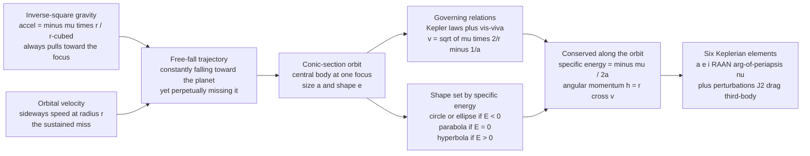

# 🛰️ Orbital Mechanics and Astrodynamics: Falling Forever Around a Planet

> [!abstract] TL;DR
> **Astrodynamics** is the engineering physics of spaceflight trajectories — how a spacecraft moves once gravity is the only force that matters. Its entire foundation is the **two-body problem**: a vehicle coasting under a single central body's **inverse-square gravity** ($\ddot{\mathbf r} = -\mu\,\mathbf r / r^3$) always traces a **conic section** — a **circle, ellipse, parabola, or hyperbola** — with the planet at one **focus**. Which conic you fly is fixed entirely by your **specific orbital energy** $\varepsilon = -\mu/2a$: bound (circle/ellipse) if $\varepsilon<0$, escape (parabola) at $\varepsilon=0$, hyperbolic flyby if $\varepsilon>0$. Along any orbit, **energy and angular momentum are conserved**, giving **Kepler's laws** (elliptical orbits, equal areas swept in equal times, $T^2 \propto a^3$) and the master speed relation, the **vis-viva equation** $v = \sqrt{\mu\left(\tfrac{2}{r} - \tfrac{1}{a}\right)}$. From vis-viva flow the two anchor speeds — **circular velocity** $v_c = \sqrt{\mu/r}$ and **escape velocity** $v_{esc} = \sqrt{2\mu/r}$ — and the counterintuitive **altitude–speed trade**: higher orbits are *slower*. A real orbit in 3D is pinned down by **six Keplerian elements** ($a, e, i, \Omega, \omega, \nu$) and sorted into families — **LEO, MEO, GEO, GTO, sun-synchronous, Molniya, polar**. Real orbits then slowly drift from the perfect Kepler ellipse because of **perturbations**: Earth's **oblateness ($J_2$)** precesses the orbit plane (exploited to build sun-synchronous orbits), **atmospheric drag** decays low orbits, and **third-body (Sun/Moon)** and **solar-radiation pressure** nudge the rest. This section-opener is the gateway to every maneuver that follows — ascent, transfers, rendezvous, interplanetary flight, attitude, and reentry — because all of them are just controlled edits to a conic-section orbit.

---

## Intuition

**Analogy:** Newton imagined standing on an impossibly tall mountain and firing a cannonball horizontally. Fire it gently and it arcs to the ground a mile away. Fire it harder and it lands farther — the curve of its fall stretched by its speed. Now fire it *hard enough* that as it falls, the ground **curves away beneath it exactly as fast as it drops**. The cannonball keeps falling toward Earth and keeps missing, all the way around the planet, and comes back to hit you in the back of the head. That ball is in **orbit**. An orbiting satellite is not "beyond gravity" or in some magic weightless zone — it is in **constant free-fall**, perpetually falling toward Earth and perpetually missing it because it is moving sideways fast enough.

That single picture — **falling forever** — unlocks the whole of spaceflight. From it flow Kepler's ellipses (fall a little too fast and your circle stretches into an egg), the **trade of altitude for speed** (climb higher and you move slower, dawdling around a bigger loop), and the strangest truth in the subject: **to catch up to a station just ahead of you in orbit, you must slow *down***. Slowing drops you into a lower, *faster*, shorter orbit; you race around, come back up, and arrive ahead of where you started. Speeding up does the opposite — it lifts you into a higher, *slower* orbit and you fall *behind*. This backwards logic of phasing is astrodynamics in a nutshell, and it all comes straight out of "the satellite is just falling."

---

## How It Works

### Core Mechanics

1. **One force, one equation.** Once a rocket stops burning and coasts, essentially only gravity acts. Model the planet as a point mass $M$ (gravitational parameter $\mu = GM$) and the spacecraft as a test mass, and Newton's law of gravitation plus his second law give the **two-body equation of motion**: $\ddot{\mathbf r} = -\mu\,\mathbf r / r^3$. The acceleration always points *back toward the focus* and weakens as $1/r^2$. Everything else in this note is the solution to that one vector differential equation.

2. **The orbit is a conic section.** Solving that equation shows the path is always a **conic** — circle, ellipse, parabola, or hyperbola — with the central body at one **focus** (this is Kepler's first law, now *derived* rather than observed). The orbit's size is its **semi-major axis** $a$ and its shape is its **eccentricity** $e$: $e=0$ is a circle, $0<e<1$ an ellipse, $e=1$ a parabola, $e>1$ a hyperbola.

3. **Energy decides the shape.** The **specific orbital energy** (energy per unit mass) is conserved: $\varepsilon = \tfrac{v^2}{2} - \tfrac{\mu}{r} = -\tfrac{\mu}{2a}$. Its *sign* is destiny — $\varepsilon<0$ (negative, bound) gives a circle or ellipse; $\varepsilon=0$ gives a parabola (the exact escape trajectory); $\varepsilon>0$ (positive, unbound) gives a hyperbola that flies past the planet and never returns. **Specific angular momentum** $\mathbf h = \mathbf r \times \mathbf v$ is also conserved, which fixes the orbit plane and, through $|\mathbf h| = $ constant, forces the spacecraft to **speed up near periapsis and slow near apoapsis** — Kepler's equal-area second law.

4. **Vis-viva ties speed to place.** Combining conserved energy with $\varepsilon=-\mu/2a$ gives the single most-used equation in the field, the **vis-viva** ("living force") equation: $v = \sqrt{\mu\left(\tfrac{2}{r} - \tfrac{1}{a}\right)}$. Know where you are ($r$) and the size of your orbit ($a$) and you know exactly how fast you are going. Two special cases fall straight out: set $r=a$ (a circle) to get **circular velocity** $v_c = \sqrt{\mu/r}$, and let $a\to\infty$ (a parabola) to get **escape velocity** $v_{esc} = \sqrt{2\mu/r} = \sqrt2\,v_c$. Because $v_c$ shrinks as $r$ grows, **higher orbits are slower** — the altitude–speed trade made quantitative.

5. **Six numbers name any orbit.** In 3D, an orbit is fully specified by **six Keplerian orbital elements**: **semi-major axis** $a$ (size), **eccentricity** $e$ (shape), **inclination** $i$ (tilt of the plane to the equator), **right ascension of the ascending node** $\Omega$ / RAAN (swivel of the plane), **argument of periapsis** $\omega$ (orientation of the ellipse within the plane), and **true anomaly** $\nu$ (where the spacecraft is right now). Five describe the fixed ellipse in space; one is a clock. These sort orbits into families — **LEO** (low Earth), **MEO** (e.g. GPS at ~20 200 km), **GEO** (geostationary at 35 786 km), **GTO** (the elliptical transfer to GEO), **sun-synchronous**, **Molniya** (highly elliptical, high-latitude dwell), and **polar**.

6. **Real orbits drift — perturbations.** The clean Kepler ellipse assumes a lone point-mass planet. Reality adds small forces that make the elements slowly change: Earth's **equatorial bulge ($J_2$ oblateness)** torques the orbit, causing **nodal regression** (the plane's $\Omega$ precesses) and **apsidal precession** ($\omega$ rotates) — deliberately tuned to make **sun-synchronous** orbits whose plane rotates ~1°/day to keep a constant Sun angle; **atmospheric drag** saps energy and **decays** low orbits until they reenter; **third-body** pull from the **Moon and Sun** and **solar-radiation pressure** perturb higher orbits. Add **time systems** (ECI vs ECEF frames, sidereal time), **ground tracks**, and, when a second large body matters, the **restricted three-body problem** and its five **Lagrange points** — a preview of interplanetary work.

### Flow / Architecture



---

## Key Concepts

### Secondary Level

- **An orbit is just falling forever.** A satellite is not "in zero gravity" and not "beyond Earth's pull." Gravity is fully in charge — the satellite is falling toward Earth all the time, but it is moving sideways so fast that the ground curves away beneath it and it keeps missing. That is Newton's cannonball come true.
- **Higher means slower.** The higher your orbit, the *more* slowly you go around. The International Space Station (low) laps the Earth every ~90 minutes; a GPS satellite (much higher) takes 12 hours; a TV satellite (higher still) takes a full day so it hangs over one spot.
- **Escape velocity.** Throw something sideways fast enough and instead of looping back it leaves for good. From Earth's surface that speed is about **11.2 km/s** — the finish line every interplanetary mission must cross.
- **The backwards catch-up rule.** To catch a spacecraft flying just ahead of you in the same orbit, you must **slow down**, not speed up. Slowing drops you into a lower, faster lane; you sprint around and come back up ahead. Speeding up lifts you into a higher, slower lane and you fall behind. Orbital chasing is upside-down.
- **Orbits are ovals.** Most orbits are not perfect circles but **ellipses** — stretched loops with the planet sitting off-center at a focus. A satellite speeds up as it swoops close and slows as it swings far out.

### Undergraduate Level

- **Two-body equation.** $\ddot{\mathbf r} = -\mu\,\mathbf r/r^3$ with $\mu = GM$ ($\mu_\oplus \approx 398\,600\ \text{km}^3/\text{s}^2$). Its closed-form solution is the **orbit equation** $r = \dfrac{p}{1 + e\cos\nu}$, a conic with semi-latus rectum $p = a(1-e^2) = h^2/\mu$.
- **Conserved quantities.** Specific energy $\varepsilon = \dfrac{v^2}{2} - \dfrac{\mu}{r} = -\dfrac{\mu}{2a}$ and specific angular momentum $h = |\mathbf r \times \mathbf v| = \sqrt{\mu a(1-e^2)}$. The sign of $\varepsilon$ picks the conic; $h$ pins the plane and enforces equal areas ($dA/dt = h/2$ = constant, Kepler's 2nd law).
- **Vis-viva and the anchor speeds.** $v = \sqrt{\mu\left(\dfrac{2}{r} - \dfrac{1}{a}\right)}$. Circular: $v_c = \sqrt{\mu/r}$. Escape (parabolic): $v_{esc} = \sqrt{2\mu/r} = \sqrt2\,v_c$. Periapsis/apoapsis speeds follow by evaluating at $r_p = a(1-e)$ and $r_a = a(1+e)$.
- **Kepler's third law.** For a bound orbit the period is $T = 2\pi\sqrt{a^3/\mu}$, so $T^2 \propto a^3$ — it depends **only on the semi-major axis**, not on eccentricity. GEO altitude is simply the $a$ for which $T$ equals one sidereal day.
- **The six Keplerian elements.** $a$ (size), $e$ (shape), $i$ (inclination), $\Omega$ (RAAN), $\omega$ (argument of periapsis), $\nu$ (true anomaly). Convert between the **state vector** $(\mathbf r, \mathbf v)$ and elements to move between "where/how-fast" and "which orbit." **Kepler's equation** $M = E - e\sin E$ (with mean anomaly $M = \sqrt{\mu/a^3}\,t$) propagates position in time and is solved iteratively.
- **Orbit families.** LEO (~160–2000 km), MEO (GNSS ~20 200 km, 12 h), GEO (35 786 km, 24 h, $i\approx0$), GTO (perigee in LEO, apogee at GEO), sun-synchronous (~600–800 km, $i\approx98°$), Molniya ($e\approx0.7$, $i=63.4°$ critical inclination), polar ($i\approx90°$).

### Graduate Level

- **Perturbed motion and the variation of parameters.** Real dynamics are $\ddot{\mathbf r} = -\mu\mathbf r/r^3 + \mathbf a_p$. The **Lagrange/Gauss planetary equations** turn the disturbing acceleration $\mathbf a_p$ into rates of change of the orbital elements, separating **secular** (steadily accumulating) from **periodic** effects.
- **$J_2$ oblateness.** The dominant Earth perturbation. Secular nodal regression $\dot\Omega = -\tfrac{3}{2}nJ_2\left(\tfrac{R_\oplus}{p}\right)^2\cos i$ and apsidal precession $\dot\omega = \tfrac{3}{4}nJ_2\left(\tfrac{R_\oplus}{p}\right)^2(5\cos^2 i - 1)$. Setting $\dot\Omega \approx +0.9856°/\text{day}$ yields the **sun-synchronous** condition; $\dot\omega=0$ at the **critical inclination** $i=63.4°$ underlies **Molniya/Tundra** orbits and **frozen orbits**.
- **Drag, third-body, and SRP.** Atmospheric drag $\mathbf a_D = -\tfrac12\rho\,(C_D A/m)\,v\,\mathbf v_{rel}$ removes energy and circularizes-then-decays LEO (life dominated by ballistic coefficient and solar activity). Luni-solar third-body gravity and **solar-radiation pressure** dominate the element drift of GEO and HEO satellites, driving inclination growth (~0.85°/yr for GEO) that station-keeping must cancel.
- **The restricted three-body problem.** No closed-form solution; the **Jacobi constant** and **zero-velocity curves** bound the motion. Five **Lagrange points** ($L_1$–$L_5$; $L_1$/$L_2$/$L_3$ collinear-unstable, $L_4$/$L_5$ triangular-stable) host missions (JWST at Sun–Earth $L_2$) and seed **low-energy transfers** via invariant manifolds.
- **Orbit determination and targeting.** **Lambert's problem** (find the orbit through two position vectors in a given time-of-flight) underlies transfer and rendezvous targeting; **Gauss/Gibbs** methods and least-squares batch/Kalman filters recover the state from tracking. **Patched conics** stitch two-body arcs across sphere-of-influence boundaries for interplanetary design.
- **Frames and time.** ECI (J2000/ICRF, inertial) versus ECEF (Earth-fixed, for ground tracks), linked by **sidereal time** (GMST); precession, nutation, polar motion, and the leap-second-laden UTC/TAI/TT/UT1 stack all enter high-precision propagation.

---

## Python Demo

```python
# Orbital mechanics from the two-body problem, numpy + matplotlib only.
#
#   (a) ORBIT SHAPES & KEPLER
#       Numerically integrate the two-body equation  a = -mu * r / |r|^3  (RK4)
#       for several LAUNCH SPEEDS from the same point, and plot the resulting
#       orbits: circular, elliptical, the parabolic escape, and a hyperbolic
#       flyby. Then verify Kepler on the ellipse: specific angular momentum
#       h = x*vy - y*vx stays CONSTANT (equal areas, 2nd law), and the numeric
#       period matches T = 2*pi*sqrt(a^3/mu) (3rd law).
#
#   (b) VIS-VIVA & THE ALTITUDE-SPEED TRADE
#       Plot orbital speed vs radius from vis-viva  v = sqrt(mu*(2/r - 1/a))
#       for several orbits, plus the circular curve v_c = sqrt(mu/r) and the
#       escape curve v_esc = sqrt(2*mu/r). Circular speed FALLS as radius grows
#       -> higher orbits are slower.
import numpy as np
import matplotlib.pyplot as plt

mu = 398600.4418           # Earth gravitational parameter GM [km^3/s^2]
Re = 6378.0                # Earth mean equatorial radius [km]

# ------------------------------------------------------------------ #
# (a) integrate the two-body equation for several launch speeds
# ------------------------------------------------------------------ #
r0 = 7000.0                       # start radius on the +x axis [km]  (perigee)
vc0 = np.sqrt(mu / r0)            # circular speed at r0
vesc0 = np.sqrt(2.0) * vc0        # escape speed at r0

# launch speed as a multiple of the local circular speed; velocity is +y
cases = [
    ("circular   v = 1.00 v_c", 1.00,          "#1f77b4"),
    ("ellipse    v = 1.25 v_c", 1.25,          "#2ca02c"),
    ("parabola   v = v_esc",    np.sqrt(2.0),   "#ff7f0e"),
    ("hyperbola  v = 1.60 v_c", 1.60,          "#d62728"),
]

def rhs(s):
    """State s = [x, y, vx, vy] -> derivative under inverse-square gravity."""
    x, y, vx, vy = s
    r = np.hypot(x, y)
    ax, ay = -mu * x / r**3, -mu * y / r**3
    return np.array([vx, vy, ax, ay])

def rk4_step(s, dt):
    k1 = rhs(s)
    k2 = rhs(s + 0.5 * dt * k1)
    k3 = rhs(s + 0.5 * dt * k2)
    k4 = rhs(s + dt * k3)
    return s + (dt / 6.0) * (k1 + 2 * k2 + 2 * k3 + k4)

# integrate for ~1.3 periods of the reference ellipse (the 1.25 v_c case)
v_ref = 1.25 * vc0
a_ref = 1.0 / (2.0 / r0 - v_ref**2 / mu)          # from vis-viva
T_ref = 2 * np.pi * np.sqrt(a_ref**3 / mu)         # Kepler's 3rd law
dt, n_steps = 2.0, int(1.3 * T_ref / 2.0)

fig, (axL, axR) = plt.subplots(1, 2, figsize=(14, 6))
fig.suptitle("Orbital Mechanics: conic-section orbits and the vis-viva speed law",
             fontsize=13, fontweight="bold")

# draw the Earth
th = np.linspace(0, 2 * np.pi, 240)
axL.fill(Re * np.cos(th), Re * np.sin(th), color="#4a7ebb", alpha=0.55, zorder=1)

for label, fac, col in cases:
    s = np.array([r0, 0.0, 0.0, fac * vc0])
    xs, ys = [s[0]], [s[1]]
    for _ in range(n_steps):
        s = rk4_step(s, dt)
        if np.hypot(s[0], s[1]) > 1.3e5:           # stop drawing escape arcs off-plot
            break
        xs.append(s[0]); ys.append(s[1])
    axL.plot(xs, ys, color=col, lw=2.0, label=label, zorder=2)

axL.plot(r0, 0.0, "k.", ms=9, zorder=3)
axL.text(r0 + 1500, -1500, "start (focus at origin)", fontsize=8)
axL.set_aspect("equal")
axL.set_xlim(-6e4, 4e4); axL.set_ylim(-4e4, 4e4)
axL.set_xlabel("x  [km]"); axL.set_ylabel("y  [km]")
axL.set_title("(a) Same launch point, four speeds -> four conics")
axL.legend(loc="upper left", fontsize=8)
axL.grid(alpha=0.25)

# ---- verify Kepler on the reference ellipse ----
s = np.array([r0, 0.0, 0.0, v_ref])
h_series, t_close, prev_y = [], None, 0.0
n_period = int(1.05 * T_ref / dt)
for k in range(n_period):
    x, y, vx, vy = s
    h_series.append(x * vy - y * vx)               # specific angular momentum
    s = rk4_step(s, dt)
    # detect one full loop: y crosses zero from below back to at/above start
    if k > 10 and prev_y < 0.0 <= s[1] and s[0] > 0:
        t_close = (k + 1) * dt
    prev_y = s[1]
h_series = np.array(h_series)

print("=== (a) Two-body orbit from a = -mu*r/|r|^3 ===")
print(f"  circular speed at r0={r0:.0f} km : v_c   = {vc0:6.3f} km/s")
print(f"  escape   speed at r0            : v_esc = {vesc0:6.3f} km/s  (= sqrt(2)*v_c)")
print(f"  reference ellipse (1.25 v_c)    : a = {a_ref:8.1f} km,  e = {1 - r0/a_ref:5.3f}")
print("=== Kepler check on that ellipse ===")
print(f"  3rd law  T = 2*pi*sqrt(a^3/mu)  : {T_ref:8.1f} s   ({T_ref/60:5.1f} min)")
if t_close:
    print(f"  numeric period (return to start): {t_close:8.1f} s   ({t_close/60:5.1f} min)")
print(f"  2nd law  h = x*vy - y*vx        : min {h_series.min():.1f}, "
      f"max {h_series.max():.1f} km^2/s  -> constant (equal areas)")

# ------------------------------------------------------------------ #
# (b) vis-viva: speed vs radius for several orbits
# ------------------------------------------------------------------ #
r = np.linspace(Re + 150, 6.0e4, 600)
v_circ = np.sqrt(mu / r)                            # circular:  a = r
v_escp = np.sqrt(2.0 * mu / r)                      # parabolic: a -> infinity

axR.plot(r, v_circ, "b--", lw=2.0, label="circular  v_c = sqrt(mu/r)")
axR.plot(r, v_escp, "r--", lw=2.0, label="escape  v_esc = sqrt(2 mu/r)")

for a_km, col in [(8000.0, "#2ca02c"), (15000.0, "#9467bd"), (30000.0, "#8c564b")]:
    rr = r[r < 2.0 * a_km]                          # ellipse exists only for r < 2a
    v = np.sqrt(mu * (2.0 / rr - 1.0 / a_km))
    axR.plot(rr, v, color=col, lw=1.8, label=f"ellipse a = {a_km:.0f} km")

# mark circular & escape speed at the LEO start radius
axR.scatter([r0, r0], [vc0, vesc0], color="k", zorder=5)
axR.annotate("circular @ LEO", xy=(r0, vc0), xytext=(1.4e4, 8.6),
             fontsize=8, arrowprops=dict(arrowstyle="->"))
axR.annotate("escape @ LEO", xy=(r0, vesc0), xytext=(1.6e4, 10.8),
             fontsize=8, arrowprops=dict(arrowstyle="->"))
# GEO circular speed illustrating "higher is slower"
r_geo = 42164.0
axR.scatter([r_geo], [np.sqrt(mu / r_geo)], color="k", zorder=5)
axR.annotate("circular @ GEO\n(higher -> slower)", xy=(r_geo, np.sqrt(mu / r_geo)),
             xytext=(3.0e4, 5.4), fontsize=8, arrowprops=dict(arrowstyle="->"))
axR.set_xlabel("orbital radius  r  [km]")
axR.set_ylabel("speed  v  [km/s]")
axR.set_title("(b) vis-viva  v = sqrt(mu*(2/r - 1/a))")
axR.legend(loc="upper right", fontsize=8)
axR.grid(alpha=0.25)

plt.tight_layout(rect=[0, 0, 1, 0.95])
plt.show()
```

Running this prints the numbers and draws two panels. The **left panel** integrates the raw two-body equation from a single point at four launch speeds and reproduces the whole conic family: at exactly circular speed the orbit is a clean circle; 25% faster it stretches into an **ellipse** (the start point becomes perigee, the far side apogee); at $\sqrt2\,v_c$ it is the **parabolic** escape trajectory that just barely leaves; and 60% over circular it is a **hyperbola** that whips past the planet and flies off, never to return. The printout confirms **Kepler** on the ellipse: the numerically detected period matches $T = 2\pi\sqrt{a^3/\mu}$ to within a step (3rd law), and the specific angular momentum $h = xv_y - yv_x$ holds constant to many digits around the loop (equal areas, 2nd law) even though the speed itself swings widely between perigee and apogee. The **right panel** plots **vis-viva**: each ellipse's speed curve runs from a fast perigee down to $v=0$ at apogee ($r=2a$), the circular curve $v_c=\sqrt{\mu/r}$ **falls** monotonically with radius, and the escape curve sits a factor $\sqrt2$ above it. The marked points make the **altitude–speed trade** concrete — circular speed at LEO is ~7.5 km/s but only ~3.1 km/s at GEO: to live higher, you must go slower.

---

## Real-World Applications

> **Example — GNSS constellations (GPS, Galileo, BeiDou) live in MEO.** GPS satellites orbit at ~20 200 km altitude in ~55° inclined planes with a **12-hour period** — a semi-major axis chosen straight from Kepler's third law so the ground track repeats twice per day. The six orbital planes and their phasing (set by RAAN $\Omega$ and mean anomaly) are engineered so that at least four satellites are always visible from anywhere on Earth, which is the whole point: your receiver trilaterates position from their precisely propagated ephemerides. Keeping those ephemerides accurate is pure astrodynamics — modeling $J_2$, luni-solar third-body pull, and relativity down to nanoseconds.

> **Example — geostationary comsats and the tyranny of station-keeping.** A TV or weather satellite at **GEO** sits at $a = 42\,164$ km so its period equals one sidereal day and it hangs motionless over a fixed longitude. But the perfect-Kepler picture never holds: luni-solar gravity pumps the inclination up by ~0.85°/year (north–south drift) and Earth's slightly triaxial equator pulls it toward stable longitude points (east–west drift). Operators burn propellant for **station-keeping** to cancel both, and the propellant budget for north–south correction is the single biggest driver of a GEO satellite's operational lifetime — a direct, expensive consequence of orbital perturbations.

> **Example — Starlink, drag, and the phasing paradox.** LEO megaconstellations exploit two astrodynamics facts. First, **atmospheric drag** at ~550 km is a feature, not just a bug: failed satellites decay and reenter within years rather than littering orbit for centuries. Second, deploying a whole shell means walking satellites into evenly spaced slots — done by the counterintuitive phasing rule, raising or lowering a satellite slightly so its *period* changes and it drifts, in the along-track direction, to its assigned slot before circularizing. The same slow-down-to-catch-up logic governs the **rendezvous and docking** of every Dragon or Soyuz with the ISS.

> **Example — sun-synchronous Earth observation.** Landsat, Sentinel, and most imaging and weather satellites fly **sun-synchronous** orbits (~700 km, $i\approx98°$, slightly retrograde) whose orbital plane is deliberately tuned so $J_2$-driven nodal regression precesses it ~0.9856°/day — exactly one revolution per year — keeping the local solar time of each pass constant. Consistent lighting for imagery is thus a perturbation (Earth's oblateness) turned from nuisance into design tool.

---

## Common Pitfalls

- **"Astronauts float because there's no gravity up there."** Gravity at ISS altitude is ~90% of surface gravity — the station and everyone in it are in **free-fall together**, which is why they float. Orbit is sustained falling, not the absence of gravity. This misconception poisons every downstream intuition; fix it first.
- **Speeding up to catch a target ahead.** Firing prograde raises your orbit, *lengthens* your period, and makes you fall **behind**. To close on a target ahead in the same orbit you must slow down into a lower, faster orbit and let the geometry bring you up ahead. Rendezvous planning that ignores this "phasing paradox" points the burns the wrong way.
- **Assuming a Kepler orbit stays fixed forever.** The unperturbed two-body ellipse is an idealization. Ignoring **$J_2$** (which precesses $\Omega$ and $\omega$ by degrees per day) or **drag** (which silently lowers LEO orbits until reentry) makes multi-day predictions and ground-track/coverage plans wrong. Always ask which perturbations dominate at your altitude.
- **Unit and $\mu$ slips.** $\mu_\oplus = 398\,600\ \text{km}^3/\text{s}^2$ in kilometers but $3.986\times10^{14}\ \text{m}^3/\text{s}^2$ in meters, and vis-viva/period are exquisitely sensitive to it. Mixing km and m, or using a body's radius where you meant its orbital radius, produces answers off by orders of magnitude. Keep one consistent unit system.
- **Sidereal vs solar day for GEO.** A geostationary orbit matches Earth's **sidereal** rotation (23 h 56 m 4 s), not the 24-hour solar day. Using 86 400 s instead of 86 164 s in Kepler's third law misplaces GEO altitude by tens of kilometers — enough to make a satellite slowly drift.
- **Forgetting how brutally expensive plane changes are.** Changing inclination costs $\Delta v = 2v\sin(\Delta i/2)$, and at LEO speeds even a modest tilt costs kilometers per second — often more than reaching orbit in the first place. This is why launch sites aim for the target inclination directly and why dogleg maneuvers are avoided.
- **Treating eccentricity as affecting the period.** Kepler's third law depends **only on $a$**: two orbits with the same semi-major axis but wildly different eccentricities share the same period. Students routinely and wrongly assume a stretched ellipse "takes longer" than a circle of the same $a$.

*(Sibling notes in this Astronautics section build directly on this opener: Orbital_Maneuvers_and_Transfers turns these conic orbits into Hohmann, bi-elliptic, and plane-change burns; Interplanetary_Trajectories_and_Gravity_Assists patches two-body arcs across planets and slingshots off them; Launch_Vehicles_and_Ascent_Trajectories covers getting onto the orbit in the first place; Spacecraft_Attitude_Dynamics_and_Control handles which way the vehicle points once it is there; and Rocket_Propulsion_Fundamentals supplies the delta-v that pays for every maneuver above.)*

---

## Related Concepts

**The celestial-mechanics companion — same physics, astronomy framing**
- [[Orbital_Mechanics_and_Celestial_Dynamics]] — the Astronomy-vault treatment of Kepler, the two-body problem, and vis-viva from the standpoint of *weighing the cosmos* (planets, binaries, resonances, tidal locking); this note is its engineering face — the same conic-section math turned toward launching, steering, and station-keeping real spacecraft

**Physics foundations — where the equation of motion comes from**
- [[Newtons_Laws_and_Kinematics]] — the second law plus universal gravitation are exactly what produce $\ddot{\mathbf r} = -\mu\mathbf r/r^3$; every orbit is that law integrated
- [[Work_Energy_and_Conservation]] — conservation of mechanical energy is the origin of specific orbital energy $\varepsilon=-\mu/2a$ and, through it, the vis-viva equation and the escape condition
- [[Rotational_Dynamics]] — conservation of angular momentum ($\mathbf h = \mathbf r\times\mathbf v$) fixes the orbit plane and *is* Kepler's equal-area second law

**Mathematical machinery**
- [[Conic_Sections]] — circles, ellipses, parabolas, and hyperbolas are the exact solution set of the two-body problem; their geometry (foci, eccentricity, semi-major axis) is the geometry of orbits
- [[Systems_of_ODEs]] — the two-body problem is a coupled system of first-order ODEs; the Python demo integrates it with RK4, the same numerical machinery used for high-fidelity orbit propagation

**Vault entry point**
- [[Aerospace_Engineering_Overview]] — the Aerospace vault's map; astronautics/orbital mechanics is the branch that begins once the atmosphere is left behind

---

## Review Questions

**Secondary**
1. Using Newton's cannonball, explain in your own words why a satellite in orbit is in constant free-fall rather than "beyond gravity," and why a *higher* orbit goes around *more slowly*. Then explain the backwards catch-up rule: why must a chasing spacecraft slow down to close on a target ahead of it in the same orbit?

**Undergraduate**
2. A spacecraft is at $r = 7000$ km moving at $v = 8.5$ km/s with the velocity perpendicular to the radius ($\mu_\oplus = 398\,600\ \text{km}^3/\text{s}^2$). (a) Compute the specific orbital energy $\varepsilon$ and the semi-major axis $a$; is the orbit bound? (b) Find the eccentricity and the apogee radius. (c) Use vis-viva to find the speed at apogee, and Kepler's third law to find the period. (d) Compare $v$ to the local circular and escape speeds and state what kind of conic this is.
3. Explain, using the six Keplerian elements, the difference between a geostationary orbit and a sun-synchronous orbit. Which element is being deliberately controlled in each case, and which perturbation is being either exploited or fought?

**Graduate**
4. Sun-synchronous design. (a) Starting from the secular $J_2$ nodal-regression rate $\dot\Omega = -\tfrac{3}{2}nJ_2\left(\tfrac{R_\oplus}{p}\right)^2\cos i$, explain why achieving $\dot\Omega \approx +0.9856°/\text{day}$ requires a *retrograde* inclination ($i>90°$). (b) Qualitatively, how do altitude and eccentricity trade against inclination to hold sun-synchronicity? (c) Contrast this with the **critical inclination** $i=63.4°$ used by Molniya orbits and explain what perturbation it neutralizes and why that matters for a highly eccentric, high-latitude dwell orbit. (d) Why does none of this appear in the pure two-body model, and what does that tell you about when the Keplerian idealization is and is not adequate for mission design?

---

## Sources

- H. D. Curtis — *Orbital Mechanics for Engineering Students*, 4th ed. (Butterworth-Heinemann, 2020) — the standard undergraduate astrodynamics text: two-body problem, orbital elements, maneuvers, and MATLAB/numerical methods
- D. A. Vallado — *Fundamentals of Astrodynamics and Applications*, 4th ed. (Microcosm/Springer, 2013) — the professional reference for propagation, perturbations, frames, time systems, and orbit determination
- R. R. Bate, D. D. Mueller & J. E. White — *Fundamentals of Astrodynamics* (Dover, 1971) — the classic, physically transparent introduction to the two-body problem and conic orbits
- J. E. Prussing & B. A. Conway — *Orbital Mechanics*, 2nd ed. (Oxford University Press, 2012) — concise, rigorous treatment of orbits, transfers, and optimal maneuvers
- NASA — *Basics of Space Flight* (JPL) — accessible reference on orbits, orbital elements, and mission trajectory design ([science.nasa.gov/learn/basics-of-space-flight](https://science.nasa.gov/learn/basics-of-space-flight/))

---

#aerospace-engineering #astrodynamics #orbital-mechanics #kepler #vis-viva
