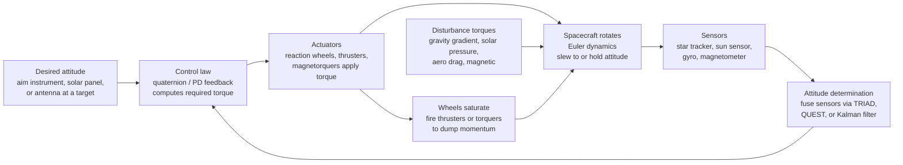

# 🛰️ Spacecraft Attitude Dynamics and Control

> [!abstract] TL;DR
> Knowing a spacecraft's **orbit** tells you *where* it is; **attitude dynamics and control (ADCS)** decides *which way it points* — and every mission function depends on it: aiming a telescope, pointing an antenna at Earth, keeping solar arrays square to the Sun, or lining up a thruster before a burn. Because there is nothing in space to push against, orientation is changed by **exchanging angular momentum internally** (spin a reaction wheel one way and the body counter-rotates, exactly like a figure skater) or by applying small **external torques** (thrusters, or magnetorquers reacting against Earth's field). The rotational motion obeys **Euler's equations** $I\dot{\boldsymbol{\omega}} + \boldsymbol{\omega}\times I\boldsymbol{\omega} = \boldsymbol{\tau}$, which hide a famous surprise: a torque-free body spins *stably* about its largest and smallest inertia axes but **tumbles chaotically about the intermediate axis** (the tennis-racket theorem / Dzhanibekov effect), and any energy dissipation eventually drives a free spinner into a flat spin about its **major** axis. Orientation is described singularity-free by **quaternions**, estimated by fusing **star trackers, sun sensors, gyros, and magnetometers** (TRIAD, QUEST, Kalman filtering), and driven to target by **quaternion/PD feedback**. The catch with momentum-exchange actuators is that persistent disturbance torques **saturate** the wheels, forcing periodic **momentum dumping** with thrusters or magnetorquers. ADCS ties rigid-body rotational dynamics to control engineering, and its failures — a gyro loss, a wheel seizure — routinely end otherwise-healthy missions.

---

## Intuition

**Analogy:** Sit on a frictionless spinning office chair, feet off the floor, holding a spinning bicycle wheel. There is nothing to push against — no floor, no wall — yet if you tilt or spin that wheel one way, *you* rotate the other way. That is the whole secret of pointing a spacecraft: with nothing external to shove, you turn yourself by **shoving your own angular momentum around inside**. Spin a heavy flywheel clockwise and the spacecraft body swings counter-clockwise; conservation of angular momentum does the rest. It is the same physics as the figure skater who pulls in her arms and speeds up, only used *backwards* — to steer.

Knowing where a spacecraft is (its orbit) is only half the story. A space telescope must aim at a galaxy billions of light-years away and hold **rock-steady** to a fraction of an arc-second while orbiting at eight kilometres per second; a solar panel must stay square to the Sun to make power; a dish must stare back at a single ground station. And in the eerie physics of spinning bodies there is a trap waiting: toss a phone or a tennis racket spinning about its *middle* axis and it will flip end-over-end chaotically, while spinning it about its long or short axis is perfectly steady. Attitude dynamics is full of such counterintuitive spin, and controlling it is one of the most unforgiving subsystems on any spacecraft.

---

## How It Works

### Core Mechanics

**1. Attitude is orientation, not position.** A spacecraft has six rigid-body degrees of freedom: three of **translation** (its orbit, *where* it is) and three of **rotation** (its attitude, *which way it points*). ADCS owns the rotational three. Orientation is a relationship between **reference frames**: an inertial frame fixed to the stars (Earth-centred inertial, ECI), a **body frame** bolted to the spacecraft, and often an **orbital / LVLH frame** (Local-Vertical Local-Horizontal) that tracks nadir and the velocity direction.

**2. Describing orientation.** Three parameterizations dominate. **Euler angles** (roll-pitch-yaw) are intuitive but suffer **gimbal lock** — a singularity where two axes align and one degree of freedom vanishes. **Direction cosine matrices (DCMs)** are $3\times3$ rotation matrices: exact and composable but nine redundant numbers with six constraints. **Quaternions** — four numbers $q=(q_0,\,\mathbf{q}_v)$ on the unit sphere — are the **singularity-free workhorse**: compact, numerically stable, and cheap to propagate, at the cost of a two-to-one "double cover" (both $q$ and $-q$ represent the same attitude).

**3. Rotational dynamics — Euler's equations.** In the body frame, Newton's rotational law for a rigid body is
$$I\dot{\boldsymbol{\omega}} + \boldsymbol{\omega}\times I\boldsymbol{\omega} = \boldsymbol{\tau},$$
where $I$ is the inertia tensor, $\boldsymbol{\omega}$ the body angular velocity, and $\boldsymbol{\tau}$ the applied torque. Along the **principal axes** this becomes the three scalar Euler equations, e.g. $I_1\dot\omega_1 = (I_2-I_3)\omega_2\omega_3 + \tau_1$. The gyroscopic cross term $\boldsymbol{\omega}\times I\boldsymbol{\omega}$ is what makes rotation so much richer than translation.

**4. The counterintuitive spin.** For a **torque-free** body ($\boldsymbol{\tau}=0$), linearizing about a pure spin shows rotation is **stable about the major (largest-inertia) and minor (smallest-inertia) axes**, but **unstable about the intermediate axis** — the **tennis-racket theorem**, dramatically visible as the **Dzhanibekov effect** where a spinning wing-nut periodically flips in orbit. Worse, real bodies flex and dissipate energy at constant angular momentum; energy is minimized (for fixed $L$) by spinning about the **major** axis, so any free spinner eventually decays into a **flat spin** about its axis of maximum inertia. Explorer 1 learned this the hard way in 1958.

**5. Disturbance torques.** Even in vacuum, tiny torques act **continually**: **gravity-gradient** (the far end of a long body is pulled slightly less, aligning it toward nadir, $\propto 1/r^3$), **solar radiation pressure** (photon momentum on asymmetric surfaces), **aerodynamic** drag (significant in LEO), and **magnetic** (a residual spacecraft dipole twisting in Earth's field). Each is minuscule, but integrated over an orbit they build up momentum the control system must continually shed.

**6. Actuators — how you apply torque.** **Reaction/momentum wheels** and **control-moment gyros (CMGs)** exchange angular momentum *internally* — no propellant — but they **saturate** once they hit max spin, requiring **momentum dumping** ("desaturation"). **Thrusters** apply fast external torque but burn propellant. **Magnetorquers** produce $\boldsymbol{\tau}=\mathbf{m}\times\mathbf{B}$ against Earth's field (LEO only, and never about the field line). **Passive** schemes — spin stabilization and gravity-gradient booms — need no power at all but give coarse control.

**7. Sensing and determination.** **Star trackers** recognize star patterns for arc-second absolute attitude; **sun** and **Earth/horizon** sensors give coarse references; **gyroscopes/IMUs** measure rate precisely but **drift**; **magnetometers** and **GPS** add cheap references. **Attitude determination** fuses these — algebraically via **TRIAD** or **QUEST** (Wahba's problem), or recursively via a **Kalman filter** that also estimates gyro bias.

**8. Control and modes.** A feedback law (commonly **quaternion / PD feedback**) computes the torque that drives the attitude error to zero, executing **slews** (reorienting) and **holds** (pointing) within accuracy and **jitter** budgets. Missions cycle through modes: **detumbling** (kill tip-off rates after separation, often a magnetorquer "B-dot" law), **sun-pointing safe mode** (guarantee power and thermal survival), and **science/nadir pointing** (the operational mode).

### Flow / Architecture



---

## Key Concepts

### Secondary Level

- **Orbit vs attitude.** Where the spacecraft *is* (its path around Earth) is a different question from which way it *points*. ADCS handles the pointing.
- **Nothing to push against.** In space there is no ground and no air. To turn, a spacecraft spins an internal flywheel and, because momentum is conserved, the body rotates the opposite way — exactly like the spinning figure skater, run in reverse to steer.
- **Star maps in the sky.** A **star tracker** photographs the stars and recognizes the pattern, telling the spacecraft its exact orientation — like finding your heading from the constellations. A **sun sensor** finds the Sun; a **gyroscope** senses turning.
- **The flipping-phone trick.** Toss a phone spinning about its middle axis and it tumbles and flips; spin it about its long or short axis and it stays steady. Spacecraft designers must respect this **tennis-racket** rule when they let a body spin.
- **Why it matters.** Telescopes must hold dead-still to take sharp pictures, dishes must aim at Earth to send data home, and panels must face the Sun to make power. Lose pointing control and the mission is over.

### Undergraduate Level

- **Reference frames and representations.** Inertial (ECI), body, and orbital/LVLH frames. Euler angles (intuitive, but **gimbal lock**), direction-cosine matrices (rotation matrices), and **quaternions** (four-parameter, singularity-free, the operational standard).
- **Euler's equations.** $I\dot{\boldsymbol{\omega}} + \boldsymbol{\omega}\times I\boldsymbol{\omega} = \boldsymbol{\tau}$; along principal axes $I_1\dot\omega_1=(I_2-I_3)\omega_2\omega_3+\tau_1$ and cyclic. The gyroscopic term couples the axes and produces **nutation**, **precession**, and **gyroscopic stiffness**.
- **Torque-free stability.** Stable spin about the **major** and **minor** principal axes; **unstable** about the **intermediate** axis (tennis-racket theorem). With energy dissipation at fixed angular momentum, the stable end-state is a **major-axis (flat) spin**.
- **Disturbance torques.** Gravity-gradient, solar radiation pressure, aerodynamic (LEO), and magnetic — small but **secular**, so the controller must continually reject them and shed the accumulated momentum.
- **Actuators.** Reaction/momentum wheels and CMGs (internal momentum exchange, no propellant, but **saturate**), thrusters (external, fast, propellant-limited), magnetorquers ($\mathbf{m}\times\mathbf{B}$, LEO, underactuated), and passive spin/gravity-gradient stabilization.
- **Sensors and determination.** Star trackers (arc-seconds), sun/Earth sensors (coarse), gyros/IMU (precise rate, drifts), magnetometers, GPS. Static estimators **TRIAD** and **QUEST** solve **Wahba's problem**; recursive **Kalman filtering** fuses rate and vector measurements and estimates gyro bias.
- **Control and modes.** Quaternion/PD feedback for slews and holds; pointing accuracy and jitter requirements. Operational modes: detumble, sun-pointing safe mode, nadir/science pointing.

### Graduate Level

- **Quaternion kinematics.** $\dot{q}=\tfrac12\,q\otimes\begin{bmatrix}0\\\boldsymbol{\omega}\end{bmatrix}$, with the **error quaternion** $\delta q = q_{\text{cmd}}^{-1}\otimes q$ driving feedback. Modified Rodrigues parameters (MRPs) trade a farther-out singularity for a minimal three-parameter set. The quaternion **double cover** ($q$ and $-q$) causes the **unwinding** phenomenon if the sign of $\delta q_0$ is ignored.
- **Poinsot geometry.** The torque-free motion is the polhode/herpolhode traced by the intersection of the **momentum ellipsoid** ($|L|$ const) and **energy ellipsoid** ($T$ const); the separatrix through the intermediate axis is exactly the unstable manifold. Linearization gives the intermediate-axis instability growth rate $\sim \Omega/\sqrt{I_{\min}I_{\max}}$.
- **Momentum management.** Total angular momentum $\mathbf{H}=I\boldsymbol{\omega}+\sum_i h_i\hat{\mathbf{a}}_i$; a **zero-momentum** system holds $\mathbf{H}\approx 0$ with wheels, a **momentum-bias** system parks a stiff spin along an axis for gyroscopic stability. Secular disturbance torque forces $|h_i|$ toward the wheel limit; **desaturation** (momentum dumping) applies an external torque via thrusters or magnetorquers to unload the wheels.
- **CMG steering and singularities.** Control-moment gyros give huge torque amplification but their Jacobian can hit **singular** gimbal configurations where commanded torque directions are unreachable; singularity-robust and null-motion steering laws avoid or escape them.
- **Nonlinear control.** Lyapunov-based quaternion feedback (e.g. $\boldsymbol{\tau}=-k\,\mathbf{q}_{v,\text{err}}-c\,\boldsymbol{\omega}$) yields almost-global asymptotic stability; care with the double cover prevents unwinding.
- **Estimation.** The **Multiplicative EKF (MEKF)** enforces the quaternion unit-norm constraint by estimating a small-angle error state, jointly estimating **gyro bias**; static solutions include Davenport's q-method, QUEST, and OLAE for Wahba's problem.
- **Flexible dynamics and jitter.** Solar arrays, booms, and slosh introduce lightly damped structural modes that couple with the control loop; unmodeled, they produce line-of-sight **jitter** that corrupts imaging (the classic Hubble solar-array thermal-snap disturbance).

---

## Python Demo

```python
# Spacecraft Attitude Dynamics and Control -- two experiments, four panels:
#
#  PART (a) TORQUE-FREE RIGID-BODY SPIN (Euler's equations):
#     I1*w1' = (I2 - I3) w2 w3,  and cyclic.  A tiny perturbation is added to
#     the two off-axes.  Spinning about the MINOR or MAJOR inertia axis stays
#     bounded (STABLE); spinning about the INTERMEDIATE axis blows up into
#     periodic end-over-end flips -- the tennis-racket / Dzhanibekov effect.
#
#  PART (b) SINGLE-AXIS REACTION-WHEEL SLEW:
#     A PD law slews the spacecraft 30 deg to a target.  Spinning the wheel
#     makes the body counter-rotate (momentum exchange).  A small constant
#     disturbance torque steadily loads the wheel; when its stored momentum
#     hits the saturation limit, thrusters "dump" it (desaturation) -- the
#     characteristic sawtooth momentum profile.
#
# Requires: numpy, matplotlib
import numpy as np
import matplotlib.pyplot as plt

# =====================================================================
# PART (a): torque-free spin -- Euler's equations, RK4 integration
# =====================================================================
I1, I2, I3 = 1.0, 2.0, 3.0     # principal inertias: minor, intermediate, major

def euler_deriv(w):
    w1, w2, w3 = w
    return np.array([(I2 - I3) * w2 * w3 / I1,
                     (I3 - I1) * w3 * w1 / I2,
                     (I1 - I2) * w1 * w2 / I3])

def integrate_euler(w0, t):
    dt = t[1] - t[0]
    W = np.zeros((len(t), 3)); W[0] = w0
    for k in range(len(t) - 1):
        w = W[k]
        k1 = euler_deriv(w)
        k2 = euler_deriv(w + 0.5 * dt * k1)
        k3 = euler_deriv(w + 0.5 * dt * k2)
        k4 = euler_deriv(w + dt * k3)
        W[k + 1] = w + (dt / 6.0) * (k1 + 2 * k2 + 2 * k3 + k4)
    return W

t = np.linspace(0, 40, 4000)
eps = 0.05                                     # tiny off-axis perturbation
w_minor = integrate_euler([4.0, eps, eps], t)  # spin about MINOR axis -> stable
w_inter = integrate_euler([eps, 4.0, eps], t)  # spin about INTERMEDIATE -> unstable
w_major = integrate_euler([eps, eps, 4.0], t)  # spin about MAJOR axis  -> stable

# growth rate of the intermediate-axis instability (linearized)
Omega = 4.0
growth = Omega / np.sqrt(I1 * I3)
print("=== Torque-free spin stability ===")
print(f"minor-axis  spin: |w| stays near {np.linalg.norm(w_minor[0]):.2f}"
      f"  (max wobble on off-axes = {np.abs(w_minor[:,1:]).max():.2f})  -> STABLE")
print(f"major-axis  spin: max wobble on off-axes = {np.abs(w_major[:,[0,1]]).max():.2f}"
      f"  -> STABLE")
print(f"intermediate spin: off-axis rates reach {np.abs(w_inter[:,[0,2]]).max():.2f}"
      f"  (growth rate ~ {growth:.2f} 1/s) -> UNSTABLE / flips")

# =====================================================================
# PART (b): single-axis reaction-wheel slew + saturation + desaturation
#   body:  J * theta'' = u + Td        (u = control torque on body)
#   wheel: h_wheel'    = -u            (Newton's third law reaction)
# =====================================================================
J        = 200.0                    # spacecraft inertia about slew axis [kg m^2]
Kp, Kd   = 8.0, 80.0                # PD gains (wn ~ 0.2 rad/s, critically damped)
tau_max  = 5.0                      # wheel torque limit [N m]
h_max    = 2.0                      # wheel momentum capacity [N m s] -> saturation
Td       = 0.02                     # constant disturbance torque [N m]
theta_tgt = np.deg2rad(30.0)        # target slew angle

dt = 0.02
tt = np.arange(0, 400, dt)
theta = np.zeros_like(tt)           # body attitude angle [rad]
omega = np.zeros_like(tt)           # body rate [rad/s]
h_w   = np.zeros_like(tt)           # reaction-wheel stored momentum [N m s]
desat = []                          # times of thruster desaturation events

for k in range(len(tt) - 1):
    e = theta_tgt - theta[k]
    u = np.clip(Kp * e - Kd * omega[k], -tau_max, tau_max)   # PD torque on body
    omega[k + 1] = omega[k] + dt * (u + Td) / J              # body dynamics
    theta[k + 1] = theta[k] + dt * omega[k]
    h_next = h_w[k] - u * dt                                 # wheel absorbs reaction
    if abs(h_next) >= h_max:                                 # wheel saturated ->
        desat.append(tt[k + 1])                              # fire thrusters to
        h_next = 0.0                                         # dump the momentum
    h_w[k + 1] = h_next

print("\n=== Reaction-wheel slew ===")
print(f"final attitude = {np.rad2deg(theta[-1]):.2f} deg (target 30 deg)")
print(f"settled residual rate = {np.rad2deg(omega[-1]):.4f} deg/s")
print(f"thruster desaturation events = {len(desat)} (wheel hit +/-{h_max} N m s)")

# =====================================================================
# PLOTS
# =====================================================================
fig, ax = plt.subplots(2, 2, figsize=(14, 10))
fig.suptitle("Spacecraft Attitude: Torque-Free Spin Stability & Reaction-Wheel Slew",
             fontsize=15, fontweight="bold")

# --- A. stable spin about the minor axis ---
axA = ax[0, 0]
for i, (lab, col) in enumerate(zip(["w1 (spin axis)", "w2", "w3"],
                                   ["#1f77b4", "#ff7f0e", "#2ca02c"])):
    axA.plot(t, w_minor[:, i], color=col, lw=1.8, label=lab)
axA.set_title("A. Torque-free spin about MINOR axis -> STABLE (bounded)")
axA.set_xlabel("time [s]"); axA.set_ylabel("angular velocity [rad/s]")
axA.legend(fontsize=8, loc="upper right"); axA.grid(alpha=0.3)

# --- B. unstable spin about the intermediate axis (Dzhanibekov) ---
axB = ax[0, 1]
for i, (lab, col) in enumerate(zip(["w1", "w2 (spin axis)", "w3"],
                                   ["#1f77b4", "#d62728", "#2ca02c"])):
    axB.plot(t, w_inter[:, i], color=col, lw=1.8, label=lab)
axB.set_title("B. Torque-free spin about INTERMEDIATE axis -> UNSTABLE (flips)")
axB.set_xlabel("time [s]"); axB.set_ylabel("angular velocity [rad/s]")
axB.legend(fontsize=8, loc="upper right"); axB.grid(alpha=0.3)

# --- C. reaction-wheel slew: attitude settles to target ---
axC = ax[1, 0]
axC.plot(tt, np.rad2deg(theta), color="#1f77b4", lw=2.2, label="spacecraft attitude")
axC.axhline(np.rad2deg(theta_tgt), ls="--", color="k", lw=1.3, label="target 30 deg")
axC.set_title("C. Reaction-wheel slew: PD feedback settles to target")
axC.set_xlabel("time [s]"); axC.set_ylabel("attitude angle [deg]")
axC.set_xlim(0, 120)
axC.legend(fontsize=8, loc="lower right"); axC.grid(alpha=0.3)

# --- D. wheel momentum ramps to saturation, thrusters desaturate ---
axD = ax[1, 1]
axD.plot(tt, h_w, color="#9467bd", lw=2.0, label="wheel momentum h_w")
axD.axhline(h_max, ls="--", color="#d62728", lw=1.3, label="saturation limit")
axD.axhline(-h_max, ls="--", color="#d62728", lw=1.3)
for j, td in enumerate(desat):
    axD.axvline(td, color="#7f7f7f", ls=":", lw=1.2,
                label="thruster desaturation" if j == 0 else None)
axD.set_title("D. Momentum builds up (disturbance) -> desaturation sawtooth")
axD.set_xlabel("time [s]"); axD.set_ylabel("stored momentum [N m s]")
axD.legend(fontsize=8, loc="upper left"); axD.grid(alpha=0.3)

plt.tight_layout(rect=[0, 0, 1, 0.95])
plt.show()
```

**What it shows.** Panels **A** and **B** are the same rigid body ($I_1{:}I_2{:}I_3 = 1{:}2{:}3$) given a tiny nudge off three different spin axes. About the **minor** axis (A) the off-axis rates stay a bounded ripple — **stable**; the **major**-axis case behaves identically. About the **intermediate** axis (B) that same nudge grows exponentially (rate $\Omega/\sqrt{I_1 I_3}\approx 2.3\ \mathrm{s^{-1}}$) and the spin axis $\omega_2$ periodically **flips sign** while $\omega_1,\omega_3$ spike — the tennis-racket / Dzhanibekov tumble, with no external torque at all. Panel **C** is a **reaction-wheel slew**: PD feedback torque spins the wheel, the body counter-rotates by momentum exchange, and the attitude settles cleanly onto the 30° target. Panel **D** is the price of momentum-exchange actuators: the constant disturbance torque steadily loads the wheel, and each time the stored momentum hits the $\pm 2\ \mathrm{N\,m\,s}$ **saturation** limit, thrusters fire to **dump** it — the sawtooth is the real-life reason every wheel-controlled spacecraft carries a momentum-management (desaturation) plan.

---

## Real-World Applications

> **Example — Hubble & JWST space telescopes.** Both point by **reaction wheels** and sense attitude with **star trackers**, **gyroscopes**, and ultra-precise **fine-guidance sensors**, holding line-of-sight to milli-arc-second stability for hours-long exposures — all *without firing thrusters near the optics*, which would contaminate mirrors and induce jitter. Wheel momentum accumulated from solar-radiation-pressure torque is dumped later. Hubble's story is also a cautionary tale in ADCS reliability: **gyroscope failures** repeatedly crippled its pointing and drove multiple servicing missions, and it has since flown in reduced-gyro modes — a reminder that attitude hardware is mission-critical.

- **International Space Station.** Uses four large **control-moment gyros** for routine, non-propulsive attitude control, periodically **desaturated** by Russian-segment thrusters — CMGs give the torque amplification a station-sized inertia needs while saving propellant.
- **Geostationary communications satellites.** Keep a narrow antenna beam locked on a fixed patch of Earth using **momentum-bias** wheels for gyroscopic stiffness plus thrusters for station-keeping; mispointing by a fraction of a degree drops the link.
- **CubeSats and smallsats.** Deploy tumbling from a dispenser, then run a **B-dot** magnetorquer law to **detumble**, and use miniature **reaction wheels** plus magnetorquers for pointing — a low-cost ADCS stack that put attitude control within reach of universities.
- **Explorer 1 (1958).** Designed to spin about its slender (minor) axis for stability, but flexible whip antennas **dissipated energy**, and — exactly as the major-axis rule predicts — it decayed into a flat spin about its transverse axis within hours: the historical lesson that only **major-axis** spin is passively stable.
- **Spin-stabilized probes and upper stages.** Pioneer, many kick stages, and countless small satellites use pure **spin stabilization** about the major axis — no active control, just gyroscopic stiffness holding the pointing direction inertially fixed.

---

## Common Pitfalls

- **Confusing orbit with attitude.** They are independent: a spacecraft in a perfect orbit can be tumbling uselessly. Position control and pointing control are different subsystems with different actuators and sensors.
- **Gimbal lock from Euler angles.** Chaining roll-pitch-yaw hits a singularity when two axes align, losing a degree of freedom and blowing up the kinematics. Propagate attitude with **quaternions** (or DCMs) and reserve Euler angles for human-readable display.
- **Spinning about the wrong axis.** Passive spin stabilization is only stable about the **major** (maximum-inertia) axis once energy dissipation is considered; letting a body spin about the intermediate axis guarantees tumbling, and spinning about the minor axis slowly decays into a **flat spin**.
- **Forgetting wheels saturate.** Reaction wheels absorb every bit of disturbance momentum until they hit max speed; with no **momentum-dumping** plan (thrusters or magnetorquers), a saturated wheel can no longer produce control torque and the spacecraft loses pointing.
- **Ignoring the quaternion double cover.** Because $q$ and $-q$ are the same attitude, a naive feedback law can take the "long way around" — the **unwinding** phenomenon, a needless 360° slew. Always steer along the shorter error by checking the sign of the scalar part.
- **Trusting gyros alone.** Gyroscopes measure *rate*; integrating them accumulates unbounded **drift**. Absolute references (star tracker, sun sensor) must periodically correct the estimate — this is exactly what the attitude Kalman filter does while also estimating the gyro bias.
- **Underactuated magnetorquers.** A magnetic torque rod can only produce torque **perpendicular** to the local field $\mathbf{B}$; it can never torque about the field line, so magnetorquer-only control is instantaneously underactuated and relies on the field changing along the orbit.
- **Neglecting flexible modes and jitter.** Treating a spacecraft as a perfectly rigid body ignores lightly damped solar arrays and booms whose vibration shows up as line-of-sight jitter that ruins high-resolution imaging.

---

## Related Concepts

- [[Rotational_Dynamics]] — Euler's equations, the inertia tensor, angular-momentum conservation, precession and nutation: the rigid-body physics that ADCS is built directly on top of.
- [[Newtons_Laws_and_Kinematics]] — the third-law reaction (spin a wheel one way, the body swings the other) and conservation of angular momentum are precisely what make momentum-exchange actuators possible.
- [[Feedback_Control_Fundamentals]] — attitude control is a closed feedback loop: estimate the pointing error, compute a corrective torque, actuate, and repeat.
- [[PID_Control]] — the quaternion / PD feedback laws that execute slews and hold pointing are attitude-space cousins of the classical PID controller.
- [[Kalman_Filtering_and_State_Estimation]] — attitude *determination* fuses noisy star-tracker, sun-sensor, and gyro data and estimates gyro bias through a (multiplicative) Kalman filter.
- [[Linear_Transformations]] — direction-cosine matrices are rotation transformations between the inertial and body frames, and quaternions are a compact, singularity-free parameterization of exactly those rotations.

Within its own *Astronautics and Orbital Mechanics* section, this note is the rotational counterpart to *Orbital_Mechanics_and_Astrodynamics* (which governs *where* the spacecraft goes, while ADCS governs *which way it points*); it is one subsystem inside *Spacecraft_Systems_Engineering* (with power, thermal, and structures competing for mass and pointing budget); it supplies the attitude half of *Guidance_Navigation_and_Control* (guidance sets the goal, navigation the state, and ADCS realizes the orientation); and it is the pointing backbone behind every payload described in *Satellites_and_Space_Missions*.

---

## Review Questions

1. **Secondary:** A friend says a spacecraft must "fire its engine sideways" every time it wants to turn and point its camera somewhere new. Explain why that is wasteful and often wrong, describe how a spinning flywheel lets the spacecraft turn *without* using any fuel, and say which everyday physics demo (hint: an ice skater or a spinning chair) captures the idea.
2. **Undergraduate:** A cube-shaped satellite has principal inertias $I_1 < I_2 < I_3$ and is set spinning about its intermediate axis $I_2$. (a) Using the torque-free Euler equations, show by linearization that this spin is unstable and find the growth rate. (b) Contrast this with spin about $I_1$ or $I_3$. (c) A separate satellite is spin-stabilized about its *minor* axis and flexes slightly as it spins; explain what final motion energy dissipation drives it toward and why, citing Explorer 1.
3. **Graduate:** Design and justify a reaction-wheel attitude-control architecture for an Earth-observation satellite in LEO that must point to $0.01^\circ$ during imaging. (a) Choose actuators and sensors and explain the role of each, including why you would not use thrusters for fine pointing. (b) Persistent gravity-gradient and solar-pressure torques accumulate wheel momentum; describe a momentum-management strategy and the trade-off between magnetorquer and thruster desaturation. (c) Explain how you would handle the quaternion double cover in the feedback law to avoid unwinding, and how a multiplicative EKF keeps the estimated quaternion a valid unit quaternion while estimating gyro bias.

---

## Sources

- B. Wie — *Space Vehicle Dynamics and Control*, 2nd ed. (AIAA, 2008) — comprehensive treatment of rigid-body attitude dynamics, quaternion feedback, and actuator/momentum management.
- M. J. Sidi — *Spacecraft Dynamics and Control: A Practical Engineering Approach* (Cambridge University Press, 1997) — systems-level ADCS design, sensors, actuators, and control modes.
- P. C. Hughes — *Spacecraft Attitude Dynamics* (Dover reprint, 2004) — the classic rigorous account of rotational dynamics, torque-free motion, and stability.
- F. L. Markley & J. L. Crassidis — *Fundamentals of Spacecraft Attitude Determination and Control* (Springer, 2014) — the definitive reference on attitude representations, Wahba's problem, QUEST, and the multiplicative EKF.
- J. R. Wertz (ed.) — *Spacecraft Attitude Determination and Control* (Kluwer/Springer, 1978) — the enduring engineering handbook for sensors, disturbance torques, and mission-mode design.

---

#aerospace-engineering #attitude-control #ADCS #reaction-wheels #quaternions
