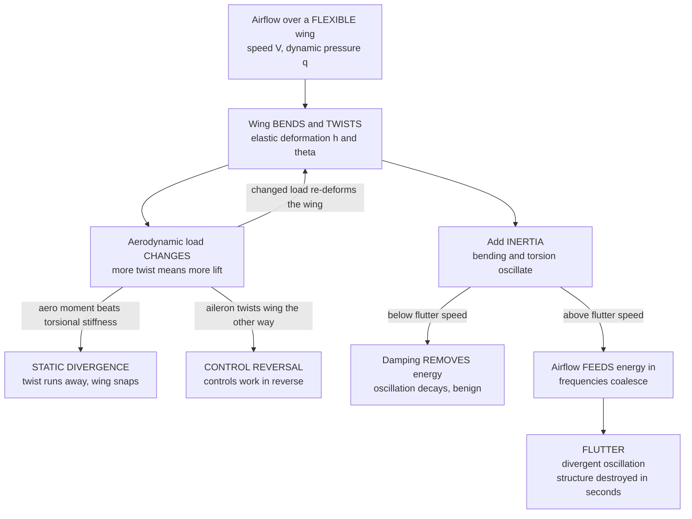

# 🪶 Aeroelasticity and Flutter

> [!abstract] TL;DR
> A wing is **not a rigid plank** — it **bends and twists**, and the very air it flies through pushes on it, so its deformation changes the aerodynamic load and the changed load changes the deformation again: a **feedback loop between structure and airflow**. That loop is **aeroelasticity**, and it lives at the intersection of three forces — **aerodynamic**, **elastic**, and **inertial** (Collar's triangle). With **no inertia** the phenomena are *static*: **divergence**, where a wing twists under load, the extra twist makes more lift, the lift makes more twist, and above the **divergence dynamic pressure** $q_{div}$ the aerodynamic moment beats the wing's torsional stiffness and the structure runs away and snaps; and **control reversal**, where at high speed deflecting an aileron twists the whole wing so hard that the wing's own lift change *overrides* the aileron and the controls work **backwards**. Add **inertia** and you get the *dynamic* killer, **flutter**: a **self-excited oscillation** in which two structural modes — classically **bending and torsion** (plunge and pitch) — couple through the air, their frequencies **coalesce**, and above the **flutter speed** $V_f$ the airstream feeds energy into the motion faster than damping can remove it. The oscillation **grows exponentially** and tears the wing off in **seconds** — the same runaway aeroelastic resonance that twisted apart the **Tacoma Narrows bridge** in a 1940 wind. Because $V_f$ is a hard cliff, **flutter clearance is mandatory for certification**, every aircraft carries a **never-exceed speed** $V_{NE}$ and a design dive speed safely below its flutter and divergence boundaries, and engineers push it back with **stiffness**, **mass balancing** (moving the section CG *ahead* of the elastic axis), and increasingly **active flutter suppression**. Aeroelasticity governs wings, tails, control surfaces, the modern trend to slender high-aspect-ratio composite wings with **aeroelastic tailoring**, jet-engine fan blades, wind-turbine blades, and long-span bridges — anywhere a flexible structure meets a moving fluid.

---

## Intuition

**Analogy:** A wing is **not a rigid plank** bolted to the fuselage — it is more like a long, springy **diving board** that also happens to be able to **twist** along its length. Now blow air across it. The moving air pushes the board, bending it up and twisting its nose; but the moment it twists, it meets the air at a new angle, so the air pushes **differently**, which bends and twists it again. Structure shapes the flow, the flow reshapes the structure: a **feedback loop**. Most of the time this loop is **benign** — the board flexes a little and settles, damping bleeding off any wobble like a plucked ruler going quiet. But there is a **critical wind speed** at which the loop turns **vicious**. The board's up-and-down **bending** and its nose-up-nose-down **twisting** fall into step with each other, phased so that the air does **positive work** on the motion every cycle — it *pumps* energy in instead of draining it out. The oscillation no longer decays; it **grows**, bigger each swing, and in a few seconds the board is thrashing so violently it **snaps**. That runaway is **flutter**.

You have already seen it. In November 1940 a gusting wind set the **Tacoma Narrows bridge** deck into exactly this kind of coupled bending-and-twisting oscillation; the wind fed the motion, the amplitude built and built, and the mile-long span **tore itself apart** on film. A wing at its flutter speed does the same thing, only faster and higher. This is why every aircraft has a strict **never-exceed speed** painted on the airspeed indicator, why test pilots creep up on the flutter boundary one careful knot at a time, and why aeroelasticity is the branch of aerospace engineering that keeps designers awake at night: it is where a structure and the air around it can quietly agree to destroy each other.

---

## How It Works

### Core Mechanics

**1. Collar's aeroelastic triangle — three forces in conversation.** Aeroelasticity is defined by the interaction of **three** force families, drawn since the 1940s as the vertices of **Collar's triangle**: **A** — *aerodynamic* forces (they depend on the deformed shape), **E** — *elastic* (structural stiffness) forces, and **I** — *inertial* forces. The **A-E edge** (aerodynamic + elastic, **no inertia**) is **static aeroelasticity**: **divergence** and **control reversal** and load redistribution. The **full A-E-I interior** (add inertia) is **dynamic aeroelasticity**: **flutter**, buffeting, gust response, and dynamic loads. The single organizing idea is that the aerodynamic load is not an external given — it is a **function of the very deformation it produces**, closing a feedback loop whose stability is the whole subject.

**2. Static divergence — the twist that runs away.** Consider a wing free to twist about its **elastic axis** (EA) against a torsional spring of stiffness $K_\theta$. A small nose-up twist $\theta$ raises lift, and because the aerodynamic centre (AC) sits **ahead** of the EA by an eccentricity $e$, that lift makes a **nose-up moment** $M = q\,S\,e\,a\,\theta$ about the EA (dynamic pressure $q=\tfrac12\rho V^2$, area $S$, lift slope $a$). Equilibrium requires the elastic restoring moment to balance it: $(K_\theta - q\,S\,e\,a)\,\theta = q\,S\,e\,a\,\theta_0$ for a built-in incidence $\theta_0$. Solving,
$$\theta \;=\; \theta_0\,\frac{q\,S\,e\,a}{K_\theta - q\,S\,e\,a}, \qquad \text{amplification} \;=\; \frac{1}{1 - q/q_{div}}.$$
As $q$ climbs toward the **divergence dynamic pressure**
$$q_{div} \;=\; \frac{K_\theta}{S\,e\,a},$$
the denominator goes to zero and the twist **blows up** — the aerodynamic moment has beaten the torsional stiffness, and the wing twists itself apart. Divergence is a **static instability**: no oscillation, just monotone runaway. It sets an absolute upper speed for a given stiffness and is why torsional rigidity is precious.

**3. Control reversal — when the ailerons work backwards.** Deflect an aileron down and it locally adds lift *behind* the EA, which twists the wing **nose-down**; that twist *removes* lift from the whole outer wing. At low speed the aileron wins and the aircraft rolls the expected way. But twist grows with $q$, and at the **reversal speed** the wing's lost lift **exactly cancels** the aileron's added lift — the roll authority hits **zero**. Above it, the controls are **reversed**: pushing the stick to roll right rolls the aircraft **left**. Reversal is the same static A-E feedback as divergence, now degrading a **control surface** instead of the wing itself, and it was a lethal surprise on several early high-speed aircraft.

**4. Flutter — the self-excited, dynamic killer.** Give the wing **mass** and it can *oscillate*: a **bending** (plunge, $h$) mode and a **torsion** (pitch, $\theta$) mode, each with its own natural frequency. Flutter is a **coupled** instability of the two. The wing's motion generates **unsteady** aerodynamic forces that are **out of phase** with the displacement (they lag it), so over a cycle the air can do **net positive work** on the structure. Below a critical speed, structural and aerodynamic **damping** dissipate that energy and any disturbance decays. Above the **flutter speed** $V_f$, the energy fed in exceeds the energy removed, the net damping goes **negative**, and the oscillation **grows exponentially** — a **self-excited** vibration with no external forcing, powered entirely by the steady airstream. The classic signature is **frequency coalescence**: as speed rises the bending and torsion frequencies **drift toward one another and merge**, and it is at (or just before) that merging that the damping of one branch crosses zero. Once unstable, the wing can be destroyed in **one or two seconds**.

**5. Why phase and coupling matter.** Flutter needs (i) at least **two** modes that can exchange energy and (ii) an aerodynamic force that **lags** the motion. Torsion changes the angle of attack (and thus the lift) directly; bending moves the section up and down, which the lagged lift then feeds. If the lift were perfectly *in phase* with displacement it could only act like a spring (shifting frequency, no energy transfer); the **time lag** of unsteady aerodynamics is what lets it act like a **negative damper**. This is why a purely static, quasi-steady picture *underpredicts* the danger and true flutter analysis needs **unsteady aerodynamics**.

**6. Unsteady aerodynamics — Theodorsen and reduced frequency.** For a harmonically oscillating airfoil, **Theodorsen's** (1935) solution gives the lift and moment in terms of the complex **Theodorsen function** $C(k) = F(k) + iG(k)$, a function of the **reduced frequency**
$$k \;=\; \frac{\omega b}{V},$$
($b$ = semichord). $C(k)$ encodes the **amplitude reduction and phase lag** of the circulatory lift relative to the instantaneous angle of attack; as $k\to 0$ (slow oscillation) $C\to 1$ and the flow is quasi-steady, while at finite $k$ the lag appears. Modern analysis uses **indicial/Wagner** functions, **doublet-lattice** panel methods, or CFD, but the reduced frequency $k$ remains the master parameter of any flutter calculation.

**7. Analysis and clearance — V-g and p-k methods.** Flutter is found by assembling the structural **modes** (from a finite-element model), the **unsteady aerodynamic** forces (as functions of $k$ and Mach), and a **mass** matrix, then solving a complex eigenvalue problem as airspeed sweeps upward. The **V-g method** plots each mode's required structural **damping** $g$ versus velocity — the **flutter speed is where a curve crosses $g=0$**; the **p-k method** iterates the complex eigenvalue $p=\sigma\pm i\omega$ and reads flutter as $\sigma$ crossing zero. Certification (FAR/CS 25.629) demands the aircraft be **flutter-free to at least 1.15$\times$ dive speed** across the whole envelope, verified by analysis, **wind-tunnel** models, ground vibration tests, and cautious **flight flutter testing**.

**8. The wider dynamic family — LCO, buffeting, gusts.** Linear theory gives a clean $V_f$, but **nonlinearity** (control-surface **freeplay**, aerodynamic separation, geometric stiffening) often turns the exponential growth into a bounded **limit-cycle oscillation (LCO)** — a persistent, finite-amplitude vibration that fatigues structure rather than instantly destroying it. **Buffeting** is the forced (not self-excited) response to **separated or turbulent** flow — a stalled wing, a wake striking the tail. **Gust response** is the transient aeroelastic reaction to atmospheric turbulence. All three share the fluid-structure coupling but differ in their energy source.

**9. Prevention — stiffness, mass balance, limits, active control.** Four levers push the boundaries out. **Stiffness** raises both $q_{div}$ and $V_f$ (torsional stiffness especially). **Mass balancing** moves the section **centre of gravity forward of the elastic axis** — decoupling the bending and torsion inertially so they cannot lock together; control surfaces carry **balance weights** ahead of their hinge line for exactly this reason. **Speed limits** ($V_{NE}$, $V_D$) keep the aircraft below the boundary with margin. And **active flutter suppression** uses sensors and fast control-surface actuation to add artificial damping, letting engineers fly *past* the passive flutter speed — a key enabler of light, flexible wings.

### Flow / Architecture



---

## Key Concepts

### Secondary Level

- **A wing is springy, not stiff.** It bends up and down and twists along its length. The air pushing on it changes how it bends, and how it bends changes how the air pushes — a back-and-forth loop between the wing and the wind.
- **Usually harmless, sometimes deadly.** At normal speeds the wing just flexes a little and settles. But there is a special **critical speed** where the loop turns dangerous.
- **Flutter is a runaway shake.** At the critical speed the wing's **bending** and **twisting** wobbles lock together and the wind starts *feeding* the wobble instead of calming it. The shaking grows bigger every swing until the wing **breaks off in seconds**.
- **The Tacoma Narrows bridge.** The famous 1940 film of a bridge twisting itself to pieces in the wind is the *same* phenomenon — a structure and the air agreeing to destroy each other.
- **That is why planes have a red line.** Every aircraft has a **never-exceed speed**. Test pilots approach the flutter speed extremely carefully. Engineers make wings stiff and add small balance weights to keep flutter far outside the flying range.

### Undergraduate Level

- **Collar's triangle.** Aeroelasticity = interaction of **aerodynamic**, **elastic**, and **inertial** forces. **Static** aeroelasticity (no inertia) → divergence, control reversal. **Dynamic** (with inertia) → flutter, buffeting, gust response.
- **Static divergence.** Twist amplification $\theta = \theta_0/(1 - q/q_{div})$ blows up at $q_{div} = K_\theta/(S\,e\,a)$: the aerodynamic moment overcomes torsional stiffness. A **static** (non-oscillatory) failure.
- **Control reversal.** Aileron deflection twists the wing enough to cancel and then reverse its own rolling moment at the **reversal speed**; roll authority passes through zero and inverts.
- **Flutter.** A **self-excited** coupled oscillation of (typically) **bending + torsion**. Above $V_f$ the unsteady air does net positive work per cycle → **negative net damping** → exponential growth. Hallmark: **frequency coalescence** of the two modes.
- **Reduced frequency and unsteady aero.** $k = \omega b/V$ governs the phase lag; Theodorsen's $C(k)$ gives the lift/moment on a harmonically pitching-plunging airfoil. $k\to0$ recovers quasi-steady flow.
- **Flutter analysis.** The **V-g** and **p-k** methods sweep airspeed and track modal damping; **flutter = damping crosses zero**. Certification requires a flutter-free envelope to $1.15\,V_D$.
- **Prevention.** Increase stiffness (raises $q_{div}$ and $V_f$); **mass-balance** to put the CG **ahead of the elastic axis**; set $V_{NE}/V_D$ with margin; optionally **active suppression**.

### Graduate Level

- **The typical-section model.** The 2-DOF plunge–pitch section (mass $m$, static unbalance $S_\theta = m x_\theta b$, pitch inertia $I_\theta$, springs $K_h, K_\theta$) with unsteady aero is the canonical flutter model: $M\ddot{q} + C\dot{q} + K q = -Q(k,M_\infty)q$, whose complex eigenvalues vs. $V$ give the flutter boundary. Inertial coupling $S_\theta$ and non-symmetric aerodynamic stiffness are what enable energy exchange.
- **Coalescence vs. single-DOF flutter.** Classical **bending–torsion (coalescence) flutter** merges two frequencies; **single-DOF** flutter (stall flutter, control-surface buzz, panel flutter) arises from negative aerodynamic damping in one mode. Both cross $g=0$ but by different mechanisms.
- **Theodorsen and generalizations.** $C(k)=F(k)+iG(k)$ (ratio of Hankel functions) for incompressible 2-D flow; **subsonic** flutter uses doublet-lattice/kernel-function methods, **supersonic** uses piston theory, **transonic** requires CFD because of shock/boundary-layer nonlinearity (the **transonic dip** in $V_f$).
- **Flutter speed index and mass ratio.** Nondimensional flutter results scale with the **mass ratio** $\mu = m/(\pi\rho b^2)$, the frequency ratio $\omega_h/\omega_\theta$, and the elastic-axis / CG offsets; low $\mu$ (light wing in dense air) and aft CG are destabilizing.
- **Nonlinear aeroelasticity and LCO.** Freeplay, cubic stiffening, and dynamic stall produce **limit-cycle oscillations**, subcritical bifurcations, and hysteresis — the aircraft can flutter *below* the linear $V_f$ or sustain bounded oscillation *above* it; analyzed with harmonic balance and numerical continuation.
- **Aeroservoelasticity and tailoring.** **Active flutter suppression** closes a feedback loop through sensors and control surfaces (raising the effective $V_f$); **aeroelastic tailoring** uses composite **bend–twist coupling** to make a wing wash out under load, simultaneously deferring divergence, flutter, and gust loads — the enabling technology of slender high-aspect-ratio wings (787, forward-swept X-29).
- **Certification chain.** Ground vibration test → flutter/divergence analysis with validated unsteady aero → wind-tunnel aeroelastic and flutter models → incremental **flight flutter testing** with damping extraction; margins per FAR/CS 25.629 across weight, fuel, store, and Mach configurations.

---

## Python Demo

```python
# Aeroelastic instability of a wing: FLUTTER and static DIVERGENCE.
# Two mechanisms in one 2-DOF "typical section" (plunge h + pitch theta):
#
#   (A) FLUTTER (V-g diagram): sweep airspeed V, assemble the coupled
#       structural + (quasi-steady) aerodynamic system, and track the
#       complex eigenvalues p = sigma +/- i*omega of the two modes.
#         * DAMPING  ~ Re(p): below flutter it is NEGATIVE (stable -- the
#           oscillation decays); at the FLUTTER SPEED V_f a mode's damping
#           crosses ZERO and goes positive -> divergent, growing oscillation.
#         * FREQUENCY ~ Im(p): the bending and torsion frequencies drift
#           toward each other and COALESCE near flutter (the classic
#           "frequency merging" signature).
#
#   (B) STATIC DIVERGENCE: with steady aero only, a small incidence twists
#       the wing, more twist -> more lift -> more twist. The twist
#       amplification is  1 / (1 - q/q_div)  and BLOWS UP at the divergence
#       dynamic pressure q_div (aero moment beats torsional stiffness).
#
# numpy + matplotlib only.
import numpy as np
import matplotlib.pyplot as plt

# --------------------- typical-section properties (SI, per unit span) --------
rho    = 1.225      # air density [kg/m^3]
b      = 0.50       # semichord [m]   (chord c = 2b = 1.0 m)
a_ea   = -0.20      # elastic-axis position aft of midchord, in semichords
m      = 5.0        # mass per span [kg/m]
x_th   = 0.25       # static unbalance: CG aft of EA, in semichords
S_th   = m * x_th * b            # inertial coupling (static mass moment)
r2     = 0.29                    # (radius of gyration / b)^2
I_th   = m * r2 * b**2           # pitch inertia about the elastic axis
w_h    = 50.0       # uncoupled plunge (bending) natural frequency [rad/s]
w_th   = 100.0      # uncoupled pitch  (torsion) natural frequency [rad/s]
K_h    = m    * w_h**2           # plunge stiffness
K_th   = I_th * w_th**2          # torsion stiffness
zeta_s = 0.02       # small structural damping ratio

M = np.array([[m,    S_th],
              [S_th, I_th]])                       # mass matrix
K = np.array([[K_h,  0.0],
              [0.0,  K_th]])                        # structural stiffness
C = np.array([[2*zeta_s*m*w_h, 0.0],
              [0.0, 2*zeta_s*I_th*w_th]])           # structural damping

# ----------------------------- static divergence -----------------------------
# steady torsional aero moment about EA:  M_aero = kq * V^2 * theta,
# with kq = 2*pi*rho*b^2*(0.5 + a_ea).  Divergence when K_th - kq*V^2 = 0.
kq    = 2*np.pi*rho*b**2*(0.5 + a_ea)
V_div = np.sqrt(K_th / kq)
q_div = 0.5*rho*V_div**2
print("=== Static divergence ===")
print(f"  divergence speed  V_div = {V_div:6.1f} m/s")
print(f"  divergence q      q_div = {q_div:6.0f} Pa")

# ------------------------------ flutter sweep --------------------------------
def aero_matrices(V):
    """Quasi-steady circulatory aero -> aero damping Ca and stiffness Ka.
    effective downwash  w = V*theta + h_dot + b*(0.5 - a_ea)*theta_dot
    lift   L     = qd*w                    (positive down)
    moment M_ea  = b*(0.5 + a_ea)*L        (positive nose-up)."""
    qd  = 2*np.pi*rho*V*b
    arm = b*(0.5 + a_ea)
    Ca = np.zeros((2, 2)); Ka = np.zeros((2, 2))
    # plunge row: +L on the left-hand side
    Ca[0, 0] = qd
    Ca[0, 1] = qd*b*(0.5 - a_ea)
    Ka[0, 1] = qd*V
    # pitch row: -M_ea on the left-hand side
    Ca[1, 0] = -arm*qd
    Ca[1, 1] = -arm*qd*b*(0.5 - a_ea)
    Ka[1, 1] = -arm*qd*V
    return Ca, Ka

Minv  = np.linalg.inv(M)
Vs    = np.linspace(0.0, 110.0, 500)
freqs = np.zeros((len(Vs), 2))     # modal frequency  Im(p) [rad/s]
sig   = np.zeros((len(Vs), 2))     # modal damping rate Re(p) [1/s]
zeta  = np.zeros((len(Vs), 2))     # modal damping ratio  -Re/|p|
for i, V in enumerate(Vs):
    Ca, Ka = aero_matrices(V)
    Ct, Kt = C + Ca, K + Ka
    A = np.block([[np.zeros((2, 2)), np.eye(2)],
                  [-Minv @ Kt,       -Minv @ Ct]])   # first-order system
    ev  = np.linalg.eigvals(A)
    pos = ev[ev.imag > 1e-9]                          # keep +ve-frequency roots
    pos = pos[np.argsort(pos.imag)]                   # mode1 = lower, mode2 = higher
    if len(pos) < 2:
        pos = np.append(pos, pos[-1] if len(pos) else 0j)[:2]
    for k in range(2):
        wn = abs(pos[k])
        freqs[i, k] = pos[k].imag
        sig[i, k]   = pos[k].real
        zeta[i, k]  = -pos[k].real/wn if wn > 0 else 0.0

# flutter speed = lowest V where any modal damping ratio goes negative
unstable = np.any(zeta < 0, axis=1)
V_f = Vs[np.argmax(unstable)] if unstable.any() else np.nan
print("=== Flutter ===")
print(f"  flutter speed     V_f   = {V_f:6.1f} m/s"
      if np.isfinite(V_f) else "  no flutter in swept range")

# =============================== plotting ====================================
fig, ax = plt.subplots(2, 2, figsize=(14, 10))
fig.suptitle("Aeroelasticity: Flutter (V-g) and Static Divergence",
             fontsize=15, fontweight="bold")

# --- (A) V-g diagram: modal damping vs airspeed ---
axA = ax[0, 0]
axA.plot(Vs, zeta[:, 0], color="#1f77b4", lw=2.2, label="mode 1 (bending)")
axA.plot(Vs, zeta[:, 1], color="#ff7f0e", lw=2.2, label="mode 2 (torsion)")
axA.axhline(0, color="k", lw=1.0)
axA.fill_between(Vs, -0.2, 0.25, where=unstable, color="#ffd0d0", alpha=0.5)
if np.isfinite(V_f):
    axA.axvline(V_f, color="#d62728", ls="--", lw=1.4)
    axA.annotate(f"FLUTTER\nV_f = {V_f:.0f} m/s\ndamping crosses 0",
                 xy=(V_f, 0), xytext=(V_f-46, 0.11), fontsize=9, color="#d62728",
                 arrowprops=dict(arrowstyle="->", color="#d62728"))
axA.set_xlabel("airspeed  V  [m/s]")
axA.set_ylabel("modal damping ratio  (stable > 0)")
axA.set_title("(A) V-g diagram: damping to zero = FLUTTER")
axA.set_ylim(-0.18, 0.22); axA.legend(fontsize=8, loc="upper right")
axA.grid(alpha=0.3)

# --- (B) frequency coalescence ---
axB = ax[0, 1]
axB.plot(Vs, freqs[:, 0], color="#1f77b4", lw=2.2, label="mode 1 (bending)")
axB.plot(Vs, freqs[:, 1], color="#ff7f0e", lw=2.2, label="mode 2 (torsion)")
if np.isfinite(V_f):
    axB.axvline(V_f, color="#d62728", ls="--", lw=1.4, label=f"V_f = {V_f:.0f} m/s")
axB.set_xlabel("airspeed  V  [m/s]")
axB.set_ylabel("modal frequency  omega  [rad/s]")
axB.set_title("(B) Frequencies COALESCE near flutter")
axB.legend(fontsize=8, loc="center left"); axB.grid(alpha=0.3)

# --- (C) static divergence: twist amplification vs dynamic pressure ---
axC = ax[1, 0]
q   = np.linspace(0, 0.97*q_div, 300)
amp = 1.0/(1.0 - q/q_div)                     # theta_total / theta_0
axC.plot(q, amp, color="#2ca02c", lw=2.4)
axC.axvline(q_div, color="#d62728", ls="--", lw=1.6)
axC.annotate(f"DIVERGENCE\nq_div = {q_div:.0f} Pa\n(V_div = {V_div:.0f} m/s)",
             xy=(q_div, 8), xytext=(0.30*q_div, 12.5), fontsize=9, color="#d62728",
             arrowprops=dict(arrowstyle="->", color="#d62728"))
axC.set_xlabel("dynamic pressure  q = 0.5*rho*V^2  [Pa]")
axC.set_ylabel("twist amplification  theta / theta_0")
axC.set_title("(C) Static divergence: twist blows up at q_div")
axC.set_ylim(0, 20); axC.grid(alpha=0.3)

# --- (D) root locus: how the poles migrate as V rises ---
axD = ax[1, 1]
scA = axD.scatter(sig[:, 0], freqs[:, 0], c=Vs, cmap="viridis", s=10)
scB = axD.scatter(sig[:, 1], freqs[:, 1], c=Vs, cmap="viridis", s=10)
axD.axvline(0, color="#d62728", lw=1.2)
axD.text(0.05, 20, "UNSTABLE\n(right half-plane)", color="#d62728", fontsize=8)
cb = fig.colorbar(scB, ax=axD); cb.set_label("airspeed  V  [m/s]")
axD.set_xlabel("damping rate  sigma = Re(p)  [1/s]")
axD.set_ylabel("frequency  omega = Im(p)  [rad/s]")
axD.set_title("(D) Root locus: a pole crosses into the RHP")
axD.grid(alpha=0.3)

plt.tight_layout(rect=[0, 0, 1, 0.95])
plt.show()
```

**What it shows.** Panel **(A)** is a **V-g diagram** for the 2-DOF typical section: the modal **damping** of the bending and torsion branches is plotted against airspeed. At low speed both are positive (stable — any wobble decays), but as $V$ rises the torsion branch's damping falls, **crosses zero at the flutter speed $V_f$** (printed by the script, and here *below* the divergence speed), and goes negative — the shaded band is the **flutter region** where the oscillation grows. Panel **(B)** shows the tell-tale **frequency coalescence**: the bending frequency rises and the torsion frequency falls until they **merge** right around $V_f$ — two independent vibrations locking into a single, air-powered one. Panel **(C)** is **static divergence**: with steady aero only, a small built-in twist is amplified by $1/(1-q/q_{div})$, which **blows up** at $q_{div}$ where the aerodynamic moment overpowers the torsional stiffness — a monotone, non-oscillatory runaway. Panel **(D)** is the **root locus**: coloured by airspeed, the two structural poles migrate as $V$ increases and one **crosses the imaginary axis into the right half-plane** (positive real part) — the eigenvalue-level statement that the wing has become **dynamically unstable**. Note this quasi-steady model captures the *mechanism*; a certification-grade flutter speed requires Theodorsen/doublet-lattice **unsteady** aerodynamics.

---

## Real-World Applications

> **Example — the Tacoma Narrows bridge (1940), aeroelasticity's most famous lesson.** Four months after opening, the slender suspension deck of "Galloping Gertie" entered a violent **torsional oscillation** in a 68 km/h wind and tore itself apart. Though vortex shedding started the motion, the catastrophic growth was an **aeroelastic self-excited oscillation** — the deck's twisting changed the airflow, which fed energy back into the twisting, exactly the flutter feedback loop. The collapse rewrote **bridge design** (deep stiffening trusses, open decks, wind-tunnel section-model testing) and is the canonical teaching example that flutter is a **fluid-structure** phenomenon, not merely resonance with a fixed forcing frequency.

> **Example — flutter clearance and historic aircraft losses.** Flutter has destroyed aircraft repeatedly: the **Lockheed L-188 Electra** suffered two fatal 1959–60 breakups from **whirl-mode flutter** (engine-nacelle gyroscopic coupling into the wing), grounding the fleet until the mounts were stiffened; T-tail and control-surface flutter have claimed others. In response, **FAR/CS 25.629** makes a **flutter-free envelope to 1.15$\times$ dive speed** a hard certification requirement, demonstrated by ground vibration tests, unsteady-aero analysis, wind-tunnel flutter models, and painstaking **flight flutter testing** in which engineers pulse the structure and extract modal damping knot by knot, watching for it to trend toward zero.

> **Example — mass balancing of control surfaces.** Open almost any aileron, elevator, or rudder and you will find **balance weights** cast into a horn ahead of the hinge line. Their job is pure aeroelasticity: by moving the surface's **centre of gravity forward of the hinge (elastic) axis**, they inertially **decouple** the control-surface rotation from wing/tail bending, so the two cannot phase up into flutter. It is the cheapest, most universal flutter fix in aviation, applied to everything from a Cessna to an airliner.

> **Example — flexible composite wings and aeroelastic tailoring.** Modern efficiency drives wings **longer, thinner, and lighter** (Boeing 787, Airbus A350, and extreme HALE UAVs), which lowers both flutter and divergence speeds — the solar-powered **Helios** prototype broke up in 2003 after turbulence excited its very flexible wing. Designers fight back with **aeroelastic tailoring**: laying up **composite** plies so the wing **bends-and-twists in a favourable, coupled way** (washing out under load) to defer divergence, flutter, *and* gust loads at once — the enabling trick behind the forward-swept **Grumman X-29** and today's slim high-aspect-ratio wings. Beyond aircraft, the same physics governs **jet-engine fan and compressor blade flutter**, **wind-turbine blade** stability, and **long-span bridge** aerodynamics.

---

## Common Pitfalls

- **Confusing flutter with ordinary resonance or buffeting.** Flutter is **self-excited** — there is *no* external forcing frequency to match; the airstream supplies the energy and the structure sets the frequency. Resonance needs a matching external force; **buffeting** is forced response to separated/turbulent flow. Treating flutter as "resonance at $V_{NE}$" fundamentally misdiagnoses it.
- **Assuming stiffer always means safer, and ignoring mass balance.** Stiffness helps, but **flutter is as much about inertia and phasing as stiffness**. Two wings of identical stiffness can have wildly different flutter speeds depending on where the section CG sits relative to the elastic axis. The cheap, decisive fix is often **mass balancing**, not more spar.
- **Adding balance mass in the wrong place.** Mass balancing must move the CG **ahead of the elastic axis**; bolting weight on carelessly (or aft) can *lower* the flutter speed. Every gram and its location matter — this is why control-surface balance weights are precisely specified and their loss is a grounding item.
- **Trusting a quasi-steady or steady aerodynamic analysis.** Steady aero predicts **divergence and reversal** fine, but flutter lives on the **phase lag** of **unsteady** aerodynamics — a quasi-steady model can miss or badly misplace $V_f$, and the transonic **flutter dip** (a sharp drop in $V_f$ near Mach 0.8–0.9) is invisible without shock-capturing CFD. Certification demands validated unsteady aero.
- **Believing the linear flutter speed is the whole story.** **Nonlinearities** — control-surface **freeplay**, dynamic stall, geometric stiffening — produce **limit-cycle oscillations** that can appear *below* the linear $V_f$ or persist *above* it. A "flutter-free" linear analysis does not guarantee freedom from fatigue-driving LCO; freeplay must be tightly controlled.
- **Forgetting that the boundary moves with configuration.** Flutter and divergence speeds shift with **fuel state, external stores, payload, damage, and Mach**. Aircraft cleared for one store loadout have fluttered with another (store-induced LCO on fighters). The envelope must be cleared for **every** relevant configuration, not just the clean airframe.
- **Thinking it is only an aircraft problem.** The identical feedback destroys **bridges** (Tacoma Narrows), stalls and cracks **turbine and wind-turbine blades**, galvanizes **power-line galloping**, and shakes **tall chimneys and cables**. Aeroelasticity is a general fluid-structure discipline.

---

## Related Concepts

- [[Lift_Drag_and_Aerodynamics]] — the lift and moment coefficients $L=\tfrac12\rho V^2 S C_L$ and the aerodynamic centre that supply the **aerodynamic** vertex of Collar's triangle; every divergence, reversal, and flutter force is this aerodynamics evaluated on a *moving, deformed* wing.
- [[Mechanical_Vibrations]] — the mass-spring-damper modes, natural frequencies, and complex eigenvalues of a multi-DOF oscillator; flutter is a vibration problem in which the *aerodynamics supplies negative damping*, driving the poles unstable.
- [[Oscillations_and_SHM]] — damped and driven harmonic motion, phase, and energy per cycle: the physics of why a force that **lags** the displacement can pump energy in and turn a decaying oscillation into a growing one.
- [[Feedback_Loops_and_Causality]] — aeroelasticity is a textbook **positive-feedback** loop between structure and flow; the flutter speed is the point at which loop gain exceeds unity and the system loses stability.
- [[Nonlinearity_and_Feedback]] — why real flutter often saturates into a bounded **limit-cycle oscillation** rather than growing without limit, and how freeplay and stall nonlinearities reshape the stability boundary.

This note is the **fluid-structure-interaction** anchor of the *Aerospace_Engineering / Aerospace Structures and Materials* section, and it sits directly downstream of the aerodynamics and loads it depends on. Its sibling notes carry the surrounding story: *Aerospace_Structures_and_Airframes* provides the spar, rib, and skin stiffness distributions that set the elastic axis and the mode shapes flutter analysis needs; *Structural_Dynamics_and_Loads* supplies the natural frequencies, mode extraction, and dynamic gust response that feed the flutter and buffeting calculations; and *Aerospace_Materials_and_Composites* is where **aeroelastic tailoring** lives — laying up composite plies to build in favourable bend–twist coupling that defers divergence and flutter. Upstream, *Airfoils_and_Wing_Theory* gives the lift slope and aerodynamic-centre location that drive the aeroelastic moments, while *Airframe_Loads_and_the_Flight_Envelope* closes the loop: the flutter and divergence boundaries are precisely what fixes the right-hand (dive-speed) wall of the V-n diagram and the never-exceed speed $V_{NE}$ every pilot obeys.

---

## Review Questions

1. **Secondary:** In your own words, explain why a wing (or the Tacoma Narrows bridge deck) can start shaking harder and harder in a steady wind until it breaks — even though the wind itself is not gusting in rhythm. What is "feeding" the oscillation, and why does every aircraft therefore have a painted **never-exceed speed**?
2. **Undergraduate:** A wing section has torsional stiffness $K_\theta$, aerodynamic-centre-to-elastic-axis offset $e$, area $S$, and lift slope $a$. (a) Derive the divergence dynamic pressure $q_{div}=K_\theta/(S\,e\,a)$ and explain physically why the twist amplification is $1/(1-q/q_{div})$. (b) Divergence is a *static* instability while flutter is *dynamic* — what single ingredient, absent from the divergence problem, must be present for flutter, and why does it require **two** structural modes rather than one? (c) State two design changes that raise **both** the divergence and flutter speeds, and one that raises the flutter speed **without** adding stiffness.
3. **Graduate:** A slender composite wing shows a sharp drop in predicted flutter speed near Mach 0.85 (the "transonic dip") and, in flight test, a persistent bounded oscillation at a speed *below* the linear flutter boundary. (a) Explain the physical origin of the transonic dip and why a doublet-lattice (linear) unsteady-aero model fails to capture it. (b) Explain how control-surface **freeplay** can produce a **limit-cycle oscillation** below the linear $V_f$, and how you would model it (harmonic balance / describing function). (c) Discuss how **aeroelastic tailoring** and **active flutter suppression** each push the usable envelope past the passive flutter speed, and the certification burden each imposes.

---

## Sources

- R. L. Bisplinghoff, H. Ashley & R. L. Halfman — *Aeroelasticity* (Addison-Wesley, 1955; Dover reprint 1996) — the foundational text; static aeroelasticity, unsteady aerodynamics, and flutter.
- Y. C. Fung — *An Introduction to the Theory of Aeroelasticity* (Wiley, 1955; Dover reprint 2008) — classic derivation of divergence, control reversal, and the flutter eigenvalue problem.
- D. H. Hodges & G. A. Pierce — *Introduction to Structural Dynamics and Aeroelasticity*, 2nd ed. (Cambridge University Press, 2011) — the modern teaching standard; typical-section flutter, Theodorsen theory, and the V-g / p-k methods.
- E. H. Dowell (ed.) — *A Modern Course in Aeroelasticity*, 5th ed. (Springer, 2015) — comprehensive graduate reference including nonlinear aeroelasticity, LCO, transonic flutter, and aeroservoelasticity.
- J. R. Wright & J. E. Cooper — *Introduction to Aircraft Aeroelasticity and Loads*, 2nd ed. (Wiley, 2015) — practical flutter analysis, ground vibration and flight flutter testing, and certification (FAR/CS 25.629).

---

#aerospace-engineering #aeroelasticity #flutter #divergence #fluid-structure-interaction
