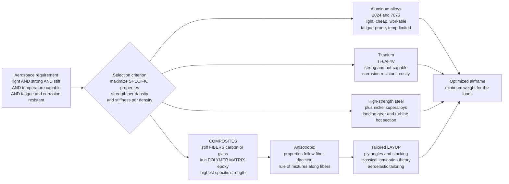

# 🛩️ Aerospace Materials and Composites: The Strength-per-Kilogram Battle

> [!abstract] TL;DR
> In aerospace, every gram flies for the life of the airframe, so materials are judged not by raw strength but by **specific properties** — **specific strength** (strength ÷ density) and **specific stiffness** (modulus ÷ density) — plus temperature capability, fatigue life, fracture toughness, corrosion resistance, and cost. **Aluminum alloys** (2024, 7075) are the classic light, cheap, workable airframe metal but are fatigue-prone and temperature-limited; **titanium** (Ti-6Al-4V) is strong, hot-capable, and corrosion-proof but expensive; **high-strength steels** carry landing-gear loads; **nickel superalloys** survive the turbine hot section. The transformative class is **composites** — ultra-stiff **fibers** (carbon, glass, aramid) glued into a **polymer matrix** (epoxy) — which beat steel and aluminum on specific strength and stiffness, are **anisotropic** (properties follow the fibers, captured by the **rule of mixtures** along the fiber axis), and are **tailorable** by choosing ply angles in a **laminate layup** (classical lamination theory, aeroelastic tailoring). Modern airliners like the **787 and A350 are more than 50% composite by weight**. The catch: composites hide **barely-visible impact damage**, **delaminate**, absorb moisture, and are hard to inspect and repair. **Ashby material-selection charts** formalize the whole trade.

## Intuition

**Analogy:** Imagine you are packing for a mountaineering expedition where a helicopter charges you by the kilogram for every item, for the entire trip. You would never ask "what is the strongest rope?" — you would ask "what is the strongest rope **per kilogram**?" A thick steel chain is enormously strong, but it is so heavy that a lighter climbing rope of the same total weight actually holds more. That single reframing — *strength per unit weight* instead of *strength* — is the entire mindset of aerospace material selection. Steel is the strong-but-heavy chain; **aluminum** is the classic lightweight champion that made metal aircraft possible; **titanium** is the specialist that also shrugs off heat; and the game-changer is **composites** — glue millions of ultra-strong carbon fibers into a plastic matrix and you get something stronger and stiffer than steel at a fraction of the weight. Better still, you can **tune** it: because the strength lives in the fibers, you lay the fibers exactly along the load paths, the way a carpenter orients the grain of wood where the plank will be stressed.

Technically, the "helicopter charging by the kilogram" is real: lifting structural mass costs lift, which costs drag, which costs fuel, for every hour the aircraft flies — so material choice compounds over the airframe's life. That is why aerospace engineers plot **Ashby charts** of strength versus density and reach for whatever sits up-and-to-the-left, and why the shift from aluminum to carbon composites reshaped modern aircraft. The price of the composite's tailorability is treachery: unlike a dented aluminum panel, a composite can be struck hard enough to fracture *internally* while looking pristine on the surface, then quietly **delaminate** in service — which is why the whole discipline of composite inspection and design allowables exists.

---

## How It Works

### Core Mechanics

1. **The selection criterion is a ratio, not a number.** Aerospace does not maximize strength or stiffness; it maximizes them *per unit mass*. **Specific strength** $\sigma/\rho$ and **specific stiffness** $E/\rho$ (also called specific modulus) are the primary axes. A tension member is limited by $\sigma/\rho$; a stiffness-critical panel or spar is limited by $E/\rho$ (or, for buckling, $E^{1/2}/\rho$ or $E^{1/3}/\rho$ depending on the loading mode). **Ashby material-selection charts** plot property versus density on log-log axes, where lines of constant specific property are straight, so the "best" materials for a given job line up along a **material index** guideline.

2. **Beyond the two big ratios sit the secondary gates.** A material can win on specific strength and still be disqualified by **temperature capability** (engine parts, leading edges, and thermal protection see hundreds to thousands of kelvin), **fatigue resistance** (aircraft accumulate millions of pressurization and gust cycles), **fracture toughness and damage tolerance** (a structure must survive with a crack present until inspection catches it), **corrosion resistance**, **manufacturability**, and **cost**. Real selection is multi-constraint: pass the gates first, then optimize the index.

3. **Aluminum alloys — the workhorse metal.** Precipitation-hardened **2024** (Al-Cu, good fatigue and damage tolerance — fuselage skins) and **7075** (Al-Zn, higher strength — wing structure) gave 20th-century aircraft a light, cheap, easily-machined, isotropic material with density ~2.7 g/cm³. Weaknesses: they **fatigue** (no true endurance limit), soften above ~150 °C, and corrode without protection. Aluminum-lithium alloys shave further density.

4. **Titanium — the hot, strong specialist.** **Ti-6Al-4V** (the workhorse alloy) offers strength near steel at ~56% of steel's density, excellent corrosion resistance, and useful strength to ~400–500 °C — so it appears where loads and temperatures are both high (engine fan and compressor parts, landing-gear fittings, and the structure around the exhaust). It is expensive to buy and to machine, which rations its use.

5. **Steels and superalloys — where nothing else survives.** High-strength **steels** (e.g. 4340, 300M, maraging) carry the extreme concentrated loads of **landing gear** where their high modulus and strength beat the weight penalty. **Nickel-based superalloys** dominate the **turbine hot section**, chosen not for specific strength but for **creep and oxidation resistance** at gas temperatures approaching and exceeding their own melting point (enabled by single-crystal casting, internal cooling, and ceramic thermal-barrier coatings).

6. **Composites — fibers do the work, the matrix holds the team together.** A **fiber-reinforced polymer** combines strong, stiff, brittle **fibers** (carbon/CFRP, glass/GFRP, aramid/Kevlar) with a compliant, tough **polymer matrix** (usually epoxy). The fibers carry the load along their length; the matrix transfers load between fibers, holds their alignment, protects them, and blunts cracks. The result has specific strength and specific stiffness that exceed aluminum, titanium, and steel — the reason composites now make up the majority of modern airframes.

7. **Anisotropy and the rule of mixtures.** Because strength lives in the aligned fibers, a single **ply** (lamina) is strongly directional. Along the fibers, stiffness follows the **rule of mixtures** (Voigt / isostrain average): $E_1 = V_f E_f + (1-V_f) E_m$, dominated by the fibers. Across the fibers, load passes through the soft matrix in series (Reuss / isostress), giving a far lower transverse modulus $1/E_2 = V_f/E_f + (1-V_f)/E_m$. A carbon/epoxy ply can be **10–20× stiffer along the fibers than across** — powerful if you align the fibers with the load, disastrous if you do not.

8. **Laminates and tailoring.** Real parts stack many plies at different angles (a **layup** such as $[0/\pm45/90]_s$) so the combined **laminate** carries load in every needed direction. **Classical lamination theory (CLT)** predicts the laminate's stiffness from the ply properties and stacking sequence, letting designers **tailor** the response — including **aeroelastic tailoring**, where deliberately unbalanced layups make a wing twist as it bends to control flutter and load. **Honeycomb sandwich panels** (thin stiff composite face sheets bonded to a lightweight core) give enormous bending stiffness at almost no weight. Manufacturing spans **prepreg and autoclave**, **automated fiber placement (AFP)**, and **resin infusion**.

9. **The composite penalty box.** Composites fail differently from metals: **delamination** (plies separating), **barely-visible impact damage (BVID)** that leaves the surface intact while cracking the interior, **moisture absorption** that degrades the matrix, difficult **repair**, and conservative **design allowables** driven by scatter. They demand dedicated **non-destructive inspection (NDI)** — ultrasonic C-scan, thermography — because you cannot simply look for a dent. This inspectability and repairability cost is the standing counterweight to the weight savings.

### Flow / Architecture



---

## Key Concepts

### Secondary Level

- **Weight is the enemy.** A plane has to lift everything it is made of, every second it flies, so engineers do not just want *strong* materials — they want materials that are strong **for how much they weigh**. This is called **specific strength** (strength divided by weight).
- **The four metals, in one line each.** **Aluminum** is light, cheap, and easy to shape (the classic airplane metal). **Titanium** is strong *and* handles heat but is expensive. **Steel** is very strong and used where loads are huge, like landing gear. **Superalloys** are special metals that survive the fire inside jet engines.
- **Composites are the big idea.** Take thousands of hair-thin **carbon fibers** — each stronger than steel — and glue them into plastic. The result is **stronger and stiffer than steel but much lighter**. Modern airliners like the Boeing 787 are more than half made of these composites.
- **You can aim the strength.** Because the strength is in the fibers, you point the fibers along the direction the part gets pulled — like lining up the grain of wood where a plank will bend. Turn the fibers the wrong way and the material is weak.
- **The catch.** A composite can be hit hard enough to crack *inside* while still looking perfectly fine on the outside. Hidden damage is dangerous, so composites need special scanning machines to check them.

### Undergraduate Level

- **Specific properties and material indices.** Specific strength $= \sigma_f/\rho$, specific stiffness $= E/\rho$. The *right* index depends on the load case: a tie in tension maximizes $\sigma_f/\rho$; a beam of fixed shape for minimum-mass **stiffness** maximizes $E^{1/2}/\rho$; a panel in bending maximizes $E^{1/3}/\rho$. On a log-log **Ashby chart**, each index is a family of parallel guideline lines; slide the guideline to the top-left corner to find the best material.
- **Rule of mixtures (micromechanics of one ply).** Longitudinal (isostrain, Voigt upper bound): $E_1 = V_f E_f + (1-V_f)E_m$ and $\rho_c = V_f\rho_f + (1-V_f)\rho_m$. Transverse (isostress, Reuss lower bound): $\dfrac{1}{E_2} = \dfrac{V_f}{E_f} + \dfrac{1-V_f}{E_m}$. Major Poisson ratio $\nu_{12} = V_f\nu_f + (1-V_f)\nu_m$; in-plane shear $\dfrac{1}{G_{12}} = \dfrac{V_f}{G_f} + \dfrac{1-V_f}{G_m}$.
- **Off-axis modulus (why direction matters).** The apparent Young's modulus at angle $\theta$ from the fiber axis is $\dfrac{1}{E_x(\theta)} = \dfrac{\cos^4\theta}{E_1} + \dfrac{\sin^4\theta}{E_2} + \left(\dfrac{1}{G_{12}} - \dfrac{2\nu_{12}}{E_1}\right)\sin^2\theta\cos^2\theta$. Stiffness collapses toward $E_2$ within a few tens of degrees of misalignment — the quantitative heart of aeroelastic tailoring.
- **The alloy shortlist.** **Al 2024-T3** (damage-tolerant, fuselage), **Al 7075-T6** (high-strength, wings), **Ti-6Al-4V** (strong, ~400–500 °C, corrosion-proof), high-strength **steel** (landing gear), **nickel superalloy** (turbine). Aluminum $\rho \approx 2.7$, titanium $\approx 4.4$, steel $\approx 7.8$, CFRP $\approx 1.6$ g/cm³.
- **Laminate codes and CLT.** A layup like $[0/90/\pm45]_s$ lists ply angles from outside in, with $s$ meaning symmetric. **Classical lamination theory** assembles the ply stiffness matrices ($Q$ rotated into the laminate frame) into the laminate **ABD matrix** relating in-plane forces and bending moments to strains and curvatures — the design tool that turns ply choices into panel stiffness.
- **Sandwich construction.** Thin stiff face sheets separated by a light core multiply bending stiffness (which scales with thickness cubed) at tiny mass cost — the reason floors, control surfaces, and fairings are honeycomb sandwich.

### Graduate Level

- **Multi-objective selection and penalty functions.** Real airframe selection couples several indices under simultaneous constraints (strength, stiffness/buckling, damage tolerance, temperature, cost, manufacturability). Ashby's method formalizes this with **coupling constants** and **penalty functions** that combine, for example, a mass index and a cost index into a single value metric, exposing the trade surface rather than a single winner.
- **Failure theories for a lamina.** Beyond stiffness, ply strength uses interactive criteria — **Tsai-Wu**, **Tsai-Hill**, and physically-based **Puck** or **LaRC** criteria that distinguish fiber-dominated from matrix/inter-fiber failure. Laminate strength is predicted ply-by-ply (**first-ply failure** vs progressive **last-ply failure** with stiffness degradation).
- **Damage tolerance and the composite allowables pyramid.** Certification treats **BVID as pre-existing damage**: the structure must retain ultimate load with undetectable damage and limit load with visible damage. Compression-after-impact (CAI) strength, not tension, usually governs. Allowables are built through a **building-block/test pyramid** (coupons → elements → subcomponents → full-scale) because composite scatter and failure modes resist pure analysis.
- **Aeroelastic tailoring.** Deliberately **unbalanced/off-axis** layups create **bend-twist coupling** ($D_{16}, D_{26}$ terms of the ABD matrix): a swept composite wing can be made to wash out (twist leading-edge-down) as it bends up, raising flutter speed and cutting gust and maneuver loads — an aeroelastic benefit no isotropic metal wing can achieve, and a driver of forward-swept and high-aspect-ratio designs.
- **Environmental and durability physics.** Epoxy matrices absorb moisture (Fickian diffusion), depressing the **glass-transition temperature** $T_g$ and knocking down hot/wet compression strength — so allowables are set at the worst-case **hot/wet** condition. Thermal-expansion mismatch between fibers ($\alpha \approx 0$ or negative axially for carbon) and matrix drives residual cure stresses and microcracking.
- **Advanced and emerging classes.** **Ceramic-matrix composites (CMCs)** (SiC/SiC) enable uncooled or lightly-cooled hot structures and turbine components at higher temperatures than superalloys; **metal-matrix composites (MMCs)** add stiffness and temperature to aluminum/titanium; **additively-manufactured** metals and **architected/lattice** materials push toward geometry-tuned specific stiffness and functionally-graded parts.

---

## Python Demo

```python
# Aerospace materials & composites:
#   (a) ASHBY selection chart  -> strength vs density (log-log) with
#       specific-strength guidelines; shows why CFRP & aluminum win.
#   (b) COMPOSITE lamina       -> rule-of-mixtures E1 (along fibers) vs
#       E2 (across), and the off-axis modulus Ex(theta) collapsing as the
#       fiber angle rotates -> the anisotropy behind aeroelastic tailoring.
import numpy as np
import matplotlib.pyplot as plt

fig, (axA, axB) = plt.subplots(1, 2, figsize=(14, 6))

# ---------------------------------------------------------------------
# (a) ASHBY CHART: tensile strength [MPa] vs density [kg/m^3]
#     On log-log axes, sigma/rho = const is a straight line of slope 1.
#     Materials up-and-to-the-LEFT are lighter for the same strength.
# ---------------------------------------------------------------------
# name: (density kg/m^3, tensile strength MPa, color)
materials = {
    "Al 2024-T3": (2780,  450, "tab:blue"),
    "Al 7075-T6": (2810,  570, "tab:cyan"),
    "Ti-6Al-4V":  (4430,  950, "tab:green"),
    "Steel 4340": (7850, 1500, "tab:gray"),
    "CFRP (UD)":  (1600, 1500, "tab:red"),
    "GFRP":       (1900,  900, "tab:orange"),
}
for name, (rho, sig, c) in materials.items():
    axA.scatter(rho, sig, s=150, color=c, edgecolor="k", zorder=3)
    axA.annotate(name, (rho, sig), xytext=(6, 6),
                 textcoords="offset points", fontsize=9)

# specific-strength guidelines: sigma = k * rho  (constant sigma/rho)
rho_line = np.array([900.0, 9000.0])
for k in (0.05, 0.20, 0.80):
    axA.plot(rho_line, k * rho_line, "k--", lw=1, alpha=0.4)
axA.annotate("increasing\nspecific strength\n(better for flight)",
             xy=(1500, 1500), xytext=(3200, 250),
             arrowprops=dict(arrowstyle="->"), fontsize=9)

axA.set_xscale("log"); axA.set_yscale("log")
axA.set_xlabel("Density  rho  [kg/m^3]")
axA.set_ylabel("Tensile strength  sigma  [MPa]")
axA.set_title("(a) Ashby chart: strength vs density\nup-and-left = lighter for equal strength")
axA.grid(True, which="both", ls=":", alpha=0.5)

# ---------------------------------------------------------------------
# (b) COMPOSITE LAMINA: rule of mixtures + off-axis anisotropy
#     Carbon fiber in an epoxy matrix, Vf = 0.60.
# ---------------------------------------------------------------------
Ef, Em = 230.0, 3.5     # GPa: carbon fiber, epoxy
Gf, Gm = 20.0, 1.3      # GPa shear moduli
nuf, num = 0.20, 0.35   # Poisson ratios
Vf = 0.60               # fiber volume fraction

E1   = Vf * Ef + (1 - Vf) * Em                 # ROM / Voigt (stiff, along fibers)
E2   = 1.0 / (Vf / Ef + (1 - Vf) / Em)         # Reuss (soft, across fibers)
nu12 = Vf * nuf + (1 - Vf) * num
G12  = 1.0 / (Vf / Gf + (1 - Vf) / Gm)

# off-axis Young's modulus at angle theta from the fiber axis
theta = np.radians(np.linspace(0.0, 90.0, 361))
c, s = np.cos(theta), np.sin(theta)
inv_Ex = (c**4 / E1 + s**4 / E2
          + (1.0 / G12 - 2.0 * nu12 / E1) * s**2 * c**2)
Ex = 1.0 / inv_Ex

axB.plot(np.degrees(theta), Ex, color="tab:red", lw=2.3,
         label="off-axis modulus  Ex(theta)")
axB.axhline(E1, ls="--", color="k", alpha=0.7,
            label=f"E1 along fibers (ROM) = {E1:.0f} GPa")
axB.axhline(E2, ls=":", color="tab:blue", alpha=0.9,
            label=f"E2 across fibers = {E2:.1f} GPa")
axB.scatter([0, 90], [E1, E2], color="k", zorder=5)
axB.set_xlabel("Fiber misalignment angle  theta  [deg]")
axB.set_ylabel("Young's modulus  Ex  [GPa]")
axB.set_title("(b) Lamina anisotropy: stiffness collapses off-axis\ncarbon/epoxy, Vf = 0.60")
axB.set_xlim(0, 90); axB.grid(True, ls=":", alpha=0.5)
axB.legend(fontsize=9, loc="upper right")

plt.tight_layout()
plt.savefig("aerospace_materials_selection.png", dpi=120)
plt.show()

print(f"Longitudinal modulus E1 = {E1:6.1f} GPa   (rule of mixtures, fiber-dominated)")
print(f"Transverse   modulus E2 = {E2:6.1f} GPa   (matrix-dominated)")
print(f"Anisotropy ratio  E1/E2 = {E1 / E2:6.1f}")
print(f"At 45 deg:      Ex(45)  = {Ex[180]:6.1f} GPa   (already near E2 -> orientation is everything)")
```

Running this prints a longitudinal modulus of ~139 GPa versus a transverse modulus of ~8.5 GPa (an anisotropy ratio near 16), and by 45° the off-axis modulus has already collapsed to within a few GPa of the weak transverse value — the quantitative reason ply orientation, not just material choice, decides a composite structure's stiffness.

---

## Real-World Applications

> **Boeing 787 / Airbus A350 airframes.** Both are **more than 50% composite by weight** (the 787's fuselage and wings are one-piece carbon-fiber barrels and skins). The payoff is a lighter, more fatigue-resistant airframe with fewer joints and fasteners, higher cabin pressure and humidity (composites do not corrode or fatigue like aluminum fuselages), and lower fuel burn. Titanium is used at the composite-to-metal interfaces and high-load fittings because its thermal expansion and galvanic behavior match carbon better than aluminum's.

> **Jet-engine hot section.** Selection flips from specific strength to temperature capability: **nickel superalloy** single-crystal turbine blades with internal cooling and thermal-barrier coatings survive gas hotter than their melting point, while the fan and forward compressor use **titanium** (and increasingly composite fan blades, as on the GE90/GEnx). This is the same specific-property logic detailed in the gas-turbine cycle note, where turbine-inlet temperature is capped by exactly these materials — see *Gas_Turbine_Engine_Cycles*.

> **Landing gear and helicopter rotor blades.** Landing gear uses **high-strength steel** (300M, 4340) because the concentrated impact loads make its high modulus and strength worth the weight. Helicopter and wind-turbine **rotor blades** are composite: their aeroelastic behavior is deliberately tailored via ply orientation, and their fatigue life vastly exceeds a metal blade's under the punishing cyclic loads of rotation.

> **Aeroelastic tailoring in forward-swept and high-aspect-ratio wings.** The X-29 forward-swept wing was only structurally feasible because a composite skin could be laid up with **bend-twist coupling** that prevents divergence — an aeroelastic benefit impossible with isotropic aluminum. The same tailoring lets modern long, slender composite wings manage flutter and gust loads.

---

## Common Pitfalls

- **Comparing raw strength instead of specific strength.** Steel looks "stronger" than aluminum or CFRP on a strength number alone, but in a mass-limited flight structure the right metric is $\sigma/\rho$ (or the correct stiffness index for the load case). Ranking materials by raw property is the classic beginner error that would put a steel airliner in the sky.
- **Ignoring the material index for the load type.** Maximizing $E/\rho$ is wrong for a bending-limited panel — there the minimum-mass index is $E^{1/3}/\rho$, and for a beam it is $E^{1/2}/\rho$. Using the wrong index picks the wrong material and misreads the Ashby chart entirely.
- **Treating a composite as isotropic.** A unidirectional ply can be 10–20× stiffer along the fibers than across. Designing as if properties were direction-independent, or forgetting to align fibers with the load path, throws away the composite's entire advantage and can cause matrix-dominated failure far below expected loads.
- **Underestimating barely-visible impact damage (BVID).** Composites can be internally fractured while the surface looks fine, then delaminate in service. Assuming "no dent means no damage" is dangerous; certification requires **compression-after-impact** allowables and dedicated **NDI**, not visual checks.
- **Neglecting the hot/wet knockdown.** Epoxy matrices absorb moisture, lowering the glass-transition temperature and cutting hot compression strength. Sizing to dry, room-temperature ply data over-predicts strength; allowables must use worst-case hot/wet conditions.
- **Forgetting galvanic corrosion and CTE mismatch at metal interfaces.** Carbon fiber is cathodic to aluminum, driving galvanic corrosion, and the two have very different thermal expansion. Bolting CFRP straight to aluminum without isolation or a titanium interface invites corrosion and fastener fatigue.
- **Assuming composites are cheap or easily repaired.** The weight win is real, but tooling, autoclave/AFP manufacturing, inspection, and field repair are costly and skill-intensive. Selection must weigh life-cycle cost, not just structural mass.

---

## Related Concepts

- [[Composite_Materials_and_Fiber_Reinforcement]] — the materials-science foundation for fiber composites: classification, rule of mixtures, Halpin-Tsai, and anisotropy that this note applies to airframe selection.
- [[Stress_Strain_and_Elastic_Moduli]] — defines the stiffness ($E$) and strength ($\sigma$) properties whose *per-density* ratios drive every aerospace material choice here.
- [[Fatigue_Creep_and_High_Temperature_Failure]] — the fatigue-life and creep limits that gate aluminum (fatigue) and superalloys (creep in the turbine hot section) in the selection logic above.
- [[Fracture_Mechanics_and_Toughness]] — the damage-tolerance framework behind aerospace fracture requirements and the BVID/allowables treatment of composites.
- [[Polymer_Structure_and_Glass_Transition]] — the epoxy-matrix physics (glass transition, moisture) that sets the hot/wet knockdown limiting composite operating temperature.
- [[Machine_Design_Principles]] — the general design-for-load and factor-of-safety framework that aerospace material selection specializes with specific-property and anisotropy constraints.

This note is the entry point of the **Aerospace Structures and Materials** section and is designed to sit beside its siblings *Aerospace_Structures_and_Airframes* (how these materials become load-bearing structure), *Fatigue_and_Damage_Tolerance* (the cyclic-life and inspection philosophy for airframes), and *Thermal_Protection_Systems* (materials for the extreme-heat regime), with the propulsion-side material story in *Gas_Turbine_Engine_Cycles*.

---

## Review Questions

1. **(Secondary)** Steel is stronger than aluminum, yet aircraft are built largely from aluminum and composites rather than steel. Explain, using the idea of "strength per kilogram," why the strongest material is not automatically the best aerospace material.
2. **(Secondary)** Why can a carbon-fiber part be dangerously damaged even when it looks perfectly fine on the surface, and what does that force engineers to do that they would not need to do with an aluminum panel?
3. **(Undergraduate)** For a unidirectional carbon/epoxy ply with $E_f = 230$ GPa, $E_m = 3.5$ GPa, and $V_f = 0.60$, compute the longitudinal modulus $E_1$ (rule of mixtures) and transverse modulus $E_2$ (inverse rule of mixtures). Explain why $E_1 \gg E_2$ in terms of isostrain versus isostress loading.
4. **(Undergraduate)** On an Ashby strength-density chart, a designer is selecting for a minimum-mass **stiffness-limited bending panel**. Which material index should guide the guideline slope, $E/\rho$, $E^{1/2}/\rho$, or $E^{1/3}/\rho$, and how does choosing the wrong index change which material appears "best"?
5. **(Graduate)** A composite wing must be designed to raise its flutter speed. Explain how an unbalanced, off-axis laminate layup produces bend-twist coupling ($D_{16}, D_{26}$ terms) and how "washout" tailoring achieves this — and why an isotropic aluminum wing cannot replicate the benefit.
6. **(Graduate)** Certification treats barely-visible impact damage as pre-existing and often makes **compression-after-impact** strength the governing case rather than tension. Justify this from composite failure physics (delamination, sublaminate buckling) and describe how the building-block test pyramid establishes design allowables.

---

## Sources

- Ashby, M. F. — *Materials Selection in Mechanical Design*, 5th ed., Butterworth-Heinemann, 2016.
- Jones, R. M. — *Mechanics of Composite Materials*, 2nd ed., Taylor & Francis, 1999.
- Niu, M. C. Y. — *Composite Airframe Structures*, Conmilit Press, 1992.
- Campbell, F. C. — *Structural Composite Materials*, ASM International, 2010.
- Gibson, R. F. — *Principles of Composite Material Mechanics*, 4th ed., CRC Press, 2016.

---

#aerospace-engineering #materials #composites #specific-strength #CFRP
