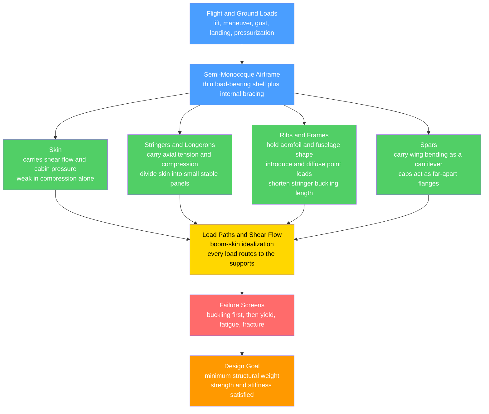

# 🛩️ Aerospace Structures and Airframes

> [!abstract] TL;DR
> An **airframe** is the load-carrying skeleton of a flight vehicle, and it lives under one merciless constraint: be **strong and stiff** enough to survive violent loads, yet **light** enough to fly — because every gram of structure directly steals payload and range through the sizing loop. The dominant answer is the **semi-monocoque**: a thin, load-bearing **skin** stabilized by internal members — **stringers/longerons** (carry axial load), **ribs and frames** (hold shape, introduce loads), and **spars** (carry wing bending). The skin carries **shear flow** and pressure; the stiffeners carry axial force and, crucially, stop the thin skin from **buckling**. The defining failure mode of aerospace structures is not yielding but **elastic buckling** — thin panels and slender columns go unstable at stresses far below the material's yield strength ($\sigma_{cr} = \pi^2 E / (L/r)^2$), which is *why* stiffeners exist. Analysis is **thin-walled beam theory** (bending, torsion, shear flow, shear centre) plus hoop stress in pressurized fuselages and **finite-element** models; design is driven by stiffness (aeroelasticity), fatigue, damage tolerance, and materials — all subordinate to relentless **weight minimization**.

---

## Intuition

**Analogy first.** Hold an eggshell or a bird's hollow bone in your hand. Nature faced the exact problem an aircraft faces — carry big loads with almost no weight — and its answer was to put the material in a thin curved **skin** and hollow out the middle, then brace that skin from inside with a lattice of ribs. A soda can is the same trick: stand on an unblemished can and it holds your entire body weight through its paper-thin wall, yet flick a tiny **dent** into that wall and it crushes instantly. The strength was never in the *thickness* of the metal; it was in keeping the thin skin **smooth and stable** so it could not fold.

That is the whole philosophy of the **airframe**. Instead of a solid beam of aluminium (heavy, and mostly dead weight in the middle where stress is low), an aircraft is a **stressed skin** wrapped over a skeleton of **stringers, ribs, frames, and spars** — the "semi-monocoque." The skin does real structural work carrying shear and pressure; the internal members carry the push-pull of bending and, above all, keep the skin from buckling like that dented can. Because structural weight is the eternal enemy of range, payload, and performance, aerospace engineers agonize over every rivet and every millimetre of skin gauge in a way that a bridge designer never would. This weight obsession, and the fact that thin structures fail by **buckling long before they yield**, is exactly what distinguishes aerospace structures from ordinary mechanical structures.

---

## How It Works

### Core Mechanics

1. **Start from the loads.** A flight vehicle sees **flight loads** (lift, manoeuvre, gusts, aerodynamic pressure), **ground loads** (landing impact, taxi, towing), and **pressurization** (a fuselage is a cyclically inflated tube). These are first bounded by the flight envelope, then flowed into the structure.
2. **Wrap the loads in a stressed skin.** Rather than a solid section, the airframe is a **thin shell**. The skin is efficient in **tension and shear** but hopeless in compression on its own — a bare thin sheet buckles at almost no load. So it is stabilized.
3. **Add stiffeners to beat buckling.** **Stringers/longerons** run axially and carry the tension/compression from bending; they also divide the skin into small panels that can each resist buckling. **Ribs (in wings)** and **frames (in fuselages)** run around the section: they preserve the aerodynamic shape, break the stringers into shorter (harder-to-buckle) columns, and **introduce concentrated loads** (engine mounts, landing gear) and diffuse them into the skin.
4. **Carry wing bending with spars.** A wing is a **cantilever beam in lift**. The **spars** run spanwise; their **caps** act as the far-apart flanges of a beam (recall $\sigma = My/I$ — putting material far from the neutral axis maximizes $I$), while the skin and spar webs carry the **shear**.
5. **Trace the load paths.** Every applied load must find a continuous route to the supports. In the idealized **boom–skin** model, concentrated axial load is lumped into "booms" (effective stringer areas) while the skin carries **shear flow** $q = \tau t$. Torsion in a closed section is carried by a circulating shear flow, $q = T / (2A_m)$ (Bredt–Batho).
6. **Screen every failure mode, then minimize weight.** The section is checked against **yield**, **buckling** (the dominant concern), **fatigue**, and **fracture** — then material is shaved everywhere it is not needed. Aerospace uses a low **ultimate factor of safety of ~1.5** (versus 3–5 in civil structures) precisely because every kilogram is so costly to carry.

### Flow / Architecture



---

## Key Concepts

### Secondary Level

- **The airframe is the skeleton of a flight vehicle.** It holds the shape, carries the loads from lift and landing, and everything else (engines, fuel, passengers) hangs on it.
- **Strong but light — the central tension.** Anything heavy you build into the structure is weight you must lift for the entire life of the aircraft, so it steals fuel, range, and payload. Aerospace design is a constant fight to remove weight without losing strength.
- **The eggshell trick (monocoque).** Put the material in a thin outer **skin** and leave the inside hollow. A curved skin is far stronger than a flat sheet — like an egg that resists a squeezing hand yet cracks at a sharp tap.
- **Bracing the skin (semi-monocoque).** A bare thin skin folds like a crushed can, so engineers add internal ribs and long thin strips (**stringers**) to hold it smooth and stiff. This "skin plus stiffeners" is how nearly every metal airliner is built.
- **Buckling, not breaking.** Thin aerospace parts usually fail by **buckling** — suddenly folding or dimpling — long before the metal itself is overloaded. That is why the inside is full of stiffeners.

### Undergraduate Level

- **Structural evolution.** Early aircraft used **trusses and braced frames** (wire-and-strut biplanes). The **monocoque** put all load in the skin (a smooth stressed shell, like a fibreglass canoe). The **semi-monocoque** — a stressed skin *plus* stringers, ribs, frames, and spars — became dominant because a pure monocoque skin thick enough not to buckle is heavier than a thin skin plus light stiffeners.
- **Who carries what.** **Skin:** shear flow $q = \tau t$ and pressure. **Stringers/longerons:** axial load from bending (and they stabilize the skin). **Ribs/frames:** maintain section shape, introduce concentrated loads, and shorten the stringer/skin buckling length. **Spars:** wing bending, with caps as flanges and webs carrying shear.
- **Buckling is the defining failure mode.** A slender column buckles at the **Euler** load $P_{cr} = \pi^2 EI / (KL)^2$, or in stress form $\sigma_{cr} = \pi^2 E / (KL/r)^2$, where $r = \sqrt{I/A}$ is the radius of gyration and $KL/r$ the slenderness. A thin **plate** buckles at $\sigma_{cr} = k \dfrac{\pi^2 E}{12(1-\nu^2)} \left(\dfrac{t}{b}\right)^2$. Both fall as the section gets thinner — so aerospace structures buckle far below yield, and stiffening (raising $I$, cutting effective length $L$, adding edge support $k$) is the cure.
- **Thin-walled beam theory.** Bending stress $\sigma = My/I$ with $I$ from the boom areas; **shear flow** distribution around open and closed sections; the **shear centre** (loads through it cause no twist — critical for open sections like channels); torsion of a single-cell closed tube by **Bredt–Batho** $q = T/(2A_m)$.
- **Pressurized fuselage — hoop stress.** A cabin at internal pressure $p$ and radius $R$, skin thickness $t$, carries **hoop stress** $\sigma_\theta = pR/t$ and **longitudinal stress** $\sigma_x = pR/(2t)$. Because $\sigma_\theta$ is twice $\sigma_x$, and because it cycles every flight, the fuselage is a **fatigue-critical pressure vessel** (see the Comet disaster).
- **Idealized boom–skin analysis.** Concentrated the stringer/flange areas into discrete **booms** that carry only direct (axial) stress, and let the connecting **skin panels** carry only shear. This reduces a complex built-up section to a tractable set of boom stresses and panel shear flows — the workhorse hand method before FEA.
- **Low factors of safety.** Civil structures use ultimate factors of 2–5; certified aircraft use **1.5** on ultimate load (and must survive **limit load** with no permanent deformation). The margin is deliberately thin because weight is so precious — which is why analysis, testing, and inspection are so rigorous.

### Graduate Level

- **The sizing loop and weight sensitivity.** Structural weight is not a fixed penalty — it **compounds**. Heavier structure needs more lift, hence bigger wings and more fuel, hence more structure to carry it: the classic **snowball / rocket-equation** feedback. A wing-weight growth factor of 3–10× is typical, so a kilogram saved in primary structure saves several kilograms of take-off weight. This is the quantitative reason weight minimization dominates every decision.
- **Crippling and post-buckling.** Thin stiffened panels do not fail *at* skin buckling — the buckled skin sheds load to the stiffeners and keeps carrying, so design uses an **effective width** of skin acting with each stringer. Ultimate failure is **crippling** (local plate collapse of the stiffener elements) or **column buckling** of the stringer-plus-effective-skin. The Needham/Gerard crippling methods and the effective-width concept are central to real sizing.
- **Interaction and knockdowns.** Combined compression + shear + bending buckling follows **interaction curves** (e.g., $R_c + R_s^2 = 1$). Real shells buckle well below the classical prediction due to imperfection sensitivity — hence empirical **knockdown factors** (NASA SP-8007 for cylinders).
- **Torsion of multi-cell sections and warping.** Multi-cell wing boxes require solving simultaneous shear-flow equations per cell (compatibility of twist rate). **Open** thin sections have very low torsional stiffness ($J \approx \frac{1}{3}\sum b t^3$) and warp; **closed** cells are orders of magnitude stiffer — why wing torsion boxes and fuselage tubes are closed.
- **Aeroelastic coupling.** Structural **stiffness**, not just strength, is a primary design driver: too flexible a wing leads to **divergence**, **flutter**, and control reversal. Structures are frequently stiffness-sized (bending/torsional rigidity) rather than stress-sized — the link to the aeroelasticity notes.
- **Damage tolerance and fail-safe.** Post-Comet and post-Aloha 243, certification demands **damage-tolerant** design: assume an undetected crack exists, use crack-growth (Paris law) to set inspection intervals, and build **fail-safe** redundant/crack-arresting structure (tear straps, multiple load paths). Fatigue and fracture, not static overload, govern service life.
- **Finite-element structural analysis.** Modern airframes are analyzed with **FEM** — global stiffness models for load paths and internal loads, detailed sub-models for stress concentrations, plus optimization (topology, gauge, ply) to drive weight down subject to strength, buckling, and aeroelastic constraints. Hand methods (boom–skin, crippling charts) remain the sanity check.
- **Materials as a co-design variable.** Section geometry and **material** are chosen together: aluminium alloys (2024, 7075), **titanium** (hot, highly-loaded fittings), and **carbon-fibre composites** (tailorable stiffness, superb specific strength, but different failure and damage-tolerance physics). Composites let the designer place stiffness directionally — a lever unavailable in isotropic metals.

---

## Python Demo

```python
# Aerospace structural efficiency: two ideas that define airframe design.
#   (a) BUCKLING vs YIELD  -- a thin aluminium column buckles (Euler) far below
#       its yield stress once it is slender. sigma_cr = pi^2 * E / (K*L/r)^2.
#       This is WHY thin aerospace structures need stiffeners.
#   (b) STRUCTURAL EFFICIENCY -- for EQUAL cross-sectional area (i.e. equal mass
#       per unit length, same material), hollow / stiffened sections have a far
#       larger second moment of area I than a solid bar -> more bending stiffness
#       and strength per kilogram. This is WHY airframes are thin-walled.
import numpy as np
import matplotlib.pyplot as plt

# =====================================================================
# (a) BUCKLING vs YIELD  (aluminium alloy)
# =====================================================================
E       = 70.0e3      # Young's modulus, MPa  (aluminium ~ 70 GPa)
sigma_y = 350.0       # yield stress, MPa
K       = 1.0         # effective-length factor (pinned-pinned)

lam = np.linspace(5.0, 200.0, 600)                 # slenderness ratio  L/r
sigma_euler = np.pi**2 * E / (K * lam)**2          # Euler critical stress, MPa

# A real column can carry neither more than yield nor more than Euler buckling
sigma_capacity = np.minimum(sigma_euler, sigma_y)

# Transition slenderness where Euler buckling stress equals yield
lam_c = np.pi * np.sqrt(E / sigma_y) / K
print("(a) BUCKLING vs YIELD")
print(f"    Transition slenderness (K*L/r) = {lam_c:.1f}")
print(f"    For slenderness above ~{lam_c:.0f}, the column BUCKLES below yield.")

# =====================================================================
# (b) STRUCTURAL EFFICIENCY  (equal area A -> equal mass/length, same material)
# =====================================================================
A = 1000.0            # cross-sectional area held constant, mm^2

# 1) Solid SQUARE bar: side s
s = np.sqrt(A)
I_solid = s**4 / 12.0
c_solid = s / 2.0
S_solid = I_solid / c_solid                        # section modulus (strength proxy)

# 2) Thin-walled square BOX tube: outer side b, wall t, area A = 4*t*(b - t)
t_box = 3.0
b_box = A / (4.0 * t_box) + t_box
I_box = (b_box**4 - (b_box - 2.0 * t_box)**4) / 12.0
c_box = b_box / 2.0
S_box = I_box / c_box

# 3) I-beam / stiffened section: two flanges (bf x tf) + web (tw x hw), equal area
bf, tf, H = 60.0, 5.0, 100.0
hw = H - 2.0 * tf
tw = (A - 2.0 * bf * tf) / hw                       # solve web thickness for equal area
d  = (H - tf) / 2.0
I_web = tw * hw**3 / 12.0
I_fl  = 2.0 * (bf * tf**3 / 12.0 + bf * tf * d**2)  # parallel-axis theorem
I_ibeam = I_web + I_fl
c_ibeam = H / 2.0
S_ibeam = I_ibeam / c_ibeam

names = ["Solid\nsquare bar", "Hollow\nbox tube", "I-beam /\nstiffened"]
I_vals = np.array([I_solid, I_box, I_ibeam])
S_vals = np.array([S_solid, S_box, S_ibeam])
I_rel  = I_vals / I_solid                            # stiffness per unit mass, normalized
S_rel  = S_vals / S_solid                            # strength  per unit mass, normalized

print("\n(b) STRUCTURAL EFFICIENCY at EQUAL area = %.0f mm^2" % A)
for nm, Iv, Ir, Sr in zip(["solid bar", "box tube", "I-beam  "], I_vals, I_rel, S_rel):
    print(f"    {nm}:  I = {Iv:10.0f} mm^4   stiffness x{Ir:5.1f}   strength x{Sr:5.1f}")

# =====================================================================
# PLOTS
# =====================================================================
fig, (axL, axR) = plt.subplots(1, 2, figsize=(13, 5))

# ---- (a) buckling vs yield ----
axL.plot(lam, sigma_euler, "--", color="royalblue", lw=2.0,
         label="Euler buckling  pi^2 E / (KL/r)^2")
axL.axhline(sigma_y, color="firebrick", lw=2.0, ls=":",
            label="Yield stress")
axL.plot(lam, sigma_capacity, color="black", lw=3.0,
         label="Actual capacity = min(buckling, yield)")
axL.axvline(lam_c, color="grey", lw=1.2, ls="-.")
axL.fill_between(lam, 0, sigma_capacity, where=(lam > lam_c),
                 color="royalblue", alpha=0.15)
axL.fill_between(lam, 0, sigma_capacity, where=(lam <= lam_c),
                 color="firebrick", alpha=0.12)
axL.annotate("BUCKLING governs\n(thin -> unstable\nbelow yield)",
             xy=(120, sigma_euler[np.argmin(np.abs(lam - 120))]),
             xytext=(120, 250), fontsize=9, color="royalblue",
             arrowprops=dict(arrowstyle="->", color="royalblue"))
axL.text(12, 120, "YIELD\ngoverns\n(stocky)", fontsize=9, color="firebrick")
axL.text(lam_c + 2, 20, f"transition\nL/r = {lam_c:.0f}", fontsize=8, color="grey")
axL.set_xlabel("Slenderness ratio  K*L / r", fontsize=12)
axL.set_ylabel("Compressive stress at failure  (MPa)", fontsize=12)
axL.set_title("(a) Thin aerospace structures BUCKLE\nbefore they YIELD", fontsize=11)
axL.set_ylim(0, sigma_y * 1.15)
axL.set_xlim(lam.min(), lam.max())
axL.legend(fontsize=8, loc="upper right")
axL.grid(alpha=0.25)

# ---- (b) stiffness / strength per unit weight ----
x = np.arange(len(names))
w = 0.38
b1 = axR.bar(x - w/2, I_rel, w, color="#ff9900", alpha=0.85,
             label="Bending stiffness / weight  (~ I)")
b2 = axR.bar(x + w/2, S_rel, w, color="#ff6b6b", alpha=0.85,
             label="Bending strength / weight  (~ S = I/c)")
for bars in (b1, b2):
    for bar in bars:
        axR.text(bar.get_x() + bar.get_width()/2, bar.get_height(),
                 f"x{bar.get_height():.1f}", ha="center", va="bottom", fontsize=9)
axR.set_xticks(x); axR.set_xticklabels(names)
axR.set_ylabel("Relative to solid bar  (equal mass)", fontsize=12)
axR.set_title("(b) Equal mass, same material:\nhollow / stiffened wins", fontsize=11)
axR.legend(fontsize=9, loc="upper left")
axR.grid(alpha=0.25, axis="y")

plt.tight_layout()
plt.savefig("aerospace_structures_demo.png", dpi=120)
print("\nSaved figure -> aerospace_structures_demo.png")
```

**What it shows.** Panel (a) is the reason stiffeners exist: for an aluminium member the Euler buckling stress collapses as $1/\text{slenderness}^2$, so above a modest slenderness ($K L/r \approx 44$ here) the column goes **unstable far below its yield stress** — a thin skin or slender stringer *never* reaches the material's strength; it folds first. Panel (b) is the reason airframes are thin-walled: at **identical mass** (equal area, same alloy), a hollow box tube and an I-beam/stiffened section have roughly 14× and 20× the second moment of area of a solid bar, so they deliver an order of magnitude more bending stiffness *and* strength per kilogram. Put the material in a thin skin, hold it far from the neutral axis, and stop it buckling with stiffeners — that single sentence is aerospace structural design.

---

## Real-World Applications

> **Boeing 737 / Airbus A320 aluminium fuselage — the canonical semi-monocoque.** The pressurized tube is thin **2024-T3 skin** riveted to circumferential **frames** and longitudinal **stringers**, with **tear straps** for fail-safe crack arrest. The skin carries hoop stress $\sigma_\theta = pR/t$ and cabin shear; the stringers carry bending; the frames hold the circular shape and diffuse the floor, gear, and wing-attach loads. Every flight is a pressurization cycle, making the design **fatigue- and damage-tolerance-driven**.

> **Wing torsion box.** The primary wing structure is a **closed, multi-cell box** made of front and rear **spars**, upper/lower stiffened **skins**, and spanwise **ribs**. The spar caps are the flanges of a giant cantilever beam resisting bending from lift; the closed box resists **torsion** (Bredt–Batho shear flow) that would otherwise let the wing twist and flutter. Ribs maintain the aerofoil profile and break the skin into buckling-resistant panels.

> **de Havilland Comet (1954).** The first jet airliner's near-**square windows** concentrated hoop stress at the corners; repeated pressurization grew fatigue cracks until the fuselage burst. It rewrote structural certification around **fatigue and damage tolerance** and gave every airliner since its **rounded windows** — a direct lesson in how the pressurized semi-monocoque must be designed against buckling *and* fatigue, not just static strength.

> **Boeing 787 / Airbus A350 composite airframes.** Carbon-fibre barrel fuselages and wings replace built-up aluminium with **tailored laminates**, cutting weight and eliminating thousands of fatigue-prone rivet holes. The semi-monocoque logic survives (skin + stringers + frames, now co-cured composite), but the designer now also controls **stiffness direction** ply-by-ply — trading the isotropy of metal for anisotropic efficiency, at the cost of new buckling, delamination, and impact-damage-tolerance concerns.

> **Launch vehicle tanks and interstages.** Rocket structures push the same idea to the extreme: **isogrid** and **orthogrid** stiffened aluminium (and now composite) shells, where the tank wall is machined into a lattice of integral stiffeners so the thin skin resists buckling under axial thrust and internal pressure at the absolute minimum mass — because on a rocket the structural mass fraction is the difference between reaching orbit and not.

---

## Common Pitfalls

- **Checking yield but not buckling.** The single biggest aerospace-specific error. A thin panel or slender stringer confirmed "safe" because $\sigma < \sigma_y$ can still **buckle** at a fraction of that stress. Increasing the material's *yield strength* does nothing for buckling — buckling is set by **stiffness and geometry** ($E$, $I$, effective length, edge support), not strength.
- **Treating the skin as if it works in compression like a solid.** A bare thin skin sheds compressive load the instant it buckles. Use **effective width** (only the skin adjacent to a stringer stays effective) and design the **stringer + effective skin** as the real column. Ignoring post-buckling either wastes weight or, worse, over-predicts capacity.
- **Applying a solid-beam factor of safety.** Aerospace lives at **1.5** ultimate, not 3–5. A margin borrowed from civil practice is unattainable on a weight budget; conversely, forgetting that the margin is thin (and that the structure must survive **limit load** with no permanent set) invites failure. Thin margins demand rigorous test and inspection.
- **Loading an open section off its shear centre.** Channels, angles, and hat stringers have a **shear centre** offset from the centroid. A transverse load not passing through it induces **twist** on top of bending, and open sections are torsionally very weak ($J \approx \frac{1}{3}\sum bt^3$). Route loads through the shear centre or use a closed cell.
- **Ignoring fatigue on the pressurized fuselage.** The cabin is a pressure vessel cycled every flight; hoop stress plus stress raisers at cutouts (windows, doors, rivet holes) make it **fatigue-critical**. A static hoop-stress check ($\sigma_\theta = pR/t$) is necessary but nowhere near sufficient — damage tolerance and inspection intervals govern.
- **Trusting classical shell-buckling formulas.** Real thin cylinders and panels buckle **well below** the textbook value because of manufacturing **imperfections**. Apply empirical **knockdown factors** (e.g., NASA SP-8007) rather than the idealized elastic prediction.
- **Optimizing a part in isolation.** Because of the **sizing loop**, saving weight locally can ripple through the whole vehicle — and adding weight to fix one part can force resizing elsewhere. Structural weight, aeroelastic stiffness, fatigue life, and manufacturability must be traded **together**, not one bracket at a time.

---

## Related Concepts

- [[Bending_and_Beam_Theory]] *(Mechanical_Engineering)* — the wing is a cantilever beam and the fuselage a hollow beam; $\sigma = My/I$, the neutral axis, and "put material far from the axis" (spar caps as flanges) come straight from beam theory. Airframes are thin-walled beams pushed to their weight limit.
- [[Stress_Strain_and_Deformation]] *(Mechanical_Engineering)* — the underlying stress/strain, Hooke's law, and elastic constants ($E$, $\nu$) that set both the buckling stress $\sigma_{cr} \propto E$ and the section stiffness $EI$.
- [[Torsion_and_Shafts]] *(Mechanical_Engineering)* — the torsion counterpart: closed thin-walled cells (Bredt–Batho shear flow) resist the twist that would otherwise let a wing diverge or flutter; open sections warp and are torsionally weak.
- [[Failure_Fatigue_and_Fracture]] *(Mechanical_Engineering)* — the pressurized fuselage is a fatigue-critical vessel; damage-tolerant design (S-N, Paris crack growth, inspection intervals) rather than static overload governs airframe life.
- [[Composite_Materials_and_Fiber_Reinforcement]] *(Materials_Science)* — carbon-fibre laminates let the airframe place stiffness directionally for even better specific strength, replacing built-up metal skins on modern aircraft.

*Sibling notes in this section (planned, referenced in prose here): **Aeroelasticity and Flutter** (why stiffness, not just strength, sizes the structure), **Aerospace Materials and Composites** (the alloys and laminates the airframe is built from), **Fatigue and Damage Tolerance** (the crack-growth and inspection philosophy that governs service life), **Structural Dynamics and Loads** (vibration and dynamic response of the airframe), and **Airframe Loads and the Flight Envelope** (where the flight and ground loads come from in the first place).*

---

## Review Questions

1. **(Secondary)** Why can you stand on an empty soda can, yet it crushes the instant you dent its wall — and how does this explain why an aircraft is built as a thin skin braced by internal ribs and stringers rather than as a solid block of metal? What is the "enemy" that makes engineers fight over every kilogram of structure?
2. **(Undergraduate)** Name the four families of members in a semi-monocoque airframe (skin, stringers/longerons, ribs/frames, spars) and state what each one carries. Using $\sigma_{cr} = \pi^2 E/(KL/r)^2$, explain why adding ribs and frames (which shorten the stringers' unsupported length) raises the buckling load even though it does not change the material or its yield strength.
3. **(Undergraduate)** A pressurized fuselage of radius $R$, skin thickness $t$, at internal pressure $p$ has hoop stress $\sigma_\theta = pR/t$ and longitudinal stress $\sigma_x = pR/(2t)$. Why is the hoop direction the critical one, why is the structure fatigue- rather than static-limited, and what did the Comet disaster teach about stress concentrations at cutouts?
4. **(Graduate)** Explain the "sizing loop" (weight growth factor) and why it makes structural weight so much more costly in aerospace than in civil engineering. Then describe two situations in which an airframe component is **stiffness-sized** (not stress-sized) — one aeroelastic and one buckling — and discuss how you would trade a heavier, tougher, damage-tolerant design against a lighter, higher-strength one for a fatigue-critical, inspectable structure.

---

## Sources

- Megson, T. H. G. — *Aircraft Structures for Engineering Students*, 6th ed. (Butterworth-Heinemann) — the standard text on thin-walled beam theory, shear flow, semi-monocoque analysis, and structural instability.
- Bruhn, E. F. — *Analysis and Design of Flight Vehicle Structures* (Jacobs Publishing) — the classic industry reference for buckling, crippling, effective width, and built-up airframe stress analysis.
- Niu, M. C. Y. — *Airframe Structural Design* (Conmilit Press) — practical semi-monocoque design, fuselage/wing structure, joints, and fatigue/damage tolerance from a production standpoint.
- Sun, C. T. — *Mechanics of Aircraft Structures*, 2nd ed. (Wiley) — thin-walled sections, torsion of closed cells, shear centre, and the theoretical basis of airframe analysis.
- Peery, D. J. & Azar, J. J. — *Aircraft Structures*, 2nd ed. (McGraw-Hill / Dover) — concise treatment of loads, shear flow, and structural analysis of flight vehicles.

---

#aerospace-engineering #structures #airframe #semi-monocoque #buckling
