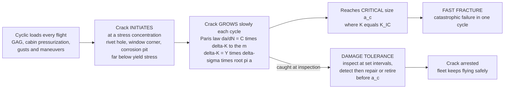

# 🛩️ Fatigue and Damage Tolerance

> [!abstract] TL;DR
> An airframe never fails because a single load exceeds its strength — it fails because **millions of ordinary loads**, each far below the strength, slowly grow a microscopic crack until, one routine flight, the part snaps. That is **fatigue**, and it is the *governing life-limit* of every aircraft and engine. Each flight stamps its signature into the metal: the **ground-air-ground (GAG)** cycle as the wings load and unload, the **cabin pressurization** cycle inflating and deflating the fuselage like a balloon, and countless **gust and maneuver** cycles. These cyclic loads concentrate at **stress raisers** — rivet holes, window corners, cutouts, corrosion pits — and begin a crack that, at stresses well *below yield*, extends a tiny amount every cycle. The aerospace field has passed through three philosophies to contain this. **Safe-life** retires the part on a schedule *before* any crack is expected (used where inspection is impossible — landing gear, engine disks). **Fail-safe** provides multiple load paths and crack-stoppers so no single crack is catastrophic. The modern standard, **damage tolerance**, makes the radical assumption that **cracks are present from day one** (from manufacture), and then *designs and inspects* so that any crack grows **slowly enough to be detected and arrested before it reaches critical size**. The arithmetic rests on two pillars: for total **life**, the **S-N curve** (stress amplitude vs cycles-to-failure) combined with **Miner's rule** to sum damage over a mixed flight spectrum; for **crack growth**, **linear elastic fracture mechanics** — the **stress-intensity factor** $K = Y\sigma\sqrt{\pi a}$, the **fracture toughness** $K_{IC}$ that fixes the **critical crack size** $a_c$, and the **Paris law** $da/dN = C(\Delta K)^m$ that integrates crack length against flight cycles. Inspection intervals are set at a *fraction* of the crack-growth life so every crack is caught with margin. This "crack-growth arithmetic," verified by **full-scale fatigue tests** and policed by **aging-aircraft** programs and **widespread-fatigue-damage** rules, is precisely why modern aviation is astonishingly safe *despite* flying structures that are full of tiny cracks — a triumph of fracture mechanics applied to keep whole fleets airborne.

---

## Intuition

**Analogy:** Take an ordinary steel **paperclip** and try to snap it by pulling — you cannot, your hands are nowhere near strong enough. Now bend it back and forth. First bend: fine. Fifth bend: fine. But somewhere around the twentieth or thirtieth bend it simply **breaks in half** — even though no single bend was remotely close to the force needed to tear it apart. What happened? Each bend opened a microscopic crack a hair wider. The crack grew, cycle by cycle, invisible, until so little metal was left that one final, unremarkable bend finished it. **That is fatigue: failure by repetition, not by overload.** The metal remembers every bend.

Now picture an airliner. Every flight is a "bend": the wings flex up with lift and relax on landing, the fuselage inflates with cabin pressure at altitude and deflates on the ground, gusts jolt the tail. Tens of thousands of times over a 25-year life. Somewhere — at a rivet hole, a window corner, a door frame — a crack is quietly growing. The terrifying lesson of early jet aviation is that this crack is *there whether you see it or not*. So modern aerospace stopped pretending structures are flawless and instead did the paperclip arithmetic in reverse: **assume the crack exists, calculate exactly how many flights until it becomes dangerous, and schedule an inspection well before then.** Catch the crack, repair or retire the part, and the airplane flies on. The entire safety of the world's fleets rests on getting that crack-growth arithmetic right.

---

## How It Works

### Core Mechanics

**1. Fatigue happens far below yield.** A material's static strength (yield, ultimate) is the load it survives *once*. Its **fatigue strength** is the far smaller *cyclic* stress it survives *many times*. An aluminum spar that yields at 350 MPa may fail after ten million cycles at only 100 MPa. The whole danger is that fatigue stresses look perfectly safe on a static check — the structure is nowhere near yielding — yet it is being quietly destroyed. Fatigue is a *cyclic-count* problem, not a *peak-load* problem.

**2. Cracks start at stress concentrations.** A crack does not begin in pristine metal; it begins where geometry or damage locally *amplifies* stress — the **stress-concentration factor** $K_t$. A rivet hole roughly triples local stress ($K_t \approx 3$); sharp window/door corners, cutouts, fillets, tool marks, and corrosion pits are worse. This is why the airframe's fatigue "hot spots" are always at holes, joints, and cutouts, and why the **Comet's near-square window corners** were catastrophic.

**3. Three stages of fatigue life.** (i) **Initiation** — cyclic plasticity at the stress raiser nucleates a crack (this dominates the life of smooth, low-stress parts and underlies the S-N approach). (ii) **Stable propagation** — the crack grows a small, predictable increment every cycle (the regime of fracture mechanics and the Paris law). (iii) **Final fast fracture** — when the remaining ligament can no longer carry the peak load, the crack runs at near sonic speed and the part breaks in one cycle.

**4. Counting total life: the S-N curve + Miner's rule.** The **S-N (Wohler) curve** plots cyclic stress amplitude $S$ against the number of cycles $N$ to failure (log-log). Steels often show an **endurance limit** — a stress below which life is effectively infinite; aluminum and titanium do **not**, so airframe aluminum must be lifed to a finite number of cycles. Real flights apply *many different* stress amplitudes, so **Palmgren-Miner's rule** sums the fractional damage: with $n_i$ cycles applied at a level whose life is $N_i$,
$$D = \sum_i \frac{n_i}{N_i}, \qquad \text{failure predicted when } D = 1.$$
Applied to one flight's spectrum (one big GAG/pressurization cycle plus many small gust cycles), Miner gives damage-per-flight, and $1/D_\text{flight}$ estimates the **fatigue life in flights**.

**5. Counting crack growth: fracture mechanics.** Once a crack exists, its severity is captured by the **stress-intensity factor**
$$K = Y\,\sigma\sqrt{\pi a},$$
where $\sigma$ is the applied stress, $a$ the crack length, and $Y$ a geometry factor. The crack runs *unstably* (fast fracture) when $K$ reaches the material's **fracture toughness** $K_{IC}$, which fixes the **critical crack size**
$$a_c = \frac{1}{\pi}\left(\frac{K_{IC}}{Y\,\sigma_\text{max}}\right)^2.$$
Under cyclic loading the crack advances each cycle by the **Paris law**:
$$\frac{da}{dN} = C\,(\Delta K)^m, \qquad \Delta K = Y\,\Delta\sigma\sqrt{\pi a},$$
with material constants $C$ and $m$ (for aluminum $m \approx 3$). Integrating from an initial flaw $a_0$ up to $a_c$ gives the **crack-growth life** in cycles — the accelerating curve at the heart of damage-tolerant design.

**6. The three design philosophies.** **Safe-life:** analyse/test the life to crack initiation, divide by a large **scatter factor** (often 3-5), and *retire the part* before cracks are expected — used where inspection is impractical or a crack is instantly catastrophic (**landing gear**, **engine/turbine disks**). **Fail-safe:** provide **redundant load paths** and **crack-stoppers** (tear straps, multiple stringers) so that failure of one member is not catastrophic and is found at the next inspection. **Damage tolerance** (modern standard, post-Comet, codified in FAA AC 25.571 / FAR 25.571): *assume* a crack of detectable size exists from manufacture, prove by fracture mechanics that it grows **slowly and stably**, and set **inspection intervals** short enough that the crack is **detected before it reaches $a_c$** — with a safety factor on the interval.

**7. Inspection interval — the safety arithmetic.** Compute cycles $N_d$ for the crack to grow from the smallest **reliably detectable** size $a_d$ (governed by the inspection method's probability of detection) up to the critical size $a_c$. The **inspection interval** is set to a *fraction* of that window (e.g. $(N_{a_c}-N_{a_d})/2$), guaranteeing at least two inspection opportunities before the crack turns critical. This single number links fracture mechanics directly to the airline's maintenance schedule.

**8. Verification and the aging fleet.** Analysis is confirmed by **full-scale fatigue tests**: a complete airframe is cycled in a rig for **two to three design lifetimes** (a scatter factor on test evidence), cracks are found and fixed, and the results calibrate the inspection program. As fleets age, **widespread fatigue damage (WFD)** — many small cracks at adjacent fastener holes (**multi-site damage**) that *link up* faster than any single crack would grow — and corrosion force **Limit of Validity (LOV)** retirements. **Composites** fatigue differently: instead of a single growing crack, they suffer **delamination** and matrix cracking, so their damage tolerance centres on **barely-visible-impact-damage (BVID)** and a **no-growth** design philosophy.

### Flow / Architecture



---

## Key Concepts

### Secondary Level

- **Bend it enough times and it breaks.** You cannot snap a paperclip by pulling, but bend it back and forth and it fails. Metal in an aircraft is the same: each flight is a gentle "bend," and after enough flights a crack can grow and break the part. This is **fatigue** — failure by *repetition*, not by one big load.
- **Every flight leaves a mark.** Wings flex up and down, the cabin inflates with pressure at altitude and deflates on landing, gusts shake the tail. Do that tens of thousands of times and tiny cracks appear — usually at **holes and corners**, where stress bunches up.
- **The Comet disasters.** The world's first jet airliner, the de Havilland Comet, literally **broke apart in mid-air** in 1954 because pressurization fatigue cracks grew from the corners of its windows. It rewrote how every aircraft since is designed.
- **The clever fix: assume the crack is there.** Instead of hoping the metal is perfect, engineers *assume* a small crack exists from the start, calculate how many flights until it becomes dangerous, and **inspect the aircraft in time to find and fix it first.** That is **damage tolerance** — and it is why flying is so safe even though real aircraft have tiny cracks in them.
- **Some parts are just retired early.** Where you cannot inspect (landing gear, engine parts), the part is simply thrown away after a set number of flights, long before a crack is expected. That is **safe-life**.

### Undergraduate Level

- **Fatigue is sub-yield and cycle-driven.** Failure occurs at cyclic stresses well below the static yield strength; the controlling variable is **number of cycles**, not peak load. Airframe aluminum and titanium have **no true endurance limit**, so they must be lifed to finite cycles.
- **Stress concentration $K_t$.** Local stress at a hole or notch is $\sigma_\text{local} = K_t\,\sigma_\text{nominal}$ ($K_t \approx 3$ for a circular hole). Fatigue cracks nucleate at these hot spots; good design rounds corners, cold-works holes, and adds interference-fit fasteners to lower $K_t$ and local stress.
- **S-N curve and Miner's rule.** $S$-$N$ (Basquin) $S = A\,N^{b}$ gives cycles-to-failure at each amplitude; **Palmgren-Miner** sums damage $D = \sum n_i/N_i$, with failure at $D=1$. For a flight spectrum, $\text{life} \approx 1/D_\text{per flight}$.
- **Mean stress matters.** A tensile **mean stress** (or high **R-ratio** $R = \sigma_\text{min}/\sigma_\text{max}$) shortens fatigue life; **Goodman/Gerber** corrections convert a mean-plus-amplitude cycle to an equivalent fully-reversed amplitude.
- **LEFM basics.** Stress-intensity $K = Y\sigma\sqrt{\pi a}$; fast fracture at $K = K_{IC}$; critical crack $a_c = (1/\pi)(K_{IC}/Y\sigma_\text{max})^2$. Toughness $K_{IC}$ is a *material property* (aluminum ~30-37, steel higher, titanium high-strength ~40-70 MPa$\sqrt{\text{m}}$).
- **Paris law and crack-growth life.** $da/dN = C(\Delta K)^m$; integrating from $a_0$ to $a_c$ gives the cycles available. The **threshold** $\Delta K_{th}$ below which cracks do not grow, and the acceleration toward $K_{IC}$, bound the usable Paris region.
- **The three philosophies as a design decision.** Safe-life (retire before cracking; no inspection), fail-safe (redundant paths / crack stoppers), damage tolerance (assume-and-inspect). Modern transports use damage tolerance for the primary structure and safe-life for a few uninspectable parts.

### Graduate Level

- **Regulatory basis.** FAR/CS-25 §25.571 and **FAA AC 25.571** mandate a **damage-tolerance** evaluation of the airframe (fatigue, corrosion, accidental damage), with safe-life allowed only where damage tolerance is impractical; §25.571 amendments added **Widespread Fatigue Damage** and the **Limit of Validity (LOV)** requirement (the flight count beyond which WFD is not shown to be precluded). Engine disks are lifed under separate safe-life / **damage-tolerance** rules (FAR 33).
- **Load-sequence and interaction effects.** Miner's linear summation ignores **sequence effects**: a tensile **overload** induces a compressive residual stress at the crack tip and **retards** subsequent growth (crack-tip **plasticity-induced closure**); compressive underloads can accelerate it. Models such as **Wheeler**, **Willenborg**, and **strip-yield/closure** capture retardation for realistic **flight-by-flight spectra**, which is why constant-amplitude Miner life is only a first estimate.
- **Small-crack anomaly.** LEFM/Paris **over-predicts** the life of physically **short cracks**: they grow faster than $\Delta K$ implies (breakdown of similitude, microstructural and closure effects), so damage-tolerance analysis of naturally-initiating cracks uses **small-crack** growth data and the **EIFS (equivalent initial flaw size)** concept to seed the calculation.
- **Probabilistic fatigue and reliability.** Fatigue life scatters by a factor of several at a given stress; life distributions are modeled with the **Weibull** or lognormal, feeding **scatter factors** on test evidence (typically test to 2-3 lifetimes) and **risk/reliability** targets. **Probability of detection (POD)** curves for each NDI method set the reliably detectable crack size $a_d$ that anchors the inspection interval.
- **From spectrum to interval.** The lifing chain: measured/estimated **load spectrum** $\rightarrow$ local stresses at each hot spot (FE + $K_t$) $\rightarrow$ initiation (S-N/strain-life) and growth (fracture-mechanics) analysis $\rightarrow$ crack-growth curve $a(N)$ $\rightarrow$ **inspection interval** $= (N_{a_c}-N_{a_d})/\text{safety factor}$, validated by the **full-scale fatigue test** and tracked per-tail by usage monitoring.
- **Multi-site / widespread fatigue damage.** Many small cracks at adjacent fastener holes **link up** and lower the residual strength faster than any single lead crack, invalidating single-crack fail-safe assumptions — the mechanism behind **Aloha 243** and the driver of modern **WFD/LOV** rules and structural retirement.
- **Composite damage tolerance.** Laminates fail by **delamination**, matrix cracking, and fiber breakage rather than a single self-similar crack; certification centers on **BVID / no-growth** (design so that impact damage up to the detectability threshold does not grow under spectrum loading), giving composites their characteristic **flat, favorable** fatigue behavior in tension but sensitivity to compression-after-impact.

---

## Python Demo

```python
# Fatigue life and damage-tolerant crack growth for an airframe, numpy + matplotlib.
#
#   PANEL (a) -- S-N CURVE + MINER'S RULE (total-life view):
#       * plot the S-N (stress-amplitude vs cycles-to-failure) curve with an
#         endurance-limit floor,
#       * take a variable-amplitude FLIGHT SPECTRUM (one big ground-air-ground /
#         pressurization cycle plus gusts of several sizes per flight),
#       * sum Palmgren-Miner damage D = sum(n_i / N_i) and predict fatigue life
#         in flights as 1/D  --  the GAG cycle dominates the damage.
#
#   PANEL (b) -- CRACK GROWTH via the PARIS LAW (damage-tolerant view):
#       integrate  da/dN = C*(dK)^m,  dK = Y*dsig*sqrt(pi*a),
#       from an initial flaw a0 up to the CRITICAL size a_c where K = K_IC.
#       Plot crack length vs flight cycles (the accelerating curve) and mark
#       the detectable size a_d, the critical size a_c, and the INSPECTION
#       INTERVAL set to half the a_d -> a_c window (>= 2 chances to catch it).
import numpy as np
import matplotlib.pyplot as plt

# ============================ (a) S-N + MINER ================================
# S-N (Basquin) anchored by two points on log-log, with an endurance floor.
S1, N1 = 300.0, 1.0e3       # 300 MPa amplitude -> 1e3 cycles
S2, N2 = 100.0, 1.0e7       # 100 MPa amplitude -> 1e7 cycles
b_sn = np.log(S2 / S1) / np.log(N2 / N1)         # Basquin exponent (negative)
Se    = 70.0                                     # endurance-ish floor [MPa]

def N_fail(S):
    """Cycles to failure at stress amplitude S (MPa); infinite below Se."""
    S = np.asarray(S, dtype=float)
    N = N1 * (S / S1) ** (1.0 / b_sn)
    return np.where(S <= Se, np.inf, N)

# A per-flight spectrum: (name, stress amplitude [MPa], cycles per flight)
spectrum = [
    ("GAG / pressurization", 190.0,   1),   # one big cycle every flight
    ("large gust",           110.0,   5),
    ("medium gust",           85.0,  40),
    ("small gust",            55.0, 300),   # below Se -> no damage
]
D_flight, rows = 0.0, []
for name, S, n in spectrum:
    Nf = float(N_fail(S))
    d  = n / Nf if np.isfinite(Nf) else 0.0
    D_flight += d
    rows.append((name, S, n, Nf, d))

life_flights = 1.0 / D_flight
print("=== (a) S-N + Miner's rule ===")
print(f"  Basquin exponent b = {b_sn:.3f},  endurance floor Se = {Se:.0f} MPa")
print(f"  {'load case':22s} {'S[MPa]':>7s} {'n/flt':>6s} {'N_fail':>12s} {'damage/flt':>12s}")
for name, S, n, Nf, d in rows:
    Nf_s = f"{Nf:11.3e}" if np.isfinite(Nf) else "     inf   "
    print(f"  {name:22s} {S:7.0f} {n:6d} {Nf_s} {d:12.3e}")
print(f"  total damage per flight D = {D_flight:.3e}")
print(f"  predicted fatigue life  = 1/D = {life_flights:,.0f} flights")

# ============================ (b) PARIS-LAW CRACK GROWTH =====================
C_p, m_p = 1.0e-11, 3.0     # Paris constants (m/cycle for dK in MPa*sqrt(m))
Y        = 1.12             # geometry factor (edge crack)
dsig     = 100.0            # stress range per flight cycle [MPa]
smax     = 120.0            # peak stress [MPa]
KIC      = 35.0             # fracture toughness [MPa*sqrt(m)]  (2024-T3 alloy)
a0       = 0.001            # initial manufacturing flaw [m] = 1 mm
a_d      = 0.003            # smallest reliably DETECTABLE crack [m] = 3 mm

a_c = (1.0 / np.pi) * (KIC / (smax * Y)) ** 2     # critical crack size [m]

# integrate cycles N(a) = integral of da / (da/dN) from a0 up to a_c
a_arr = np.linspace(a0, 0.999 * a_c, 4000)
dadN  = C_p * (Y * dsig * np.sqrt(np.pi * a_arr)) ** m_p     # m/cycle
integrand = 1.0 / dadN
N_arr = np.concatenate(([0.0],
        np.cumsum(0.5 * (integrand[1:] + integrand[:-1]) * np.diff(a_arr))))

N_at = lambda a_query: float(np.interp(a_query, a_arr, N_arr))
N_ac, N_ad = N_at(a_c), N_at(a_d)
inspect_interval = (N_ac - N_ad) / 2.0            # >= 2 inspections before a_c

print("\n=== (b) Paris-law crack growth ===")
print(f"  critical crack size  a_c = {a_c*1e3:6.2f} mm  (K = K_IC)")
print(f"  detectable crack     a_d = {a_d*1e3:6.2f} mm")
print(f"  cycles a0 -> a_c          = {N_ac:,.0f}")
print(f"  cycles a_d -> a_c         = {N_ac - N_ad:,.0f}")
print(f"  inspection interval       = {inspect_interval:,.0f} cycles (half the window)")

# ================================ plotting ==================================
fig, (axL, axR) = plt.subplots(1, 2, figsize=(14, 6))
fig.suptitle("Fatigue and Damage Tolerance", fontsize=14, fontweight="bold")

# ---- (a) S-N curve with the flight spectrum plotted on it ----
S_curve = np.linspace(Se, S1, 300)
axL.plot(N_fail(S_curve), S_curve, color="#1f77b4", lw=2.4, label="S-N curve")
axL.axhline(Se, color="gray", ls="--", lw=1.2)
axL.text(1.3e3, Se + 4, f"endurance floor Se = {Se:.0f} MPa",
         fontsize=8, color="gray")
for name, S, n, Nf, d in rows:
    if np.isfinite(Nf):
        axL.scatter([Nf], [S], zorder=6, s=45, color="#d62728")
        axL.annotate(f"{name}\n{n}/flt", xy=(Nf, S),
                     xytext=(Nf*1.4, S+9), fontsize=7,
                     arrowprops=dict(arrowstyle="->", color="#d62728"))
    else:
        axL.scatter([2e7], [S], zorder=6, s=45, color="#2ca02c", marker="s")
        axL.annotate(f"{name}\n(below Se: no damage)", xy=(2e7, S),
                     xytext=(2.2e6, S-18), fontsize=7, color="#2ca02c")
axL.set_xscale("log")
axL.set_xlabel("cycles to failure  N")
axL.set_ylabel("stress amplitude  S  [MPa]")
axL.set_title(f"(a) S-N curve + Miner:  life = {life_flights:,.0f} flights")
axL.set_xlim(1e3, 5e7); axL.set_ylim(40, 320)
axL.grid(which="both", alpha=0.3); axL.legend(loc="upper right", fontsize=8)

# ---- (b) Paris-law crack-growth curve with inspection thresholds ----
axR.plot(N_arr, a_arr * 1e3, color="#1f77b4", lw=2.4, label="crack length a(N)")
axR.axhline(a_c * 1e3, color="#d62728", ls="--", lw=1.6)
axR.text(N_ac*0.02, a_c*1e3 + 0.4,
         f"critical  a_c = {a_c*1e3:.1f} mm   (K = K_IC -> fast fracture)",
         fontsize=8, color="#d62728")
axR.axhline(a_d * 1e3, color="#2ca02c", ls=":", lw=1.4)
axR.text(N_ac*0.02, a_d*1e3 + 0.4,
         f"detectable  a_d = {a_d*1e3:.0f} mm", fontsize=8, color="#2ca02c")
# inspection lines from a_d onward
insp = N_ad
k = 1
while insp < N_ac:
    axR.axvline(insp, color="gray", ls="-.", lw=1.0)
    axR.text(insp, a_c*1e3*0.55, f"insp {k}", rotation=90,
             va="center", ha="right", fontsize=7, color="gray")
    insp += inspect_interval
    k += 1
axR.scatter([N_ac], [a_c*1e3], color="#d62728", zorder=6, s=55)
axR.set_xlabel("flight cycles  N")
axR.set_ylabel("crack length  a  [mm]")
axR.set_title("(b) Paris-law crack growth + inspection interval")
axR.set_xlim(0, N_ac*1.02); axR.set_ylim(0, a_c*1e3*1.1)
axR.grid(alpha=0.3); axR.legend(loc="upper left", fontsize=8)

plt.tight_layout(rect=[0, 0, 1, 0.95])
plt.show()
```

**What it shows.** Panel **(a)** is the **total-life** view: the blue **S-N curve** falls steeply with stress amplitude and flattens at the **endurance floor**, below which cycles do no damage. The flight spectrum's four load cases are plotted on it; **Miner's rule** sums their damage-per-flight and predicts a life of tens of thousands of flights — and the printout makes the key point that the single once-per-flight **GAG/pressurization cycle dominates the damage**, even though the small gusts are far more numerous (they fall below the endurance floor and contribute nothing). Panel **(b)** is the **damage-tolerant** view: integrating the **Paris law** produces the characteristic **accelerating crack-growth curve** — the crack creeps for most of its life, then races toward the **critical size $a_c$** where $K = K_{IC}$ and fast fracture occurs. The dotted green line is the smallest **detectable** crack $a_d$; the dash-dot **inspection lines** are spaced at half the $a_d \rightarrow a_c$ window, guaranteeing the crack is caught **at least twice** before it turns critical. That spacing is exactly how fracture mechanics sets an airline's maintenance schedule.

---

## Real-World Applications

> **Example — the de Havilland Comet (1954): the birth of damage tolerance.** The world's first jet airliner suffered two catastrophic in-flight breakups within months. Investigators traced the failures to **fatigue cracks growing from the corners of the (near-square) cabin windows and an ADF antenna cutout**, driven by repeated **cabin pressurization** cycles at stresses the original *safe-life* analysis had badly underestimated (its fatigue test had inadvertently pre-loaded and strengthened the panel). The Comet inquiry — including pioneering **full-scale water-tank fatigue testing** of a whole fuselage — forced the entire industry to treat pressurization fatigue seriously, round every cutout, and ultimately move from safe-life toward the modern **damage-tolerance** philosophy.

> **Example — Aloha Airlines Flight 243 (1988): widespread fatigue damage.** An aging Boeing 737, with ~89,000 flight cycles in humid island service, lost an **18-foot section of its upper fuselage skin** in flight (it landed with one fatality). The cause was **multi-site fatigue damage**: many small cracks at adjacent rivet holes along a lap joint, aggravated by disbonding and corrosion, **linked up** far faster than any single crack would have grown — defeating the fail-safe assumption of a single detectable crack. Aloha 243 is the textbook case that created the **Aging Aircraft** program and, later, the **Widespread Fatigue Damage / Limit-of-Validity** rules that now cap airframe lives.

> **Example — safe-life lifing of engine and gear parts.** **Turbine and fan disks** and **landing gear** carry loads that would be catastrophic on failure and are effectively impossible to inspect internally in service, so they are **safe-life** items: retired at a fixed cycle count (e.g. tens of thousands of cycles) derived from spin-pit and coupon testing divided by a scatter factor. Failures like **United 232 (1989)** — an uncontained fan-disk burst from a fatigue crack at a titanium inclusion — and the **QF32 A380 (2010)** oil-fire disk failure underscore why disk lifing has since added a **damage-tolerance** overlay: probabilistic flaw distributions and mandatory eddy-current inspections on top of the retirement life.

> **Example — full-scale fatigue tests and the modern composite airframe.** Every new type undergoes a **full-scale fatigue test**: a complete airframe (e.g. the Airbus A380 and Boeing 787 test articles) is cycled through **two to three design lifetimes** of simulated flights, deliberately grown cracks are found and repaired, and the results **calibrate the fleet's inspection intervals** before entry into service. For carbon-composite structures (787, A350), fatigue design shifts to **damage tolerance against delamination and barely-visible impact damage (BVID)** under a **no-growth** philosophy — one reason composite airframes tolerate cyclic tension so gracefully but demand careful compression-after-impact substantiation.

---

## Common Pitfalls

- **Assuming "below yield" means "safe."** The deadliest fatigue misconception: a static stress check passes comfortably while the structure is being destroyed cycle by cycle. Fatigue strength at millions of cycles can be a *quarter* of the yield strength. Design must check the **cyclic** life, not just the static margin.
- **Confusing safe-life, fail-safe, and damage tolerance.** They are *different guarantees*. Safe-life retires before cracking (no inspection). Fail-safe survives a single member failure via redundancy. Damage tolerance *assumes* a crack and inspects. Using a fail-safe justification while the real failure mode is **multi-site damage** (as at Aloha) is exactly how single-crack assumptions kill people.
- **Ignoring stress concentration.** Cracks nucleate at holes, cutouts, sharp fillets, and corrosion pits, where $K_t$ multiplies stress. Analysing nominal section stress and forgetting the $K_t$ hot spot under-predicts damage by a huge margin. The Comet's square window corners are the monument to this error.
- **Treating Miner's rule as exact.** Linear damage summation ignores **load-sequence effects** — a tensile overload can *retard* subsequent crack growth via crack-tip closure; a different ordering gives a different life. Miner is a first estimate; realistic **flight-by-flight** spectrum testing/analysis (Wheeler/Willenborg/closure models) is needed for certification.
- **Applying LEFM/Paris to very short cracks.** The **small-crack effect**: physically short cracks grow *faster* than $\Delta K$ and the Paris law predict (similitude breaks down). Seeding a damage-tolerance analysis with LEFM from a sub-millimetre flaw without small-crack data or an **EIFS** correction is non-conservative.
- **Neglecting mean stress / R-ratio.** Two cycles with the same amplitude but different **mean stress** have very different lives; a high tensile mean is far more damaging. Omitting a **Goodman/Gerber** correction (or the R-dependence of $C$ in Paris) overstates life.
- **Setting inspection intervals without probability of detection.** The interval math depends on the smallest **reliably detectable** crack $a_d$, which comes from the NDI method's **POD curve** — not the smallest crack ever found once. Optimistic $a_d$ silently erases the safety margin between detection and $a_c$.
- **Treating composites like metals.** Composites don't grow a single self-similar crack; they **delaminate** and can hide **barely-visible impact damage**. A metallic S-N / Paris workflow misrepresents their fatigue entirely — composite damage tolerance is a **no-growth / BVID** discipline.

---

## Related Concepts

- [[Failure_Fatigue_and_Fracture]] — the mechanical-engineering foundation this note builds on: the S-N curve, endurance limit, Goodman diagram, and the fracture mechanics of $K$ and $K_{IC}$. This aerospace note applies that machinery to the *airframe-life and inspection-scheduling* problem.
- [[Fatigue_Creep_and_High_Temperature_Failure]] — the materials-science view of cyclic damage (dislocation cycling, persistent slip bands, crack nucleation) plus the creep-fatigue interaction that governs *hot* sections like turbine disks and blades.
- [[Fracture_Mechanics_and_Toughness]] — the source of the stress-intensity factor $K = Y\sigma\sqrt{\pi a}$ and fracture toughness $K_{IC}$ that set the **critical crack size** $a_c$ where damage-tolerant crack growth ends in fast fracture.
- [[Common_Probability_Distributions]] — fatigue life scatters widely; the **Weibull** and lognormal distributions model that scatter, underpinning scatter factors, reliability targets, and probability-of-detection curves for inspections.

This note is the **airframe-life and safety** capstone of the *Aerospace_Engineering / Aerospace Structures and Materials* section, and it is deliberately distinct from — and complementary to — the mechanical-engineering and materials-science fatigue/fracture notes it links to above. Its siblings supply the other half of the story: *Airframe_Loads_and_the_Flight_Envelope* provides the maneuver, gust, and pressurization **load spectrum** whose cycles this note counts; *Structural_Dynamics_and_Loads* extends that spectrum to dynamic gust, vibration, and flutter loading; *Aerospace_Structures_and_Airframes* is the semi-monocoque spar-rib-stringer structure whose rivet holes and cutouts are the fatigue hot spots; and *Aerospace_Materials_and_Composites* explains why aluminum, titanium, and carbon laminates each fatigue and tolerate damage so differently.

---

## Review Questions

1. **Secondary:** Using the paperclip analogy, explain why an aircraft part can fail after many flights even though a single flight's loads are nowhere near strong enough to break it. Then explain, in plain terms, what "damage tolerance" means and why *assuming a crack is already there* actually makes aircraft **safer**, not more dangerous.
2. **Undergraduate:** A fuselage panel has a Paris-law crack with $C = 1{\times}10^{-11}$, $m = 3$ (units for $\Delta K$ in MPa$\sqrt{\text{m}}$, $da/dN$ in m/cycle), geometry factor $Y = 1.12$, cyclic stress range $\Delta\sigma = 100$ MPa, peak stress $\sigma_\text{max} = 120$ MPa, and toughness $K_{IC} = 35$ MPa$\sqrt{\text{m}}$. (a) Compute the critical crack size $a_c$. (b) Explain qualitatively why the crack-length-vs-cycles curve *accelerates* even though $C$ and $m$ are constant. (c) If the smallest detectable crack is 3 mm, describe how you would set the inspection interval and why you would not simply inspect once, just before $a_c$.
3. **Graduate:** A fleet of aging transports is approaching its original design life. (a) Contrast **safe-life**, **fail-safe**, and **damage-tolerance** philosophies and state which is appropriate for the wing skin, the main landing gear, and a turbine disk — and why. (b) Explain **widespread/multi-site fatigue damage** and why it can defeat a single-crack fail-safe justification (reference Aloha 243). (c) Miner's rule predicts a certain life, but the flight spectrum contains occasional high-g overloads; discuss how load-sequence effects and the small-crack anomaly would make the *real* life differ from both the Miner and the constant-amplitude Paris predictions, and what analysis/test evidence you would require for a **Limit of Validity** determination.

---

## Sources

- S. Suresh — *Fatigue of Materials*, 2nd ed. (Cambridge University Press, 1998) — the definitive treatment of fatigue-crack initiation, small cracks, closure, and short-vs-long crack behavior.
- D. Broek — *Elementary Engineering Fracture Mechanics*, 4th ed. (Kluwer/Martinus Nijhoff, 1986) — clear derivation of the stress-intensity factor, fracture toughness, and the fracture-mechanics basis of crack-growth life.
- J. Schijve — *Fatigue of Structures and Materials*, 2nd ed. (Springer, 2009) — comprehensive on S-N/Miner, spectrum loading, flight-by-flight fatigue, and aircraft damage-tolerance practice.
- M. C.-Y. Niu — *Airframe Structural Design*, 2nd ed. (Conmilit Press, 1999) — practical airframe fatigue and damage-tolerance design, detail design of joints and cutouts, and inspection philosophy.
- FAA — *Advisory Circular AC 25.571-1D, Damage Tolerance and Fatigue Evaluation of Structure* (and FAR/CS-25 §25.571, including Widespread Fatigue Damage / Limit of Validity) — the regulatory basis for damage-tolerant airframe certification.

---

#aerospace-engineering #fatigue #damage-tolerance #fracture-mechanics #paris-law
