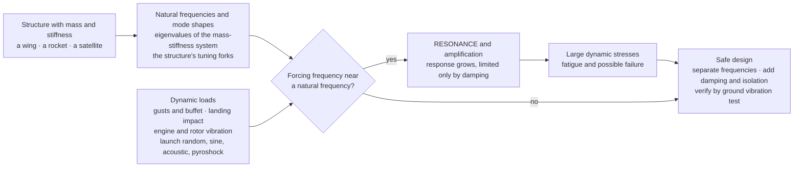

# 〰️ Structural Dynamics and Loads

> [!abstract] TL;DR
> Static strength asks "will it break under this steady load?" — **structural dynamics** asks the harder question: "how does it move, ring, and amplify when the load *changes with time*?" Because a structure has **mass** as well as stiffness, it possesses a set of **natural frequencies** $\omega_i$ and matching **mode shapes** $\boldsymbol{\phi}_i$ — the eigenvalues and eigenvectors of the mass–stiffness system $\mathbf{K}\boldsymbol{\phi}_i = \omega_i^2\mathbf{M}\boldsymbol{\phi}_i$ — the "tuning forks" it loves to vibrate at. Any time-varying disturbance excites a *combination* of these modes; **modal analysis** decomposes the response into independent single-mode oscillators, and **damping** (usually very light in aerospace) limits how tall each resonant peak grows. The danger is **resonance**: when a forcing frequency lands on a natural frequency, the response amplifies enormously — bounded only by damping — driving large stresses, fatigue, and failure. Aerospace structures live in a storm of **dynamic loads**: gusts and buffet, landing impact, engine and rotor vibration, acoustic pressure, and — most brutally for spacecraft — the **launch environment** (quasi-static acceleration, sinusoidal and **random vibration**, acoustics, and **pyroshock** from stage and fairing separation), which sizes much of a satellite's structure. The engineering response is threefold: **compute the modes** (finite-element models validated by a **ground vibration test**), **separate** natural frequencies from expected excitation (the launch-vehicle "frequency window"), and **add damping or isolation** — then **prove it by test** on a shaker table to a specified power-spectral-density (PSD), using tools like **modal superposition**, **random-vibration / Miles' equation**, and **shock-response spectra**. Dynamic loads and resonance — not just static strength — often *size* aerospace structures and cause their failures, tying this note to vibration, aeroelasticity, and fatigue.

---

## Intuition

**Analogy:** Every structure has a set of favourite frequencies at which it *loves* to vibrate — pluck it and it "rings" at these natural tones, exactly like a wine glass that hums at one particular pitch when you run a wet finger around its rim. Trouble comes when the environment happens to push at that very pitch: **resonance**, where small repeated nudges — each perfectly timed — accumulate into violent, structure-shattering motion (the singer who shatters the glass by holding its note). A rocket's engines rumble, a wing meets a train of gusts, a satellite is shaken on the launch pad — and if *any* of these forcings matches a natural frequency, the amplitude does not just add up, it explodes.

Structural dynamics is the art of knowing your structure's natural tones — its **modes** — and then making sure that *nothing in the mission sings the wrong note*. You move the structure's frequencies away from the loud parts of the launch or flight environment, you add damping so any accidental resonance stays finite, and finally you shake the real hardware on a table to prove the analysis was right before it ever flies.

---

## How It Works

### Core Mechanics

Static analysis treats a structure as a spring: apply a force, get a deflection, check the stress. Structural dynamics adds the one ingredient that changes everything — **mass** — and with it inertia, natural frequencies, and time.

1. **Mass plus stiffness gives natural frequencies.** Discretise a structure (a wing, a rocket, a satellite) into a finite-element model with a **mass matrix** $\mathbf{M}$ and a **stiffness matrix** $\mathbf{K}$. With no forcing or damping, free vibration obeys $\mathbf{M}\ddot{\mathbf{x}} + \mathbf{K}\mathbf{x} = \mathbf{0}$. Seeking solutions $\mathbf{x} = \boldsymbol{\phi}\,e^{i\omega t}$ turns this into the **generalized eigenvalue problem**
   $$\mathbf{K}\boldsymbol{\phi}_i = \omega_i^2\,\mathbf{M}\boldsymbol{\phi}_i.$$
   The eigenvalues give the **natural frequencies** $\omega_i$; the eigenvectors give the **mode shapes** $\boldsymbol{\phi}_i$ — the characteristic deformation pattern the structure adopts when ringing at each frequency. These are the structure's tuning forks, fixed by its geometry, material, and boundary conditions alone.

2. **Modal analysis decouples the response.** The mode shapes are $\mathbf{M}$- and $\mathbf{K}$-orthogonal, so transforming into **modal coordinates** turns the coupled multi-degree-of-freedom system into a set of *independent* single-degree-of-freedom oscillators, one per mode. Any real disturbance is a weighted sum of modes, and the total response is the **superposition** of each mode's response. This is why engineers speak of "the first bending mode" or "the fundamental frequency" — a few low modes usually dominate the response, so a huge FE model reduces to a handful of modal oscillators.

3. **Damping limits the resonant peak.** Aerospace structures are *lightly* damped (damping ratio $\zeta$ often 0.5–3%), so free vibration decays slowly and resonant peaks are tall. Each modal oscillator has a magnification $\approx 1/(2\zeta) = Q$ at resonance. Because $\zeta$ is small, $Q$ can be 20–100: a modest cyclic input at a natural frequency produces a *huge* response. Damping is therefore the single lever that keeps an accidental resonance finite.

4. **Resonance is the hazard.** When a **forcing frequency** approaches a **natural frequency** ($\omega_{\text{forcing}} \to \omega_i$), that mode's response amplifies by up to $Q$, limited only by damping. The result is large dynamic stresses, accelerated fatigue, and possible failure. The entire discipline pivots on **frequency separation**: keep every important natural frequency clear of the strong forcing frequencies in the mission.

5. **Aerospace dynamic loads are many and time-varying.** Aircraft see **gust and turbulence** loads (dynamic, coupled to the flight envelope), **landing impact** and ground loads, **buffet** (separated-flow excitation of the tail), and **engine / rotor** vibration. Spacecraft endure the **launch environment**: steady **quasi-static acceleration**, low-frequency **sinusoidal vibration** (thrust build-up, POGO), broadband **random vibration** transmitted through the structure, intense **acoustic** loads at lift-off, and sharp **pyroshock** from explosive stage and fairing separation. Each is a distinct load case with its own analysis method.

6. **From environment to design to test.** The mission's dynamic environment is specified — often as a **power-spectral-density (PSD)** for random vibration, a sine sweep, or a **shock-response spectrum** for pyroshock. Engineers build an FE model, run **modal**, **frequency-response**, **random-vibration (Miles' equation)**, and **transient / shock** analyses, and design the structure to separate frequencies and survive the loads. The model is then validated by a **ground vibration test (GVT)** or **modal survey**, and the flight hardware is qualified on a **shaker table** — base-shaken to the required PSD — before it is cleared to fly.

### Flow / Architecture



---

## Key Concepts

### Secondary Level

- **Everything has favourite vibration notes.** Tap a table, twang a ruler off a desk edge, ping a wine glass — each rings at its own pitch. That pitch is a **natural frequency**, and the shape it wiggles in is a **mode shape**. Stiffer and lighter things ring at a higher pitch.
- **Resonance is the danger.** If something pushes on a structure at exactly its favourite note — over and over, perfectly timed — the wobble grows bigger and bigger until it can break. That is **resonance**, the reason a singer can shatter a glass or a bumpy road can rattle a mirror loose.
- **Rockets and satellites get shaken hard.** A launch is one of the most violent rides in engineering: engines roar, the air thunders, and stages blow apart with a bang. Every satellite must be built to survive this shaking, so engineers shake it on a big table on the ground first to make sure it will not rattle apart in space.
- **The fix: dodge the note and cushion the ride.** Engineers make sure the structure's favourite notes are *different* from the notes the rocket sings, and they add cushioning (damping) so any leftover shaking stays small — then they test it to be sure.

### Undergraduate Level

- **Eigenvalue problem for modes.** Free vibration of $\mathbf{M}\ddot{\mathbf{x}} + \mathbf{K}\mathbf{x} = \mathbf{0}$ gives $\mathbf{K}\boldsymbol{\phi}_i = \omega_i^2\mathbf{M}\boldsymbol{\phi}_i$: natural frequencies $\omega_i$ (eigenvalues) and mode shapes $\boldsymbol{\phi}_i$ (eigenvectors). An $n$-DOF model has $n$ modes; continuous structures have infinitely many.
- **Modal superposition.** Because modes are $\mathbf{M}/\mathbf{K}$-orthogonal, the response decouples into independent modal oscillators $\ddot{q}_i + 2\zeta_i\omega_i\dot{q}_i + \omega_i^2 q_i = \boldsymbol{\phi}_i^{\mathsf{T}}\mathbf{F}(t)$; the physical response is $\mathbf{x}(t) = \sum_i \boldsymbol{\phi}_i q_i(t)$. A few dominant modes usually suffice.
- **Frequency-response function.** Steady harmonic forcing at frequency $\omega$ gives a response $\propto |H(\omega)|$ with peaks at each $\omega_i$ of height $\approx Q_i = 1/(2\zeta_i)$. This is the **dynamic amplification factor / transmissibility** — the resonance curve.
- **Random vibration and PSD.** Launch input is broadband and stochastic, specified as an acceleration **PSD** $W(f)$ in $g^2/\text{Hz}$. The response PSD is $S_{\text{out}}(f) = |H(f)|^2\,W(f)$. For a single mode under a flat PSD, **Miles' equation** gives the RMS response $\sigma_{\text{grms}} = \sqrt{\tfrac{\pi}{2}\,f_n\,Q\,W}$ — a one-line estimate of how hard a resonance rings under random loading.
- **The 3-sigma load.** From $\sigma_{\text{grms}}$, the design limit acceleration is taken as $3\sigma$ (covering ~99.7% of a Gaussian response), multiplied by the local mass to get equivalent static loads for stress checking.
- **Frequency separation / stiffness requirement.** Launch vehicles publish minimum **fundamental frequency** requirements (e.g. lateral $\gtrsim 10$ Hz, axial $\gtrsim 20$–35 Hz for many spacecraft) so the payload's modes do not couple with the vehicle's low-frequency dynamics — a **stiffness**, not strength, requirement.

### Graduate Level

- **Proportional (Rayleigh) damping.** Real damping is non-classical; engineers approximate $\mathbf{C} = \alpha\mathbf{M} + \beta\mathbf{K}$ so modes stay real and the system decouples. Non-proportional damping requires **complex modes** and state-space methods.
- **Craig–Bampton component-mode synthesis.** Large assemblies (spacecraft + launch vehicle) are reduced to **boundary DOFs + fixed-interface modes**, letting the launch authority perform a **coupled loads analysis (CLA)** by mating reduced payload and vehicle models — the industry workflow for verifying launch loads.
- **Random-vibration analysis.** Beyond Miles (which assumes a single mode, flat broadband PSD, and small damping), full multi-DOF random response integrates $\int |H(f)|^2 W(f)\,df$ per response quantity, with modal cross-correlation; the result is RMS stresses and $3\sigma$ loads across the structure.
- **Shock-response spectrum (SRS).** Pyroshock and other transients are characterised by the **SRS**: the peak response of a bank of SDOF oscillators of varying $f_n$ to the transient. High-frequency, high-$g$, short-duration pyroshock rarely threatens primary structure but is lethal to brittle components, relays, and crystals.
- **Model validation by GVT / modal survey.** FE natural frequencies and mode shapes are validated against measured **frequency-response functions** (impact hammer or shaker excitation, accelerometer arrays); the **modal assurance criterion (MAC)** quantifies test-analysis mode-shape correlation, and the model is **updated** until it matches before flight loads are trusted.
- **Coupling to aeroelasticity and fatigue.** Structural dynamics is the common core beneath **aeroelasticity** (modes coupled to unsteady aerodynamics → flutter, an eigenvalue *instability*, not forced resonance) and **fatigue** (dynamic stress *cycles*, counted from the response time history or PSD via spectral fatigue methods). POGO — the axial thrust-oscillation instability coupling propulsion feed dynamics to the vehicle's structural mode — is a structural-dynamics-driven closed-loop instability that has threatened crewed launches.

---

## Python Demo

```python
# Structural dynamics of an aerospace structure, numpy + matplotlib only (no scipy).
#
#   (a) NATURAL MODES -- the eigenvalue problem.  A wing / launch stack is
#       modelled as N lumped masses in a fixed-free (cantilever) chain.
#       Solving  K phi = omega^2 M phi  gives the NATURAL FREQUENCIES
#       (eigenvalues) and MODE SHAPES (eigenvectors) -- the structure's
#       "tuning forks".  We plot the first few mode shapes.
#
#   (b) FREQUENCY RESPONSE / RESONANCE.  The tip receptance |H(f)| is plotted
#       vs forcing frequency, showing a RESONANT PEAK at every natural
#       frequency and how DAMPING (zeta) caps each peak (peak height ~ 1/(2 zeta)).
#
#   (c) RANDOM (LAUNCH) VIBRATION.  A flat acceleration PSD (g^2/Hz) drives the
#       fundamental mode; the transmissibility T(f) amplifies it at resonance,
#       giving a RESPONSE PSD.  The RMS response from the integral is compared
#       with MILES' EQUATION -- why you keep forcing away from natural frequencies.
import numpy as np
import matplotlib.pyplot as plt

# ------------- lumped-mass "wing / launch stack" (fixed-free chain) -------------
N = 8                       # number of lumped masses (stations)
m = 1.0                     # mass per station [kg]
k = 1.0e6                   # inter-station stiffness [N/m]

M = m * np.eye(N)           # diagonal mass matrix
K = np.zeros((N, N))        # fixed-free tridiagonal stiffness matrix
K[0, 0] += k                # spring from the fixed base (root) to mass 0
for i in range(N - 1):      # springs between consecutive masses
    K[i, i]     += k
    K[i + 1, i + 1] += k
    K[i, i + 1] -= k
    K[i + 1, i] -= k
# result: diagonal = [2k, 2k, ..., 2k, k]; the free tip has only one spring.

# ------------- (a) NATURAL MODES: generalised eigenproblem K phi = w^2 M phi -----
# M = m*I, so this reduces to the symmetric eigenproblem of (1/m) K.
evals, evecs = np.linalg.eigh(K / m)     # ascending eigenvalues, orthonormal vecs
omega_n = np.sqrt(evals)                 # natural frequencies [rad/s]
f_n     = omega_n / (2.0 * np.pi)        # [Hz]
phi     = evecs / np.sqrt(m)             # mass-normalise:  phi^T M phi = 1
tip     = N - 1                          # driven / observed station (free tip)

print("=== Natural frequencies (the structure's tuning forks) ===")
for i, f in enumerate(f_n):
    print(f"  mode {i+1}:  f = {f:7.1f} Hz   ( {omega_n[i]:7.1f} rad/s )")

# ------------- (b) tip receptance FRF via modal superposition -------------------
def receptance(w, zeta):
    H = np.zeros_like(w, dtype=complex)
    for i in range(N):
        H += phi[tip, i]**2 / (omega_n[i]**2 - w**2 + 2j*zeta*omega_n[i]*w)
    return H

H_static = np.sum(phi[tip, :]**2 / omega_n**2)     # zero-frequency compliance
f_frf = np.linspace(1.0, 1.25 * f_n[-1], 6000)
w_frf = 2.0 * np.pi * f_frf

# ------------- (c) random (launch) vibration on the fundamental mode ------------
f1     = f_n[0]                       # fundamental frequency [Hz]
W0     = 0.04                         # flat input acceleration PSD [g^2/Hz]
zeta_c = 0.03                         # modal damping (light -> tall peak)
Q      = 1.0 / (2.0 * zeta_c)         # amplification / quality factor
def transmissibility(f, fn, zeta):    # base-excitation accel transmissibility
    r = f / fn
    return np.sqrt((1 + (2*zeta*r)**2) / ((1 - r**2)**2 + (2*zeta*r)**2))

f_int = np.linspace(1.0, 12.0 * f1, 40000)   # wide band for accurate RMS integral
T_int = transmissibility(f_int, f1, zeta_c)
Sout_int = T_int**2 * W0
grms_full  = np.sqrt(np.trapz(Sout_int, f_int))
grms_miles = np.sqrt((np.pi / 2.0) * f1 * Q * W0)   # Miles' equation
print("\n=== Random-vibration response of the fundamental mode ===")
print(f"  fundamental f1 = {f1:.1f} Hz,  Q = 1/(2*zeta) = {Q:.1f},  input W0 = {W0} g^2/Hz")
print(f"  RMS response (band integral) = {grms_full:5.2f} grms")
print(f"  RMS response (Miles equation) = {grms_miles:5.2f} grms  ->  3-sigma = {3*grms_miles:.1f} g")

# ================================ plotting =====================================
fig, ax = plt.subplots(1, 3, figsize=(17, 5))
fig.suptitle("Structural Dynamics and Loads: modes, resonance, random vibration",
             fontsize=13, fontweight="bold")

# (a) mode shapes (prepend a fixed 0 at the root; plot amplitude vs station)
stations = np.arange(N + 1) / N
for i in range(4):
    shape = np.concatenate([[0.0], phi[:, i]])
    shape = shape / np.max(np.abs(shape))          # normalise for display
    ax[0].plot(shape, stations, "-o", lw=2, ms=4,
               label=f"mode {i+1}:  {f_n[i]:.0f} Hz")
ax[0].axvline(0, color="k", lw=0.8)
ax[0].set_title("(a) Mode shapes (the tuning forks)")
ax[0].set_xlabel("modal displacement (normalised)")
ax[0].set_ylabel("station: root (0) -> free tip (1)")
ax[0].legend(fontsize=8); ax[0].grid(alpha=0.3)

# (b) frequency response: resonant peaks and the effect of damping
for zeta, col in [(0.01, "#d62728"), (0.03, "#1f77b4"), (0.08, "#2ca02c")]:
    daf = np.abs(receptance(w_frf, zeta)) / H_static
    ax[1].semilogy(f_frf, daf, lw=1.8, color=col, label=f"zeta = {zeta}")
for fi in f_n:
    ax[1].axvline(fi, color="gray", lw=0.5, ls=":")
ax[1].set_title("(b) Frequency response: a peak at every natural frequency")
ax[1].set_xlabel("forcing frequency  f  [Hz]")
ax[1].set_ylabel("dynamic amplification  |H| / H_static")
ax[1].legend(fontsize=8); ax[1].grid(alpha=0.3, which="both")

# (c) random vibration: flat input PSD, transmissibility, response PSD
f_c = np.linspace(1.0, 3.5 * f1, 3000)
T_c = transmissibility(f_c, f1, zeta_c)
Sin = np.full_like(f_c, W0)
Sout = T_c**2 * Sin
ax[2].semilogy(f_c, Sin,  lw=2, color="gray", ls="--", label=f"input PSD  {W0} g^2/Hz")
ax[2].semilogy(f_c, Sout, lw=2, color="#9467bd", label="response PSD  |T|^2 * W")
ax[2].axvline(f1, color="k", lw=0.8, ls=":")
ax[2].text(f1*1.03, W0*0.3, f"resonance\nf1 = {f1:.0f} Hz", fontsize=8)
ax[2].text(0.5*f1, Sout.max()*0.5,
           f"{grms_miles:.1f} grms RMS\n(Miles)\n-> 3-sigma = {3*grms_miles:.0f} g",
           fontsize=8, color="#9467bd")
ax[2].set_title("(c) Launch random vibration amplified at resonance")
ax[2].set_xlabel("frequency  f  [Hz]")
ax[2].set_ylabel("acceleration PSD  [g^2/Hz]")
ax[2].legend(fontsize=8, loc="upper right"); ax[2].grid(alpha=0.3, which="both")

plt.tight_layout(rect=[0, 0, 1, 0.94])
plt.show()
```

**What it shows.** Panel **(a)** solves the eigenvalue problem $\mathbf{K}\boldsymbol{\phi}=\omega^2\mathbf{M}\boldsymbol{\phi}$ and draws the first four **mode shapes** — the smooth fundamental bend, then shapes with one, two, and three internal nodes — each with its **natural frequency**. These tuning forks depend only on the structure, not the load. Panel **(b)** is the **resonance curve**: the tip's dynamic amplification spikes at *every* natural frequency, and lighter **damping** ($\zeta$) makes each peak taller and sharper (roughly $1/(2\zeta)$) — the visual proof that a lightly-damped aerospace structure amplifies enormously if a forcing lands on a mode. Panel **(c)** is **launch random vibration**: a flat input **PSD** is multiplied by the mode's transmissibility, so the **response PSD** balloons at the resonance $f_1$; the RMS response from the band integral matches **Miles' equation**, and its $3\sigma$ value is the design acceleration. The takeaway is the whole discipline in one figure — *know the modes, and keep the loud parts of the environment away from them*, because at resonance a modest input becomes a structure-sizing load.

---

## Real-World Applications

> **Example — every satellite must survive its launch (shaker-table qualification).** A spacecraft is designed less by its on-orbit loads than by the few minutes of launch. The launch provider's user manual specifies a **quasi-static** acceleration (several $g$ axial + lateral), a low-frequency **sine** environment, a broadband **random-vibration PSD** (often tens of $g_{\text{rms}}$ at the component level), an **acoustic** spectrum, and a **pyroshock** SRS. Before flight, the flight structure is bolted to a **shaker table** and **base-shaken** to these levels — a sine sweep to find and track its modes, then a random run to the qualification PSD — while accelerometers confirm it neither over-responds nor shifts frequency (a frequency shift between low-level runs signals a crack or loosened joint). This test, more than any static test, sizes the primary structure.

> **Example — the launch-vehicle frequency window and coupled loads analysis.** Rockets like Falcon 9, Ariane, and Atlas publish **minimum stiffness** requirements — a payload's first lateral mode above ~10 Hz and first axial mode above ~25–35 Hz — so the spacecraft's modes do not couple with the vehicle's low-frequency bending and POGO dynamics. The launch authority then runs a **coupled loads analysis (CLA)**, mating a **Craig–Bampton**-reduced spacecraft model to the vehicle model and forcing it with lift-off, transonic, and engine-transient events to predict the actual flight loads at every interface — the definitive dynamic-loads verification before flight.

> **Example — aircraft gust, buffet, landing, and ground vibration testing.** An aircraft's structure responds *dynamically*, not just statically, to a discrete $(1-\cos)$ gust and to continuous turbulence (von Kármán PSD), so gust loads are computed from the *elastic* airframe's frequency response — flexible wings amplify certain gust frequencies. Tail **buffet** from separated flow, wing/store flutter margins, and **landing impact** are all dynamic cases. Every new airframe undergoes a **ground vibration test (GVT)** — the whole aircraft on soft supports, shaken and struck to measure its natural frequencies and mode shapes — to validate the FE model that underlies both loads and flutter clearance.

> **Example — POGO and thrust oscillation.** In liquid rockets, a structural axial mode can couple with the propellant feed system and combustion to form **POGO**, a self-excited longitudinal oscillation that shook the Apollo/Saturn V second stage and threatened Gemini crews. It is suppressed with feed-line **accumulators** that detune the fluid dynamics away from the structural mode — a textbook resonance-avoidance fix at the propulsion–structure interface.

---

## Common Pitfalls

- **Checking static strength but ignoring dynamics.** A structure can pass every static stress check and still fail in service because a *dynamic* load at a resonance drives stresses far above the static prediction. Dynamic amplification of $Q = 1/(2\zeta) = 20$–$100$ means a 1 g input can produce a 50 g response at a mode. Always compute the modes and the dynamic response, not just the static margins.
- **Treating resonant response as if damping did not matter — or as if it were large.** Aerospace damping is *light* ($\zeta$ often 0.5–3%), so resonant peaks are tall and narrow. Assuming textbook 5–10% damping badly *under*-predicts the response; assuming zero damping predicts an unphysical infinite response. Get $\zeta$ from test data, and never rely on damping you cannot demonstrate.
- **Missing modes / truncating modal superposition too early.** Keeping only the first mode can miss a higher mode that a sharp transient (pyroshock, landing) excites strongly. Include enough modes to capture the effective modal mass in the excitation band (often 80–90% of the total mass), and add a residual/static correction for the truncated high-frequency modes.
- **Analysing to a PSD but forgetting the 3-sigma factor.** Random-vibration response is a *distribution*, not a single number. Designing to the RMS ($1\sigma$) grossly under-sizes the structure; the standard design load is $3\sigma$ (covering ~99.7% of the Gaussian peaks). Confusing RMS with peak load is a classic random-vibration error.
- **Trusting an unvalidated FE model.** Predicted natural frequencies can be 10–30% off before model updating because joints, boundary conditions, and damping are hard to model. Frequencies that are off shift resonances into (or out of) the excitation band. Validate against a **GVT / modal survey** (using the MAC) before trusting flight loads.
- **Confusing forced resonance with self-excited instability.** Flutter, POGO, and whirl draw energy from a steady flow or feed system and grow with *no external periodic forcing* — they are eigenvalue (stability) problems, not magnification-factor problems. A "no resonant forcing present" argument does not make a design safe against them. (See the sibling *Aeroelasticity_and_Flutter*.)
- **Ignoring frequency shift as a damage signal.** During a vibration test, a drop in a measured natural frequency between low-level runs means the structure has softened — a crack, a debonded joint, a loosened fastener. Treating it as noise instead of a red flag has let damaged hardware pass qualification.

---

## Related Concepts

- [[Mechanical_Vibrations]] — the single-degree-of-freedom master model ($m\ddot{x}+c\dot{x}+kx=F$), natural frequency, damping ratio, resonance, and modal analysis that this note applies to full aerospace structures.
- [[Oscillations_and_SHM]] — the physics parent: simple, damped, and driven harmonic oscillators and normal modes that underpin every natural frequency and resonant peak here.
- [[Eigenvalues_and_Eigenvectors]] — the linear-algebra engine of modal analysis: natural frequencies are the eigenvalues and mode shapes the eigenvectors of $\mathbf{K}\boldsymbol{\phi}=\omega^2\mathbf{M}\boldsymbol{\phi}$.
- [[Balancing_and_Rotordynamics]] — rotating-machinery vibration, critical speeds, and unbalance forcing ($F=m_e e\,\omega^2$) that excite engine, rotor, and turbopump modes on the aerospace structure.
- [[Fourier_Transform]] — the spectral machinery behind PSDs and frequency-response: it decomposes random gust and launch excitation into the harmonic components that drive resonance and feeds the random-vibration analysis.
- [[Airframe_Loads_and_the_Flight_Envelope]] — supplies the quasi-static maneuver and gust load factors; this note extends that envelope into the *dynamic* gust, buffet, and flutter response of the flexible airframe.

This note is the **dynamics-and-loads core** of the *Aerospace_Engineering / Aerospace Structures and Materials* section, and it ties the structural cluster together. Its sibling notes carry the story onward: *Aerospace_Structures_and_Airframes* sizes the spar caps, skins, and frames that these dynamic loads act on; *Aeroelasticity_and_Flutter* couples the same modes to unsteady aerodynamics to produce flutter and divergence (self-excited instability rather than forced resonance); *Fatigue_and_Damage_Tolerance* counts the cyclic dynamic stresses — gusts, pressurization, landings, launch vibration — that govern service life; *Airframe_Loads_and_the_Flight_Envelope* provides the quasi-static loads this note makes dynamic; and *Spacecraft_Systems_Engineering* frames the launch environment, qualification testing, and margins at the mission level.

---

## Review Questions

1. **Secondary:** Using the wine-glass-and-singer analogy, explain what a "natural frequency" is and what "resonance" means. Why must every satellite be shaken on a table on the ground before it is launched, and what are engineers doing when they make sure the satellite's favourite vibration notes are *different* from the rocket's?
2. **Undergraduate:** A spacecraft component is modeled as a single mode with natural frequency $f_n = 120$ Hz and damping ratio $\zeta = 0.02$. It must survive a flat random-vibration input of $W = 0.05\ g^2/\text{Hz}$. (a) Compute the amplification $Q$ and the RMS response using Miles' equation $\sigma = \sqrt{\tfrac{\pi}{2} f_n Q W}$. (b) What design ($3\sigma$) acceleration should the bracket be sized to? (c) The launch provider requires the first mode above 100 Hz — explain physically why *stiffening* the component (raising $f_n$) is the required fix and what it does to the response.
3. **Graduate:** You have an FE model whose first predicted natural frequency is 18 Hz, but the launch vehicle's dominant low-frequency energy sits at 12–20 Hz. (a) Describe how a **ground vibration test / modal survey** would validate or correct the model, and how the **MAC** quantifies mode-shape agreement. (b) The measured first frequency turns out to be 14 Hz — inside the vehicle's energy band — what are your options (frequency separation vs damping vs isolation), and what does a **coupled loads analysis** add that a standalone random-vibration analysis misses? (c) Contrast this forced-resonance problem with **flutter** and **POGO**, and explain why those are eigenvalue-stability problems rather than magnification-factor problems.

---

## Sources

- R. R. Craig & A. J. Kurdila — *Fundamentals of Structural Dynamics*, 2nd ed. (Wiley, 2006) — the eigenvalue problem, modal analysis, frequency and transient response, and component-mode synthesis.
- L. Meirovitch — *Fundamentals of Vibrations* (Waveland Press, 2010) — single- and multi-DOF vibration, natural frequencies and mode shapes, forced and random response.
- J. J. Wijker — *Spacecraft Structures* (Springer, 2008) — launch environment, random vibration, Miles' equation, sine and acoustic loads, and vibration qualification testing.
- T. P. Sarafin (ed.) — *Spacecraft Structures and Mechanisms: From Concept to Launch* (Microcosm / Springer, 1995) — dynamic loads, coupled loads analysis, frequency requirements, and test verification.
- NASA — *General Environmental Verification Standard (GEVS), GSFC-STD-7000* — random-vibration, sine, acoustic, and shock qualification/acceptance levels and the workmanship PSD used across spacecraft programs.

---

#aerospace-engineering #structural-dynamics #vibration #resonance #modal-analysis
