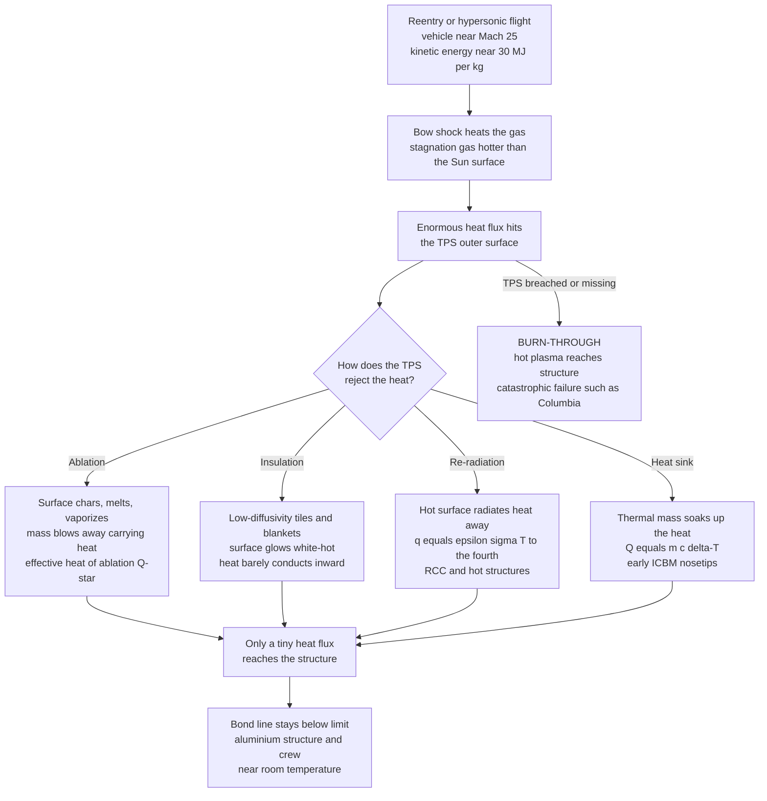

# 🛡️ Thermal Protection Systems: Ablation, Insulating Tiles, and Re-Radiation

> [!abstract] TL;DR
> A **thermal protection system (TPS)** is the sacrificial or insulating skin that lets a vehicle survive **aerodynamic heating** so extreme that the gas around it is hotter than the surface of the Sun, while the aluminium structure and crew just centimetres away stay near room temperature. The threat is not temperature alone but **heat flux** $\dot{q}$ — during re-entry a blunt body's bow shock dumps most of the vehicle's ~30 MJ/kg of kinetic energy into the shock-heated gas, and stagnation heating scales roughly as $\dot{q}\propto\sqrt{\rho/R_n}\,V^3$ (Sutton–Graves), reaching hundreds of kW/m². A TPS defeats this with four mechanisms, usually combined: **ablation** (the surface chars, melts, and vaporizes, carrying heat away as mass leaves at an *effective heat of ablation* $Q^*$, so $\dot{m}''=\dot{q}_{net}/Q^*$ — capsules, PICA, AVCOAT); **insulation** (low-conductivity silica tiles and blankets so the surface glows white-hot but during the brief pulse the thermal wave never reaches the **bond line** — the Space Shuttle); **re-radiation** (a hot surface sheds heat as $\dot{q}=\varepsilon\sigma T^4$, setting a *radiative-equilibrium* temperature — reinforced carbon-carbon leading edges and hot structures); and **heat-sink** (soak heat into thermal mass — early ICBMs). TPS is **mass-critical** and a **single-point failure**: *Columbia* was lost in 2003 to a single breached carbon-carbon panel. It is the enabling technology for every capsule, the Shuttle, Mars landers, sample return, ICBM re-entry vehicles, and hypersonic vehicles — the field where applied heat transfer, materials, and the re-entry environment meet and where failure is catastrophic.

---

## Intuition

**Analogy:** A spacecraft returning from orbit is wrapped, for a few searing minutes, in gas hotter than the surface of the Sun — and yet its aluminium airframe and crew, a few centimetres inside, must stay at room temperature. Two everyday tricks make this possible. The first is a **candle deliberately consuming itself**: an **ablative** heat shield lets its own outer surface char, melt, and boil away, so the heat leaves *with the departing material* instead of soaking inward — the shield is destroyed on purpose to save what is behind it. The second is a **just-baked ceramic tile you can hold by its edges while the middle still glows**: an **insulating** shield conducts heat so poorly that the outside can be white-hot while the inside stays cool, because the brief heat pulse ends before the warmth can crawl through.

Both tricks buy the same thing — *time and distance* between the fireball outside and the structure inside. And both are unforgiving. Get the shield too thin, install it wrong, or let a single tile break, and the fireball reaches the aluminium. In 2003 the Space Shuttle *Columbia* was lost exactly this way: a breach in one reinforced carbon-carbon panel let the plasma inside the wing, and the vehicle came apart. The TPS is the thinnest, most consequential few centimetres on the whole vehicle.

---

## How It Works

### Core Mechanics

1. **The threat: heat flux, not just temperature.** Re-entry from low Earth orbit happens near 7.8 km/s (Mach ~25), carrying a kinetic energy of about $\tfrac12 V^2 \approx 30$ MJ per kilogram. That energy has to go somewhere as the vehicle decelerates. Most of it is dumped into the atmosphere by the **bow shock** (see the sibling re-entry and hypersonics notes), which compresses and heats the gas to many thousands of kelvin. What the TPS must survive is the **heat flux** $\dot{q}$ (W/m²) delivered to its surface — a *rate*, not a temperature. Thermodynamics says heat flows hot-to-cold; heat transfer says *how fast*, and that rate is what burns through.

2. **Blunt is better (the Allen–Eggers insight).** A slender, "aerodynamic" nose would be a mistake. A **blunt body** stands its bow shock well *off* the surface, so the enormous energy heats a large volume of gas that is then swept away, rather than being conducted straight into the vehicle. Convective stagnation-point heating scales roughly as
   $$\dot{q}_{s}\;\propto\;\sqrt{\frac{\rho_\infty}{R_n}}\;V^3,$$
   so a **larger nose radius $R_n$ lowers the peak heat flux**. This is why capsules from Mercury to Orion are blunt: they trade drag for survivability.

3. **Mechanism 1 — Ablation (carry heat away as mass).** An **ablator** is designed to be consumed. As the surface heats, a resin (phenolic) **pyrolyzes** into gas and a porous **char**; the surface material melts, sublimes, and erodes. Two things protect the structure: the **latent heats** of these phase changes absorb energy, and the **pyrolysis gases blown off the wall thicken the boundary layer and block incoming convective heat** (transpiration/"blowing"). The bookkeeping is the **effective heat of ablation** $Q^*$ (J/kg) — the heat carried away per unit mass lost:
   $$\dot{m}'' = \frac{\dot{q}_{net}}{Q^*}.$$
   A higher $Q^*$ means less material sacrificed per unit heat. Ablators are simple, robust, and mass-efficient for severe one-time entries, but they are **single-use**. Examples: **PICA** (phenolic-impregnated carbon ablator), **AVCOAT** (Apollo, Orion), and dense **carbon phenolic** for the most brutal entries.

4. **Mechanism 2 — Insulation (delay the heat with low conductivity).** A **reusable** TPS instead relies on materials with very low **thermal diffusivity** $\alpha = k/(\rho c)$. The surface still gets glowing hot, but during the brief heating pulse the thermal wave penetrates only a depth of order $\sqrt{\alpha\,t}$; if the tile is thicker than that, the **bond line** (the glued interface to the structure) never gets the message before the pulse is over. This is transient conduction, governed by the heat equation $\partial T/\partial t = \alpha\,\nabla^2 T$ (see *[[Conduction_Heat_Transfer]]*). The Space Shuttle's **silica tiles** (94% empty space, so light and so insulating you could hold a red-hot one by the corners) are the canonical example, together with flexible **insulation blankets** and **AETB** ceramics.

5. **Mechanism 3 — Re-radiation (throw heat back out as light).** Any hot surface radiates according to the Stefan–Boltzmann law, $\dot{q}_{rad} = \varepsilon\sigma T^4$ (see *[[Convection_and_Radiation]]*). A **radiatively cooled hot structure** reaches a **radiative-equilibrium** surface temperature where the re-radiated flux balances the incoming aeroheating:
   $$\varepsilon\sigma T_s^4 \approx \dot{q}_{aero} \quad\Rightarrow\quad T_s \approx \left(\frac{\dot{q}_{aero}}{\varepsilon\sigma}\right)^{1/4}.$$
   Because of the fourth power, the surface temperature is *capped* — doubling the heat flux raises $T_s$ by only ~19%. High-emissivity black coatings maximize this rejection. **Reinforced carbon-carbon (RCC)** wing leading edges and nose caps, and hypersonic hot structures, work this way.

6. **Mechanism 4 — Heat-sink (soak it into thermal mass).** The crudest option: bond a slab of high heat-capacity metal (copper, beryllium) that simply absorbs the energy as $Q = m\,c\,\Delta T$. Used on **early ICBM re-entry vehicles**, it is heavy and only works for very short pulses, so it has largely been replaced by ablators and radiative nosetips.

7. **Sizing the thickness — the bond-line criterion.** TPS design is fundamentally an optimization: make the shield **thick enough** that the **peak bond-line temperature stays below the structure's limit** (aluminium ~150–175 °C, or the adhesive limit), but **thin enough** to save mass. Critically, the **peak bond-line temperature lags the peak heating** and occurs during the post-pulse *soak-through*, as heat stored in the outer layer redistributes inward. Sizing off the peak surface temperature alone is a classic error.

8. **Materials families (the toolbox).** **Ablators** (PICA, AVCOAT, carbon phenolic) for capsules and probes; **reusable ceramic tiles and blankets** (silica, AETB, TUFI/RCG coatings) for winged reusables; **RCC** for radiatively cooled leading edges; **ultra-high-temperature ceramics (UHTCs)** — borides and carbides of zirconium, hafnium, tantalum with melting points above 3000 °C — for **sharp** hypersonic leading edges; and **active cooling** (regenerative, film, transpiration) for engine hot sections, where coolant carries the heat away (see Sutton's rocket cooling).

### Flow / Architecture



---

## Key Concepts

**Secondary (intuitive core).**
- **Heat shield** — the protective skin that lets a returning spacecraft survive being wrapped in gas hotter than the Sun's surface.
- **Ablation is a candle burning on purpose** — the shield's surface chars and boils away, and the heat leaves *with* the departing material.
- **Insulation is a glowing tile you can hold by the edge** — the surface is white-hot but the material blocks heat so well the inside stays cool for the short time it matters.
- **Re-radiation is a hot surface glowing heat back out** — like a stove element radiating; the hotter it gets, the harder it dumps heat as light.
- **A single failure can be fatal** — *Columbia* was lost to one breached panel; there is no forgiving margin when the fireball gets inside.

**Undergraduate (quantitative core).**
- **Heat flux vs total heat load** — the material threat is $\dot{q}$ (W/m², peak burn-through) *and* the time-integrated load $\int\dot{q}\,dt$ (J/m², soak-through); both matter, and they peak at different times.
- **Blunt-body heating** — stagnation heat flux $\dot{q}_s\propto\sqrt{\rho/R_n}\,V^3$; a larger nose radius lowers peak heating (Allen–Eggers).
- **Effective heat of ablation** — $\dot{m}''=\dot{q}_{net}/Q^*$; higher $Q^*$ (MJ/kg) means less recession per unit heat absorbed.
- **Radiative equilibrium** — $T_s=(\dot{q}_{aero}/\varepsilon\sigma)^{1/4}$; the fourth-power law caps surface temperature and rewards high emissivity.
- **Transient-conduction sizing** — solve $\partial T/\partial t=\alpha\nabla^2 T$ so the bond line stays under limit; penetration depth $\sim\sqrt{\alpha t}$; **Biot** and **Fourier** numbers govern the transient.
- **TPS material families** — ablators (PICA, AVCOAT, carbon phenolic), reusable ceramic tiles and blankets (silica, AETB), RCC, UHTCs, active cooling — matched to peak flux, load, and reusability.

**Graduate (advanced and coupled).**
- **Heating correlations** — **Sutton–Graves** (convective stagnation) and **Fay–Riddell** (dissociated boundary layer) scalings; radiative heating becomes important at very high speeds (lunar/Mars return).
- **Convective blocking (blowing)** — pyrolysis and ablation gases injected into the boundary layer reduce the convective heat-transfer coefficient; the "blowing correction" is central to ablator performance.
- **Coupled ablation–pyrolysis–conduction** — moving-boundary (recession) problems with an in-depth char/pyrolysis zone, solved by codes like CMA/FIAT; $Q^*$ is *not* constant but depends on flux, enthalpy, and blowing.
- **Surface catalycity** — a chemically catalytic wall lets dissociated atoms recombine at the surface, releasing their dissociation energy and *raising* heating; low-catalycity coatings (like RCG on Shuttle tiles) suppress this — a first-order design lever.
- **Thermostructural coupling** — thermal-expansion mismatch, strain-isolation pads, gap heating between tiles, and coating oxidation (carbon-carbon must be SiC-coated or it burns) tie TPS to *[[Fatigue_Creep_and_High_Temperature_Failure]]* and *[[Ceramics_and_Glasses]]*.
- **Active and regenerative cooling** — transpiration and film cooling, and regeneratively cooled engine walls where propellant absorbs the heat before combustion (Sutton), the boundary between TPS and propulsion thermal management.

---

## Python Demo

```python
# Thermal Protection Systems: heat rejection & insulation (numpy + matplotlib, no scipy).
# (a) TRANSIENT CONDUCTION through a silica-tile TPS layer under a reentry heat pulse
#     -> through-thickness temperature profiles + surface/bond-line histories,
#        showing the hot surface and the cool back face (bond line) below the limit.
# (b) RE-RADIATION equilibrium surface temperature vs heat flux, and ABLATION
#     mass-loss rate vs heat flux for different effective heats of ablation Q*.
import numpy as np
import matplotlib.pyplot as plt

sigma = 5.670374419e-8            # Stefan-Boltzmann constant [W/m^2/K^4]

# =====================================================================
# (a) TRANSIENT 1D CONDUCTION THROUGH THE TPS  (hand-rolled finite difference)
#     dT/dt = alpha d2T/dx2 ; explicit FTCS. Outer surface takes a reentry
#     aeroheating pulse and RE-RADIATES; back face (bond line) is insulated
#     (worst case). Material: reusable silica insulation, LI-900-like.
# =====================================================================
k     = 0.05                      # thermal conductivity [W/m.K] (low = good insulator)
rho   = 144.0                     # density [kg/m^3]
cp    = 1050.0                    # specific heat [J/kg.K]
alpha = k / (rho * cp)            # thermal diffusivity [m^2/s]  (~3.3e-7)
eps   = 0.90                      # surface emissivity (black high-emittance coating)
L     = 0.06                      # TPS thickness [m]  (6 cm tile)
T_amb = 293.0                     # ambient / radiation-sink temperature [K]
T_lim = 175.0 + 273.15            # aluminium bond-line limit [K]  (~175 C)

nx = 41
dx = L / (nx - 1)
dt = 0.10                         # [s]
Fo = alpha * dt / dx**2           # grid Fourier number (<< 0.5 -> stable)
t_end  = 3000.0
nsteps = int(t_end / dt)

# Reentry aeroheating pulse: Gaussian in time [W/m^2]
q_peak, t0, tau = 200.0e3, 400.0, 140.0
def q_aero(t):
    return q_peak * np.exp(-((t - t0) / tau) ** 2)

x = np.linspace(0.0, L, nx)
T = np.full(nx, T_amb)
Chalf = rho * cp * (dx / 2.0)     # heat capacity of a boundary half-cell [J/m^2.K]

snap_times = [150, 300, 400, 600, 1000, 2000]
snaps = {}
t_hist, q_hist, surf_hist, back_hist = [], [], [], []

t = 0.0
for n in range(nsteps + 1):
    t_hist.append(t);        q_hist.append(q_aero(t))
    surf_hist.append(T[0]);  back_hist.append(T[-1])
    for ts in snap_times:
        if ts not in snaps and t >= ts:
            snaps[ts] = T.copy()

    Tn = T.copy()
    # interior nodes (vectorized central difference)
    Tn[1:-1] = T[1:-1] + Fo * (T[2:] - 2.0 * T[1:-1] + T[:-2])
    # surface node: aeroheating IN, re-radiation OUT, conduction inward (half-cell balance)
    q_net = q_aero(t) - eps * sigma * (T[0] ** 4 - T_amb ** 4)
    Tn[0] = T[0] + dt / Chalf * (q_net - k * (T[0] - T[1]) / dx)
    # back face: insulated (zero flux) -> conservative bond-line temperature
    Tn[-1] = T[-1] + dt / Chalf * (k * (T[-2] - T[-1]) / dx)
    T = Tn
    t += dt

t_hist  = np.array(t_hist);  q_hist  = np.array(q_hist)
surf_hist = np.array(surf_hist); back_hist = np.array(back_hist)
print(f"alpha = {alpha:.2e} m^2/s,  Fo = {Fo:.3f}  (stable)")
print(f"peak surface T   = {surf_hist.max() - 273.15:6.1f} C")
print(f"peak bond-line T = {back_hist.max() - 273.15:6.1f} C   (limit 175 C)")

# =====================================================================
# (b) HEAT REJECTION:  re-radiation equilibrium  and  ablation mass loss
# =====================================================================
q = np.linspace(10e3, 1.0e6, 400)                 # incident heat flux [W/m^2]
T_rad = (q / (eps * sigma)) ** 0.25 - 273.15      # radiative-equilibrium surface T [C]

# Ablation: mass carried away per area  mdot'' = q / Q*   [kg/m^2/s]
Qstar = {"Low-performance ablator, Q* = 5 MJ/kg":  5.0e6,
         "PICA-class ablator, Q* = 12 MJ/kg":     12.0e6,
         "Carbon phenolic, Q* = 30 MJ/kg":        30.0e6}

# =====================================================================
# PLOTS
# =====================================================================
fig, ax = plt.subplots(2, 2, figsize=(13, 10))

# (a1) through-thickness temperature profiles
for ts in snap_times:
    ax[0, 0].plot(x * 100, snaps[ts] - 273.15, lw=2, label=f"t = {ts} s")
ax[0, 0].axhline(T_lim - 273.15, color="k", ls="--", lw=1.5, label="Al bond-line limit 175 C")
ax[0, 0].set_title("(a) Transient conduction through a 6 cm silica tile\n"
                   "hot outer surface, cool back face (bond line)")
ax[0, 0].set_xlabel("depth into TPS [cm]   (0 = heated surface)")
ax[0, 0].set_ylabel("temperature [C]")
ax[0, 0].legend(fontsize=8); ax[0, 0].grid(alpha=0.3)

# (a2) surface & bond-line temperature histories + heat pulse (twin axis)
ax2 = ax[0, 1]
ax2.plot(t_hist, surf_hist - 273.15, "r", lw=2, label="outer surface")
ax2.plot(t_hist, back_hist - 273.15, "b", lw=2, label="bond line (back face)")
ax2.axhline(T_lim - 273.15, color="k", ls="--", lw=1.5, label="Al limit 175 C")
ax2.set_xlabel("time [s]"); ax2.set_ylabel("temperature [C]")
ax2.set_title("(a) Temperature histories\nback face lags and soaks well below the limit")
ax2.legend(loc="center right", fontsize=8); ax2.grid(alpha=0.3)
axq = ax2.twinx()
axq.plot(t_hist, q_hist / 1e3, "g:", lw=1.5)
axq.set_ylabel("aeroheating pulse [kW/m^2]", color="g")
axq.tick_params(axis="y", colors="g")

# (b1) radiative-equilibrium surface temperature vs heat flux
ax[1, 0].plot(q / 1e3, T_rad, "purple", lw=2)
ax[1, 0].axhline(1260, color="orange",   ls="--", lw=1.3, label="silica tile ~1260 C")
ax[1, 0].axhline(1650, color="firebrick", ls="--", lw=1.3, label="RCC ~1650 C")
ax[1, 0].set_title("(b) Re-radiation cooling:  q = eps*sigma*T^4\n"
                   "surface temperature set by radiative equilibrium")
ax[1, 0].set_xlabel("incident heat flux [kW/m^2]")
ax[1, 0].set_ylabel("equilibrium surface T [C]")
ax[1, 0].legend(fontsize=8); ax[1, 0].grid(alpha=0.3)

# (b2) ablation mass-loss rate vs heat flux
for name, Qs in Qstar.items():
    ax[1, 1].plot(q / 1e3, (q / Qs) * 1e3, lw=2, label=name)   # g/m^2/s
ax[1, 1].set_title("(b) Ablation: mass carried away = q / Q*\n"
                   "higher heat of ablation -> less recession")
ax[1, 1].set_xlabel("incident heat flux [kW/m^2]")
ax[1, 1].set_ylabel("mass-loss rate [g/m^2/s]")
ax[1, 1].legend(fontsize=8); ax[1, 1].grid(alpha=0.3)

plt.tight_layout()
plt.savefig("thermal_protection_systems.png", dpi=120)
print("saved thermal_protection_systems.png")
```

**What it shows.** Part (a) integrates the 1-D heat equation through a 6 cm silica tile hit by a Gaussian re-entry heat pulse, with the surface re-radiating ($\varepsilon\sigma T^4$) and the bond line insulated (the worst case). The outer surface flares to well over 1000 °C and *glows*, yet because the tile's thermal diffusivity is tiny (~$3\times10^{-7}$ m²/s) the thermal wave penetrates only a depth of order $\sqrt{\alpha t}\approx 3$ cm over the whole event — so the **bond line barely warms and stays far below the 175 °C aluminium limit**, and its peak arrives *after* the heating pulse (the soak-through), exactly the design driver. Part (b) plots the two rejection physics: the **radiative-equilibrium** surface temperature $T=(\dot{q}/\varepsilon\sigma)^{1/4}$ (note how the fourth-power law flattens the curve — huge flux increases barely move $T$, and how silica tiles vs RCC set the usable ceiling), and the **ablation** mass-loss rate $\dot{m}''=\dot{q}/Q^*$, where a higher effective heat of ablation buys much slower recession for the same heat load.

---

## Real-World Applications

> **Apollo and Orion — ablative capsules.** Apollo re-entered from the Moon at ~11 km/s and used an **AVCOAT** ablator (an epoxy-novolac resin in a fiberglass honeycomb) that charred and boiled away, carrying the heat with it. NASA's **Orion** revived AVCOAT for lunar-return Artemis missions. Ablation is chosen here because the entry is severe, one-time, and mass-efficiency and robustness matter more than reuse.

> **Space Shuttle — the reusable tile mosaic (and RCC).** The Shuttle's underside was tiled with ~24,000 individually shaped **silica tiles** (HRSI/LRSI) — so insulating and light that a glowing tile could be held by its edges — backed by flexible blankets, all sized so the aluminium airframe stayed under ~175 °C. The hottest zones, the **wing leading edges and nose cap**, used radiatively cooled **reinforced carbon-carbon (RCC)**. Reuse came at the cost of enormous inspection, waterproofing, and repair burden.

> **Columbia (STS-107) — the single-point failure.** During launch a piece of foam struck an RCC panel on the left wing, punching a hole. On re-entry, plasma near 1650 °C entered the wing through that breach, melted the aluminium spar and structure from the inside, and the vehicle broke up, killing all seven crew. It is the defining lesson that TPS is a **single-point, zero-margin** system demanding inspection, repair capability, and design margin.

> **SpaceX Dragon and Mars entry — PICA.** SpaceX flies **PICA-X**, an in-house version of NASA Ames's **PICA** (phenolic-impregnated carbon ablator), on Crew/Cargo Dragon. PICA is a lightweight, high-$Q^*$ ablator first flown on the **Stardust** sample-return capsule (the fastest human-made re-entry on record) and used for the **Mars Science Laboratory / Perseverance** aeroshells. Its low density plus high heat of ablation make it ideal for high-heat-flux, mass-constrained entries.

> **Galileo probe and ICBM nosetips — the extremes.** The **Galileo** Jupiter-entry probe hit the atmosphere at ~47 km/s and ablated away roughly half its heat-shield mass in dense **carbon phenolic** — the most brutal TPS ever flown. **ICBM re-entry vehicles** use carbon-carbon nosetips (and historically heat-sink designs) to survive high-speed, high-deceleration re-entry. At the other end, rocket engine hot sections use **regenerative cooling** (Sutton), routing propellant through channels in the nozzle wall — active cooling as the propulsion cousin of TPS.

---

## Common Pitfalls

- **Sizing by peak surface temperature instead of the integrated load.** The structural threat is the **bond-line** temperature, whose peak arrives during the post-pulse *soak-through* and depends on $\int\dot{q}\,dt$ and thickness — not on the instantaneous surface temperature. Design off the surface peak and you can badly undersize the shield.
- **Confusing insulation with heat-sink.** Insulation (low $k$, low $\alpha$) *delays* heat; a heat-sink (high $\rho c$) *absorbs* it. They have different mass penalties and different failure modes — an insulator that fully soaks through has failed even though it never "ran out of mass."
- **Treating the effective heat of ablation $Q^*$ as a fixed constant.** Real $Q^*$ depends on heat flux, boundary-layer enthalpy, and blowing rate; using a single textbook value can dangerously over- or under-predict recession.
- **Ignoring surface catalycity.** A chemically catalytic wall lets dissociated O and N atoms recombine at the surface and dump their dissociation energy, sharply *raising* heating. Low-catalycity coatings (like the Shuttle's RCG) are a deliberate, first-order design choice — omit them from the model and heating is underestimated.
- **Forgetting carbon-carbon oxidizes.** Bare carbon-carbon burns in hot oxidizing flow; it survives only because of a silicon-carbide conversion coating. Any coating crack or breach exposes bare carbon — part of the *Columbia* chain.
- **Neglecting gaps, coatings, and thermal-expansion mismatch.** Tile-to-tile gaps admit local "gap heating," and thermal-expansion mismatch between a stiff ceramic and a flexing airframe cracks tiles unless strain-isolation pads decouple them. TPS is a thermostructural problem, not just a thermal one.
- **Assuming reusability is free.** Reusable tiles carry a heavy tax of inspection, waterproofing, micrometeoroid/debris damage, and repair — sometimes making a single-use ablator the cheaper, safer choice for a given mission.
- **Modeling re-radiation as a cure-all.** The fourth-power law *caps* surface temperature but does not remove all heat; the residual conducted flux still soaks inward, and radiative equilibrium assumes the surface can actually reach that temperature without melting or oxidizing first.

Sibling notes in this Aerospace structures-and-materials section, referenced in prose: *Aerospace_Materials_and_Composites* (the material families — carbon-carbon, ceramics, phenolic composites — behind every TPS), *Aerospace_Structures_and_Airframes* (the aluminium/titanium primary structure the TPS protects and the thermostructural coupling between them), and the aerodynamics siblings *Atmospheric_Reentry_and_Hypersonics* and *Supersonic_and_Hypersonic_Aerodynamics* (the bow-shock, stagnation-heating, and real-gas environment that *creates* the heat load).

---

## Related Concepts

- [[Conduction_Heat_Transfer]] — the transient heat equation $\partial T/\partial t=\alpha\nabla^2 T$ used to size a tile's thickness so the bond line stays under limit; low thermal diffusivity is what makes insulation work.
- [[Convection_and_Radiation]] — the two heat-transfer modes at the surface: convective aeroheating delivers the load, and Stefan–Boltzmann re-radiation ($\varepsilon\sigma T^4$) rejects part of it and sets the radiative-equilibrium temperature.
- [[Ceramics_and_Glasses]] — the silica tiles, AETB, RCG coatings, and ultra-high-temperature ceramics whose low conductivity and high melting points make reusable and hot-structure TPS possible.
- [[Fatigue_Creep_and_High_Temperature_Failure]] — why materials degrade at TPS temperatures: creep, oxidation, and thermal-cycling fatigue set the real service limits of hot structures and coatings.
- [[Composite_Materials_and_Fiber_Reinforcement]] — reinforced carbon-carbon and phenolic-carbon ablators (PICA, AVCOAT, carbon phenolic) are fiber-reinforced composites; their architecture governs both ablation and strength.
- [[Thermal_Properties_and_Heat_Conduction]] — the materials-science origin of $k$, $\alpha$, and heat capacity that decide whether a material insulates, radiates, or soaks heat.
- [[Laws_of_Thermodynamics]] — the Second Law that fixes heat flow hot-to-cold (so the TPS only ever *slows* the flow) and underlies the Stefan–Boltzmann radiation that re-radiative cooling exploits.

---

## Review Questions

1. **(Secondary)** In your own words, explain the difference between an **ablative** heat shield and an **insulating** tile using the "candle" and "glowing tile you can hold" images. Why does each one keep the inside cool?
2. **(Secondary)** *Columbia* was lost to a single breached panel. Why is a thermal protection system described as a "single-point, zero-margin" system, and what does that imply about inspection and design margin?
3. **(Undergraduate)** A re-entry surface sees a peak heat flux of 300 kW/m². Estimate the radiative-equilibrium surface temperature for an emissivity of 0.9. Would a silica tile (~1260 °C limit) survive this at the surface, or would you need RCC or an ablator? Why does doubling the heat flux barely change the temperature?
4. **(Undergraduate)** You must protect an aluminium structure (limit 175 °C) through a 200-second heating pulse. Explain how you would use the transient heat equation and the thermal diffusivity to choose the tile thickness, and why the *peak bond-line temperature occurs after the heating has ended*.
5. **(Undergraduate → Graduate)** A capsule enters once at very high heat flux; a spaceplane re-enters many times at moderate flux. For each, argue whether an ablator or a reusable tile system is the better choice, in terms of effective heat of ablation, mass, reusability, and inspection burden.
6. **(Graduate)** Explain two ways the *chemistry* of the shock-heated gas changes the heating a TPS must survive: (a) how **surface catalycity** alters the wall heat flux, and (b) how **blowing** from an ablating surface reduces convective heating. Why does this make the effective heat of ablation $Q^*$ flux-dependent rather than a constant?

---

## Sources

- Anderson, J. D. *Hypersonic and High-Temperature Gas Dynamics*, 2nd ed. AIAA Education Series — stagnation-point heating (Sutton–Graves, Fay–Riddell), real-gas and catalytic-wall effects.
- Incropera, DeWitt, Bergman & Lavine. *Fundamentals of Heat and Mass Transfer*, 8th ed. Wiley — transient conduction, the heat equation, radiation exchange, and finite-difference methods.
- Uyanna, O., and Najafi, H. "Thermal Protection Systems for Space Vehicles: A Review on Technology Development, Current Challenges and Future Prospects." *Acta Astronautica* 176 (2020): 341–356.
- NASA. *Columbia Accident Investigation Board (CAIB) Report*, Vol. I (2003) — the RCC breach, burn-through, and TPS reliability lessons; plus NASA Ames PICA/arc-jet TPS development references.
- Sutton, G. P., and Biblarz, O. *Rocket Propulsion Elements*, 9th ed. Wiley — regenerative, film, and transpiration cooling of engine hot sections (active-cooling counterpart to TPS).

---

#aerospace-engineering #thermal-protection #heat-shield #ablation #reentry
