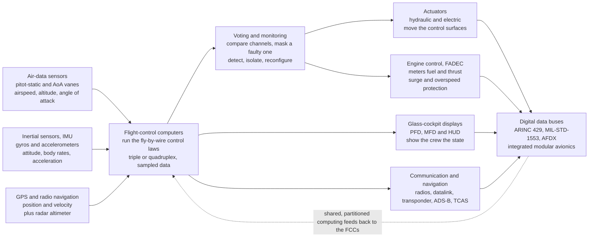

# 🎛️ Avionics and Flight Control Systems

> [!abstract] TL;DR
> **Avionics** — literally *aviation electronics* — is the integrated suite of **sensors, computers, displays, communication, navigation, and control electronics** that turns a modern aircraft or spacecraft from a mechanical machine into a **flying computer**. The chain is always the same: **sensors** measure the vehicle's state (**air data** from pitot-static probes and angle-of-attack vanes; **inertial** gyros and accelerometers in an **IMU**; **GPS/GNSS**; radar/radio altimeters), **flight-control computers (FCCs)** run the **fly-by-wire control laws** that shape and limit the pilot's commands, and their outputs drive **actuators** (surfaces), **engine controllers** (**FADEC**), **glass-cockpit displays** (PFD/MFD/HUD), and **comms/navigation** radios (transponders, **ADS-B**, datalink) — all stitched together by **digital data buses** (**ARINC 429**, **MIL-STD-1553**, **AFDX**) and increasingly by shared **integrated modular avionics (IMA)**. Two disciplines define the field. **Digital flight control** is **sampled-data control**: the loop runs at a fixed rate, and *sample rate, latency, and jitter* directly set stability — too slow and a well-designed damper becomes a divergent oscillation. **Reliability and safety** is the obsession: everything vital is **triplicated or quadruplicated** and the channels **vote**, so a single crashed or *lying* computer is masked rather than fatal; **dissimilar redundancy** guards against common-mode software bugs, and **DO-178C** (software) / **DO-254** (hardware) certification enforces loss-of-control probabilities below $10^{-9}$ per flight hour. Avionics is the **integrative brain** that ties control, propulsion, navigation, and the human interface into one fault-tolerant, real-time system — and the very same architecture governs spacecraft, missiles, and drones, which is why it opens the systems-and-frontiers section.

---

## Intuition

**Analogy:** If the **airframe is the body** and the **engines are the muscles**, then **avionics are the nervous system and the brain** — the electronics that *sense, compute, communicate, and command*. Early pilots flew by eye and feel: they looked at the horizon, listened to the engine, and pulled cables that ran straight to the flaps. A modern airliner is closer to a **datacenter with wings**. Dozens of processors continuously read the sensors, run the flight-control laws, manage the engines, fix the vehicle's position, talk to air-traffic control, and paint the glass-cockpit displays — and they spend much of their effort **cross-checking each other** so that no single failure can bring the aircraft down. When you move the side-stick, you are not pulling a cable; you are typing a *request* into a computer, which decides — hundreds of times a second — how to answer it.

The astonishing part is the **paranoia**. Everything that matters is **triplicated or quadruplicated**, and the copies **vote** on the answer, because at twelve kilometres up a crashed computer cannot simply reboot and try again. A single sensor might lie; a single processor might latch up; a single line of software might have a bug — so the system is built to *outvote* any one of them. That is the deep difference between a laptop and a flight computer: the laptop is designed to work; the flight computer is designed to **keep working while pieces of it fail**. Getting a control loop to close is undergraduate control theory. Getting it to close *correctly for tens of millions of flight hours between catastrophic failures*, on redundant hardware that disagrees now and then, is what avionics engineering actually is.

---

## How It Works

### Core Mechanics

**1. What "avionics" means — the electronic nervous system.** Avionics is the **integrated electronic architecture** of a flight vehicle: sensors + computers + actuators + displays + communication + navigation, plus the buses and software that connect them. Historically these were dozens of independent "black boxes," each a **federated** unit doing one job; the modern trend is **integrated modular avionics (IMA)**, where a few shared, partitioned computing modules host many functions as software applications. Either way, the job is to *turn measurements into commands* fast enough, reliably enough, and safely enough to fly.

**2. Sensors — measuring the state of the vehicle.** Control laws are only as good as what they can measure:
- **Air-data system** — **pitot** (total) and **static** pressure ports feed an **air-data computer** that derives **airspeed**, **altitude**, **Mach**, and vertical speed; **angle-of-attack (AoA)** vanes or probes measure the flow angle. These are the aerodynamic vital signs.
- **Inertial** — an **inertial measurement unit (IMU)** of three **gyros** and three **accelerometers** gives attitude, angular rates, and specific force; integrated over time (an **inertial navigation system, INS**) it yields position and velocity without any outside signal.
- **Radio/satellite** — **GPS/GNSS** supplies absolute position and velocity; **radar/radio altimeters**, weather radar, and (military) terrain-following radar add more.
- Because every sensor drifts, lies, or fails in its own way, avionics **fuses** them (complementary and **Kalman filtering**) and **cross-monitors** redundant copies for plausibility.

**3. Flight-control computers and the fly-by-wire control laws.** In **fly-by-wire (FBW)** the stick and pedals are **electrical transducers**; their signals go to the **flight-control computers**, which run the **control laws** — feedback logic that adds **stability augmentation**, **envelope protection**, and, for a deliberately unstable airframe, the moment-by-moment stabilization the pilot could never provide by hand (the story of [[Flight_Control_and_Handling_Qualities]]). This note is about the *machine that runs those laws*: how it samples, computes, votes, and drives the actuators.

**4. Actuators and engine control.** The FCC's commands become motion through **actuators** — traditionally **hydraulic** servo-valves, increasingly **electro-hydrostatic (EHA)** and **electromechanical (EMA)** "power-by-wire" units — that deflect the surfaces and are themselves monitored for jam/runaway. Propulsion is handled by the **FADEC** (Full-Authority Digital Engine Control): a dedicated, dual-channel computer that meters fuel, schedules variable geometry, protects against surge and overspeed, and gives the flight deck a single "thrust request" interface — the engine's own fly-by-wire.

**5. Navigation, guidance, communication, and displays.** Around the inner control loop sits the rest of the brain: **navigation and guidance** (INS/GNSS fusion, the **Flight Management System** computing and flying **area-navigation (RNAV)** routes — the outer loop this section's *Guidance, Navigation and Control* note develops); **communication** (VHF/HF/SATCOM radios, **datalink**, **transponders**, and **ADS-B** that broadcasts the aircraft's GPS position); collision avoidance (**TCAS**); and the **glass cockpit** — the **Primary Flight Display (PFD)**, **Multi-Function Display (MFD)**, and **head-up display (HUD)** that render this torrent of data into a picture a human can fly by.

**6. Digital flight control is sampled-data control.** A digital FCC does not act continuously; it runs a **periodic frame**: *sample the sensors → run the control law → command the actuators*, at a fixed rate (tens to hundreds of hertz). Three consequences follow directly. **Anti-aliasing** filtering is mandatory, or high-frequency vibration folds down and corrupts the signal. **Latency** (compute + bus + actuator transport delay) is pure phase lag that erodes stability margin — the prime driver of pilot-induced oscillation. And **determinism** matters more than raw speed: the loop must close *on time, every time*, so avionics runs **real-time operating systems** and time-triggered buses, not best-effort scheduling.

**7. Data buses and integrated modular avionics.** The subsystems talk over specialized **digital buses**: **ARINC 429** (simple one-transmitter broadcast, ubiquitous on airliners), **MIL-STD-1553** (a command/response dual-redundant military bus), and **AFDX / ARINC 664** (switched, deterministic Ethernet on the A380/787). **IMA** then consolidates many functions onto a few certified computing cabinets with **robust partitioning** (ARINC 653) so that a fault in one hosted application cannot corrupt another — trading the old "one box per function" for shared, weight-saving, but rigorously isolated computing.

**8. Reliability and safety — the discipline that defines avionics.** Airworthiness fixes the target: a catastrophic failure condition must be **extremely improbable**, on the order of $10^{-9}$ per flight hour. No single component is that good, so reliability is *engineered from unreliable parts*:
- **Redundancy with voting** — vital functions run on **triple (TMR)** or **quadruplex** channels. A **voter** compares them and, on **2-out-of-3** majority, **masks** a channel that has failed *or is producing wrong outputs*, then isolates and (if possible) reconfigures around it.
- **Dissimilar redundancy** — identical channels share identical **software bugs** and hardware **common-mode** faults, so safety-critical systems add **dissimilar** channels (different processors, different code, sometimes a separate "backup control" law) so that a design fault cannot fail all lanes at once.
- **Fault detection, isolation, and reconfiguration (FDIR)** plus **fail-operational / fail-safe** design: after the *first* fault the system must still fly (fail-operational); after enough faults it must at least degrade to a safe, controllable state (fail-safe), never to an unsafe one.
- **Certification** — **DO-178C** (software) and **DO-254** (complex hardware) impose objective-based rigor (requirements, coverage, traceability, verification) scaled to how catastrophic a failure would be (Design Assurance Levels A–E). This process, not the code itself, is most of the cost.

**9. Why it matters.** Avionics is what turned aircraft from cable-and-pulley machines into flying computers, and in doing so enabled **fly-by-wire**, **autoland**, **RNAV**, **TCAS**, and the extraordinary safety record of modern aviation. It is the **integrative layer** — the place where aerodynamics, structures, propulsion, control theory, and human factors all meet a real-time, fault-tolerant computer — and because the same architecture (redundant, certified, deterministic) governs **spacecraft, launch vehicles, missiles, and drones**, it is the natural doorway into the systems-and-frontiers of aerospace.

### Flow / Architecture



---

## Key Concepts

### Secondary Level

- **Avionics = the plane's brain and nerves.** The body is the airframe, the muscles are the engines, and the **avionics are the electronics that sense, think, and command** — the sensors, computers, radios, and screens that run a modern aircraft.
- **Fly-by-wire = a computer between you and the controls.** Instead of cables from the stick to the flaps, your input becomes an **electrical signal** to a computer that decides how to move the surfaces — smoothing the ride and stopping the pilot from stalling or over-stressing the aircraft.
- **The glass cockpit.** Rows of round dials became a few big **screens** (displays) that draw the important information as one clear picture, plus a **head-up display** projected onto the windscreen.
- **Everything important is copied several times.** Vital computers and sensors are built **three or four times over**, and they **vote** on the right answer, so if one breaks or goes crazy the others outvote it and the plane flies on. You cannot pull over and reboot at 12 km up.
- **Talking and finding the way.** Avionics also handles **navigation** (knowing where you are, by GPS and internal sensors), **communication** (radios to air-traffic control), and **collision avoidance** (a system that warns of other aircraft).

### Undergraduate Level

- **The sensor suite.** **Air data** (pitot-static → airspeed, altitude, Mach; AoA vanes → flow angle), **inertial** (IMU: 3 gyros + 3 accelerometers → attitude, rates, specific force; integrated into an INS for position), and **GNSS/radio** (GPS, radar altimeter). Each is imperfect, so avionics **fuses** them and **cross-checks** redundant copies.
- **Sampled-data control.** A digital FCC runs a fixed **frame rate** $f_s$: sample → compute → actuate. The **sample period** $T=1/f_s$ and the **transport latency** together add phase lag $\approx \omega\,\tau$ at frequency $\omega$; enough lag turns a stabilizing feedback into a destabilizing one. **Anti-aliasing filters** are required before sampling.
- **Data buses and architecture.** **ARINC 429** (broadcast, airliners), **MIL-STD-1553** (command/response, military), **AFDX/ARINC 664** (switched deterministic Ethernet, A380/787). **Federated** avionics (one box per function) versus **IMA** (shared, partitioned modules, ARINC 653).
- **FADEC.** A dedicated dual-channel digital controller that runs the *engine's* fly-by-wire — fuel metering, variable geometry, surge/overspeed/overtemp protection — behind a single thrust-command interface.
- **Redundancy math.** Compare **simplex** ($R$), **dual parallel / 1-out-of-2** ($1-(1-R)^2$), and **triple modular redundancy / 2-out-of-3 voting** ($3R^2-2R^3$). Voting **masks** a faulty channel; the target is a catastrophic-failure rate near $10^{-9}$ per flight hour.
- **Fail-operational vs fail-safe.** After the first fault, keep flying (fail-operational); after further faults, degrade to a controllable safe state (fail-safe) — never to an unsafe one.

### Graduate Level

- **Integrity versus availability — why voting, not just parallelism.** For pure *loss-of-function*, a **1-out-of-2** parallel system is strictly *more available* than **2-out-of-3** ($R_{1oo2}-R_{2oo3}=2R(1-R)^2\ge0$). Safety-critical avionics still choose triple/quadruplex because the threat is not a *dead* channel but a **lying** one: a dual system that disagrees cannot know which lane is correct and must go **fail-passive** (disconnect), whereas a voter **masks** the erroneous channel by majority. Redundancy for *availability* and redundancy for *integrity* are different design problems.
- **Byzantine faults and the limits of naive voting.** A channel that sends *different* values to different voters (a **Byzantine** fault) can defeat simple majority logic; provably tolerating $f$ arbitrary faults needs $3f+1$ nodes with authenticated exchange. Flight computers use **cross-channel data links**, bit-for-bit **frame synchronization**, and interactive-consistency protocols so voters see a common view.
- **Sampled-data stability and delay.** Zero-order-hold plus computational latency inject frequency-dependent phase lag; the loop must be designed in the **z-domain** (or via the delayed continuous model) with margin against **jitter**. Rate-limited actuators add amplitude-dependent lag — a classic **Category II PIO** mechanism. This is why avionics prizes *deterministic* timing (time-triggered buses, RTOS, ARINC 653 partitioning) over raw throughput.
- **Dissimilarity against common-mode failure.** Identical channels share design faults; **N-version / dissimilar** hardware and software (different CPUs, compilers, teams, or a separate backup control law) attack **common-mode** and software errors that no amount of copying identical lanes can cover — the lesson of **Ariane 5 Flight 501** and the reason for dissimilar backup channels on airliners.
- **Certification as the real cost.** **DO-178C** (with formal-methods, model-based, and object-oriented supplements) and **DO-254** assign **Design Assurance Levels A–E** by failure severity, demanding requirements traceability, structural coverage (up to **MC/DC** at Level A), and independent verification. The engineering artifact is the *assurance case*, not just the code — and it dominates schedule and budget.
- **Integrated modular avionics and partitioning.** IMA trades federation for shared cabinets but must **guarantee non-interference**: **robust time and space partitioning** (ARINC 653) so a fault or overrun in one hosted application cannot steal CPU, memory, or bus bandwidth from another — the software analogue of physical isolation.

---

## Python Demo

```python
# Avionics: reliability by redundancy, and the sampled-data reality of digital
# flight control. numpy + matplotlib only (no scipy).
#
#   (a)+(b) REDUNDANCY / RELIABILITY
#       Compare three flight-control-computer architectures vs the reliability R
#       of a SINGLE channel over one mission:
#         - SIMPLEX     one channel        R_sys = R
#         - DUAL (1oo2) two in parallel     R_sys = 1 - (1-R)^2   (works if >=1 works)
#         - TMR  (2oo3) triple + VOTING     R_sys = 3R^2 - 2R^3   (works if >=2 work)
#       Plot reliability and, on a log axis, the PROBABILITY OF LOSS-OF-FUNCTION.
#       Key subtlety: for pure loss-of-function 1oo2 actually beats 2oo3
#       (R_1oo2 - R_2oo3 = 2R(1-R)^2 >= 0). TMR's real win is INTEGRITY -- a
#       majority vote MASKS a channel that is *lying*, which a dual system cannot.
#
#   (c)+(d) DIGITAL (SAMPLED-DATA) FLY-BY-WIRE LOOP
#       Airframe mode: an UNDAMPED 2nd-order pitch mode  y'' + wn^2 y = wn^2 u.
#       ALL damping comes from a DIGITAL RATE-FEEDBACK "pitch damper":
#           u = -Kd * (measured pitch rate)
#       sampled every T = 1/fs, HELD (zero-order hold), and applied with one
#       frame of COMPUTATIONAL LATENCY. As fs drops, the held+delayed feedback
#       phase-lags the true motion; past ~90 deg of lag at the mode frequency it
#       flips from DAMPING to ANTI-damping and the loop goes UNSTABLE. That is
#       why fly-by-wire runs fast, low-latency, deterministic control loops.
import numpy as np
import matplotlib.pyplot as plt

# ================================================================= #
# (a)+(b) REDUNDANCY & RELIABILITY
# ================================================================= #
R = np.linspace(0.90, 1.0, 500)
R_simplex = R
R_dual    = 1.0 - (1.0 - R)**2          # 1-out-of-2 parallel
R_tmr     = 3*R**2 - 2*R**3             # 2-out-of-3 majority voting

Pf_simplex = 1.0 - R_simplex
Pf_dual    = 1.0 - R_dual
Pf_tmr     = 1.0 - R_tmr

Rc = 0.999                               # single-channel reliability this mission
pf_s = 1 - Rc
pf_d = (1 - Rc)**2
pf_t = 1 - (3*Rc**2 - 2*Rc**3)
print("=== Redundancy: loss-of-function probability at single-channel R = 0.999 ===")
print(f"  simplex (1 channel)  : Pf = {pf_s:.3e}")
print(f"  dual    (1-out-of-2) : Pf = {pf_d:.3e}   (best pure availability)")
print(f"  TMR     (2-out-of-3) : Pf = {pf_t:.3e}   (votes out a *faulty/lying* channel)")
print(f"  note: R_1oo2 - R_2oo3 = 2R(1-R)^2 >= 0  -> dual is more AVAILABLE,")
print(f"        but only voting gives INTEGRITY against an erroneous channel.\n")

# ================================================================= #
# (c)+(d) DIGITAL SAMPLED-DATA FLY-BY-WIRE LOOP
# ================================================================= #
wn = 6.0                                  # airframe pitch-mode natural freq [rad/s]
Kd = 2*0.4*wn / wn**2                      # rate gain -> continuous zeta ~ 0.4

def simulate_digital(fs, t_end=6.0, dt=1e-3, y0=1.0):
    """Continuous plant (RK4) + zero-order-hold digital rate feedback with one
       frame of computational latency, sampled at fs Hz. Returns t, y(t)."""
    n  = int(t_end/dt)
    t  = np.linspace(0.0, t_end, n)
    y  = np.zeros(n); yd = np.zeros(n)
    y[0] = y0
    Ts = 1.0/fs
    u_held           = 0.0                 # ZOH control currently applied
    ydot_prev_sample = 0.0                 # measurement latched LAST frame (latency)
    next_sample_t    = 0.0
    for i in range(n-1):
        if t[i] >= next_sample_t:                       # a new control frame
            u_held           = -Kd * ydot_prev_sample   # uses PREVIOUS frame's rate
            ydot_prev_sample = yd[i]                     # latch now for next frame
            next_sample_t   += Ts
        def deriv(Y):                                    # y'' = wn^2*u_held - wn^2*y
            yy, yyd = Y
            return np.array([yyd, wn**2*u_held - wn**2*yy])
        Y  = np.array([y[i], yd[i]])
        k1 = deriv(Y); k2 = deriv(Y + 0.5*dt*k1)
        k3 = deriv(Y + 0.5*dt*k2); k4 = deriv(Y + dt*k3)
        y[i+1], yd[i+1] = Y + (dt/6.0)*(k1 + 2*k2 + 2*k3 + k4)
    return t, y

rates  = [50.0, 12.0, 4.0]
labels = ["50 Hz: crisp, well damped", "12 Hz: ringing", "4 Hz: unstable, diverges"]
colors = ["#1f77b4", "#ff7f0e", "#d62728"]
sims   = [simulate_digital(fs) for fs in rates]

def growth_ratio(y):
    h = len(y)//2
    return np.max(np.abs(y[h:])) / (np.max(np.abs(y[:h])) + 1e-12)

print("=== Digital fly-by-wire loop: effect of sample rate (late/early amplitude) ===")
for fs, (t, y), lab in zip(rates, sims, labels):
    g = growth_ratio(y)
    verdict = "STABLE (decays)" if g < 1 else "UNSTABLE (grows)"
    print(f"  fs = {fs:4.0f} Hz : ratio = {g:5.2f}  -> {verdict}")

fs_sweep = np.linspace(3.0, 40.0, 60)
g_sweep  = np.array([growth_ratio(simulate_digital(fs)[1]) for fs in fs_sweep])

# ----------------------------- plotting ----------------------------- #
fig, ax = plt.subplots(2, 2, figsize=(14, 11))
fig.suptitle("Avionics: reliability by redundancy, and sampled-data digital flight control",
             fontsize=13, fontweight="bold")

# (a) system reliability vs component reliability
ax[0,0].plot(R, R_simplex, color="#d62728", lw=2.2, label="simplex (1 channel)")
ax[0,0].plot(R, R_dual,    color="#2ca02c", lw=2.2, label="dual 1-out-of-2")
ax[0,0].plot(R, R_tmr,     color="#1f77b4", lw=2.6, label="TMR 2-out-of-3 (voting)")
ax[0,0].plot([Rc], [Rc], "ko"); ax[0,0].plot([Rc], [3*Rc**2-2*Rc**3], "ko")
ax[0,0].set_title("(a) System reliability vs single-channel reliability")
ax[0,0].set_xlabel("single-channel reliability R"); ax[0,0].set_ylabel("system reliability")
ax[0,0].set_xlim(0.90, 1.0); ax[0,0].legend(fontsize=8); ax[0,0].grid(alpha=0.3)

# (b) loss-of-function probability, log axis -> the dramatic view
ax[0,1].semilogy(R, Pf_simplex, color="#d62728", lw=2.2, label="simplex ~ (1-R)")
ax[0,1].semilogy(R, Pf_dual,    color="#2ca02c", lw=2.2, label="dual  ~ (1-R)^2")
ax[0,1].semilogy(R, Pf_tmr,     color="#1f77b4", lw=2.6, label="TMR   ~ 3(1-R)^2")
ax[0,1].set_title("(b) Probability of loss-of-function (lower is better)")
ax[0,1].set_xlabel("single-channel reliability R"); ax[0,1].set_ylabel("P(loss of function)")
ax[0,1].set_xlim(0.90, 1.0); ax[0,1].legend(fontsize=8); ax[0,1].grid(alpha=0.3, which="both")

# (c) digital-control step responses at three sample rates
for fs, (t, y), lab, c in zip(rates, sims, labels, colors):
    ax[1,0].plot(t, y, color=c, lw=2.2, label=lab)
ax[1,0].axhline(0, color="gray", lw=0.8)
ax[1,0].set_ylim(-3.0, 3.0)
ax[1,0].set_title("(c) Digital pitch-damper: sample rate sets stability")
ax[1,0].set_xlabel("time [s]"); ax[1,0].set_ylabel("pitch response y(t)")
ax[1,0].legend(fontsize=8, loc="upper right"); ax[1,0].grid(alpha=0.3)

# (d) growth ratio vs sample rate -> a stability boundary
ax[1,1].plot(fs_sweep, g_sweep, color="#9467bd", lw=2.4)
ax[1,1].axhline(1.0, color="k", ls="--", lw=1, label="stability boundary (ratio = 1)")
ax[1,1].fill_between(fs_sweep, 1.0, g_sweep, where=(g_sweep > 1.0),
                     color="#d62728", alpha=0.15, label="unstable (too slow)")
for fs in rates:
    ax[1,1].axvline(fs, color="gray", ls=":", lw=0.8)
ax[1,1].set_title("(d) Faster sampling = more stable: growth vs sample rate")
ax[1,1].set_xlabel("sample rate fs [Hz]"); ax[1,1].set_ylabel("late/early amplitude ratio")
ax[1,1].legend(fontsize=8); ax[1,1].grid(alpha=0.3)

plt.tight_layout(rect=[0, 0, 1, 0.96])
plt.show()
```

Running this prints the numbers and draws four panels. Panels **(a)** and **(b)** are the reliability story. On the linear plot the voting architectures both hug 1 near high channel reliability, but the **log-scale loss-of-function** plot shows the dramatic separation: as a single channel improves, simplex loss falls like $(1-R)$, while both redundant schemes fall like $(1-R)^2$ — at $R=0.999$ the loss probability drops from $10^{-3}$ to about $10^{-6}$. The printed lines make the **graduate subtlety** explicit: for *pure loss-of-function* the **dual 1-out-of-2** system is actually slightly *more available* than **TMR 2-out-of-3** (their gap is $2R(1-R)^2\ge0$), yet avionics still pays for triple/quadruplex hardware — because the real enemy is not a *dead* channel but a **lying** one, and only a **majority vote** can mask an erroneous output that a dual system can merely detect (and must then disconnect). Panels **(c)** and **(d)** are the sampled-data reality of **digital flight control**: the very same rate-feedback damper is crisp and well-damped at **50 Hz**, visibly **rings** at **12 Hz**, and outright **diverges at 4 Hz** — because the held, one-frame-delayed feedback phase-lags the mode past 90 degrees and flips from adding damping to *removing* it. Panel (d) sweeps the sample rate and exposes a clean **stability boundary**: below a threshold frequency the loop is unstable. Nothing changed about the aerodynamics or the control gains — only how fast and how promptly the computer closed the loop. That single fact is why avionics obsesses over rate, latency, and deterministic timing.

---

## Real-World Applications

> **Example — the Airbus fly-by-wire family and integrated modular avionics.** The A320 (1988) put a digital FBW airliner into service: side-stick signals pass through **control laws** on redundant flight-control computers, with two dissimilar computer *types* (built by different teams to different designs) precisely to defeat common-mode software faults. The A380 and A350 then adopted **integrated modular avionics** over **AFDX** switched Ethernet, hosting dozens of functions on shared, ARINC-653-partitioned cabinets — the federated "one box per function" architecture giving way to certified shared computing. This is the redundancy-plus-voting-plus-dissimilarity philosophy of the demo, in daily airline service.

> **Example — the Boeing 777/787 triple-redundant FBW.** The 777 (1995) was Boeing's first fly-by-wire jet, built around **three** flight-control computers, each internally using **three dissimilar processor lanes** (a different microprocessor per lane) — triple-triple redundancy against both random and design faults, communicating over triplicated **ARINC 629** buses. The 787's **Common Core System** extends the IMA idea further. These aircraft are the airborne embodiment of TMR voting combined with dissimilarity.

> **Example — FADEC on every modern jet engine.** From the CFM56 to the GEnx and PW1000G, each engine carries a **dual-channel FADEC** that is the engine's own fly-by-wire: it meters fuel, schedules variable stator vanes and bleeds, and enforces surge, overspeed, and overtemperature limits, presenting the flight deck a single thrust command. It runs redundant channels with cross-monitoring for exactly the reliability reasons the demo quantifies — an engine control that fails unsafely is as dangerous as a flight-control one.

> **Example — the Space Shuttle's 4-plus-1 redundant computers.** The Shuttle flew **four identical General Purpose Computers running the same software in synchronized voting redundancy**, plus a **fifth computer running completely dissimilar backup flight software** written by a separate contractor — a deliberate guard against a common software bug felling all four primaries at once. It is the clearest flight example of *dissimilar* redundancy: copying identical lanes protects against random hardware faults but never against a shared design error, so a differently-written backup rides along.

> **Example — Ariane 5 Flight 501, a redundancy that did not help.** In 1996 the maiden Ariane 5 was lost 37 seconds after launch when an **inertial-reference software exception** (an unprotected 64-bit-to-16-bit conversion overflowed on the faster vehicle's higher horizontal velocity) shut down the active inertial unit — and the **redundant backup**, running the **identical software**, had already failed the same way milliseconds earlier. Two channels, one bug, both dead: the textbook proof that *identical* redundancy is powerless against a **common-mode software fault**, and the reason safety-critical avionics adds **dissimilarity**, not just copies.

---

## Common Pitfalls

- **Assuming identical redundancy covers software and design faults.** Triplicating the *same* hardware and code protects against **random** failures but not against a **common-mode** bug that fails every lane at once — precisely what destroyed **Ariane 501**. Guard against design faults with **dissimilar** hardware/software or a separate backup control law, not more identical copies.
- **Confusing availability with integrity.** More parallel channels raise *availability* (something stays alive), but a channel that produces *wrong* outputs is a different threat. A dual system can only *detect* disagreement and disconnect (**fail-passive**); masking a lying channel requires **majority voting** (TMR/quad). Pick the redundancy scheme to match whether you fear a dead channel or a deceptive one.
- **Ignoring sample rate, latency, and jitter.** Digital control is **sampled-data** control: zero-order hold plus compute/bus/actuator delay is phase lag that erodes stability margin, and timing **jitter** is unmodeled noise. Too slow, or too late, and a well-designed damper becomes a divergent oscillation (the demo's 4 Hz case) — a leading cause of **pilot-induced oscillation**. Budget the loop delay and enforce deterministic timing.
- **Skipping anti-aliasing.** Without a proper analog/pre-decimation filter, high-frequency structural vibration and noise **alias** into the control band and corrupt the signal; the fix must precede sampling, not follow it.
- **Depending on a single sensor for a critical function.** The whole redundancy philosophy collapses if a critical law trusts one probe. **MCAS on the 737 MAX** commanded nose-down trim from a *single* angle-of-attack vane; a jammed vane fed a false high-AoA signal with no cross-check and no voting, contributing to two fatal accidents. Cross-monitor redundant sensors and add plausibility/disagreement logic.
- **Underestimating Byzantine faults.** A channel that sends *different* values to different voters can defeat naive majority logic. Tolerating $f$ arbitrary faults needs $3f+1$ nodes plus interactive-consistency/authenticated exchange; real flight computers use cross-channel links and frame synchronization so every voter sees the same inputs.
- **Treating certification as an afterthought.** **DO-178C / DO-254** assurance (requirements traceability, structural coverage up to MC/DC at Level A, independent verification) dominates schedule and cost. Architecting for **partitioning** and testability *late* is enormously expensive; design for the assurance case from the start.
- **Believing automation eliminates risk.** Envelope protection and autoflight remove some hazards but add **mode confusion**, reversion behavior, and human-factors failure modes — the crew misreading which control law or autopilot mode is active. Automation moves the failure modes; it does not delete them.

---

## Related Concepts

**Control theory — the loop the flight computer closes**
- [[Flight_Control_and_Handling_Qualities]] — the *sibling in the flight-mechanics section*: it derives the fly-by-wire control laws, stability augmentation, and relaxed-static-stability handling that the avionics hardware in *this* note actually executes. Read the two together — laws there, the machine here.
- [[Feedback_Control_Fundamentals]] — the closed-loop plant/controller/actuator framework; a digital FCC is this loop discretized, where sample rate and latency set the achievable margins.
- [[PID_Control]] — the proportional/rate feedback a pitch or yaw damper implements; the demo's rate-feedback loop is a digital derivative term whose delay drives it unstable.
- [[State_Space_Models_in_Control]] — the $\dot{x}=Ax+Bu$ airframe model whose modes the control laws reshape and whose sampled-data version the FCC really controls.

**Estimation and hardware — turning sensors into state, and code into a flying computer**
- [[Kalman_Filtering_and_State_Estimation]] — the recursive sensor-fusion that blends noisy IMU, air-data, and GNSS measurements into the clean state estimate the control laws consume; the heart of INS/GNSS integration.
- [[Embedded_Systems_and_Microcontrollers]] — the real-time processors, interrupts, and deterministic scheduling underneath every flight-control computer and FADEC; avionics is safety-critical embedded computing.
- [[Data_Converters_ADC_and_DAC]] — the analog-to-digital and digital-to-analog interfaces (with mandatory anti-aliasing) that connect the physical sensors and actuators to the digital control loop.
- [[Mechatronics_and_Automation]] — the sensor-computer-actuator integration philosophy, of which fly-by-wire is the airborne, fault-tolerant extreme.
- [[Aircraft_Stability_and_Flight_Dynamics]] — the open-loop modes (short-period, phugoid, Dutch roll) that the avionics measures and augments.

This note opens the **Aerospace_Engineering / Avionics, Systems and Frontiers** section, and its section siblings extend the story from the electronic *nervous system* outward: *Guidance, Navigation and Control* closes the outer loop, turning the inner control loops here into autopilots, flight-management routes, and autonomous guidance; *Spacecraft Systems Engineering* reuses this same redundant, certified, real-time architecture for vehicles that cannot be maintained after launch; and *Unmanned Aircraft and Autonomy* pushes it toward vehicles where the pilot's judgment itself must be encoded in the avionics.

---

## Review Questions

**Secondary**
1. Using the "body / muscles / brain" analogy, explain what avionics are and give three jobs they do on a modern aircraft. Why are the most important computers and sensors built *three or four times over* instead of just once?

**Undergraduate**
2. A single flight-control channel has reliability $R$ over a mission. Write the system reliability for (a) a simplex channel, (b) a dual 1-out-of-2 parallel pair, and (c) a triple 2-out-of-3 voting arrangement, and evaluate all three at $R=0.99$. Which has the lowest loss-of-function probability, and does that match your intuition about "more redundancy = safer"?
3. Explain why a digital flight-control loop can be *stable at a high sample rate but unstable at a low one*, even with identical control gains. Reference sample period, computational latency, and phase margin, and relate your answer to why anti-aliasing is required and to pilot-induced oscillation.

**Graduate**
4. Your dual-redundant inertial reference disagrees in flight: the two channels report different attitudes. (a) Why can a *dual* voting system generally only fail-passive (disconnect) rather than mask the fault, and what does a *triple* system do differently? (b) Explain, using the identity $R_{1oo2}-R_{2oo3}=2R(1-R)^2\ge0$, why 2-out-of-3 voting is *less available* than 1-out-of-2 yet is still preferred for safety-critical functions — distinguish *availability* from *integrity*.
5. Analyze **Ariane 5 Flight 501** and the **Space Shuttle 4-plus-1** computer set as two answers to the same question. (a) Why did copying identical channels fail to protect Ariane 5, and what class of fault was responsible? (b) How does dissimilar (N-version) redundancy address it, and what new costs and risks does dissimilarity introduce? (c) Where would you spend a fixed reliability budget: another identical lane, a dissimilar lane, or better per-channel testing — and on what does the answer depend?
6. You are architecting the flight-control computing for a relaxed-static-stability aircraft that is unflyable without continuous augmentation. Specify (a) the redundancy and voting scheme and its fail-operational/fail-safe behavior after successive faults, (b) how you would bound loop latency and jitter to preserve stability margin (sampled-data considerations, deterministic buses, partitioning), and (c) how DO-178C Design Assurance Levels and structural coverage shape your software process. Justify each choice against the $10^{-9}$-per-hour target.

---

## Sources

- R. P. G. Collinson — *Introduction to Avionics Systems*, 3rd ed. (Springer, 2011) — the standard survey of sensors, displays, flight control, navigation, and avionics integration.
- I. Moir & A. Seabridge — *Aircraft Systems: Mechanical, Electrical, and Avionics Subsystems Integration*, 3rd ed. (Wiley, 2008) — systems-level treatment of avionics within the whole aircraft, including data buses and IMA.
- C. R. Spitzer, U. Ferrell & T. Ferrell (eds.) — *Digital Avionics Handbook*, 3rd ed. (CRC Press, 2015) — buses, IMA, redundancy management, and DO-178C/DO-254 certification in depth.
- B. L. Stevens, F. L. Lewis & E. N. Johnson — *Aircraft Control and Simulation*, 3rd ed. (Wiley, 2016) — digital/sampled-data flight-control law design and fly-by-wire simulation.
- RTCA — *DO-178C: Software Considerations in Airborne Systems and Equipment Certification* (RTCA, 2011) — the governing standard for airborne software assurance.

---

#aerospace-engineering #avionics #fly-by-wire #redundancy #flight-control
