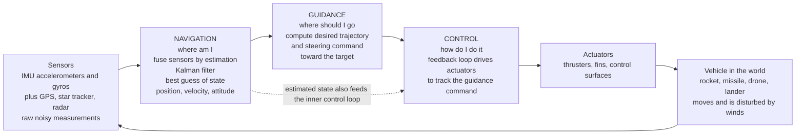

# 🛰️ Guidance, Navigation, and Control

> [!abstract] TL;DR
> **Guidance, Navigation, and Control (GNC)** is the integrated system that steers an autonomous vehicle to its goal by answering three questions, over and over, many times a second. **Navigation** asks *"where am I?"* — it estimates the vehicle's **state** (position, velocity, attitude) by **fusing sensors**: an **inertial navigation system (INS)** integrates an **IMU**'s accelerations and rotation rates (fast but it **drifts**), while **GPS/GNSS**, **star trackers**, and terrain/celestial fixes supply absolute corrections; the mathematical heart of the fusion is **estimation**, above all the **Kalman filter**. **Guidance** asks *"where should I go, and how do I get there from here?"* — it computes the desired **trajectory and steering commands** to reach the target, from simple **pursuit** and **proportional navigation** (the workhorse of missiles) up to **optimal/explicit guidance** for powered descent (Apollo's lunar landing, Falcon 9's return) and launch ascent, plus **waypoint following** and **rendezvous** targeting. **Control** asks *"how do I make the vehicle actually do that?"* — the fast **inner loop** that drives **actuators** (thrusters, fins, control surfaces) to **track** the guidance command despite winds and disturbances, using **feedback**. GNC runs as a **nested real-time loop** — fast inner control wrapped by slower guidance and navigation — and the whole art is balancing **estimation uncertainty**, **guidance optimality**, and **control authority**. It is the decision-making core of aerospace vehicles: it put **Apollo on the Moon**, guides every **missile** and **rocket**, lands **drones and spacecraft**, flies planetary **entry-descent-landing**, and underlies **self-driving** and autonomous systems — unifying this vault's control, orbits, and avionics threads into one where-am-I / where-to-go / how-to-do-it loop.

---

## Intuition

**Analogy:** Imagine driving a car through thick fog to a friend's house, and you must do three completely different jobs at once, again and again, without stopping. First you keep asking **"where am I right now?"** — you glance at the road signs when you can see them, but between signs you dead-reckon from your speedometer and your sense of how far you have turned; each source is imperfect (signs are rare and sometimes wrong, dead reckoning slowly drifts off), so you constantly **blend** them into a single best guess of your position. Second, given that best guess, you ask **"where should I go from here, and along what path?"** — you plan the route that will actually bring you to the door, not the one that made sense a mile ago. Third, you ask **"how do I make the car do that?"** — you work the wheel, throttle, and brake to follow the intended path, fighting crosswinds, potholes, and a car that never responds exactly as commanded. Those three jobs are **navigation**, **guidance**, and **control**, and no single one is enough: perfect knowledge of where you are is useless without a plan, a perfect plan is useless if you cannot make the car follow it, and flawless steering is useless if you do not know where you are.

Now strip out the human and the fog and put the same three jobs on a chip that runs hundreds of times a second inside a missile, a rocket, a lunar lander, or a delivery drone. **Navigation** fuses an inertial sensor (which feels every acceleration and turn but slowly drifts, like the dead-reckoning) with GPS or a star tracker (occasional, noisy, but absolute, like the road signs) into a best estimate of the vehicle's motion. **Guidance** turns that estimate into a desired trajectory and steering command toward the target — the "route." **Control** commands the thrusters and fins to fly that command despite disturbances — the "hands on the wheel." GNC is nothing more, and nothing less, than this relentless **where-am-I / where-to-go / how-to-do-it** loop, closed so fast and so reliably that a raw hunk of metal becomes an autonomous, precise, goal-seeking machine.

---

## How It Works

### Core Mechanics

**1. Three functions, one loop.** GNC decomposes autonomy into three cooperating jobs that run continuously and feed each other:
- **Navigation** — estimate the **state** $\hat{x} = [\text{position}, \text{velocity}, \text{attitude}]$ from sensors.
- **Guidance** — given $\hat{x}$ and the goal, compute the **desired trajectory / steering command** $a_{cmd}$.
- **Control** — drive the **actuators** so the vehicle's actual motion tracks $a_{cmd}$.
The vehicle moves, the sensors read the new situation, and the loop repeats — the outer world closes the loop.

**2. Navigation = estimation.** The mathematical core is **sensor fusion by estimation**. An **inertial navigation system (INS)** reads an **IMU** — three accelerometers and three gyros — and *integrates* accelerations once to get velocity and twice to get position, and integrates rotation rates to get attitude. Integration is powerful (fully self-contained, needs no outside signal, updates fast) but it **drifts**: any tiny bias or noise in the sensor accumulates without bound, so an unaided INS wanders off after minutes. **Absolute aids** — **GPS/GNSS** (position fix), **star trackers** (attitude), radar/terrain/celestial references — are noisy and intermittent but do *not* drift. A **Kalman filter** blends the two: it **predicts** the state forward using the INS model, then **corrects** that prediction with each absolute fix, weighting each source by its uncertainty. The result beats *either* sensor alone — smooth like the INS, drift-free like the GPS.

**3. Guidance = deciding where to go.** With a trusted state estimate, guidance computes the command that closes on the target. The spectrum runs from simple to optimal:
- **Pursuit** — point the velocity straight at the target's current position (a dog chasing a ball; simple, but curves inefficiently against a moving target).
- **Proportional navigation (PN)** — command a lateral acceleration proportional to the rotation rate of the **line of sight (LOS)** to the target: $a_{cmd} = N \, V_c \, \dot\lambda$, where $N$ is the navigation constant (3-5), $V_c$ is closing velocity, and $\dot\lambda$ is the LOS rate. PN nulls the LOS rotation, producing a near-straight **collision course** — the guidance law behind essentially every homing missile.
- **Waypoint / path following** — steer to track a pre-planned geometric path (drones, aircraft flight-management systems).
- **Optimal / explicit guidance** — solve (or approximate) a trajectory-optimization problem for powered descent, launch ascent, or rendezvous, minimizing fuel or time subject to dynamics and constraints (Apollo's landing guidance, modern convex powered-descent).

**4. Control = making it happen.** Guidance says *what* trajectory to fly; control makes the vehicle *actually* fly it. The **inner control loop** takes the guidance command as its reference and uses **feedback** — measure the error, drive the actuators to null it — to track the command despite winds, gusts, model error, and imperfect actuators. This is classical and modern control machinery: **PID** loops, **full-state feedback / LQR**, gain scheduling, and (for tight coupling and constraints) **model-predictive control**. Actuators have limits — **control authority** — and a guidance command that exceeds them cannot be flown, which is why guidance and control must be designed together.

**5. The nested, multi-rate loop.** GNC is not one loop but **loops within loops**, separated by timescale. The **control** loop runs fastest (tens to hundreds of Hz) because instability lives there; **guidance** updates more slowly (a few Hz) as the geometry to the target evolves; **navigation** integrates fast internally but its absolute corrections arrive at the sensor rate. This **separation of timescales** lets each layer treat the faster one as "instantaneous" and the slower one as "constant," making the whole system tractable and stable.

**6. The three-way tension.** Real GNC design is the interplay of three limits. **Estimation uncertainty** (how well navigation knows the state) sets a floor on precision. **Guidance optimality** (how efficient the chosen path is) trades fuel against time and robustness. **Control authority** (how hard the actuators can push) bounds what any command can achieve. The classical **separation principle** (design the estimator and the controller independently, as in **LQG**) works when these are decoupled — but near intercept, during aggressive maneuvers, or in GPS-denied navigation, they couple strongly and must be co-designed.

### Flow / Architecture



---

## Key Concepts

### Secondary Level

- **GNC answers three questions, over and over.** *Where am I? Where should I go? How do I make the vehicle do it?* An autopilot asks all three, hundreds of times a second, and that loop is what makes a machine steer itself.
- **Navigation = "where am I?"** The vehicle blends several sensors into one best guess of its position and speed — like using road signs when you see them and your speedometer in between, then trusting a smart mix of the two.
- **Guidance = "where should I go?"** Given that best guess, it works out the path to the target and the turn commands to get there — the "route planner."
- **Control = "how do I do it?"** It works the thrusters, fins, or wheels to actually follow the planned path, fighting wind and bumps — the "hands on the wheel."
- **Why it matters.** This one loop is the brain behind every missile, rocket, satellite, and drone. It landed Apollo on the Moon, guides every rocket to orbit, brings drones and spacecraft down safely, and is the same idea inside self-driving cars.

### Undergraduate Level

- **Inertial navigation and drift.** An **IMU** measures acceleration and angular rate; integrating them (dead reckoning) gives position, velocity, and attitude with no outside signal — but any sensor **bias** integrates into an error that grows without bound. This drift is *the* reason an INS must be **aided** by an absolute reference.
- **Sensor fusion by Kalman filtering.** The **Kalman filter** runs a **predict-correct** cycle: predict the state forward with the INS/dynamics model, then correct with each GPS (or star-tracker) measurement, weighting each by its covariance. The output is smoother than raw GPS and drift-free unlike raw INS — a **loosely coupled INS/GNSS** integration.
- **Guidance laws.** **Pure pursuit** points velocity at the target; **proportional navigation** commands $a_{cmd} = N\,V_c\,\dot\lambda$ to null the line-of-sight rate and fly a collision course; **waypoint guidance** tracks a geometric path. Each turns the navigation estimate into a steering command.
- **The control inner loop.** The guidance command becomes the *reference* for a **feedback** loop (a [[PID_Control]] or state-feedback autopilot) that commands actuators to track it. Actuator **bandwidth and saturation** limit how fast and how hard the command can be followed.
- **Multi-rate nesting.** Control runs fastest (stability lives there), guidance slower (geometry evolves), navigation integrates fast but corrects at sensor rate. Treating each faster loop as "instant" and each slower as "constant" is the standard design simplification.
- **Attitude vs translation.** Navigation and control operate on both *where* the vehicle is (translation) and *which way it points* (attitude); a burn or a lift vector only goes where intended if the attitude loop has already pointed the vehicle correctly.

### Graduate Level

- **Nonlinear and optimal estimation.** Real dynamics and measurements are nonlinear, so the workhorse is the **Extended Kalman Filter (EKF)** (linearize about the estimate) or the **Unscented Kalman Filter (UKF)** (sigma-point propagation). **Tightly coupled** GNSS/INS fuses raw pseudoranges rather than position fixes, improving performance in weak-signal and high-dynamic conditions; **observability** analysis determines which states (e.g., biases) the aiding sensors can actually resolve.
- **Optimal guidance and its structure.** For a non-maneuvering target with a first-order lag, **proportional navigation with $N=3$ is the optimal (minimum-effort) guidance law** — PN is not a heuristic but the solution of a linear-quadratic problem. **Augmented PN** adds a target-acceleration term; **powered-explicit guidance (PEG)** and **explicit lunar-landing guidance** solve closed-form or iterative energy/fuel-optimal boundary-value problems.
- **Trajectory optimization and MPC.** Modern guidance solves a constrained optimal-control problem online. **Lossless convexification** turns the non-convex **powered-descent** landing problem (thrust bounds, glide-slope, no-fly cones) into a **second-order cone program** solvable to global optimality in real time — the basis of Mars-landing and reusable-booster guidance (see [[Trajectory_Optimization_and_Generation]] and [[Model_Predictive_Control]]).
- **Separation principle and its limits.** For linear-Gaussian systems, **LQG** = Kalman estimator + [[LQR_Optimal_Control]] regulator designed independently (the **separation theorem**). The clean split breaks down under nonlinearity, constraints, correlated noise, and terminal-homing geometry, where estimation error, guidance command, and control saturation couple and demand co-design.
- **The three-way GNC budget.** System performance is bounded jointly by **estimation uncertainty** (navigation error covariance), **guidance optimality** (the chosen trajectory's fuel/time cost and robustness), and **control authority** (actuator force, rate, and saturation). Terminal miss distance, for instance, is driven by *all three*: navigation noise, guidance-law dynamics near intercept (where $\dot\lambda$ and commanded acceleration can blow up), and control lag.
- **GPS-denied and integrity-critical navigation.** When GNSS is jammed, spoofed, or absent (deep space, underwater, indoors), navigation falls back on **terrain-relative**, **celestial**, **vision/SLAM**, and **radio** references, with **integrity monitoring** (RAIM, fault detection) to bound the probability of an undetected, hazardous error — a safety-of-life requirement for aviation and autonomy.

---

## Python Demo

```python
# Guidance, Navigation, and Control (GNC): the where-am-I / where-to-go / how-to-do-it loop.
# Two self-contained demos, numpy + matplotlib only.
#
#   (1) NAVIGATION  ("where am I?"): fuse a DRIFTING inertial estimate (integrate a noisy,
#       BIASED IMU acceleration) with noisy absolute GPS position fixes using a 2-D KALMAN
#       FILTER. Ground truth is a curving (circular) path. We show the fused estimate beats
#       EITHER sensor alone: INS-only drifts (bias integrates), GPS-only is unbiased but
#       noisy, Kalman is smooth AND accurate.
#
#   (2) GUIDANCE + CONTROL ("where to go / how to do it"): a pursuer intercepts a moving
#       target using PROPORTIONAL NAVIGATION guidance  a_cmd = N * Vc * LOS_rate , while a
#       first-order autopilot (the CONTROL loop) tracks that acceleration command with lag.
#       We plot the pursuer curving onto a collision course and hitting the target.
import numpy as np
import matplotlib.pyplot as plt

rng = np.random.default_rng(7)

# ============================================================== #
# (1) NAVIGATION: INS / GPS fusion with a 2-D Kalman filter
# ============================================================== #
dt = 0.1
t  = np.arange(0.0, 40.0 + dt, dt)
n  = len(t)

# --- ground truth: a curving (circular) trajectory ---
R_circ, w = 200.0, 0.10                          # radius [m], angular rate [rad/s]
px_true =  R_circ * np.cos(w * t)
py_true =  R_circ * np.sin(w * t)
vx_true = -R_circ * w * np.sin(w * t)
vy_true =  R_circ * w * np.cos(w * t)
ax_true = -R_circ * w**2 * np.cos(w * t)         # centripetal accel (what the IMU feels)
ay_true = -R_circ * w**2 * np.sin(w * t)
pos_true = np.column_stack([px_true, py_true])

# --- IMU: acceleration with a constant BIAS + white noise (bias is the drift driver) ---
imu_bias  = np.array([0.05, -0.03])              # m/s^2  -> integrates into growing drift
imu_sigma = 0.02
a_meas = np.column_stack([ax_true, ay_true]) + imu_bias + rng.normal(0, imu_sigma, (n, 2))

# --- GPS: noisy but UNBIASED absolute position fixes ---
gps_sigma = 8.0                                  # m
z_gps = pos_true + rng.normal(0, gps_sigma, (n, 2))

# --- INS-only dead reckoning: integrate the IMU, NO correction -> DRIFTS ---
ins = np.zeros((n, 4))                            # [px, py, vx, vy]
ins[0] = [px_true[0], py_true[0], vx_true[0], vy_true[0]]
for k in range(n - 1):
    ax_, ay_ = a_meas[k]
    ins[k+1, 2] = ins[k, 2] + ax_ * dt
    ins[k+1, 3] = ins[k, 3] + ay_ * dt
    ins[k+1, 0] = ins[k, 0] + ins[k, 2] * dt + 0.5 * ax_ * dt**2
    ins[k+1, 1] = ins[k, 1] + ins[k, 3] * dt + 0.5 * ay_ * dt**2

# --- Kalman filter: predict with IMU accel as control, correct with GPS ---
F  = np.array([[1,0,dt,0],[0,1,0,dt],[0,0,1,0],[0,0,0,1]], float)
B  = np.array([[0.5*dt**2,0],[0,0.5*dt**2],[dt,0],[0,dt]], float)
H  = np.array([[1,0,0,0],[0,1,0,0]], float)
Q  = np.diag([0.1, 0.1, 0.3, 0.3])               # modest model trust (absorbs IMU bias)
Rm = np.diag([gps_sigma**2, gps_sigma**2])
I4 = np.eye(4)

x = np.array([z_gps[0,0], z_gps[0,1], vx_true[0], vy_true[0]])   # start from first GPS fix
P = np.diag([50.0, 50.0, 5.0, 5.0])
kf = np.zeros((n, 4)); kf[0] = x
for k in range(1, n):
    x = F @ x + B @ a_meas[k-1]                   # PREDICT using the IMU
    P = F @ P @ F.T + Q
    y = z_gps[k] - H @ x                           # innovation from the GPS
    S = H @ P @ H.T + Rm
    K = P @ H.T @ np.linalg.inv(S)                # Kalman gain
    x = x + K @ y                                  # CORRECT
    P = (I4 - K @ H) @ P
    kf[k] = x

err_gps = np.linalg.norm(z_gps      - pos_true, axis=1)
err_ins = np.linalg.norm(ins[:, :2] - pos_true, axis=1)
err_kf  = np.linalg.norm(kf[:, :2]  - pos_true, axis=1)
print("=== (1) NAVIGATION: position RMS error over 40 s ===")
print(f"  GPS only   : {np.sqrt(np.mean(err_gps**2)):6.2f} m  (noisy, unbiased)")
print(f"  INS only   : {np.sqrt(np.mean(err_ins**2)):6.2f} m  (smooth but DRIFTS)")
print(f"  Kalman fuse: {np.sqrt(np.mean(err_kf**2)):6.2f} m  (best of both)")

# ============================================================== #
# (2) GUIDANCE + CONTROL: proportional-navigation intercept
# ============================================================== #
dt2, N, tau, Vm = 0.01, 4.0, 0.20, 600.0          # nav const, autopilot lag [s], pursuer speed [m/s]
M   = np.array([0.0, 0.0]);      psi = np.radians(15.0)          # pursuer pos + heading
Tg  = np.array([4000.0, 900.0]); Vt  = np.array([-180.0, 70.0])  # target pos + constant velocity
a_lat = 0.0
traj_M, traj_T = [M.copy()], [Tg.copy()]
a_cmd_hist, a_lat_hist, rng_hist, los_pts = [], [], [], []
for step in range(6000):
    Vm_vec = Vm * np.array([np.cos(psi), np.sin(psi)])
    r      = Tg - M
    v_rel  = Vt - Vm_vec
    Rr     = np.hypot(r[0], r[1])
    rng_hist.append(Rr)
    if Rr < 12.0:                                  # intercept
        break
    Vc       = -np.dot(r, v_rel) / Rr              # closing velocity
    los_rate = (r[0]*v_rel[1] - r[1]*v_rel[0]) / Rr**2   # line-of-sight angular rate
    a_cmd    = N * Vc * los_rate                    # PROPORTIONAL NAVIGATION guidance law
    a_lat   += dt2 * (a_cmd - a_lat) / tau          # CONTROL: 1st-order autopilot tracks command
    psi     += dt2 * a_lat / Vm                     # lateral accel curves the velocity vector
    M   = M  + dt2 * Vm_vec
    Tg  = Tg + dt2 * Vt
    traj_M.append(M.copy()); traj_T.append(Tg.copy())
    a_cmd_hist.append(a_cmd); a_lat_hist.append(a_lat)
    if step % 50 == 0:
        los_pts.append((M.copy(), Tg.copy()))
traj_M, traj_T = np.array(traj_M), np.array(traj_T)
time_rng = np.arange(len(rng_hist)) * dt2
time_cmd = np.arange(len(a_cmd_hist)) * dt2
print("\n=== (2) GUIDANCE + CONTROL: proportional-navigation intercept ===")
print(f"  navigation constant N = {N:.0f}, autopilot lag tau = {tau:.2f} s")
print(f"  intercept after {time_rng[-1]:.2f} s, miss distance {rng_hist[-1]:.1f} m")

# ------------------------------ plotting ------------------------------ #
fig, ax = plt.subplots(2, 2, figsize=(14, 11))
fig.suptitle("Guidance, Navigation, and Control: where am I / where to go / how to do it",
             fontsize=14, fontweight="bold")

# A. NAVIGATION trajectory
axA = ax[0, 0]
axA.plot(px_true, py_true, color="#2ca02c", lw=2.6, label="true path")
axA.scatter(z_gps[:,0], z_gps[:,1], s=10, color="#7f7f7f", alpha=0.45, label="GPS fixes (noisy)")
axA.plot(ins[:,0], ins[:,1], color="#d62728", lw=1.8, ls="--", label="INS only (drifts)")
axA.plot(kf[:,0], kf[:,1], color="#1f77b4", lw=2.2, label="Kalman estimate")
axA.scatter([px_true[0]], [py_true[0]], color="k", zorder=5, label="start")
axA.set_aspect("equal"); axA.grid(alpha=0.3)
axA.set_xlabel("x [m]"); axA.set_ylabel("y [m]")
axA.set_title("A. NAVIGATION: fuse drifting INS + noisy GPS")
axA.legend(fontsize=8, loc="upper right")

# B. NAVIGATION error vs time
axB = ax[0, 1]
axB.plot(t, err_gps, color="#7f7f7f", lw=1.4, label="GPS only")
axB.plot(t, err_ins, color="#d62728", lw=2.2, label="INS only (grows without bound)")
axB.plot(t, err_kf,  color="#1f77b4", lw=2.4, label="Kalman fused")
axB.set_xlabel("time [s]"); axB.set_ylabel("position error [m]")
axB.set_title("B. Estimation beats either sensor alone")
axB.legend(fontsize=9, loc="upper left"); axB.grid(alpha=0.3)

# C. GUIDANCE intercept geometry
axC = ax[1, 0]
for mm, tt in los_pts:
    axC.plot([mm[0], tt[0]], [mm[1], tt[1]], color="#cccccc", lw=0.7, zorder=0)
axC.plot(traj_T[:,0], traj_T[:,1], color="#ff7f0e", lw=2.4, label="target path")
axC.plot(traj_M[:,0], traj_M[:,1], color="#1f77b4", lw=2.4, label="pursuer path (PN)")
axC.scatter([traj_M[0,0]], [traj_M[0,1]], color="#1f77b4", marker="o", zorder=5, label="launch")
axC.scatter([traj_T[0,0]], [traj_T[0,1]], color="#ff7f0e", marker="s", zorder=5)
axC.scatter([traj_M[-1,0]], [traj_M[-1,1]], color="#d62728", marker="X", s=110, zorder=6, label="intercept")
axC.set_aspect("equal"); axC.grid(alpha=0.3)
axC.set_xlabel("x [m]"); axC.set_ylabel("y [m]")
axC.set_title("C. GUIDANCE: proportional-navigation intercept")
axC.legend(fontsize=8, loc="upper right")

# D. GUIDANCE closing range + CONTROL command tracking
axD = ax[1, 1]
axD.plot(time_rng, rng_hist, color="#2ca02c", lw=2.4, label="range to target")
axD.set_xlabel("time [s]"); axD.set_ylabel("range to target [m]", color="#2ca02c")
axD.tick_params(axis="y", labelcolor="#2ca02c")
axD.set_title("D. Range collapses; autopilot tracks the guidance command")
axD.grid(alpha=0.3)
axD2 = axD.twinx()
axD2.plot(time_cmd, a_cmd_hist, color="#d62728", lw=1.6, label="guidance command a_cmd")
axD2.plot(time_cmd, a_lat_hist, color="#1f77b4", lw=1.6, ls="--", label="achieved a_lat (control)")
axD2.set_ylabel("lateral acceleration [m/s^2]")
axD.legend(loc="upper right", fontsize=8)
axD2.legend(loc="center right", fontsize=8)

plt.tight_layout(rect=[0, 0, 1, 0.95])
plt.show()
```

**What it shows.** The printout and the four panels dramatize each GNC function. Panel **A** is **navigation**: the green circle is the true curving path, the grey dots are noisy **GPS** fixes, the red dashed curve is an **INS-only** dead-reckoned track that visibly *spirals off* as the accelerometer bias integrates, and the blue curve is the **Kalman** estimate that hugs the truth. Panel **B** makes the point quantitative — GPS error is bounded but jittery, INS error **grows without bound**, and the fused Kalman error is the lowest and stays flat: the fusion is strictly better than *either* sensor alone, which is exactly why every real vehicle runs an INS/GNSS filter rather than one sensor. Panel **C** is **guidance + control**: a pursuer launched off-axis uses **proportional navigation** ($a_{cmd} = N\,V_c\,\dot\lambda$) to null the line-of-sight rotation — notice the faint grey LOS lines stay roughly *parallel* as the range closes, the signature of a collision course — and curves smoothly onto the moving target, hitting it (red X). Panel **D** shows the two guidance/control signals: the range collapses to zero (guidance is working), while the blue **achieved** lateral acceleration tracks the red **commanded** acceleration with a slight lag (the first-order autopilot is the **control** loop doing "how do I make the vehicle do it"). Together the panels are the whole loop: estimate the state, decide the trajectory, and drive the actuators to fly it.

---

## Real-World Applications

> **Example — Apollo lunar landing and the Apollo Guidance Computer.** Apollo is the founding triumph of integrated GNC. The **Apollo Guidance Computer** ran the full loop: an **inertial measurement unit** (gimbaled gyros and accelerometers) provided navigation, periodically **aligned** against star sightings through a sextant to bound INS drift; the **powered-descent guidance** law computed a near fuel-optimal thrust-and-attitude profile to bring the Lunar Module from orbit to a soft touchdown; and the **digital autopilot** commanded the descent engine and reaction-control thrusters to fly it. The famous "1202/1201" alarms during Apollo 11's descent were the GNC computer *shedding lower-priority tasks to protect the guidance loop* — a real-time-systems lesson as much as an aerospace one.

> **Example — homing missiles and proportional navigation.** Virtually every air-to-air and surface-to-air homing missile (Sidewinder, AMRAAM, Patriot interceptors) steers with **proportional navigation** or an augmented variant — precisely the $a_{cmd} = N\,V_c\,\dot\lambda$ law in the demo. A seeker measures the **line-of-sight rate** to the target, the guidance computer commands lateral acceleration proportional to it, and the airframe autopilot (the control loop) drives fins to achieve that acceleration. This is the domain of Zarchan's classic text, and the reason PN endures is its optimality against non-maneuvering targets and its remarkable simplicity.

> **Example — launch ascent and Falcon 9's return.** A launch vehicle flies **powered-explicit guidance (PEG)** to steer its ascent to a precise orbital-insertion state while burning minimum propellant, with an INS (aided by GPS) for navigation and a thrust-vector-control autopilot for control. The reusable era added a harder problem: SpaceX's **Falcon 9** first stage flies an online **convex powered-descent guidance** algorithm to land on a drone ship, solving a real-time optimization (lossless convexification of the fuel-optimal landing problem, subject to thrust and glide-slope constraints) — GNC that lands a rocket on a dime, live.

> **Example — spacecraft rendezvous and drone autonomy.** Crew Dragon and Cygnus **rendezvous and dock** with the ISS by fusing GPS, star trackers, lidar, and relative-navigation sensors (navigation), computing Clohessy-Wiltshire-based approach trajectories along the V-bar/R-bar (guidance), and firing reaction-control thrusters to fly them (control). The same architecture, scaled down, runs on every serious drone autopilot (PX4, ArduPilot): an **EKF** (EKF2) fuses IMU, GPS, barometer, and magnetometer into a state estimate, a position/velocity guidance loop tracks the mission waypoints, and cascaded attitude/rate PID loops drive the motors. GNC is the through-line from the Moon to the quadcopter.

---

## Common Pitfalls

- **Collapsing the three functions into one.** Navigation, guidance, and control are *distinct* jobs on *distinct timescales*, and conflating them is the classic beginner error. "The vehicle isn't reaching the target" could be a navigation problem (it does not know where it is), a guidance problem (the commanded path is wrong), or a control problem (it cannot fly the command) — and the fixes are completely different. Diagnose which of the three questions is failing before touching gains.
- **Trusting an unaided INS.** Inertial navigation *drifts* — every accelerometer bias integrates twice into a position error that grows quadratically in time. Dead reckoning with no absolute aid (GPS, stars, terrain) is fine for seconds, dangerous for minutes. Always budget the drift and provide an aiding source, and remember that the *aiding* observability determines which biases you can even estimate.
- **Mistuning the Kalman filter.** The filter is only as good as its noise models $Q$ and $R$. Too much confidence in the model (tiny $Q$) makes it ignore measurements and **diverge** silently as reality departs from the model; too little (huge $Q$) makes it chase noise. Overconfident covariance is especially insidious — the estimate can be badly wrong while the filter reports certainty. Validate with the innovation sequence, not just the state estimate.
- **Ignoring guidance-law blow-up near intercept.** Proportional navigation commands acceleration proportional to the **LOS rate**, which can spike as range goes to zero, or against a hard-maneuvering target. Commanded acceleration can exceed the airframe's **control authority**, saturating the actuators and causing a miss. Terminal-homing design must bound the command and account for target maneuver (augmented PN) and control lag.
- **Over-relying on the separation principle.** LQG lets you design estimator and controller independently *for linear-Gaussian systems*. In real GNC — nonlinear dynamics, saturating actuators, terminal geometry, GPS-denied stretches — estimation error, guidance command, and control saturation couple. Designing each in isolation and bolting them together can be unstable even when each piece is fine alone.
- **Frame, unit, and gravity errors in navigation.** Inertial navigation is unforgiving about coordinate frames (body vs navigation vs ECEF vs ECI), units (deg vs rad, g vs m/s^2), and **gravity subtraction** — an accelerometer measures specific force, so you must remove gravity correctly before integrating. A sign error or an un-subtracted 9.81 m/s^2 destroys the solution. (The Mars Climate Orbiter loss was a units mismatch in the navigation ground software.)
- **Multi-rate and latency mistakes.** Running control too slowly relative to the plant dynamics invites instability; feeding stale navigation estimates or delayed guidance commands into the fast loop injects phase lag that erodes margins. Respect the loop hierarchy: fast inner control, slower guidance, and account for sensor and computation latency explicitly.

---

## Related Concepts

**Navigation ~ estimation and sensor fusion**
- [[Kalman_Filtering_and_State_Estimation]] — the predict-correct estimator at the mathematical heart of navigation; the exact algorithm fusing INS and GPS in the demo, and the basis of the EKF/UKF variants real vehicles fly.
- [[Robot_Perception_and_Sensor_Fusion]] — the broader sensor-fusion problem (combining IMU, GPS, vision, lidar) that navigation is a specific aerospace instance of, including GPS-denied and vision-based estimation.

**Control ~ feedback and optimal control**
- [[Feedback_Control_Fundamentals]] — the closed-loop measure-error-drive-actuator machinery of the inner control loop that tracks the guidance command despite disturbances.
- [[PID_Control]] — the cascaded proportional-integral-derivative loops that form the innermost attitude/rate autopilot in most GNC stacks (and the first-order tracking loop in the demo).
- [[LQR_Optimal_Control]] — optimal full-state feedback; combined with a Kalman estimator it forms **LQG**, and the separation principle that (sometimes) lets navigation and control be designed independently.

**Guidance ~ trajectory optimization and planning**
- [[Trajectory_Optimization_and_Generation]] — the optimal-control view of guidance: computing fuel- or time-optimal trajectories (powered descent, ascent, rendezvous) that generalize simple pursuit and proportional navigation.
- [[Model_Predictive_Control]] — receding-horizon optimization that unifies guidance and control by re-solving a constrained trajectory problem every step, the modern approach behind rocket-landing guidance.
- [[Configuration_Space_and_Motion_Planning]] — the robotics-side of "where to go," planning obstacle-free paths and waypoints that guidance then tracks.

This note anchors the *Aerospace_Engineering / Avionics Systems and Frontiers* section, and it closes the loops the flight-mechanics and astronautics sections opened. Its neighboring notes carry the story further: *Avionics_and_Flight_Control_Systems* details the sensors, buses, computers, and actuators that physically host the GNC loop; *Flight_Control_and_Handling_Qualities* is the inner control loop that GNC's guidance commands wrap around, automating what a pilot would otherwise fly by hand; *Spacecraft_Attitude_Dynamics_and_Control* provides the pointing loop that aims a thrust or lift vector before any translational maneuver can go where intended; *Orbital_Maneuvers_and_Transfers* supplies the delta-v and rendezvous targets that guidance computes and executes in space; and *Unmanned_Aircraft_and_Autonomy* is where the same GNC loop scales down into fully autonomous drones and the perception-plan-act stack of self-navigating vehicles.

---

## Review Questions

1. **Secondary:** GNC answers three questions over and over to steer a vehicle by itself: *where am I? where should I go? how do I do it?* Match each question to navigation, guidance, and control, and explain in plain words why doing only one or two of the three is not enough to reach a target. Use the foggy-drive analogy in your answer.
2. **Undergraduate:** An inertial navigation system integrates a noisy, biased IMU to estimate position. (a) Explain physically why an unaided INS *drifts*, and why adding GPS fixes through a Kalman filter fixes it even though GPS is itself noisy. (b) In the demo, the INS-only track spirals away while the Kalman track hugs the truth — describe, in terms of the filter's predict step and correct step, what the Kalman filter is doing that the INS-only integration is not. (c) State the proportional-navigation guidance law and explain what "nulling the line-of-sight rate" achieves geometrically.
3. **Graduate:** You are designing terminal-homing GNC for an interceptor against a maneuvering target with a noisy seeker and a rate/force-limited airframe. (a) Explain why the classical **separation principle** (design the Kalman estimator and the LQR/controller independently) may fail here, naming the couplings between estimation uncertainty, guidance optimality, and control authority. (b) Proportional navigation is optimal against a *non-maneuvering* target — describe how you would augment the guidance law and bound its commanded acceleration to keep the airframe out of saturation as range goes to zero. (c) If GPS is jammed during the engagement, outline how the navigation function degrades gracefully and what integrity monitoring you would require.

---

## Sources

- M. Kayton & W. R. Fried — *Avionics Navigation Systems*, 2nd ed. (Wiley, 1997) — the standard reference on inertial, radio, satellite, and integrated navigation systems.
- P. Zarchan — *Tactical and Strategic Missile Guidance*, 6th ed. (AIAA, 2012) — the definitive practical treatment of proportional navigation, guidance-law design, and simulation.
- M. S. Grewal, L. R. Weill & A. P. Andrews — *Global Positioning Systems, Inertial Navigation, and Integration*, 2nd ed. (Wiley, 2007) — Kalman filtering and GNSS/INS integration for navigation.
- B. Wie — *Space Vehicle Dynamics and Control*, 2nd ed. (AIAA, 2008) — spacecraft attitude and orbit GNC, estimation, and control design.

---

#aerospace-engineering #GNC #navigation #kalman-filter #guidance
