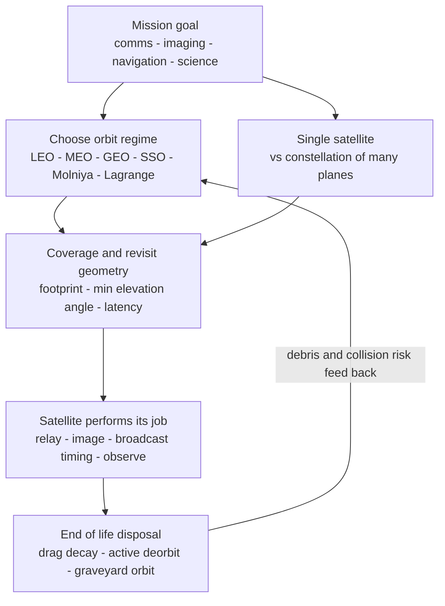

# 🛰️ Satellites and Space Missions: The Orbit Is the Mission

> [!abstract] TL;DR
> A satellite's **orbit is not a detail of the mission — it *is* the mission**. Once you decide what you want to do in space, orbital geometry decides where you must fly, and everything else follows. Want to **hover over one spot on Earth forever**? Park at **GEO** (geostationary, 35 786 km up, $r \approx 42\,164$ km) where your period equals one **sidereal day**, giving a huge footprint and a fixed sky position — at the cost of ~120 ms one-way light latency and zero polar coverage. Want to **photograph the whole planet in fine detail with constant lighting**? Fly low and near-polar in a **sun-synchronous orbit** so the world rotates beneath you and $J_2$ precession holds the Sun angle constant. Want to **blanket the globe with internet, navigation, or timing**? No single satellite can — you need a **constellation**, a timed swarm so at least the required number are always overhead. The orbit families each buy a different capability: **LEO** (~200–2000 km: low latency, small fast-moving footprint, cheap access, natural drag decay — the home of imaging, the ISS, and mega-constellations like Starlink/OneWeb), **MEO** (~20 000 km: the 12-hour home of GPS/GNSS), **GEO** (comms and weather), **Molniya/HEO** (highly eccentric, long high-latitude dwell), and **Lagrange-point** orbits (deep-space observatories like JWST at Sun–Earth $L_2$). **Coverage and revisit** are pure geometry — footprint size grows with altitude but so does latency, and continuous global coverage forces a minimum satellite count set by how much of Earth each one can see. Satellites underpin **communications, navigation, Earth observation, science, and defense**, in sizes from bus-sized GEO platforms down to **CubeSats** riding shared launches. The flip side of this crowded sky is **space sustainability**: **orbital debris**, collision risk, the specter of **Kessler-syndrome** cascades, and hardening deorbit/disposal rules (the old 25-year guideline now tightening toward 5 years). Understanding how **orbit geometry maps to mission capability — and how the debris crisis threatens it — is the core of the modern space economy.**

---

## Intuition

**Analogy:** Look up. You are standing beneath an invisible infrastructure of thousands of satellites, each one parked in an orbit chosen for its job the way a building is chosen for its **real estate and its view**. A satellite orbit is prime real estate: some locations are cheap and crowded, some are exclusive and expensive, and *what you can do there is set entirely by where you are.* Want to stare at one place on Earth without ever moving in the sky — a fixed billboard over the Atlantic? There is exactly one shelf that lets you do that: **park at GEO**, 36 000 km up, where a single loop takes exactly one day so you spin in perfect lockstep with the ground below and appear frozen overhead. Want to inspect every street on Earth in sharp detail? Then you must fly **low and near-polar**, skimming close so your camera resolves fine detail while the whole planet rotates through your gaze underneath. Want to give the entire world a signal that is always available — GPS, satellite internet? Then no single address will do; you need a whole **neighborhood** of satellites, a constellation timed so that no matter where you stand, several are always above your horizon.

That is the one idea to carry through everything below: **the orbit is the mission.** Altitude, inclination, eccentricity, and whether you fly alone or in a swarm are not afterthoughts bolted onto a spacecraft — they are the *first* decision, because geometry alone dictates what a satellite can and cannot see, how fast it revisits, how far its signal must travel, and how many friends it needs to do the job continuously.

---

## How It Works

### Core Mechanics

1. **Start from the mission, not the satellite.** Every satellite exists to do one of a small set of jobs — **relay a signal** (communications), **broadcast a precise timing/ranging signal** (navigation), **capture the surface or atmosphere** (Earth observation), or **point outward** (science). The job sets the requirements: coverage area, revisit rate, tolerable latency, resolution, and lifetime. Those requirements, not aesthetics, choose the orbit.

2. **Altitude is the master trade.** Fly **low** and you get small path loss, tiny signal latency, cheap launch, fine imaging resolution — but a **small, fast-moving footprint** (you see only a small cap of Earth and it whips by in minutes) and, below ~600 km, meaningful **atmospheric drag** that decays the orbit. Fly **high** and you get a **huge footprint** and slow apparent motion — but big path loss, worse resolution, higher launch cost, and, at GEO, a fixed ~120 ms one-way light delay. Altitude buys footprint and pays in latency and resolution.

3. **Inclination sets which latitudes you visit.** A satellite's ground track never reaches higher latitude than its **inclination** $i$. Equatorial ($i \approx 0°$, e.g. GEO) never sees the poles; **polar** ($i \approx 90°$) sweeps everything. **Sun-synchronous** orbits use a slightly retrograde $i \approx 98°$ so that Earth's oblateness ($J_2$) precesses the orbit plane ~0.9856°/day — one turn per year — keeping the local solar time of every pass constant for consistent imaging light.

4. **Coverage is horizon geometry.** From a satellite at radius $r = R_\oplus + h$, a ground user can only be served above a **minimum elevation angle** $\varepsilon$ (to clear terrain, buildings, and atmosphere). The **Earth central angle** of the visible cap is $\lambda = 90° - \varepsilon - \arcsin\!\big[(R_\oplus/r)\cos\varepsilon\big]$, and the fraction of Earth's surface in view is $\tfrac12(1 - \cos\lambda)$. This single relation, driven by altitude, is the geometric backbone of coverage.

5. **Continuous coverage forces a constellation.** One satellite sees only its instantaneous cap, so to cover a region (or the globe) *without gaps* you need many satellites arranged in **planes**. **Walker constellations** — specified compactly as $i\!:\!T/P/F$ (inclination, total satellites $T$, planes $P$, phasing $F$) — distribute satellites evenly so a minimum number are always in view. A rough geometric floor for instantaneous single-fold global coverage is $N_{\min} \approx 1 / \big[\tfrac12(1-\cos\lambda)\big]$: ~3 at GEO, dozens in LEO — which is exactly why GPS uses ~24–31 in MEO and Starlink flies thousands in LEO.

6. **The satellite does its job — then must be disposed of.** In its operational orbit the payload relays, images, broadcasts, or observes, while the bus supplies power, pointing (attitude control), thermal control, and station-keeping. At **end of life** the satellite must be removed: low LEO decays naturally via drag, but higher orbits require an active **deorbit** burn or a boost to a **graveyard orbit** (GEO satellites are lifted a few hundred km above the belt). Skipping disposal adds to the **debris** population and the long-term **Kessler-syndrome** collision-cascade risk.

### Flow / Architecture



---

## Key Concepts

### Secondary Level

- **A satellite is parked at a chosen height for a reason.** Low satellites (like the space station, ~400 km) zip around Earth in about 90 minutes and see only a small patch at a time. High satellites see a huge area but from far away.
- **GEO satellites hang still in the sky.** A TV or weather satellite ~36 000 km up takes exactly one day to circle Earth, so it turns in step with the ground and *appears frozen* over one spot — which is why a satellite dish can be bolted in one direction and never moved.
- **Photographing the whole Earth means flying low over the poles.** Imaging and weather satellites fly low, near the poles, so the planet spins beneath them and, day after day, the entire surface passes under the camera.
- **GPS and satellite internet need a whole swarm.** One satellite can only cover part of the world at once and keeps moving, so systems that must *always* work everywhere — navigation, satellite internet — use a **constellation** of many satellites timed so several are always overhead.
- **Space is getting crowded, and junk is a real danger.** Dead satellites and debris keep orbiting for years. A collision creates thousands of new fragments, each able to cause more collisions — a runaway risk called **Kessler syndrome** — so operators now must plan to bring satellites down at end of life.

### Undergraduate Level

- **Orbit regimes and their jobs.** **LEO** (~160–2000 km): imaging, ISS, comms mega-constellations — low latency and fine resolution, small fast footprint, natural drag decay. **MEO** (~20 000 km): GNSS (GPS/Galileo/GLONASS/BeiDou), ~12 h period. **GEO** (35 786 km altitude, $r = 42\,164$ km, $i \approx 0$): comms and weather — one satellite covers ~1/3 of Earth but with fixed latency and no polar view. **Sun-synchronous/polar** (~600–800 km, $i \approx 98°$): Earth observation with constant lighting. **Molniya/HEO** ($e \approx 0.74$, $i = 63.4°$, 12 h): long apogee dwell over high northern latitudes GEO cannot reach. **Lagrange-point orbits**: space telescopes (JWST at Sun–Earth $L_2$).
- **Footprint and elevation geometry.** Coverage cap grows with altitude via $\lambda = 90° - \varepsilon - \arcsin[(R_\oplus/r)\cos\varepsilon]$; higher minimum elevation $\varepsilon$ shrinks usable coverage. Surface fraction in view $= \tfrac12(1-\cos\lambda)$; ground-range footprint radius $\approx R_\oplus \lambda$ (with $\lambda$ in radians).
- **Coverage vs revisit.** A single LEO satellite gives excellent resolution but revisits a given point only every few days; raising the number of satellites/planes trades hardware count for shorter revisit and continuous coverage.
- **Walker constellations.** Notation $i\!:\!T/P/F$ evenly spreads $T$ satellites over $P$ planes with inter-plane phasing $F$. GPS ~24–31 (MEO, 6 planes), Iridium 66 (LEO, 6 polar planes with **inter-satellite links** routing calls satellite-to-satellite), Starlink/OneWeb thousands.
- **Applications.** **Communications** (TV broadcast, broadband internet, backhaul), **navigation** (GNSS), **Earth observation/remote sensing** (weather, optical/SAR imaging, climate, reconnaissance), **science** (telescopes, planetary probes), and **military**.
- **Mission types (deep space).** Increasing difficulty: **flyby** → **orbiter** → **atmospheric probe/lander** → **rover** → **sample return** → **crewed**.
- **Satellite sizes and access.** From multi-tonne GEO buses down to **SmallSats** and **CubeSats** (multiples of a 10 cm cube), democratizing space via cheap standardized hardware and **rideshare** launches. The **ground segment** (tracking, telemetry, command, mission operations) is as essential as the space segment.

### Graduate Level

- **Constellation design methods.** Beyond Walker Delta/Star patterns, **streets-of-coverage** design guarantees continuous coverage of a latitude band by overlapping the swaths of satellites in each plane; the number of planes and satellites-per-plane trade against altitude (hence $\lambda$), required fold of coverage (e.g. GNSS needs $\ge 4$ visible for a 3D+time fix), and minimum elevation mask. Higher altitude → fewer satellites but higher latency and launch energy.
- **Link and latency budgets.** Free-space path loss scales as $(4\pi d/\lambda_{\text{wave}})^2$; one-way propagation delay is $d/c$ (~120 ms at GEO, a few ms in LEO — the latency case for LEO broadband). Antenna gain, frequency band (L/S/C/X/Ku/Ka), rain fade, and Doppler (severe for fast LEO) all follow from the orbit geometry, tying mission design to RF engineering.
- **Station-keeping budgets.** GEO satellites need north–south station-keeping to fight luni-solar inclination growth (~0.85°/yr, ~50 m/s/yr of $\Delta v$ — usually the dominant lifetime-limiting propellant cost) plus east–west keeping against Earth's triaxiality; LEO satellites spend $\Delta v$ fighting drag. Electric propulsion increasingly supplies this cheaply.
- **Orbital debris and the environment.** The debris population is tracked by catalog (>30 000 objects >10 cm) but dominated by untracked lethal small fragments. Collision probability scales with cross-section, dwell time, and local spatial density; the **NASA ORDEM/ESA MASTER** models quantify flux. **Kessler syndrome** is the runaway regime where collision-generated debris outpaces natural decay, a positive-feedback cascade in the crowded ~800 km and sun-synchronous shells.
- **Sustainability rules and space traffic management (STM).** Post-mission disposal guidelines (IADC/ISO 24113) historically set a **25-year** orbital-lifetime cap for LEO; regulators (e.g. the US FCC) are tightening toward **5 years**, with GEO objects reboosted to a graveyard orbit ~300 km above the belt. Active debris removal, collision-avoidance conjunction screening, and coordinated STM are emerging necessities as mega-constellations multiply active objects by an order of magnitude.
- **Systems-engineering closure.** Orbit selection couples to every subsystem: power (eclipse fraction and beta angle set solar-array and battery sizing), thermal (view factors), attitude (pointing for payload and antennas), propulsion (deployment, station-keeping, disposal $\Delta v$), and radiation (the MEO/GEO environment and the Van Allen belts drive component hardening). The orbit is the first requirement from which the whole spacecraft flows.

---

## Python Demo

```python
# Satellites & orbits: how orbit choice sets coverage, and why continuous
# global coverage forces a constellation. numpy + matplotlib only.
#
#   (a) GROUND TRACKS -- propagate a circular orbit and project the
#       subsatellite point to lon/lat for a LEO (inclined) vs a GEO satellite,
#       accounting for Earth's rotation. LEO weaves quickly and drifts west each
#       pass; GEO collapses to a single FIXED dot (period = one sidereal day).
#
#   (b) COVERAGE FOOTPRINT vs ALTITUDE -- Earth central angle (how big a cap the
#       satellite can see) and the fraction of Earth's surface in view, for two
#       minimum-elevation masks, from LEO up to GEO.
#
#   (c) CONSTELLATION SIZE -- the minimum number of satellites to blanket the
#       whole globe at once = sphere area / footprint-cap area. This is WHY LEO
#       comms needs dozens-to-thousands (Starlink) but GEO needs only ~3.

import numpy as np
import matplotlib.pyplot as plt

mu   = 398600.4418        # Earth GM [km^3/s^2]
Re   = 6378.137           # Earth equatorial radius [km]
Tsid = 86164.0905         # sidereal day [s]
we   = 2 * np.pi / Tsid   # Earth rotation rate [rad/s]

def period(a):
    return 2 * np.pi * np.sqrt(a**3 / mu)

# ---- GEO stationary condition: solve period = one sidereal day ----
a_geo = (mu * Tsid**2 / (4 * np.pi**2))**(1.0 / 3.0)
print("=== GEO stationary condition: period = one sidereal day ===")
print(f"  r_GEO = {a_geo:8.1f} km  (altitude {a_geo - Re:8.1f} km),  "
      f"period = {period(a_geo) / 3600:.3f} h")

# ---- (a) ground track of a circular orbit ----
def ground_track(alt, inc_deg, raan_deg=0.0, n_orbits=3.0, npts=2000):
    a    = Re + alt
    n    = np.sqrt(mu / a**3)                 # mean motion [rad/s]
    t    = np.linspace(0.0, n_orbits * period(a), npts)
    u    = n * t                              # argument of latitude (circular)
    i    = np.radians(inc_deg)
    raan = np.radians(raan_deg)
    lat      = np.arcsin(np.sin(i) * np.sin(u))               # subsat latitude
    lon_orb  = np.arctan2(np.cos(i) * np.sin(u), np.cos(u))   # rel. ascending node
    lon      = raan + lon_orb - we * t                        # Earth rotates under it
    lon      = (np.degrees(lon) + 180.0) % 360.0 - 180.0      # wrap to [-180, 180]
    return np.degrees(lat), lon

lat_leo, lon_leo = ground_track(550.0, 53.0, n_orbits=4.0)      # Starlink-like shell
lat_geo, lon_geo = ground_track(a_geo - Re, 0.0, raan_deg=60.0, n_orbits=1.0)

# ---- (b)/(c) coverage geometry vs altitude ----
def central_angle(alt, elev_deg):
    r   = Re + alt
    ep  = np.radians(elev_deg)
    eta = np.arcsin((Re / r) * np.cos(ep))    # nadir angle to the horizon-elev ring
    return np.pi / 2 - ep - eta               # Earth central angle [rad]

alts   = np.linspace(300.0, a_geo - Re, 500)
lam0   = central_angle(alts, 0.0)             # horizon-limited
lam10  = central_angle(alts, 10.0)            # 10-degree elevation mask
frac0  = (1 - np.cos(lam0)) / 2               # fraction of Earth area in view
frac10 = (1 - np.cos(lam10)) / 2
Nmin0  = 1.0 / frac0                          # sats to tile the sphere once (floor)
Nmin10 = 1.0 / frac10

regimes = [("LEO 550", 550.0), ("MEO 20200", 20200.0), ("GEO", a_geo - Re)]
print("\n=== coverage & minimum constellation size (10-deg elevation mask) ===")
for name, h in regimes:
    lam = central_angle(h, 10.0)
    f   = (1 - np.cos(lam)) / 2
    print(f"  {name:11s} alt {h:8.0f} km : central angle {np.degrees(lam):5.1f} deg, "
          f"sees {100*f:5.2f}% of Earth, N_min ~ {1/f:6.1f} sats")

# ---------------- plots ----------------
fig, ax = plt.subplots(1, 3, figsize=(16, 5))
fig.suptitle("Satellites & orbits: the orbit sets the coverage, the coverage sets the constellation",
             fontsize=13, fontweight="bold")

# (1) ground tracks
ax[0].scatter(lon_leo, lat_leo, s=3, color="#1f77b4", label="LEO 550 km, i = 53 deg")
ax[0].scatter(lon_geo, lat_geo, s=120, color="#d62728", marker="*",
              zorder=5, label="GEO: fixed point")
ax[0].set_xlim(-180, 180); ax[0].set_ylim(-90, 90)
ax[0].set_xticks(range(-180, 181, 60)); ax[0].set_yticks(range(-90, 91, 30))
ax[0].set_xlabel("longitude [deg]"); ax[0].set_ylabel("latitude [deg]")
ax[0].set_title("(a) ground tracks")
ax[0].grid(alpha=0.3); ax[0].legend(loc="upper right", fontsize=8)

# (2) coverage vs altitude
ax[1].plot(alts, np.degrees(lam0),  "b-",  lw=2, label="horizon: 0 deg elev")
ax[1].plot(alts, np.degrees(lam10), "b--", lw=2, label="10 deg elev mask")
ax2 = ax[1].twinx()
ax2.plot(alts, 100 * frac0,  "g-",  lw=1.5, alpha=0.6)
ax2.plot(alts, 100 * frac10, "g--", lw=1.5, alpha=0.6)
ax2.set_ylabel("Earth surface in view [%]", color="g")
ax[1].set_xlabel("altitude [km]"); ax[1].set_ylabel("Earth central angle [deg]", color="b")
ax[1].set_title("(b) coverage footprint vs altitude")
ax[1].grid(alpha=0.3); ax[1].legend(loc="lower right", fontsize=8)

# (3) minimum constellation size
ax[2].semilogy(alts, Nmin0,  "m-",  lw=2, label="horizon: 0 deg")
ax[2].semilogy(alts, Nmin10, "m--", lw=2, label="10 deg elev mask")
for name, h in regimes:
    f = (1 - np.cos(central_angle(h, 10.0))) / 2
    ax[2].scatter([h], [1 / f], color="k", zorder=5)
    ax[2].annotate(f"{name}\n~{1/f:.0f} sats", xy=(h, 1 / f),
                   xytext=(h, 1 / f * 2.4), fontsize=8, ha="center")
ax[2].set_xlabel("altitude [km]"); ax[2].set_ylabel("min satellites, log scale")
ax[2].set_title("(c) satellites for instantaneous global coverage")
ax[2].grid(alpha=0.3, which="both"); ax[2].legend(loc="upper right", fontsize=8)

plt.tight_layout(rect=[0, 0, 1, 0.95])
plt.show()
```

Running this prints the numbers and draws three panels. Panel **(a)** projects two orbits onto a longitude/latitude map: the **LEO** satellite (550 km, $i = 53°$) traces the classic fast sinusoidal weave that reaches $\pm 53°$ latitude and **drifts westward each pass** (because Earth rotates east underneath it), while the **GEO** satellite collapses to a **single fixed red star** — its period exactly equals the sidereal day, so it never moves relative to the ground. Panel **(b)** shows the coverage geometry: the **Earth central angle** (blue) grows from a small cap in LEO toward ~81° at GEO, and the **surface fraction in view** (green) rises from under 2% for a LEO satellite to ~40% for a GEO satellite — one GEO bird sees nearly a third of the planet, one LEO bird a sliver. Panel **(c)** turns that into the punchline: the **minimum number of satellites for instantaneous global coverage** (sphere area divided by cap area) is only ~3 at GEO but tens in LEO. The printout confirms the GEO stationary condition ($r_{\text{GEO}} = 42\,164$ km, period 23.93 h) and the marked regimes (LEO ~60, MEO ~3–4, GEO ~3 at a 10° mask) — which is precisely why GPS uses ~24 in MEO for four-fold coverage while Starlink flies **thousands** in LEO for capacity and redundancy.

---

## Real-World Applications

> **Example — LEO mega-constellations (Starlink, OneWeb).** These exploit the two defining LEO facts: low altitude gives **low latency** (a few milliseconds, unlike GEO's ~120 ms — the whole point for competitive broadband) and fine handoff granularity, but a small fast-moving footprint means you need **thousands of satellites** in dozens of Walker planes so at least one is always above every user. The same low altitude makes **atmospheric drag a disposal feature**: failed satellites reenter within a few years rather than lingering for centuries. Inter-plane phasing and (for some systems) **inter-satellite laser links** route traffic across the swarm.

> **Example — GNSS lives in MEO (GPS, Galileo, GLONASS, BeiDou).** GPS flies ~24–31 satellites at ~20 200 km in six ~55°-inclined planes with a **12-hour period**, a semi-major axis chosen straight from Kepler's third law so the ground track repeats. The constellation geometry is engineered so at least **four satellites are always visible** anywhere, which is the minimum for a 3D position-plus-time fix by trilateration — a direct case of coverage *fold* (not just coverage) driving the satellite count.

> **Example — GEO communications and weather (Intelsat, GOES, Meteosat).** A geostationary comsat at $r = 42\,164$ km hangs over a fixed longitude so ground dishes never move, and one satellite blankets ~1/3 of the globe — ideal for broadcast TV and continuous full-disk weather imaging. The costs are the fixed light-latency and the absence of polar coverage, plus a lifetime dominated by the propellant needed for north–south **station-keeping** against luni-solar inclination drift.

> **Example — sun-synchronous Earth observation (Landsat, Sentinel, Planet).** Imaging and climate satellites fly ~700 km, $i \approx 98°$ orbits deliberately tuned so $J_2$ precession rotates the orbit plane one turn per year, holding the **local solar time of every pass constant** — consistent shadows and lighting for comparable imagery. **Planet's** flock of CubeSat "Doves," launched cheaply by rideshare, images the entire landmass daily, showing how small standardized satellites democratize Earth observation.

> **Example — Lagrange-point science (JWST at Sun–Earth $L_2$).** Deep-space observatories are not in Earth orbit at all; JWST orbits the Sun–Earth $L_2$ point ~1.5 million km out, where it keeps a stable geometry relative to Sun and Earth, points continuously into deep space, and stays cold behind its sunshield — a mission whose "orbit" is chosen for thermal and pointing stability rather than Earth coverage.

---

## Common Pitfalls

- **"A GEO satellite covers the whole Earth."** It sees only ~1/3 of the globe and **cannot cover the poles at all** (its footprint fades out above ~70° latitude). Three GEO satellites blanket the equatorial and mid-latitude world but leave permanent polar gaps — which is exactly why high-latitude services use Molniya/HEO or polar LEO instead.
- **Confusing geostationary with geosynchronous.** *Geosynchronous* means a 24-hour (sidereal-day) period; *geostationary* is the special case with $i = 0$ and $e = 0$ so the satellite is truly fixed in the sky. An inclined geosynchronous orbit traces a **figure-8 (analemma)** ground track, not a point.
- **Sidereal vs solar day for GEO.** A geostationary orbit matches Earth's **sidereal** rotation (23 h 56 m 4 s = 86 164 s), not the 24-hour solar day. Using 86 400 s in Kepler's third law misplaces GEO altitude by tens of kilometers — enough that the satellite slowly drifts off station.
- **Overestimating coverage by ignoring the minimum elevation angle.** Coverage computed at 0° elevation (the geometric horizon) is fantasy: real links need $\varepsilon \approx 5$–$25°$ to clear terrain, buildings, rain, and atmospheric loss. A 10° mask can cut usable coverage area dramatically and *raise* the required constellation size — as the demo's dashed curves show.
- **Assuming every satellite deorbits itself.** Only low LEO (below ~600 km) decays quickly via drag. Above that, and especially in the sun-synchronous shell, objects linger for **decades to centuries** unless actively deorbited. Designing a satellite without a disposal plan is now both bad engineering and, increasingly, illegal.
- **Treating "more satellites" as free capability.** Every added satellite raises collision probability and debris risk. The crowded ~800 km and sun-synchronous shells are where a single collision can seed a **Kessler-syndrome** cascade — a systemic risk, not an individual one, so more coverage is not automatically better.
- **Thinking a single satellite can continuously cover a moving or fixed point (except GEO).** Any non-GEO satellite rises and sets; continuous service at a location requires a **constellation** so that as one satellite drops below the horizon another is already above it. A "one satellite" solution to a continuous-coverage requirement is a geometry error.

*(This note sits at the applied end of the Aerospace Astronautics sequence and leans on its siblings: Orbital_Mechanics_and_Astrodynamics supplies the conic-section orbits, vis-viva, and Kepler's laws that fix the altitude–speed–period relations used throughout here; Orbital_Maneuvers_and_Transfers explains the Hohmann, phasing, and plane-change burns that deploy a constellation into its slots and reboost satellites to graveyard orbits; Spacecraft_Attitude_Dynamics_and_Control governs how each satellite points its payload and antennas once on station; Spacecraft_Systems_Engineering closes the loop from orbit choice to power, thermal, propulsion, and radiation subsystem sizing; and The_Reach_and_Future_of_Aerospace_Engineering places mega-constellations, the space economy, and the debris crisis in the wider trajectory of the field.)*

---

## Related Concepts

**The celestial-mechanics foundation — same orbits, astronomy framing**
- [[Orbital_Mechanics_and_Celestial_Dynamics]] — the Astronomy-vault treatment of Kepler's laws, the two-body problem, and orbital periods; this note applies exactly that geometry to *choosing* orbits for real missions and computing their coverage

**The satellite link — RF and physical-layer engineering**
- [[Waveguides_and_Antennas]] — the antenna gain and beam geometry that, together with the orbit's slant range, set a satellite link's footprint and signal strength
- [[RF_and_Microwave_Engineering]] — the frequency bands (L/S/C/X/Ku/Ka), path loss, and rain-fade physics that make the latency and link budgets driven by orbit altitude concrete
- [[Physical_Layer]] — a satellite link *is* a physical-layer channel; the networking view of how bits ride the RF carrier that the orbit geometry constrains

**The sustainability threat — systemic collision risk**
- [[Cascades_and_Systemic_Risk]] — Kessler syndrome is a textbook cascading failure: one collision seeds fragments that trigger more, a positive-feedback systemic risk in a crowded network of orbits

**Vault entry point**
- [[Aerospace_Engineering_Overview]] — the Aerospace vault's map; satellites and space missions are the applied payoff of the astronautics branch, where orbital mechanics meets real-world use

---

## Review Questions

**Secondary**
1. A friend says "satellite TV works because the dish points at a satellite that flies across the sky, so the dish must track it." Explain what is actually true: which orbit lets a dish stay bolted in one fixed direction, roughly how high it is, and why the satellite appears frozen in the sky. Then explain why that same kind of satellite is a *bad* choice for covering the North and South Poles.

**Undergraduate**
2. You must design an Earth-observation mission that images the whole planet with consistent lighting and fine resolution. (a) Which orbit regime and inclination do you choose, and why does low altitude help resolution but hurt instantaneous coverage? (b) Explain how $J_2$ precession is exploited to keep the local solar time of each pass constant. (c) A single satellite in this orbit revisits a given point only every few days — what design change shortens the revisit time, and what does it cost?
3. Using the coverage geometry $\lambda = 90° - \varepsilon - \arcsin[(R_\oplus/r)\cos\varepsilon]$ and surface fraction $\tfrac12(1-\cos\lambda)$, explain qualitatively why one GEO satellite can see ~1/3 of Earth while a 550 km LEO satellite sees under 2%, and why this makes a global LEO comms system need dozens-to-thousands of satellites while GEO needs only three. What role does the minimum elevation angle $\varepsilon$ play?

**Graduate**
4. Space sustainability and constellation design. (a) Contrast the natural disposal of a 500 km LEO satellite with an 800 km sun-synchronous satellite and a GEO satellite, and explain why the 25-year-then-5-year deorbit rules and GEO graveyard reboosts exist. (b) Explain Kessler syndrome as a positive-feedback cascade and identify which orbital shells are most at risk and why. (c) A GNSS operator needs at least four satellites visible everywhere for a 3D+time fix, while a GEO broadcaster needs only one over its service region — explain how "fold of coverage" changes the constellation-sizing calculation beyond the single-fold geometric floor, and how altitude, plane count, and elevation mask trade against latency and launch energy in choosing MEO versus LEO for the same continuous-coverage requirement.

---

## Sources

- J. R. Wertz & W. J. Larson (eds.) — *Space Mission Analysis and Design (SMAD)*, 3rd ed. (Microcosm/Springer, 1999) — the standard systems-engineering reference for orbit selection, coverage/constellation design, and the mission-to-orbit mapping
- D. A. Vallado — *Fundamentals of Astrodynamics and Applications*, 4th ed. (Microcosm/Springer, 2013) — authoritative on ground tracks, orbit regimes, perturbations, and coverage geometry used throughout this note
- G. Maral & M. Bousquet — *Satellite Communications Systems: Systems, Techniques and Technology*, 5th ed. (Wiley, 2009) — comms-oriented treatment of GEO/MEO/LEO, link budgets, coverage, and constellation architectures
- V. L. Pisacane — *Fundamentals of Space Systems*, 2nd ed. (Oxford University Press, 2005) — spacecraft-systems perspective tying orbit choice to power, thermal, attitude, propulsion, and mission operations
- Inter-Agency Space Debris Coordination Committee (IADC) — *Space Debris Mitigation Guidelines* — the disposal/deorbit and graveyard-orbit rules behind the sustainability discussion ([iadc-home.org](https://www.iadc-home.org/))

---

#aerospace-engineering #satellites #orbits #constellations #space-missions
