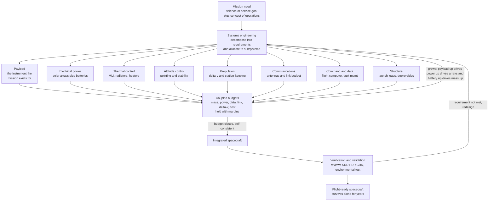

# 🛰️ Spacecraft Systems Engineering

> [!abstract] TL;DR
> A spacecraft is a tiny self-contained world that must survive **alone**, for years, in the most hostile environment imaginable, with **no repair crew** — so it has to make its own electricity (**solar arrays + batteries**), keep itself from freezing or cooking with no air to carry heat (**thermal control**), know and hold which way it points (**attitude control, ADCS**), phone home across millions of kilometres (**communications**), think for itself when Earth is out of contact (**command and data handling**), move itself (**propulsion**), hold together through launch (**structure**), and carry the one instrument that justifies the whole mission (**payload**). **Systems engineering** is the discipline that orchestrates these tightly-coupled subsystems into a single machine that *closes*: it decomposes a mission need into **requirements**, allocates them to subsystems, and manages the interlocking **budgets** — mass, power, data, link, delta-v, cost, schedule — each fought over kilogram by kilogram and watt by watt, with **margins** held in reserve. The defining feature is coupling: grow the payload and it demands more power, which needs bigger arrays and a bigger battery, which adds mass, which burns more propellant — a change *anywhere* ripples *everywhere*, so the design must be **iterated until it converges** to a consistent whole. Systems engineering then controls the **interfaces** between subsystems and **verifies** the integrated vehicle against every requirement through a gated review sequence (SRR → PDR → CDR) and test — because it has to work the **first** time. It is the integrative capstone of astronautics: the discipline that turns a mission idea into hardware that lives untouched in space, and the canonical example of true **systems** thinking.

---

## Intuition

**Analogy:** Imagine you must build a **tiny sealed spaceship-in-a-bottle** and then fling it away forever — no wire back, no mechanic, no spare parts, no second chance. Inside that bottle a little civilisation has to run itself: it must generate its own power from the Sun, keep its rooms from freezing on the dark side and roasting on the sunlit side, always know which way it is facing, shout a signal loud enough to be heard from across an ocean of empty space, and remember how to look after itself when nobody answers its calls for hours. And it has to do all of this while weighing less than a strict limit set by the slingshot that throws it — every extra gram of one thing means one gram less of everything else. **Systems engineering is the job of the person who packs that bottle**: deciding how much of the precious weight and power goes to each function so that, together, they add up to something that *works* and *survives*, and making sure the parts fit each other exactly, because once the cork goes in you never touch it again.

That is a spacecraft. The instrument it carries — a camera, a telescope, a radio transponder, a science package — is the whole *reason* for the mission; every other subsystem exists only to keep that instrument alive, aimed, powered, cool, and in touch with Earth. What makes it hard is that the subsystems are not a list of independent gadgets but a **web of dependencies**: touch one and the rest move. The engineer's real product is not any single subsystem but the *agreement* between all of them — a design that **closes**.

---

## How It Works

### Core Mechanics

**1. Start from the mission, not the hardware.** Systems engineering begins with a **mission need** — "map global sea-surface height to centimetre accuracy," "relay television over Europe," "return images of Jupiter's moons" — and a **concept of operations (ConOps)** describing how the spacecraft is launched, deployed, operated, and disposed of. This top-level need is decomposed into **requirements** (what the system must do, and how well), which are then **allocated** down to subsystems. Requirements flow *down*; verification flows back *up*.

**2. The payload rules; everything else serves it.** The **payload** is the mission instrument — the only part that produces the value the mission was funded for. Its needs (mass, power, pointing accuracy, data rate, thermal environment, field of view) become the **primary drivers** that size every other subsystem, together called the **bus** or **platform**.

**3. The bus subsystems.** A spacecraft bus is a standard set of interdependent subsystems:
- **Electrical Power (EPS)** — **solar arrays** generate power in sunlight; **batteries** carry the load through **eclipse**; power management and distribution regulates and switches it. The **eclipse/sunlight cycle** of the orbit directly sizes both array and battery.
- **Thermal Control (TCS)** — in vacuum there is no convection, so heat moves only by **radiation** and conduction. Multilayer insulation (MLI) blankets, **radiators**, surface coatings, and electric **heaters** hold every component between its temperature limits despite brutal sun-to-shade swings.
- **Attitude Determination and Control (ADCS)** — determines and holds which way the vehicle points (reaction wheels, thrusters, star trackers, gyros).
- **Propulsion** — provides the **delta-v** for orbit insertion, station-keeping, and disposal; its propellant mass follows the rocket equation.
- **Communications (TT&C / comms)** — antennas and transponders close the **link budget** to ground stations (or the Deep Space Network) across enormous distances, carrying commands up and telemetry plus payload data down.
- **Command and Data Handling (C&DH)** — the **flight computer**, data storage, and **fault management**; radiation-hardened so a cosmic-ray strike does not corrupt it.
- **Structure and Mechanisms** — carries **launch loads**, provides the geometry, and drives **deployables** (arrays, antennas, booms).

**4. The coupled budgets.** The subsystems are tied together by shared, finite **budgets**: **mass**, **power**, **data/onboard storage**, communications **link**, **delta-v**, **cost**, and **schedule**. These are not independent ledgers — they are coupled. A heavier payload needs more structure and more propellant; a hungrier payload needs a bigger array and battery, which add mass, which needs more propellant. Engineers carry **margins** (reserves, e.g. a 20–30% mass-growth allowance early in design) so that inevitable growth does not break the design.

**5. Closing the design.** Because the budgets feed back on each other, a first guess never balances. The engineer **iterates**: size power from the payload, size the array and battery from power, add their mass, recompute structure and propellant, and repeat until the numbers stop changing. When a self-consistent vehicle emerges that fits inside the launch vehicle's mass and volume with margin to spare, the design has **closed**. A design that will not close is over-ambitious for the available launch and technology.

**6. Interfaces and verification (the V-model).** Alongside the budgets, systems engineering **controls the interfaces** — the mechanical, electrical, thermal, and data boundaries between subsystems — through interface control documents, so parts built by different teams actually fit. The lifecycle follows the **V-model**: requirements and design flow *down* the left arm (SRR → PDR → CDR — System Requirements, Preliminary Design, Critical Design Reviews), then **integration, verification, and validation** climb back *up* the right arm (test the components, then the subsystems, then the whole vehicle) proving each requirement is met before flight.

**7. Design for the space environment with no repair.** The vehicle must survive **vacuum**, extreme **thermal cycling**, **radiation** (single-event upsets and cumulative total dose), **micrometeoroids and debris**, and **atomic oxygen** in low orbit — for years, untouched. Reliability is engineered in up front: **redundancy** (backup units, cross-strapping), **derating** components, extensive **testing**, and **fault-tolerant** autonomy, because there is no service call in deep space.

### Flow / Architecture



---

## Key Concepts

### Secondary Level

- **A tiny world that must fend for itself.** A spacecraft carries everything it needs to survive alone: its own power plant, its own heater and air-conditioner, its own sense of direction, and its own radio — because nobody can go up and fix it.
- **The payload is the point.** The camera, telescope, or radio the spacecraft carries is the *reason* it exists. Every other part — power, heat, pointing, radio — is there only to keep that one instrument working.
- **Power from the Sun, stored for the dark.** **Solar panels** make electricity when the Sun shines, and **batteries** store enough to keep everything running while the spacecraft is in Earth's shadow (**eclipse**). Sizing them is a balance between the sunlit and shadowed parts of the orbit.
- **No air means heat is a problem.** With no air to carry warmth away, a spacecraft can only shed heat by glowing it into space (**radiation**). It wears shiny insulating **blankets**, dark **radiators**, and small **heaters** to stay at the right temperature between blazing sun and freezing shade.
- **Weight is everything.** The rocket can only lift so much, so every kilogram is fought over. Making one part heavier or hungrier forces every other part to shrink — the essence of a **budget**.
- **It has to work the first time.** There is no test flight in space and no repair crew, so engineers build in **backups** and test relentlessly on the ground before launch.

### Undergraduate Level

- **Requirements, allocation, and the V-model.** A mission need is decomposed into **requirements**, allocated to subsystems, then verified back up through **integration and test**. Design descends the left arm of the V; verification and validation climb the right arm. Gate reviews — **SRR, PDR, CDR** — control maturity before committing resources.
- **The bus subsystems and their drivers.** EPS (power), TCS (thermal), ADCS (attitude), propulsion (delta-v), comms (link), C&DH (computing), structure. Each is sized by the **payload** and by the **orbit** (which sets eclipse fraction, thermal environment, radiation dose, and comms range).
- **Power sizing from the eclipse cycle.** The array must supply the orbit load *and* recharge the battery during the sunlit fraction: a common sizing rule is `P_array = (P_e·T_e/X_e + P_d·T_d/X_d) / T_d`, where `T_e`, `T_d` are eclipse and daylight times and `X_e`, `X_d` are path efficiencies. The **battery** is sized by eclipse energy and an allowable **depth of discharge** (DoD): `capacity = P_e·T_e / DoD`.
- **The link budget.** Received power falls with the square of distance: `P_rx = P_tx·G_tx·G_rx·(λ / 4πd)²`. The **margin** above the receiver threshold (accounting for the noise floor and required signal-to-noise) determines whether the downlink closes — the reason deep-space missions need huge dishes and the Deep Space Network.
- **The delta-v / mass budget and coupling.** Propellant follows the rocket equation `m_prop = m_dry·(e^(Δv/g₀Isp) − 1)`, so more dry mass means more propellant. Structure and thermal mass scale with total mass, closing a **feedback loop** that must be iterated to a **fixed point** — this is what "closing the design" means.
- **Margins and growth allowance.** Early designs carry explicit reserves (mass-growth allowance, power margin, link margin, delta-v reserve) because subsystems always grow as the design matures; consuming margin is tracked review by review.
- **The space environment.** Vacuum (outgassing, cold welding, radiative-only heat), thermal extremes, radiation (SEUs and total-ionising-dose), micrometeoroids/debris, atomic oxygen (LEO). Reliability is engineered via **redundancy**, **derating**, and **qualification testing**.

### Graduate Level

- **Budget closure as a coupled fixed-point problem.** The subsystem models form a system of coupled equations `x = f(x)` (power → array/battery mass → structure/thermal mass → dry mass → propellant → and back through structural fractions). Convergence is a **contraction mapping**; the sensitivity `∂(wet mass)/∂(payload mass)` is amplified above unity by the cascade — the quantitative meaning of "mass growth is exponential." This is why early mass margins are large and jealously guarded.
- **Concurrent design and the design-structure matrix.** Coupled subsystems are captured in a **DSM**; concurrent-engineering facilities (JPL's Team X, ESA's CDF) iterate all budgets simultaneously in real time. Trade studies explore the Pareto front of mass vs cost vs risk vs performance; **margins policies** (e.g. AIAA S-120, NASA mass-growth allowances) formalise reserves by design maturity.
- **Requirements engineering and verification traceability.** Every requirement carries a **verification method** — inspection, analysis, demonstration, or **test** — and a bidirectional trace from mission objective to as-built. Model-based systems engineering (**MBSE**, SysML) replaces document-centric flowdown with an executable system model.
- **Reliability, redundancy, and fault management.** Reliability is modelled with failure rates and redundancy architectures (block vs cross-strapped, `k`-of-`n`), analysed by **FMEA/FMECA** and **fault-tree analysis**, and bounded by **single-point-failure** elimination. Onboard **fault detection, isolation, and recovery (FDIR)** and **safe modes** keep the vehicle alive autonomously when Earth is out of contact.
- **Environment modelling and derating.** Radiation is budgeted as **total ionising dose** (behind shielding, via dose-depth curves) and **single-event effects** (LET spectra, upset/latch-up cross-sections); parts are **derated** and rad-hard or rad-tolerant. Thermal design solves the radiative balance with view factors and MLI effective emittance; contamination and atomic-oxygen erosion constrain materials.
- **Mission phases, risk, and cost.** Lifecycle phases (pre-A concept through F disposal) gate funding at each review; **risk** is managed on a likelihood-consequence matrix with mitigations, and **cost/schedule** are themselves budgets tied to technical margin — descoping the payload is the usual lever when a design will not close within cost.
- **Interface control and integration.** Mechanical, electrical (power/data bus, e.g. MIL-STD-1553, SpaceWire), thermal, and RF interfaces are frozen in **ICDs**; integration and test (I&T) proceeds through vibration, thermal-vacuum, EMC, and end-to-end functional campaigns that *are* the validation of the whole-system model.

---

## Python Demo

```python
# Spacecraft Systems Engineering -- "closing the design": coupled budgets + the power cycle.
#
#   PART (a) MASS & POWER BUDGETS + DESIGN CLOSURE:
#     A small LEO Earth-observation satellite is sized from its PAYLOAD.
#     Power is set by the payload + bus loads and the eclipse/sunlight cycle;
#     that sizes the SOLAR ARRAY and BATTERY (their mass).  Structure and
#     thermal mass scale with the TOTAL dry mass, so the mass budget is a
#     COUPLED FIXED POINT that must be ITERATED until it stops changing --
#     the design "closes".  We then grow the payload and watch the change
#     RIPPLE (more payload -> more power -> bigger array & battery -> more
#     mass -> more propellant), converging to a heavier consistent vehicle.
#
#   PART (b) ECLIPSE / SUNLIGHT POWER CYCLE:
#     Over one orbit the array charges the battery in sunlight and the
#     battery carries the load through eclipse.  This cycle SIZES the battery
#     via its allowable depth-of-discharge (DoD).
#
# Requires: numpy, matplotlib
import numpy as np
import matplotlib.pyplot as plt

# ------------------------------------------------------------------ #
#  Fixed technology & orbit parameters                               #
# ------------------------------------------------------------------ #
P_CDH, P_ADCS, P_COMM = 25.0, 30.0, 40.0        # bus electrical loads [W]
M_CDH, M_ADCS, M_COMM = 20.0, 35.0, 25.0        # bus subsystem masses [kg]
T_e, T_d = 35*60.0, 60*60.0                     # eclipse / daylight per orbit [s]
X_e, X_d = 0.60, 0.80                           # power path efficiencies (batt / direct)
SP_ARRAY = 40.0                                 # solar-array specific power [W/kg] BOL
SE_BATT  = 100.0                                # battery specific energy [Wh/kg]
DoD      = 0.40                                 # LEO depth of discharge
DV, ISP, G0 = 120.0, 220.0, 9.81                # delta-v [m/s], Isp [s], g0 [m/s^2]
F_THERMAL_P = 0.10                              # heater power as fraction of load
F_THERMAL_M = 0.05                              # thermal mass fraction of dry mass
F_STRUCT_M  = 0.18                              # structure mass fraction of dry mass
K_STRUCT_0  = 10.0                              # fixed structure/harness mass [kg]

def size_power(P_payload):
    """Return orbit load, array power, array & battery mass, battery capacity."""
    P_load = P_payload + P_CDH + P_ADCS + P_COMM
    P_tot  = P_load * (1.0 + F_THERMAL_P)                       # add heater power
    P_sa   = (P_tot*T_e/X_e + P_tot*T_d/X_d) / T_d              # SMAD array sizing
    m_array = P_sa / SP_ARRAY
    E_ecl   = P_tot * (T_e/3600.0)                             # eclipse energy [Wh]
    cap     = E_ecl / DoD                                      # battery capacity [Wh]
    m_batt  = cap / SE_BATT
    return P_tot, P_sa, m_array, m_batt, cap

def close_mass_budget(P_payload, m_payload, n_iter=14, m_dry0=150.0):
    """Iterate the coupled mass budget to its fixed point ('close the design')."""
    P_tot, P_sa, m_array, m_batt, cap = size_power(P_payload)
    # everything that does NOT depend on total mass:
    m_core = m_payload + M_CDH + M_ADCS + M_COMM + m_array + m_batt
    m_dry = m_dry0
    history = [m_dry]
    for _ in range(n_iter):
        m_thermal = F_THERMAL_M * m_dry                         # scale with total dry
        m_struct  = F_STRUCT_M  * m_dry + K_STRUCT_0
        m_dry = m_core + m_thermal + m_struct                   # fixed-point update
        history.append(m_dry)
    m_prop = m_dry * (np.exp(DV/(ISP*G0)) - 1.0)               # rocket equation
    parts = dict(Payload=m_payload, Power=m_array+m_batt, ADCS=M_ADCS, Comms=M_COMM,
                 CDH=M_CDH, Thermal=F_THERMAL_M*m_dry,
                 Structure=F_STRUCT_M*m_dry+K_STRUCT_0, Propellant=m_prop)
    return dict(P_tot=P_tot, P_sa=P_sa, m_array=m_array, m_batt=m_batt, cap=cap,
                m_dry=m_dry, m_prop=m_prop, m_wet=m_dry+m_prop,
                history=np.array(history), parts=parts)

# ---- Baseline vs grown-payload cases -------------------------------------- #
base = close_mass_budget(P_payload=180.0, m_payload=120.0)
grow = close_mass_budget(P_payload=180.0*1.40, m_payload=120.0*1.25)  # +40% pwr, +25% mass

print("=== Design closure (mass budget fixed point) ===")
for name, d in [("baseline", base), ("payload +40% power / +25% mass", grow)]:
    print(f"\n[{name}]")
    print(f"  orbit load           = {d['P_tot']:6.1f} W")
    print(f"  solar array power     = {d['P_sa']:6.1f} W  -> {d['m_array']:5.1f} kg")
    print(f"  battery capacity      = {d['cap']:6.1f} Wh -> {d['m_batt']:5.1f} kg")
    print(f"  dry mass (closed)     = {d['m_dry']:6.1f} kg")
    print(f"  propellant            = {d['m_prop']:6.1f} kg")
    print(f"  WET mass              = {d['m_wet']:6.1f} kg")
print(f"\ncascade: payload change ripples to wet-mass growth "
      f"= {100*(grow['m_wet']/base['m_wet']-1):.1f}%  (input power was +40%)")

# ---- Battery state-of-charge over the orbit (sizes the battery) ----------- #
P_tot, P_sa = base['P_tot'], base['P_sa']
cap = base['cap']
T_orb = T_e + T_d
t = np.linspace(0, 1.5*T_orb, 3000)                            # 1.5 orbits [s]
soc = np.zeros_like(t)
soc[0] = cap                                                   # start full (exiting eclipse)
for k in range(len(t)-1):
    dt = t[k+1]-t[k]
    phase = t[k] % T_orb
    in_sun = phase < T_d
    p = (P_sa - P_tot) if in_sun else (-P_tot)                 # charge surplus / discharge
    soc[k+1] = np.clip(soc[k] + p*dt/3600.0, 0.0, cap)         # Wh

# ------------------------------------------------------------------ #
#  PLOTS                                                              #
# ------------------------------------------------------------------ #
fig, ax = plt.subplots(2, 2, figsize=(14, 10))
fig.suptitle("Spacecraft Systems Engineering: Coupled Budgets, Design Closure & the Power Cycle",
             fontsize=15, fontweight="bold")
palette = {"Payload":"#d62728","Power":"#ff7f0e","ADCS":"#2ca02c","Comms":"#9467bd",
           "CDH":"#8c564b","Thermal":"#17becf","Structure":"#7f7f7f","Propellant":"#1f77b4",
           "Margin":"#bcbd22"}

# --- A. stacked MASS budget: baseline vs grown, with 20% system margin ---
axA = ax[0, 0]
cases = [("Baseline", base), ("Payload +40%", grow)]
order = ["Payload","Power","ADCS","Comms","CDH","Thermal","Structure","Propellant","Margin"]
for i, (label, d) in enumerate(cases):
    parts = dict(d["parts"]); parts["Margin"] = 0.20*d["m_dry"]     # mass-growth reserve
    bottom = 0.0
    for seg in order:
        val = parts[seg]
        axA.bar(i, val, bottom=bottom, color=palette[seg], edgecolor="white",
                label=seg if i == 0 else None, width=0.55)
        bottom += val
    axA.text(i, bottom+6, f"{bottom:.0f} kg", ha="center", fontsize=9, fontweight="bold")
axA.set_xticks([0, 1]); axA.set_xticklabels([c[0] for c in cases])
axA.set_ylabel("mass [kg]")
axA.set_title("A. Mass budget closes -> a payload change ripples through every subsystem")
axA.legend(fontsize=7, ncol=2, loc="upper left"); axA.grid(alpha=0.3, axis="y")

# --- B. stacked POWER budget (baseline) with generation line & margin ---
axB = ax[0, 1]
ploads = {"Payload":180.0,"CDH":P_CDH,"ADCS":P_ADCS,"Comms":P_COMM,
          "Thermal":F_THERMAL_P*(180.0+P_CDH+P_ADCS+P_COMM)}
bottom = 0.0
for seg, val in ploads.items():
    axB.bar(0, val, bottom=bottom, color=palette.get(seg,"#333333"),
            edgecolor="white", label=seg, width=0.5)
    bottom += val
P_avail = bottom*1.20                                           # generation with 20% margin
axB.bar(0, P_avail-bottom, bottom=bottom, color=palette["Margin"],
        edgecolor="white", label="Power margin", width=0.5)
axB.axhline(P_avail, ls="--", color="k", lw=1.4, label="array-provided (orbit avg)")
axB.set_xticks([0]); axB.set_xticklabels(["Baseline"]); axB.set_xlim(-0.6, 0.6)
axB.set_ylabel("power [W]")
axB.set_title("B. Power budget: subsystem loads vs generation, with margin")
axB.legend(fontsize=7, loc="upper right"); axB.grid(alpha=0.3, axis="y")

# --- C. iteration convergence: mass budget reaching its fixed point ---
axC = ax[1, 0]
axC.plot(base["history"], "o-", color="#1f77b4", lw=2, ms=4, label="baseline dry mass")
axC.plot(grow["history"], "s-", color="#d62728", lw=2, ms=4, label="grown-payload dry mass")
axC.axhline(base["m_dry"], ls=":", color="#1f77b4", lw=1.2)
axC.axhline(grow["m_dry"], ls=":", color="#d62728", lw=1.2)
axC.set_title("C. Closing the design: coupled mass budget iterates to a fixed point")
axC.set_xlabel("iteration"); axC.set_ylabel("dry mass [kg]")
axC.legend(fontsize=8, loc="lower right"); axC.grid(alpha=0.3)

# --- D. eclipse/sunlight battery state-of-charge over the orbit ---
axD = ax[1, 1]
soc_pct = 100.0*soc/cap
axD.plot(t/60.0, soc_pct, color="#ff7f0e", lw=2.2, label="battery state of charge")
axD.axhline(100.0*(1-DoD), ls="--", color="#d62728", lw=1.4,
            label=f"DoD limit ({int(100*DoD)}% used)")
for n in range(2):                                             # shade eclipse spans
    x0 = (T_d + n*T_orb)/60.0; x1 = (T_orb + n*T_orb)/60.0
    axD.axvspan(x0, x1, color="#4444aa", alpha=0.15,
                label="eclipse" if n == 0 else None)
axD.set_title(f"D. Power cycle sizes the battery (cap = {cap:.0f} Wh)")
axD.set_xlabel("time [min]"); axD.set_ylabel("state of charge [%]")
axD.set_ylim(0, 105); axD.legend(fontsize=8, loc="lower left"); axD.grid(alpha=0.3)

plt.tight_layout(rect=[0, 0, 1, 0.95])
plt.show()
```

**What it shows.** Panel **A** is the closed **mass budget** as a stacked bar, one segment per subsystem plus a held **system margin**. The left bar is the baseline satellite (about 300 kg dry, 360 kg with margin); the right bar grows the payload's *power* by 40% and its *mass* by 25% — and the total climbs by far more than the payload segment alone, because the change **ripples**: the solar array and battery grow, structure and thermal (which scale with total mass) grow, and the propellant grows with dry mass. Panel **B** is the **power budget** — the subsystem electrical loads stacked against the array's orbit-average generation, with the gap between them the **power margin**. Panel **C** is the heart of systems engineering: because structure and thermal mass depend on the *total* mass they help determine, the budget is a **coupled fixed point** — the curves show the mass estimate iterating and **converging**, which is exactly what "**closing the design**" means. Panel **D** is the **eclipse/sunlight cycle**: the battery charges while the array sees the Sun and discharges to carry the whole load through Earth's shadow; the depth it reaches sets the **depth of discharge**, and demanding a shallower DoD (for longer battery life) forces a *bigger, heavier* battery — feeding straight back into Panel A. Every panel is coupled to the others, which is the entire lesson.

---

## Real-World Applications

> **Example — Voyager 1 and 2 (1977–present).** Twin probes engineered to survive **decades alone** with no repair: power comes not from the Sun (too faint past Jupiter) but from **radioisotope thermoelectric generators (RTGs)**, whose slow decay forced a *shrinking* power budget managed by turning subsystems off one by one over 45+ years. A 3.7 m high-gain antenna closes an almost impossibly tight **link budget** to the 70 m dishes of the **Deep Space Network** across more than 20 billion kilometres, at a few bits per second. Radiation-hardened, redundant flight computers with autonomous fault protection let the vehicles look after themselves when a command round-trip takes more than a day each way. Voyager is spacecraft systems engineering at its most extreme — every budget stretched to its limit, working the first time, for a human lifetime.

- **James Webb Space Telescope.** A masterclass in a **payload-driven** design: the science requirement (see the first galaxies in the infrared) forced a cryogenic instrument below 40 K, which forced a tennis-court-sized **sunshield** (thermal control), which forced a **folded, deployable** structure to fit the launch fairing — 344 single-point failures that all had to work untended at L2. Every subsystem was subordinated to the payload's thermal budget.
- **Geostationary communications satellites.** The classic bus/payload split: the **payload** (transponders and antennas) closes the link to millions of ground terminals, while the **bus** holds the vehicle in its slot with station-keeping propulsion (a hard **delta-v budget** over 15 years), sun-tracking arrays, and momentum-bias attitude control. The whole commercial design is an exercise in fitting the most transponder power into a fixed launch mass.
- **Mars Perseverance / Curiosity rovers.** Nuclear-powered (RTG), thermally managed through Martian day-night swings with heaters and a pumped-fluid loop, and autonomous enough to drive and safe itself across a 20-minute one-way light delay — reliability and fault management engineered for years with no repair.
- **CubeSats and the smallsat revolution.** Standardised buses put systems engineering within reach of universities: even a 10 cm cube must still close its **power** budget across eclipse, hold **attitude** with tiny magnetorquers, and close a **link** to a modest ground station — the same coupled budgets, just smaller, proving the discipline scales.
- **Concurrent design facilities (JPL Team X, ESA CDF).** Real teams *close* early spacecraft designs in days, not months, by iterating every subsystem budget together in one room with a shared parametric model — the industrial embodiment of the coupled-fixed-point idea in Panel C.

---

## Common Pitfalls

- **Designing subsystems in isolation.** The classic failure: each team optimises its own box, and the pieces do not add up — the interfaces clash and the budgets bust. Systems engineering exists precisely because the *interactions*, not the parts, are where spacecraft live or die.
- **Assuming the design will close.** A first-cut budget almost never balances. Treating it as a one-shot calculation rather than an **iteration to a fixed point** hides the mass-growth cascade until it is too expensive to fix.
- **Underestimating mass growth (eating your margins).** Real subsystems always grow between PDR and launch. Starting with too little **mass-growth allowance**, or quietly spending margin to solve local problems, leaves nothing when the inevitable surprises arrive — and an overweight spacecraft may not fly on its launcher at all.
- **Forgetting the eclipse.** Sizing the power system for sunlight only, and neglecting the **battery** needed to cross Earth's shadow, is a mission-ending oversight; conversely, demanding an over-conservative depth of discharge silently inflates battery mass and cascades through the whole budget.
- **Ignoring the vacuum thermal reality.** On the ground, convection carries heat away; in space it does not. A part that runs cool in the lab can overheat in orbit because its only path out is **radiation** — thermal must be modelled in the true environment from the start.
- **Neglecting radiation and single-event effects.** Using commercial parts without accounting for **total dose** and **single-event upsets** invites silent data corruption or latch-up. Rad-hardness, derating, and fault management are not optional in orbit.
- **Verifying too late.** Discovering a requirement is unmet during integration — or worse, in flight — is catastrophic. The **V-model** insists verification is planned *as* requirements are written, with a test or analysis attached to each, not bolted on at the end.
- **No redundancy for single-point failures.** One un-backed-up component whose failure ends the mission is an unacceptable **single point of failure**; reliability must be engineered in through redundancy, cross-strapping, and testing, because there is no repair call.

---

## Related Concepts

- [[Cybernetics_and_Control]] — a spacecraft is a self-regulating system that must sense, decide, and act autonomously to survive; systems engineering designs exactly this closed-loop, goal-directed control of a machine that runs itself.
- [[Feedback_Loops_and_Causality]] — the coupled budgets are literal feedback loops (payload → power → mass → propellant → mass), and "closing the design" is finding the loop's stable fixed point rather than letting the growth cascade run away.
- [[System_Boundaries_and_Hierarchy]] — decomposing a mission into subsystems and allocating requirements down a hierarchy, then controlling the interfaces between them, is the organising act of systems engineering.
- [[Renewable_Energy_Integration]] — the spacecraft power subsystem is a self-contained solar-plus-battery microgrid, sizing generation and storage against an intermittent (eclipse) supply exactly as terrestrial renewable integration balances solar arrays and batteries.
- [[Convection_and_Radiation]] — with no air in vacuum, spacecraft thermal control relies on radiation and conduction alone, making the radiative heat-transfer physics behind MLI, radiators, and coatings the foundation of the thermal subsystem.

Within its own *Aerospace Engineering* vault, this note is the integrative capstone of the astronautics material: it is the whole vehicle into which *Spacecraft_Attitude_Dynamics_and_Control* fits as the pointing subsystem competing for mass and power, and it is the design framework behind every mission described in *Satellites_and_Space_Missions*. It sits alongside the avionics of *Avionics_and_Flight_Control_Systems* as the spaceborne counterpart to onboard flight electronics, draws its structural and launch-load constraints from the same physics as *Structural_Dynamics_and_Loads*, and shares its entire requirements-driven, budget-closing philosophy with *Aircraft_Design_and_Configuration* — the aeronautical sibling that likewise turns a mission need into a machine by iterating tightly-coupled budgets to closure.

---

## Review Questions

1. **Secondary:** A friend says "a satellite is basically just a camera floating in space — the rest is simple." Explain why the camera (the **payload**) actually needs a whole supporting cast of subsystems to work, naming at least four of them and what each one keeps the camera alive to do. Then explain, using the idea of a strict weight limit, why making the camera bigger forces *every other part* to change.
2. **Undergraduate:** A LEO satellite has a payload drawing 200 W and bus loads of 90 W, an orbit with 35 min eclipse and 60 min daylight, and a battery limited to 30% depth of discharge. (a) Estimate the required solar-array power and the battery capacity, stating your assumptions and sizing formulas. (b) Explain why the array must be sized well above the instantaneous load. (c) The battery turns out heavier than budgeted; trace how that single change ripples through the mass budget and why the design must be *re-iterated* rather than simply patched.
3. **Graduate:** You are the systems engineer for a small science spacecraft whose preliminary mass budget will **not close** within the chosen launch vehicle's capacity. (a) Model the closure process as a coupled fixed-point iteration and explain why the sensitivity of wet mass to payload mass exceeds one, and what that implies for early mass margins. (b) Give three distinct levers you could pull to make the design close, and the requirement, cost, and risk trade each entails. (c) Describe how you would structure verification (the V-model, review gates, and verification methods) and reliability (redundancy, FMEA, single-point-failure elimination, FDIR/safe mode) so that this vehicle survives years in the radiation and thermal-vacuum environment with no possibility of repair.

---

## Sources

- J. R. Wertz, D. F. Everett & J. J. Puschell (eds.) — *Space Mission Engineering: The New SMAD* (Microcosm Press, 2011), and the earlier Wertz & Larson *Space Mission Analysis and Design* — the standard reference for subsystem sizing, budgets, and mission design.
- P. Fortescue, G. Swinerd & J. Stark (eds.) — *Spacecraft Systems Engineering*, 4th ed. (Wiley, 2011) — comprehensive subsystem-by-subsystem treatment of the spacecraft bus.
- C. D. Brown — *Elements of Spacecraft Design* (AIAA Education Series, 2002) — practical, budget-driven spacecraft design with worked sizing methods.
- NASA — *Systems Engineering Handbook* (NASA/SP-2016-6105 Rev 2) — the authoritative treatment of the lifecycle, the V-model, reviews, and margin/verification practice.
- W. J. Larson & J. R. Wertz — *Human Spaceflight: Mission Analysis and Design* / *Space Mission Analysis and Design* companion volumes — additional depth on ConOps, reliability, and mission phases.

---

#aerospace-engineering #systems-engineering #spacecraft #subsystems #mass-budget
