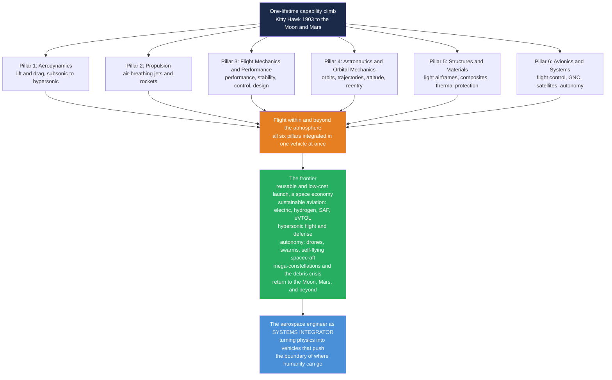

# 🚀 The Reach and Future of Aerospace Engineering

> [!abstract] TL;DR
> **Aerospace engineering** is the discipline that turns *"impossible"* into *"scheduled."* In a single human lifetime it carried our species from the **Wright Flyer** skimming 37 metres of North Carolina sand to **footprints on the Moon** and **rovers on Mars** — arguably the steepest capability climb in the history of engineering. This capstone pulls all the way back to see the whole arc at once: flight was never conquered by one breakthrough but by mastering **six interlocking pillars together** — **(1) aerodynamics** (lift and drag, subsonic to hypersonic), **(2) propulsion** (air-breathing jets and rockets), **(3) flight mechanics and performance** (performance, stability, control, design), **(4) astronautics and orbital mechanics** (rockets, orbits, interplanetary trajectories, attitude, reentry), **(5) structures and materials** (light airframes, aeroelasticity, composites, fatigue, thermal protection), and **(6) avionics and systems** (flight control, GNC, spacecraft, autonomy) — because *a single rocket or airliner integrates every one of them at the same instant*. That makes aerospace the **ultimate systems-engineering discipline**. The vault's whole arc runs from **Kitty Hawk (1903)** through the jet age, the space race and Moon landing, the Shuttle, to **today's reusable rockets and Mars rovers**; the **frontier** now being written in real time is **reusable, low-cost launch** (Starship-class economics opening a space economy), **sustainable aviation** (electric, hydrogen, sustainable aviation fuels, eVTOL air taxis, the climate imperative), **hypersonics**, **autonomy and AI** (drones, swarms, self-flying spacecraft), **mega-constellations** (and the orbital-debris crisis they create), advanced propulsion (electric and nuclear), and **human and robotic exploration** of the Moon, Mars, and beyond. The honest message: aerospace is capital-intensive, safety-critical, and genuinely hard — but it is in a **renaissance**, and the aerospace engineer remains the **systems integrator** who turns physics into vehicles that push the boundary of *where humanity can go*.

---

## Intuition

**Analogy — the steepest climb in engineering history, inside one lifetime.** Picture a person born in 1900. As a child they might have watched horses pull ploughs and read newspapers about a pair of bicycle mechanics who, on a cold December morning in 1903, coaxed a fragile canvas biplane into the air for **12 seconds over 37 metres of sand** at Kitty Hawk. That same person, still alive in 1969, could sit in front of a television and watch a human being **step onto the Moon** — a quarter-million miles away — carried there by a 111-metre rocket burning the better part of three thousand tonnes of propellant. No other field of engineering ever climbed so far, so fast. Aerospace is the discipline that made those 66 years happen, and it did so by refusing, over and over, to accept the word *impossible*.

Here is the surprising part, the thing this whole vault has been building toward: **that climb was never one invention — it was six sciences conquered together, all at once.** You cannot fly by solving aerodynamics alone; a beautiful wing with no engine is a park bench, an engine with no light structure is a bomb, a light structure with no control is a falling leaf, and a controllable vehicle with no grasp of orbits can reach space but never *stay* there. To leave the ground and come home safely, aerodynamics **and** propulsion **and** flight mechanics **and** orbital mechanics **and** structures **and** avionics must all work in the same vehicle, in the same second, or nobody flies. That is why aerospace is the archetype of **systems engineering** — and why this capstone recalls every note in the vault at once. And the climb is not over: reusable rockets are making space cheap, electric and hydrogen aircraft are chasing clean flight, hypersonic vehicles are compressing the globe, autonomous swarms are rewriting who flies, and the long reach toward the Moon, Mars, and beyond has begun again. Aerospace remains the field where physics becomes a launch date.

---

## How It Works

### Core Mechanics

Read the whole vault as one sentence: **six pillars converge into a single act — flight within and beyond the atmosphere — and that act is now being pushed outward along six frontiers.** The pillars are the sections you have just finished; the convergence is that no real vehicle lives in only one of them; the frontier is where the field is heading next.

1. **Pillar 1 — Aerodynamics: lift and drag from moving air.** The physics of the invisible fluid a vehicle swims through, from the [[Airfoils_and_Wing_Theory|circulation-and-suction that makes a wing lift]], through [[Incompressible_and_Subsonic_Aerodynamics|subsonic]] and [[Supersonic_and_Hypersonic_Aerodynamics|supersonic-to-hypersonic]] regimes, the [[Boundary_Layers_and_Aerodynamic_Drag|thin viscous layer that sets drag and stall]], and the [[Computational_and_Experimental_Aerodynamics|wind tunnels and CFD]] that predict it all. Answers: *how does air hold this up, and what does it cost?*

2. **Pillar 2 — Propulsion: making thrust.** Two great families push vehicles forward. [[Air_Breathing_Propulsion|Air-breathers]] — the [[Gas_Turbine_Engine_Cycles|Brayton-cycle turbomachines]] whose [[Inlets_Combustors_and_Nozzles|inlets, combustors, and nozzles]] gulp atmospheric oxygen — and [[Rocket_Propulsion_Fundamentals|rockets]] that carry their own oxidizer to work in vacuum, realized as [[Liquid_and_Solid_Rocket_Engines|liquid and solid engines]] and, at the frontier, [[Electric_and_Advanced_Propulsion|electric and advanced propulsion]]. Answers: *where does the forward force come from?*

3. **Pillar 3 — Flight Mechanics and Performance: how it actually flies.** Given lift and thrust, [[Aircraft_Performance|performance]] sets range, ceiling, and turn rate; [[Aircraft_Stability_and_Flight_Dynamics|stability and dynamics]] decide whether a disturbed aircraft recovers; [[Flight_Control_and_Handling_Qualities|control and handling]] make it commandable; [[Aircraft_Design_and_Configuration|design and configuration]] integrate the whole; [[Rotorcraft_and_Helicopter_Aeromechanics|rotorcraft]] add the hovering case; and [[Airframe_Loads_and_the_Flight_Envelope|loads and the flight envelope]] bound how hard it may be flown. Answers: *does it fly well, and how far?*

4. **Pillar 4 — Astronautics and Orbital Mechanics: flight beyond the air.** Above the atmosphere aerodynamics surrenders to gravity and inertia: [[Orbital_Mechanics_and_Astrodynamics|orbits as continuous free fall]], the [[Launch_Vehicles_and_Ascent_Trajectories|ascent that reaches them]], the [[Orbital_Maneuvers_and_Transfers|Hohmann transfers and rendezvous]] between them, [[Interplanetary_Trajectories_and_Gravity_Assists|interplanetary trajectories and gravity assists]] beyond them, the [[Spacecraft_Attitude_Dynamics_and_Control|attitude control]] that points them, and [[Atmospheric_Reentry_and_Hypersonics|the fiery reentry]] that brings them home. Answers: *how do we get to space and move around it?*

5. **Pillar 5 — Structures and Materials: strong and light at once.** Every kilogram costs lift, thrust, and fuel, so an [[Aerospace_Structures_and_Airframes|airframe]] must be simultaneously strong and feather-light, built from the [[Aerospace_Materials_and_Composites|composites and alloys]] that make it possible — and it must survive aeroelastic flutter, fatigue, and reentry heating. Answers: *will it hold together while weighing almost nothing?*

6. **Pillar 6 — Avionics and Systems: the nervous system.** Fly-by-wire flight control, guidance-navigation-and-control, satellite buses and payloads, and rising autonomy — the pillar where all the others are *integrated into a working vehicle*. This section of the vault, closing here. Answers: *how is it commanded, and how does it think?*

**The convergence — one vehicle, all six at once.** A crewed launch is the entire vault compressed into eight minutes: a **rocket** (P2) obeying the tyranny of the rocket equation, fighting **aerodynamic** drag and dynamic pressure (P1) through the thickening-then-thinning air, its **structure** (P5) sized against those loads while shedding every gram, its **avionics** (P6) steering a gravity-turn ascent computed by **orbital mechanics** (P4) to inject at 7.8 km/s, with **performance** margins (P3) deciding how much payload survives. Optimize any one pillar in isolation and you routinely make the whole vehicle worse — which is exactly why aerospace is the **systems-integration** discipline.

**The frontier — where the climb goes next.** Bolt the enduring physics to modern computing, new materials, and the climate imperative and the field is redrawn: **reusable, low-cost launch** collapsing cost-to-orbit and opening a space economy; **sustainable aviation** (electric, hydrogen, sustainable aviation fuels, efficient configurations, eVTOL urban air mobility); **hypersonics** for fast travel and defense; **autonomy and AI** (drones, swarms, self-flying aircraft and spacecraft); **mega-constellations** and the new space economy — shadowed by an **orbital-debris sustainability crisis**; **advanced propulsion** (electric and nuclear); and **human and robotic exploration** returning to the Moon (Artemis), reaching for Mars, and beyond.

### Flow / Architecture



---

## Key Concepts

### Secondary Level

- **The greatest climb in engineering.** From a 12-second hop at Kitty Hawk in 1903 to a human walking on the Moon in 1969 — inside a single lifetime. No other engineering field ever advanced so far so fast.
- **Flying takes six things at once.** A flying machine needs a shape that makes lift (aerodynamics), an engine that pushes it forward (propulsion), a way to steer and stay steady (flight mechanics), a plan for orbits if it goes to space (astronautics), a body that is strong but light (structures), and a brain of computers and sensors (avionics) — all working together, or it does not fly.
- **Space is about going sideways fast, not just up.** A rocket reaches orbit by going so fast sideways that the Earth curves away beneath it as fast as it falls. That is why rockets are almost entirely fuel.
- **The future is getting cheaper and cleaner.** Reusable rockets that land and fly again are making space far cheaper, while electric and hydrogen aircraft chase flight that does not warm the planet. Drones and self-flying vehicles are changing who and what flies.
- **Aerospace turns impossible into scheduled.** Things that were fantasy — crossing an ocean in hours, watching Earth from orbit, driving a robot on Mars — are now routine because engineers kept solving the pieces.

### Undergraduate Level

- **Six pillars, one vehicle.** Aeronautics and astronautics rest on the same six sub-disciplines this vault covered. A launch vehicle exercises all six simultaneously; separating them is a study convenience, never how engineering is practised.
- **The four forces and the rocket equation, side by side.** Atmospheric flight is the balance $L=W$, $T=D$ with $L=\tfrac12\rho V^2 S\,C_L$; space flight is ruled by Tsiolkovsky's $\Delta v = I_{sp}\,g_0\ln(m_0/m_f)$. Because $\Delta v$ scales with the *logarithm* of the mass ratio, reaching low Earth orbit ($\Delta v \approx 9.4$ km/s with losses) forces rockets to be roughly 90% propellant — the single hardest fact in the field.
- **Aerodynamic efficiency drives everything airborne.** The lift-to-drag ratio $L/D = C_L/C_D$ and the drag polar $C_D = C_{D,0} + C_L^2/(\pi e\,AR)$ set an airliner's fuel burn, a glider's reach, and the whole shape of a wing — the physics behind [[Aircraft_Performance|range and endurance]].
- **Reusability collapses cost-to-orbit.** For a century, launch cost was dominated by throwing away the entire rocket each flight. Recovering and reflying the booster amortizes its cost over many missions, cutting cost-per-kilogram by roughly an order of magnitude — the economic engine behind mega-constellations and a commercial space economy.
- **Sustainable aviation is a systems problem.** Aviation is a hard-to-decarbonize sector: jet fuel's energy density is extraordinary. The response is a portfolio — battery-electric for short range, hydrogen (combustion or fuel cell), sustainable aviation fuels as a drop-in, and more efficient configurations — each trading energy density, mass, and infrastructure differently.
- **Autonomy is aerospace's fastest-growing regime.** Uncrewed aircraft, satellite mega-constellations, and self-flying spacecraft push guidance, navigation, and control from a human-in-the-loop craft toward fully autonomous systems and coordinated swarms.

### Graduate Level

- **Aerospace as the canonical multidisciplinary-design-optimization problem.** A vehicle couples aerodynamics, propulsion, structures, controls, and trajectory into one optimized design under razor-thin mass, cost, and reliability budgets, with margins for uncertainty and failure tolerance. Change one pillar and every other shifts: a lighter structure alters aeroelastic behaviour; a new engine moves the centre of gravity and the control laws; a new trajectory changes the heating. MDO is not a technique bolted on at the end — it *is* the discipline.
- **The economics of reusability, honestly.** Reflight lowers marginal cost but adds recovery mass, refurbishment labour, and performance penalties (propellant reserved for the landing burn). The break-even depends on flight rate: reusability wins only when cadence is high enough to amortize the fixed cost of a recoverable, robust vehicle — which is why the frontier is as much about *manufacturing cadence and operations* as about rocketry.
- **Sustainable aviation trade space.** Compare on specific energy and system mass: kerosene ~43 MJ/kg; hydrogen ~120 MJ/kg by mass but bulky and cryogenic; lithium batteries ~1 MJ/kg at pack level — two orders below jet fuel, which is why battery-electric flight is range-limited and points toward short-haul and eVTOL first. SAFs are drop-in but supply-constrained; hydrogen demands new airframes and infrastructure; laminar-flow, blended-wing-body, and open-rotor configurations chase efficiency. There is no single winner — only a segmented portfolio.
- **Hypersonics and thermal-structural coupling.** Sustained flight above Mach 5 marries scramjet propulsion, real-gas aerodynamics, and thermal-protection structures into one inseparable problem — heating scales roughly as $\dot q \propto \rho^{0.5} V^3$, so the airframe *is* the heat shield, and [[Atmospheric_Reentry_and_Hypersonics|reentry physics]] and hypersonic cruise become the same discipline.
- **Space sustainability and Kessler risk.** Mega-constellations multiply objects in low Earth orbit; collision probability grows super-linearly with object count, raising the spectre of a self-sustaining debris cascade (the Kessler syndrome). Orbital-slot management, deorbit compliance, and active debris removal are becoming first-class engineering constraints, not afterthoughts.
- **The integrator's enduring value.** As tools automate the routine — CFD, generative structures, autonomous GNC — the scarce, growing skill is *system integration*: framing the physics, judging the models, and combining aerodynamics, propulsion, structures, and control into a vehicle that works and is safe. Aerospace remains a generalist's discipline in a specialist's world.

---

## Python Demo

```python
# "AEROSPACE ENGINEERING IN ONE FIGURE" -- a four-panel capstone dashboard that
# recalls the whole vault and casts it forward:
#
#   (a) AERODYNAMICS  -> the drag polar and lift-to-drag ratio  (Pillars 1 & 3)
#   (b) PROPULSION    -> the rocket equation: delta-v vs propellant fraction
#                        for several specific impulses, with the LEO target line
#                        -- the "tyranny of the rocket equation"  (Pillars 2 & 4)
#   (c) FLIGHT LIMITS -> the V-n diagram: the structural flight envelope that
#                        bounds how hard an airframe may be flown  (Pillars 3 & 5)
#   (d) THE FRONTIER  -> launch cost per kg to orbit falling across the decades
#                        as reusability arrives (illustrative, order-of-magnitude)
#
# Requires: numpy, matplotlib
import numpy as np
import matplotlib.pyplot as plt

# =====================================================================
# (a) AERODYNAMICS -- drag polar  CD = CD0 + CL^2 / (pi e AR),  L/D = CL/CD
# =====================================================================
CD0 = 0.020          # zero-lift (parasite) drag coefficient
AR  = 9.0            # wing aspect ratio (jet transport)
e   = 0.80           # Oswald span efficiency
CL  = np.linspace(0.0, 1.4, 400)
CD  = CD0 + CL**2 / (np.pi * e * AR)
LD  = CL / CD
CL_ldmax = np.sqrt(CD0 * np.pi * e * AR)          # CL at best L/D
LDmax    = 0.5 * np.sqrt(np.pi * e * AR / CD0)     # maximum L/D

# =====================================================================
# (b) PROPULSION -- Tsiolkovsky:  dv = Isp * g0 * ln(1 / (1 - fp))
#     fp = propellant mass fraction = (m0 - mf) / m0
# =====================================================================
g0 = 9.80665
fp = np.linspace(0.0, 0.95, 400)                   # propellant fraction
Isp_set = [250, 350, 450]                          # solid, kerolox, hydrolox [s]
dv = {Isp: Isp * g0 * np.log(1.0 / (1.0 - fp)) / 1000.0 for Isp in Isp_set}  # km/s
dv_leo = 9.4                                        # LEO delta-v incl. losses [km/s]

# =====================================================================
# (c) FLIGHT LIMITS -- V-n diagram (maneuvering flight envelope)
#     stall boundary  n = (V / Vs)^2  ;  structural limits n_pos, n_neg
# =====================================================================
rho  = 1.225                                        # sea-level density [kg/m^3]
W_S  = 5000.0                                        # wing loading [N/m^2]
CLmx = 1.5                                           # max lift coefficient (+)
CLmn = 1.0                                           # max lift coefficient (- magnitude)
n_pos, n_neg = 2.5, -1.0                             # transport-category limits
Vs   = np.sqrt(2 * W_S / (rho * CLmx))               # 1-g stall speed [m/s]
Va   = Vs * np.sqrt(n_pos)                           # positive corner (maneuver) speed
Vsn  = np.sqrt(2 * W_S / (rho * CLmn))               # 1-g negative-stall speed
Vg   = Vsn * np.sqrt(abs(n_neg))                     # negative corner speed
Vd   = 1.45 * Va                                     # dive speed [m/s]

Vpos = np.linspace(0, Va, 120);  n_stall_pos = (Vpos / Vs)**2      # + stall arc
Vneg = np.linspace(0, Vg, 120);  n_stall_neg = -(Vneg / Vsn)**2    # - stall arc

# =====================================================================
# (d) THE FRONTIER -- launch cost per kg to LEO across the decades
#     ILLUSTRATIVE, order-of-magnitude (inflation-adjusted, rounded)
# =====================================================================
frontier = [
    (1969,  6000, "Saturn V",           False),
    (1981, 60000, "Space Shuttle",      False),
    (2000, 15000, "Delta II / Ariane",  False),
    (2006, 12000, "Atlas V",            False),
    (2010,  5000, "Falcon 9 expended",  False),
    (2015,  2700, "Falcon 9 reused",    True),
    (2018,  1500, "Falcon Heavy",       True),
    (2027,   200, "Starship (target)",  True),
]
yr  = np.array([d[0] for d in frontier])
cst = np.array([d[1] for d in frontier])
reuse = np.array([d[3] for d in frontier])

# ------------------------------- console -------------------------------
print("=== Aerospace engineering in one figure ===")
print(f"(a) AERO   best L/D = {LDmax:5.1f}  at CL = {CL_ldmax:4.2f}")
print("(b) PROP   delta-v at 90% propellant fraction:")
for Isp in Isp_set:
    print(f"      Isp = {Isp} s  ->  dv = {Isp*g0*np.log(1/(1-0.90))/1000:5.2f} km/s "
          f"({'reaches' if Isp*g0*np.log(1/(1-0.90))/1000 >= dv_leo else 'short of'} LEO)")
print(f"(c) FLIGHT stall Vs = {Vs:5.1f} m/s, corner Va = {Va:5.1f} m/s, "
      f"limits +{n_pos}g / {n_neg}g")
print(f"(d) COST   Shuttle ~${60000:,}/kg  ->  Starship target ~${200}/kg "
      f"(~{60000//200}x cheaper)")

# ------------------------------- plotting ------------------------------
fig, ax = plt.subplots(2, 2, figsize=(14, 10))
fig.suptitle("Aerospace Engineering in One Figure: the Vault, and Where It Goes Next",
             fontsize=15, fontweight="bold")

# (a) drag polar with L/D_max
axA = ax[0, 0]
axA.plot(CD, CL, color="#1f77b4", lw=2.6, label="drag polar  CD = CD0 + CL^2 / (pi e AR)")
axA.scatter([CD0 + CL_ldmax**2/(np.pi*e*AR)], [CL_ldmax], color="#d62728", s=70, zorder=5)
axA.plot([0, CD0 + CL_ldmax**2/(np.pi*e*AR)], [0, CL_ldmax], color="#d62728",
         ls="--", lw=1.5, label=f"best L/D = {LDmax:.1f} (tangent from origin)")
axA.set_title("(a) AERODYNAMICS: the drag polar  ->  how efficiently it flies")
axA.set_xlabel("drag coefficient  CD")
axA.set_ylabel("lift coefficient  CL")
axA.legend(fontsize=8, loc="lower right"); axA.grid(alpha=0.3)
axA.set_xlim(0, CD.max()*1.05); axA.set_ylim(0, 1.5)

# (b) rocket equation
axB = ax[0, 1]
colors_b = ["#8E44AD", "#1f77b4", "#2ca02c"]
for Isp, c in zip(Isp_set, colors_b):
    axB.plot(fp*100, dv[Isp], color=c, lw=2.4, label=f"Isp = {Isp} s")
axB.axhline(dv_leo, color="#d62728", ls="--", lw=2, label=f"LEO need ~{dv_leo} km/s")
axB.axvline(90, color="gray", ls=":", lw=1.2)
axB.text(90.5, 1.0, "90% propellant", fontsize=8, color="gray", rotation=90, va="bottom")
axB.set_title("(b) PROPULSION: the rocket equation  ->  the tyranny of mass ratio")
axB.set_xlabel("propellant mass fraction  [percent of liftoff mass]")
axB.set_ylabel("achievable delta-v  [km/s]")
axB.set_ylim(0, 14); axB.legend(fontsize=8, loc="upper left"); axB.grid(alpha=0.3)

# (c) V-n diagram
axC = ax[1, 0]
axC.plot(Vpos, n_stall_pos, color="#2ca02c", lw=2.2)         # + stall arc
axC.plot([Va, Vd], [n_pos, n_pos], color="#1f77b4", lw=2.2)   # + limit
axC.plot([Vd, Vd], [n_pos, n_neg], color="#1f77b4", lw=2.2)   # dive-speed edge
axC.plot([Vg, Vd], [n_neg, n_neg], color="#1f77b4", lw=2.2)   # - limit
axC.plot(Vneg, n_stall_neg, color="#2ca02c", lw=2.2)          # - stall arc
axC.axhline(0, color="k", lw=0.8); axC.axhline(1, color="gray", ls=":", lw=1)
axC.scatter([Va], [n_pos], color="#d62728", s=60, zorder=5)
axC.text(Va, n_pos+0.12, "corner speed Va", fontsize=8, color="#d62728", ha="center")
axC.text(Vs, 1.05, "1-g stall", fontsize=8, color="#2ca02c")
axC.set_title("(c) FLIGHT LIMITS: the V-n envelope  ->  how hard it may be flown")
axC.set_xlabel("airspeed  V  [m/s]")
axC.set_ylabel("load factor  n  [g]")
axC.set_ylim(-2, 3.3); axC.grid(alpha=0.3)

# (d) launch cost per kg over time
axD = ax[1, 1]
axD.semilogy(yr[~reuse], cst[~reuse], "o", color="#555555", ms=9, label="expendable era")
axD.semilogy(yr[reuse],  cst[reuse],  "o", color="#27AE60", ms=10, label="reusable era")
for y, c, lab, _ in frontier:
    dx = -2 if lab.startswith("Starship") else 1.5
    ha = "right" if lab.startswith("Starship") else "left"
    axD.annotate(lab, (y, c), xytext=(y+dx, c*1.15), fontsize=7.5, ha=ha)
axD.annotate("", xy=(2027, 260), xytext=(2010, 4200),
             arrowprops=dict(arrowstyle="-|>", color="#27AE60", lw=2))
axD.text(2011, 400, "reusability\ncollapses cost", color="#27AE60", fontsize=8.5)
axD.set_title("(d) THE FRONTIER: cost to orbit  ->  reusability opens a space economy")
axD.set_xlabel("year  (illustrative, order-of-magnitude)")
axD.set_ylabel("launch cost to LEO  [USD per kg, log scale]")
axD.set_ylim(80, 1e5); axD.set_xlim(1965, 2032)
axD.legend(fontsize=8, loc="upper right"); axD.grid(alpha=0.3, which="both")

plt.tight_layout(rect=[0, 0, 1, 0.95])
plt.show()
```

Each panel is a slice of the vault compressed to one curve, and together they *are* aerospace engineering — past and future. **(a)** the drag polar $C_D = C_{D,0} + C_L^2/(\pi e\,AR)$ recalls [[Airfoils_and_Wing_Theory]] and [[Aircraft_Performance]]: the tangent from the origin marks the best lift-to-drag ratio, the number that sets an airliner's fuel burn. **(b)** the rocket equation delivers the field's harshest truth — even at 90% propellant fraction a low-$I_{sp}$ solid falls short of the ~9.4 km/s needed for orbit, which is why [[Rocket_Propulsion_Fundamentals|rockets]] and [[Launch_Vehicles_and_Ascent_Trajectories|launch vehicles]] stage and why every gram of dry mass is fought over. **(c)** the V-n diagram recalls [[Airframe_Loads_and_the_Flight_Envelope]] and [[Aerospace_Structures_and_Airframes]]: the parabolic stall boundary and the flat structural limits bound the entire envelope, meeting at the **corner speed** where a wing can pull maximum g without stalling or breaking. **(d)** the launch-cost curve is the *frontier* — a roughly hundred-fold drop in cost-to-orbit as reusability arrives, the economic hinge on which mega-constellations, a commercial space economy, and a return to the Moon and Mars all turn. Four curves, six pillars, one field on the move.

---

## Real-World Applications

> **Example — a Mars rover mission is the whole vault operating hundreds of millions of kilometres from any human hand.** It begins as a **rocket** ([[Rocket_Propulsion_Fundamentals]], [[Liquid_and_Solid_Rocket_Engines]]) climbing through the [[Boundary_Layers_and_Aerodynamic_Drag|drag]] of the atmosphere on an [[Launch_Vehicles_and_Ascent_Trajectories|ascent trajectory]]; it coasts to Mars on an [[Interplanetary_Trajectories_and_Gravity_Assists|interplanetary transfer]] planned by [[Orbital_Mechanics_and_Astrodynamics|astrodynamics]], its pointing held by [[Spacecraft_Attitude_Dynamics_and_Control|attitude control]] for months. Arrival is a violent [[Atmospheric_Reentry_and_Hypersonics|hypersonic entry]] behind a heat shield ([[Aerospace_Materials_and_Composites|ablative materials]] on an [[Aerospace_Structures_and_Airframes|entry structure]]), then supersonic parachute, then rocket-powered descent — [[Supersonic_and_Hypersonic_Aerodynamics|aerodynamics across every regime]] in seven minutes. Throughout, autonomous **guidance, navigation, and control** flies the whole sequence with no joystick from Earth. Six pillars, one robot, another world.

- **Reusable, low-cost launch and the space economy.** Propulsive landing and rapid reflight — booster stages that fly, land, and fly again — have collapsed cost-to-orbit by roughly an order of magnitude, turning launch from a national-prestige event into an industrial service. This single shift, built on mass-optimized [[Aerospace_Structures_and_Airframes|structures]] and reliable [[Liquid_and_Solid_Rocket_Engines|engines]], is what makes mega-constellations, routine cargo, and eventually crewed interplanetary flight economically thinkable.
- **Sustainable aviation and urban air mobility.** The climate imperative is reshaping the airliner: [[Electric_and_Advanced_Propulsion|electric and hybrid propulsion]] for short range, hydrogen and sustainable aviation fuels for longer legs, and efficient [[Aircraft_Design_and_Configuration|configurations]] (laminar flow, blended-wing-body, open rotor). Below it, battery-electric [[Rotorcraft_and_Helicopter_Aeromechanics|rotorcraft-derived eVTOL air taxis]] open a new low-altitude regime built on [[Flight_Control_and_Handling_Qualities|fly-by-wire control]] and heavy autonomy.
- **Mega-constellations and everyday infrastructure.** Thousands of satellites in low Earth orbit deliver global internet, navigation, weather, and Earth observation — orbital slots and revisit designed with [[Orbital_Maneuvers_and_Transfers|maneuver planning]] and $J_2$-exploiting [[Orbital_Mechanics_and_Astrodynamics|astrodynamics]] — while their sheer number forces orbital-debris management to become a core engineering constraint.
- **Hypersonics, fast travel, and defense.** Sustained flight above Mach 5 fuses scramjet [[Air_Breathing_Propulsion|air-breathing propulsion]], real-gas [[Supersonic_and_Hypersonic_Aerodynamics|hypersonic aerodynamics]], and thermal-structural design into one inseparable problem — the sharpest edge of the [[Atmospheric_Reentry_and_Hypersonics|reentry-and-hypersonics]] discipline.
- **Autonomy and swarms.** Uncrewed aircraft, coordinated drone swarms, and self-flying spacecraft push [[Aircraft_Stability_and_Flight_Dynamics|flight dynamics]] and guidance-navigation-and-control from a human-in-the-loop craft toward fully autonomous systems — the field's fastest-growing regime.
- **Commercial aviation, still the workhorse.** Every day, airliners quietly execute the whole of Pillars 1 through 6 — supercritical wings taming transonic drag ([[Computational_and_Experimental_Aerodynamics|validated by CFD and wind tunnels]]), high-bypass turbofans ([[Gas_Turbine_Engine_Cycles]], [[Inlets_Combustors_and_Nozzles]]) maximizing efficiency, and fly-by-wire keeping a relaxed-stability airframe safe — the mature core beneath all the frontiers.

---

## Common Pitfalls

- **"Aerospace is a solved, mature field."** The most damaging misconception. Powered flight is barely a century old, human spaceflight barely sixty years, and the field is in open renaissance: reusable launch, the commercial space economy, hydrogen and electric aviation, hypersonics, and autonomy are all being invented *right now*. Confusing a mature core (airliners, expendable rockets) with a finished discipline blinds you to where the value and the jobs are moving.
- **Treating the six pillars as separable.** Students learn aerodynamics, propulsion, structures, orbits, and control as separate courses and imagine real vehicles live in one box. They never do — a launch vehicle is all six at once, and optimizing one pillar in isolation (a lighter structure that flutters, an efficient engine that shifts the CG, a fuel-optimal trajectory that overheats the airframe) routinely makes the whole vehicle worse. The engineer's core skill is *integration*.
- **Underestimating the tyranny of the rocket equation.** Because $\Delta v$ grows only as the *logarithm* of the mass ratio, small increases in required velocity demand exponentially more propellant. This is why single-stage-to-orbit is so hard, why staging exists, and why the whole business of spaceflight is a merciless fight over dry mass. Reusability does not repeal this arithmetic — it changes the *economics* on top of it.
- **Believing reusability is automatically cheaper.** Recovering a booster costs performance (propellant reserved for landing), mass (legs, grid fins), and refurbishment labour. It wins only at high flight cadence, where the fixed cost of a robust, recoverable vehicle amortizes over many missions. Cheap space is as much a manufacturing-and-operations achievement as a rocketry one.
- **Assuming one clean answer to sustainable aviation.** There is no single winner. Batteries are ~2 orders of magnitude below jet fuel in specific energy (range-limited, short-haul first); hydrogen is energy-dense by mass but bulky, cryogenic, and needs new airframes and infrastructure; SAFs are drop-in but supply-constrained. The real answer is a *segmented portfolio* matched to mission range — treating it as a single silver bullet leads to bad engineering.
- **Forgetting the sustainability of the environment you exploit.** Mega-constellations multiply collision risk super-linearly with object count, raising the spectre of a self-sustaining debris cascade (Kessler syndrome). Orbital-slot management, deorbit compliance, and active debris removal are now first-class design constraints, not public-relations afterthoughts — the field must keep its own frontier usable.

---

## Related Concepts

**The hub this capstone closes**
- [[Aerospace_Engineering_Overview]] — the vault hub; the four-forces, six-pillar, atmosphere-to-space map this note synthesizes and casts forward.

**Pillar 1 — Aerodynamics**
- [[Airfoils_and_Wing_Theory]] — how a wing makes lift; the drag-polar panel of the demo.
- [[Incompressible_and_Subsonic_Aerodynamics]] — the everyday low-speed flow regime.
- [[Supersonic_and_Hypersonic_Aerodynamics]] — shock waves and the physics of fast flight, the aero half of hypersonics.
- [[Boundary_Layers_and_Aerodynamic_Drag]] — the viscous layer that sets skin friction and stall.
- [[Computational_and_Experimental_Aerodynamics]] — the CFD and wind tunnels that predict it all.

**Pillar 2 — Propulsion**
- [[Air_Breathing_Propulsion]] — jets, ramjets, and scramjets; the frontier of hypersonic cruise.
- [[Gas_Turbine_Engine_Cycles]] — the Brayton cycle behind every turbofan.
- [[Inlets_Combustors_and_Nozzles]] — the flow-path components that make thrust.
- [[Rocket_Propulsion_Fundamentals]] — the rocket-equation panel of the demo.
- [[Liquid_and_Solid_Rocket_Engines]] — the engines behind reusable launch.
- [[Electric_and_Advanced_Propulsion]] — ion, electric, and the advanced-propulsion frontier.

**Pillar 3 — Flight Mechanics and Performance**
- [[Aircraft_Performance]] — range, endurance, and the L/D story of the demo.
- [[Aircraft_Stability_and_Flight_Dynamics]] — whether a disturbed aircraft recovers; the ground for autonomy.
- [[Flight_Control_and_Handling_Qualities]] — fly-by-wire and commandability, the base of eVTOL and drones.
- [[Aircraft_Design_and_Configuration]] — integrating the pillars into an airframe; sustainable configurations.
- [[Rotorcraft_and_Helicopter_Aeromechanics]] — the hovering case behind urban air mobility.
- [[Airframe_Loads_and_the_Flight_Envelope]] — the V-n diagram panel of the demo.

**Pillar 4 — Astronautics and Orbital Mechanics**
- [[Orbital_Mechanics_and_Astrodynamics]] — orbits as free fall; the backbone of the space economy.
- [[Launch_Vehicles_and_Ascent_Trajectories]] — reaching orbit; the object of reusability.
- [[Orbital_Maneuvers_and_Transfers]] — moving between orbits; constellation station-keeping.
- [[Interplanetary_Trajectories_and_Gravity_Assists]] — the roads to the Moon, Mars, and beyond.
- [[Spacecraft_Attitude_Dynamics_and_Control]] — pointing a spacecraft; autonomous GNC in space.
- [[Atmospheric_Reentry_and_Hypersonics]] — coming home through fire; the sharpest thermal-structural problem.

**Pillar 5 — Structures and Materials**
- [[Aerospace_Structures_and_Airframes]] — strong-and-light airframes; the mass fight behind every mission.
- [[Aerospace_Materials_and_Composites]] — the composites and alloys that make flight possible.

**Sibling-discipline capstones and cross-vault physics**
- [[The_Reach_and_Future_of_Mechanical_Engineering]] — the neighbouring capstone; aerospace as mechanical engineering's flying frontier.
- [[The_Reach_and_Future_of_Electrical_Engineering]] — the sibling capstone; the avionics, electric propulsion, and power behind modern flight.
- [[Orbital_Mechanics_and_Celestial_Dynamics]] — the Astronomy vault's Kepler-and-conic-sections companion to astronautics.
- [[Aerodynamics_and_Aerospace_Applications]] — the Fluid Dynamics vault's applied chapter on wings, CFD, and aircraft.

---

## Review Questions

**Secondary**
1. In 1903 the Wright brothers flew for 12 seconds; in 1969 a human walked on the Moon. Explain in your own words why getting to the Moon needed *all six* things a flying machine requires (lift, an engine, steering and stability, a plan for orbits, a light-but-strong body, and a computer brain) rather than just a bigger version of the Wright Flyer. Then name one way flight is still being reinvented today.

**Undergraduate**
2. A reusable rocket recovers and reflies its first stage. Using the rocket equation $\Delta v = I_{sp}\,g_0\ln(m_0/m_f)$, explain (a) why reserving propellant for a landing burn *reduces* the payload a given vehicle can deliver to orbit, and (b) why, despite that penalty, reusability can still dramatically lower cost per kilogram. What operational condition must hold for reusability to actually win economically, and why?

**Graduate**
3. "Sustainable aviation" has no single solution. Compare battery-electric, hydrogen (combustion and fuel cell), and sustainable aviation fuels on the axes of specific energy, system mass, infrastructure, and mission range, and argue for a *segmented portfolio* mapped to flight distance (eVTOL and regional versus long-haul). Then connect your answer to the vault's central claim that aerospace is a multidisciplinary-design-optimization discipline: identify two places where choosing a propulsion pathway forces a redesign of another pillar (structures, aerodynamics, or control) and explain the coupling.

---

## Sources

- J. D. Anderson — *Introduction to Flight*, 8th ed. (McGraw-Hill, 2016)
- G. P. Sutton & O. Biblarz — *Rocket Propulsion Elements*, 9th ed. (Wiley, 2016)
- J. R. Wertz, D. F. Everett & J. J. Puschell (eds.) — *Space Mission Engineering: The New SMAD* (Microcosm Press, 2011)
- National Academies of Sciences, Engineering, and Medicine — *Advancing Aeronautics: A Decadal Survey of NASA's Aeronautics Research* and NASA's *Space Technology / Aeronautics roadmaps* (nap.edu, nasa.gov)
- ICAO — *Report on the Feasibility of a Long-Term Aspirational Goal for International Aviation CO2 Emission Reductions* and Air Transport Action Group *Waypoint 2050* (icao.int, aviationbenefits.org)

---

#aerospace-engineering #capstone #future #reusable-rockets #sustainable-aviation
