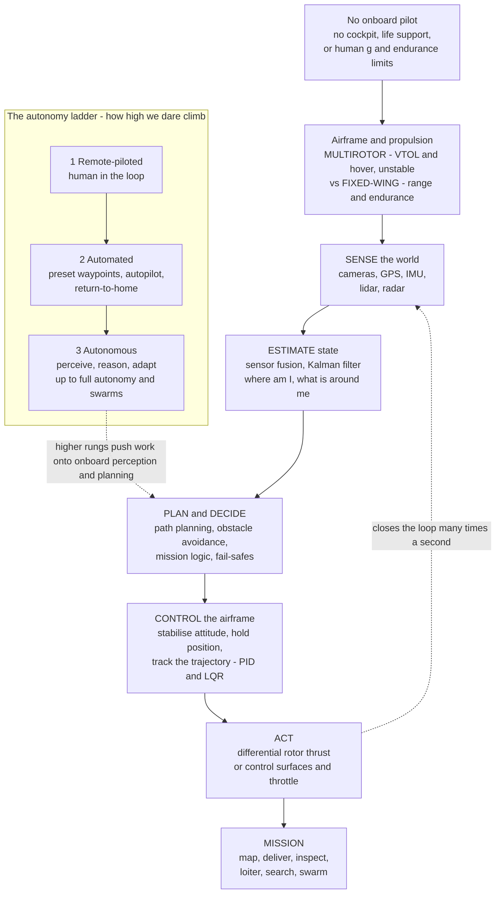

# 🛸 Unmanned Aircraft and Autonomy

> [!abstract] TL;DR
> **Take the pilot out of the cockpit and the whole airplane changes.** Remove the human and you remove the cockpit, the life support, the ejection seat, and the human limits on **g-load, fatigue, and survival** — so the aircraft is free to become **very small** (a palm-sized nano-quad), **very long-endurance** (a solar HALE aircraft loitering for months), **wildly maneuverable**, **expendable** on missions no crew would fly, or **numerous** enough to swarm. But nothing is free: the hard problem simply **moves from the cockpit into the software**. The aircraft must now **sense** its world (cameras, GPS, IMU, lidar, radar), **decide** what to do (plan a path, avoid obstacles, react to failures), and **act** on the airframe — all by itself, or with a human far away over a fragile radio link. Platforms split into **multirotors** (mechanically simple, hover and VTOL, but *inherently unstable* — a quadcopter cannot stay upright without a computer correcting its attitude hundreds of times a second), **fixed-wing UAS** (efficient, long range and endurance — Global Hawk, Reaper), **hybrid VTOL/tiltrotor**, and the emerging **eVTOL air taxis** of urban air mobility. Capability is best read as an **autonomy ladder**: **remote-piloted** (human in the loop), **automated** (fly a preprogrammed plan — waypoints, autopilot, return-to-home), and increasingly **autonomous** (onboard perception, planning, decision-making, obstacle avoidance, and adaptation), up to full autonomy and coordinated **swarms**. The enablers are cheap **MEMS sensors and GPS**, powerful **embedded compute**, **machine learning / computer vision**, and **battery-electric propulsion**. The blockers are **sense-and-avoid and airspace integration** (UTM traffic management, beyond-visual-line-of-sight ops), **reliability and fail-safe** behaviour, **communications and link loss**, **cyber-security**, and a thicket of **regulatory, ethical, and legal** questions — safety certification, privacy, and the autonomous-weapons debate. How high we dare climb the autonomy ladder is, in the end, **as much a question of trust, safety, and law as of engineering** — which is exactly why this is aviation's defining frontier.

---

## Intuition

**Analogy:** Imagine lifting the pilot straight up out of the cockpit — and everything the pilot *needed* goes with them: the windows, the seat, the oxygen, the heater, the parachute, and the unspoken promise that the machine will not do anything that would kill a human aboard. What is left is astonishingly *free*. With no body to protect, the aircraft can shrink to the size of your hand, or stretch its wings and loiter for days because it never gets tired, or pull turns that would black a pilot out, or fly a mission so dangerous that losing the airframe is an acceptable price, or multiply into a hundred cheap copies that fly as a flock. The pilot's *weight, endurance, and fragility* were quietly shaping the whole design — remove them and a different family of aircraft becomes possible.

But the pilot was doing something else, something you only notice once they are gone: they were **sensing the world, deciding what to do, and moving the controls** — continuously, effortlessly, without being asked. Take them out and *someone still has to do all of that.* At the bottom of the ladder, a human on the ground does it over a radio link, thumbs on the sticks — this is **remote-piloted** flight, and it works right up until the link drops or the target is out of sight. One rung up, the aircraft does it *from a script*: follow these waypoints, hold this altitude, and if you lose contact, **return home** — this is **automated** flight, obedient but blind to anything the script did not anticipate. At the top, the aircraft must genuinely **perceive** (that shape ahead is a power line, this gap is wide enough), **reason** (re-plan around the obstacle, abort if a rotor fails), and **adapt** — this is true **autonomy**, and it is a robotics-and-AI problem wearing wings. The engineering question "how do we build it?" therefore drags along a harder one: "**how much do we trust it, how do we prove it is safe, and who is responsible when it is wrong?**" — which is why a hobby quadcopter holding position in a breeze, a Reaper loitering for a day, and a future air taxi threading city airspace are three rungs of a single ladder we are still learning how far to climb.

---

## How It Works

### Core Mechanics

**1. Removing the human rewrites the design rules.** A crewed aircraft is built around a person: a pressurised cockpit, life support, displays, escape systems, and a flight envelope capped by what a body can survive (sustained g, altitude, endurance measured in a pilot's hours). Delete the human and every one of those constraints relaxes at once. The design space opens toward the **extremes** — *nano/micro* air vehicles a few centimetres across; *high-altitude long-endurance* (HALE) craft that trade payload for wing and loiter for a day, weeks, or (solar-powered) months; *highly agile* airframes that out-turn any crewed jet; *attritable/expendable* vehicles for missions with no acceptable crew risk; and *swarms* of many cheap units. The cost of this freedom is that the aircraft's **intelligence must now live onboard or on a link** — sensing, deciding, and communicating become the central engineering problem.

**2. The platform choice: multirotor vs fixed-wing (vs hybrid).** Two archetypes dominate, for the same physical reasons that split crewed aircraft:
- **Multirotors (quadcopters).** Mechanically dead simple — just fixed-pitch rotors spun at different speeds — with **vertical takeoff, hover, and precise low-speed control**. Their catch is that a multirotor is **inherently unstable**: it has no aerodynamic tendency to right itself, so a flight computer must measure its attitude and adjust rotor thrusts *hundreds of times per second* just to keep it upright. They are the consumer/commercial drone, but they hover *inefficiently* (small rotors mean high disk loading) and so are **energy-limited** — minutes to tens of minutes.
- **Fixed-wing UAS.** A wing generates lift efficiently in cruise, giving **long range and endurance** (Global Hawk, Reaper, Predator), at the price of needing a runway or launcher and being unable to hover.
- **Hybrids and tiltrotors** try to have both — VTOL like a multirotor, then transition to wing-borne cruise — which is exactly the recipe of the emerging **eVTOL air taxi**.

**3. Sense → estimate → plan → decide → control → act: the autonomy stack.** With no pilot's eyes, hands, and judgement, an uncrewed aircraft runs a perception-to-action pipeline, closed as a loop many times a second:
- **Sense.** Cameras, **GPS/GNSS**, an **IMU** (accelerometers + gyroscopes, cheap MEMS), barometer/magnetometer, and on larger craft **lidar/radar** — the raw measurements.
- **Estimate.** **Sensor fusion / state estimation** (classically a **Kalman filter**) blends noisy, complementary sensors into a clean estimate of *where am I, how am I oriented, how fast am I moving* — and, for autonomy, *what is around me.*
- **Plan and decide.** Given the state and a goal, compute a **path** (waypoint routing, obstacle-free trajectories) and make **decisions** (avoid that obstacle, abort on low battery, hand back to a human) — the same **motion-planning** and decision problems as any mobile robot.
- **Control.** Turn the desired trajectory into **actuator commands** that stabilise attitude and track the path — the inner loop is typically **PID or cascaded PID/LQR** attitude and position control.
- **Act.** For a multirotor, mix commands into **differential rotor thrusts** (roll, pitch, yaw, and heave from four numbers); for a fixed-wing, deflect **control surfaces** and set throttle.

**4. Rotor mixing — four numbers become four motions.** A quadcopter has only four fixed-pitch rotors, yet must command four independent things: **heave** (up/down), **roll**, **pitch**, and **yaw**. It does so by *mixing*: total thrust is the sum of all four (heave); a front–rear thrust *difference* creates a **pitch** moment; a left–right difference creates **roll**; and because diagonal rotors spin opposite directions, an imbalance in their reaction torques creates **yaw**. Stabilising the naturally unstable airframe is then a feedback-control problem: measure attitude with the IMU, compute the correcting moments, and re-solve the mix — continuously.

**5. The autonomy ladder — from remote-controlled to self-reliant.** Capability is a spectrum, not a switch:
- **Remote-piloted (human in the loop).** A pilot flies it live over a datalink; the aircraft mostly relays commands and telemetry. Simple and trusted, but hostage to the link and to line of sight.
- **Automated (executes a plan).** The aircraft flies a **preprogrammed mission** — waypoints, altitude/speed holds, orbit patterns — under an **autopilot**, with safety behaviours like **return-to-home** on low battery or lost link. Reliable, but it does not *understand* the world; it just follows the script.
- **Autonomous (perceive, reason, adapt).** The aircraft **perceives** with computer vision and sensor fusion, **plans** and **avoids obstacles** on the fly, and **adapts** to failures and surprises — up to **full autonomy**, where a human sets only the goal, and to **swarms**, where many vehicles coordinate through **distributed control and flocking** rules to act as one.

**6. Enablers and blockers.** The revolution rode in on **cheap MEMS inertial sensors and GPS**, **powerful embedded compute**, **ML/computer vision**, and **battery-electric propulsion**. What still gates it is **sense-and-avoid and airspace integration** — an autonomous aircraft must reliably detect and avoid other traffic and terrain to fly **beyond visual line of sight (BVLOS)**, and must slot into managed airspace via **UAS traffic management (UTM)**; on top of that sit **reliability/fail-safe design**, **secure and robust communications** (graceful behaviour on link loss), **cyber-security**, and the **regulatory, ethical, and legal** dimension — certification of safety, privacy, and the fraught debate over **lethal autonomous weapons**.

### Flow / Architecture



---

## Key Concepts

### Secondary Level

- **Take the pilot out and the plane can go to extremes.** With no human to protect, a drone can be tiny, fly for days without getting tired, take risks no crew would, or fly as a swarm of many. The catch: the aircraft now has to **see, think, and steer by itself** (or be flown by someone far away).
- **A quadcopter cannot balance on its own.** Unlike a paper plane, a quadcopter has nothing that naturally keeps it level — a **computer must sense its tilt and adjust the four motors hundreds of times a second**, or it flips. That constant, invisible correcting is the whole reason it can hang steady in a breeze.
- **Two kinds of drone.** **Multirotors** (quadcopters) can hover and take off straight up but drain their battery fast; **fixed-wing** drones have wings, so they fly far and long but need a runway and cannot hover.
- **The autonomy ladder.** Level 1: a person flies it by remote. Level 2: it follows a **preset plan** of waypoints and comes home if it loses signal. Level 3: it **figures things out for itself** — seeing obstacles, choosing a path, reacting to trouble.
- **How a drone "acts."** A quadcopter steers with nothing but motor speeds: spin the front pair harder to tilt back, spin one diagonal pair harder to spin around. Four spinning motors produce up, tilt, and turn.
- **Why it matters.** Drones now do photography, mapping, farming, delivery, inspection, disaster response, science, and defence — and smarter autonomy is bringing **air taxis** and self-flying aircraft closer.

### Undergraduate Level

- **Design freedom from removing the human.** The crewed flight envelope is capped by human tolerance (sustained g, endurance, altitude). Removing it opens design toward **nano/micro**, **HALE** (high-altitude long-endurance), **high-agility**, **attritable**, and **swarming** vehicles; the binding constraint shifts to **sensing, decision-making, autonomy, and communications**.
- **Multirotor instability and control.** A quadcopter's attitude dynamics are (near hover) a set of **double integrators** with no restoring moment — open-loop unstable. Stabilisation is a feedback problem: an **IMU** measures attitude/rate, an inner-loop controller (**PID**, or cascaded attitude→rate) computes correcting moments, and a **mixer** maps them to four rotor speeds.
- **The control-allocation mix.** For an "X" quad: total thrust $U_1 = \sum f_i$ (heave); roll $U_2 \propto (f_\text{right}-f_\text{left})\ell$; pitch $U_3 \propto (f_\text{front}-f_\text{rear})\ell$; yaw $U_4 \propto$ difference of the two counter-rotating diagonals' reaction torques. Four rotor thrusts $\to$ four generalised forces.
- **State estimation.** GPS + IMU (+ vision/lidar) are fused by a **Kalman/extended-Kalman filter** into position, velocity, and attitude; drift-prone inertial data is corrected by absolute references. This is the perception backbone for navigation and, with cameras, for obstacle mapping.
- **Guidance and path-following.** Waypoint navigation uses guidance laws (**pure pursuit / carrot-chasing**, vector-field or L1 guidance) that steer heading toward a moving aim point on the path; outer-loop position control feeds the inner attitude loop.
- **The autonomy ladder, precisely.** *Remote-piloted* (teleoperation), *automated* (autopilot executing a fixed plan with return-to-home / geofencing / lost-link procedures), *autonomous* (onboard perception + planning + decision-making + obstacle avoidance). Higher rungs demand more **onboard compute, perception, and verified decision logic.**
- **Swarms.** Many vehicles coordinate by **distributed** rules rather than a central brain; **boids-style flocking** (separation, alignment, cohesion) plus a shared goal yields coherent group motion from local interactions — an emergent, multi-agent behaviour.
- **Airspace integration.** **Sense-and-avoid / detect-and-avoid**, **UTM** (UAS traffic management), and **BVLOS** operations are the regulatory-technical bottleneck between demos and routine operations.

### Graduate Level

- **Quadrotor dynamics and control-allocation.** The full 6-DOF model couples translational $m\ddot{\mathbf{r}} = -mg\hat{z} + R(\mathbf{q})\,U_1\hat{z}_B$ with rotational Euler dynamics $I\dot{\boldsymbol{\omega}} + \boldsymbol{\omega}\times I\boldsymbol{\omega} = \boldsymbol{\tau}$; the input map $\mathbf{U} = M\mathbf{f}$ (mixer matrix $M$) is invertible for a standard quad and singular/redundant for hex/octo configurations, where **control allocation** must handle saturation and rotor failure. The system is **differentially flat** in $(x,y,z,\psi)$ — enabling aggressive trajectory generation via polynomial/minimum-snap planning.
- **Cascaded and modern control.** Practical autopilots cascade a fast **rate loop**, an **attitude loop**, and a slower **position/velocity loop**; higher performance comes from **LQR**, **geometric control on SE(3)** (avoids Euler-angle singularities), **nonlinear/backstepping**, and **model-predictive control** for constraint-aware, obstacle-avoiding flight.
- **Estimation and SLAM.** Beyond GPS/IMU fusion, GPS-denied autonomy relies on **visual-inertial odometry** and **SLAM** to localise and map simultaneously; **factor-graph** back-ends and robust front-ends are state of the art, tightly coupled to real-time embedded constraints.
- **Autonomy, learning, and decision-making.** Perception uses **deep computer vision** (detection, segmentation, depth); planning spans **sampling-based** (RRT/PRM) and **optimisation-based** trajectory methods; policy learning uses **reinforcement / imitation learning**, with the hard problem of **sim-to-real transfer** and, above all, **assurance** — proving a learned policy is safe enough to certify.
- **Multi-agent and swarm control.** Distributed consensus, formation control, and **potential-field / flocking** laws give provable cohesion and collision avoidance; challenges include scalability, communication constraints, robustness to dropouts, and emergent-behaviour verification.
- **Airspace, assurance, and ethics.** **Detect-and-avoid** performance standards, **UTM** architectures, **runtime assurance / safety monitors** wrapping unverified autonomy, formal **certification** of software-intensive and learning-enabled systems, and the governance of **lethal autonomous weapons** and privacy — the questions that ultimately bound deployable autonomy.

---

## Python Demo

```python
# ============================================================================
# Unmanned aircraft & autonomy in FOUR panels (numpy + matplotlib only).
#
#   (A) MULTIROTOR STABILITY:  a quadrotor's pitch attitude is (near hover) a
#       PURE DOUBLE INTEGRATOR -- there is NO natural restoring moment, so a
#       gust makes it tumble. A PID controller senses the tilt and commands a
#       differential rotor thrust to bring it back. Uncontrolled vs PID.
#
#   (B) ROTOR MIXING:  that corrective pitch torque is made by splitting the
#       FRONT and REAR rotor thrusts around the hover value. Watch them diverge
#       to right the aircraft, then reunite once it is level again.
#
#   (C) WAYPOINT PATH-FOLLOWING:  an autonomous vehicle tracks a string of
#       waypoints with a simple pure-pursuit guidance law (steer toward target).
#
#   (D) SWARM FLOCKING:  N drones running boids rules (separation, alignment,
#       cohesion) plus a shared goal self-organise from a scatter into a flock.
# ============================================================================
import numpy as np
import matplotlib.pyplot as plt

rng = np.random.default_rng(7)

# ----------------------- (A) quad pitch stabilization -----------------------
Iyy  = 0.02                       # pitch moment of inertia [kg m^2]  (small quad)
dt   = 0.002                      # timestep [s]
Tend = 6.0
t    = np.arange(0.0, Tend, dt)
N    = t.size

# gust disturbance torque: a shove at t~1.5 s and another at t~3.5 s [N m]
dist = np.zeros(N)
dist[(t >= 1.5) & (t < 1.7)] =  0.06
dist[(t >= 3.5) & (t < 3.7)] = -0.05

Kp, Ki, Kd = 0.9, 0.6, 0.18       # PID gains (tuned)
theta_ref  = 0.0

def simulate(controlled):
    theta = np.zeros(N); omega = np.zeros(N); tau = np.zeros(N)
    theta[0] = np.deg2rad(12.0)   # start tilted 12 deg
    integ = 0.0
    for k in range(N - 1):
        err = theta_ref - theta[k]
        integ += err * dt
        if controlled:
            tau[k] = Kp*err + Ki*integ - Kd*omega[k]
            tau[k] = np.clip(tau[k], -0.4, 0.4)     # finite motor authority
        ang_acc    = (tau[k] + dist[k]) / Iyy       # double integrator: no restoring term
        omega[k+1] = omega[k] + ang_acc * dt
        theta[k+1] = theta[k] + omega[k+1] * dt
    tau[-1] = tau[-2]
    return np.rad2deg(theta), tau

theta_off, _       = simulate(controlled=False)
theta_pid, tau_pid = simulate(controlled=True)

# ---------------------------- (B) rotor mixing ------------------------------
mass_q = 1.2; g = 9.81
hover_per_motor = mass_q * g / 4.0     # nominal thrust per rotor [N]
arm = 0.25                              # rotor arm length [m]
# pitch torque tau = arm*(f_rear - f_front); split symmetrically about hover:
f_front = hover_per_motor - tau_pid / (2 * arm)
f_rear  = hover_per_motor + tau_pid / (2 * arm)

# --------------------- (C) waypoint path-following --------------------------
wps    = np.array([[0, 0], [20, 5], [35, 25], [15, 40], [-5, 25], [5, 5]], float)
V      = 6.0        # ground speed [m/s]
Kpsi   = 2.5        # heading gain
accept = 2.5        # waypoint acceptance radius [m]
pos    = np.array([0.0, -6.0]); psi = np.deg2rad(80.0)
traj   = [pos.copy()]; wi = 0
for _ in range(6000):
    to = wps[wi] - pos
    if np.hypot(*to) < accept:
        wi += 1
        if wi >= len(wps):
            break
        continue
    psi_des = np.arctan2(to[1], to[0])
    dpsi    = (psi_des - psi + np.pi) % (2*np.pi) - np.pi    # wrap to [-pi, pi]
    psi    += np.clip(Kpsi*dpsi, -3.0, 3.0) * 0.02          # turn-rate-limited
    pos     = pos + V*np.array([np.cos(psi), np.sin(psi)]) * 0.02
    traj.append(pos.copy())
traj = np.array(traj)

# ----------------------------- (D) boids swarm ------------------------------
Nd, steps = 14, 320
P    = rng.uniform(-6, 6, size=(Nd, 2))
Vd   = rng.uniform(-1, 1, size=(Nd, 2))
goal = np.array([40.0, 30.0])
hist = [P.copy()]
r_sep, max_spd = 2.0, 1.2
for _ in range(steps):
    acc = np.zeros((Nd, 2))
    for i in range(Nd):
        d = P - P[i]
        di = np.hypot(d[:, 0], d[:, 1]); di[i] = np.inf
        close = di < r_sep                              # separation
        if close.any():
            acc[i] -= d[close].sum(axis=0)
        nb = di < 6.0                                   # neighbours within 6 m
        if nb.any():
            acc[i] += 0.05 * (Vd[nb].mean(axis=0) - Vd[i])   # alignment
            acc[i] += 0.01 * (P[nb].mean(axis=0) - P[i])     # cohesion
        acc[i] += 0.02 * (goal - P[i])                       # shared migration goal
    Vd += acc * 0.5
    spd = np.hypot(Vd[:, 0], Vd[:, 1]); fast = spd > max_spd
    Vd[fast] *= (max_spd / spd[fast])[:, None]               # speed limit
    P = P + Vd
    hist.append(P.copy())
hist = np.array(hist)   # (steps+1, Nd, 2)

print("=== Quadrotor pitch stabilization (double integrator) ===")
print(f"start tilt                 =    12.0 deg")
print(f"uncontrolled final tilt    = {theta_off[-1]:8.1f} deg  (tumbled away)")
print(f"PID final tilt             = {theta_pid[-1]:8.2f} deg  (recovered to level)")
print(f"hover thrust per rotor     = {hover_per_motor:8.2f} N")
print(f"waypoints reached          = {wi} of {len(wps)}")

# ================================ plotting ==================================
fig, ax = plt.subplots(2, 2, figsize=(14, 10))
fig.suptitle("Unmanned Aircraft & Autonomy: Stabilize, Mix, Navigate, Swarm",
             fontsize=14, fontweight="bold")

# --- A. quad attitude: unstable vs PID-stabilized ---
axA = ax[0, 0]
axA.axhline(0, color="#7f7f7f", lw=0.8)
axA.plot(t, theta_off, color="#d62728", lw=2.2, label="uncontrolled (tumbles)")
axA.plot(t, theta_pid, color="#1f77b4", lw=2.4, label="PID stabilized")
for tt in (1.5, 3.5):
    axA.axvline(tt, ls=":", color="#2ca02c", lw=1.0)
axA.text(1.55, axA.get_ylim()[1]*0.72, "gust", color="#2ca02c", fontsize=8)
axA.set_xlabel("time  [s]"); axA.set_ylabel("pitch angle  [deg]")
axA.set_title("A. A quad is unstable -- the computer holds it level")
axA.legend(fontsize=8, loc="upper left"); axA.grid(alpha=0.3)

# --- B. rotor mixing produces the corrective moment ---
axB = ax[0, 1]
axB.axhline(hover_per_motor, color="#7f7f7f", ls="--", lw=1.0, label="hover thrust")
axB.plot(t, f_front, color="#ff7f0e", lw=2.0, label="front rotors")
axB.plot(t, f_rear,  color="#1f77b4", lw=2.0, label="rear rotors")
axB.set_xlabel("time  [s]"); axB.set_ylabel("rotor thrust  [N]")
axB.set_title("B. Rotor mixing: differential thrust makes the pitch moment")
axB.legend(fontsize=8, loc="upper right"); axB.grid(alpha=0.3)

# --- C. autonomous waypoint path-following ---
axC = ax[1, 0]
axC.plot(traj[:, 0], traj[:, 1], color="#1f77b4", lw=2.2, label="flown path")
axC.plot(wps[:, 0], wps[:, 1], "o--", color="#d62728", lw=1.2, ms=7, label="waypoints")
for j, (wx, wy) in enumerate(wps):
    axC.annotate(str(j+1), (wx, wy), textcoords="offset points", xytext=(6, 4), fontsize=8)
axC.scatter([traj[0, 0]], [traj[0, 1]], color="k", zorder=5, label="start")
axC.set_xlabel("x  [m]"); axC.set_ylabel("y  [m]")
axC.set_title("C. Autonomous waypoint path-following (pure pursuit)")
axC.axis("equal"); axC.legend(fontsize=8, loc="lower right"); axC.grid(alpha=0.3)

# --- D. swarm flocking (boids) ---
axD = ax[1, 1]
for i in range(Nd):
    axD.plot(hist[:, i, 0], hist[:, i, 1], color="#1f77b4", lw=0.7, alpha=0.5)
axD.scatter(hist[0, :, 0],  hist[0, :, 1],  color="#7f7f7f", s=25, label="start (scattered)")
axD.scatter(hist[-1, :, 0], hist[-1, :, 1], color="#d62728", s=30, zorder=5, label="end (flock)")
axD.scatter([goal[0]], [goal[1]], marker="*", s=260, color="#2ca02c", zorder=6, label="goal")
axD.set_xlabel("x  [m]"); axD.set_ylabel("y  [m]")
axD.set_title("D. Swarm flocking: boids self-organise toward a goal")
axD.legend(fontsize=8, loc="upper left"); axD.grid(alpha=0.3)

plt.tight_layout(rect=[0, 0, 1, 0.95])
plt.show()
```

**What it shows.** Panel **A** is the heart of why drones need computers: a quadrotor's pitch attitude is a **pure double integrator** — torque in, angle out, with *no* aerodynamic term pulling it back to level. Left uncontrolled (red), a gust sends it tumbling and it never recovers; the **PID controller** (blue) senses the tilt and rate and drives it back to level after each gust — the "constant, invisible correction" that keeps a quad in the air. Panel **B** shows *how* that correction reaches the world: the controller's demanded torque is realised by **splitting the front and rear rotor thrusts** around the hover value — they diverge to make a righting moment, then reunite once level, the essence of **control allocation / rotor mixing** (four numbers producing roll, pitch, yaw, heave). Panel **C** climbs the autonomy ladder from *stabilise* to *navigate*: a **pure-pursuit** guidance law steers the vehicle's heading toward a moving aim point and sequences through waypoints, tracing an autonomous flight plan. Panel **D** takes the final step to **many** vehicles: fourteen drones running only **local boids rules** (separation, alignment, cohesion) plus a shared migration goal start as a random scatter and **self-organise into a coherent flock** heading to the target — emergence and distributed control, the substrate of drone swarms.

---

## Real-World Applications

> **Example — the consumer/commercial quadcopter (DJI Mavic/Phantom class).** This is the entire autonomy stack made cheap and pocketable. Its four fixed-pitch rotors give it **no natural stability**, so a **flight controller** fusing a MEMS **IMU, barometer, GPS, and downward vision/optical-flow** runs an inner **PID/attitude loop hundreds of times a second** just to hold position in a breeze (rung-1/2 automation). Layer on **waypoint missions, return-to-home, geofencing**, and **obstacle-avoidance cameras**, and it climbs toward rung-3 autonomy — "point at a subject and follow it," "map this field," "come home if the link drops." Everything in this note — instability, sensor fusion, mixing, guidance, fail-safes — is running inside a device an amateur flies out of the box.

- **Long-endurance ISR and strike (RQ-4 Global Hawk, MQ-9 Reaper).** Fixed-wing UAS exploit the *removed pilot* to **loiter for a day or more** over a target — endurance no human crew could match — flown remote-piloted with heavy automation (autopilot, auto-land) and increasingly autonomous sensor cueing.
- **Mapping, survey, and precision agriculture.** Drones fly **automated grid patterns** and fuse GPS + camera to produce orthomosaics, crop-health maps (NDVI), and 3D models — cheaper and finer-grained than crewed aircraft, and safe to fly low and slow.
- **Delivery and inspection (Zipline, Wing; power-line/pipeline/wind-turbine inspection).** BVLOS **autonomy** carries medical supplies across regions with poor roads, and inspects infrastructure a human would have to climb or shut down to reach — the value is doing the **dull, dirty, dangerous** job without a person aboard.
- **Disaster response and science.** Uncrewed aircraft fly into **hurricanes, over wildfires, into volcanic plumes, and across polar ice** — expendable, risk-tolerant sensors going where no crew should — and map disaster zones for search-and-rescue.
- **Drone swarms (military and light shows).** Coordinated **multi-agent** flights — from Intel/high-density entertainment swarms to defence concepts — realise **distributed control and flocking**, where cheap numbers and emergent coordination substitute for one expensive, exquisite platform.
- **eVTOL air taxis and optionally-piloted aircraft (Joby, Volocopter, Wisk).** Urban air mobility pushes autonomy into **carrying people through city airspace**, where the binding constraints are not aerodynamics but **certification, sense-and-avoid, UTM integration, and public trust** — the frontier this note is really about.

---

## Common Pitfalls

- **Thinking a multirotor is "stable like a plane."** It is not — a quadcopter has **no restoring moment** and will tumble within seconds without an active flight computer. Treating stabilisation as optional, or under-sizing the control loop's rate/authority, produces an aircraft that cannot even hover. The computer *is* the airframe's stability.
- **Confusing "automated" with "autonomous."** Flying preprogrammed waypoints with return-to-home is **automation** — it follows a script and is blind to anything unplanned. Genuine **autonomy** requires onboard *perception, decision-making, and adaptation*. Marketing (and accident reports) routinely blur the two; the gap is exactly where surprises kill missions.
- **Assuming the datalink and GPS are always there.** Real ops face **link loss, jamming, spoofing, and GPS-denied** environments. A design that degrades gracefully needs **lost-link procedures**, inertial/visual dead-reckoning, and safe fallback behaviours; assuming a perfect link is how BVLOS ambitions crash into reality — and into regulators.
- **Ignoring sense-and-avoid and airspace integration.** A drone that flies beautifully in an empty field still may not be *legal or safe* among other traffic. **Detect-and-avoid**, **UTM**, and **BVLOS** approval — not raw flight performance — are usually the real bottleneck between a demo and an operation.
- **Underestimating the energy problem for multirotors and eVTOLs.** Small rotors mean **high disk loading and inefficient hover**, so endurance is minutes, not hours, and **battery energy density**, not aerodynamics, caps eVTOL range. Optimistic payload/endurance numbers that ignore hover power and reserves do not survive contact with a real mission.
- **Certifying learned autonomy as if it were classical software.** A deep-learning perception or RL policy has no closed-form guarantee and can fail on **out-of-distribution** inputs. Deploying it without **runtime safety monitors, bounded fallback, and an assurance case** is a certification (and safety) trap — "it worked in the demo" is not evidence of safety.
- **Treating the problem as purely technical.** How high we climb the autonomy ladder is gated by **trust, safety certification, privacy, and law** (including the autonomous-weapons debate). Engineers who dismiss the regulatory/ethical dimension build systems that are impressive and un-deployable.

---

## Related Concepts

- [[Aerial_and_Autonomous_Vehicles]] — the robotics-vault companion to this note: drones and self-driving vehicles as mobile robots, their dynamics, estimation, and autonomy stacks; read together, aerospace and robotics converge on the uncrewed aircraft.
- [[PID_Control]] — the feedback controller that runs the inner attitude loop keeping an inherently unstable multirotor level; the demo's stabilisation panel *is* a PID acting on a double integrator.
- [[Configuration_Space_and_Motion_Planning]] — the framework behind autonomous path and trajectory planning, obstacle-free routing, and the waypoint following demonstrated here.
- [[Sampling_Based_Planning_RRT_and_PRM]] — the RRT/PRM planners that generate collision-free flight paths in cluttered airspace, the "plan" step of the autonomy stack.
- [[Kalman_Filtering_and_State_Estimation]] — the sensor-fusion engine that blends noisy GPS, IMU, and vision into the clean state estimate every autonomous aircraft flies on.
- [[Robot_Perception_and_Sensor_Fusion]] — the perception layer (cameras, lidar, fusion) that lets an autonomous drone understand *what is around it*, enabling obstacle avoidance and GPS-denied navigation.
- [[Swarm_and_Multi_Robot_Systems]] — the distributed, multi-agent coordination and formation control behind drone swarms; the boids demo is its aerial instance.
- [[Emergence_and_Self_Organization]] — why coherent flocking arises from purely *local* boids rules with no central controller; the complexity-science lens on swarm behaviour.
- [[Agent_Based_Modeling]] — the simulation paradigm for many interacting autonomous agents, the natural tool for studying and designing swarms.
- [[Reinforcement_Learning]] — the learning approach increasingly used to train agile flight and autonomous decision policies, raising the hard sim-to-real and assurance questions autonomy must answer.
- [[Reinforcement_Learning_for_Control]] — the control-theoretic view of learning flight controllers and policies directly on the vehicle's dynamics.
- [[Human_Robot_Interaction_and_Safety]] — the trust, supervision, and safety-of-autonomy questions that decide how high up the autonomy ladder society lets uncrewed aircraft climb.

This note lives in the *Aerospace_Engineering / Avionics Systems and Frontiers* section and is the frontier chapter before the capstone. It builds directly on its siblings: *Avionics_and_Flight_Control_Systems* (the sensors, buses, flight computers, and fly-by-wire that make an aircraft controllable-by-computer in the first place — the hardware an autonomy stack runs on), *Guidance_Navigation_and_Control* (the GNC triad — where am I, where am I going, how do I steer there — that autonomy automates end to end), *Rotorcraft_and_Helicopter_Aeromechanics* (the rotor physics and disk-loading limits that govern multirotor and eVTOL hover, and why they are so energy-hungry), and *The_Reach_and_Future_of_Aerospace_Engineering* (the capstone, where uncrewed autonomy joins air taxis, autonomous spacecraft, and planetary rovers as the shape of aerospace's next era).

---

## Review Questions

**Secondary**
1. Explain, using the idea of "taking the pilot out of the cockpit," why an uncrewed aircraft can be built in ways a crewed one cannot (give two examples), and describe the new problem this creates for the aircraft. Then describe the three rungs of the **autonomy ladder** (remote-piloted, automated, autonomous) in your own words, and say which rung a quadcopter that "follows waypoints and returns home if it loses signal" is on.

**Undergraduate**
2. A quadcopter's pitch attitude near hover behaves like a **double integrator** $I_{yy}\ddot{\theta} = \tau$ with no restoring term. (a) Explain why this makes the airframe open-loop unstable and why a flight computer is mandatory, not optional. (b) A PID controller commands $\tau = K_p(\theta_\text{ref}-\theta) - K_d\dot{\theta} + K_i\!\int(\theta_\text{ref}-\theta)\,dt$. Explain the physical role of each term in rejecting a gust. (c) Describe how the commanded pitch torque is turned into four rotor speeds (the **mixer**), and how the same four rotors also produce heave, roll, and yaw.
3. Contrast a **multirotor** and a **fixed-wing** UAS on hover capability, endurance/range, mechanical complexity, and energy efficiency, grounding each difference in physics (e.g. disk loading and lift-to-drag). For a mission that must **inspect the underside of a bridge and then survey 40 km of pipeline**, argue which platform (or hybrid) you would choose and why.

**Graduate**
4. You are asked to certify a delivery drone for routine **BVLOS** operation over a suburb using a **deep-learning detect-and-avoid** system and an **RL-trained** agile controller. (a) Identify the principal technical and regulatory obstacles (sense-and-avoid, UTM integration, link loss, GPS denial, out-of-distribution failure). (b) Propose an assurance architecture — e.g. a verified classical controller and geofence as a **runtime safety monitor** wrapping the learned components, with defined fallback behaviours — and justify why it can be certified when the learned components alone cannot. (c) Discuss where on the **autonomy ladder** this system sits and what the residual **ethical and legal** questions (privacy, liability, autonomous decision-making) imply for how far the ladder should be climbed.

---

## Sources

- R. W. Beard & T. W. McLain — *Small Unmanned Aircraft: Theory and Practice* (Princeton University Press, 2012) — the standard modern text on small-UAS dynamics, estimation, guidance, path-following, and autopilot design.
- K. P. Valavanis & G. J. Vachtsevanos (eds.) — *Handbook of Unmanned Aerial Vehicles* (Springer, 2015) — comprehensive multi-volume reference on UAV platforms, autonomy, control, sensing, and integration.
- R. Austin — *Unmanned Aircraft Systems: UAVS Design, Development and Deployment* (Wiley, 2010) — systems-level treatment of UAS design, payloads, communications, and operations.
- P. G. Fahlstrom & T. J. Gleason — *Introduction to UAV Systems*, 4th ed. (Wiley, 2012) — accessible survey of UAV subsystems, aerodynamics, autopilots, data links, and mission types.
- FAA / NASA — *UAS Traffic Management (UTM) Concept of Operations* and FAA BVLOS rulemaking materials — the airspace-integration, sense-and-avoid, and regulatory framework governing autonomous flight.

---

#aerospace-engineering #drones #UAV #autonomy #swarms
