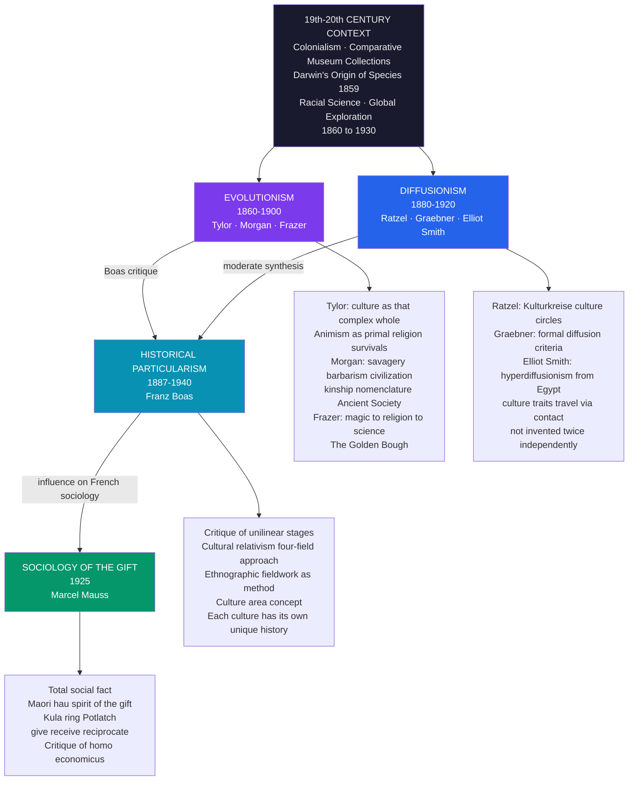

# Classical Anthropological Theory

> [!abstract] TL;DR
> Classical anthropological theory spans three competing 19th-century programs — Evolutionism (Tylor, Morgan, Frazer), Diffusionism (Ratzel, Graebner, Elliot Smith), and Historical Particularism (Boas) — each offering a different account of why human cultures resemble or differ from one another. Together with Mauss's sociology of the gift, they established the core debates — cultural universalism vs. relativism, parallel invention vs. diffusion, gift vs. commodity — that continue to organize all of social anthropology today.

---

## Intuition

**Analogy:** Imagine three explorers arriving independently in a remote rainforest community and each discovering that the local people have developed an elaborate basket-weaving tradition nearly identical to one documented in Southeast Asia. The first explorer says: "Human minds everywhere work the same way — given the same functional problem of carrying things, every society converges on the same solution. Cultural evolution is universal and sequential." The second explorer says: "Nonsense — traditions this specific do not appear independently twice. Someone traveled between these two societies and taught the technique. Culture spreads through contact, not parallel invention." The third explorer says: "Stop. You are both assuming you already know what this basket *means* to these people. Before you theorize about origins, learn the language, live here for two years, map the kinship system, and ask who makes the baskets, for whom, and what the community says about them."

Those three explorers are classical anthropological theory in miniature: evolutionism, diffusionism, and historical particularism. The third explorer — Franz Boas — won the methodological argument, but the questions the first two raised have never entirely gone away. And in 1925, a fourth voice joined the conversation: Marcel Mauss showed that the basket itself, when given as a gift, carries a social obligation as binding as any legal contract — collapsing the boundary between economics, kinship, and religion that all three earlier programs had taken for granted.

---

## How It Works



---

## Key Concepts

### Secondary Level

**What is anthropology?** Anthropology is the holistic study of humanity — what human beings are biologically, how they evolved, what languages they speak, what archaeological traces they leave, and above all, how they organize their shared life into what we call culture. In the American tradition established by Boas, the discipline is divided into **four fields**:

| Field | Core Question | Methods | Founders |
|---|---|---|---|
| **Cultural anthropology** | How do human communities organize meaning, kinship, religion, and economy? | Ethnographic fieldwork, participant observation | Boas, Mead, Benedict |
| **Physical (biological) anthropology** | How did humans evolve biologically? How do populations differ anatomically? | Comparative anatomy, genetics, primatology | Huxley, Boas (craniometry critique) |
| **Linguistic anthropology** | How does language shape and reflect culture? | Fieldwork, comparative linguistics | Sapir, Whorf |
| **Archaeology** | What can material remains tell us about past societies? | Excavation, stratigraphy, dating | Petrie, Childe |

**The classical schools at a glance:**

| School | Core Claim | Key Figures | Period | Verdict |
|---|---|---|---|---|
| **Evolutionism** | All cultures pass through the same stages from primitive to civilized | Tylor, Morgan, Frazer | 1860–1900 | Refuted as unilinear; legacy in comparative method |
| **Diffusionism** | Cultural similarities result from contact and borrowing, not parallel invention | Ratzel, Graebner, Elliot Smith | 1880–1920 | Partly correct; hyperdiffusionism refuted |
| **Historical Particularism** | Each culture is the product of its own unique history; relativism before theory | Franz Boas | 1887–1940 | Won the methodological debate; defines modern ethnography |
| **Sociology of the Gift** | Gift exchange is the foundational social institution; the gift is never free | Marcel Mauss | 1925 | Foundational for economic anthropology |

**Key terms every student needs:**

- **Culture** — E.B. Tylor's 1871 definition: "that complex whole which includes knowledge, belief, art, morals, law, custom and every other capability and habit acquired by man as a member of society." This is still the baseline definition.
- **Cultural relativism** — the methodological principle that cultures must be understood on their own terms before being evaluated; associated with Boas. Methodological relativism (how to understand) is distinct from moral relativism (whether to judge).
- **Unilinear evolution** — the thesis that all human societies pass through identical developmental stages in sequence. Proposed by Morgan; rejected by Boas on empirical grounds.
- **Diffusion** — the spread of cultural traits (technologies, practices, beliefs) from one society to another through contact, trade, migration, or conquest.
- **Total social fact** — Mauss's concept: some institutions (gift exchange, the Potlatch) are "total" because they simultaneously involve economic, legal, religious, aesthetic, and kinship dimensions — no single disciplinary lens captures them alone.
- **Survivals** — Tylor's concept: cultural practices retained from an earlier evolutionary stage that have lost their original function. A custom whose origin is forgotten but which persists as habit.

---

### Undergraduate Level

#### Tylor: Culture, Animism, and Survivals

Edward Burnett Tylor's *Primitive Culture* (1871) established two enduring contributions to anthropology.

**The definition of culture:** Tylor's opening sentence — "Culture, or civilization, taken in its widest ethnographic sense, is that complex whole which includes knowledge, belief, art, morals, law, custom, and any other capabilities and habits acquired by man as a member of society" — was the first systematic, secular definition of culture as a unified object of study. It detached culture from both high-culture connotations (Matthew Arnold's "best that has been thought and said") and racial inheritance. Culture is *acquired*, not innate. This was a revolutionary move: it meant that cultural differences between groups were not biological but historical — and therefore changeable.

**Animism as the origin of religion:** Tylor proposed that the earliest form of religion was **animism** — the belief that all natural phenomena (rivers, trees, storms, animals, the dead) possess souls or spirit agents. He derived this from his "minimum definition of religion": the belief in spiritual beings. Animism, on this account, was a rational attempt by early humans to explain puzzling phenomena (dreams, death, coincidence) using the available conceptual vocabulary of agency and personality. If I dream of my dead grandfather, the most logical inference available to a pre-scientific mind is that his soul visited me. Religion, for Tylor, was not primitive superstition but early science — a proto-explanatory framework.

**Survivals:** Tylor's concept of survivals gave anthropologists their first systematic method. A survival is a cultural practice or belief that has been carried forward from an earlier evolutionary stage into the present but has lost its original function — it continues through sheer social habit. Examples: the handshake (originally a gesture showing one's hand held no weapon), black mourning dress in England (originally linked to the belief that spirits of the dead could possess the living — dark clothing made the mourner invisible), wedding customs that involve old shoes. The survival concept implies that cultural practices are stratified — that analyzing a contemporary custom's residual form can yield evidence about the evolutionary stage in which it originated.

**Psychic unity of mankind:** Tylor, Morgan, and Frazer all shared the premise that all human beings possess the same cognitive capacities — the same "psychic unity." This was, paradoxically, both the source of evolutionism's theoretical power (if all minds work alike, convergence is predictable) and its anti-racist implication: there are no inferior races, only societies at different stages of a universal development.

---

#### Morgan: Unilinear Evolution and Kinship

Lewis Henry Morgan is the most systematically scientific of the evolutionary anthropologists. His *Ancient Society* (1877) presented the fullest version of unilinear cultural evolution and his *Systems of Consanguinity and Affinity of the Human Family* (1871) produced the first comparative study of kinship terminology — a methodological achievement that survives his evolutionary framework.

**The three stages and their subdivisions:**

| Stage | Period | Defining Technology | Morgan's Criteria |
|---|---|---|---|
| **Lower Savagery** | Earliest | Subsistence on fruits/nuts | No fire or tools |
| **Middle Savagery** | — | Fish subsistence; fire | Fire use; fish diet |
| **Upper Savagery** | — | Bow and arrow | Hunting as primary subsistence |
| **Lower Barbarism** | — | Pottery | Pottery manufacture |
| **Middle Barbarism** | — | Irrigation agriculture (New World) or animal domestication (Old World) | Cultivation or pastoralism |
| **Upper Barbarism** | — | Iron smelting | Iron tools |
| **Civilization** | — | Phonetic alphabet; writing | Written records |

Morgan's scheme was technological determinism applied to culture: each stage is defined by a decisive innovation in the material means of subsistence. This gave his stages an apparent empirical grounding that Tylor's three-stage scheme (savagery-barbarism-civilization without Morgan's subdivisions) lacked.

**Kinship nomenclature:** Morgan's most durable scientific contribution was his discovery that kinship terminological systems vary cross-culturally in systematic ways that do not correspond to biological genealogy. He identified two fundamental types:

- **Descriptive systems** (like English): kin are named according to their precise genealogical relationship. "Uncle" means specifically your parent's sibling; "cousin" means a child of your parent's sibling. Different categories are carefully distinguished.
- **Classificatory systems** (like Iroquois, Hawaiian, Omaha): kin are grouped into broad categories that merge what descriptive systems keep separate. In a "Hawaiian" system, all cousins of your generation are called by the same term as siblings. In an "Iroquois" system, your mother's brother's children and father's sister's children (cross-cousins) are grouped with your siblings, while your father's brother's children and mother's sister's children (parallel cousins) are grouped with a different term. These "classifications" reflect marriage rules and lineage organization, not biological proximity.

Morgan correctly recognized that kinship terminology was a window into social organization — that the way a society names its kin encodes its rules of descent, marriage, and group membership. This insight founded the entire field of kinship theory, even though Morgan's evolutionary explanation for the variation was rejected.

**Marx, Engels, and Morgan:** *Ancient Society* was read avidly by Marx and Engels. Engels' *The Origin of the Family, Private Property and the State* (1884) was explicitly based on Morgan's scheme, adding the Marxist interpretation that the transition from savagery to barbarism to civilization was driven by the emergence of private property and its inheritance through the male line. This gave Morgan's kinship data a direct political valence: the nuclear family was not natural but historical — a product of capitalist property relations, therefore changeable.

---

#### Frazer: Magic, Religion, and Science

James George Frazer's *The Golden Bough* (first edition 1890, expanded to twelve volumes by 1915) was the most widely read anthropological work of its era. Frazer never conducted fieldwork — he compiled comparative data from travelers, missionaries, and colonial administrators through what he called the "comparative method."

**The logic of magic:** Frazer proposed that all magical thinking operates on two principles:

1. **Sympathetic (homeopathic) magic**: *Like produces like.* If you make a wax effigy of your enemy and stick pins in it, the effigy's suffering transfers to the real person. The principle is analogy — similarity at the representational level produces similarity at the real level. Voodoo dolls, rain dances (mimicking the sound of rain), and the use of yellow flowers to cure jaundice (color = color) all follow this logic.

2. **Contagious magic**: *Contact transfers properties forever.* Objects that were once in contact with a person retain a permanent connection to them. Hair, nail clippings, clothing, name — all can be used to affect the person who once owned or used them. This explains the near-universal prohibition on a stranger touching a king (royal potency is contagious and dangerous), the magical efficacy of relics (the physical remains of saints), and the horror of a witch obtaining a lock of your hair.

Both principles are united by the underlying assumption that the world is governed by a universal law of sympathy — that representations and contacts create real causal links. For Frazer, magic was a pseudo-science: it correctly identified that the world was governed by laws, but misidentified what those laws were.

**Magic → Religion → Science:** Frazer's famous three-stage sequence proposed that the historical development of human thought moved from:

1. **Magic**: the attempt to coerce nature through sympathetic and contagious laws. When magic repeatedly fails, the practitioner concludes that natural forces are not directly coercible — they are governed by superhuman agents whose goodwill must be solicited.
2. **Religion**: the propitiation of supernatural persons — gods, spirits, demons — whose favor determines outcomes. When religious explanations and prayer also repeatedly fail, a more rigorous understanding of causation emerges.
3. **Science**: the empirical investigation of genuine causal regularities, stripped of both magical analogy and personal agency.

Frazer presented this as cognitive progress — science supersedes religion as religion superseded magic. The dying god motif (the vegetation deity whose death and resurrection mirrors the agricultural cycle) appears in his analysis of dozens of societies and culminates in a barely-veiled parallel with Christianity, which scandalized readers and made the book an instrument of Victorian secularism.

**What survives of Frazer:** Almost nothing of Frazer's theoretical framework survives. His data was second-hand and often wrong. His comparative method — excerpting cultural items from context and arranging them by apparent similarity — was exactly what Boas systematically demolished. But Frazer's two principles of magical thinking were vindicated in a different register: Lévy-Bruhl's work on "primitive mentality," and later cognitive anthropologists like Pascal Boyer and Dan Sperber, showed that sympathetic and contagious thinking are not primitive relics but universal features of human cognition that persist even in highly educated adults (ask anyone whether they would wear a murderer's laundered sweater). Frazer identified something real — not a historical stage, but a cognitive universality.

---

#### Diffusionism: Kulturkreise, Hyperdiffusionism, and the Middle Ground

Diffusionism emerged in the late 19th century as a direct challenge to evolutionism's claim that cultural similarities result from parallel independent invention. The diffusionists argued that the presumption should be the reverse: similar cultural items in geographically separated societies are more likely to result from historical contact than from coincident invention.

**Friedrich Ratzel and the culture-area concept:** The German geographer Friedrich Ratzel (1844–1904) mapped the global distribution of specific cultural traits — bow shapes, mask types, house forms — and showed that similar traits clustered geographically in ways that suggested a common historical origin. His concept of *Kulturkreise* (culture circles or culture complexes) proposed that cultures be defined not by evolutionary stage but by geographic clusters of co-occurring traits, each cluster traceable to a center of origin.

**Fritz Graebner and formal diffusionism:** Fritz Graebner (1877–1934) refined Ratzel's approach into a systematic methodology. He proposed two formal criteria for establishing historical diffusion rather than coincident invention:
- **Form criterion**: two traits are diffusion-related if they share a specific, idiosyncratic formal similarity that goes beyond what functional requirements alone would dictate. A wheel is functionally universal; a wheel with a specific number of spokes, joined in a specific way, is historically specific.
- **Quantity criterion**: the more traits two cultural complexes share, the less likely this is to result from coincidence. Ten shared traits in the same configuration constitute strong evidence for historical connection.

**Elliot Smith and hyperdiffusionism:** The British anatomist Grafton Elliot Smith (1871–1937) took diffusionism to its logical extreme — and beyond. In *The Migrations of Early Culture* (1915) and subsequent works, he argued that virtually all significant cultural achievements — pyramid building, mummification, irrigation agriculture, sun worship, the swastika symbol — originated in ancient Egypt and spread to the rest of the world through migration and trade. All civilizations derived from a single Egyptian source: the "Children of the Sun" hypothesis. This **hyperdiffusionism** attracted derision from professional anthropologists almost immediately. It explained cultural similarity only by multiplying ad hoc migration routes, and it contradicted the well-established independent development of agriculture in Mesoamerica, China, and the Fertile Crescent. Its influence was primarily negative — it so thoroughly discredited diffusionism as a theoretical program that even legitimate diffusionist arguments became methodologically suspect.

**Boas as moderate diffusionist:** Ironically, Boas — the great opponent of evolutionism — was also the most methodologically rigorous diffusionist. He accepted that cultural traits do spread through contact; his quarrel with evolutionism was precisely that parallel evolution was invoked to explain similarities that were better explained by diffusion. But he insisted on the Graebner criterion: before asserting diffusion, one must demonstrate historical contact and trace the pathway. Boas's ethnographic work on the Northwest Coast showed in meticulous detail how the Potlatch complex had spread through trade networks while being locally transformed. He occupied the methodologically defensible middle ground: diffusion is real, historically traceable, and far more common than evolutionists admitted — but it requires evidence, not armchair inference.

---

#### Boas and Historical Particularism

Franz Boas (1858–1942) is the most important figure in the history of American anthropology, and arguably the most consequential social scientist of the early 20th century. Born in Germany, trained in physics and geography, he came to anthropology through fieldwork with the Inuit in 1883 and with Northwest Coast cultures beginning in 1886. He spent the rest of his career at Columbia University, where he trained the generation of anthropologists who built the discipline.

**The critique of unilinear evolution:** Boas's critique was empirical, not philosophical. He argued that the comparative method as practiced by Tylor and Morgan committed a fundamental logical error: it lifted cultural items out of their contexts and arranged them by apparent similarity, then called the resulting sequence an evolutionary stage. But the sequence was constructed by the researcher, not found in nature. Different cultural items that appear similar may have entirely different historical origins, social functions, and local meanings. The Iroquois classificatory kinship system is not evidence of an earlier "primitive" stage of human kinship — it is evidence that the Iroquois have a specific set of rules governing descent and marriage that happened to produce a terminological system different from European norms.

**Cultural relativism:** Boas insisted that cultural practices must be understood within their own historical and social context before they can be compared or evaluated. This **methodological cultural relativism** had two components:
1. **Historical**: every cultural practice is the product of a specific history of invention, diffusion, and local modification. There is no shortcut to understanding it other than reconstructing that history.
2. **Contextual**: the meaning of a cultural practice is determined by its place within a larger cultural whole. The Potlatch (the Northwest Coast ceremony of competitive feast-giving and property distribution) looks like irrational waste to an outside observer applying Western economic logic; it is in fact a rational system for redistributing surplus, establishing status hierarchies, and maintaining alliances within a specific social structure.

**The four-field approach:** Boas institutionalized the four-field structure of anthropology (cultural, physical, linguistic, archaeological) not as bureaucratic convenience but as a theoretical claim: that the full understanding of any human group requires biological, historical, linguistic, and ethnographic data simultaneously. His work on the physical anthropology of immigrants — measuring head shapes (the *cephalic index*) of children of Eastern European and Southern European immigrants — was designed to demolish the scientific racism of his era. He showed that the cephalic index, which had been treated as a fixed, heritable racial characteristic used to rank racial groups, changed significantly within one generation of immigration. Environment, not race, determined cranial morphology. This was among the most politically consequential findings in early 20th-century social science.

**The culture area concept:** Building on Ratzel but empirically grounding the method, Boas and his students (particularly Clark Wissler and Alfred Kroeber) organized Native American cultural data by **culture areas** — geographic regions within which cultures share a cluster of traits resulting from common historical experience, trade, and ecological adaptation. The Plains culture area (buffalo-hunting, horse nomadism, vision quest, tipi), the Northwest Coast culture area (salmon fishing, Potlatch, totem poles, cedar plank houses), and the Pueblo Southwest culture area (sedentary agriculture, kiva ceremonialism, adobe architecture) each represents a historically constituted pattern, not an evolutionary stage. The culture area concept was explicitly anti-evolutionary: it replaced the vertical temporal axis (stages of development) with a horizontal spatial axis (geographic patterns of diffusion).

**Boas's students:** Boas trained the most influential generation of American anthropologists:
- **Ruth Benedict** (*Patterns of Culture*, 1934): each culture is organized around a dominant psychological configuration — the "Dionysian" (passionate, excess-embracing) culture of the Great Plains vs. the "Apollonian" (restrained, moderate) culture of the Pueblo Southwest. Culture as personality writ large.
- **Margaret Mead** (*Coming of Age in Samoa*, 1928): adolescent sexual crisis is not a universal biological phenomenon but a product of specific cultural arrangements around sexuality, puberty, and social role — refuting the claim that the psychological storm of adolescence is innate.
- **Edward Sapir**: language shapes perception; the Sapir-Whorf hypothesis of linguistic relativity.
- **Alfred Kroeber**: the concept of the "superorganic" — culture as a level of organization that cannot be reduced to individual psychology or biology; cultural patterns that transcend individuals.
- **Robert Lowie**: rigorous critique of Morgan's evolutionary scheme; demonstrated that Native American data directly contradicted the predicted stage sequences.

---

#### Mauss and The Gift

Marcel Mauss (1872–1950) was Durkheim's nephew and the most important figure in French anthropology after Durkheim himself. His *Essai sur le don* (*The Gift*, 1925) is one of the most cited works in all of social science.

**The problem:** Mauss begins with a deceptively simple question: in archaic societies, what is the rule that compels the recipient of a gift to reciprocate? Gifts are, by definition, voluntary. Why does receiving a gift create an obligation to give back?

**The total social fact:** Mauss's answer is that gift exchange is not an economic phenomenon that also happens to involve social courtesy — it is a **total social fact** (*fait social total*). Gift exchange simultaneously involves:
- **Economic** dimensions: the circulation of goods and services
- **Legal** dimensions: binding obligations with consequences for violation
- **Religious** dimensions: the objects exchanged carry spiritual force
- **Aesthetic** dimensions: the form, timing, and presentation of gifts are governed by cultural conventions
- **Political** dimensions: gift exchange establishes hierarchies and alliances

No single disciplinary lens (economics, law, religion) can capture the phenomenon. This was Mauss's methodological challenge to disciplinary specialization and to the emerging economic orthodoxy that treated exchange as a purely economic phenomenon between utility-maximizing individuals.

**The Maori hau:** Mauss drew on ethnographic data collected by the New Zealand ethnographer Elsdon Best on Maori gift exchange. The Maori concept of *hau* — the spirit or force of the gift — explained why objects must be returned: a gift carries the *hau* of its original owner with it. If you receive a gift and exchange it with a third party, the *hau* of the original owner travels with the object. When the third party gives you something in return, that return gift also carries the original owner's *hau*. You must pass something back to the original owner to return their *hau*; to keep it is dangerous — the *hau* of an unreciprocated gift sickens and may kill the recipient. The obligation to reciprocate is therefore not merely social convention but a form of cosmological necessity.

**The three obligations:** Mauss identified three interlocking duties that constitute gift exchange as a social system:

| Obligation | Content | Consequence of Violation |
|---|---|---|
| **To give** | One is expected to give — to distribute goods, feasts, hospitality. The refusal to give is a declaration of war or a withdrawal from society | Social exclusion; loss of status; declaration of hostility |
| **To receive** | One is expected to accept a gift — to refuse is to declare oneself superior to the giver, an act of hostility or contempt | Same social rupture; the refusal of a gift is as aggressive as a slap |
| **To reciprocate** | One is obliged to return something of comparable or greater value at an appropriate time — neither too soon (which cancels the gift) nor never (which defaults on the obligation) | Debt, spiritual danger (hau), loss of prestige, social sanction |

**The Potlatch:** Mauss devoted sustained attention to the Northwest Coast Potlatch, documented by Boas, as the most extreme case of the gift economy. The Potlatch is a ceremony in which a chief hosts a feast and gives away — or destroys — enormous quantities of goods (blankets, copper shields, food, canoes) to demonstrate his superiority over rivals. The receiving chief is obligated to hold a larger Potlatch in return. The logic is competitive generosity rather than competitive accumulation: status accrues to the giver, not the hoarder. The Canadian government banned the Potlatch in 1885, under pressure from missionaries and colonial administrators who recognized it as incompatible with the capitalist accumulation ethic they wished to install.

**The Kula ring:** Mauss also drew on Bronislaw Malinowski's *Argonauts of the Western Pacific* (1922) — the foundational work of modern ethnographic fieldwork — which documented the **Kula exchange** among the Trobriand Islands of Melanesia. The Kula is a ring of inter-island exchange in which two types of valuables circulate in opposite directions around the ring: *mwali* (white shell arm-bracelets) move counterclockwise, while *soulava* (red shell necklaces) move clockwise. The objects are not for use — they are exchanged as gifts between trading partners and keep circulating. Their value is entirely biographical: a *soulava* that has passed through the hands of many distinguished men carries their accumulated prestige. The Kula creates permanent partnerships, political alliances, and routes for the trade of practical goods (food, tools) in its wake. It is gift exchange as the infrastructure of an entire inter-island political economy.

**The critique of homo economicus:** Mauss's broader argument was a direct challenge to the utilitarian economic model of the rational self-interested individual (*homo economicus*). The gift economies he documented were not primitive precursors to markets that would eventually be replaced by rational exchange — they were fully rational systems organized around different values (prestige, alliance, reciprocity, cosmic order) that achieved economic distribution, political alliance, and social cohesion simultaneously and more efficiently than any pure market could. The lesson Mauss drew was normative as well as descriptive: modern economies that treat all exchange as market exchange are impoverished; a healthy society requires institutions that encode the obligation to give.

---

### Graduate Level

#### Psychic Unity vs. Cultural Determinism

The deepest theoretical fault line in classical anthropology runs between two positions that are both necessary and in tension with each other.

**Psychic unity of mankind** — the premise shared by Tylor, Morgan, Frazer, and Boas — holds that all human beings possess the same cognitive capacities and the same fundamental mental processes. There are no cognitively inferior races or peoples. This was, in its 19th-century context, a profoundly anti-racist claim: it underwrote the argument that differences between European and non-European societies were historical and contingent, not biological and fixed. The implication was that all human cultures could in principle achieve the same level of development.

**Cultural determinism** — Boas's legacy in the hands of Benedict and Mead — argued that cultural context shapes cognition, personality, and behavior so thoroughly that the psychic unity premise needed heavy qualification. If adolescent storm and stress is not universal but cultural (Mead), if personality types are culturally constituted configurations (Benedict), if the language one speaks shapes what one can readily think (Sapir-Whorf), then the "universal human mind" that Tylor assumed is a far more culturally variable instrument than evolutionism acknowledged.

The tension is this: psychic unity licenses comparison (all minds work alike, so cross-cultural comparison is meaningful) but threatens to imply a universal evolutionary scale. Cultural determinism disables the evolutionary scale (no universal trajectory) but threatens to make genuine comparison impossible (if each culture is sui generis, what is the basis for any cross-cultural claim?). This is still the central methodological tension in cultural anthropology.

#### The Nature-Nurture Debate Before Boas

The 19th-century anthropological debate over racial hierarchy was structured around the claim that biological race determined cultural capacity. The craniometric tradition — measuring skull volumes and shapes to rank racial groups on a scale of intelligence — provided scientific cover for colonial hierarchies. Francis Galton, Paul Broca, and Samuel Morton all produced measurements that, by remarkable coincidence, placed white Europeans at the top of every scale.

Boas's intervention was systematic and empirical. His study of head shapes in 17,000 immigrants and their American-born children showed that the cephalic index — the ratio of skull width to length, treated as a fixed racial constant — changed significantly within one generation of immigration to the United States. Children born in America had measurably different head shapes than their parents who had been born abroad. If the cephalic index was fixed by race, this was impossible. Boas concluded that cranial morphology was plastic, responsive to environment and nutrition, not a fixed racial indicator. This demolished the methodological foundation of scientific racism before World War I — a demolition that the Nazis, who stripped Boas of his Heidelberg doctorate in 1933, clearly understood.

#### Survivals as Methodology: Limits and Legacy

Tylor's concept of survivals was the first systematic attempt to use contemporary cultural data as evidence about the past. Its logic was archaeological: just as a stratum of rock preserves fossils of extinct organisms, a contemporary culture preserves "fossils" of extinct social arrangements in its habits, customs, and ritual forms. This was Tylor's justification for the comparative method: if survivals are methodologically transparent, then the cultural practices of contemporary "primitive" societies reveal what earlier stages of all societies looked like.

Boas destroyed this argument on two grounds:
1. **The identification problem**: how do you know a practice is a survival rather than a living functional element? Any practice can be retrospectively labeled a "survival" from a hypothetical earlier stage. The method is unfalsifiable.
2. **The context problem**: even if a practice originated in an earlier period, it has been reinterpreted, transformed, and integrated into a new cultural context that changes its meaning and function. The handshake in a 19th-century diplomatic protocol is not the same cultural item as a handshake among Stone Age warriors, even if there is a causal-historical connection between them.

The concept of survivals was abandoned. Its legitimate descendant was the study of **historical sequences in specific cultural traditions** — not universal human evolution, but the traceable historical development of particular practices within particular societies.

#### Mauss's Legacy in Economic Anthropology and Beyond

The *Essay on the Gift* spawned three major intellectual traditions:

1. **Substantivist economic anthropology** (Karl Polanyi, Marshall Sahlins): markets and price systems are historically specific institutions embedded in social relations, not universal features of human exchange. Polanyi's *The Great Transformation* (1944) argued that the self-regulating market was a 19th-century invention, not a natural condition; Mauss's gift economies were evidence that human economies are always "embedded" in social institutions. Sahlins's *Stone Age Economics* (1972) used Mauss to argue that hunter-gatherer societies had solved the economic problem (enough food, adequate leisure) more successfully than industrial capitalism.

2. **Symbolic exchange theory** (Pierre Bourdieu, Jean Baudrillard): Bourdieu extended Mauss's analysis of gift exchange into a general theory of social capital and symbolic capital. The gift is a form of misrecognized economic exchange — its *social* function (creating bonds, establishing hierarchies) is achieved precisely by denying its *economic* character. Baudrillard argued that symbolic exchange (in which things circulate as gifts, challenges, and returns rather than commodities) is irreducibly resistant to commodification and represents an ongoing counter-logic to capitalist exchange.

3. **The anthropology of care, debt, and obligation** (David Graeber, Annette Weiner): Graeber's *Debt: The First 5,000 Years* (2011) argued that debt — the obligation to return — is prior to market exchange; the credit relationship, not barter, is the original economic form. Weiner's concept of "inalienable possessions" refined Mauss: some objects (heirlooms, sacred objects, the crown jewels) cannot circulate as gifts or commodities because their value is constituted precisely by their non-circulation. The gift economy operates within the tension between what must circulate and what must be kept.

---

## Python Demo

```python
import numpy as np
import matplotlib
matplotlib.use("Agg")
import matplotlib.pyplot as plt

# ---------------------------------------------------------------
# Unilinear Evolution (Morgan) vs Historical Particularism (Boas)
#
# We simulate N_SOCIETIES populations over T time steps, tracking
# a "cultural complexity index" in [0, 100]:
#   0  = mobile band-level forager
#   33 = Morgan's "Savagery/Barbarism" boundary
#   66 = Morgan's "Barbarism/Civilization" boundary
#   100 = complex industrial state
#
# UNILINEAR MODEL (Morgan):
#   All societies follow the same logistic growth curve toward
#   maximum complexity, differing only in small Gaussian noise.
#   Prediction: cross-society trajectories converge; variance falls.
#
# HISTORICAL PARTICULARIST MODEL (Boas):
#   Each society starts at a random initial complexity and follows
#   a path shaped by:
#     (a) unique environmental endowment (per-society growth rate)
#     (b) stochastic historical shocks (droughts, invasions, innovations)
#     (c) contact diffusion with neighbors (Boas's moderate diffusionism)
#   Prediction: trajectories diverge; variance grows over time.
# ---------------------------------------------------------------

rng = np.random.default_rng(42)

N_SOCIETIES = 8
T = 120    # time steps (think: decades of development)
steps = np.arange(T)


# ── Unilinear Model ─────────────────────────────────────────────────────────

def unilinear_trajectory(t, noise_scale=2.8):
    """
    Logistic growth toward complexity = 100.
    All societies share the same growth parameters;
    small Gaussian noise models minor individual variation.
    """
    k = 100.0
    r = 0.07
    t0 = 60.0    # midpoint of logistic curve
    base = k / (1.0 + np.exp(-r * (np.arange(t) - t0)))
    noise = rng.normal(0, noise_scale, t)
    return np.clip(base + noise, 0, 100)

unilinear_traj = np.stack([unilinear_trajectory(T) for _ in range(N_SOCIETIES)])


# ── Historical Particularist Model ─────────────────────────────────────────

def historical_particularist_trajectories(n, t):
    """
    n societies each with:
      - unique environmental growth multiplier (endowment)
      - random initial complexity
      - stochastic positive/negative historical shocks
      - occasional contact diffusion from a random neighbor
    Returns an (n x t) array of complexity trajectories.
    """
    env_advantage = rng.uniform(0.3, 2.2, n)     # intrinsic growth-rate multiplier
    trajectories = np.zeros((n, t))
    trajectories[:, 0] = rng.uniform(5, 30, n)   # independent starting points

    for step in range(1, t):
        current = trajectories[:, step - 1]

        # Baseline drift scaled by environmental endowment
        drift = env_advantage * rng.normal(0.7, 0.5, n)

        # Discrete historical shocks (6% chance per society per step)
        # Values represent events like: innovation burst (+), warfare (-),
        # epidemic (-), trade route opening (+), environmental collapse (-)
        shock_events = np.array([-15, -10, -6, 5, 10, 18])
        shock_mask = rng.random(n) < 0.06
        shocks = rng.choice(shock_events, size=n) * shock_mask

        # Contact diffusion: each society has an 8% chance of being
        # influenced by a randomly chosen neighbor (Boasian diffusion)
        diffusion = np.zeros(n)
        for i in range(n):
            if rng.random() < 0.08:
                neighbor = rng.integers(0, n)
                if neighbor != i:
                    # Move 15% of the way toward the neighbor's current level
                    diffusion[i] = 0.15 * (current[neighbor] - current[i])

        trajectories[:, step] = np.clip(current + drift + shocks + diffusion, 0, 100)

    return trajectories

historical_traj = historical_particularist_trajectories(N_SOCIETIES, T)


# ── Statistics ──────────────────────────────────────────────────────────────

var_unilinear   = unilinear_traj.var(axis=0)
var_historical  = historical_traj.var(axis=0)

print("=" * 60)
print("Unilinear (Morgan) vs Historical Particularism (Boas)")
print("=" * 60)
print(f"  N societies={N_SOCIETIES}   T time steps={T}")
print()
print(f"{'Model':<28}  {'Final mean complexity':>22}  {'Final variance':>14}")
print("-" * 68)
for label, arr in [("Unilinear (Morgan)", unilinear_traj),
                   ("Hist. Particularist (Boas)", historical_traj)]:
    print(f"{label:<28}  {arr[:, -1].mean():>22.2f}  {arr[:, -1].var():>14.2f}")

print()
print("Interpretation:")
print("  Morgan: all societies converge on the same complexity level.")
print("  Boas:   environmental endowment, random historical events, and")
print("          contact diffusion produce permanently divergent outcomes.")
print("  The variance panel makes the point quantitatively:")
print("  Boasian variance grows; Morganian variance collapses.")


# ── Plot ─────────────────────────────────────────────────────────────────────

fig, axes = plt.subplots(1, 3, figsize=(16, 5))
fig.suptitle(
    "Morgan (Unilinear) vs Boas (Historical Particularism):\n"
    "Cultural Complexity Trajectories Over Time",
    fontsize=11, fontweight="bold"
)

STAGE_BOUNDS = [33, 66]
STAGE_LABELS = [("Savagery", 16.5), ("Barbarism", 49.5), ("Civilization", 83.0)]
STAGE_COLORS = ["#3b82f6", "#f59e0b", "#10b981"]


def shade_stages(ax, T):
    """Shade Morgan's three evolutionary stages as horizontal bands."""
    limits = [0] + STAGE_BOUNDS + [100]
    for i in range(3):
        ax.axhspan(limits[i], limits[i + 1],
                   alpha=0.07, color=STAGE_COLORS[i])
        ax.text(T * 0.98, STAGE_LABELS[i][1],
                STAGE_LABELS[i][0],
                ha="right", va="center", fontsize=7,
                color="#444", style="italic")


# Panel 1: Unilinear trajectories
ax1 = axes[0]
shade_stages(ax1, T)
colors_u = plt.cm.Blues(np.linspace(0.45, 0.90, N_SOCIETIES))
for i, traj in enumerate(unilinear_traj):
    ax1.plot(steps, traj, lw=1.6, color=colors_u[i], alpha=0.85)
ax1.set_title("Unilinear Evolution (Morgan)\nAll societies converge on same path", fontsize=9)
ax1.set_xlabel("Time (decades)", fontsize=9)
ax1.set_ylabel("Cultural Complexity Index", fontsize=9)
ax1.set_ylim(0, 100)
ax1.set_xlim(0, T - 1)
ax1.grid(True, alpha=0.2)


# Panel 2: Historical Particularist trajectories
ax2 = axes[1]
shade_stages(ax2, T)
colors_h = plt.cm.Oranges(np.linspace(0.45, 0.92, N_SOCIETIES))
for i, traj in enumerate(historical_traj):
    ax2.plot(steps, traj, lw=1.6, color=colors_h[i], alpha=0.85)
ax2.set_title("Historical Particularism (Boas)\nIndependent paths; divergent outcomes", fontsize=9)
ax2.set_xlabel("Time (decades)", fontsize=9)
ax2.set_ylim(0, 100)
ax2.set_xlim(0, T - 1)
ax2.grid(True, alpha=0.2)


# Panel 3: Cross-society variance over time
ax3 = axes[2]
ax3.plot(steps, var_unilinear, lw=2.5, color="#3b82f6", label="Unilinear (Morgan)")
ax3.plot(steps, var_historical, lw=2.5, color="#f97316",
         linestyle="--", label="Hist. Particularist (Boas)")
ax3.set_title("Cross-Society Variance Over Time\nLow = convergence  |  High = divergence", fontsize=9)
ax3.set_xlabel("Time (decades)", fontsize=9)
ax3.set_ylabel("Variance in Complexity Index", fontsize=9)
ax3.legend(fontsize=9)
ax3.set_xlim(0, T - 1)
ax3.grid(True, alpha=0.2)

plt.tight_layout()
plt.savefig("classical_anthropological_theory_model.png", dpi=110, bbox_inches="tight")
plt.show()
```

**What the model demonstrates:**

- **Unilinear model (Morgan)**: All eight societies follow the same logistic growth curve; small random noise produces some spread early but the trajectories converge toward the same final complexity level. The variance panel shows cross-society variance collapsing over time. This is Morgan's theoretical prediction: give any society enough time and it will reach civilization.
- **Historical Particularist model (Boas)**: Each society starts at a random initial level and is driven by a unique combination of environmental endowment, random shocks (wars, innovations, epidemics, trade-route openings), and contact diffusion with neighbors. The trajectories fan out rather than converging; some societies experience sharp collapses followed by recovery; others plateau at moderate complexity due to unfavorable environmental endowment. The variance panel shows cross-society variance growing over time.
- **Boas won the empirical debate**: the actual archaeological and ethnographic record shows something far closer to the Boasian pattern. The Aztec, Maya, and Inca civilizations developed without any connection to Old World civilizations; the agricultural transition occurred independently in at least seven world regions; and societies that were "advanced" in 1500 CE were often overrun by societies that were "less advanced" by Morgan's criteria but had specific military or epidemiological advantages. The variance in human cultural history is not noise around a universal trend — it is the primary datum.

---

## Real-World Applications

> **Tylor's culture concept and UNESCO cultural rights:** Tylor's 1871 definition of culture as an acquired complex whole — rather than a biological or racial inheritance — is the philosophical foundation of the UNESCO 2005 *Convention on the Protection and Promotion of the Diversity of Cultural Expressions*. The Convention treats cultural diversity as a resource to be protected, not an evolutionary lag to be overcome. Every argument in international cultural policy that treats indigenous cultural practices as legitimate and protected draws, ultimately, on Tylor's secularization of the culture concept away from racial hierarchy.

> **Morgan's kinship systems and legal anthropology:** Morgan's discovery that kinship terminological systems systematically encode descent and marriage rules laid the groundwork for the entire 20th-century comparative study of kinship. In practical legal terms, the documentation of customary kinship and marriage law in former colonial territories — determining who inherits land, who has parental rights, who can claim membership in an ethnic group — relies on the analytical vocabulary Morgan established. Courts in post-colonial Africa and Oceania still use kinship terminology analysis to adjudicate land and succession disputes.

> **Boas's craniometry refutation and modern forensic anthropology:** Boas's demonstration that the cephalic index changed across immigrant generations was the empirical death-blow to scientific racism as a research program. Its methodological legacy is modern forensic anthropology, which uses skeletal variation to assign biological ancestry in legal and forensic contexts. The key Boasian lesson — that populations overlap enormously in all skeletal dimensions and that no single measurement can assign an individual to a racial category — is now the standard of practice in forensic skeletal analysis.

> **Mauss's Gift and the sharing economy:** The three Maussian obligations (give/receive/reciprocate) are structurally present in every platform economy that calls itself a "sharing" or "gift" economy. When Couchsurfing hosts a stranger for free, the hau logic is at work: the host's generous action carries a social force that the guest is obligated to return — not necessarily to the original host, but into the system that produced the gift. Reciprocity is generalized rather than direct. Platforms that extract value by commodifying what began as gift exchange (early Airbnb vs. current Airbnb; early Uber vs. current Uber) are reproducing at scale the transition Mauss documented from Kula to market: the destruction of the total social fact in favor of the commodity relation.

> **Historical Particularism and NAGPRA:** The 1990 Native American Graves Protection and Repatriation Act (NAGPRA) in the United States requires federal institutions to return Native American human remains and sacred objects to tribal nations. The intellectual foundation of NAGPRA is Boasian: each Native American culture has its own specific history, its own relationship to its material heritage, and its own understanding of what sacred objects mean. The evolutionary-museum logic of collecting and displaying these objects as evidence of universal human stages was precisely the colonial logic Boas spent his career dismantling. NAGPRA institutionalized the Boasian position in law.

---

## Common Pitfalls

- **Conflating methodological and moral cultural relativism** — When Boas said cultures must be understood on their own terms, he meant it as a methodological starting point for research, not an absolute prohibition on moral judgment. Boas himself was fiercely politically engaged, publicly opposing Nazi racial ideology, American imperialism, and the persecution of minorities. The frequent undergraduate conclusion that cultural relativism means "no culture can ever be criticized" is a misreading; Boas was not a moral relativist.

- **Reading evolutionism as simply racist** — The psychic unity premise of Tylor and Morgan was genuinely anti-racist in its 19th-century context: it asserted that all human minds were equally capable. The racism was in the conclusion that non-European societies represented earlier stages of a universal development — a conclusion that was empirically wrong and politically pernicious, but it was derived from premises that included human equality of capacity. The logic was bad; the premise was not straightforwardly racist.

- **Treating The Golden Bough as serious ethnography** — Frazer was an armchair theorist who compiled data second-hand from missionaries, travelers, and colonial administrators. His comparative method — lifting items out of context and arranging them by surface similarity — was exactly what Boas demolished. The Golden Bough is valuable as a primary source on Victorian intellectual culture, as evidence that comparative mythology can identify genuine cognitive universals (sympathetic and contagious thinking), and as a literary text; it is not a reliable ethnographic record.

- **Confusing Morgan's stages with a deterministic law** — Morgan himself did not claim that all societies would inevitably reach the same stage — only that those that developed complex institutions would tend to pass through analogous technological transitions. His was a probabilistic claim about developmental pathways, not a historical inevitability. His popularizers (and critics) often hardened this into a mechanical law that Morgan's own text does not support.

- **Misreading "the gift is free"** — Mauss's central argument is precisely the opposite: the gift is never free. The obligation to reciprocate is as binding as any contractual obligation — it simply operates through social and spiritual pressure rather than legal enforcement. The most common pitfall is interpreting gift economies as altruistic or selfless; Mauss showed they are systems of competitive obligation in which generosity is a form of power over the recipient.

- **Overstating Elliot Smith's representativeness** — Diffusionism as a theoretical program should not be judged by hyperdiffusionism. Legitimate diffusionism — the empirical tracing of specific cultural traits through specific historical pathways of contact — is an entirely sound and productive methodology. Dismissing all diffusionist analysis because of Elliot Smith's Egyptocentric excesses is a form of guilt by association that Boas himself did not commit.

- **Treating Boas's students as uniform "Boasians"** — Ruth Benedict's *Patterns of Culture* takes cultural holism in a psychologistic direction Boas himself was skeptical of. Mead's *Coming of Age in Samoa* was critiqued by Derek Freeman (1983) on methodological grounds. Sapir's linguistic relativity was qualified significantly in later research. Kroeber's "superorganic" concept is conceptually problematic in ways Boas recognized. Boasian anthropology was a school, not a doctrine; its members disagreed on fundamental questions.

---

## Related Concepts

- [[Classical_Sociological_Theory]] — Durkheim's concept of social facts runs parallel to Mauss's total social fact; Morgan's evolutionary stages influenced Engels and hence Marxist social theory; Weber's comparative historical sociology poses the same questions about cross-cultural comparison that Boas engaged from an ethnographic direction
- [[Culture_Norms_Values_and_Ideology]] — Tylor's 1871 definition of culture is the foundational text for all subsequent sociological treatment; the Boasian emphasis on cultural context maps directly onto Geertz's later semiotic definition of culture as webs of significance; Bourdieu's habitus is the sociological translation of Boas's culture-as-context
- [[Social_Influence_and_Conformity]] — The social pressure that enforces Mauss's three obligations (to give, to receive, to reciprocate) is the micro-level mechanism that Milgram and Asch documented in laboratory settings; the normative power of gift exchange operates through exactly the conformity pressures that experimental social psychology operationalized
- [[Family_Marriage_and_Kinship]] — Morgan's kinship terminology typology (descriptive vs. classificatory systems; Iroquois, Hawaiian, Omaha, Crow, Eskimo systems) is the direct foundation for all 20th-century comparative kinship studies, from Levi-Strauss's alliance theory to Goody's comparative family history
- [[Religion_Sacred_and_Secular]] — Tylor's animism is the first systematic secular theory of religious origin; Frazer's magic-religion-science sequence is the evolutionary precursor to Durkheim's sacred/profane distinction; Mauss's analysis of the Potlatch and hau shows how gift exchange and religious cosmology are inseparable in archaic societies
- [[Race_Ethnicity_and_Racism]] — Boas's craniometric refutation of scientific racism is a founding moment in the modern biological understanding of race as primarily a social construct; his work on immigrant children directly challenged the racial determinism that was mainstream science in 1910 and provided empirical grounding for the anti-racist position

---

## Review Questions

### Secondary

1. E.B. Tylor defined culture as "that complex whole which includes knowledge, belief, art, morals, law, custom and every other capability and habit acquired by man as a member of society." Identify two things this definition tells us culture *is not* (by implication), and explain why that was controversial in 1871.
2. Morgan proposed that all human societies pass through three main stages: savagery, barbarism, and civilization. What was the key criterion he used to distinguish the stages, and what is the most obvious problem with applying this scheme to, say, ancient Athens (which had philosophy and literature but no iron metallurgy)?
3. Mauss argued that the gift "is never free." Using the example of a birthday present among friends, identify all three of Mauss's obligations at work and describe what would happen socially if you violated each one.

### Undergraduate

1. Boas made two distinct critiques of the evolutionary comparative method: a logical critique (about inference from similarity) and an empirical critique (about the actual distribution of cultural traits). Reconstruct both critiques precisely, using a specific example from either his Northwest Coast fieldwork or his craniometric study of immigrants, and explain why these critiques together were sufficient to end unilinear evolutionism as a research program — rather than merely requiring its modification.
2. Tylor, Morgan, and Frazer all assumed the "psychic unity of mankind" — that all human minds share the same cognitive processes. Boas also accepted psychic unity but reached opposite theoretical conclusions. How is this possible? What was the specific logical move Boas made that allowed him to reject unilinear evolution while retaining the premise of equal human cognitive capacity?
3. The Kula ring and the Potlatch are both instances of Mauss's gift exchange — yet they appear structurally very different (one is a circular inter-island exchange of symbolic valuables; the other is a feast involving competitive destruction of property). Using Mauss's framework of the total social fact and the three obligations, show that both are instances of the same underlying structure. Where does the analysis break down or require qualification?

### Graduate

1. Mauss argued that modern capitalism has produced a society of isolated individuals engaged in purely contractual exchange — and that recovering the logic of the gift is both analytically necessary and politically urgent. David Graeber extended this argument in *Debt* (2011), claiming that debt — the obligation to return — is prior to market exchange. Evaluate this genealogy: does Mauss's evidence from archaic gift economies support Graeber's claim about the historical priority of credit over barter? What assumptions about the relationship between anthropological cross-cultural data and historical sequence does this argument require?
2. The classical anthropological debate between evolutionism and historical particularism can be reconstructed as a debate about the relative weight of universal cognitive constraints vs. local historical contingency in explaining cultural form. Contemporary cognitive anthropology (Boyer, Sperber, Atran) has revived something like the evolutionist position at the level of cognitive universals — universal features of human mental architecture that generate cross-cultural regularities in religion, kinship categorization, and folk biology. How should this neo-evolutionism be evaluated in light of the Boasian critique? Is it vulnerable to the same methodological objections, or has it answered them?
3. Benedict's *Patterns of Culture* and Mead's *Coming of Age in Samoa* are the two most influential products of the Boasian tradition — and both have been subjected to serious methodological criticism (Freeman 1983 on Mead; Objective vs. Interpretive debates on Benedict). Does the empirical controversy around these works undermine the Boasian theoretical program, or are the works separable from the methodology Boas established? What would it mean for Boasian cultural relativism to be empirically *confirmed* or *refuted*?

---

## Sources

- [Tylor, E.B. (1871). *Primitive Culture*, 2 vols. Murray](https://archive.org/details/primitiveculture01tylouoft)
- [Morgan, L.H. (1877). *Ancient Society*. H. Holt](https://archive.org/details/ancientsocietyre00morg)
- [Frazer, J.G. (1890/1915). *The Golden Bough*, 12 vols. Macmillan](https://archive.org/details/goldenboughstudy01fraz)
- [Boas, F. (1887). "The Study of Geography." *Science* 9(210), 137–141](https://doi.org/10.1126/science.ns-9.210.137)
- [Boas, F. (1911). *The Mind of Primitive Man*. Macmillan](https://archive.org/details/mindofprimitive00boasgoog)
- [Boas, F. (1912). "Changes in Bodily Form of Descendants of Immigrants." *American Anthropologist* 14(3), 530–562](https://doi.org/10.1525/aa.1912.14.3.02a00080)
- [Mauss, M. (1925/1990). *The Gift: The Form and Reason for Exchange in Archaic Societies*. Routledge (trans. W.D. Halls)](https://www.goodreads.com/book/show/340281.The_Gift)
- [Malinowski, B. (1922). *Argonauts of the Western Pacific*. Routledge](https://archive.org/details/argonautsofweste00mali)
- [Benedict, R. (1934). *Patterns of Culture*. Houghton Mifflin](https://www.goodreads.com/book/show/184967.Patterns_of_Culture)
- [Mead, M. (1928). *Coming of Age in Samoa*. William Morrow](https://www.goodreads.com/book/show/179739.Coming_of_Age_in_Samoa)
- [Graeber, D. (2001). *Toward an Anthropological Theory of Value*. Palgrave Macmillan](https://www.goodreads.com/book/show/100819.Toward_an_Anthropological_Theory_of_Value)
- [Graeber, D. (2011). *Debt: The First 5,000 Years*. Melville House](https://www.goodreads.com/book/show/6617037-debt)
- [Stocking, G.W. (1968). *Race, Culture, and Evolution: Essays in the History of Anthropology*. Free Press](https://www.worldcat.org/title/race-culture-and-evolution-essays-in-the-history-of-anthropology)
- [Kuper, A. (1988). *The Invention of Primitive Society*. Routledge](https://www.goodreads.com/book/show/1143684.The_Invention_of_Primitive_Society)
- [Sahlins, M. (1972). *Stone Age Economics*. Aldine-Atherton](https://www.goodreads.com/book/show/261681.Stone_Age_Economics)
- [Polanyi, K. (1944). *The Great Transformation*. Farrar & Rinehart](https://www.goodreads.com/book/show/53442.The_Great_Transformation)

---

#Anthropology #Theory #ClassicalAnthropology #Evolutionism #Boas #Mauss #Diffusionism #Tylor #Morgan #Frazer #Gift #CulturalRelativism
