> [!abstract] TL;DR
> Ethnographic methods are the primary toolkit of cultural anthropology — long-term immersive fieldwork in which the researcher becomes a participant in the social world they study, producing knowledge through observation, interview, and thick description that quantitative surveys cannot reach. Malinowski established the modern paradigm in the Trobriand Islands (1915–1918); Geertz gave it its interpretive philosophical foundation; ongoing debates about ethics, reflexivity, and scientific status continue to reshape the practice.

---

## Intuition

**Analogy:** Imagine trying to understand the game of chess. You could read the rulebook — you would know how pieces move, but nothing about opening gambits, psychological pressure, the social rituals of shaking hands after a loss, or why the same player who blunders on move 12 at a tournament plays brilliantly at the club on Thursday evenings when their opponent is a friend. Now imagine spending a year sitting at that chess club — playing games, watching others play, listening to post-mortem analyses, helping the secretary organize tournaments, hearing stories about legendary past members, and gradually being trusted with the gossip about who cheated at regionals. At the end of the year you understand chess in a way the rulebook could never convey.

This is the core intuition behind ethnographic fieldwork. Rules and structures matter, but social life is constituted by practices, meanings, relationships, and contexts that only become visible to someone embedded in the scene over time. The ethnographer's method is not to measure social life from outside but to learn it from inside, then write it up in a way that makes that inside world intelligible to readers who have never been there.

---

## How It Works

The ethnographic research process is a cycle rather than a linear pipeline — every phase informs and revises the others, and the researcher's developing understanding loops back to reshape what they observe.

```mermaid
flowchart LR
    RQ["Research\nQuestion"] --> Site["Site Selection\n& Positioning"]
    Site --> Gate["Gatekeeper\nNegotiation"]
    Gate --> Ethics["FPIC &\nIRB Approval"]
    Ethics --> PI["Participant\nObservation\n(months to years)"]
    PI --> FN["Field Notes\n(jottings → expanded)"]
    FN --> INT["Interviews &\nLife Histories"]
    INT --> TRI["Triangulation\n(multiple methods)"]
    TRI --> ANA["Thick Description\n& Analysis (Geertz)"]
    ANA --> MC["Member\nChecking"]
    MC --> ETH["Ethnographic\nText"]
    ETH -->|"reflexivity\nloop"| PI

    style RQ fill:#7c3aed,color:#fff
    style PI fill:#2563eb,color:#fff
    style Ethics fill:#d97706,color:#fff
    style ANA fill:#059669,color:#fff
    style ETH fill:#dc2626,color:#fff
```



---

## Key Concepts

### Secondary Level

#### From Armchair to Field: Malinowski's Revolution

Before the early twentieth century, anthropology was largely an **armchair discipline**. Scholars in London or Paris assembled accounts written by missionaries, colonial administrators, and explorers — people who had been to the places in question — and synthesized them into grand comparative theories about the evolution of religion, kinship, or law. E.B. Tylor's *Primitive Culture* (1871) and J.G. Frazer's *The Golden Bough* (1890) are the monuments of this approach: sweeping, erudite, and almost entirely at the mercy of secondhand observers who had their own agendas and no training in systematic observation.

**Bronisław Malinowski** changed this when he was stranded in the Trobriand Islands (now Papua New Guinea) during World War I due to his status as an Austro-Hungarian national in British territory. From 1915 to 1918, he lived among the Trobrianders, learned their language, participated in their daily life, and documented the **kula ring** — a ceremonial exchange of shell valuables across island chains that defied the economists' assumption that exchange is always about material self-interest. His method became the template for twentieth-century fieldwork:

1. **Live in the village, not at the colonial station** — physical proximity matters; distance from informants is social distance
2. **Learn the local language** — translation by intermediaries distorts meaning at every step; the ethnographer must hear conversations, arguments, and jokes in the original
3. **Document the imponderabilia of daily life** — not just formal rituals and stated rules, but routine activities, accidents, conflicts, and the texture of ordinary days
4. **Stay long enough that people stop performing for you** — the first weeks of fieldwork are ethnographically unreliable because people present a managed version of themselves; only prolonged presence allows access to backstage behavior

Malinowski called his method **participant observation**: the researcher both observes (records) and participates (acts within the social world). The tension between these two roles — insider and analyst, friend and reporter — is never fully resolved and is itself a source of ethnographic insight.

#### The Emic/Etic Distinction

Two fundamental analytical stances operate throughout ethnographic work:

| Stance | Meaning | Example |
|--------|---------|---------|
| **Emic** | The insider's perspective; categories and meanings as participants themselves understand and use them | A Hopi farmer describes rainfall as a gift from the kachinas |
| **Etic** | The analyst's perspective; categories imposed by the researcher for comparative purposes | An agronomist describes the same rainfall event in millimeters of precipitation |

Neither is more "true." Emic accounts reveal the meaningful texture of a cultural world; etic accounts enable comparison across cases. The ethnographer moves constantly between them. The danger of staying purely emic is that you merely reproduce the community's self-understanding rather than analyzing it; the danger of staying purely etic is that your categories distort what you are describing beyond recognition.

#### Basic Field Notes

Field notes are the ethnographer's primary data. They have two layers:

- **Jottings**: brief notes taken during or immediately after an event — a few words, phrases, or sketches that capture what happened before memory fades. Jottings are necessarily cryptic and incomplete; their function is to anchor memory, not to narrate.
- **Expanded notes**: written up as soon as possible after returning from the field — typically at the end of each day. Expanded notes convert jottings into full sentences, situate events in context, record the researcher's interpretations, emotional reactions, confusions, and emerging hypotheses.

The quality of expanded notes depends critically on how quickly they are written after the event: **fieldwork memory decays rapidly**, and details that seem unforgettable at 6 p.m. have gone by 10 p.m. Many experienced ethnographers treat expanded note-writing as non-negotiable daily work, more important than sleep if the choice arises.

---

### Undergraduate Level

#### Research Design in Ethnographic Projects

Ethnographic research does not begin in the field — it begins with a research question that orients what the ethnographer will look for. The question is rarely fully formed before fieldwork begins (unlike a survey with fixed hypotheses) but it must be specific enough to focus attention. "How do Somali refugee families in Minneapolis navigate encounters with public school systems?" is a workable ethnographic question. "What is culture?" is not.

**Access and gatekeepers** are the first practical challenge. Access to a community, organization, or setting is rarely automatic; it requires negotiation with **gatekeepers** — individuals who hold formal or informal authority to grant or refuse entry. In a hospital, the gatekeeper might be the Chief Medical Officer. In a street gang, it might be a specific senior member who vouches for you. In a rural village, it might be the village headman or a trusted local intermediary. The terms of access are themselves ethnographic data: what conditions do gatekeepers impose? What do they want from the ethnographer?

**Sampling in ethnography** is fundamentally different from statistical sampling. The goal is not to produce a representative sample for inference to a population but to select cases, sites, and informants that are theoretically productive — that will illuminate the processes and meanings under investigation:

| Strategy | Logic | When to Use |
|----------|-------|-------------|
| **Purposive sampling** | Select informants or cases based on specific characteristics relevant to the research question | When particular roles, experiences, or positions in the community are key |
| **Snowball sampling** | Ask one informant to refer you to others; follow the referral chain | When the target population is hidden, stigmatized, or not easily enumerated |
| **Key informant sampling** | Identify a small number of highly knowledgeable community members as primary sources | When you need deep knowledge of specific practices or histories; risk of key informant's particular perspective dominating |
| **Theoretical sampling** | Actively seek cases that will challenge or develop emerging analytical categories (from grounded theory) | Mid-analysis, when concepts are solidifying and need testing against new cases |

**Triangulation** is the practice of using multiple data sources, methods, and perspectives to check and deepen interpretations. An ethnographer does not rely solely on what one informant says about a ceremony — they attend the ceremony, photograph it, interview several participants with different roles, examine any relevant material objects, and compare all of these against each other. Where accounts converge, confidence is high. Where they diverge, the divergence itself becomes analytically interesting.

#### The Qualitative Methods Toolkit

Beyond participant observation, ethnographers draw on several methods:

**Semi-structured interviews** use a topic guide (a list of themes and questions) but allow the conversation to follow the informant's own conceptual trails. The interviewer probes with follow-up questions ("What did you mean when you said...?", "Can you give me an example?") rather than moving mechanically through a questionnaire. Semi-structured interviews are appropriate for topics where the categories themselves are at issue — you cannot pre-code what you do not yet know.

**Life histories** are extended narratives in which informants recount their entire life trajectory, or a significant period of it, in their own terms. Oscar Lewis's *Children of Sanchez* (1961) — based on tape-recorded life histories of a Mexican family — showed how poverty was experienced and reproduced across generations in ways that statistics about poverty rates could not approach. Life histories reveal how individuals interpret their own trajectories in relation to larger social structures and historical events.

**Focus groups** bring 6–10 people together to discuss a topic collectively. The social dynamics of the group — who speaks first, who defers, what is laughed at or avoided — are themselves data about the group's internal organization. Focus groups are particularly useful for studying how norms and common-sense understandings are socially constructed and maintained in real time.

**Material culture analysis** examines objects — tools, clothing, domestic items, religious artifacts — as evidence of values, technologies, social relations, and historical connections. Malinowski's analysis of the kula ring required attending closely to the shell necklaces and armbands that circulated through the exchange system and the specific meanings attached to particular objects.

**Visual anthropology** uses photography, film, and video both as data-collection tools and as ethnographic outputs. Margaret Mead and Gregory Bateson's photographic study of Balinese character (1942) was an early systematic attempt to use images as evidence rather than illustration.

#### Ethnographic Writing

The ethnographic text is not a neutral transcription of "what happened." It is a representation — a constructed account that makes interpretive choices at every level.

**Thick description** is the term Clifford Geertz introduced (borrowing from philosopher Gilbert Ryle) to distinguish the kind of interpretation ethnography aims for from mere behavioral description. A thin description of a man rapidly closing and opening one eye is: "He blinked." A thick description recognizes whether this is an involuntary twitch, a conspiratorial wink to a friend, a parody of someone else's wink, or a rehearsed wink in a theatrical performance. The same physical movement can carry entirely different meanings depending on cultural context, relationship, and intention. Ethnographic description must convey this depth of meaning, not just the surface behavior.

In *The Interpretation of Cultures* (1973), Geertz argued that culture is a "text" — a web of meaning that the ethnographer's task is to read, not to measure. The ethnographer interprets interpretations. This hermeneutic model was enormously influential but also attracted criticism: if ethnography is interpretation all the way down, what prevents it from being the ethnographer's projections imposed onto a community?

**Narrative conventions in ethnographic writing** encode assumptions:

- The **present tense** (the "ethnographic present"): "The Nuer keep cattle and organize their social world around them" (Evans-Pritchard). This convention implies that a culture is synchronically integrated and historically static — a problem because it denies change over time and can fossilize communities in a timeless ethnographic "now" that never existed.
- **"The X believe..."**: generalizing across individuals to speak for a whole community — useful shorthand but potentially homogenizing; it erases internal disagreement, minority voices, and individual variation.
- **The researcher's absence from the text**: classical ethnography wrote in a distanced, authoritative third-person voice that effaced the researcher's presence and subjectivity, creating an illusion of omniscient objectivity. Post-*Writing Culture* (Clifford and Marcus, 1986) ethnographies often foreground the researcher as a positioned observer.

#### The Diary Problem

Malinowski's fieldwork notebooks were published posthumously as *A Diary in the Strict Sense of the Term* (1967). They revealed a man frequently bored, physically unwell, contemptuous of his informants, and fantasizing about European women — very far from the image of the dispassionate scientific observer that *Argonauts of the Western Pacific* projected. The publication caused a scandal because it exposed the gap between the persona presented in the published ethnography and the private experience of fieldwork.

The diary problem has two implications. First, ethnographers are human beings with biases, desires, and limitations — their observations are not neutral recordings. Second, the emotional experience of fieldwork — including frustration, desire, guilt, and confusion — is itself data about the social dynamics of the field site. Contemporary ethnographers are trained to treat their own reactions as part of the evidentiary record, not as contamination to be suppressed.

#### Research Ethics in Ethnography

Ethnographic research operates within a specific ethical framework shaped by anthropology's historical entanglement with colonialism, military intelligence, and the exploitation of communities by outside researchers who took knowledge and gave nothing back.

**Institutional Review Boards (IRBs)** require prospective review of research protocols involving human subjects in most institutional settings. IRB review for ethnographic projects involves assessing risks to participants, data confidentiality procedures, and the adequacy of informed consent processes. A persistent tension: IRBs were designed with biomedical experiments in mind, and their standard categories (hypothesis, intervention, measurement) fit awkwardly onto open-ended ethnographic research that cannot fully specify in advance what will be observed or who will be involved.

**Free, Prior, and Informed Consent (FPIC)** is the principle, strongly endorsed by indigenous rights frameworks, that communities must give consent to research before it begins, that this consent must be obtained without coercion (free), before fieldwork starts (prior), and with full understanding of the research's purposes and potential consequences (informed). FPIC is harder to operationalize than it sounds: communities are not monolithic; gatekeepers who give consent may not represent all community members; and researchers studying sensitive topics (illegal activity, private ritual) may not be able to disclose the full nature of their investigation without compromising the research.

**The American Anthropological Association (AAA) Code of Ethics** (current version 2023) establishes a hierarchy of responsibilities:
1. Do no harm to the people studied
2. Be honest and transparent about research purposes
3. Obtain informed consent
4. Protect confidential information
5. Respect intellectual property
6. Acknowledge the community's contributions to knowledge production

The AAA code places obligations to research participants above obligations to funders, employers, and even the discipline itself — a deliberate response to the history of anthropologists being recruited into counterinsurgency and intelligence operations.

---

### Graduate Level

#### Validity and Reliability in Ethnographic Research

The concepts of validity and reliability, as conventionally defined in quantitative social science, apply to ethnographic research in modified forms. The concern is not measurement consistency across administrations (reliability) or whether an operationalization captures its construct (validity) in the psychometric sense, but whether interpretations are **trustworthy** and **credible**.

Lincoln and Guba (1985) proposed four parallel criteria for evaluating qualitative research:

| Quantitative criterion | Qualitative equivalent | How it is achieved in ethnography |
|------------------------|----------------------|-----------------------------------|
| **Internal validity** | **Credibility** | Prolonged engagement (months not days), triangulation across methods and sources, member checking, peer debriefing |
| **External validity** | **Transferability** | Thick description that gives readers enough context to judge applicability to their own settings — not statistical generalization but analytic generalization |
| **Reliability** | **Dependability** | Audit trail: field notes, memos, interview transcripts, and analytic records that allow others to trace the inferential chain from data to interpretation |
| **Objectivity** | **Confirmability** | Evidence that interpretations are grounded in data rather than researcher projection; negative case analysis (actively seeking cases that disconfirm emerging interpretations) |

**Member checking** — returning interpretations to research participants for their response — is powerful but complex. Participants may legitimately dispute the researcher's interpretation. This is not simply an "error" to be corrected; the dispute itself reveals something important about the relationship between insider and analyst framings. When Renato Rosario showed his analysis of Ilongot headhunting to community members, their objections to his earlier functionalist interpretation helped him develop his later, richer account of headhunting as an expression of grief.

The **National Research Council (NRC) debate** (Shavelson and Towne, *Scientific Research in Education*, 2002) raised sharp questions about whether qualitative social science — including ethnography — could meet the standards of "scientific research" it proposed. Critics argued that the NRC's criteria (replication, objectivity, causal inference) encoded a positivist epistemology incompatible with interpretive research. The debate clarified that ethnography aims for a different kind of validity — **interpretive adequacy** — rather than the experimental ideal, and that judging it by experimental standards is a category error.

#### The Comparative Method and Galton's Problem

A single ethnographic case is not, by itself, a comparative argument. Cross-cultural comparison requires a systematic way of relating cases from different societies. The **Human Relations Area Files (HRAF)**, created by George Murdock beginning in the 1940s, is the major infrastructure for cross-cultural comparison: a database of coded ethnographic materials from hundreds of societies, organized by topic (kinship, economics, religion, etc.), enabling researchers to test hypotheses across cases (e.g., "Do societies with unilineal descent systems tend to have different property rules than bilateral systems?").

**Galton's Problem** (raised by Francis Galton at a 1889 meeting of the Royal Anthropological Institute in response to a paper by E.B. Tylor) is the fundamental methodological challenge for cross-cultural comparison: societies are not independent data points. They share history, language, and cultural traits through borrowing, migration, and common ancestry. If you find that 30 of your 50 sampled societies share a particular correlation between polygyny and warfare, you cannot assume these are 30 independent pieces of evidence — they may all descend from a single ancestral population in which that correlation existed, inflating apparent statistical significance. Modern solutions include autocorrelation correction, phylogenetic methods borrowed from evolutionary biology, and careful historical analysis of diffusion pathways.

#### Digital Ethnography

The rise of digital platforms has generated new field sites. **Digital ethnography** — sometimes called virtual ethnography or netnography (Kozinets, 2010) — applies ethnographic methods to online communities, social media platforms, and digital spaces. The core practices are similar: prolonged observation of a community's practices, semi-structured interviews with members, analysis of texts and artifacts (posts, images, memes, community rules), and attention to the community's own self-understanding.

The methodological challenges are distinct:
- **Lurking versus participation**: online spaces allow observation without visible presence, raising ethical questions about whether consent is required for observing public forums
- **Identity and authenticity**: online participants may use pseudonyms, perform multiple identities, or misrepresent themselves in ways that are harder to detect than in face-to-face fieldwork
- **The platform layer**: the technical affordances of the platform (algorithm, interface, monetization structure) shape community practices in ways that have no equivalent in village fieldwork — the ethnographer must analyze the platform as well as the community
- **Archiving and ephemerality**: digital data can disappear (platform shutdown, deletion, private account changes) or be preserved indefinitely, creating both new data access opportunities and new risks of unintended disclosure

Danah Boyd's *It's Complicated: The Social Lives of Networked Teens* (2014) exemplifies what rigorous digital ethnography looks like: six years of fieldwork including both online observation and face-to-face interviews, attention to how teens navigated between online and offline contexts, and thick description of how social norms around privacy and publicity worked in digitally mediated youth culture.

#### Dual-Use Dilemmas and the Darkness in El Dorado Controversy

Ethnographic knowledge has military, intelligence, and commercial uses that create profound ethical dilemmas:

**Project Camelot (1964–1965)** was a US Army-funded social science project to develop methods for predicting and preventing political insurgency in Latin American countries. When it became public that anthropologists and sociologists were being recruited to assist counterinsurgency operations, the AAA condemned the project, and it was cancelled. The episode established the precedent that government funding for social research must be disclosed to participants and that research should not be used covertly for political surveillance.

**The Human Terrain System (HTS, 2007–2014)** embedded social scientists — including some anthropologists — in US military units in Iraq and Afghanistan to provide cultural knowledge for counterinsurgency operations. The AAA condemned this as a violation of research ethics because participants could not give meaningful informed consent in a military operation context, and the knowledge produced could be used to harm communities under study.

**Darkness in El Dorado** (Tierney, 2000) accused anthropologist Napoleon Chagnon and geneticist James Neel of ethical violations during their decades of fieldwork among the Yanomami of Venezuela and Brazil, including allegations of exacerbating a measles epidemic. An AAA investigation found that some accusations were overstated or unsupported but identified real ethical lapses in how blood samples had been obtained and how research findings had been used to characterize the Yanomami in ways that were politically damaging to their land rights claims. The controversy illuminated how representations produced in ethnographic research can have material consequences for the communities described.

#### Reflexivity and the Writing Culture Debate

The 1986 volume *Writing Culture* (edited by James Clifford and George Marcus) marked a turning point in how anthropology understood the ethnographic text. Drawing on literary theory and postcolonial criticism, the contributors argued that ethnographic authority — the claim that the ethnographer can represent the Other — is a rhetorical construction, not a transparent window onto another reality. Every ethnography encodes the author's subject position (race, gender, nationality, institutional affiliation) and the asymmetric power relations of the fieldwork encounter.

The implications for ethnographic practice:
- **Reflexivity** requires the researcher to systematically examine how their own position, assumptions, and interventions shape the knowledge they produce — not as a disclaimer but as substantive analysis
- **Polyphony**: giving multiple voices within the text, rather than a single authoritative narration — though Clifford acknowledged that the author always makes the final editorial decisions
- **Multi-sited ethnography** (Marcus, 1995): following objects, people, or metaphors across multiple sites rather than assuming a bounded, coherent "community" as the unit of analysis; appropriate for studying globalization, commodity chains, diasporas, or institutions that do not have a single geographical location

**Feminist methodological critiques** (Strathern, Abu-Lughod, Haraway) added that the gender of the fieldworker profoundly shapes what is accessible: male fieldworkers in gender-segregated societies rarely have access to women's domestic and ritual spaces; female fieldworkers face different risks and different social roles. There is no "view from nowhere" in ethnographic research, and the specificity of the researcher's position is an analytic resource, not a contaminant.

---

## Python Demo

```python
# Ethnographic sampling strategies — network structure recovery
# Models a community with 4 hidden subgroups and 4 cross-group gatekeepers.
# Compares random sampling vs snowball from a peripheral node vs snowball
# from a gatekeeper. Shows that starting-point choice determines which
# communities get "discovered" — a direct model of the key-informant problem.
# Uses numpy and matplotlib only.

import numpy as np
import matplotlib.pyplot as plt
import matplotlib.patches as mpatches

np.random.seed(42)

# ── Community structure ──────────────────────────────────────────────────────
N           = 120
N_GROUPS    = 4
GROUP_SIZE  = N // N_GROUPS        # 30 per group
group_label = np.repeat(np.arange(N_GROUPS), GROUP_SIZE)

cluster_r = 3.0
centers = np.array([
    (cluster_r * np.cos(2*np.pi*k/N_GROUPS),
     cluster_r * np.sin(2*np.pi*k/N_GROUPS))
    for k in range(N_GROUPS)
])
pos = np.zeros((N, 2))
for i, g in enumerate(group_label):
    angle   = np.random.uniform(0, 2*np.pi)
    r       = np.random.uniform(0, 1.0)
    pos[i]  = centers[g] + r * np.array([np.cos(angle), np.sin(angle)])

# Adjacency matrix: dense within groups, sparse between
P_WITHIN  = 0.40
P_BETWEEN = 0.02
adj = np.zeros((N, N), dtype=np.int8)
for i in range(N):
    for j in range(i+1, N):
        p = P_WITHIN if group_label[i] == group_label[j] else P_BETWEEN
        if np.random.random() < p:
            adj[i, j] = adj[j, i] = 1

# Gatekeepers: 1 per group, given 6 extra cross-group edges each
gatekeepers = []
for g in range(N_GROUPS):
    members = np.where(group_label == g)[0]
    gk      = int(np.random.choice(members))
    gatekeepers.append(gk)
    for g2 in range(N_GROUPS):
        if g2 != g:
            targets = np.random.choice(np.where(group_label == g2)[0],
                                        size=6, replace=False)
            for t in targets:
                adj[gk, t] = adj[t, gk] = 1

degree = adj.sum(axis=1)

# ── Sampling functions ───────────────────────────────────────────────────────
def random_sample(n):
    return set(np.random.choice(N, n, replace=False).tolist())

def snowball_sample(seed, n):
    """Wave-based snowball: each round adds all unvisited neighbors."""
    sampled = {seed}
    wave    = {seed}
    while len(sampled) < n:
        next_wave = set()
        for node in wave:
            for nb in np.where(adj[node] == 1)[0]:
                if nb not in sampled:
                    next_wave.add(int(nb))
        if not next_wave:
            pool = list(set(range(N)) - sampled)
            if pool:
                next_wave.add(int(np.random.choice(pool)))
            else:
                break
        wave_list = list(next_wave)
        np.random.shuffle(wave_list)
        to_add = wave_list[: n - len(sampled)]
        sampled.update(to_add)
        wave = set(to_add)
    return sampled

def group_coverage(sample):
    counts = np.zeros(N_GROUPS, dtype=int)
    for s in sample:
        counts[group_label[s]] += 1
    return counts

# Seeds: most peripheral node in group 0 vs most connected gatekeeper
g0_nodes  = np.where(group_label == 0)[0]
bad_seed  = int(g0_nodes[np.argmin(degree[g0_nodes])])
good_seed = int(gatekeepers[int(np.argmax(degree[gatekeepers]))])

# ── Run trials ───────────────────────────────────────────────────────────────
N_TRIALS  = 600
SAMPLE_N  = 30       # 25% of population

rand_cov  = np.zeros((N_TRIALS, N_GROUPS), dtype=int)
bad_cov   = np.zeros((N_TRIALS, N_GROUPS), dtype=int)
good_cov  = np.zeros((N_TRIALS, N_GROUPS), dtype=int)

for t in range(N_TRIALS):
    rand_cov[t] = group_coverage(random_sample(SAMPLE_N))
    bad_cov[t]  = group_coverage(snowball_sample(bad_seed,  SAMPLE_N))
    good_cov[t] = group_coverage(snowball_sample(good_seed, SAMPLE_N))

# Coverage entropy: higher = more balanced across subgroups (max = log2(4) = 2.0 bits)
def mean_entropy(cov_matrix):
    entropies = []
    for row in cov_matrix:
        p = row / row.sum()
        p = p[p > 0]
        entropies.append(-np.sum(p * np.log2(p)))
    return np.mean(entropies), np.std(entropies)

rand_h  = mean_entropy(rand_cov)
bad_h   = mean_entropy(bad_cov)
good_h  = mean_entropy(good_cov)

# ── Plot ─────────────────────────────────────────────────────────────────────
COLORS = ['#2563eb', '#dc2626', '#059669', '#d97706']
fig, axes = plt.subplots(1, 2, figsize=(14, 6))

# Left panel: community network with gatekeeper positions marked
ax = axes[0]
for i in range(N):
    for j in range(i+1, N):
        if adj[i, j]:
            ax.plot([pos[i,0], pos[j,0]], [pos[i,1], pos[j,1]],
                    'k-', alpha=0.04, lw=0.4)
ax.scatter(pos[:,0], pos[:,1],
           c=[COLORS[g] for g in group_label], s=28, alpha=0.85, zorder=3)
gk_pos = pos[gatekeepers]
ax.scatter(gk_pos[:,0], gk_pos[:,1], c='black', s=150, marker='*', zorder=4)
ax.scatter(*pos[bad_seed],  s=220, marker='X', c='red',    zorder=5)
ax.scatter(*pos[good_seed], s=220, marker='X', c='lime',   zorder=5)

patches = ([mpatches.Patch(color=COLORS[g], label=f'Subgroup {g+1}')
            for g in range(N_GROUPS)]
           + [plt.Line2D([0],[0], marker='*', color='w', markerfacecolor='black',
                          markersize=11, label='Gatekeeper'),
              plt.Line2D([0],[0], marker='X', color='w', markerfacecolor='red',
                          markersize=9,  label='Bad seed (peripheral)'),
              plt.Line2D([0],[0], marker='X', color='w', markerfacecolor='lime',
                          markersize=9,  label='Good seed (gatekeeper)')])
ax.legend(handles=patches, fontsize=7.5, loc='upper right')
ax.set_title('Hidden Community Structure\n(4 subgroups, sparse cross-group ties,\n'
             '4 gatekeepers with bridge connections)', fontsize=9)
ax.axis('off')

# Right panel: mean subgroup coverage by strategy
ax2 = axes[1]
x     = np.arange(N_GROUPS)
width = 0.22
strategies = [
    ('Random',                   rand_cov, '#2563eb'),
    ('Snowball\n(periph. seed)', bad_cov,  '#dc2626'),
    ('Snowball\n(gatekeeper)',   good_cov, '#059669'),
]
for k, (name, cov, col) in enumerate(strategies):
    means = cov.mean(axis=0)
    errs  = cov.std(axis=0)
    ax2.bar(x + (k-1)*width, means, width, label=name, color=col, alpha=0.82,
            yerr=errs, capsize=3, error_kw={'lw': 1.2})
ax2.axhline(SAMPLE_N / N_GROUPS, color='black', ls='--', lw=1.5,
            label=f'Equal split ({SAMPLE_N // N_GROUPS}/group)')
ax2.set_xticks(x)
ax2.set_xticklabels([f'Subgroup {i+1}' for i in range(N_GROUPS)], fontsize=9)
ax2.set_ylabel('Mean nodes sampled (±1 SD)')
ax2.set_title(f'Subgroup Coverage by Sampling Strategy\n'
              f'(n={SAMPLE_N}/trial, {N_TRIALS} trials)', fontsize=10)
ax2.legend(fontsize=8)

ent_text = (
    f'Coverage entropy (max = {np.log2(N_GROUPS):.2f} bits):\n'
    f'  Random:             {rand_h[0]:.2f} ± {rand_h[1]:.2f}\n'
    f'  Snowball (periph.): {bad_h[0]:.2f} ± {bad_h[1]:.2f}\n'
    f'  Snowball (gatekpr): {good_h[0]:.2f} ± {good_h[1]:.2f}'
)
ax2.text(0.02, 0.97, ent_text, transform=ax2.transAxes,
         fontsize=8, va='top', family='monospace',
         bbox=dict(boxstyle='round', facecolor='white', alpha=0.85))

plt.suptitle('Ethnographic Sampling Strategies\n'
             'Starting point determines which communities get discovered',
             fontsize=11, fontweight='bold')
plt.tight_layout()
plt.savefig('ethnographic_sampling.png', dpi=150, bbox_inches='tight')
plt.show()

print(f"Coverage entropy summary (max = {np.log2(N_GROUPS):.2f} bits):")
for name, (mu, sd) in [("Random", rand_h),
                        ("Snowball (peripheral)", bad_h),
                        ("Snowball (gatekeeper)", good_h)]:
    print(f"  {name:<26}: {mu:.3f} ± {sd:.3f}")
```

**What the output shows:**
- **Random sampling** achieves balanced coverage across all four subgroups (entropy ~1.9–2.0 bits) because it does not follow social network paths — it samples from the population uniformly.
- **Snowball from a peripheral node** produces severely unbalanced coverage: the subgroup containing the seed is over-sampled because the chain of referrals stays within the dense intra-group network; other subgroups may receive near-zero coverage.
- **Snowball from a gatekeeper** recovers structure comparable to random sampling because the first wave of referrals already crosses subgroup boundaries, and each subsequent wave extends into previously inaccessible communities.

**The anthropological lesson**: random sampling is impossible in fieldwork (you cannot enumerate the population), so the snowball-from-gatekeeper strategy is the practical solution — which is why identifying the right key informant is one of the most consequential early decisions in any fieldwork project. A well-connected gatekeeper makes the community legible; a peripheral or factionalized one makes it opaque.

---

## Real-World Applications

> **Malinowski and the Kula Ring:** Malinowski's *Argonauts of the Western Pacific* (1922) established the paradigmatic case for what long-term participant observation can reveal. The kula — a ceremonial exchange of shell valuables (necklaces and armbands moving in opposite directions around a ring of Melanesian islands) — made no sense from the perspective of classical economic theory, which assumed exchange is motivated by material utility. Only by participating in kula expeditions, witnessing the preparation rituals, hearing the stories attached to specific valued objects, and understanding the prestige system that exchange sustained did Malinowski grasp that exchange can be primarily about social relationship, status, and the reproduction of inter-island alliances — not material gain. This insight shaped economic anthropology, exchange theory, and Marcel Mauss's *The Gift* (1925).

> **Philippe Bourgois, *In Search of Respect* (1995):** Bourgois spent five years living in East Harlem, New York, conducting participant observation among crack cocaine dealers in an inner-city neighborhood during the crack epidemic. The resulting ethnography combined intimate personal narratives with structural analysis of deindustrialization, racial exclusion, and the political economy of the drug trade. It showed how participation in the crack economy was not simply deviance but a rational response to blocked legitimate opportunity — and how the violence of the street economy reproduced a culture of terror that damaged the same communities it served. The fieldwork required navigating real personal danger, protecting informant confidentiality against both legal and criminal exposure, and managing the ethical tensions of observing illegal activity without intervening.

> **Clifford Geertz and the Balinese Cockfight:** In "Deep Play: Notes on a Balinese Cockfight" (chapter in *The Interpretation of Cultures*, 1973), Geertz used a single event — a police raid on an illegal cockfight that he and his wife fled along with the Balinese, breaking the ice of their field position in the village — as the entry point for an extended analysis of how Balinese culture constituted male identity, fate, status hierarchy, and the aesthetics of risk. The essay is the most widely cited exemplar of thick description in action: a behavioral observation that becomes, through interpretation, a text about the whole texture of a cultural world.

> **Anna Tsing, *The Mushroom at the End of the World* (2015):** Tsing's multi-sited ethnography follows the global commodity chain of the matsutake mushroom from its foraging in the forests of Oregon and Japan through its trade networks in Korea and China to its consumption in Japan. Her fieldwork spanned multiple countries and years, incorporating participant observation with foragers, traders, and consumers. The book demonstrates how multi-sited ethnography can illuminate global capitalism's patchwork structure — the way value is generated through encounters between radically different economic logics — in ways that single-site or purely statistical approaches cannot.

---

## Common Pitfalls

- **Going native** — Over-identification with a community to the point where the researcher loses the capacity for analytical distance. The result is an account that reproduces the community's self-understanding rather than analyzing it. Some degree of identification is necessary for access and trust; total immersion without analytical distance produces advocacy, not ethnography.

- **The key informant trap** — Allowing the perspective of one highly cooperative, articulate, and accessible informant to dominate the analysis. Key informants are invaluable but are always positioned — they have their own interests, factions, and blind spots. An account of a village political dispute told entirely from the perspective of the headman's brother is an account of what the headman's brother thinks about village politics.

- **Presentism in the ethnographic present** — Writing as though a community has no history and no future, that it is a timeless, static system observed at a single moment. Real communities are in motion: they have recent pasts that explain current tensions, and their members have diverse relationships to change, tradition, and outside forces. The ethnographic present tense, used unreflexively, freezes living communities into museum exhibits.

- **Confirmation through selection** — Unconsciously attending to observations that fit the developing analytical framework and discounting or not recording those that do not. Active **negative case analysis** — deliberately seeking situations and informants that challenge your interpretation — is the standard corrective, but it requires conscious effort against the grain of human cognition.

- **Ethical mission creep** — Obtaining consent for one kind of research and then expanding the scope of analysis without re-obtaining consent. Participants who agreed to be interviewed about their religious practices did not consent to having their economic behavior, family conflicts, or illegal activities analyzed and published. Scope boundaries must be respected even when the "extra" material is analytically interesting.

- **The observer-as-instrument problem** — Treating field notes as raw data rather than interpretive products shaped by the researcher's location, prior concepts, language competence, and social position in the field. Field notes are not recordings; they are already interpretations. Treating them as neutral records produces circular reasoning: the "data" confirm the analysis because they were themselves shaped by the analytical framework.

- **Overgeneralization from a single site** — A study of one housing project, one hospital ward, or one village cannot, by itself, support claims about "the poor," "medical culture," or "Yoruba society." Ethnographic findings are analytically generalizable (they illuminate mechanisms and processes), not statistically generalizable (they do not produce estimates of population parameters). Distinguishing these two types of generalization is essential for honest claims-making.

---

## Related Concepts

- [[Sociological_Research_Methods]] — The direct methodological counterpart in sociology; shares the ethnographic toolkit (participant observation, interviews, grounded theory) but situates it within different epistemological debates and institutional histories; the most important cross-disciplinary link
- [[Sociology_of_Knowledge_and_Science]] — Addresses the epistemological status of knowledge claims produced through ethnographic methods; STS laboratory ethnographies (Latour and Woolgar) are a key genre; the "science wars" debates directly implicated ethnographic authority
- [[Research_Methods_Psychology]] — The parallel methods canon in psychology, which prioritizes internal validity and experimental control over the ecological validity and contextual richness that ethnography emphasizes; the tension between these approaches maps onto the interpretivism/positivism divide
- [[Social_Networks_and_Social_Ties]] — Network analysis formalizes what the snowball sampling problem makes intuitive: community structure is constituted by ties, and sampling strategies that follow ties recover structure in ways that random selection does not; Granovetter's weak-tie theory emerged partly from observations that parallel ethnographic insights
- [[Family_Marriage_and_Kinship]] — Kinship analysis was the foundational domain of British structural-functionalist ethnography (Evans-Pritchard on the Nuer, Radcliffe-Brown on descent); many field methods were developed specifically to map kinship systems; kinship data is still a core product of community-level fieldwork
- [[Culture_Norms_Values_and_Ideology]] — Cultural analysis is the primary output of ethnographic fieldwork; ethnographic methods are the primary means by which anthropologists document how norms, values, and symbolic systems are operationalized in practice rather than just stated in discourse
- [[Classical_Sociological_Theory]] — Durkheim and Weber are contemporaries of early fieldwork anthropology; the comparative method debates, the verstehen tradition, and early discussions of the scientific status of human science directly shaped how Malinowski and Boas framed their methodological claims
- [[Digital_Society_and_Online_Communities]] — Digital ethnography extends fieldwork into online spaces; methodological challenges around consent, identity, platform effects, and the boundary between public and private data parallel the challenges of any fieldwork in settings with unusual access dynamics

---

## Review Questions

### Secondary

1. What is the difference between participant observation and an ordinary survey interview? Give two specific things an ethnographer can observe that a survey researcher cannot.
2. Malinowski criticized "armchair anthropology." What did he mean, and what two specific fieldwork practices did he introduce to replace it?
3. What is the difference between an emic and an etic description? Use the example of a healing ritual to illustrate both.

### Undergraduate

1. A researcher wants to study undocumented immigrants' experiences of healthcare in a major city. They cannot enumerate the target population, and potential participants are fearful of exposure. Which sampling strategy would you recommend, and what are its specific risks of distortion? How would you mitigate those risks?
2. Clifford Geertz's thick description of the Balinese cockfight has been criticized for representing a single ethnographer's interpretation as authoritative cultural analysis. What specific methodological steps could a researcher take to produce a more epistemically defensible account of the same event, while remaining within the ethnographic tradition?
3. What is Galton's Problem, and why does it matter for any researcher who wants to use HRAF data to test a hypothesis about the relationship between subsistence economy and kinship organization across 80 societies?

### Graduate

1. Lincoln and Guba argue that "credibility" in qualitative research is established through prolonged engagement, triangulation, and member checking. A positivist critic responds that these procedures produce intersubjective agreement among participants but not external validity — they tell us that the ethnographer and the community agree on an interpretation, not that the interpretation is correct. How would you respond to this critique, and what conception of "correctness" is appropriate for ethnographic claims?
2. The Human Terrain System embedded social scientists in military units in Iraq and Afghanistan. Anthropologists who participated argued that their presence made military operations less lethal. AAA critics argued this was an ethical violation regardless of outcomes. Reconstruct the best version of both arguments, then explain which considerations you find more compelling and why.
3. Marcus (1995) argues that the bounded single-site ethnography is inadequate for studying phenomena constituted by global processes — commodity chains, migration networks, financial markets, digital platforms. Design a multi-sited ethnographic study of a contemporary phenomenon of your choice. Specify: (a) the sites and how you would select them, (b) what you would follow across sites (people, objects, metaphors, conflicts), (c) how you would handle the impossibility of being in all sites simultaneously, and (d) what analytical purchase multi-siting gives you that single-site work could not.

---

## Sources

- Malinowski, B. (1922). *Argonauts of the Western Pacific*. Routledge.
- Malinowski, B. (1967). *A Diary in the Strict Sense of the Term*. Harcourt, Brace & World.
- Geertz, C. (1973). *The Interpretation of Cultures*. Basic Books. [Especially "Thick Description: Toward an Interpretive Theory of Culture" and "Deep Play: Notes on the Balinese Cockfight"]
- Clifford, J. & Marcus, G.E. (Eds.). (1986). *Writing Culture: The Poetics and Politics of Ethnography*. University of California Press.
- Marcus, G.E. (1995). Ethnography in/of the world system: The emergence of multi-sited ethnography. *Annual Review of Anthropology*, 24, 95–117.
- Lincoln, Y.S. & Guba, E.G. (1985). *Naturalistic Inquiry*. Sage Publications.
- Evans-Pritchard, E.E. (1940). *The Nuer: A Description of the Modes of Livelihood and Political Institutions of a Nilotic People*. Clarendon Press.
- Bourgois, P. (1995). *In Search of Respect: Selling Crack in El Barrio*. Cambridge University Press.
- Tsing, A. (2015). *The Mushroom at the End of the World: On the Possibility of Life in Capitalist Ruins*. Princeton University Press.
- Boyd, D. (2014). *It's Complicated: The Social Lives of Networked Teens*. Yale University Press.
- Murdock, G.P. (1945). The common denominator of cultures. In R. Linton (Ed.), *The Science of Man in the World Crisis*. Columbia University Press. [HRAF origins]
- Tierney, P. (2000). *Darkness in El Dorado: How Scientists and Journalists Devastated the Amazon*. W.W. Norton.
- American Anthropological Association. (2023). *AAA Statement on Ethics*. https://www.americananthro.org/ParticipateAndAdvocate/Content.aspx?ItemNumber=1895
- Kozinets, R.V. (2010). *Netnography: Doing Ethnographic Research Online*. Sage Publications.
- Mauss, M. (1925). *The Gift: Forms and Functions of Exchange in Archaic Societies*. Cohen & West.
- Hammersley, M. & Atkinson, P. (2007). *Ethnography: Principles in Practice* (3rd ed.). Routledge.

---

#Anthropology #Methods #Ethnography
