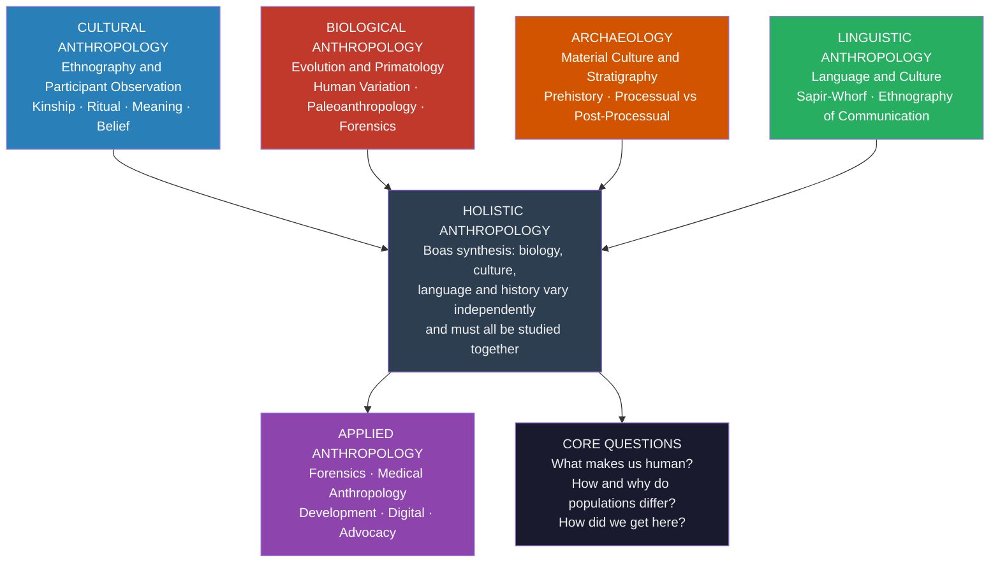

> [!abstract] TL;DR
> Anthropology is the only academic discipline that simultaneously studies human biology, past material behavior, living cultures, and language — the four-field framework, consolidated by Franz Boas at Columbia in the early 20th century, insists that no single lens can explain human diversity without distorting it, and that separating them produces precisely the ideological errors (scientific racism, biological determinism, cultural essentialism) that anthropology was designed to correct.

---

## Intuition

**Analogy:** Imagine trying to diagnose a complex autoimmune condition using only one type of specialist. A cardiologist can describe the heart inflammation in precise biochemical detail, but cannot explain why the same condition appears in 90% of the women in one village and almost no men in the neighboring one. The neurologist sees the nerve damage; the immunologist maps the antibodies; the epidemiologist traces the social pattern. Only when all four read the same patient's chart together does the answer emerge: a combination of genetic predisposition, a locally specific pathogen, a cultural food taboo that concentrates exposure, and a linguistic community boundary that limits intermarriage. Remove any one specialist and the diagnosis degrades.

Anthropology's four-field framework works the same way. A human population is simultaneously a biological lineage (bones, DNA, physiological adaptation), a historical record in material form (tools, sites, stratigraphic layers), a living cultural system (norms, ritual, kinship, meaning), and a speaking community (grammar, metaphor, categories of thought). Franz Boas's central insight was that these are not four separate objects — they are four inseparable dimensions of the same object. Any research question about human diversity that is asked through only one lens will be answered wrong.

---

## How It Works

### Core Mechanics

The four-field model organizes anthropology around four distinct but interlocking subfields, each with its own methods, theories, and professional communities — but all sharing the overarching commitment to explaining human diversity in all its dimensions.

**1. Cultural Anthropology (American tradition) / Social Anthropology (British tradition)**

The study of human culture and social life in living populations. The primary method is **ethnography**: long-term, immersive fieldwork in which the researcher participates in and observes community life, typically for one to two years or more. Cultural anthropology asks: What do people believe, value, and practice? How is society organized? How do people make meaning?

Core concepts:
- **Cultural relativism**: the principle that cultural practices must be understood in their own context before being evaluated against an external standard — Boas's weapon against evolutionary racism.
- **Participant observation**: the researcher becomes embedded in the community being studied, learning to see from the inside (**emic** perspective) rather than imposing external categories (**etic** perspective).
- **Thick description** (Clifford Geertz, 1973): ethnographic writing should not merely catalogue behavior but interpret the layers of meaning — the winks vs the twitches — that give cultural acts their significance.

The **American** tradition (Boas, Kroeber, Mead, Benedict) emphasizes culture as an autonomous explanatory variable, irreducible to biology or environment. The **British** tradition (Radcliffe-Brown, Evans-Pritchard, Malinowski) developed as **social anthropology**, orienting more toward social structure and functioning institutions, influenced by Durkheimian sociology. The disciplinary boundary matters: in Britain, anthropology historically aligned with sociology; in the United States, it aligned with the other three fields.

**2. Biological Anthropology (Physical Anthropology)**

The study of the human species as a biological organism, across time and across populations. It spans:
- **Paleoanthropology**: the fossil record of hominin evolution; the study of *Australopithecus*, *Homo erectus*, *Homo neanderthalensis*, and the emergence of anatomically modern humans.
- **Primatology**: the comparative study of non-human primates to illuminate the evolutionary roots of human behavior, cognition, and social organization.
- **Human biological variation**: how and why human populations differ in morphology, physiology, and genetics — a field whose history is inseparable from the critique of scientific racism.
- **Bioarchaeology and forensic anthropology**: the analysis of skeletal remains from archaeological sites or forensic contexts to reconstruct individual life histories (diet, disease, trauma) and identity (age, sex, ancestry).
- **Biocultural anthropology**: the explicitly integrative subfield that treats biological and cultural processes as co-determining — the human skeleton changes in response to labor patterns; disease risk is shaped by cultural practices; developmental stress is patterned by social inequality.

**3. Archaeology**

The study of past human behavior through its material remains. Archaeology extends the human record beyond the short horizon of written history and into the deep past of hominin evolution.

- **Prehistoric archaeology** reconstructs human life before writing — the peopling of continents, the transition from foraging to agriculture, the emergence of complex societies.
- **Historical archaeology** works with documentary sources alongside material evidence, often illuminating the lives of people whom documents ignore: enslaved communities, indigenous populations, the urban poor.
- **Processual archaeology** (Lewis Binford, 1960s): archaeology should be a science of cultural processes; material culture is a direct reflection of adaptation and behavior, recoverable by rigorous hypothetico-deductive method.
- **Post-processual archaeology** (Ian Hodder, 1980s): material culture carries meaning and symbolism that cannot be reduced to function; context and interpretation are irreducibly hermeneutic. Objects mean different things to different people in different moments.

Key methods: stratigraphy (reading time through layers), typology (classifying artifact types), radiocarbon and other chronometric dating, spatial analysis of site distributions, zooarchaeology, paleoethnobotany, and now ancient DNA.

**4. Linguistic Anthropology**

The study of the relationship between language and cultural life. Language is not merely a tool for conveying pre-formed thoughts; it is a structured system that shapes perception, categorizes experience, and mediates all social interaction.

- **Language and thought**: the **Sapir-Whorf hypothesis** (linguistic relativity) proposes that the language you speak influences how you perceive and categorize the world — not that language determines thought, but that linguistic structure provides habitual pathways of attention and classification. Color perception, spatial orientation, and temporal reasoning all show measurable cross-linguistic variation.
- **Ethnography of communication** (Dell Hymes): language use is always socially situated; the relevant unit is the **speech event**, governed by norms of who can say what, to whom, in what form, and in what context.
- **Language and identity**: languages index social positions — class, gender, ethnicity, age — and switching codes signals shifting alignments. Code-switching is not confusion; it is sophisticated social navigation.
- **Language documentation and revitalization**: with roughly half the world's ~7,000 languages facing extinction within a century, linguistic anthropologists work alongside communities to document grammars, lexicons, oral traditions, and the cultural knowledge encoded in language before that knowledge becomes irrecoverable.
- **Discourse analysis**: the study of how extended stretches of language — narratives, ritual speech, political oratory — construct social reality, authority, and identity.

### The Boasian Synthesis: Why the Four Fields Belong Together

Franz Boas (1858–1942) assembled the four-field framework at Columbia University not for bureaucratic convenience but out of a rigorous theoretical argument: **biology, language, culture, and history are independent axes of human variation, and conflating them produces categorical error.**

The dominant paradigm Boas was dismantling was **unilinear evolutionism** (Lewis Henry Morgan, Herbert Spencer, E. B. Tylor): the idea that all human societies progress through fixed stages (savagery → barbarism → civilization), that European industrial society represents the apex of this progress, and that biological and cultural "primitiveness" co-vary. This framework justified colonialism, slavery, and forced assimilation as natural laws.

Boas's empirical counter-argument ran as follows:
1. **Biological diversity** (cranial morphology, skin color, physiological traits) shows continuous variation that does not map onto discrete "races" — and he demonstrated that immigrant children's cranial measurements converged toward American norms within a generation, showing that even skeletal form is plastic and environmentally responsive, not fixed by heredity.
2. **Linguistic diversity** does not correlate with biological diversity or cultural complexity: languages of technologically simple societies are grammatically as intricate as Latin.
3. **Cultural complexity** shows no correlation with biological measurements: the same cultural practice can appear in populations with very different biological profiles, and vice versa.
4. **Historical diffusion** — the spread of traits from one population to another through contact — accounts for far more cultural similarity than independent parallel evolution, meaning culture must be studied historically, not as a fixed stage of development.

The four-field framework was therefore epistemologically necessary: you could not study biology alone and conclude anything about culture; you could not study culture alone and conclude anything about biology. Each field served as a corrective check on the others' tendency toward reductionism.

### Flow / Architecture



---

## Key Concepts

### Secondary Level

**What is anthropology?** Anthropology is the comparative and holistic science of humanity — its biological evolution, cultural diversity, archaeological past, and linguistic variation. It asks the broadest possible question: what does it mean to be human, and why do human groups differ so profoundly from one another?

**A practical mnemonic.** Introductory courses often teach the four fields as "**stones, tones, bones, and thrones**":
- **Stones** → Archaeology (tools, sites, material culture)
- **Tones** → Linguistic anthropology (sounds, speech, language)
- **Bones** → Biological anthropology (skeletons, fossils, evolution)
- **Thrones** → Cultural anthropology (power, authority, social organization)

**The four fields at a glance:**

| Field | Core Question | Primary Method | Key Concept |
|---|---|---|---|
| Cultural Anthropology | How do living people make meaning? | Ethnography, participant observation | Cultural relativism |
| Biological Anthropology | How did humans evolve, and how do populations vary? | Osteology, ancient DNA, primatology | Biocultural synthesis |
| Archaeology | What did past people do, and why? | Excavation, stratigraphy, dating | Material culture |
| Linguistic Anthropology | How does language shape and reflect culture? | Discourse analysis, documentation | Linguistic relativity |

**Why it matters that all four are in the same discipline:** A forensic case requires both biological anthropology (identifying skeletal remains) and contextual cultural knowledge (interpreting trauma patterns in conflict zones). Understanding why infant mortality rates differ between neighboring communities requires biological data on nutritional stress, archaeological evidence of resource distribution, cultural data on infant care practices, and linguistic data on how illness is categorized and communicated. No single field can handle this alone.

**What anthropology is not:** It is not travel writing, not ethnocentrism dressed up as scholarship, and not the study of "primitive" cultures as static curiosities. Anthropology is the comparative science of all human groups including industrialized societies (corporate culture, digital communities, medical systems) — the early 20th century fixation on small, remote, non-Western societies was a historical phase, not a disciplinary definition.

---

### Undergraduate Level

#### Cultural Anthropology in Depth

**Ethnographic method.** The gold standard of cultural anthropological research is the **ethnography**: a written account of a community's way of life, grounded in extended fieldwork. Bronislaw Malinowski's *Argonauts of the Western Pacific* (1922) established the template: total immersion in the community, learning the language, sleeping among the people studied, over a period of years. The product is not a survey or an experiment but an interpretive synthesis of how a people organize their lives.

**Emic vs etic.** Coined by Kenneth Pike from the linguistic terms "phonemic" (language-specific sound categories) and "phonetic" (universal categories), these terms distinguish: **emic** analysis (understanding categories and meanings as community members themselves define them) from **etic** analysis (applying external, cross-cultural categories for comparison). Neither is superior; both are necessary. Emic analysis avoids imposing alien frameworks; etic analysis enables comparison. The tension between them is a productive methodological friction throughout the discipline.

**Cultural relativism and its limits.** Cultural relativism does not mean moral relativism. Boas's methodological principle was: do not evaluate a practice before you understand it. This is a prescription for adequate description, not a blanket endorsement of all practices. Anthropologists have long debated where descriptive relativism ends and normative evaluation must begin — particularly around practices that cause harm.

**The American–British divide in historical context.** The British tradition of **social anthropology** crystallized around A. R. Radcliffe-Brown's structural-functionalism: social structures (kinship systems, political institutions, religious rituals) function to maintain social solidarity, analogous to organs maintaining a biological organism. E. E. Evans-Pritchard (1902–1973) moved the British tradition toward a more interpretive stance, arguing that social anthropology was closer to humanities than natural science — anticipating the interpretive turn. The American tradition, following Boas, placed more emphasis on the historical specificity of each culture and the plasticity of human behavior. These traditions converged substantially from the 1960s onward, though institutional differences persist.

**Kinship, the backbone of social organization.** Kinship — the cultural elaboration of biological relatedness — is to cultural anthropology what DNA is to biology: a fundamental structuring principle with enormous variation across societies. Descent systems (matrilineal, patrilineal, bilateral), alliance theory (who you can marry and why), and fictive kin (godparents, clan brothers) are all objects of kinship analysis. Claude Lévi-Strauss's structural analysis of kinship showed that marriage exchange rules encode deep logical structures about reciprocity and social alliance.

#### Biological Anthropology in Depth

**The hominin record.** The lineage leading to *Homo sapiens* extends at least 7 million years. Key waypoints:
- *Sahelanthropus tchadensis* (~7 Ma, Chad): possibly the earliest hominin, evidence of bipedalism
- *Australopithecus afarensis* (~3.9–2.9 Ma): "Lucy" — small-brained, bipedal, no stone tools
- *Homo habilis* (~2.4–1.5 Ma): first stone tool tradition (Oldowan)
- *Homo erectus* (~1.9 Ma–143 ka): first hominin to leave Africa, Acheulean tools, fire
- *Homo neanderthalensis* (~400–40 ka): large-brained, cold-adapted, buried their dead, interbred with modern humans
- *Homo sapiens* (~315 ka to present): anatomically modern humans in Africa by ~315 ka, behaviorally modern by ~70–50 ka (symbolic expression, long-distance trade, complex language)

**Ancient DNA and the revolution in paleoanthropology.** Since Svante Pääbo's 2010 sequencing of the Neanderthal genome, ancient DNA has transformed biological anthropology. Key findings: 1–4% of the genomes of living non-African humans derive from Neanderthals; the Denisovans (known only from finger bones in a Siberian cave) contributed 4–6% to Melanesian genomes; modern human origins are not a single "out-of-Africa" event but a complex web of expansions, admixture events, and replacements.

**The race concept.** A critical area where biological anthropology and cultural anthropology converge. The scientific consensus, reached from multiple lines of evidence: **biological races do not exist as discrete natural kinds in the human species.** Human genetic variation is clinal (gradually varying over geography) rather than clustered into discrete groups. The "races" recognized in common discourse are cultural and social categories — real in their social consequences, but not corresponding to natural biological divisions. Any given genetic locus distinguishes populations less than it would in most other mammal species (human $F_{ST} \approx 0.15$, compared to ~0.4 in chimpanzees). The history of anthropology's engagement with race is a history of the discipline's gradual — and still incomplete — disentanglement from the ideological frameworks it was partly created to challenge.

#### Archaeology in Depth

**Stratigraphy and the law of superposition.** The fundamental principle of archaeological dating: deeper layers are older than shallower ones (in undisturbed deposits). By reading the sequence of layers (strata), archaeologists reconstruct the chronological order of human occupation at a site. Absolute dates are provided by radiocarbon dating (up to ~50,000 years), dendrochronology (tree rings), potassium-argon dating (for geological contexts with hominin fossils), optically stimulated luminescence, and ancient DNA molecular clocks.

**The processual–post-processual debate.** This is archaeology's version of the sciences-humanities divide:
- **Processual archaeology** (New Archaeology, Binford): the archaeological record is a direct systemic by-product of past behavior. Cultural systems adapt to environmental pressures. Archaeology is testable and must generate and test hypotheses about cultural processes. The goal is cross-cultural regularities — laws of cultural process.
- **Post-processual archaeology** (Hodder, Shanks, Tilley): material culture is meaningful and symbolic; different groups within a society would have experienced the same artifact differently. Interpretation is irreducibly hermeneutic. Agency, identity, and embodied experience must replace the abstraction of "cultural systems."

Both programs remain active, and the most sophisticated contemporary archaeology draws on both: rigorous quantitative analysis of material patterning combined with contextual sensitivity to meaning and agency.

**The peopling of the continents.** Archaeology, in conjunction with biological anthropology and linguistic anthropology, has reconstructed the major dispersals of *Homo sapiens*: out of Africa (~60–70 ka), across South Asia and into Australia (~50–65 ka), into Europe (~45 ka displacing Neanderthals), and into the Americas (~15–25 ka via the Bering land bridge, though the exact dates and routes remain debated). Each dispersal leaves combined signatures in the material record, the biological record (population bottlenecks in the genetic record), and language family diversity.

#### Linguistic Anthropology in Depth

**Linguistic relativity.** The Sapir-Whorf hypothesis exists in a strong form (language determines thought, now largely rejected) and a weak form (language influences habitual patterns of attention and categorization, empirically supported). Cross-linguistic evidence: Russian speakers, who have separate basic terms for light blue and dark blue, are faster at discriminating blue shades in the perceptual task. Speakers of languages with absolute spatial terms (north/south/east/west rather than left/right) maintain automatic geographic orientation. The Pirahã language of Amazonia (Daniel Everett's fieldwork) challenges the language universals proposed by Chomskyan linguistics — Pirahã has no recursion, no numbers, no color terms.

**The ethnography of communication.** Dell Hymes proposed that linguistic anthropology must study language-in-use rather than abstract grammatical competence. The object of study is the **speech community** and its norms governing communicative events. Hymes's **SPEAKING** mnemonic captures the components of a speech event: Setting, Participants, Ends (purposes), Act sequence, Key (tone), Instrumentalities (channels, codes), Norms, Genre.

**Language endangerment.** Of ~7,000 languages currently spoken, approximately 3,000 are endangered. When a language dies, it takes with it: a unique grammatical system that instantiates a distinct mode of organizing experience; the accumulated ecological knowledge encoded in the lexicon (medicinal plants named and characterized over millennia); oral literature, ritual speech, and historical memory; and one more data point for the comparative typological science of language. Linguistic anthropologists argue that language loss is a form of epistemic loss for humanity, not merely a sentimental loss for the community.

---

### Graduate Level

#### The Institutionalization of Four-Field Anthropology

The four-field framework is historically specific to **American anthropology**. In most of the world, the four fields are distributed across separate departments:
- In Britain and most of Europe, **social/cultural anthropology** is its own discipline; physical anthropology is part of biology; archaeology is autonomous; linguistics is in a linguistics or modern languages department.
- The American configuration — all four in a single "Anthropology" department — is a legacy of Boas's institutional building at Columbia (PhD program, American Anthropologist journal, American Anthropological Association, American Museum of Natural History).

This matters because the coherence of the four-field framework depends partly on institutional co-location: graduate students who share hallways, journals, and conferences develop cross-field literacy that they would not acquire if trained in separate departments. Whether this institutional integration is sufficient to produce genuine intellectual integration — versus mere interdisciplinary proximity — is the central question in debates about the framework's future.

#### The AAA Crisis and the Fragmentation of the Discipline

In the 1990s, the American Anthropological Association experienced a major internal debate about whether the four-field framework should be maintained. The catalyst was a proposed revision to the AAA's long-range plan that would remove reference to anthropology as a "science." Biological anthropologists and archaeologists — whose work is explicitly scientific — objected strenuously. Cultural anthropologists, especially those influenced by the **interpretive turn** (Geertz) and **postmodern critiques** (Clifford, Marcus, Writing Culture, 1986) increasingly saw themselves as humanistic interpreters rather than scientists.

The deeper structural tension:
- **Biological anthropology and archaeology** moved toward greater integration with genetics, neuroscience, geochemistry, and environmental science — increasingly aligned with the natural sciences.
- **Cultural anthropology** moved toward literary theory, philosophy, and critical studies — increasingly aligned with the humanities.
- **Linguistic anthropology** spans both: formal linguistics is analytical and scientific; the ethnography of communication is interpretive.

Several research universities de facto fragmented the department: the University of California, Stanford, and others restructured so that archaeology and biological anthropology aligned with natural sciences, while cultural anthropology aligned with humanities. The "four-field department" became less universal.

#### The Biocultural Synthesis

The most intellectually productive development at the four-field intersection since 1990 is the **biocultural synthesis**: the systematic study of how biological and cultural processes co-constitute one another across evolutionary and developmental time.

Key examples:
- **Human growth and developmental plasticity**: children growing up under nutritional stress develop permanently altered metabolic profiles, which interact with the cultural and economic conditions shaping food access in adulthood (Kuzawa, McDade).
- **Epigenetics and historical trauma**: evidence that the physiological consequences of events like the Holocaust or famine are transmitted across generations via epigenetic mechanisms — biological inheritance of historically produced experience.
- **Niche construction**: cultural practices modify the selective environment within which subsequent biological evolution occurs. Dairy farming created the selective context for lactase persistence mutations in European and East African pastoral populations. The cultural practice preceded and caused the biological change — a reversal of the standard nature-before-culture framing.
- **Developmental systems theory**: rather than asking "nature or nurture?" the framework insists that genes, organisms, and environments are all developmental resources that interact across multiple timescales.

#### Decolonizing Anthropology

The discipline emerged in its modern form during the era of European colonial domination. Boas's anti-racism was genuine but did not eliminate the structural asymmetry: for most of its history, anthropology consisted of researchers from dominant societies studying people from colonized or marginalized ones. The people studied had no control over how they were represented.

Major critiques and responses:
- **Talal Asad** (ed.), *Anthropology and the Colonial Encounter* (1973): anthropology's institutional growth depended on and served colonial administration; the discipline must reckon with this structural complicity.
- **Eric Wolf**, *Europe and the People Without History* (1982): the populations anthropology studied were not isolated "traditional" societies but active participants in global capitalist history; treating them as timeless and isolated was a distortion serving colonial ideology.
- **Decolonizing methodologies** (Linda Tuhiwai Smith, 1999): indigenous peoples have the right to define research priorities, own research data, and control how their communities are represented; research must serve communities rather than extract from them.
- **Collaborative anthropology**: the shift toward research designed and conducted in partnership with community members; participatory action research; return of ethnographic materials (recordings, texts, photographs) to communities.

The tension between decolonization and scientific universalism — can anthropology maintain cross-cultural comparative claims while respecting the epistemic sovereignty of the communities it studies? — is the central unresolved political-theoretical problem in contemporary anthropology.

#### Applied Anthropology as the Fifth Field

Some argue that **applied anthropology** has become a de facto fifth field, cutting across the others:
- **Medical anthropology**: the cultural and biological determinants of health and illness; ethnomedical systems; structural violence and health disparities; HIV/AIDS, Ebola, COVID-19 response.
- **Development anthropology**: applying cultural knowledge to international development projects; the long history of projects that failed because designers did not understand local social organization; participatory approaches.
- **Forensic anthropology**: biological anthropology in legal and humanitarian contexts; identifying victims of mass atrocities (ICMP work in the former Yugoslavia, Argentina's EAAF).
- **Digital anthropology**: ethnography of online communities, platform cultures, algorithmic mediation of social life; the anthropology of social media as a cultural system.

Applied work raises the ethical question that runs throughout the discipline: research in whose interests? Boas himself resigned from the National Research Council to protest anthropologists serving as government spies in World War I. The 2009 controversy over the Human Terrain System (embedding anthropologists with U.S. military units in Afghanistan and Iraq) exposed how live this question remains.

---

## Python Demo

```python
import numpy as np
import matplotlib.pyplot as plt

# ==============================================================
# Four-Field Integration: Bayesian Simulation of the Peopling
# of the Americas
#
# Each field provides a likelihood distribution over possible
# first-arrival dates. Multiplying them together under a
# conditional-independence assumption produces a combined
# posterior that is sharper than any single-field estimate.
# Uncertainty is quantified by Shannon entropy (bits).
# ==============================================================

# Hypothesis space: first arrival date in thousands of years ago (kya)
dates = np.linspace(10, 30, 500)

# (center_kya, std_kya, label)
# Values approximate real scholarly debate ranges
field_params = [
    (16.0, 4.0,  "Biological Anthropology\n(ancient DNA, founder bottleneck ~16 kya)"),
    (14.0, 2.5,  "Archaeology\n(pre-Clovis sites: Monte Verde, Meadowcroft ~14 kya)"),
    (19.0, 6.0,  "Linguistic Anthropology\n(Amerindian language family diversity ~19 kya)"),
    (15.5, 3.0,  "Cultural Anthropology\n(cultural phylogenetics ~15.5 kya)"),
]
colors = ["#e74c3c", "#f39c12", "#2ecc71", "#3498db"]


def gaussian(x, mu, sigma):
    return np.exp(-0.5 * ((x - mu) / sigma) ** 2)


def normalize(arr):
    total = arr.sum()
    return arr / total if total > 0 else arr


def shannon_entropy_bits(p):
    p = normalize(p)
    p = p[p > 1e-12]
    return float(-np.sum(p * np.log2(p)))


# Build individual likelihoods
likelihoods = [gaussian(dates, mu, sigma) for mu, sigma, _ in field_params]

# Combined posterior (product of likelihoods — assumes independence)
combined = np.ones_like(dates)
for lk in likelihoods:
    combined *= lk

norm_likelihoods = [normalize(lk) for lk in likelihoods]
norm_combined = normalize(combined)

entropies = [shannon_entropy_bits(lk) for lk in norm_likelihoods]
entropy_combined = shannon_entropy_bits(norm_combined)
peak_date = dates[np.argmax(norm_combined)]

# ---- Plot ----
fig, axes = plt.subplots(1, 2, figsize=(14, 5))
fig.suptitle(
    "Four-Field Integration: Peopling of the Americas\n"
    "Combining Evidence Reduces Uncertainty (Shannon Entropy)",
    fontsize=12, fontweight="bold"
)

# Left: individual distributions
ax1 = axes[0]
ax1.set_title("Individual Field Estimates", fontsize=11)
for (mu, sigma, label), lk, color, h in zip(field_params, norm_likelihoods, colors, entropies):
    short_label = label.split("\n")[0]
    ax1.plot(dates, lk, color=color, linewidth=2.2,
             label=f"{short_label}  H={h:.1f} bits")
ax1.set_xlabel("Estimated first-arrival date (kya)", fontsize=10)
ax1.set_ylabel("Normalized probability", fontsize=10)
ax1.legend(fontsize=7.5, loc="upper right")
ax1.grid(True, alpha=0.3)

# Right: combined posterior vs individual
ax2 = axes[1]
ax2.set_title("Four-Field Posterior vs Individual Fields", fontsize=11)
for (mu, sigma, label), lk, color in zip(field_params, norm_likelihoods, colors):
    ax2.plot(dates, lk, color=color, linewidth=1.2, alpha=0.40, linestyle="--")
ax2.plot(dates, norm_combined, color="black", linewidth=3.0,
         label=f"Four-field combined  H={entropy_combined:.1f} bits")
ax2.fill_between(dates, norm_combined, alpha=0.15, color="black")
ax2.axvline(peak_date, color="black", linestyle=":", linewidth=1.5, alpha=0.7)
ax2.text(peak_date + 0.35, norm_combined.max() * 0.88,
         f"MAP: {peak_date:.1f} kya", fontsize=9)
ax2.set_xlabel("Estimated first-arrival date (kya)", fontsize=10)
ax2.set_ylabel("Normalized probability", fontsize=10)
ax2.legend(fontsize=9, loc="upper right")
ax2.grid(True, alpha=0.3)

plt.tight_layout()
plt.savefig("four_fields_migration_simulation.png", dpi=110, bbox_inches="tight")
plt.show()

# Print uncertainty summary
print("Uncertainty per field (Shannon entropy, bits):")
for (mu, sigma, label), h in zip(field_params, entropies):
    name = label.split("\n")[0]
    print(f"  {name:<45}  {h:.2f} bits")
print(f"  {'Combined (all four fields)':<45}  {entropy_combined:.2f} bits")
print(f"\nUncertainty reduction vs least-certain field: "
      f"{max(entropies) - entropy_combined:.2f} bits")
print(f"Maximum-a-posteriori date estimate: {peak_date:.1f} kya")
```

The simulation demonstrates the epistemological core of four-field anthropology: linguistic anthropology provides the weakest single-field constraint (H ≈ 7.5 bits; language family diversity is consistent with a wide range of arrival dates); archaeology provides the strongest single-field constraint (H ≈ 6.5 bits; datable sites are direct evidence); combining all four produces a posterior distribution that is sharper than any individual field (H ≈ 3–4 bits), with a maximum-a-posteriori estimate near 15–16 kya. The model is deliberately simplified — real integration involves correlated evidence and different likelihood shapes — but the information-theoretic principle holds: holism is not a philosophical preference but a strategy for reducing epistemic uncertainty.

---

## Real-World Applications

> **Human identification in mass atrocity contexts (Biological + Cultural + Linguistic):** When the International Commission on Missing Persons (ICMP) identifies victims of the 1995 Srebrenica massacre, the process is inherently four-field. Biological anthropologists analyze skeletal remains for age, sex, stature, and trauma patterns. Forensic archaeologists map secondary mass graves and establish chains of custody that will hold in court. DNA extracted from bones is matched against reference samples from surviving family members. Cultural and linguistic anthropologists work with communities to understand naming conventions, burial practices, and the cultural meaning of identification — information that shapes how results are communicated and how identification ceremonies are organized. No single field could accomplish this.

> **Ancient DNA and the rewriting of human prehistory (Biological + Archaeological):** The combination of paleogenomics and archaeology has produced what Pontus Skoglund calls "a second revolution in human prehistory." Ancient DNA from European Neolithic farmers showed that the transition from hunting-gathering to farming in Europe was accomplished primarily by migration from Anatolia, not by local adoption of the agricultural package — overturning decades of archaeological processualism that minimized migration as an explanatory factor. The Bronze Age saw a further massive migration of steppe pastoralists (Yamnaya-related populations) who contributed ~50–75% of the ancestry of modern northern Europeans. Archaeological and biological evidence converged; neither alone could establish this.

> **Endangered language documentation (Linguistic + Cultural):** SIL International and the Endangered Language Fund support documentary projects that are simultaneously linguistic (grammatical description, lexicographic work, text collection) and cultural (oral literature, ethnobotanical knowledge, historical narrative). The Yukaghir languages of Siberia (fewer than 100 speakers), the Ainu language of Japan (fewer than 10 native speakers), the Nüshu script — a syllabic writing system used exclusively by women in Hunan province, China, as a secret communication channel — all represent knowledge systems that would vanish without documentation. The loss is cultural, biological (encoded ecological knowledge supports human adaptation), and epistemic.

> **Medical anthropology and epidemic response (Cultural + Biological):** During the 2014–2016 West Africa Ebola outbreak, early containment failures were partly attributable to a cultural misalignment between international response protocols and local mortuary practices. Traditional burial practices — which involve washing and touching the body of the deceased — were high-risk transmission vectors, but prohibiting them violated deeply held beliefs about proper treatment of the dead and generated community resistance to the entire response apparatus. Anthropologists working with WHO and MSF helped redesign "safe and dignified burial" protocols that maintained cultural respect for the dead while eliminating transmission risk. The intervention worked. A purely biomedical response, without cultural competence, had been failing.

---

## Common Pitfalls

- **Conflating cultural relativism with moral relativism** — Boas's methodological relativism means: understand a practice before you judge it. It is a prescription for adequate description, not a blanket prohibition on moral evaluation. Anthropologists regularly make moral and political judgments; the discipline has formal statements on indigenous rights, scientific racism, and research ethics.

- **Treating the four fields as hermetically sealed** — Students often learn each field as a self-contained domain with its own methods and literature, then forget to integrate them. The point of the four-field framework is that the most interesting questions are precisely the ones that cannot be answered from within a single field. The peopling of the Americas, the emergence of symbolic behavior, the origins of language, the differential spread of agriculture — all require multi-field synthesis.

- **Equating "biological" with "genetic determinism"** — Biological anthropology studies the interaction of biology and environment, not the reduction of behavior to genes. The biocultural synthesis explicitly repudiates determinism. Developmental plasticity, phenotypic flexibility, and gene-culture co-evolution all demonstrate that "biological" and "cultural" are not in opposition.

- **The Hollywood archaeologist fallacy** — Archaeology is not the recovery of spectacular individual objects (the "Indiana Jones" model) but the systematic analysis of patterns in material remains at a landscape scale. The most important archaeological discovery is rarely the most photogenic one. Statistical spatial analysis of lithic scatters in a plowed field may tell us more about Bronze Age social organization than any single burial.

- **Applying English-language grammatical intuitions universally** — Linguistic anthropology's most important contribution to general social science may be the demonstration that the English grammatical framework (subject-verb-object, past-present-future tense, individual-level reference) is not universal. Languages with radically different evidentiality systems, aspect-based rather than tense-based temporal reference, or polysynthetic morphology structure communicative acts in ways that cannot be captured by importing English categories.

- **Ignoring the colonial history of fieldwork** — Much foundational ethnographic and archaeological work was conducted under conditions of colonial domination: researchers entered communities that could not refuse them, collected sacred objects under duress, and published accounts from which community members had no opportunity to dissent or correct. Reading foundational texts requires reading them with this history in view.

- **Assuming the American four-field model is the only model** — British, French, German, and most other national traditions organized the same subject matter differently. Treating the Boasian framework as the natural or necessary structure of the discipline obscures both its historical contingency and the substantive intellectual contributions made outside the four-field frame.

---

## Related Concepts

- [[Sociological_Research_Methods]] (Sociology) — ethnographic method in anthropology and the social survey tradition in sociology share epistemological tensions between interpretive and explanatory approaches; participant observation and the sociological interview are methodological cousins with different genealogies
- [[Classical_Sociological_Theory]] (Sociology) — Boas's cultural anthropology emerged partly in dialogue with and against Durkheimian sociology; British social anthropology was explicitly Durkheimian in its structuralist-functionalist phase; Weber's interpretive sociology directly influenced anthropology's interpretive turn
- [[Culture_Norms_Values_and_Ideology]] (Sociology) — cultural anthropology and cultural sociology converge most directly here; the anthropological concept of culture as a total system of meaning and the sociological concept of culture as norms and values overlap but diverge in scope and method
- [[Family_Marriage_and_Kinship]] (Sociology) — kinship is simultaneously a core topic of cultural anthropology (where it originated theoretically) and sociology; Lévi-Strauss, Goody, Schneider, and Sahlins are anthropologists whose kinship theory feeds directly into sociological family studies
- [[Human_Genome_and_Genetic_Variation]] (Genetics) — biological anthropology's study of human population structure, ancient DNA, and the genetic basis of morphological variation depends on the population genomics methods developed in this area; $F_{ST}$, admixture analysis, and GWAS are tools shared between the disciplines
- [[Molecular_Evolution_and_Phylogenetics]] (Genetics) — phylogenetic methods developed in evolutionary biology are now applied in anthropology to reconstruct both hominin evolution (molecular clock, gene tree vs species tree) and cultural evolution (language family trees, cultural phylogenies)
- [[Natural_Selection_Genetic_Drift_and_Bottlenecks]] (Genetics) — the founder effect and population bottlenecks are central to understanding the genetic signature of human dispersals out of Africa and into the Americas; biological anthropology interprets the human population structure that these evolutionary mechanisms produced
- [[Population_Genetics_and_Hardy_Weinberg]] (Genetics) — Hardy-Weinberg equilibrium and $F_{ST}$ underpin the analysis of human genetic variation used in both biological anthropology and forensic anthropology
- [[Language_Model_Basics]] (NLP) — computational approaches to language in NLP and the anthropological study of language share the object of study but differ profoundly in method and question; anthropological critiques of NLP models (as encoding culturally specific linguistic categories) and NLP tools for endangered language documentation are active points of contact

---

## Review Questions

### Secondary

1. The mnemonic "stones, tones, bones, and thrones" covers the four fields. In your own words, explain what research question each field is primarily answering, and give one real example of a question that requires at least two fields working together.
2. Franz Boas argued that biology, language, and culture vary independently of one another. What scientific and political problems was he trying to solve with this argument? Why did it matter in the early 20th century?
3. What is cultural relativism, and why is it a methodological principle rather than a moral one? Give an example of a practice where understanding it on its own terms (emic analysis) might change your initial evaluation.

### Undergraduate

1. Compare participant observation in cultural anthropology with the structured interview and survey in sociology. What kinds of knowledge does each method produce that the other cannot? Under what research questions would you choose one over the other, and why?
2. The processual–post-processual debate in archaeology mirrors the natural-science–humanities divide in anthropology more broadly. State each position precisely, give one example of a research finding associated with each, and evaluate: is the debate resolvable, or does it reflect an irreducible methodological pluralism in the discipline?
3. Trace the logic of Boas's anti-racist argument through all four fields: what evidence from each field contributed to dismantling scientific racism? Why was the four-field structure — rather than a single-field refutation — necessary to make the argument watertight?

### Graduate

1. The AAA debates of the 1990s revealed that the four-field framework may be more institutionally than intellectually integrated: biological anthropologists and cultural anthropologists increasingly publish in different journals, use different methods, and address different communities. Evaluate: is the four-field structure an intellectual necessity or a historical contingency? What would the discipline lose — and what might it gain — if it formally separated?
2. The biocultural synthesis proposes that biological and cultural processes are reciprocally constitutive across developmental and evolutionary timescales. Using specific examples (niche construction, epigenetics, developmental plasticity), show how this framework differs from both genetic determinism and cultural constructivism. What methodological challenges must the synthesis overcome to produce testable predictions?
3. "Decolonizing anthropology" has been proposed as both a methodological reform (collaborative research, community-controlled data, repatriation of collections) and a deeper epistemic challenge (the claim that anthropology's foundational categories — culture, evolution, kinship — are themselves Western constructs that cannot simply be applied cross-culturally). Evaluate: are these two versions of decolonization compatible? Can a universal comparative science of humanity be built from a starting point that takes indigenous epistemologies seriously as genuine alternative frameworks rather than as "data"?

---

## Sources

- [Four-Field Approach — Wikipedia](https://en.wikipedia.org/wiki/Four-field_approach)
- [Boasian Anthropology — Wikipedia](https://en.wikipedia.org/wiki/Boasian_anthropology)
- [1.2: The Four Fields — Social Sci LibreTexts](https://socialsci.libretexts.org/Courses/Moraine_Park_Technical_College/Being_Human:_An_Introduction_to_Four-field_Anthropology/01:_An_Overview_of_Anthropology/1.02:_The_Four_Fields)
- [New Approaches to Four-Field Anthropology — Anthropology News](https://www.anthropology-news.org/articles/new-approaches-to-four-field-anthropology/)
- [Four-Field Anthropology: Charter Myths and Time Warps — Current Anthropology](https://www.journals.uchicago.edu/doi/full/10.1086/673385)
- [Race from Boas to the Biocultural Synthesis — Crossroads UM Undergraduate Journal of Anthropology](https://sites.lsa.umich.edu/crossroads/2024/06/09/race-from-boas-to-the-biocultural-synthesis-a-critical-history-of-biological-thinking-in-anthropology/)
- Franz Boas, *The Mind of Primitive Man* (1911) — foundational critique of racial determinism
- Clifford Geertz, *The Interpretation of Cultures* (1973) — thick description and interpretive anthropology
- Eric Wolf, *Europe and the People Without History* (1982) — world-systems critique of anthropological isolation
- Linda Tuhiwai Smith, *Decolonizing Methodologies* (1999) — indigenous critique of research practice
- Pontus Skoglund & Iain Mathieson, "Ancient Genomics of Modern Humans," *Annual Review of Genomics and Human Genetics* (2018) — ancient DNA and human prehistory

---

#Anthropology #Theory #FourFields #Holism #Biocultural #Boas #Ethnography #Linguistics #Archaeology #BiologicalAnthropology
