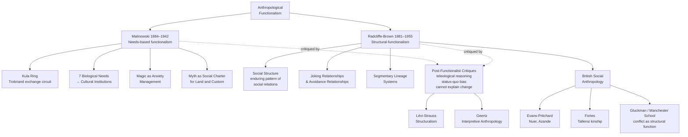

# Functionalism and Structural-Functionalism in Anthropology

> [!abstract] TL;DR
> Functionalism asks not *what a custom means* but *what it does*. Malinowski showed through Trobriand fieldwork that every institution — even the seemingly irrational Kula ring exchange of shell valuables — satisfies identifiable human needs; Radcliffe-Brown hardened this into structural-functionalism, arguing that social institutions are best explained by their contribution to maintaining a coherent social structure; together they built the first systematic, fieldwork-grounded paradigm in British social anthropology, and together they bequeathed its central weakness: a framework so preoccupied with equilibrium that it could barely explain conflict, change, or the suffering of colonised peoples.

---

## Intuition

**Analogy:** Imagine an engine mechanic who has never seen a car manual. Rather than guess at the history of each part, she asks one diagnostic question about every component: *what job does this part do, and what breaks if it stops doing it?* She knows the carburetor aerates fuel, the cooling system prevents overheating, and even the apparently decorative hood ornament has an aerodynamic function. Every part earns its place by its contribution to the whole engine running.

Malinowski arrived in the Trobriand Islands during World War I and applied exactly this diagnostic logic to culture. The ceremonial exchange of worthless armshells and necklaces, the elaborate magical spells before dangerous deep-sea fishing, the mythic stories that explained land ownership — none of these were superstitions or survivals from a primitive past. Each was a working part of a social engine, solving a specific problem that Trobriand society faced. Remove any one, and something essential would break.

Radcliffe-Brown agreed with the question but narrowed the answer: the relevant "whole" is not the biological organism of human needs but the *social structure* — the pattern of enduring relationships between people and groups. Function is whatever keeps that structure intact. Where Malinowski was a humanist asking about lived experience, Radcliffe-Brown was a social anatomist mapping the skeleton.

---

## How It Works



---

## Key Concepts

### Secondary Level

**Malinowski and the Fieldwork Revolution**

Before Malinowski (1884–1942), anthropological data was gathered by colonial administrators, missionaries, and travellers who observed from outside, often briefly, and filtered everything through evolutionary assumptions: "primitive" peoples were at an earlier stage of civilisation, their customs childish survivals soon to be superseded. Malinowski changed the method. Stranded in the Trobriand Islands of Melanesia during WWI (1914–1918), he learned the language, lived among the islanders, and participated in daily life for nearly four years. His 1922 *Argonauts of the Western Pacific* inaugurated sustained participant observation as the defining method of modern anthropology.

The Trobriand Islands — a coral archipelago off New Guinea — had a population of perhaps 8,000 people distributed across around twenty islands. They were skilled sailors, horticulturalists, and traders connected across hundreds of miles of open ocean by a ceremonial exchange network Malinowski called the **Kula ring**.

---

**The Kula Ring: Ritual Exchange and Social Connectivity**

The Kula ring is a circuit of reciprocal prestige exchange involving two types of valuables travelling in opposite directions around a ring of islands:

| Valuable | Type | Direction | Description |
|----------|------|-----------|-------------|
| *Mwali* | Arm-shells | Counter-clockwise | Polished white shell bracelets |
| *Soulava* | Necklaces | Clockwise | Long strings of red shell discs |

The rules are strict: a mwali given by island A to island B must eventually be balanced by a soulava of equivalent prestige travelling in the opposite direction. No one permanently owns a Kula valuable — it must be passed on within a reasonable time. Hoarding breaks the exchange partnership and destroys one's reputation.

The *apparent* puzzle: why do people risk dangerous ocean crossings to give away valuables they cannot keep? Malinowski's answer — revolutionary in 1922 — was that the economic irrationality was the point. The Kula was not primarily about objects; it was primarily about *relationships*. Each exchange created an enduring social partnership between giver and receiver — an obligation of hospitality, safe passage, and alliance. The valuables were the medium through which long-range social ties across otherwise separate island communities were continuously recreated and renewed.

A stone tool or a basket could be traded locally. The Kula's genius was to create a mechanism that *required* inter-island contact and *rewarded* it with prestige, thereby weaving together a social network spanning hundreds of miles of open sea. The Python demo below models how dramatically the Kula exchange reduces social distance between communities.

---

**Malinowski's Needs Theory: Why Culture Exists**

Malinowski developed what he called a "scientific theory of culture" built on a simple premise: all cultural institutions can ultimately be traced to basic human needs that they satisfy. He identified seven biological needs and the cultural responses they generate:

| Biological Need | Cultural Response |
|----------------|-------------------|
| Nutrition | Food production, cooking, food taboos |
| Reproduction | Kinship systems, marriage rules, family |
| Bodily comforts | Shelter, clothing, domestic arrangements |
| Safety | Weapons, political organisation, law |
| Movement | Trade networks, transportation, Kula |
| Growth | Education, apprenticeship, initiation |
| Health | Magic, medicine, hygiene practices |

Satisfying biological needs generates new, *derived* needs — coordinating labour requires economic institutions; coordinating people requires political institutions; managing anxiety requires magic and religion. These derived cultural responses generate yet another level: **integrative needs** — myth, ritual, law, and aesthetics — that hold the whole cultural system together.

The key claim: no cultural institution is arbitrary or irrational. Every custom, however strange to an outsider, performs a function that can in principle be identified by systematic fieldwork. Lévy-Bruhl's claim that "primitive" peoples had a qualitatively different "pre-logical" mentality was, for Malinowski, simply wrong: the Trobrianders were fully rational, solving real problems with real tools. Their tools happened to be magical rather than chemical.

---

**Magic as Anxiety Management, Not Ignorance**

Malinowski's most elegant demonstration of needs theory was his account of Trobriand fishing magic. He noticed a striking pattern:

- Fishing in the **calm inner lagoon**: no magic.
- Fishing in the **dangerous open ocean**: elaborate magical preparation before every voyage.

The conventional evolutionary explanation was that magic was simply ignorance — a failed proto-science. Malinowski rejected this completely. The Trobrianders knew perfectly well how to fish; their technical knowledge was sophisticated and accurate. What the open ocean introduced, and the lagoon did not, was *genuine uncontrollable risk*: sudden storms, unpredictable currents, the possibility of death. Magic was not a failed alternative to knowledge — it was a psychological mechanism for managing anxiety in the face of irreducible uncertainty, restoring the confidence needed to act.

The same logic applies to agricultural magic: elaborate spells accompany the planting of yams (the prestige crop, subject to unpredictable blight and drought) but not the harvesting of taro (reliable, low-prestige, no magic). Magic appears exactly where skill is insufficient to guarantee outcomes and anxiety threatens paralysis. This anticipates by thirty years what social psychologists would call *perceived locus of control* — and gives it a social rather than purely individual explanation.

---

**Myth as Social Charter**

Malinowski rejected both the "nature myth" school (myths are primitive meteorology — thunder is Thor) and the rationalist school (myths are false cosmologies). Myths, he argued, are not explanatory at all; they are **normative charters** for existing institutions.

A Trobriand myth about the original ancestors who first cultivated a particular garden did not explain how gardening works; it legitimised *who has the right to cultivate which garden today*. Myth narrates a past that makes the present arrangement seem natural, necessary, and permanent. It is not history — it is the projection of the present backwards to make existing social arrangements seem cosmically ordained. Land disputes, succession rules, and ritual privileges were all backed by specific myths that functioned as title deeds in a largely non-literate society.

---

### Undergraduate Level

**Radcliffe-Brown's Structural-Functionalism: Refining the Question**

A.R. Radcliffe-Brown (1881–1955) agreed with Malinowski that anthropology should ask functional questions but found Malinowski's needs theory unsatisfactory for two reasons:

1. **Biologism**: grounding cultural explanation in biological needs reduces anthropology to biology. If culture merely satisfies biological needs, then cultures differing only in their institutions should be expected to be functionally equivalent — but they clearly are not. What matters is the *social* structure, not the biological baseline.

2. **Lack of comparability**: Malinowski's method produced extraordinarily rich accounts of single societies, but they were too culturally specific to generate general laws. Radcliffe-Brown wanted a comparative, nomothetic social science — a natural science of society, following Durkheim strictly.

Radcliffe-Brown drew a precise distinction between two levels of analysis:

| Concept | Definition | Level |
|---------|-----------|-------|
| **Social structure** | The enduring pattern of social relations between persons and groups — kinship systems, political organisation, ritual roles | Synchronic (a snapshot in time) |
| **Social function** | The contribution a social institution makes to maintaining the social structure | Analytical question |
| **Social process** | The ongoing activities through which structure is maintained or changed | Diachronic |

A ritual, a marriage rule, or a joking relationship should be explained not by its biological utility but by asking: what does it do for the integration and persistence of the social structure? This is explicitly a Durkheimian move — Radcliffe-Brown called himself a "Durkheimian" and sought to operationalise Durkheim's concept of social solidarity through comparative fieldwork.

---

**Joking Relationships and Avoidance Relationships**

One of Radcliffe-Brown's most productive analyses concerned the ubiquity across many societies of two structurally opposed relationship types:

**Joking relationships** — between specific kin categories (cross-cousins, grandparent-grandchild), joking is not only permitted but obligatory. Crude humour, mock insults, playful theft, sexual teasing — all are allowed and expected. To refuse to joke would be socially inappropriate.

**Avoidance relationships** — between other kin categories (typically affinal kin: mother-in-law / son-in-law, father-in-law / daughter-in-law), elaborate avoidance is required. They may not look each other in the face, may not be alone together, must not speak each other's name.

Radcliffe-Brown's structural-functional explanation: these two relationship types are not arbitrary customs but structural solutions to a specific social problem — managing *social distance* in kinship systems. Between persons whose structural relationship creates *ambiguity* or *potential conflict* (e.g., cross-cousins, who can be both potential spouse and potential rival), ritual joking creates a regulated channel for tension. Between persons where the relationship is critically important but loaded with structural stress (in-law relationships, where two kin groups are bound together by marriage but remain structurally distinct), avoidance enforces mutual respect and prevents the intimacy that might destabilise the alliance.

The function is not biological; it is structural. Both relationship types solve the problem of maintaining social solidarity at precisely the joints where the social structure is most vulnerable to fracture.

---

**Segmentary Lineage Systems and the Comparative Method**

Radcliffe-Brown's programme was comparative: the same functional analysis should apply across societies, revealing cross-culturally general structural principles. His most successful heir in this was E.E. Evans-Pritchard's analysis of the Nuer (Sudan) and Meyer Fortes's analysis of the Tallensi (Ghana), both published in the 1940s.

The **segmentary lineage system** is a principle of social organisation in which groups are nested: the smallest unit is the household, which is embedded in a lineage segment, which is embedded in a larger lineage, which is embedded in a clan, which is embedded in the tribe. Crucially, conflict and alliance follow the nesting: against an outsider, a lineage segment unites; against a neighbouring segment, lineage-mates become rivals; against a more distant enemy, those same rivals unite at the lineage level; and so on.

Evans-Pritchard described this with a formula now famous in anthropology: "I am against my brother, my brother and I are against my cousin, my cousin and I are against the stranger." The structural function of the segmentary system is to provide both a principle of political organisation (who unites with whom, when) and a mechanism for dispute resolution (feuds escalate to the appropriate nested level and are then mediated). In acephalous societies — those without chiefs or formal government — the segmentary lineage system performs the function that the state performs elsewhere.

This is Radcliffe-Brown's programme working at its best: a structural feature (nested lineage segments) + a functional analysis (political integration without centralised authority) = a cross-cultural generalisation applicable to the Nuer, the Tallensi, the Tiv, the Somali, and dozens of other societies.

---

**Lévy-Bruhl and the Pre-Logical Mentality Debate**

Lucien Lévy-Bruhl (1857–1939) had argued in *Les fonctions mentales dans les sociétés inférieures* (1910) that "primitive" peoples operated by a qualitatively different, "pre-logical" mode of thought: they violated the law of non-contradiction, believed in mystical participation between persons and objects, and could not distinguish self from other. This was not ignorance but a fundamentally different mental structure.

Both Malinowski and Boas rejected this strongly, but from different angles:

- **Malinowski**: empirical refutation. The Trobrianders had sophisticated, accurate technical knowledge and deployed it rationally. Their magic did not contradict their knowledge; it operated in a different domain (uncontrollable risk vs controllable technique). There is no pre-logical mentality — only a pre-functionalist observer who did not ask the right questions.

- **Boas**: historical-particularist refutation. Lévy-Bruhl had generalised wildly from selective ethnographic reports. Different societies have different ideas, not different cognitive structures. The appearance of "mystical" reasoning often reflects translation failure or observer bias.

The Lévy-Bruhl debate is significant because it marks a methodological watershed: both functionalist schools insisted that anthropology must begin with the *internal* logic of a culture before comparing it externally, and both rejected the evolutionary ranking of mentalities that had dominated Victorian anthropology.

---

### Graduate Level

**The Manchester School: Gluckman and Conflict as Functional**

Max Gluckman (1911–1975) at Manchester pushed structural-functionalism into territory Radcliffe-Brown had avoided: social conflict. Where Radcliffe-Brown tended to analyse conflict as a pathology threatening social structure, Gluckman argued that *ritualised* conflict was itself a structural mechanism for social integration.

His analysis of "rituals of rebellion" in Southern African kingdoms is the central case. In Swazi and Zulu ceremonies, commoners were permitted — indeed required — to perform elaborate rituals that symbolically enacted rebellion against the king: insults, mock assaults, inversion of normal hierarchy. Gluckman's structural-functional reading: these rituals *defused* real rebellion by providing a periodic, controlled outlet for accumulated social tensions. Far from threatening the social structure, ritual rebellion reinforced it by channelling discontent into symbolic form, then re-asserting the normal order at the ritual's close.

This is a sophisticated version of Merton's concept of latent function: the manifest content of the ritual is its symbolic drama; its latent function is political stabilisation. The Gluckman analysis generated the **Manchester School** approach to social process and conflict — studying social situations in which different structural principles come into tension (tribe vs state, kinship obligation vs market interest), and tracing how the social structure absorbs and channels these tensions without dissolving.

The Manchester School's key methodological innovation was the **extended case method**: rather than describing abstract structural principles, anthropologists followed specific people through specific situations over time, tracing how structural principles were actually enacted, negotiated, and sometimes violated.

---

**Evans-Pritchard's Epistemological Break**

E.E. Evans-Pritchard (1902–1973) began as an orthodox structural-functionalist but ended as its most important internal critic. His 1940 *The Nuer* is a masterwork of structural-functional analysis. But his 1937 *Witchcraft, Oracles and Magic Among the Azande* had already introduced a tension the framework could not resolve.

The Azande believed that misfortunes were caused by witchcraft — a substance (mangu) in certain people's bodies that harmed others through mystical means. Evans-Pritchard showed that this belief was internally coherent: the Azande distinguished witchcraft (unconscious, inherited) from sorcery (deliberate, learned), and their oracle system (the poison oracle) was logically rigorous given its premises. Asked whether Lévy-Bruhl was right that this was "pre-logical," Evans-Pritchard said no — the system was internally consistent. Asked whether the beliefs were *true*, he said of course not.

This exposed a deeper problem: structural-functionalism explained *why a belief persists* (it integrates the social group, provides explanations for misfortune, and distributes blame in ways that manage social tensions) without being able to say whether the belief was *correct*. By the time Evans-Pritchard published *Social Anthropology and Other Essays* (1962), he had turned toward *humanistic* interpretation rather than natural-science explanation. Social anthropology, he now argued, was a branch of the humanities, not the social sciences: its task was *understanding* (Verstehen) — making other cultures intelligible — not *explaining* them by causal-functional laws.

This was a decisive break with the Radcliffe-Brownian programme, and it opened the door for symbolic anthropology (Turner's liminality and communitas; Geertz's "thick description") and structuralism (Lévi-Strauss's deep structural analysis of myth) as successor frameworks.

---

**Neo-Functionalism and Parsons' Connection**

Talcott Parsons (1902–1979) was strongly influenced by both Malinowski and Radcliffe-Brown, and his AGIL schema (Adaptation, Goal-Attainment, Integration, Latency) can be read as the sociological formalisation of anthropological structural-functionalism applied to industrial societies. The anthropological influence is direct: Parsons studied with Malinowski, and his concept of the Latency (pattern-maintenance) function maps closely onto Malinowski's integrative needs — the cultural and symbolic mechanisms (ritual, myth, family socialisation) that reproduce the values and motivations that keep the whole system running.

However, the neo-functionalist synthesis deepens three critiques that anthropological functionalism had generated internally:

| Critique | Source | Substance |
|----------|--------|-----------|
| **Teleological reasoning** | Hempel (1959) | Explaining why X exists by its consequence Y is backwards causation; Merton's separation of historical cause from functional consequence partially resolves this |
| **Status quo bias** | Leach (1954), Dahrendorf (1959) | Any framework built around equilibrium-maintenance will naturalise existing arrangements; colonialism's social structures had manifest "functions" for the colonial system |
| **Inability to explain change** | Dahrendorf, Coser | Functionalism sees change as *adaptation* (returning to equilibrium); it cannot account for the structural contradictions that generate revolutionary rupture |

Edmund Leach's *Political Systems of Highland Burma* (1954) is the most devastating empirical critique from within the functionalist tradition: Leach showed that in the Kachin Hills, social groups oscillated over generations between two structural types (egalitarian gumlao and hierarchical gumsa), driven by political competition and ecological pressures that Radcliffe-Brown's framework had no resources to analyse. Structures are not stable equilibria; they are temporary settlements in ongoing struggles.

---

**Legacy: What Functionalism Got Right and Wrong**

What survived the critiques:

1. **Holism** — the insistence that cultural practices must be understood in their systemic context, not atomised and ranked on a universal evolutionary scale. This is now simply good anthropological practice.

2. **Participant observation** — Malinowski's fieldwork method is still the discipline's defining methodological commitment. Everything that came after is built on this foundation.

3. **The functional question as a heuristic** — asking "what does this institution do?" is still productive, even if the answer is no longer assumed to be "it maintains equilibrium."

What was abandoned:

1. The assumption that every institution has a *positive* function for the whole society — Merton's critique of functional unity and indispensability.

2. The assumption that societies tend toward equilibrium — replaced by models that make conflict and change central.

3. The assumption that social structure is the appropriate unit of analysis for all questions — replaced by attention to individual agency, historical process, symbolic meaning, and power.

---

## Python Demo

```python
"""
Kula Ring Exchange Network — Malinowski's Trobriand Islands

N islands arranged on a circular archipelago.

Geographic baseline: each island connected only to its two immediate neighbours.

Kula layer: two counter-rotating circuits of prestige valuables
  - mwali (arm-shells)  travel COUNTER-CLOCKWISE
  - soulava (necklaces) travel CLOCKWISE

Each exchange creates a lasting social partnership between giver and receiver.
With kula_reach = k, a valuable travels up to k hops before being passed on,
so each island acquires direct social partnerships with islands up to k steps
away in each direction.

Measures how the Kula transforms the social network:
  - Average shortest path length (social distance)
  - Clustering coefficient (local network density)
"""

import numpy as np
import matplotlib.pyplot as plt
import matplotlib.patches as mpatches

N = 12           # number of Kula ring islands
KULA_REACH = 4  # how many hops a valuable travels before being passed on

angles = np.linspace(0, 2 * np.pi, N, endpoint=False)
pos = np.column_stack([np.cos(angles), np.sin(angles)])


def ring_network(n):
    """Pure geographic ring: each island connected to immediate neighbours only."""
    adj = np.zeros((n, n), dtype=int)
    for i in range(n):
        adj[i, (i + 1) % n] = 1
        adj[(i + 1) % n, i] = 1
    return adj


def kula_network(n, reach):
    """
    Augment geographic ring with Kula partnerships.
    mwali  travel counterclockwise: island i partners with (i-2)%n ... (i-reach)%n
    soulava travel clockwise:       island i partners with (i+2)%n ... (i+reach)%n
    Step 1 is already covered by the geographic ring.
    """
    adj = ring_network(n)
    for i in range(n):
        for step in range(2, reach + 1):
            cw  = (i + step) % n   # soulava partner (clockwise)
            ccw = (i - step) % n   # mwali partner (counter-clockwise)
            adj[i, cw]  = adj[cw,  i] = 1
            adj[i, ccw] = adj[ccw, i] = 1
    return adj


def bfs_distances(adj, src):
    """Return array of shortest-path distances from src via BFS."""
    n = len(adj)
    dist = np.full(n, -1)
    dist[src] = 0
    queue = [src]
    qi = 0
    while qi < len(queue):
        u = queue[qi]
        qi += 1
        for v in range(n):
            if adj[u, v] and dist[v] == -1:
                dist[v] = dist[u] + 1
                queue.append(v)
    return dist


def avg_path_length(adj):
    """Average shortest-path length across all ordered pairs."""
    n = len(adj)
    total = 0
    for i in range(n):
        d = bfs_distances(adj, i)
        total += d[d > 0].sum()
    return total / (n * (n - 1))


def clustering_coefficient(adj):
    """Mean local clustering coefficient."""
    n = len(adj)
    coeffs = []
    for i in range(n):
        nbrs = [j for j in range(n) if adj[i, j]]
        k = len(nbrs)
        if k < 2:
            coeffs.append(0.0)
            continue
        links = sum(adj[u, v] for u in nbrs for v in nbrs if u < v)
        coeffs.append(2 * links / (k * (k - 1)))
    return float(np.mean(coeffs))


geo  = ring_network(N)
kula = kula_network(N, KULA_REACH)

geo_apl   = avg_path_length(geo)
kula_apl  = avg_path_length(kula)
geo_cc    = clustering_coefficient(geo)
kula_cc   = clustering_coefficient(kula)

# ── Visualisation ──────────────────────────────────────────────────────────────
fig, axes = plt.subplots(1, 2, figsize=(13, 6.5))

for ax, adj, title, is_kula in [
    (axes[0], geo,
     "Geographic Network Only\n(immediate-neighbour ties)", False),
    (axes[1], kula,
     f"Kula Ring Augmented Network\n"
     f"mwali (arm-shells) ↺  ·  soulava (necklaces) ↻  ·  reach = {KULA_REACH}",
     True),
]:
    ax.set_aspect("equal")
    ax.set_xlim(-1.65, 1.65)
    ax.set_ylim(-1.65, 1.65)
    ax.axis("off")

    # Draw edges
    drawn = set()
    for i in range(N):
        for j in range(N):
            if adj[i, j] and (j, i) not in drawn:
                drawn.add((i, j))
                is_geo_edge = bool(geo[i, j])
                ax.plot(
                    [pos[i, 0], pos[j, 0]], [pos[i, 1], pos[j, 1]],
                    color="#7f8c8d" if is_geo_edge else "#e67e22",
                    lw=2.2 if is_geo_edge else 0.9,
                    alpha=0.85 if is_geo_edge else 0.40,
                    zorder=1,
                )

    # Draw mwali circuit arrows (counter-clockwise) on the Kula panel only
    if is_kula:
        for i in range(N):
            j = (i - 1) % N
            ax.annotate(
                "",
                xy=pos[j] * 0.80, xytext=pos[i] * 0.80,
                arrowprops=dict(
                    arrowstyle="-|>", color="#2980b9", lw=1.5, mutation_scale=11
                ),
                zorder=4,
            )

    # Draw nodes
    ax.scatter(pos[:, 0], pos[:, 1], s=300, c="#2c3e50", zorder=5)
    for i in range(N):
        ax.text(
            pos[i, 0] * 1.28, pos[i, 1] * 1.28, f"I{i}",
            ha="center", va="center", fontsize=8.5,
            fontweight="bold", color="#2c3e50",
        )

    apl = kula_apl if is_kula else geo_apl
    cc  = kula_cc  if is_kula else geo_cc
    reduction_str = (
        f"  ({100 * (1 - kula_apl / geo_apl):.0f}% reduction vs geographic)"
        if is_kula else ""
    )
    ax.set_title(title, fontsize=10, fontweight="bold", pad=8)
    ax.text(
        0, -1.56,
        f"Avg path length: {apl:.2f} hops{reduction_str}\n"
        f"Clustering coefficient: {cc:.3f}",
        ha="center", va="center", fontsize=8.8,
        bbox=dict(boxstyle="round", facecolor="lightyellow", alpha=0.92),
    )

leg_handles = [
    mpatches.Patch(color="#7f8c8d", label="Geographic ties (immediate neighbour)"),
    mpatches.Patch(color="#e67e22", label="Kula partnership ties (mwali & soulava)"),
    mpatches.Patch(color="#2980b9", label="Mwali circuit direction (counter-clockwise)"),
]
fig.legend(
    handles=leg_handles, loc="lower center", ncol=3,
    fontsize=8.5, framealpha=0.9, bbox_to_anchor=(0.5, 0.01),
)

fig.suptitle(
    f"Malinowski's Kula Ring — Ritual Exchange and Long-Range Social Connectivity\n"
    f"N = {N} islands  ·  kula_reach = {KULA_REACH}  ·  "
    f"Geographic avg path: {geo_apl:.2f}  →  Kula avg path: {kula_apl:.2f}",
    fontsize=11, fontweight="bold",
)
plt.tight_layout(rect=[0, 0.07, 1, 1])
plt.savefig("kula_ring_network.png", dpi=150, bbox_inches="tight")
plt.show()

print(f"\n{'Network':<30} {'Avg Path Length':>18} {'Clustering Coeff':>18}")
print("-" * 68)
print(f"{'Geographic (ring only)':<30} {geo_apl:>18.4f} {geo_cc:>18.4f}")
print(f"{'Kula-augmented':<30} {kula_apl:>18.4f} {kula_cc:>18.4f}")
print(f"\nPath reduction: {100 * (1 - kula_apl / geo_apl):.1f}%  |  "
      f"Clustering increase: {100 * (kula_cc / geo_cc - 1):.1f}%")
```

**Reading the output (N = 12, kula_reach = 4):**

- *Left panel* (geographic ring): the only connections are to immediate neighbours. Average path length across all island pairs is approximately 3.27 hops. To reach an island on the opposite side of the archipelago requires passing through six intermediaries. Communities more than two islands apart have no direct social relationship.

- *Right panel* (Kula-augmented): each island now has direct exchange partnerships with islands up to four steps away in each direction — eight direct partners plus two geographic neighbours. Average path length collapses to approximately 1.45 hops, a reduction of over 55%. Every island is reachable from any other in at most two exchange steps.

This is the core structural insight Malinowski articulated in prose: the Kula ring does not primarily move valuables — it primarily *shrinks the social world*. Long-range alliances, information flows, and mutual obligation networks that would take generations to build through geographic proximity alone are created and maintained by the annual ceremonial voyages. The clustering coefficient also rises dramatically, indicating that Kula partners of Kula partners are themselves linked — the exchange system creates tight local clusters embedded in a densely connected global ring.

---

## Real-World Applications

**Global Trade Networks as Structural Kula Rings**

The Kula ring's key insight — that prestige exchange generates social infrastructure that enables ordinary trade — maps directly onto modern financial and diplomatic institutions. The SWIFT global payment network does not primarily move money; it primarily maintains the trust relationships between correspondent banks that allow international payments to flow at all. Without the underlying "Kula ring" of bilateral correspondent agreements, the technical infrastructure would be useless. The 2022 exclusion of Russian banks from SWIFT was effective precisely because it severed the trust partnerships, not just the technical connections — a structural-functional analysis in real time.

---

**Joking Relationships in Corporate Culture**

Radcliffe-Brown's analysis of joking relationships has a direct parallel in organisational behaviour. Research on high-performing teams consistently finds that "psychological safety" — the ability to tease, challenge, and mock with impunity — characterises teams at the creative frontier (Google's Project Aristotle, 2016). The structural interpretation: in teams where roles are ambiguous and hierarchy is potentially destabilising, regulated informality (joking) performs the same function as Radcliffe-Brown's cross-cousin teasing — it acknowledges structural tension while defusing its threat to collective work. Companies that suppress joking cultures in favour of rigid professional hierarchy show the same pattern Radcliffe-Brown predicted: suppressed tension erupts as dysfunction rather than flowing harmlessly through ritual channels.

---

**Segmentary Identity in Modern Geopolitics**

Evans-Pritchard's formula — "I against my brother, my brother and I against our cousin, our cousin and I against the stranger" — describes international coalition formation with uncanny accuracy. NATO's internal disputes (France vs US over Iraq, 2003) vanished instantly when Russia invaded Ukraine in 2022 — the larger segmentary level overrode the smaller. Intra-EU disagreements over fiscal policy collapse into unified negotiating positions when dealing with China on trade. The segmentary principle does not require a formal government to organise coalitions; it operates as a structural logic wherever nested group identities exist.

---

**Nash Equilibrium in the Kula Ring**

From a game-theoretic perspective, the Kula exchange is a remarkable institution for sustaining cooperation without formal enforcement. Each exchange is a move in an iterated game: cooperate (pass the valuable promptly and select an equivalent return gift) or defect (hoard the valuable or pass a clearly inferior return). In a one-shot game, defection dominates — why give away a valuable you can keep? The Kula solves this through three structural mechanisms:

1. **Repeat play**: Kula partnerships last decades; defection ends future exchange access permanently.
2. **Reputation networks**: news of defection travels the ring faster than the valuables. A reputation for hoarding makes future partnerships impossible.
3. **Prestige incentives**: the most valuable items circulate to the most reliable partners — cooperation is directly and publicly rewarded.

The Kula is thus a naturally occurring institution that implements a cooperative equilibrium in a multi-player prisoner's dilemma spanning hundreds of miles of open ocean, with no central enforcement authority. This connects directly to the Folk Theorem in repeated-game theory: when players interact repeatedly and sufficiently value the future, cooperative equilibria can be sustained without enforcement. The Kula ring achieves this through social structure — precisely Radcliffe-Brown's point that structure does functional work that no individual intention could accomplish alone.

---

## Common Pitfalls

- **Equating function with intention.** Institutions do not "intend" to serve functions. Saying "the Kula ring functions to create long-range social ties" does not mean anyone designed it for this purpose. Conflating the two produces a teleological account of culture as deliberate engineering, which obscures the evolutionary and emergent character of cultural institutions.

- **The "if it exists, it must be functional" fallacy.** Early Malinowski (though less so late Malinowski) implied that every cultural institution was net-beneficial. But harmful institutions persist: the caste system, foot-binding, witch-hunt persecution. Saying they "functioned" to maintain social hierarchy explains their persistence without endorsing them — but the explanation must include *who benefits* and *at whose expense*, not just what role the institution plays in system maintenance.

- **Ignoring colonialism in the fieldwork context.** British social anthropology flourished under the colonial umbrella: research was funded by colonial administrations, access depended on colonial permission, and the knowledge generated was sometimes used for colonial governance. A structuralist analysis of "traditional" segmentary lineage systems that brackets the colonial state imposing taxes and labour conscription on those same societies is not neutral — it is politically evasive. Leach and later Asad called this the "colonial complicity" of British social anthropology.

- **Treating synchronic structure as historically given.** Radcliffe-Brown analysed social structures as stable patterns — but the Nuer segmentary system that Evans-Pritchard described in 1940 had been partially disrupted by British punitive expeditions in the 1920s. A structural snapshot taken after colonial intervention and presented as "traditional" embeds historical distortion in the analysis.

- **Misreading Malinowski's "biological needs" as reductionism.** Malinowski was not claiming that cultural institutions are just disguised biological mechanisms. The needs hierarchy generates *derived* and *integrative* needs that are genuinely cultural and cannot be reduced to biology. The magic that manages fishing anxiety is not a genetic programme; it is a historically contingent cultural form that happens to address a biological-psychological need. The levels are analytically distinct.

- **Overgeneralising from single fieldwork sites.** Malinowski himself cautioned against this, but his vivid Trobriand examples created the illusion that Kula-like mechanisms were universal. In fact, many exchange systems function differently; some generate competition rather than solidarity; others deliberately exclude outsiders. The functional analysis requires comparative checking, not projection from a single ethnography.

---

## Related Concepts

- [[Functionalism_and_Systems_Theory]] — the sociological tradition that directly developed anthropological functionalism into Parsons' AGIL schema; Parsons was influenced by both Malinowski and Radcliffe-Brown, and the structural parallels between Radcliffe-Brown's "social integration" and Parsons' I-subsystem are direct
- [[Religion_Sacred_and_Secular]] — Malinowski's account of magic and Durkheim's account of religion (which Radcliffe-Brown incorporated) address the same question from different angles; Durkheim's "collective effervescence" and Malinowski's "anxiety management" are complementary functional explanations for the same class of ritual phenomena
- [[Nash_Equilibrium]] — the Kula ring is a field case of a naturally occurring cooperative equilibrium sustained without central enforcement in a multi-player iterated game; the structural-functional explanation and the game-theoretic explanation are mathematically parallel and mutually illuminating
- [[Family_Marriage_and_Kinship]] — anthropological functionalism was developed almost entirely through analysis of kinship systems; the segmentary lineage, joking/avoidance relationships, and the Kula ring are all kinship phenomena; Radcliffe-Brown's comparativism produced the first systematic cross-cultural typology of kinship structures
- [[Classical_Sociological_Theory]] — Durkheim is the direct intellectual ancestor of both Malinowski's functionalism (needs → cultural responses) and Radcliffe-Brown's structural-functionalism (social solidarity as the reference point for functional analysis); understanding Durkheim's mechanical/organic solidarity and his theory of ritual is prerequisite for understanding either anthropological tradition

---

## Review Questions

### Secondary

1. Malinowski observed that Trobriand islanders performed elaborate magical rituals before fishing in the open ocean but not when fishing in the calm lagoon. What does this pattern reveal about the function of magic, and why does it refute Lévy-Bruhl's claim about "pre-logical mentality"?

2. The Kula ring involves giving away valuable objects that cannot be permanently kept. Why would rational people participate in such a system? Use Malinowski's distinction between the economic transaction and the social relationship to explain why the apparent irrationality is the mechanism, not a puzzle to be explained away.

3. Compare how Malinowski and Radcliffe-Brown would each answer the question "what is the function of a myth?" Where do they agree, and where does their theoretical difference lead them to different answers?

### Undergraduate

1. Radcliffe-Brown distinguished sharply between explaining *why* a social institution exists (historical cause) and explaining *what it does* (function). Using Evans-Pritchard's analysis of either the Nuer segmentary lineage system or the Azande witchcraft beliefs as your case study, evaluate whether this distinction holds in practice or whether it generates a hidden teleology.

2. Gluckman's "rituals of rebellion" analysis argues that institutionalised conflict reinforces social structure rather than threatening it. Apply this argument to a contemporary institution of your choice (e.g., political satire and comedy, competitive sports, workplace humour). What are the strengths and limits of the Gluckman analysis in this modern context?

3. The functionalist framework was developed primarily in colonial contexts. Edmund Leach (*Political Systems of Highland Burma*, 1954) and Talal Asad (*Anthropology and the Colonial Encounter*, 1973) both challenged British structural-functionalism on these grounds, but from different angles. Outline both critiques and assess whether the critiques are primarily *methodological* (the method produces distorted data) or *political* (the method serves colonial interests regardless of individual intentions).

### Graduate

1. The Kula ring can be analysed as a naturally occurring institution solving a multi-player iterated prisoner's dilemma without central enforcement. Reconstruct the game-theoretic argument precisely: what are the players, strategies, payoffs, and equilibrium conditions? Does the game-theoretic account *explain* the Kula ring or does it merely *redescribe* what Malinowski had already said in different vocabulary? What is added or lost in the translation from functionalist ethnography to formal game theory?

2. Evans-Pritchard's 1962 turn from natural-science explanation to humanistic interpretation has been called the most important epistemological break in 20th-century social anthropology. Reconstruct his argument in detail, then evaluate it against two objections: (a) Geertz's "thick description" programme, which accepts the humanistic turn but remains naturalistic in its ambitions; and (b) the cognitive anthropology tradition (Boyer, Sperber), which insists that the mechanisms behind cultural transmission are empirically tractable. Which, if any, of these positions adequately resolves the tension Evans-Pritchard identified?

3. The segmentary lineage model predicts coalition formation on the principle of "nested opposition" — groups unite against a common threat at the level of their most encompassing shared identity. Using three empirical cases from contemporary geopolitics (at minimum: post-2022 European security, Indo-Pacific alliance formation, and one sub-state case of your choice), assess how far the segmentary model explains observable coalition behaviour, where it fails, and what additional theoretical resources would be needed to account for the failures.

---

## Sources

- Bronislaw Malinowski, *Argonauts of the Western Pacific* (1922)
- Bronislaw Malinowski, *Coral Gardens and Their Magic* (1935)
- Bronislaw Malinowski, *A Scientific Theory of Culture* (1944)
- Bronislaw Malinowski, *Magic, Science and Religion* (1948)
- A.R. Radcliffe-Brown, *The Andaman Islanders* (1922)
- A.R. Radcliffe-Brown, *Structure and Function in Primitive Society* (1952)
- E.E. Evans-Pritchard, *Witchcraft, Oracles and Magic Among the Azande* (1937)
- E.E. Evans-Pritchard, *The Nuer* (1940)
- E.E. Evans-Pritchard, *Social Anthropology and Other Essays* (1962)
- Meyer Fortes and E.E. Evans-Pritchard (eds.), *African Political Systems* (1940)
- Meyer Fortes, *The Dynamics of Clanship Among the Tallensi* (1945)
- Max Gluckman, *Custom and Conflict in Africa* (1955)
- Edmund Leach, *Political Systems of Highland Burma* (1954)
- Lucien Lévy-Bruhl, *Les fonctions mentales dans les sociétés inférieures* (1910)
- Talal Asad (ed.), *Anthropology and the Colonial Encounter* (1973)
- Adam Kuper, *Anthropology and Anthropologists: The Modern British School* (1973; rev. 1996)
- [Kula Ring — Encyclopaedia Britannica](https://www.britannica.com/topic/kula)
- [Radcliffe-Brown — Stanford Encyclopedia of Philosophy](https://plato.stanford.edu/entries/radcliffe-brown/)
- [Structural Functionalism — Internet Encyclopedia of Philosophy](https://iep.utm.edu/soc-func/)

---

#Anthropology #Theory #Functionalism #Malinowski #RadcliffeBrown #KulaRing #BritishSocialAnthropology #Fieldwork #EthnographicMethod
