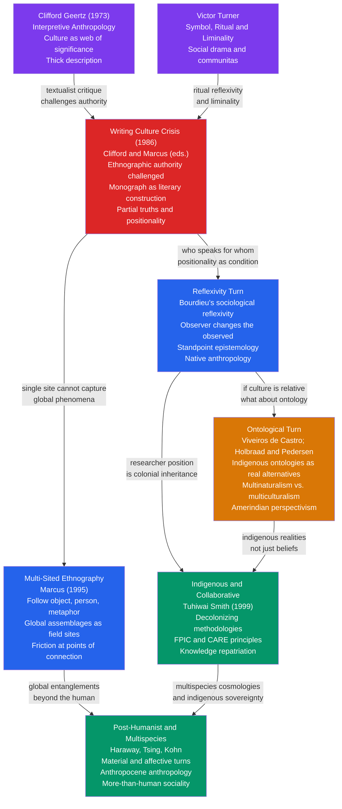

# Interpretive and Postmodern Anthropology

> [!abstract] TL;DR
> Interpretive and postmodern anthropology dismantled the fiction of the neutral ethnographer: from Geertz's thick description (culture as a web of significance to be read, not a system to be measured) through the 1986 Writing Culture crisis (ethnographic monographs are literary constructions shaped by the writer's positionality) to the ontological turn (indigenous ontologies are genuine alternative realities, not merely different beliefs about one shared world) — the field transformed from a science that studied Other cultures into a critical practice interrogating the conditions under which cross-cultural knowledge is possible, and for whose benefit.

---

## Intuition

**Analogy:** When you photograph a person, the presence of the camera changes how they behave. A documentary filmmaker who spends six months in a village may eventually be ignored — people act "naturally" around the camera. Or do they? The anthropologist, unlike the camera, also changes. She is invited to a wedding and must decide whether to attend as guest or observer. She learns the local language and starts dreaming in it. Some villagers assume she is a government spy; others, a foreign student; one woman she befriends treats her as something closer to a colleague. She leaves changed, and the community has been changed by her passage. There is no neutral footage.

Interpretive and postmodern anthropology takes this mirror problem and follows it to its logical conclusion. The ethnographer's gender, race, class, nationality, emotional reactions, and institutional position are not methodological inconveniences to be minimized — they are the medium through which knowledge is produced. Every ethnographic claim is a positioned claim. Every monograph is a literary artifact assembled from selective encounters shaped by social distance, rapport failures, and translation loss. To pretend otherwise is not objectivity; it is a particular kind of dishonesty that systematically conceals whose knowledge counts and who gets to remain invisible as a knower.

---

## How It Works



The field's evolution follows two simultaneous movements. The *inward* movement — from Geertz through Writing Culture through reflexivity — progressively dismantles the authority of the ethnographer as a neutral observer, redirecting analytical attention to the conditions of knowledge production itself. The *outward* movement — from multi-sited ethnography through the ontological turn to multispecies anthropology — expands what counts as an ethnographic site and who counts as a social actor, eventually dissolving the boundary between culture and nature that classical anthropology inherited from the Enlightenment.

---

## Key Concepts

### Secondary Level

**What Is Interpretive Anthropology?**

Clifford Geertz (1926–2006) launched the interpretive turn with *The Interpretation of Cultures* (1973). Against the positivist tradition that treated culture as a set of causal variables to be measured and compared — following a physics-like model of social science — Geertz argued that culture is a **web of significance** that humans themselves have spun. The anthropologist's task is not to measure the web but to read it: to produce a "thick description" that captures not merely what people do but what their actions *mean* within their own system of significance.

Geertz's defining example is the distinction between a twitch and a wink. Two men contract their right eyelids identically. One is an involuntary twitch; the other is a conspiratorial signal. A third person parodies the wink for a friend. The physical movement across all three is identical; the social action is entirely different, and that difference matters enormously to everyone involved. **Thick description** specifies the frames, codes, and contexts that make this contraction the kind of action it is — not merely what happened, but what it was.

This was a rejection of both structural anthropology (cultures as expressions of universal cognitive schemas) and crude functionalism (actions explained by social utility). For Geertz, cultures are public texts inscribed in behavior, ritual, and material objects. They are to be interpreted — the way a literary critic reads a novel — not decoded by a universal algorithm.

**The Writing Culture Crisis**

In 1986, James Clifford and George Marcus edited *Writing Culture: The Poetics and Politics of Ethnography*. Its central provocation: the ethnographic monograph is not a transparent report of observation — it is a **literary construction** shaped by rhetorical choices, narrative conventions, and power asymmetries between the anthropologist and the people written about.

The essays argued four interlocking claims:

| Claim | Content |
|-------|---------|
| **Ethnographic authority** | The air of "being there" is manufactured through literary devices — present-tense description, first-person narrative, seamless quote integration — not earned by mere presence |
| **Partial truths** | No account captures everything; every monograph foregrounds certain voices while backgrounding others, and those choices are never innocent |
| **Positionality** | The anthropologist's gender, race, class, and institutional position systematically shape who speaks to them, what they are shown, and what questions are even legible in the field |
| **Colonial textuality** | The traditional monograph enacts a colonial power relation: the Western scholar speaks for the non-Western Other to an audience the subjects of study will never address in a language they cannot read |

Writing Culture did not conclude that ethnography is impossible. It concluded that ethnography must become honest about its conditions of production, and that new forms — collaborative texts, polyphonic narratives, experimental genres — could respond to the crisis.

**Important limitation of Writing Culture**: The volume included no women contributors. Feminist anthropologists (Ruth Behar and Deborah Gordon's *Women Writing Culture*, 1995) pointed out that reflexive, positioned writing was not discovered in 1986 — it had been practiced for decades by women ethnographers and scholars of color who had never been able to perform the fiction of neutral authority in the first place. The "crisis" was partly the mainstream discovering what the margins had long inhabited.

---

### Undergraduate Level

**Reflexivity: The Epistemological Condition**

Reflexivity in anthropology means attending systematically to how the researcher's social position, emotional responses, theoretical commitments, and institutional role affect the research process and its outputs. It is not a methodological disclaimer — it is a theoretical claim: the ethnographer's positionality is an *epistemological condition* that shapes what is knowable, not merely what is known.

Pierre Bourdieu's reflexive sociology provides the most systematic framework. In *The Logic of Practice* (1990), Bourdieu distinguished three registers:

| Register | What It Examines | Limitation |
|----------|-----------------|------------|
| **Epistemological** | Theoretical assumptions and methodological choices | Remains within the researcher's intellectual tradition |
| **Methodological** | Conditions of fieldwork, interview, and observation | Addresses technique but not social position |
| **Sociological** | Researcher's position in the academic field and relative to the field studied | Requires genuine structural self-analysis, not just acknowledgement |

The deepest distortions come from the **scholastic disposition** — the tendency of academics to impose theoretical contemplation onto practices governed by urgency, stakes, and bodily routine. A ritual observed analytically from the outside has already been transformed from what it is for participants. Reflexivity means theorizing that transformation, not simply confessing it.

**Standpoint Epistemology** extends reflexivity into a positive theory of knowledge: marginalized social positions provide epistemically privileged access to aspects of social reality invisible from dominant positions. Patricia Hill Collins, Sandra Harding, and Dorothy Smith each developed versions of this argument. The core claim: oppressed groups develop a *double consciousness* — they must understand both their own perspective and the dominant perspective that categorizes and constrains them. Applied to anthropology: indigenous anthropologists studying their own communities may perceive aspects of social life that outsider researchers systematically miss, not despite their position but because of it.

**Native anthropology** — studying one's own community — was long treated as methodologically suspect: too close, too invested. The postmodern turn reversed this evaluation. The outsider's claimed objectivity was the fiction; the insider's acknowledged positionality was more epistemically honest. A generation of insider ethnographers developed distinctive methodological practices for managing the specific access advantages, ethical obligations, and analytical challenges that outsider research could not approximate.

**Multi-Sited Ethnography**

George Marcus's 1995 essay "Ethnography in/of the World System" diagnosed a structural problem: the world had become too interconnected for single-site fieldwork to capture what anthropologists were actually studying.

A researcher studying garment workers in Bangladesh cannot understand her field site without understanding the global supply chains connecting that factory to European consumers, New York designers, Gujarati cotton farmers, and Hong Kong quality controllers. The "local" is constituted by the global; a study confined to the factory floor will systematically misrepresent why it operates as it does.

Marcus proposed six tracking strategies for following phenomena across sites:

| Strategy | What to Follow | Example |
|----------|---------------|---------|
| **Follow the people** | Migrant populations, diaspora | Somali diaspora across Nairobi, Minneapolis, London |
| **Follow the thing** | Objects of exchange, commodities | Blood diamonds from mine to consumer to conflict finance |
| **Follow the metaphor** | A concept circulating across communities | "Sustainability" from NGO reports to corporate PR to policy |
| **Follow the plot/allegory** | A narrative or genre moving across sites | Trauma narratives translated into asylum applications |
| **Follow the biography** | A person's trajectory across institutions | A scientist's career across universities, funding bodies, public spheres |
| **Follow the conflict** | A controversy to map the social terrain | A land rights dispute through courts, protests, international NGOs |

Multi-sited ethnography is not simply fieldwork in multiple locations — it is a methodological principle that uses mobility to reveal the connections that *constitute* social phenomena: the circuits, flows, and displacements that single-site research renders invisible by design.

Anna Tsing's response to critics who saw multi-sited work as replicating the cosmopolitan mobility of capital: study the **friction** at points of connection — the awkward, unequal encounters where global forces meet local resistance. Her ethnography in *The Mushroom at the End of the World* (2015), tracing Indonesian forest ecologies, Japanese matsutake mushroom markets, and Oregon foragers, demonstrates what tracking friction through multiple sites looks like in practice.

---

### Graduate Level

**The Ontological Turn**

The ontological turn is the most philosophically radical development in contemporary anthropological theory. Its central claim: what anthropologists have been treating as different *cultural beliefs* about one shared natural world are in fact different *ontologies* — different realities, different worlds.

The distinction is epistemologically momentous. **Multiculturalism** (the standard liberal position) posits one nature, many cultures. Different people have different beliefs and values, but they inhabit the same physical world that science progressively maps. Indigenous cosmologies are culturally interesting but epistemically secondary — worldviews about a reality that Western science knows better. **Multinaturalism** (Eduardo Viveiros de Castro's term) inverts this: one culture/subjectivity, many natures. Different bodies perceive and inhabit genuinely different worlds.

**Amerindian Perspectivism** is Viveiros de Castro's framework, developed from fieldwork across multiple Amazonian peoples. In many Amazonian cosmologies, what distinguishes humans from animals and spirits is not that humans have culture while others only have nature. All beings share a universal *culture* — a common perspective, analogous intentionality, an inner life structured by social relations. What differs is *body*: not physical substance in the Western sense, but a bundle of capacities, affects, and modes of engaging with the world.

A jaguar sees blood as manioc beer, reads the forest floor as a village plaza, regards its prey as game hunted socially. The shaman can temporarily occupy the jaguar's perspective — this is what shamanic transformation means. Perspectivism is not relativism: the jaguar is not wrong about what it sees. It sees what there is to see from a jaguar body.

| Framework | Nature | Culture |
|-----------|--------|---------|
| Western multiculturalism | One (universal, scientifically knowable) | Multiple (different beliefs and values) |
| Amerindian multinaturalism | Multiple (different bodies, different perceptions) | One (universal perspective, sociality, intentionality) |

The methodological implication, developed by Martin Holbraad and Morten Axel Pedersen in *The Ontological Turn* (2017), is **conceptual self-transformation**: the anthropologist's own concepts must be genuinely transformed by contact with indigenous concepts — not merely enriched. If an Amazonian informant says the divination powder *is* truth (not "represents" it, not "symbolizes" it), the anthropologist should ask what truth must mean if divination powder can *be* it — rather than translating the claim into their own ontological frame.

**Major critiques of the ontological turn**:

- **Recreating primitivism**: By treating indigenous cosmologies as self-contained, consistent systems, the ontological turn risks producing a new exoticism that strips those cosmologies of history, contradiction, and political context (Turner, Kelly)
- **The incommensurability paradox**: If indigenous ontologies are genuinely incommensurable with Western ones, how can Western anthropologists describe them at all? The description is already a translation that betrays the very incommensurability it claims (Vigh and Sausdal)
- **Political quietism**: Claiming that indigenous water spirits are "ontologically real" is intellectually interesting; it may be practically useless when defending water rights against a mining company in a state legal system that recognizes only Western ontological categories (Taddei, Bessire)

**Indigenous and Collaborative Anthropology**

Linda Tuhiwai Smith's *Decolonizing Methodologies* (1999, 3rd ed. 2021) argued that the Western research tradition — including anthropology — reproduces colonial relations structurally, regardless of individual researchers' intentions:

| Colonial research pattern | How it reproduces colonialism |
|--------------------------|------------------------------|
| Research questions defined without community input | Reproduces the colonial extraction model |
| Data owned by the academic institution | Community cannot access, correct, or use knowledge produced from their lives |
| Analysis conducted through Western frameworks | Indigenous epistemological categories rendered invisible or translated beyond recognition |
| Publications inaccessible to communities | Knowledge about the community produced for audiences the community never addresses |

**FPIC (Free, Prior, and Informed Consent)** became the minimum ethical standard: consent must be free from coercion, given *prior* to research (not retroactively), and *informed* by accessible explanation. Smith argues FPIC is necessary but insufficient — it is a permission structure, not a partnership structure.

**CARE principles** (Collective benefit, Authority to control, Responsibility, Ethics) were developed to complement FAIR data principles (Findability, Accessibility, Interoperability, Reusability) with indigenous data sovereignty. FAIR without CARE produces open data that can be weaponized against the communities that generated it.

Collaborative anthropology requires: community members as co-investigators and co-authors; research agendas set by community needs; findings returned in usable formats; archives opened and objects repatriated; longitudinal partnerships replacing fieldwork expeditions.

**Post-Humanist and Multispecies Anthropology**

The most recent expansion dissolves "the human" as anthropology's domain boundary. Donna Haraway (*When Species Meet*, 2008), Anna Tsing (*The Mushroom at the End of the World*, 2015), and Eduardo Kohn (*How Forests Think*, 2013) argued, in different registers, that human social life is constituted by entanglements with other species, materials, and processes that cannot be relegated to "nature" and handed to biologists.

**Multispecies ethnography** attends to:
- How human social life is co-constituted by animal relationships — Haraway's analysis of the human-dog bond as co-evolution rather than domestication; Kohn's account of semiotic communication between Runa people and forest animals in Amazonian Ecuador
- How non-human organisms — fungi, salmon, coral — have their own agencies and responses that human activities depend on and are currently destroying
- How the **Anthropocene** — the geological epoch in which human activity is the dominant planetary force — requires anthropology to think at scales of temporality that exceed both the fieldwork site and the monograph

The **material turn** (drawing on STS and ANT) extends this to non-living forces: soils, toxins, chemicals, buildings, and infrastructures co-constitute human social life. Methodologically, this means attending in fieldwork not just to what people say and do but to the more-than-human forces shaping the field — weather, architecture, chemical contamination — as active participants in social situations.

---

## Python Demo

```python
# Reflexivity and Positionality in Ethnographic Data Collection
#
# Two researchers with different social positions study the same community.
# Disclosure probability decreases with social distance between researcher
# and informant. Each researcher therefore effectively samples a different
# sub-population — and produces a systematically different picture of the
# community, not from dishonesty but from positionality.
#
# The positionality heat map quantifies which social dimensions each
# researcher over- or under-samples: the invisible mechanism behind
# two divergent but internally credible fieldwork accounts.
#
# Only numpy and matplotlib used.

import numpy as np
import matplotlib
matplotlib.use("Agg")
import matplotlib.pyplot as plt

RNG = np.random.default_rng(42)

# ── Informant population ──────────────────────────────────────────────────────
N = 200
DIMS = 4  # social dimensions: class, gender, age, education

# Each informant is a point in [0,1]^4 social space
# dim 0: class        (0=working class,  1=professional)
# dim 1: gender       (0=male,           1=female)
# dim 2: age          (0=young,          1=older)
# dim 3: education    (0=low,            1=high)
informants = RNG.uniform(0, 1, size=(N, DIMS))

# True community values on three ethnographic topics
# Income: correlated with class (dim 0) and education (dim 3)
true_income = np.clip(
    0.6 * informants[:, 0] + 0.3 * informants[:, 3]
    + 0.1 * RNG.normal(0, 0.1, N),
    0, 1
)
# Discrimination experiences: higher for women (dim 1) and working-class (dim 0)
true_discrim = np.clip(
    0.5 * informants[:, 1] + 0.3 * (1 - informants[:, 0])
    + 0.2 * RNG.normal(0, 0.1, N),
    0, 1
)
# Wellbeing: correlated with education (dim 3) and age (dim 2)
true_wellbeing = np.clip(
    0.4 * informants[:, 3] + 0.3 * informants[:, 2]
    + 0.3 * RNG.normal(0, 0.1, N),
    0, 1
)

# ── Researcher positionality vectors ─────────────────────────────────────────
# Researcher A: elite — high class, male, middle-aged, highly educated
researcher_A = np.array([0.85, 0.10, 0.55, 0.90])
# Researcher B: marginalized — low class, female, young, low education
researcher_B = np.array([0.15, 0.90, 0.25, 0.20])

# ── Social distance and disclosure model ─────────────────────────────────────

def social_distance(pop, researcher):
    """Euclidean distance in 4-D social space."""
    return np.sqrt(((pop - researcher) ** 2).sum(axis=1))

def disclosure_prob(pop, researcher, alpha=3.5):
    """
    P(disclosure) via sigmoid on social distance.
    Informants close to the researcher in social space are more likely
    to open up; those far away stay guarded.
      alpha controls steepness of the drop-off.
      At dist=0.0: P ~ 0.85   (very close, high disclosure)
      At dist=0.5: P = 0.50   (inflection point)
      At dist=1.0: P ~ 0.15   (far, low disclosure)
    """
    dist = social_distance(pop, researcher)
    return 1.0 / (1.0 + np.exp(alpha * (dist - 0.5)))

p_A = disclosure_prob(informants, researcher_A)
p_B = disclosure_prob(informants, researcher_B)

# Stochastic disclosure events (one fieldwork season per researcher)
disc_A = RNG.random(N) < p_A
disc_B = RNG.random(N) < p_B
n_A = int(disc_A.sum())
n_B = int(disc_B.sum())

# ── Observed means for each researcher ───────────────────────────────────────

def observed_means(mask):
    if mask.sum() == 0:
        return [0.0, 0.0, 0.0]
    return [
        true_income[mask].mean(),
        true_discrim[mask].mean(),
        true_wellbeing[mask].mean(),
    ]

true_means   = [true_income.mean(), true_discrim.mean(), true_wellbeing.mean()]
obs_means_A  = observed_means(disc_A)
obs_means_B  = observed_means(disc_B)

# ── Positionality bias (observed sub-population mean minus true mean) ─────────
dim_bias_A = (informants[disc_A].mean(axis=0) - informants.mean(axis=0)
              if n_A > 0 else np.zeros(DIMS))
dim_bias_B = (informants[disc_B].mean(axis=0) - informants.mean(axis=0)
              if n_B > 0 else np.zeros(DIMS))
bias_matrix  = np.array([dim_bias_A, dim_bias_B])
DIM_NAMES    = ["Class", "Gender", "Age", "Education"]

# ── Plotting ──────────────────────────────────────────────────────────────────
fig, axes = plt.subplots(2, 3, figsize=(16, 9))
fig.suptitle(
    "Reflexivity and Positionality: How Observer Position Shapes Ethnographic Data\n"
    "Same community — two researchers — systematically different findings",
    fontsize=12, fontweight="bold"
)

COL_A   = "#2563eb"
COL_B   = "#dc2626"
COL_POP = "#9ca3af"

# Panel (0,0): Disclosure probability map for Researcher A
ax = axes[0, 0]
sc = ax.scatter(informants[:, 0], informants[:, 1],
                c=p_A, cmap="Blues", s=25, alpha=0.8, vmin=0, vmax=1)
ax.scatter(researcher_A[0], researcher_A[1],
           marker="*", s=350, color=COL_A, zorder=6,
           label="Researcher A (Elite)")
plt.colorbar(sc, ax=ax, label="P(disclose)")
ax.set_xlabel("Class Score", fontsize=9)
ax.set_ylabel("Gender Score  (0=male, 1=female)", fontsize=9)
ax.set_title("Researcher A (Elite)\nDisclosure Probability by Informant Position", fontsize=10)
ax.legend(fontsize=8)

# Panel (0,1): Disclosure probability map for Researcher B
ax = axes[0, 1]
sc = ax.scatter(informants[:, 0], informants[:, 1],
                c=p_B, cmap="Reds", s=25, alpha=0.8, vmin=0, vmax=1)
ax.scatter(researcher_B[0], researcher_B[1],
           marker="*", s=350, color=COL_B, zorder=6,
           label="Researcher B (Marginalized)")
plt.colorbar(sc, ax=ax, label="P(disclose)")
ax.set_xlabel("Class Score", fontsize=9)
ax.set_ylabel("Gender Score  (0=male, 1=female)", fontsize=9)
ax.set_title("Researcher B (Marginalized)\nDisclosure Probability by Informant Position", fontsize=10)
ax.legend(fontsize=8)

# Panel (0,2): Observed vs. true topic means
ax = axes[0, 2]
topics = ["Income", "Discrimination\nExperiences", "Wellbeing"]
x = np.arange(len(topics))
w = 0.25
ax.bar(x - w, true_means,  w, color=COL_POP, alpha=0.8,  label="True population mean")
ax.bar(x,     obs_means_A, w, color=COL_A,   alpha=0.85, label=f"Researcher A  (n={n_A})")
ax.bar(x + w, obs_means_B, w, color=COL_B,   alpha=0.85, label=f"Researcher B  (n={n_B})")
ax.set_xticks(x)
ax.set_xticklabels(topics, fontsize=9)
ax.set_ylabel("Mean  (0–1 scale)", fontsize=9)
ax.set_title("Observed vs. True Population Means\nBy Research Topic", fontsize=10)
ax.legend(fontsize=8)
ax.set_ylim(0, 1.1)

# Panel (1,0): Class distribution of disclosing informants
ax = axes[1, 0]
ax.hist(informants[:, 0],        bins=12, density=True,
        color=COL_POP, alpha=0.35, label="Full population")
ax.hist(informants[disc_A, 0],   bins=12, density=True,
        color=COL_A, alpha=0.75,   label=f"Researcher A  (n={n_A})")
ax.hist(informants[disc_B, 0],   bins=12, density=True,
        color=COL_B, alpha=0.75,   label=f"Researcher B  (n={n_B})")
ax.set_xlabel("Informant Class Score", fontsize=9)
ax.set_ylabel("Density", fontsize=9)
ax.set_title("Class Distribution of Disclosing Informants\nBy Researcher", fontsize=10)
ax.legend(fontsize=8)

# Panel (1,1): Gender distribution of disclosing informants
ax = axes[1, 1]
ax.hist(informants[:, 1],        bins=12, density=True,
        color=COL_POP, alpha=0.35, label="Full population")
ax.hist(informants[disc_A, 1],   bins=12, density=True,
        color=COL_A, alpha=0.75,   label=f"Researcher A  (n={n_A})")
ax.hist(informants[disc_B, 1],   bins=12, density=True,
        color=COL_B, alpha=0.75,   label=f"Researcher B  (n={n_B})")
ax.set_xlabel("Informant Gender Score  (0=male, 1=female)", fontsize=9)
ax.set_ylabel("Density", fontsize=9)
ax.set_title("Gender Distribution of Disclosing Informants\nBy Researcher", fontsize=10)
ax.legend(fontsize=8)

# Panel (1,2): Positionality bias heat map
ax = axes[1, 2]
im = ax.imshow(bias_matrix, aspect="auto", cmap="RdBu_r", vmin=-0.4, vmax=0.4)
ax.set_xticks(range(DIMS))
ax.set_xticklabels(DIM_NAMES, fontsize=9)
ax.set_yticks([0, 1])
ax.set_yticklabels(["Researcher A\n(Elite)", "Researcher B\n(Marginalized)"], fontsize=9)
ax.set_title("Positionality Bias Heat Map\n(Observed mean minus True population mean per dimension)",
             fontsize=10)
plt.colorbar(im, ax=ax, label="Bias  (blue=under-sample, red=over-sample)")
for i in range(2):
    for j in range(DIMS):
        val = bias_matrix[i, j]
        ax.text(j, i, f"{val:+.2f}", ha="center", va="center",
                fontsize=8, color="white" if abs(val) > 0.2 else "black")

plt.tight_layout()
plt.savefig("reflexivity_positionality.png", dpi=130, bbox_inches="tight")
print("Figure saved: reflexivity_positionality.png")

# ── Summary ───────────────────────────────────────────────────────────────────
print("\n=== Reflexivity Simulation: Positionality Effects on Fieldwork Data ===")
print(f"\nPopulation: {N} informants, 4-dimensional social space")
print(f"Researcher A (Elite):        disclosed n={n_A}  ({100*n_A/N:.0f}% of community)")
print(f"Researcher B (Marginalized): disclosed n={n_B}  ({100*n_B/N:.0f}% of community)")
print("\n--- Observed means vs. true population means ---")
for label, obs in [("Researcher A", obs_means_A), ("Researcher B", obs_means_B)]:
    print(f"  {label}:")
    for i, topic in enumerate(["Income", "Discrimination", "Wellbeing"]):
        print(f"    {topic:15s}: true={true_means[i]:.3f}  "
              f"observed={obs[i]:.3f}  bias={obs[i]-true_means[i]:+.3f}")
print("""
Interpretation:
  Researcher A (elite male, high class/education) gathers data predominantly
  from high-class, highly educated informants who are socially close to him.
  His fieldwork systematically overestimates community income and under-
  estimates discrimination experiences — not from dishonesty but because the
  people most affected by discrimination and poverty are least likely to open
  up to someone positioned far above them in social space.

  Researcher B (marginalized female, low class/education) gathers data from
  informants in similar positions. Her fieldwork captures discrimination and
  low-income experience more accurately, but undersamples the community's
  upper strata and may underestimate overall wealth levels.

  Both researchers produce internally consistent, carefully documented accounts
  of the "same" community. The systematic divergence is the reflexivity problem:
  the observer is not a neutral mirror but a social actor whose position
  constitutes the data. The positionality heat map makes visible the invisible
  mechanism — quantifying which social dimensions each researcher over- or
  under-samples purely as a function of social distance in the researcher-
  informant relationship.
""")
```

---

## Real-World Applications

> **Application 1 — Repatriation of Zuni War Gods:** The Ahayu:da (Zuni war gods) are sacred objects that Zuni tradition requires to be held in outdoor shrines where they gradually return to the earth. Their removal to American museums in the nineteenth and early twentieth centuries was, from a Zuni ontological perspective, not preservation but a disruption of sacred duty. The 1990 Native American Graves Protection and Repatriation Act (NAGPRA) forced negotiation; the Smithsonian returned all Ahayu:da by 1992. This is the ontological turn in practice: the objects' proper treatment is entirely different under Zuni ontology than under Western museum ontology. The legal resolution required the US state to accept, at least provisionally, the authority of an indigenous ontological framework over Western curatorial logic.

> **Application 2 — Multi-Sited Ethnography of Opioid Supply Chains:** Julie Netherland and Helena Hansen's ethnographic work reveals the multi-sited structure of a single "health problem." The US opioid crisis is simultaneously a pharmaceutical industry marketing campaign (Purdue Pharma's OxyContin push), a regulatory failure (FDA approval and CDC prescribing guidelines), a rural economic crisis, a racially differentiated treatment landscape (buprenorphine as a "white drug" dispensed in private offices vs. methadone clinics surveilled by the state), and a global supply chain (Mexican fentanyl networks). No single field site makes this structure visible. Following the drug — the thing — from laboratory to prescription pad to street to emergency room reveals the assemblage that "addiction treatment" actually is.

> **Application 3 — Te Awa Tupua and the Rights of Nature:** In 2017, New Zealand granted the Whanganui River legal personhood under the name Te Awa Tupua, following a 140-year campaign by the Maori Whanganui iwi who had always regarded the river as an ancestor: "Ko au te awa, ko te awa ko au" (I am the river, the river is me). Two guardians — one Crown, one Maori — now represent the river's legal interests. This is the ontological turn producing institutional consequences: an indigenous ontological category (river as ancestor) recognized as having legal standing in state law, reshaping property rights, environmental regulation, and the concept of legal personhood.

> **Application 4 — Paul Farmer and the Representation Politics of AIDS:** Paul Farmer's *AIDS and Accusation* (1992) demonstrated how the epidemiological framing of AIDS as a Haitian disease was itself an exercise of ethnographic authority — a narrative construction that served Western public health institutions while obscuring the structural conditions (poverty, post-colonial debt, US foreign policy) that made Haiti disproportionately vulnerable. The Writing Culture critique here has direct consequences: the representation of Haitians as a "risk group" shaped immigration policy, research funding, and donor flows in ways that worsened the very conditions the representation claimed to describe.

> **Application 5 — Multispecies Anthropology and Bee Colony Collapse:** The global decline of honeybee and wild bee populations is a multispecies anthropology problem that human-only social science cannot adequately frame. It involves: industrial agriculture economics (monocultures reduce forage diversity), the global pesticide industry (neonicotinoids as systemic disruptors), regulatory capture (industry-funded science shaping EPA standards), beekeeping cultural practices (migratory beekeeping for pollination contracts), and the biology of bee colonies as superorganisms with their own immune and communication systems. Ethnographers studying beekeeping communities find they cannot understand the practice without treating the bees — their disease ecology, foraging behavior, and communication — as active participants in the social situation, not background context.

---

## Common Pitfalls

- **Reflexivity as therapeutic confession** — The most pervasive misuse is treating reflexivity as a personal disclosure exercise: listing demographic characteristics in the introduction, declaring their potential biases, then proceeding as before. Genuine reflexivity is structural and analytical — it requires showing *how* the researcher's position shaped specific observations, choices, and interpretations, and engaging with the theoretical literature on standpoint and positionality rather than merely acknowledging one's social location abstractly.

- **Postmodern anthropology as license for anything** — The Writing Culture critique is sometimes read as a general license: since all ethnography is partial, any representation is equally valid, and rigor is an ideological imposition. This is a complete misreading. Clifford and Marcus were not arguing that representation does not matter but that it matters *enormously* — that the conventions of ethnographic authority conceal political choices that should be made explicit and accountable. The response to partial truths is not abandoning accuracy but developing more honest, accountable, and multi-vocal practices.

- **Ontological turn as new exoticism** — Treating indigenous ontologies as "really different" can reproduce a romanticized image of indigenous people as essentially Other — defined by radical alterity, frozen in cosmological distinctiveness, uncontaminated by the history of colonialism and trade that has shaped every actual community. The ontological turn is most defensible as a *methodological* move (take indigenous concepts seriously as analytical tools) rather than an *essentialist* one (these people really do inhabit a different reality).

- **Multi-sited ethnography as shallow cosmopolitanism** — Multi-sited work can become a tour of global locations rather than a rigorous investigation of specific connections. The intellectual value of following the thing is in mapping precise sociotechnical circuits, power asymmetries, and translation losses — not in accumulating fieldwork stamps. The challenge is maintaining the depth of engagement that single-site ethnography developed while trading immersion for mobility.

- **Collaborative anthropology as methodological checkbox** — Genuine collaboration requires structural renegotiation: who sets the agenda, who owns the data, who benefits from publications, who has the right to modify or veto outputs. Adding a community advisory board that reviews findings after the fact is a legitimation structure, not collaboration. The standard is whether the community has meaningful power over the research process, not whether they are acknowledged in the preface.

- **Conflating multispecies ethnography with environmental romanticism** — Multispecies ethnography is not nature writing or an argument that all species have equal moral worth. It is an ethnographic claim: human social life is materially co-constituted by relations with non-human organisms and forces that current anthropological methods systematically miss. The methodological challenge is how to attend to these relations within fieldwork constraints — not a philosophical argument about the intrinsic value of nature.

---

## Related Concepts

- [[Sociology_of_Knowledge_and_Science]] — the Writing Culture critique and STS (Strong Programme, Latour's laboratory ethnography, Fricker's epistemic justice) reached structurally identical conclusions around the same time: both disciplines confronted the social conditions of knowledge production and both deployed ethnographic methods to do so; Latour's laboratory studies are simultaneously STS and an exemplar of postmodern anthropological method

- [[Contemporary_Sociological_Theory]] — Bourdieu's theory of practice (habitus, field, reflexivity) is the backbone of reflexive anthropology; Foucault's power-knowledge and discourse analysis provide the theoretical vocabulary for treating the ethnographic text as a form of colonial knowledge production; Giddens' structuration theory informs multi-sited ethnography's account of how structure is reproduced across dispersed sites

- [[Social_Contract_Theory]] — the foundational political assumption of social contract theory — that political order results from voluntary agreement among autonomous individuals — is precisely the kind of Western ontological presupposition that the ontological turn and indigenous collaborative anthropology challenge; many indigenous political cosmologies are grounded in relations with land, ancestors, and non-human beings that the contract framework cannot accommodate

- [[Race_Ethnicity_and_Racism]] — decolonizing anthropology (Tuhiwai Smith) and feminist critiques of Writing Culture are directly continuous with the sociology of race: both name the structural conditions under which certain researchers cannot perform the fiction of neutral authority, and both argue that marginalized positionality is an epistemological resource, not only a political injury to be remedied

- [[Gender_Sex_and_Patriarchy]] — feminist anthropologists (Ruth Behar, Lila Abu-Lughod, Deborah Bird Rose) developed reflexive, positioned, and experimental ethnographic practice before and independently of the 1986 Writing Culture debate; Donna Haraway's feminist science studies provides the epistemological framework linking reflexivity, multispecies thinking, and situated knowledge

- [[Intersectionality]] — researcher positionality is never a single axis but an intersection of axes that produces specific configurations of access and blindness in particular fieldwork contexts; intersectional analysis of positionality is more accurate than single-axis acknowledgements, and the informants least likely to disclose are typically those at the intersection of multiple marginalized positions

- [[Culture_Norms_Values_and_Ideology]] — Geertz's thick description is the anthropological complement to the sociology of culture: both attend to the meaning-making practices through which people constitute their social worlds, and both reject purely behavioral or structural accounts; the ontological turn is a radicalization of cultural relativism that questions whether "culture" is the right unit of analysis at all

- [[Family_Marriage_and_Kinship]] — kinship is the foundational domain of classical anthropology (Morgan, Malinowski, Levi-Strauss), and the postmodern and collaborative turns have transformed it: from structural analysis of kinship systems to ethnographies of how kinship is actually practiced and experienced, including multi-sited studies of transnational families and indigenous perspectives on human-land-ancestor relations as forms of kinship that exceed Western nuclear-family categories

- [[Conflict_Theory_and_Critical_Theory]] — the decolonizing anthropology critique draws on critical theory's analysis of how knowledge production serves power; the structural parallel between Marx's critique of ideology and the Writing Culture critique of ethnographic authority is not accidental: both argue that seemingly neutral knowledge claims conceal the relations of production under which they were generated

- [[Globalization_and_Social_Change]] — multi-sited ethnography was developed precisely to study globalization as lived experience: the phenomenon cannot be captured from above (macro-sociological process) or below (single-site fieldwork) but only through the connections that constitute it — the circuits, flows, and frictions through which global forces are articulated in specific, unequal encounters

- [[Sociological_Research_Methods]] — the Writing Culture critique and reflexivity turn directly parallel debates in sociology about observer effects, the theory-ladenness of observation, the ethics of representation, and the impossibility of a view from nowhere; the distinction between sociology's reflexive discussion of method and anthropology's distinctive focus on ethnographic writing is instructive for understanding what each discipline considers its primary epistemic object

---

## Review Questions

### Secondary

1. Geertz argued that the anthropologist's task is to produce "thick description" rather than to explain behavior causally. Choose a social practice you are familiar with — a school ritual, a family custom, or a local tradition — and describe it twice: once as a thin description (what physically happens) and once as a thick description (what the action means to participants, what codes and frames make it this kind of action). What does the comparison reveal about the difference between explaining and interpreting social life?

2. The Writing Culture volume argued that ethnographic authority is manufactured through literary devices, not earned simply by being present in the field. What does this claim mean? Does it imply that ethnography is just fiction? If not, what distinguishes a credible ethnographic account from a novel set in the same community?

### Undergraduate

3. Reflexivity is sometimes dismissed as "navel-gazing" that replaces the study of other people with the study of the researcher. Defend the serious epistemological argument for reflexivity against this objection, drawing on Bourdieu's distinction between methodological and sociological reflexivity and on standpoint epistemology. Under what conditions does reflexivity become self-indulgent, and under what conditions is it epistemologically necessary?

4. Marcus proposed six strategies for multi-sited ethnography: follow the people, thing, metaphor, plot, biography, or conflict. Apply multi-sited methodology to one contemporary phenomenon you are interested in — a social movement, a disease, a technology, or a commodity — specifying at least three sites and the specific connections you would trace between them. What would be systematically missing from a study confined to only one of those sites?

5. The ontological turn claims that Amerindian perspectivism describes a genuine alternative ontology, not merely an exotic set of cultural beliefs. Explain the difference between the claim "indigenous people believe that jaguars have perspectives" and the ontological claim "jaguars have perspectives (in Amazonian ontology)." Why does this distinction matter theoretically? What are the strongest objections to treating indigenous ontologies as fully real alternatives to Western scientific ones?

### Graduate

6. Linda Tuhiwai Smith argues that even well-intentioned anthropological research reproduces colonial relations when it maintains Western control over research questions, data ownership, and publication. A critic responds: research requires methodological standards and independence from communities studied in order to produce reliable knowledge; collaborative research that gives communities veto power over findings is advocacy, not scholarship. Evaluate this exchange. Is there a viable position between colonial extraction and advocacy? What institutional changes — in funding structures, journal editorial practices, university intellectual property policies — would be required to make it workable?

7. The ontological turn, reflexivity, and multispecies anthropology all challenge the epistemological foundations of classical positivist anthropology, but they do so in different ways with different political implications. Compare the epistemological status of anthropological knowledge claims in each framework. Is there a risk that the three critiques, taken together, dissolve the possibility of making any justified cross-cultural claim? If so, what grounds — if any — remain for preferring one ethnographic account over another?

8. Donna Haraway and Eduardo Kohn argue that anthropology must attend to non-human agencies and forms of signification. Evaluate the methodological consequences: if the field must apprehend non-human participation in social situations, how does fieldwork practice change? What specific methods, sensibilities, and theoretical commitments enable ethnographers to study more-than-human sociality? And what is lost — analytically and politically — when anthropology dissolves the boundary between human social action and biological or material processes?

---

## Sources

- [Geertz, C. (1973). *The Interpretation of Cultures*. Basic Books](https://www.basicbooks.com/titles/clifford-geertz/the-interpretation-of-cultures/9780465097197/)
- [Clifford, J. & Marcus, G.E. (eds.) (1986). *Writing Culture: The Poetics and Politics of Ethnography*. University of California Press — Oxford Bibliographies entry](https://www.oxfordbibliographies.com/display/document/obo-9780199766567/obo-9780199766567-0030.xml)
- [Behar, R. & Gordon, D.A. (eds.) (1995). *Women Writing Culture*. University of California Press](https://www.ucpress.edu/book/9780520079021/women-writing-culture)
- [Bourdieu, P. (1990). *The Logic of Practice*. Stanford University Press](https://www.sup.org/books/title/?id=2278)
- [Marcus, G.E. (1995). "Ethnography in/of the World System: The Emergence of Multi-Sited Ethnography." *Annual Review of Anthropology* 24, 95–117](https://doi.org/10.1146/annurev.an.24.100195.000523)
- [Viveiros de Castro, E. (1998). "Cosmological Deixis and Amerindian Perspectivism." *Journal of the Royal Anthropological Institute* 4(3), 469–488](https://doi.org/10.2307/3034157)
- [Viveiros de Castro, E. (2014). *Cannibal Metaphysics*. Univocal Publishing](https://haubooks.org/the-relative-native/)
- [Holbraad, M. & Pedersen, M.A. (2017). *The Ontological Turn: An Anthropological Exposition*. Cambridge University Press — Open Encyclopedia entry](https://www.anthroencyclopedia.com/entry/ontological-turn)
- [Smith, L.T. (1999/2021). *Decolonizing Methodologies: Research and Indigenous Peoples* (3rd ed.). Zed Books](https://www.zedbooks.net/shop/book/decolonizing-methodologies/)
- [Haraway, D. (2008). *When Species Meet*. University of Minnesota Press](https://www.upress.umn.edu/book-division/books/when-species-meet)
- [Kohn, E. (2013). *How Forests Think: Toward an Anthropology Beyond the Human*. University of California Press](https://www.ucpress.edu/book/9780520276116/how-forests-think)
- [Tsing, A.L. (2015). *The Mushroom at the End of the World*. Princeton University Press](https://press.princeton.edu/books/paperback/9780691178325/the-mushroom-at-the-end-of-the-world)
- [Farmer, P. (1992). *AIDS and Accusation: Haiti and the Geography of Blame*. University of California Press](https://www.ucpress.edu/book/9780520280427/aids-and-accusation)

---

#Anthropology #Theory #PostmodernAnthropology #WritingCulture #Reflexivity
