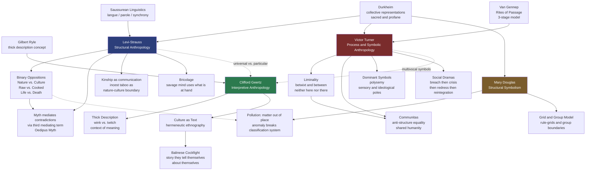

# Structuralism and Symbolic Anthropology

> [!abstract] TL;DR
> The mid-twentieth century turn to symbols and structure transformed anthropology from a catalogue of exotic customs into a science of the human mind: Lévi-Strauss argued that beneath the bewildering variety of myths, kinship systems, and rituals lies a universal cognitive architecture built from binary oppositions; Turner showed that ritual process generates liminal states where social structure dissolves into communitas; Geertz insisted that cultures are texts to be read, not mechanisms to be explained; and Douglas revealed that pollution rules are symbolic grammars that protect a society's classification system — together, these four thinkers made meaning, rather than function or history, the central problem of anthropological theory.

---

## Intuition — analogy FIRST

Imagine two people listening to the same piece of music. One hears "a nice song." The other — a trained musician — hears a sonata form with exposition, development, and recapitulation; hears how the tension of the dominant seventh chord demands resolution to the tonic; hears a structure that generates meaning precisely through the play of opposition and resolution.

Lévi-Strauss made exactly this move for culture. Where earlier anthropologists heard "exotic customs," he heard deep structural grammar. A Bororo myth about a boy who steals fire from a jaguar and a Greek myth about Prometheus stealing fire from Zeus are, at the surface, utterly different stories. But structurally, both mediate the same binary opposition — Nature versus Culture — using the same logical operation: a cultural hero crosses the boundary, acquires something from the natural or divine side, and installs it on the human side. The surface symbols differ; the deep grammar is the same.

Turner heard the same music differently. For him, culture is less a grammar than a performance — and the most revealing performances happen at the edges, when ordinary social structure breaks down. A young man undergoing initiation is stripped of his name, his clothes, his rank — reduced to nothing. In that liminal space, something extraordinary becomes possible: equality, solidarity, a sense of shared humanity that structured society normally prevents. Geertz, standing slightly apart, said: stop trying to find the grammar or the mechanism. Read the text. When Balinese men fight cocks, they are not satisfying aggression or redistributing wealth — they are writing and reading a story about status, masculinity, and what it means to be Balinese. Douglas added a final layer: the rules that seem most irrational — why Jews don't eat pork, why many cultures forbid touching a menstruating woman — are not arbitrary taboos. They are the defense perimeter of a conceptual system. Anything that doesn't fit the categories is dangerous — not because it's physically harmful, but because it threatens the classification grid on which a whole social world rests.

---

## How It Works



The tradition rests on a shared premise — that observable cultural practices are not self-explanatory but are surface expressions of deeper structures, whether cognitive (Lévi-Strauss), processual (Turner), hermeneutic (Geertz), or classificatory (Douglas). The key theoretical fork is between **Lévi-Strauss's universalism** (the deep structures are species-wide, pan-human features of the mind) and **Geertz's particularism** (meaning is always local, always historically specific — there are no universal symbols, only situated texts). Turner occupies a middle position: ritual processes have universal stages, but the symbols that fill those stages are radically particular and must be read in context.

---

## Key Concepts

### Secondary Level

**Claude Lévi-Strauss: binary oppositions and the structural mind**

Lévi-Strauss (1908–2009) was trained in philosophy but transformed himself into an ethnographer after encountering Franz Boas's work during his wartime exile in New York. His core intuition came from Ferdinand de Saussure's structural linguistics: meaning is relational, not referential. A word doesn't mean something because it points to a thing in the world; it means something because it differs from other words in the system (a "dog" is whatever a "cat" isn't). Lévi-Strauss applied this insight to culture: cultural categories — including the categories in myths — get their meaning from their opposition to other categories.

The fundamental opposition Lévi-Strauss identified is **Nature versus Culture**. This is, for him, the defining human distinction — the moment when instinct gives way to rule, when the raw becomes cooked, when the sexual becomes kinship. The incest taboo is the pivotal boundary marker: every human society prohibits certain sexual relationships, converting biological drives into cultural obligations. The specific rules vary (what counts as incest differs widely), but the existence of a rule — any rule — is the sign of culture itself. This makes the incest taboo the hinge between nature and culture, the act of classification that makes human society possible.

**Binary oppositions** are the fundamental cognitive unit. Lévi-Strauss proposed that the human mind naturally thinks in pairs of contrasts:

| Left Pole | Right Pole | Mediating Term (resolves tension) |
|---|---|---|
| Nature | Culture | Fire, cooking, agriculture |
| Raw | Cooked | The act of cooking |
| Life | Death | The shaman, trickster, mediator |
| Wild | Domestic | The hunted animal given ritual honor |
| Earth | Sky | The hero who travels between worlds |
| Individual | Collective | The gift, the ceremony |

Myths, on this account, are not explanations of natural phenomena (the "just-so story" reading) nor are they moral allegories. They are **logical operations that mediate irresolvable contradictions**. Humans cannot resolve the fact that they are mortal — that life ends in death — so myth provides a logical workaround: the trickster-hero who travels between life and death, the sacrifice that turns death into regeneration, the shaman who communicates with the dead. The contradiction is not *solved*, but it is *managed* by the myth's logical machinery.

**Victor Turner: liminality, communitas, and social dramas**

Victor Turner (1920–1983) began as a structural functionalist studying the Ndembu people of what is now Zambia, but the Ndembu's elaborate ritual life pushed him toward a processual, symbolic theory. His major contribution begins with Arnold van Gennep's three-stage model of **rites of passage** and radically deepens it.

Van Gennep's model:
1. **Separation** — the initiate is removed from their ordinary social position, status, and community
2. **Transition (Liminality)** — the initiate occupies a threshold state: neither what they were nor what they will become
3. **Reaggregation (Incorporation)** — the initiate is reintegrated into society with a new status, new identity, new rights and obligations

Turner's innovation was his analysis of the middle stage. Liminal persons, he wrote, are "threshold people" — they are "neither here nor there; they are betwixt and between the positions assigned and arrayed by law, custom, convention, and ceremonial." In ritual, they may be covered in mud, dressed in rags, given new (secret) names, subjected to physical ordeals. Their previous social identity is deliberately stripped away. This stripping creates something extraordinary: **communitas** — a spontaneous sense of equality, solidarity, and shared humanity that structured social life normally prevents. For a moment, the chief and the commoner are simply human together.

Turner distinguished three types of communitas:
- **Spontaneous communitas**: the unplanned eruption of unstructured fellowship (a moment of shared danger, a music festival)
- **Normative communitas**: communitas channeled into an enduring institution (monasteries, utopian communes)
- **Ideological communitas**: the retrospective theorizing of communitas experiences into a social programme (revolution as an attempt to permanently install communitas)

**Clifford Geertz: thick description and culture as text**

Clifford Geertz (1926–2006) was American cultural anthropology's most elegant stylist and its most influential theorist after World War II. His foundational move was epistemological: he rejected both behaviorism (explain behavior through external observable causes) and cognitive structuralism (explain behavior through hidden mental structures) in favor of **interpretive anthropology** — understanding behavior by grasping the system of meanings within which it occurs.

The concept of **thick description** comes from the philosopher Gilbert Ryle, who used it to distinguish two observers watching a boy's eyelid twitch and wink:

- **Thin description**: "His eyelid contracted."
- **Thick description**: "He was winking conspiratorially at a friend to signal that the next move was part of their scheme, while simultaneously — since their teacher was watching — trying to make the wink look like an involuntary twitch."

The same physical movement carries entirely different meanings depending on context, intention, convention, and the multilayered codes of the community. Geertz's definition of ethnography: "a thick description of the socially established codes within which a wink is a wink and not a twitch."

Culture, for Geertz, is "webs of significance" spun by humans themselves (Max Weber's phrase). It is not a behavior, not a mental structure, not a social function — it is **a context, a text, a set of public symbols through which people communicate, perpetuate, and develop their knowledge about and attitudes toward life**. The task of the anthropologist is not to explain culture causally but to read it — to act as a literary critic, not a physicist.

**Mary Douglas: purity, danger, and classification**

Mary Douglas (1921–2007) built on both Durkheim's sociology of knowledge and Lévi-Strauss's structural analysis to produce a theory of symbolic pollution. Her central insight, from *Purity and Danger* (1966): **dirt is matter out of place**. Dirt is not a positive category — there is no objective substance called "dirt." Dirt is defined relationally: it is whatever violates a given classification system. Shoes are not inherently dirty, but shoes on the table are dirty because they violate the category boundary between "floor things" and "surface things."

This transforms the analysis of ritual pollution taboos. The pig is prohibited in Leviticus not because it is unhygienic (the hygienic hypothesis) nor because it competed with humans for grain (the ecological hypothesis), but because it is an **anomalous animal** in the Levitical classification system. The system classifies land animals by two criteria: cloven hooves AND cud-chewing. Sheep have both; therefore clean. Pigs have cloven hooves but do not chew cud; therefore anomalous, therefore polluting, therefore forbidden. The same logic explains why eagles can eat carrion (not anomalous — predators eat prey) while vultures cannot (anomalous — birds that "eat" like decomposers).

---

### Undergraduate Level

**Lévi-Strauss's myth analysis: the Oedipus myth and Amerindian Mythologiques**

Lévi-Strauss's method for analyzing myth was published in "The Structural Study of Myth" (1955). He argued that myth must be read neither diachronically (as a linear story with a beginning, middle, and end) nor as a simple symbolic message, but synchronically — as a two-dimensional structure in which certain thematic bundles recur and are set in opposition.

His analysis of the Oedipus myth distributes the mythemes (minimal units of mythic meaning) into four columns:

| Overrating blood relations | Underrating blood relations | Denial of human earthly origin | Affirmation of human earthly origin |
|---|---|---|---|
| Cadmos seeks his sister Europa | Cadmos kills the dragon | Oedipus kills his father Laios | "Labdacos" = lame; "Laios" = left-sided; "Oedipus" = swollen foot |
| Oedipus marries his mother Jocasta | Oedipus kills the Sphinx | | |
| Antigone buries her brother Polynices (forbidden) | | | |

Reading vertically, columns 1 and 2 are opposed (too-close / too-distant kinship relations). Columns 3 and 4 are opposed (denial of earthly/chthonic origin / affirmation of earthly origin — the club-foot motif links to the autochthony myths where humans spring from the earth). The myth mediates the contradiction between the belief that humans sprang from the earth (autochthony) and the observation that humans are in fact born from sexual reproduction between two people. This is the same Nature/Culture tension at a more specific level: where do humans come from?

In the four-volume *Mythologiques* (1964–1971), Lévi-Strauss performed structural analyses of over 800 Amerindian myths, demonstrating that they form a single coherent system of transformations — the same oppositions (raw/cooked, fresh/rotten, moist/dry, culture/nature) appear in structurally equivalent positions across myths that have never been in contact.

**Bricolage versus engineering: the "savage mind"**

Lévi-Strauss's *La Pensée Sauvage* (1962) — "The Savage Mind," but also "Wild Pansy," the flower — argued that so-called primitive thought is not a proto-scientific fumbling toward modern rationality but a distinct and equally rigorous intellectual mode.

| Mode | Practitioner | Method | Material |
|---|---|---|---|
| **Engineering** | Modern scientist | Designs project from first principles; acquires materials specifically for the project | Specialized, purpose-built tools |
| **Bricolage** | The "bricoleur" (handyman, tinkerer) | Uses whatever is available; materials collected from previous projects, each carrying its own history | Heterogeneous, residual, repurposed |

Myth-making is bricolage: the mythmaker uses available cultural materials — fragments of ritual, cosmological belief, historical event, linguistic accident — and recombines them into a structure that resolves a current cultural problem. The result is not inferior to engineering; it is cognitively sophisticated on different terms. The comparison was a direct critique of the evolutionist ranking of cultures from "primitive" to "advanced."

**Turner's dominant symbols: the Ndembu mudyi tree**

Turner's analysis of Ndembu ritual symbols distinguishes between **dominant symbols** (central, stable, recurring across many rituals) and **instrumental symbols** (specific to a single ritual context and its goals). Dominant symbols have three properties:

1. **Condensation**: a single symbol carries many meanings simultaneously
2. **Unification of disparate referents**: meanings that are logically unrelated are fused in the symbol
3. **Polarization of meaning**: the symbol carries both a **sensory pole** (visceral, bodily, emotional associations — what the symbol looks, tastes, smells, feels like) and an **ideological pole** (social norms, moral values, kinship obligations, cosmological beliefs)

The *mudyi* (milk tree) is Turner's canonical example. At the sensory pole: the tree's white latex sap evokes breast milk, mother's body, nourishment, the good things of infancy. At the ideological pole: the tree is the symbol of matrilineal descent, the unity of Ndembu society, the moral norms of women's roles. In the girls' initiation ritual, the novice lies under the mudyi tree as her female kin dance around it. The symbol fuses the visceral pleasures of maternal nurturance with the obligations of lineage membership — it motivates normative behavior by hijacking the emotional charge of infantile experience.

**Turner's social dramas**

Beyond ritual, Turner generalized the processual model into a theory of social conflict: **social dramas**. These are "units of aharmonic or disharmonic social process, arising in conflict situations." They follow a four-stage sequence:

1. **Breach**: a public violation of a norm by a member of the group — a murder, an adultery made public, a political defection
2. **Crisis**: the breach spreads; sides form; the breach threatens to tear the social fabric
3. **Redressive action**: the community attempts repair through legal action, ritual, sacrifice, formal mediation, or informal arbitration
4. **Reintegration or recognition of schism**: either the breach is healed (the offender is reintegrated, both parties reconciled) or the schism becomes permanent (a faction splits off, an exile is formalized)

Turner applied this to the colonial politics of Ndembu village fission, to Hidalgo's Mexican revolution, and to the Thomas Becket crisis in medieval England — arguing that the same processual logic operates at every scale.

**Geertz's interpretive anthropology: the Balinese cockfight**

Geertz's "Notes on the Balinese Cockfight" (1972) is the most celebrated single essay in twentieth-century anthropology. He begins with an experience of establishing rapport: he and his wife are watching an illegal cockfight in Bali when the police raid it; everyone runs, and the Geertzes — on instinct — run with the Balinese. This moment of shared flight breaks their outsider status. They have, involuntarily, participated.

The cockfight itself, Geertz argues, is neither a sporting event nor a gambling mechanism (though it involves both). It is a **story the Balinese tell themselves about themselves**. Three layers of analysis:

| Layer | What the cockfight is about |
|---|---|
| Formal structure | Bets are placed in a precise hierarchical pattern — large center bets between high-status men who own the cocks; small side bets encoding allegiances |
| Status and masculinity | The cock is an extension of its owner's masculine identity; a cock's defeat is a public humiliation of its owner; the fight is a simulation of the violence of status competition |
| Balinese cultural logic | Balinese culture is deeply preoccupied with status; the cockfight is a "sentimental education" in the emotional texture of status — what it feels like to have, to risk, to lose, to recover status |

The cockfight is **deep play** (Bentham's term, revived by Geertz): stakes are so high that rational self-interest cannot explain participation. High-status men bet what they cannot afford to lose — not because they expect to profit, but because the bet publicly declares their status commitment. The game makes the cultural stakes legible. For Geertz, this is what culture always does: it provides a set of public symbolic forms through which humans both express and experience their deepest values. The cockfight is a text, and ethnography is an act of reading.

**Geertz: religion as a cultural system**

In "Religion as a Cultural System" (1966), Geertz defined religion as:

> "A system of symbols which acts to establish powerful, pervasive, and long-lasting moods and motivations in men by formulating conceptions of a general order of existence and clothing these conceptions with such an aura of factuality that the moods and motivations seem uniquely realistic."

Two key moves in this definition:

- **Models OF and models FOR**: religious symbols simultaneously describe reality as it is ("God created the world") and prescribe how to act in it ("therefore honor the Sabbath"). The same symbol system maps the is and the ought onto each other, making normative obligations seem cosmologically mandated.
- **Moods versus motivations**: religion shapes not only what people *want to do* (motivations) but how they *feel about the world* — sadness and joy, terror and peace, reverence and awe. The **ethos** (moral tone of a culture) and the **world-view** (picture of reality) are made to seem expressions of each other.

---

### Graduate Level

**The Lévi-Strauss/Geertz controversy: universalism versus particularism**

The deepest theoretical fault line in the tradition separates Lévi-Strauss's universalism from Geertz's particularism, and it maps onto a fundamental debate in the human sciences.

Lévi-Strauss assumes that the structures he finds — binary opposition, the Nature/Culture distinction, the formal operations of transformation — are features of the human mind as such, not of any particular culture. The Bororo and the Greek share mythological logic because they share a brain. This is structuralism in the strong sense: it makes anthropology into a cognitive science avant la lettre, and it licenses comparison across cultures because the terms of comparison (binary oppositions and their logical transformations) are universal.

Geertz rejects this programme on methodological and philosophical grounds. The structures Lévi-Strauss finds, Geertz argues, are produced by the analysis — they are artifacts of the method, not properties of the myths. More fundamentally, meaning cannot be decoded by formal analysis. The Ndembu do not experience the mudyi tree as the intersection of two structural poles; they experience it as a particular, powerful, emotionally dense symbol whose meaning has been learned, lived, and disputed over generations. To flatten that particularity into a universal structure is to throw away the only thing that makes the symbol meaningful. Geertz's methodological commitment to **thick description** is anti-structuralist at its core: meaning is always in the detail, never in the abstraction.

The post-1980 critique went further. Both traditions, Paul Rabinow and William Sullivan (*Interpretive Social Science*, 1979) noted, assume the anthropologist can achieve a privileged interpretive vantage point — either by uncovering the deep structure (Lévi-Strauss) or by reading the text closely enough (Geertz). The reflexive turn in anthropology questioned this assumption: the anthropologist is always already implicated in the text they are reading. George Marcus and Michael Fischer (*Anthropology as Cultural Critique*, 1986) argued that ethnography is itself a literary genre with its own rhetorical conventions and power relations. Geertz's cockfight essay, for all its interpretive sophistication, enacts an authoritative "I was there" voice that is itself a cultural performance — the performance of the all-seeing interpreter.

**Lévi-Strauss and Saussure: structure versus history**

Lévi-Strauss explicitly modeled his programme on Saussure's distinction between **langue** (the system, the synchronic structure) and **parole** (the individual utterance, the diachronic event). Myths, like utterances, are both. Structuralism's move is to bracket the diachronic (the historical sequence of myth versions, the specific social context of each telling) in order to read the synchronic (the underlying grammar that generates all versions). This is formally analogous to Saussure's claim that meaning is a feature of the system, not of individual signs.

The analogy has a problem: Saussure's linguistics was about a single community's language at a single time. Lévi-Strauss was applying it trans-culturally and trans-historically — claiming that myths from Amazonia and ancient Greece share the same structural grammar. This requires a much stronger claim: not just that meaning is relational, but that the relations are species-universal. The anthropologist Dan Sperber, in *Rethinking Symbolism* (1975), made the most precise critique: the structural "reading" of a myth shows that certain oppositions *can* be mapped onto each other, but it doesn't show that they *are* — that the relationship is psychologically real to any actual myth-teller or myth-listener. Structural analysis may be a product of the analyst's mind, not the myth's.

**Mary Douglas: grid/group model and cosmological consonance**

Douglas developed a more systematic comparative framework in *Natural Symbols* (1970): the **grid/group model**. Social environments vary along two independent axes:

- **Group**: the degree to which individuals are incorporated into a bounded social unit; high group = strong community identity, insiders versus outsiders sharply defined
- **Grid**: the degree to which social life is governed by explicit rules, roles, and classifications; high grid = strong role differentiation, clear rules about who can do what with whom

The four quadrants of the grid/group model predict different **cosmological styles** — different ways of thinking about the body, about nature, about purity and danger:

| | High Grid | Low Grid |
|---|---|---|
| **High Group** | Strong bodily symbolism; pollution fears; strong classification system (classic Leviticus case) | Witch-accusation; external threats; weak internal structure but strong boundaries |
| **Low Group** | Competitive individualism; strong personal destiny; weak communal ritual | Minimal ritual; anti-ritualist; belief in individual transcendence |

The model's power is its prediction of **consonance** between social structure and cosmological belief: a society with strong group boundaries and strong internal rules will think about the world in terms of strong boundaries and strong rules — about the body, about nature, about the cosmos. The body, as Douglas argued, is a natural symbol of the social body. When a society is obsessed with bodily boundaries (what enters and exits, what is pure and impure, what may be touched by whom), it is also, always, obsessed with social boundaries.

**Geertz's anti-anti-relativism and the limits of interpretation**

Geertz's late methodological statement, "Anti-Anti-Relativism" (1984), defines his epistemological position with characteristic precision. He is not a relativist — he does not claim that all cultural practices are equally valid or that cross-cultural moral judgment is impossible. But he is anti-anti-relativist: he rejects the *reflex* move of invoking universalism to short-circuit the work of understanding. The proper response to encountering an unfamiliar cultural practice is not immediately to evaluate it by universal standards; it is to try to understand it in its own terms first — and then, with that understanding as a basis, to judge.

This position has been criticized from two directions. From universalism: Geertz's hermeneutic charity slides into relativism when it refuses to judge practices that harm women, minorities, or the powerless on the grounds that we must understand them "in their own terms." From postcolonialism: Geertz's interpretive authority — his confidence that he can read the Balinese cockfight correctly after a few months of fieldwork — is itself a form of colonial power, an appropriation of Balinese experience for a Western theoretical programme. Renato Rosaldo's *Culture and Truth* (1989) was an early poststructuralist critique of this authority claim. The "thick description" of the grieving Ilongot headhunter, Rosaldo argued, requires more than interpretive skill — it requires loss, grief, mortality of one's own. The anthropologist is not a neutral reader but an always-already positioned human subject.

---

## Python Demo

```python
import numpy as np
import matplotlib.pyplot as plt
import matplotlib.patches as mpatches

np.random.seed(7)

# ── Levi-Strauss: structural myth analysis via binary opposition signatures ──
#
# Each myth is encoded as a D-dimensional mediation vector where each
# dimension represents a fundamental binary opposition (e.g., Nature/Culture).
# The value [0, 1] is the "mediation score": how strongly the myth
# resolves that opposition through a mediating third term.
#
# Levi-Strauss's central claim: structurally equivalent myths cluster
# together regardless of cultural origin — the deep cognitive logic is
# universal; only the surface symbols differ across cultures.
#
# Method:
#   1. Build opposition-activation matrix M (12 myths x 8 oppositions)
#   2. Compute cosine similarity between all myth pairs
#   3. PCA projection to visualize structural families
#
# Uses: numpy, matplotlib only

OPP_LABELS = [
    "Nature/Culture",
    "Life/Death",
    "Raw/Cooked",
    "Wild/Tame",
    "Earth/Sky",
    "Mortal/Divine",
    "Indiv./Collective",
    "Male/Female",
]
D = len(OPP_LABELS)

# Myth encodings: mediation scores per opposition axis.
# Values approximated from Levi-Strauss's Mythologiques series and
# canonical secondary structural analyses.
# Myths sharing the same LOGICAL STRUCTURE (e.g., hero acquires fire from
# nature/divine domain -> installs in culture) should cluster together
# even across different cultures.
MYTHS = {
    "Prometheus (Greek)":     [0.90, 0.40, 0.85, 0.50, 0.50, 0.80, 0.40, 0.20],
    "Oedipus (Greek)":        [0.80, 0.75, 0.10, 0.30, 0.20, 0.50, 0.50, 0.85],
    "Cooked Fire (Bororo)":   [0.95, 0.30, 0.95, 0.60, 0.40, 0.30, 0.50, 0.15],
    "Jaguar Wife (Bororo)":   [0.80, 0.50, 0.85, 0.85, 0.30, 0.20, 0.40, 0.75],
    "Loki-Baldr (Norse)":     [0.50, 0.90, 0.20, 0.40, 0.75, 0.85, 0.50, 0.40],
    "Ymir Creation (Norse)":  [0.85, 0.60, 0.15, 0.50, 0.90, 0.70, 0.60, 0.70],
    "Purusha Hymn (Hindu)":   [0.70, 0.55, 0.10, 0.40, 0.85, 0.90, 0.80, 0.65],
    "Indra/Vritra (Hindu)":   [0.60, 0.85, 0.20, 0.70, 0.80, 0.80, 0.35, 0.30],
    "Manabozho (Ojibwe)":     [0.90, 0.45, 0.75, 0.90, 0.50, 0.50, 0.55, 0.25],
    "Origin of Corn (Ojibwe)":[0.85, 0.40, 0.90, 0.80, 0.35, 0.30, 0.60, 0.45],
    "Anansi (Ashanti)":       [0.70, 0.50, 0.55, 0.65, 0.30, 0.50, 0.75, 0.35],
    "Mwindo (Nyanga)":        [0.55, 0.80, 0.30, 0.45, 0.65, 0.75, 0.60, 0.55],
}

CULTURE_COLOR = {
    "Greek":   "#e74c3c",
    "Bororo":  "#e67e22",
    "Norse":   "#2980b9",
    "Hindu":   "#8e44ad",
    "Ojibwe":  "#27ae60",
    "Ashanti": "#c0392b",
    "Nyanga":  "#d35400",
}

def get_culture(name):
    for c in CULTURE_COLOR:
        if c in name:
            return c
    return "Other"

names = list(MYTHS.keys())
M = np.array(list(MYTHS.values()), dtype=float)   # (12, 8)
pt_colors = [CULTURE_COLOR[get_culture(n)] for n in names]
short = [n.split(" (")[0] for n in names]

# ── Cosine similarity matrix ───────────────────────────────────────────────
norms = np.linalg.norm(M, axis=1, keepdims=True) + 1e-9
normed = M / norms
sim = normed @ normed.T                            # (12, 12)

# ── PCA: manual numpy implementation ──────────────────────────────────────
M_c = M - M.mean(axis=0)
cov = M_c.T @ M_c / (len(M) - 1)                  # (8, 8) feature covariance
evals, evecs = np.linalg.eigh(cov)                 # eigh: symmetric matrix
idx = np.argsort(-evals)                           # descending eigenvalue order
proj = M_c @ evecs[:, idx[:2]]                     # (12, 2) projection
var_pct = evals[idx] / evals.sum() * 100

# ── Plot ──────────────────────────────────────────────────────────────────
fig, axes = plt.subplots(1, 3, figsize=(15, 5))
fig.suptitle(
    "Levi-Strauss Structural Myth Analysis  |  Binary Opposition Signatures",
    fontsize=11, fontweight="bold"
)

# Panel 1: opposition activation heatmap
ax = axes[0]
im = ax.imshow(M, aspect="auto", cmap="YlOrRd", vmin=0, vmax=1)
ax.set_yticks(range(len(names)))
ax.set_yticklabels(short, fontsize=7.5)
for i in range(len(names)):
    ax.get_yticklabels()[i].set_color(pt_colors[i])
ax.set_xticks(range(D))
ax.set_xticklabels(OPP_LABELS, rotation=50, ha="right", fontsize=7)
ax.set_title(
    "Mediation Strength per Opposition\n(heat = myth strongly resolves this tension)",
    fontsize=8.5
)
fig.colorbar(im, ax=ax, fraction=0.04, pad=0.02, label="Mediation score")

# Panel 2: structural similarity heatmap
ax = axes[1]
im2 = ax.imshow(sim, aspect="auto", cmap="RdYlGn")
ax.set_xticks(range(len(names)))
ax.set_xticklabels(short, rotation=55, ha="right", fontsize=6.5)
ax.set_yticks(range(len(names)))
ax.set_yticklabels(short, fontsize=7.5)
for i in range(len(names)):
    ax.get_yticklabels()[i].set_color(pt_colors[i])
ax.set_title(
    "Cross-Cultural Structural Similarity\n(cosine similarity of opposition vectors)",
    fontsize=8.5
)
fig.colorbar(im2, ax=ax, fraction=0.04, pad=0.02, label="Cosine similarity")

# Panel 3: PCA — structural families
ax = axes[2]
for i, (name, col) in enumerate(zip(names, pt_colors)):
    ax.scatter(proj[i, 0], proj[i, 1], color=col, s=70, zorder=3,
               edgecolors="white", linewidth=0.8)
    ax.annotate(short[i], (proj[i, 0], proj[i, 1]),
                fontsize=6.5, ha="center", va="bottom",
                xytext=(0, 5), textcoords="offset points")

seen = set()
legend_patches = []
for name, col in zip(names, pt_colors):
    c = get_culture(name)
    if c not in seen:
        legend_patches.append(mpatches.Patch(color=col, label=c))
        seen.add(c)
ax.legend(handles=legend_patches, fontsize=7, loc="lower left", framealpha=0.75)
ax.set_xlabel(f"PC1  ({var_pct[0]:.0f}% variance)", fontsize=8)
ax.set_ylabel(f"PC2  ({var_pct[1]:.0f}% variance)", fontsize=8)
ax.set_title(
    "PCA: Structural Families Across Cultures\n(same mythological logic clusters regardless of origin)",
    fontsize=8.5
)
ax.grid(alpha=0.2)

plt.tight_layout()
plt.savefig("structural_myth_analysis.png", dpi=150, bbox_inches="tight")
plt.show()

# ── Print highest cross-cultural structural similarities ──────────────────
print("\n=== Top Cross-Cultural Structural Equivalences ===")
pairs = []
for i in range(len(names)):
    for j in range(i + 1, len(names)):
        if get_culture(names[i]) != get_culture(names[j]):
            pairs.append((sim[i, j], names[i], names[j]))
pairs.sort(reverse=True)
print(f"{'Score':>6}  {'Myth A':<28}  {'Myth B'}")
print("-" * 70)
for score, a, b in pairs[:8]:
    print(f"  {score:.3f}  {a:<28}  {b}")
```

**What the simulation shows:**

- **Panel 1 (heatmap)**: The "Nature/Culture" and "Raw/Cooked" oppositions are strongly activated in Prometheus (Greek), Cooked Fire (Bororo), Manabozho (Ojibwe), and Origin of Corn (Ojibwe) — myths from four unrelated cultures that share the same structural theme of a cultural hero mediating the nature/culture transition through fire or food. "Life/Death" dominates Loki-Baldr, Mwindo, and Oedipus — a separate structural family organized around mortality and divine conflict.
- **Panel 2 (similarity matrix)**: High off-diagonal similarity values appear *across* cultural groups: Prometheus (Greek) ↔ Cooked Fire (Bororo) and Manabozho (Ojibwe) ↔ Origin of Corn (Ojibwe) ↔ Prometheus. Lévi-Strauss's claim is that this structural kinship is not coincidence — it reflects shared cognitive architecture.
- **Panel 3 (PCA)**: The first principal component separates "cosmogonic / earth-sky / divine" myths (Hindu, Norse) from "nature-culture / food / trickster" myths (Greek, Bororo, Ojibwe). The second component separates "gender and kinship" myths (Oedipus, Jaguar Wife) from "collective / cosmic" myths. Cross-cultural structural families cluster together, visually demonstrating the universalist claim.

---

## Real-World Applications

> **Example 1 — Advertising as structural myth (Lévi-Strauss).** Advertising works by mobilizing binary oppositions. Every perfume advertisement mediates the Nature/Culture opposition: wild landscapes and pristine bodies (nature's purity) versus the sophisticated product (cultural refinement). Every car advertisement resolves the Freedom/Security opposition: open roads (freedom, adventure, nature) combined with advanced safety systems (security, culture, control). The structural analysis is directly applicable: identify the underlying opposition; identify the mediating product or figure; the advertisement's emotional power is generated by the resolution of the tension.

> **Example 2 — Graduation and military initiation as liminal ritual (Turner).** Victor Turner's three-stage model maps cleanly onto modern secular rituals. University graduation involves separation (students are a category apart, with their own campus, schedule, and identity for four years), liminality (the ceremony itself, with caps and gowns that temporarily replace ordinary clothing and signal transition), and reaggregation (the conferral of a new degree and identity — "now you are alumni"). Military boot camp is a more intense case: mortification of prior civilian identity (haircut, uniform, loss of name), liminal hazing and communitas (recruits bond through shared ordeal and equality of suffering), and reaggregation into a new permanent military identity. Turner would argue that the emotional power of these rituals is generated precisely by the liminal phase — the temporary dissolution of identity that makes the new identity feel genuinely earned.

> **Example 3 — Kosher law and hygiene app design (Douglas).** Douglas's "matter out of place" principle has been applied far beyond food taboos. UX designers have found that interface elements that violate categorical expectations generate discomfort disproportionate to their functional significance. A navigation menu that appears in the content area of a page is not just inconvenient — it is *wrong* in a quasi-moral sense, because it violates the categorical distinction between navigation and content. The discomfort is structural, not empirical. Douglas's framework predicts that users will respond to categorical violations with affective disgust responses — the same mechanism that makes pig meat taboo in Levitical culture.

> **Example 4 — Ethnography in technology organizations (Geertz).** Geertz's interpretive programme has been operationalized by tech companies through "design ethnography" and "organizational anthropology." Researchers embedded at companies like Intel (where ethnographer Genevieve Bell built a team of social scientists) use thick description to understand how workers actually use products — not what they say they do in surveys, but the full context of meaning in which devices and interfaces are embedded. The finding that a smartphone means something different to a grandmother in rural China than to a teenager in Seoul is a Geertzian observation: the device's meaning cannot be decoded from its technical specification; it must be read from within the specific symbolic context of its use.

> **Example 5 — Turner and political liminal moments.** Revolutions, Carnivals, and "Carnivalesque" political moments (the Occupy protests, the Arab Spring's Tahrir Square) produce what Turner identified as spontaneous communitas: a temporary breakdown of ordinary status distinctions, a sense of shared humanity across class, race, and educational lines. Turner's theory predicts that these moments cannot be institutionalized without transforming into something else — normative communitas becomes an organization with its own hierarchy; the revolution becomes a state with its own power structure. The failure of the Arab Spring to translate communitas into durable democratic institutions is, in Turner's terms, a failure to complete the reaggregation stage with a viable new structure to fill the liminal void.

---

## Common Pitfalls

- **Mistaking structuralism for structuralism in sociology** — Lévi-Strauss's "structuralism" (cognitive universal binary oppositions in myths and kinship) has almost nothing to do with "structural functionalism" (Durkheim, Radcliffe-Brown, Parsons). The former is about the formal organization of human cognition; the latter is about the functional integration of social institutions. Using "structural" without qualification creates confusion between two entirely different intellectual projects.

- **Treating Geertz's "thick description" as simply "detailed description"** — Thick description is not synonymous with rich ethnographic detail. A very long, detailed description of behavior that lacks the interpretive framework — the symbolic context, the layered meanings, the codes at work — is still thin description. Thickness is about the density of *interpretive context*, not the quantity of observational data.

- **Assuming Lévi-Strauss's structural analysis is falsifiable in the standard scientific sense** — Lévi-Strauss explicitly modeled his method on mathematical transformation analysis, not on hypothesis testing. The critic who complains that any myth can be made to fit any structural schema is right, in a sense — but this is a methodological feature, not a bug. The question is whether the analysis is illuminating and generative, not whether it is falsifiable in Popper's sense. Taking Lévi-Strauss as an empirical scientist and then criticizing him for not doing science misunderstands what he was doing.

- **Flattening Turner's communitas into "community"** — Communitas is not simply togetherness or community spirit. It is technically anti-structure: it occurs when normal status roles are *suspended*, not merely when people gather. A corporate team-building event that retains the CEO/employee hierarchy is not communitas; a group of strangers trapped together in a natural disaster, stripped of all social markers, may briefly experience it. The technical requirement of structural suspension is essential.

- **Confusing Geertz's hermeneutics with relativism** — Geertz's interpretive anthropology insists that cultural practices must be understood from within their own context of meaning before evaluation. This is methodological relativism as a starting point, not moral relativism as a conclusion. Geertz explicitly rejected the charge in "Anti-Anti-Relativism" (1984): understanding is not excusing; thick description is a prerequisite for moral judgment, not a substitute for it.

- **Applying Douglas's pollution analysis only to "primitive" societies** — Douglas's own later work, and a generation of scholars following her, demonstrated that pollution concepts operate in all societies, including industrial and post-industrial ones. Hospital infection control follows structural logic (categories of clean versus unclean spaces, bodily fluids as polluting, gloves and gowns as purification rituals). The analysis of why food scares (BSE, GMO anxiety) generate disproportionate panic becomes legible: the feared substance crosses a categorical boundary (animal protein in animal feed; gene manipulation as a violation of species classification).

---

## Related Concepts

- [[Culture_Norms_Values_and_Ideology]] — Geertz's definition of culture as "webs of significance" and his symbolic account of ideology are the anthropological foundation beneath the sociological theory of culture; Bourdieu's habitus and field draw on Lévi-Strauss's structural insight that dispositions are structurally generated
- [[Symbolic_Interactionism_and_Microsociology]] — Both traditions make symbols and meaning central; but where symbolic interactionism analyses meaning as produced through face-to-face interaction (bottom-up), structuralism and symbolic anthropology treat meaning as produced by deep structures or cultural texts (top-down); Geertz's "culture as text" partially bridges the gap
- [[Language_and_Thought]] — Lévi-Strauss's entire programme is modeled on Saussurean structural linguistics; the Sapir-Whorf hypothesis (language shapes thought) is the psycholinguistic parallel to the structuralist claim that binary oppositions shape perception; Chomsky's universal grammar provides the cognitive science backing for Lévi-Strauss's universalism about mental structures
- [[Religion_Sacred_and_Secular]] — Turner's analysis of ritual process extends Durkheim's sacred/profane distinction into a processual theory of how ritual generates and regenerates social solidarity; Geertz's "religion as a cultural system" is the interpretive counterpart to Durkheim's sociological functionalism; Douglas's pollution theory directly addresses the Levitical dietary system
- [[Family_Marriage_and_Kinship]] — Lévi-Strauss's *Elementary Structures of Kinship* (1949) is one of the foundational texts of kinship theory; his argument that the incest taboo is the nature/culture boundary and that kinship systems are communication systems exchanging women as signs is both seminal and controversially debated
- [[Functionalism_and_Systems_Theory]] — Structural anthropology emerged partly as a critique of structural functionalism: where Radcliffe-Brown explained ritual by its social function (it integrates the community), Lévi-Strauss asked what cognitive structure generates the ritual's symbolic content; Turner's processual anthropology was itself a critique of Radcliffe-Brown's static, consensus-model functionalism

---

## Review Questions

### Secondary

1. Lévi-Strauss argues that the Prometheus myth (Greek) and a Bororo fire myth (Amazonian) are structurally identical even though their surface content is completely different. Explain what he means by "structurally identical" using the concept of binary oppositions. What would it mean for two myths to be structurally *equivalent* across cultures?

2. Victor Turner describes initiates in a rite of passage as "betwixt and between." Use the example of a university graduation ceremony to explain the three stages of Van Gennep's model and explain what makes the middle stage (liminality) the most socially powerful.

3. Mary Douglas says that dirt is "matter out of place." Use this principle to explain one food taboo (it does not have to be from Leviticus) that might seem puzzling if analyzed hygienically or ecologically, but makes sense when analyzed as a violation of a classification system.

### Undergraduate

1. Geertz insists that "thick description" is fundamentally different from detailed description. Using the winking/twitching example, explain what makes a description thick rather than thin. Then evaluate: can there be such a thing as "too thick" a description — a description so dense with interpretive context that it fails to communicate across cultural boundaries?

2. Compare Turner's concept of communitas with Durkheim's concept of collective effervescence. Both describe moments of intense social solidarity that transcend ordinary status roles. Are these the same phenomenon described differently, or are they genuinely distinct? What would each theorist say about the emotional dynamics of a music festival?

3. Lévi-Strauss argues that the incest taboo is not primarily a moral rule but a structural boundary that separates Nature from Culture and makes kinship (as a communication system) possible. Evaluate this claim: what does it explain about why incest taboos are universal even though their specific content varies? What does it fail to explain?

### Graduate

1. The deepest disagreement between Lévi-Strauss and Geertz is not about method but about the ontology of cultural meaning: for Lévi-Strauss, the deep structure is *in the myth*; for Geertz, meaning is *in the performance* of the text by historically situated agents. Which ontology makes more sense given what we know from cognitive science about conceptual structure, and which makes more sense given what we know from pragmatics and hermeneutics about interpretation? Can the two positions be reconciled, or do they imply incompatible research programmes?

2. Mary Douglas's grid/group model predicts a systematic relationship between social structure and cosmological belief — a society's rules about bodily purity will reflect and reinforce its rules about social boundaries. Evaluate this claim using a contemporary case: how might grid/group analysis apply to the politics of mask-wearing during a respiratory pandemic, where bodily boundary rules became intensely politicized? What does this test case reveal about the model's strengths and limits?

3. Turner's concept of communitas has been applied to revolutionary politics (the liminal moment when ordinary structures dissolve and a new order is not yet established), to festival culture, and to religious movements. The theorist Bjorn Thomassen has argued that modernity is characterized by "permanent liminality" — the sustained dissolution of stable social structures without reaggregation. If Thomassen is right, what happens to Turner's model? Does permanent liminality generate permanent communitas, or does it generate something pathological — anomie, extremism, the desperate search for a reaggregating identity?

---

## Sources

- [Lévi-Strauss, C. (1955). "The Structural Study of Myth." *Journal of American Folklore* 68(270), 428–444](https://doi.org/10.2307/536768)
- [Lévi-Strauss, C. (1962). *La Pensée Sauvage* (trans. as *The Savage Mind*, 1966). University of Chicago Press](https://www.goodreads.com/book/show/234621.The_Savage_Mind)
- [Lévi-Strauss, C. (1969). *The Elementary Structures of Kinship* (rev. ed.). Eyre & Spottiswoode](https://www.goodreads.com/book/show/234619.The_Elementary_Structures_of_Kinship)
- [Turner, V. (1969). *The Ritual Process: Structure and Anti-Structure*. Aldine de Gruyter](https://www.goodreads.com/book/show/186843.The_Ritual_Process)
- [Turner, V. (1967). *The Forest of Symbols: Aspects of Ndembu Ritual*. Cornell University Press](https://www.goodreads.com/book/show/186844.The_Forest_of_Symbols)
- [Geertz, C. (1973). *The Interpretation of Cultures*. Basic Books](https://www.goodreads.com/book/show/53204.The_Interpretation_of_Cultures)
- [Geertz, C. (1984). "Anti-Anti-Relativism." *American Anthropologist* 86(2), 263–278](https://doi.org/10.1525/aa.1984.86.2.02a00030)
- [Douglas, M. (1966). *Purity and Danger: An Analysis of Concepts of Pollution and Taboo*. Routledge](https://www.goodreads.com/book/show/186805.Purity_and_Danger)
- [Douglas, M. (1970). *Natural Symbols: Explorations in Cosmology*. Pantheon](https://www.goodreads.com/book/show/1119753.Natural_Symbols)
- [Van Gennep, A. (1909). *The Rites of Passage* (trans. Vizedom & Caffee, 1960). University of Chicago Press](https://www.goodreads.com/book/show/186812.The_Rites_of_Passage)
- [Structuralism in Anthropology — University of Alabama](https://anthropology.ua.edu/theory/structuralism/)
- [Lévi-Strauss's Structuralism — Anthropology Review](https://anthropologyreview.org/influential-anthropologists/claude-levi-strausss-structuralism-and-its-influence-on-anthropological-thought/)
- [Victor Turner on Liminality and Communitas — Cultural Studies Now](https://culturalstudiesnow.blogspot.com/2012/03/victor-turner-on-liminality-and.html)
- [Clifford Geertz and Thick Description — Anthropology Review](https://anthropologyreview.org/influential-anthropologists/clifford-geertz-the-man-who-pioneered-thick-description-in-anthropology/)
- [Sperber, D. (1975). *Rethinking Symbolism*. Cambridge University Press](https://www.goodreads.com/book/show/186807.Rethinking_Symbolism)
- [Marcus, G. & Fischer, M. (1986). *Anthropology as Cultural Critique*. University of Chicago Press](https://www.goodreads.com/book/show/186808.Anthropology_as_Cultural_Critique)

---

#Anthropology #Theory #Structuralism #SymbolicAnthropology #LeviStrauss #Geertz #Turner #Douglas
