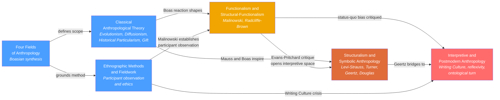

# History and Theory of Anthropology

> [!abstract] Section Overview
> This section maps the intellectual development of anthropology as a discipline — from 19th-century armchair evolutionism through the Boasian revolution in fieldwork and cultural relativism, to functionalism, structuralism, and the interpretive and postmodern critiques of ethnographic authority. The six notes together trace how anthropology defined its holistic object of study across four fields, established participant observation as its core method, and progressively interrogated its own power to represent other peoples. Reading them in sequence is the fastest way to understand why anthropology looks the way it does today.

---

## Notes in This Section

- [[Four_Fields_of_Anthropology]] — The Boasian framework that makes anthropology unique: biology, archaeology, linguistic anthropology, and cultural anthropology as inseparable dimensions of human diversity
- [[Classical_Anthropological_Theory]] — The three founding schools — Evolutionism, Diffusionism, Historical Particularism — plus Mauss's sociology of the gift; the debates that still organize the field
- [[Ethnographic_Methods_and_Fieldwork]] — Participant observation, field notes, emic/etic distinction, ethical frameworks, and the Writing Culture turn in ethnographic practice
- [[Functionalism_and_Structural_Functionalism]] — Malinowski's needs-based functionalism and Radcliffe-Brown's structural-functionalism; the Kula ring, joking relationships, and segmentary lineage systems
- [[Structuralism_and_Symbolic_Anthropology]] — Levi-Strauss's binary oppositions, Turner's liminality and communitas, Geertz's thick description, and Douglas's pollution theory
- [[Interpretive_and_Postmodern_Anthropology]] — The Writing Culture crisis, reflexivity, multi-sited ethnography, the ontological turn, and decolonizing methodologies

---

## Concept Map

*(Blue = foundational, Orange = intermediate, Red = advanced; arrows = "leads to" or "critiques and builds on")*

---

## Learning Path

*Recommended order for a first pass through this section:*

1. [[Four_Fields_of_Anthropology]] — Start here to understand what anthropology is and why Boas insisted biology, culture, language, and archaeology must be studied together; provides the disciplinary scaffolding for everything else
2. [[Classical_Anthropological_Theory]] — The intellectual history: why Evolutionism failed, what Diffusionism got right, how Boas's Historical Particularism won the methodological debate, and why Mauss's gift theory upended economics
3. [[Ethnographic_Methods_and_Fieldwork]] — The core method; read this early because participant observation underlies every empirical claim in the subsequent theoretical traditions
4. [[Functionalism_and_Structural_Functionalism]] — The first paradigm built on real fieldwork; Malinowski's Kula ring and Radcliffe-Brown's structural comparativism, and why they eventually needed to be superseded
5. [[Structuralism_and_Symbolic_Anthropology]] — The mid-century pivot to meaning: binary oppositions, ritual liminality, thick description, and pollution as classification; the four thinkers (Levi-Strauss, Turner, Geertz, Douglas) who made culture legible as structure and text
6. [[Interpretive_and_Postmodern_Anthropology]] — The reflexive turn; how the discipline dismantled the fiction of the neutral ethnographer, from Writing Culture through the ontological turn to decolonizing methodologies; best read last because it critiques everything that came before

---

## All Notes in This Section

| Note | Core Idea | Difficulty |
|------|-----------|------------|
| [[Four_Fields_of_Anthropology]] | Boas's synthesis: biology, culture, language, and archaeology vary independently and require holistic study | Beginner |
| [[Classical_Anthropological_Theory]] | Evolutionism, Diffusionism, and Historical Particularism established the discipline's core debates; Mauss showed the gift is never free | Intermediate |
| [[Ethnographic_Methods_and_Fieldwork]] | Long-term participant observation is the gold standard; emic/etic distinction, field-notes practice, ethics, and the reflexivity turn | Intermediate |
| [[Functionalism_and_Structural_Functionalism]] | Malinowski explained customs by their function for human needs; Radcliffe-Brown by their role in maintaining social structure | Intermediate |
| [[Structuralism_and_Symbolic_Anthropology]] | Meaning — through binary oppositions, liminal process, thick description, and pollution taboos — became the central problem of anthropological theory | Advanced |
| [[Interpretive_and_Postmodern_Anthropology]] | The Writing Culture crisis revealed ethnographic authority as a literary construction; reflexivity, multi-sited work, and the ontological turn followed | Advanced |

---

## Key Themes

- **From armchair to field.** The defining methodological revolution of anthropology is the shift from armchair comparison of secondhand reports to long-term immersive participant observation in a community's own language — a shift associated above all with Boas and Malinowski.
- **Universalism versus particularism.** Every theoretical school in this section stakes out a position on whether cross-cultural regularities reflect universal features of the human mind or body, or whether each culture must be understood on its own historical and contextual terms. Evolutionism, Structuralism, and the biocultural synthesis lean toward universalism; Historical Particularism, Geertzian interpretation, and the ontological turn lean toward particularism.
- **The reflexive spiral.** Anthropology progressively turned its analytical tools on itself: functionalism asked what fieldwork does; structuralism asked what it encodes; postmodernism asked who speaks, for whom, and with what authority. Each critique deepened rather than abandoned the fieldwork tradition.
- **The politics of representation.** From Boas's dismantling of scientific racism through Malinowski's challenge to the evolutionary contempt for "primitive" peoples through the Writing Culture crisis and decolonizing methodologies, the history of anthropological theory is inseparable from the politics of who gets to represent whom and on what terms.

---

## Cross-Section Links

- [[Religion_Magic_and_Ritual]] (Section 04) — Tylor's animism, Malinowski's magic-as-anxiety-management, Turner's ritual process, and Douglas's pollution taboos are all foundational for the anthropology of religion; the theoretical lineage from this section runs directly into that one
- [[Kinship_Marriage_and_Family_Systems]] (Section 04) — Morgan's kinship typology, Malinowski's Trobriand data, Radcliffe-Brown's joking/avoidance relationships, and Levi-Strauss's alliance theory all originate in the theories covered here
- [[Culture_Symbols_and_Meaning]] (Section 04) — Geertz's interpretive programme, Levi-Strauss's symbolic analysis, and Turner's dominant symbol theory flow directly from this section into the comparative study of cultural meaning-systems
- [[Political_Anthropology_and_Power]] (Section 04) — Radcliffe-Brown's structural-functionalism and Evans-Pritchard's segmentary lineage model are the classical foundations of political anthropology; the postmodern critiques of power in ethnographic writing extend this into contemporary theory
- [[Biocultural_Anthropology]] (Section 02) — The four-field framework's insistence that biology and culture co-determine one another finds its contemporary scientific expression in the biocultural synthesis developed here
- [[Human_Evolution_and_Paleoanthropology]] (Section 02) — Boas's craniometric refutation of scientific racism and the four-field model's biological anthropology dimension connect Classical Theory directly to the study of hominin evolution and human variation
- [[Archaeological_Methods_and_Theory]] (Section 03) — The processual/post-processual debate in archaeology mirrors the science/humanities split that runs through this section's theoretical history, and shares the functionalism vs interpretivism tension
- [[Language_and_Culture]] (Section 05) — The Sapir-Whorf hypothesis emerges from the Boasian tradition of linguistic anthropology that the four-field framework institutionalized; Levi-Strauss's entire structuralist programme was modeled on Saussurean linguistics
- [[Semiotics_and_Symbolic_Communication]] (Section 05) — Levi-Strauss applied Saussurean structural linguistics to myth and kinship; Geertz's culture-as-text treats social life through a semiotic lens; both link directly to the formal study of signs and symbols
