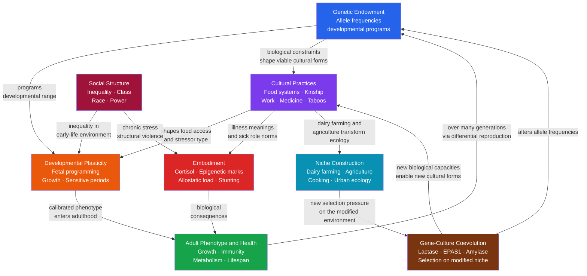

# Biocultural Anthropology

> [!abstract] TL;DR
> Biocultural anthropology is the sub-discipline that treats biology and culture as mutually constitutive: neither is primary, each continuously reshapes the other through development, embodiment, and evolution. It explains why human growth, disease risk, and life-history outcomes cannot be reduced to genes alone or to culture alone — the two are locked in a feedback loop at every timescale from fetal programming (days) to gene-culture coevolution (millennia).

---

## Intuition

**Analogy:** Imagine you are calibrating a thermostat in a house that does not yet know what climate it will be placed in. The thermostat reads the temperature in the room during construction and permanently adjusts its "set point" to match — optimising for the world it was assembled in, not the world it will eventually inhabit. If you build it during a cold winter and then install it in a tropical house, it will run the heating continuously, wasting energy and stressing the system.

Now replace "thermostat" with a human fetus and "temperature during construction" with the nutritional signals flooding the womb. A fetus exposed to chronic undernutrition receives a biochemical message: the outside world is scarce, calibrate all metabolic systems for thrift — store fat aggressively, keep blood sugar high, prioritise immediate survival over longevity. This works perfectly if the child is born into the same scarcity. But if that child survives a famine, migrates to a food-abundant city, and adopts a Western diet, the pre-set thermostat triggers metabolic syndrome, type 2 diabetes, and cardiovascular disease decades later. The biology is not broken — it was precisely calibrated. The problem is the mismatch between the world it predicted and the world it actually met.

This thermostat logic — the body reading cultural and ecological cues during sensitive developmental windows and permanently adjusting its biology — is the central insight of biocultural anthropology. Culture is not painted on top of a fixed biological substrate; it reaches inside, during development, and rewrites the substrate itself.

---

## How It Works

Biocultural anthropology identifies four interlocking feedback mechanisms that connect biology and culture. No single arrow points in one direction.



The diagram has no single starting point. It is a loop: genes calibrate the range of developmental plasticity; culture determines what stimuli fill that range during sensitive windows; social structure channels who receives which stimuli; the resulting phenotype feeds back into culture and, over generations, into gene frequencies through differential survival and reproduction.

---

## Key Concepts

### Secondary Level

**What biocultural anthropology rejects.**

The field emerged explicitly as a critique of two equally inadequate positions: *biological determinism* (race, intelligence, and behaviour are fixed by genes; culture is epiphenomenal) and *cultural relativism taken to a biological extreme* (the body is infinitely plastic, blank-slate, wholly constructed by discourse). Both positions treat biology and culture as alternatives rather than interacting forces. The biocultural synthesis insists that the same outcome — say, elevated blood pressure in a Black American woman — cannot be explained by genetics or by racism alone; it requires accounting for both the biological stress-response architecture and the social context that keeps it chronically activated (see [[Health_Inequality_and_Medical_Sociology]]).

**Bogin's model of human childhood.**

Barry Bogin identified a life-history stage found in no other primate: a prolonged post-weaning period of dependency (childhood, ages 2–7) during which the child can no longer survive on breast milk but cannot process an adult diet and cannot forage independently. All other apes move directly from infant to juvenile. Human childhood is therefore a biocultural invention: it is only possible because cultural institutions — family, community, provisioning — supply the dependent child with processed food and protection. Why did it evolve? Childhood buys time for the slow-growing, metabolically expensive human brain. It also serves as the window during which humans acquire the cultural skills — language, tool use, social norms, ecological knowledge — that are our species' primary adaptive strategy. The implication is profound: biological brain growth and cultural learning are not sequential processes; they are co-evolved, each requiring the other to function.

**Height as a welfare indicator: historical anthropometrics.**

Richard Steckel demonstrated that average adult height — a product of childhood nutritional status and disease burden — is one of the most sensitive historical welfare indicators available. When written records of wages, prices, and calories are absent (most of human history), skeletal remains yield mean height for a population. Steckel and colleagues documented that pre-Columbian Native Americans on the Great Plains were among the tallest people in the world — taller than contemporary Europeans — and that heights declined sharply after European contact and colonisation. The body carries the legible record of social history.

**Stunting and developmental plasticity.**

Stunting (height-for-age more than two standard deviations below the WHO growth reference) affects approximately 149 million children under five globally and is the most visible marker of developmental failure. It is not primarily genetic — it reflects chronic nutritional deficiency, infection burden, and inadequate care during the first 1,000 days of life (conception through age 2). Stunted children show not only short stature but impaired cognitive development, reduced immune competence, and increased adult chronic disease risk — demonstrating that early-life biological outcomes are simultaneously social outcomes, products of inequality, food systems, and care practices.

**Food taboos and cultural materialism.**

Marvin Harris argued that food taboos, seemingly arbitrary from a Western perspective, frequently have underlying nutritional or ecological logic. The Jewish and Islamic prohibition on pork, for example, is explicable (in Harris's "cultural materialist" framework) through the ecological economics of pig husbandry in the semi-arid Middle East: pigs require shade and water and compete with humans for calorie-dense grain; they offer no milk, wool, or traction. The taboo encoded a rational resource allocation rule in a religious sanction that was more robust to individual defection than a purely economic calculation. Whether or not Harris's specific arguments are always correct, the framework introduced a productive hypothesis: cultural practices related to food are not arbitrary but interact with nutritional biology, ecology, and economics.

---

### Undergraduate Level

**The Barker hypothesis: fetal programming of adult disease.**

David Barker's epidemiological breakthrough came from comparing historical birth-weight records in Hertfordshire, England with mortality records sixty years later. Low-birth-weight infants — those who experienced nutritional restriction in utero — had significantly elevated rates of coronary heart disease, hypertension, stroke, and type 2 diabetes as adults. Barker's "fetal origins of adult disease" hypothesis proposed that nutritional signals during critical developmental windows permanently programme the set points of metabolic and cardiovascular systems. The Dutch Hunger Winter of 1944–45 provided the sharpest natural experiment: individuals whose mothers were exposed to famine during the first trimester of pregnancy showed elevated rates of metabolic syndrome and coronary heart disease six decades later, along with altered DNA methylation at the *IGF2* imprinted locus (see [[Epigenetics_DNA_Methylation_and_Histone_Modification]]).

**Thrifty phenotype versus thrifty genotype.**

Two models try to explain why metabolic disease risk is elevated in populations that experienced historical food insecurity:

- **Thrifty genotype** (James Neel, 1962): evolution selected for alleles that promote rapid fat storage during periods of food abundance (feasts), providing a survival advantage during subsequent famines. Those alleles now cause obesity and diabetes in the constant-feast conditions of modernity. The problem is that the selective pressure for feast-famine cycling was presumably common to all human populations, yet type 2 diabetes prevalence varies enormously across groups.

- **Thrifty phenotype** (Hales and Barker, 1992): the relevant calibration happens not over evolutionary time but during individual development. The fetus, in utero, reads its nutritional environment as a predictor of the world it will be born into, and adjusts insulin sensitivity, pancreatic beta-cell mass, and adipose tissue function accordingly. The thrifty phenotype is not a genetic variant but a developmental programme activated by an environmental signal.

**Predictive adaptive responses and the mismatch hypothesis.**

Peter Gluckman and Mark Bateson extended Barker's framework into an evolutionary argument. The fetus does not passively suffer nutritional restriction; it makes a *prediction* about its likely adult environment and permanently adjusts its phenotype to maximise fitness in that predicted world. They call this a **predictive adaptive response (PAR)**. The prediction is adaptive when correct: a fetus that correctly anticipates scarcity and develops a thrifty metabolic programme has higher fitness in a scarce environment than one that does not. The prediction becomes maladaptive when wrong: the same thrifty programme, deployed in an abundant adult environment, produces metabolic disease. This is not a failure of evolution — it is evolution working precisely as expected, at the wrong timescale. The key implication is that the nutrition transition (traditional diets → Western diets, occurring within a single generation) creates a massive population-level mismatch between early-life predictions and adult realities.

**Embodiment: the body as biological and cultural object simultaneously.**

Embodiment theory, associated with Margaret Lock, Thomas Csordas, and Nancy Scheper-Hughes, insists that the body is not merely the material substrate on which culture is projected but is itself a co-production of biology and social life.

- **Margaret Lock** coined the phrase **"mindful bodies"** to describe how bodies are simultaneously biological organisms, loci of individual identity, and artefacts of social relations. Her comparative study of menopause in Japan and North America showed that the symptom profiles, meanings, and medical management of menopause differ radically between the two societies — not because Japanese and American women have different hormones, but because the experience of the menopausal body is shaped by diet, activity, social role, and medical discourse.

- **Thomas Csordas** developed a phenomenological account of bodily experience as the ground of culture rather than its product. For Csordas, the body is not an object that culture acts upon; it is the lived medium through which cultural meaning is produced and reproduced — a "somatic mode of attention."

- **Nancy Scheper-Hughes** in *Death Without Weeping* documented that poor mothers in Northeast Brazil sometimes withheld emotional investment from sickly infants, apparently grieving little when they died. Scheper-Hughes argued this was not cultural indifference but a biocultural adaptation to an environment where infant mortality was so high that attachment carried prohibitive psychological costs. She labelled the structural conditions producing this outcome — poverty, contaminated water, absent healthcare — **structural violence**: violence without a perpetrator, enacted by social arrangements rather than individual agents, but no less lethal for that.

**Medical ecology: the biological logic of cultural variation in disease.**

Medical ecology examines disease as the outcome of interactions among human biology, cultural practices, and ecological environments. Three canonical examples:

1. **Sickle cell trait and malaria.** Heterozygotes for the sickle cell allele (*HbS*) enjoy substantially reduced severity of *Plasmodium falciparum* malaria. In sub-Saharan Africa, where malaria has been a major mortality cause for millennia, the *HbS* allele is maintained at frequencies of 10–40% by this heterozygote advantage, despite the severe fitness cost of homozygous sickle cell disease. The *cultural* dimension: slash-and-burn agriculture created the standing-water conditions that enabled *Anopheles* mosquito populations to expand, increasing selection pressure for malaria resistance. Human agricultural practice, an ecological modification, shaped the genetic composition of the human population.

2. **Lactase persistence in pastoral societies.** Most mammals lose lactase (the enzyme that digests milk sugar, lactose) after weaning. Most adult humans globally are lactose intolerant. Yet in populations with long histories of cattle herding — Northern Europeans, East Africans, some Middle Eastern groups — the derived *LCT* allele that maintains lactase activity into adulthood has risen to frequencies as high as 90%. The selection pressure was not milk itself but the cultural practice of dairying: populations that kept cattle and drank milk had a caloric and nutritional advantage that selected for lactase persistence. This is gene-culture coevolution in action: a cultural practice (dairying) modified the ecological and nutritional environment, which then exerted selection pressure on a gene. The process is an instance of **niche construction**.

3. **Altitude adaptation and Tibetan EPAS1.** Tibetans have lived above 4,000 metres for approximately 8,000–10,000 years. At altitude, oxygen partial pressure is ~40% lower than at sea level; most lowlanders respond with polycythemia (excess red blood cell production), which increases clotting risk. Tibetans show a derived allele of *EPAS1* (encoding Hypoxia-Inducible Factor 2-alpha) that suppresses this polycythemic response, allowing efficient oxygen delivery without clotting pathology. This *EPAS1* variant appears to have been acquired through introgression from Denisovan archaic hominins — making altitude adaptation an example of both cultural ecology (the decision to settle high-altitude habitats was itself a cultural choice with biological consequences) and archaic admixture.

---

### Graduate Level

**Niche construction theory.**

Niche construction theory (NCT), formalised by Odling-Smee, Laland, and Feldman, proposes that organisms are not passive recipients of selection pressures from their environments but actively modify those environments in ways that alter the selection pressures acting back on themselves and their descendants. NCT adds a second inheritance system alongside genetic inheritance: **ecological inheritance** — the modified niche that organisms bequeath to their offspring. For humans, cultural inheritance and ecological inheritance are inseparable. Agriculture illustrates the full loop: human populations shift from foraging to grain cultivation; the new diet (high starch) selects for elevated amylase copy number (*AMY1*) to digest starch more efficiently; dense agricultural settlements create standing water and fecal contamination, selecting for immune variants; the population explosion enabled by agriculture produces larger societies with more complex division of labour, enabling full-time specialists (priests, warriors, craftspeople), which feeds back into cultural evolution. Biology and culture are not cause and effect — they are co-evolving subsystems of the same expanding system.

**Dual inheritance theory and gene-culture coevolution.**

Dual inheritance theory (Boyd and Richerson; Cavalli-Sforza and Feldman) models the parallel and interacting evolution of genetic and cultural information. Genes and cultural variants are both heritable, both subject to selection, and both capable of modifying the fitness landscape the other faces. Critically, cultural evolution operates on a much faster timescale than genetic evolution: cultural variants can spread through a population within years; gene frequencies require generations to shift substantially. This creates the possibility of runaway cultural-genetic coevolution: cultural innovations that provide fitness advantages generate strong selection on genetic variants that improve acquisition, performance, or exploitation of those innovations. Language, cooking, lactase persistence, and the extended human childhood are all proposed products of gene-culture coevolution.

**The nutrition transition and global mismatch.**

Barry Popkin's **nutrition transition** model describes a global shift from diets high in complex carbohydrates, fibre, and low in fat, toward diets high in refined carbohydrates, saturated fat, and animal protein. The transition correlates with economic development, urbanisation, and food system industrialisation. Its health consequences — rising rates of type 2 diabetes, cardiovascular disease, obesity, and certain cancers — are precisely what the thrifty phenotype / PAR framework predicts: populations whose developmental environments were calibrated for nutritional scarcity are now exposed to caloric abundance, producing massive population-level mismatch. The epidemiological burden falls disproportionately on populations that underwent the transition most recently and rapidly — sub-Saharan Africa, South and Southeast Asia, Pacific Island nations — because within-generation developmental calibration cannot keep pace with the speed of dietary change.

**Embodiment of inequality: ecosocial theory and the weathering hypothesis.**

Nancy Krieger's **ecosocial theory** proposes that bodies literally incorporate social inequalities — that chronic social adversity leaves traceable biological marks, a process she calls *embodiment*. These marks include elevated cortisol (chronic HPA axis activation from social stress; see [[Stress_and_Coping]]), shortened telomeres (accelerated biological aging), elevated inflammatory markers (IL-6, CRP), and altered epigenetic methylation patterns. The framework is biologically specific: the marks are not metaphorical but measurable, and they accumulate proportionally to exposure duration and intensity.

Arline Geronimus extended this framework into the **weathering hypothesis**: Black Americans begin to experience health deterioration in early adulthood rather than middle age, as a result of cumulative high-effort coping with race-based social and economic adversity from birth. The paradox of Black women's birth outcomes in the United States — where college-educated Black women have worse infant outcomes than white women without a high school diploma — is explicable only through the weathering hypothesis: the biological cost of navigating structural racism outweighs the protective effect of education and income.

The mechanisms overlap with epigenetics: chronic glucocorticoid exposure from social stress drives differential methylation at glucocorticoid-response elements, altering immune function, inflammatory set points, and metabolic regulation in ways that outlast the stressor and may transmit across generations. The biocultural and epigenetic frameworks converge: social structure is written into the epigenome, which is then partially transmitted to offspring, constituting a biological mechanism of intergenerational inequality that does not require genetic inheritance.

---

## Python Demo

```python
# Biocultural Anthropology: Developmental Plasticity and the Barker/Thrifty Phenotype
# Simulates two developmental trajectories (thrifty vs normal) produced by
# early-life nutritional signals, and shows how mismatch between the predicted
# and actual adult environment drives metabolic disease risk.
# Uses numpy and matplotlib only.

import numpy as np
import matplotlib.pyplot as plt

rng = np.random.default_rng(42)

# ====================================================================
# PARAMETERS
# ====================================================================
N = 600                    # individuals per cohort
THRESHOLD = 0.35           # early-life signal below which thrifty program activates
MODERN_ENV = 0.82          # adult nutritional environment (0=scarce, 1=Western abundance)

# Early-life nutritional signal (0 = severe famine, 1 = abundant nutrition)
# Cohort A: born into nutritional deprivation (famine or severe poverty)
# Cohort B: born with adequate nutrition
early_life_A = rng.beta(2, 10, N)   # concentrated near 0.15–0.25 (famine)
early_life_B = rng.beta(8,  2, N)   # concentrated near 0.75–0.90 (adequate)

def thrifty_prob(early_signal, k=16.0, threshold=THRESHOLD):
    """Probability of activating thrifty developmental program (sigmoid gate)."""
    return 1.0 / (1.0 + np.exp(k * (early_signal - threshold)))

def risk_thrifty(adult_env):
    """
    Thrifty phenotype risk — optimised for scarcity.
    Low in traditional/scarce environments; escalates sharply in abundance
    (mismatch: aggressive fat storage + insulin resistance in adipose tissue).
    """
    return 0.04 + 0.07 * (1.0 - adult_env) + 0.78 * (adult_env ** 2)

def risk_normal(adult_env):
    """
    Normal phenotype risk — calibrated for adequate nutrition.
    Modest increase in abundance (standard obesity risk); slight increase in scarcity.
    """
    return 0.06 + 0.11 * (1.0 - adult_env) ** 1.5 + 0.22 * (adult_env ** 2)

# ====================================================================
# COMPUTE INDIVIDUAL DISEASE RISKS
# ====================================================================
adult_env_range = np.linspace(0.0, 1.0, 200)

# Each individual's risk is a probabilistic blend of thrifty and normal programs
p_T_A = thrifty_prob(early_life_A)   # fraction of thrifty activation, cohort A
p_T_B = thrifty_prob(early_life_B)   # fraction of thrifty activation, cohort B

indiv_risk_A = p_T_A * risk_thrifty(MODERN_ENV) + (1 - p_T_A) * risk_normal(MODERN_ENV)
indiv_risk_B = p_T_B * risk_thrifty(MODERN_ENV) + (1 - p_T_B) * risk_normal(MODERN_ENV)

# Mean cohort risk across all adult environments
def cohort_risk(p_thrifty_vals, envs):
    return np.array([
        (p_thrifty_vals * risk_thrifty(e) + (1 - p_thrifty_vals) * risk_normal(e)).mean()
        for e in envs
    ])

risk_A_curve = cohort_risk(p_T_A, adult_env_range)
risk_B_curve = cohort_risk(p_T_B, adult_env_range)

# ====================================================================
# VISUALISATION
# ====================================================================
fig, axes = plt.subplots(1, 3, figsize=(16, 5))

# --- Panel 1: Pure phenotype risk curves ---
ax1 = axes[0]
ax1.plot(adult_env_range, risk_normal(adult_env_range),
         color="#2563eb", lw=2.5, label="Normal phenotype\n(well-nourished in utero)")
ax1.plot(adult_env_range, risk_thrifty(adult_env_range),
         color="#dc2626", lw=2.5, label="Thrifty phenotype\n(deprived in utero)")
ax1.fill_between(
    adult_env_range, risk_thrifty(adult_env_range), risk_normal(adult_env_range),
    where=(risk_thrifty(adult_env_range) > risk_normal(adult_env_range)),
    alpha=0.18, color="#dc2626", label="Mismatch risk premium"
)
ax1.axvline(MODERN_ENV, color="gray", ls="--", lw=1.5, alpha=0.7,
            label=f"Modern diet (env={MODERN_ENV})")
ax1.set_xlabel("Adult nutritional environment\n(0 = scarcity, 1 = Western abundance)")
ax1.set_ylabel("Metabolic disease risk (0–1)")
ax1.set_title("Developmental Trajectory\nx Adult Environment\n(Barker Hypothesis)", fontweight="bold")
ax1.legend(fontsize=7.5, loc="upper left")
ax1.grid(alpha=0.3)
ax1.set_ylim(-0.02, 0.90)

# --- Panel 2: Distribution of individual risk in modern environment ---
ax2 = axes[1]
ax2.hist(indiv_risk_A, bins=30, alpha=0.65, color="#dc2626", density=True,
         label=f"Famine-born cohort A\n(n={N}, mean={indiv_risk_A.mean():.3f})")
ax2.hist(indiv_risk_B, bins=30, alpha=0.65, color="#2563eb", density=True,
         label=f"Normal-born cohort B\n(n={N}, mean={indiv_risk_B.mean():.3f})")
ax2.axvline(indiv_risk_A.mean(), color="#dc2626", ls="--", lw=2.0)
ax2.axvline(indiv_risk_B.mean(), color="#2563eb", ls="--", lw=2.0)
rr = indiv_risk_A.mean() / indiv_risk_B.mean()
ax2.text(0.52, 0.88, f"Relative risk:\n{rr:.2f}x",
         transform=ax2.transAxes, fontsize=9.5, color="#dc2626",
         bbox=dict(boxstyle="round,pad=0.3", facecolor="white", edgecolor="#dc2626"))
ax2.set_xlabel(f"Metabolic disease risk\n(adult environment = {MODERN_ENV})")
ax2.set_ylabel("Density")
ax2.set_title("Mismatch Effect in Modernity:\nFamine-Born vs Well-Nourished\nBoth in Western Diet", fontweight="bold")
ax2.legend(fontsize=8)
ax2.grid(alpha=0.3)

# --- Panel 3: Mean cohort risk across all adult environments ---
ax3 = axes[2]
ax3.plot(adult_env_range, risk_A_curve, color="#dc2626", lw=2.5,
         label="Famine-born cohort\n(mostly thrifty program)")
ax3.plot(adult_env_range, risk_B_curve, color="#2563eb", lw=2.5,
         label="Well-nourished cohort\n(mostly normal program)")
ax3.fill_between(adult_env_range, risk_A_curve, risk_B_curve,
                 where=(risk_A_curve > risk_B_curve), alpha=0.18, color="#dc2626")
ax3.axvspan(0.60, 1.0, alpha=0.08, color="orange",
            label="Nutrition transition zone\n(rapid dietary shift)")
ax3.set_xlabel("Adult nutritional environment\n(0 = scarcity, 1 = Western abundance)")
ax3.set_ylabel("Mean metabolic disease risk")
ax3.set_title("Nutrition Transition Impact:\nCohort Risk Across All\nAdult Environments", fontweight="bold")
ax3.legend(fontsize=7.5)
ax3.grid(alpha=0.3)

fig.suptitle(
    "Biocultural Anthropology: Developmental Plasticity and the Thrifty Phenotype\n"
    "Early-life nutritional signal calibrates development; adult mismatch drives disease",
    fontsize=11, fontweight="bold", y=1.02
)
plt.tight_layout()
plt.show()

# Summary output
print("=== Mismatch Effect Summary ===")
print(f"Cohort A (famine-born)  mean risk in modern environment : {indiv_risk_A.mean():.3f}")
print(f"Cohort B (normal-born)  mean risk in modern environment : {indiv_risk_B.mean():.3f}")
print(f"Relative risk (A vs B)                                   : {rr:.2f}x")
print()
print("=== Developmental Program Activation ===")
print(f"Cohort A: {p_T_A.mean():.1%} probability of thrifty program")
print(f"Cohort B: {p_T_B.mean():.1%} probability of thrifty program")
print()
print("Key insight: the same early calibration that protected against famine")
print("becomes a liability when the predicted environment does not materialise.")
```

**Reading the three panels.** Panel 1 shows the crossing risk curves: the thrifty phenotype is *less risky* than the normal phenotype at low adult nutritional abundance (it was designed for that world), but overtakes it steeply as abundance rises past approximately 0.5 — the mismatch zone. Panel 2 shows the population-level consequence: in a modern Western food environment, famine-born individuals carry approximately 1.5–2× the metabolic disease risk of well-nourished individuals with identical adult diets. Panel 3 shows that this gap opens specifically during the nutrition transition (0.6–1.0 on the adult-environment axis) — precisely the zone that rapid economic development drives populations through within a single generation.

---

## Real-World Applications

> **The Dutch Hunger Winter and epigenetic persistence.** The German blockade of occupied Netherlands from October 1944 to May 1945 reduced civilian caloric intake to below 500 kcal/day. Sixty years later, individuals whose mothers were exposed during the first trimester showed persistently altered DNA methylation at the *IGF2* differentially methylated region compared to unexposed siblings, altered body composition, and elevated rates of schizophrenia and metabolic syndrome. The Dutch Hunger Winter cohort is the most rigorous human evidence that in-utero nutritional signals produce permanent epigenetic and physiological changes. The cultural event (siege) left a measurable biological signature that lasted a lifetime.

> **Lactase persistence as gene-culture coevolution.** Before the advent of dairying (~8,000 years ago in the Near East and independently in East Africa), the derived *LCT* persistence allele was essentially absent from human populations. As cattle herding spread, populations with lactase persistence gained a significant nutritional advantage — fresh milk is calorically dense, rich in calcium and vitamin D, and critically, microbiologically safer than fermented forms when consumed immediately. Selection for the persistence allele was rapid by evolutionary standards: modelling suggests selection coefficients of 0.01–0.10 (extremely strong for a human trait). Today, Northern European populations show ~90% lactase persistence; sub-Saharan Fulani pastoralists show a different derived allele with similarly high frequency. The same outcome — adult milk digestion — evolved independently in separate dairying cultures, on different genetic backgrounds. Culture drove convergent genetic evolution.

> **EPAS1 and Denisovan altitude adaptation.** Genetic analysis of Tibetan genomes revealed that their derived *EPAS1* variant — which attenuates polycythemia at altitude and reduces maternal mortality from altitude-associated clotting disorders — appears to have been acquired through admixture with Denisovan archaic hominins. The Denisovan population had apparently already evolved this adaptation (presumably through prior high-altitude occupation); gene flow between early modern humans and Denisovans transferred the pre-adapted allele into the Tibetan ancestral population. The cultural decision to settle high-altitude environments therefore interfaced with an archaic genetic inheritance to produce modern Tibetan biology. Cultural ecology, population movement, and archaic admixture are inseparable in explaining this phenotype.

> **Stunting and the long shadow of structural inequality.** A child born at 3.5 kg in rural Bangladesh to a food-secure household and a child born at 2.1 kg to a food-insecure household in the same village are not distinguishable by genetics — but their developmental trajectories will diverge immediately. The stunted child will enter school with measurably lower working memory, attention capacity, and spatial reasoning — not because of anything genetically determined, but because chronic undernutrition during the first 1,000 days impairs hippocampal development, myelination, and neurotransmitter synthesis. The economic and social consequences propagate forward: lower educational attainment, lower income, higher chronic disease burden, higher probability of their own children being stunted. Social inequality is transmitted through the body, via biology, across generations — without any genetic mechanism required.

> **Traditional ecologies and the nutrition transition in Pacific Island nations.** Nauru, Samoa, and other Pacific Island populations show some of the highest rates of type 2 diabetes in the world (>40% in some communities). Pre-contact diets were based on complex carbohydrates (taro, breadfruit), fish, and coconut — consistent with the traditional food environment for which the population's metabolic programming was calibrated. The rapid introduction of imported refined foods (white rice, white bread, canned meat, sugar) following colonial contact and later post-WWII economic integration produced a nutritional transition within one to two generations — far faster than any adaptive response, genetic or developmental, could compensate for. The mismatch between developmental calibration and adult reality is the biocultural explanation for the epidemic.

---

## Common Pitfalls

- **Treating "biocultural" as simply "both biology and culture matter"** — The crucial claim is not that both factors exist but that neither is causally prior; each continuously reshapes the other. Listing genetic risks and social risk factors in parallel columns, while calling the result "biocultural," misses the co-constitutive feedback. The relationship is a loop, not a list.

- **Confusing the thrifty phenotype and the thrifty genotype** — These are mechanistically distinct hypotheses with different empirical predictions and policy implications. The thrifty genotype predicts that metabolic risk alleles should be enriched in populations with historically feast-famine economies; the thrifty phenotype predicts that within any population, individuals with low birth weight should show elevated adult metabolic risk regardless of their genetic ancestry. Both mechanisms probably operate, but conflating them obscures the policy-relevant fact that developmental programming is not fixed at conception — it unfolds during the first 1,000 days and is therefore modifiable by nutritional intervention during pregnancy and early childhood.

- **Misreading Scheper-Hughes' "crying for nothing" as evidence for cultural indifference to infant death** — Scheper-Hughes' argument is precisely the opposite: Brazilian mothers' apparent emotional detachment from sickly infants was itself an embodied response to structural violence — an adaptive strategy shaped by an environment where infant mortality was so high that full attachment risked psychological destruction. To read the absence of visible grief as cultural callousness is to strip the behaviour of its social context, which is what biocultural analysis exists to prevent.

- **Assuming that ecological explanations of cultural practices (cultural materialism) imply determinism** — Marvin Harris's functional explanations of food taboos do not imply that culture is determined by ecology, or that every cultural practice has a nutritional or economic rationale. Cultural materialism is a research heuristic — start by asking whether a practice has material consequences that favour its persistence — not a complete theory of culture. Many cultural practices have no clear adaptive function; others have maladaptive ones. The framework generates testable hypotheses, not universal laws.

- **Conflating stunting with genetic short stature** — Populations that are, on average, shorter than others are frequently assumed to be "genetically short." Historical and cross-cultural data disconfirm this consistently: the height of Japanese Americans born in the United States increased by 10+ centimetres within two generations of migration, purely through improved nutrition and healthcare. The mean height of any population is a sensitive measure of nutritional and disease burden during childhood, not of genetic endowment. Attributing population height differences to genetics without ruling out developmental and social explanations is one of the most persistent errors in popular science.

- **Using "embodiment" as pure metaphor without biological specificity** — In some humanistic anthropology, "the body embodies inequality" functions as a rhetorical gesture. In biocultural anthropology, it is a precise empirical claim: chronic social adversity activates the HPA axis, which elevates cortisol, which suppresses immune function and promotes atherosclerosis, which leaves measurable traces in allostatic load biomarkers, telomere length, and epigenetic clocks. The biological specificity is what distinguishes the claim from metaphor and makes it falsifiable.

---

## Related Concepts

- [[Epigenetics_DNA_Methylation_and_Histone_Modification]] — the molecular mechanism by which early-life social and nutritional environments leave persistent marks on the genome without altering DNA sequence; the Barker hypothesis and intergenerational transmission of inequality both operate partly through epigenetic programming (Genetics vault, section 04)
- [[Health_Inequality_and_Medical_Sociology]] — structural violence, the social gradient of health, weathering, and the Whitehall studies are the sociological complements to biocultural embodiment; Krieger's ecosocial theory bridges the two disciplines directly (Sociology vault, section 06)
- [[Stress_and_Coping]] — the HPA axis, allostatic load, and chronic cortisol elevation are the psychobiological mechanism through which social inequality becomes biological disadvantage; the stress-physiology machinery is the proximate pathway of embodiment (Psychology vault, section 05)
- [[Population_Genetics_and_Hardy_Weinberg]] — gene-culture coevolution and the spread of adaptive alleles (lactase persistence, *EPAS1*, sickle cell) require understanding allele frequency change under natural selection; the Hardy-Weinberg framework is the baseline from which culturally driven selection departures are measured (Genetics vault, section 02)
- [[Natural_Selection_Genetic_Drift_and_Bottlenecks]] — sickle cell heterozygote advantage, lactase persistence selection coefficients, and archaic introgression are all evolutionary processes; the population genetic machinery of selection, drift, and gene flow underlies all biocultural evolutionary arguments (Genetics vault, section 06)
- [[Molecular_Evolution_and_Phylogenetics]] — tracing the origin and spread of culturally selected alleles (including Denisovan introgression of *EPAS1*) requires molecular phylogenetic methods; the evolutionary timescales of gene-culture coevolution are established by molecular clock analyses (Genetics vault, section 06)
- [[Lifespan_Development]] — Bogin's model of childhood, developmental plasticity during sensitive periods, and the long shadow of early-life nutrition on adult health are themes that biocultural anthropology shares with developmental psychology; the life-history approach connects the two disciplines (Psychology vault, section 04)
- [[Culture_Norms_Values_and_Ideology]] — cultural materialism (Harris) and niche construction both assume that cultural norms persist partly because of their consequences for survival and reproduction; the relationship between cultural ideology and material practice is the sociological entry point to the same questions biocultural anthropology asks from a biological direction (Sociology vault, section 04)
- [[Poverty_Social_Mobility_and_Life_Chances]] — stunting, developmental impairment, and the intergenerational transmission of health disadvantage constitute biological pathways through which poverty produces persistent social immobility; the biocultural account of poverty's embodied consequences complements the sociological account of structural barriers (Sociology vault, section 02)
- [[_MOC_Biological_Anthropology|↑ Biological Anthropology MOC]]

---

## Review Questions

### Secondary

1. Bogin argues that the extended human childhood is both a biological and a cultural phenomenon. What does it mean for childhood to be "biocultural" — what biological features make it possible, and what cultural institutions are required to sustain it? What would happen to childhood if the cultural institutions disappeared?
2. Richard Steckel uses height data from skeletal remains to assess the welfare of historical populations. What social and biological processes connect childhood nutrition to adult height, and why would a sudden decline in average height in a population be more likely to reflect social change than genetic change?
3. The Jewish and Islamic prohibition on pork is a food taboo found in two distinct religious traditions. How would a cultural materialist (Marvin Harris) explain this taboo, and what assumptions does his explanation make? What alternative explanations exist, and how would you evaluate them?

### Undergraduate

1. David Barker's "fetal origins of adult disease" hypothesis and Hales and Barker's "thrifty phenotype" hypothesis both explain elevated metabolic disease risk in populations with histories of nutritional scarcity — but through different mechanisms. Specify precisely what each mechanism predicts about (a) who within a population is most at risk, (b) what the relevant developmental window is, and (c) what intervention would most effectively reduce risk. Which hypothesis is better supported by the Dutch Hunger Winter data?
2. Nancy Scheper-Hughes documented that poor mothers in Northeast Brazil invested less emotionally in sickly infants. She interpreted this as a biocultural adaptation to structural violence rather than as cultural indifference. What does the term "structural violence" mean in this context? What evidence would distinguish a biocultural-adaptation interpretation from (a) a cultural-indifference interpretation and (b) a post-hoc rationalisation of poverty?
3. Lactase persistence evolved independently in Northern Europeans and East African pastoralists through different genetic mutations that produce the same phenotypic outcome. What does this pattern tell us about the relationship between cultural practices (dairying) and genetic evolution? Why is this considered an instance of "niche construction" rather than ordinary directional natural selection?

### Graduate

1. Niche construction theory (NCT) claims that organisms' modifications of their environment constitute a second inheritance system alongside genetics, which it calls "ecological inheritance." Gene-culture coevolution (Boyd and Richerson; Cavalli-Sforza and Feldman) models cultural variants as an additional inheritance system with its own selection dynamics. Are these two frameworks making compatible claims, or do they differ in their core assumptions about agency, timescale, and the unit of selection? Design a study that could empirically distinguish niche construction from ordinary gene-environment interaction in the lactase persistence case.
2. Gluckman and Bateson's predictive adaptive response (PAR) framework argues that metabolic disease in populations undergoing the nutrition transition is a product of adaptive mismatch, not biological breakdown. Critics argue that the PAR framing depoliticises the problem by naturalising it as an evolutionary "prediction error," thereby obscuring the structural causes (colonialism, market integration, food system industrialisation) that drove the dietary transition in the first place. Evaluate this critique. Can the PAR framework be retained as a biological explanatory mechanism while simultaneously incorporating a structural violence analysis of why populations encounter mismatched adult environments?
3. Krieger's ecosocial theory argues that bodies "embody" social inequalities through biological pathways that are measurable, durable, and potentially transmissible across generations. She claims this is different from both (a) social constructionism (health disparities are artefacts of differential diagnosis and measurement) and (b) genetic determinism (health disparities reflect ancestral allele frequencies). Design a longitudinal, multi-omic study to operationalise the ecosocial framework for the racial disparity in maternal mortality in the United States. What biological endpoints would you measure, at what developmental time points, and what social exposures would you need to characterise? What confounders threaten causal inference, and how would you address them?

---

## Sources

- [Bogin, B. (1997). Evolutionary hypotheses for human childhood. *Yearbook of Physical Anthropology*, 40, 63–89.](https://doi.org/10.1002/(SICI)1096-8644(1997)25+<63::AID-AJPA3>3.0.CO;2-8)
- [Barker, D.J.P. (2007). The origins of the developmental origins theory. *Journal of Internal Medicine*, 261(5), 412–417.](https://doi.org/10.1111/j.1365-2796.2007.01809.x)
- [Gluckman, P.D. & Hanson, M.A. (2004). Living with the past: evolution, development, and patterns of disease. *Science*, 305, 1733–1736.](https://doi.org/10.1126/science.1095292)
- [Odling-Smee, F.J., Laland, K.N. & Feldman, M.W. (2003). *Niche Construction: The Neglected Process in Evolution*. Princeton University Press.](https://press.princeton.edu/books/paperback/9780691044378/niche-construction)
- [Tishkoff, S.A. et al. (2007). Convergent adaptation of human lactase persistence in Africa and Europe. *Nature Genetics*, 39, 31–40.](https://doi.org/10.1038/ng1946)
- [Huerta-Sánchez, E. et al. (2014). Altitude adaptation in Tibetans caused by introgression of Denisovan-like DNA. *Nature*, 512, 194–197.](https://doi.org/10.1038/nature13408)
- [Scheper-Hughes, N. (1992). *Death Without Weeping: The Violence of Everyday Life in Brazil*. University of California Press.](https://www.ucpress.edu/book/9780520075283/death-without-weeping)
- [Lock, M. & Scheper-Hughes, N. (1987). The mindful body: A prolegomenon to future work in medical anthropology. *Medical Anthropology Quarterly*, 1(1), 6–41.](https://doi.org/10.1525/maq.1987.1.1.02a00020)
- [Krieger, N. (2005). Embodiment: a conceptual glossary for epidemiology. *Journal of Epidemiology and Community Health*, 59, 350–355.](https://doi.org/10.1136/jech.2004.024562)
- [Heijmans, B.T. et al. (2008). Persistent epigenetic differences associated with prenatal exposure to famine in humans. *PNAS*, 105, 17046–17049.](https://doi.org/10.1073/pnas.0806560105)
- [Steckel, R.H. (1995). Stature and the standard of living. *Journal of Economic Literature*, 33(4), 1903–1940.](https://www.jstor.org/stable/2729317)
- [Leatherman, T.L. & Goodman, A. (2011). Critical biocultural approaches in medical anthropology. In *A Companion to Medical Anthropology*. Wiley-Blackwell.](https://sites.hampshire.edu/agoodman/files/2021/07/Leatherman-and-Goodman-AJHB-2020-final.pdf)

---

#Anthropology #BiologicalAnthropology #Biocultural
