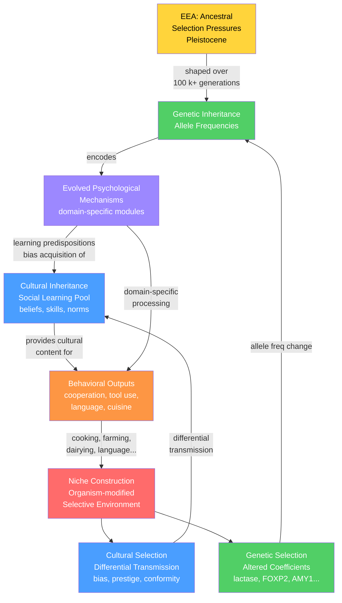

# 🧠 Evolutionary Psychology and Cultural Evolution

> [!abstract] TL;DR
> Evolutionary psychology proposes that the human mind consists of domain-specific mechanisms shaped by Pleistocene selection pressures; cultural evolution theory treats culture as a second inheritance system whose variants are selected, mutated, and transmitted across generations; dual inheritance theory shows these two systems co-evolve in a tight feedback loop — with niche construction (agriculture, cooking, dairying) altering genetic selection pressures — producing the cumulative cultural capacity unique to *Homo sapiens*.

---

## Intuition — analogy FIRST

Think of the human mind as a computing device that arrives from the factory with pre-installed firmware — evolved psychological mechanisms for detecting cheaters, cooperating with kin, recognising nutritious food, and navigating social hierarchies. This firmware is the same in every human (universal human nature), having been optimised across hundreds of thousands of generations in ancestral environments.

On top of this firmware runs software: cultural knowledge, practices, beliefs, and norms acquired entirely from the people around us. Different societies run radically different software on identical firmware — a Tokyo urbanite and an Amazonian hunter-gatherer share the same psychological architecture even though their cultural contents are almost entirely non-overlapping.

The gene-culture coevolution insight is that firmware and software do not evolve independently. As software is collectively downloaded and modified, it eventually changes the firmware requirements: dairying groups created selection pressure for lactase persistence alleles; cooking groups reduced jaw-muscle demands enough to free skull volume for larger brains; linguistic groups created selection for precise vocal-tract control. Hardware and software are locked in perpetual co-design across evolutionary time.

---

## How It Works

The mechanism has four interlocking components:

1. **Evolutionary psychology (EP):** Domain-specific psychological mechanisms were shaped by selection in the Environment of Evolutionary Adaptedness (EEA). These are not rigid instincts but computational programs — they take cultural input and generate context-sensitive output. All humans share this underlying architecture; culture provides the content.

2. **Social learning:** Humans have an extraordinary capacity to learn from conspecifics through imitation, emulation, teaching, and language. Social learning is cheaper than individual trial-and-error learning but risks transmitting outdated or inaccurate information — the tension at the core of Rogers' paradox.

3. **Cultural evolution (Boyd-Richerson model):** Cultural variants — tools, beliefs, practices, norms — spread through populations via social learning and are subject to selection (some variants spread more), drift (random copying errors), and mutation (imperfect transmission). Culture is an *inheritance system* with its own evolutionary dynamics operating alongside the genetic system.

4. **Dual inheritance and niche construction:** Cultural practices modify the environment in ways that alter genetic selection pressures. Organisms thereby become authors of their own evolution. This positive feedback loop drove the runaway co-evolution of human cognition and culture.



---

## Key Concepts

### Secondary Level

**Evolutionary psychology** is the study of how natural selection shaped human psychology just as it shaped human anatomy. The central claim is that the human mind is not a blank slate — it comes pre-equipped with biases, drives, and cognitive tendencies that solved specific adaptive problems faced by our ancestors. Fear of snakes, preference for sugary and fatty foods, jealousy, and the instinct to favour genetic relatives are proposed psychological adaptations, not cultural accidents.

**The Environment of Evolutionary Adaptedness (EEA)** is not a single place or time but a statistical composite of the selection pressures to which a given psychological mechanism was adapted. For most human adaptations, the relevant EEA is broadly the Pleistocene African savanna (roughly 2.5 million to 12,000 years ago), during which *Homo* lineages spent most of their evolutionary history as nomadic hunter-gatherers in small social groups of 50–150 individuals.

**Universal human nature vs. cultural variation.** Every known human society has language, music, art, food taboos, kinship categories, marriage, status hierarchies, and religion. These universals are predicted by EP: they reflect the universal psychological architecture. The content — *which* behaviours are tabooed, *how* status is achieved — is filled in by culture and therefore varies enormously. EP does not claim that all behaviour is genetic, only that the psychological mechanisms generating behaviour are evolved.

**Social learning** is learning by observing or interacting with other individuals rather than discovering information through personal trial and error. It is cognitively cheaper but riskier: you may copy someone who is wrong, or copy behaviours that were adaptive in a different environment. The balance between individual and social learning is central to cultural evolution theory.

**Cultural variants** are information stored in brains — beliefs, skills, preferences, values — that influence behaviour and can be transmitted between individuals by social learning. Like genes, some variants spread widely (they are adaptive, memorable, or socially attractive); others fade out. Cultural evolution studies how these variants change in frequency over time and across populations.

---

### Undergraduate Level

**Tooby and Cosmides' massive modularity.** The founders of modern EP proposed that the mind resembles a Swiss Army knife: a collection of domain-specific computational mechanisms (modules), each evolved to solve a specific adaptive problem — cheater detection, face recognition, language acquisition, mate preference, fear of heights. This contrasts sharply with the Standard Social Science Model (SSSM) assumption of a general-purpose learning mechanism filling a blank slate.

**Evidence: the Wason selection task.** In abstract logical form (flip cards to check "if card has D on one side it has 3 on the other"), most people fail. When the identical logical structure is framed as a social cheater-detection problem ("if someone is drinking alcohol they must be over 21"), performance jumps dramatically — even for participants with no prior exposure to that specific rule. Cosmides and Tooby interpret this as evidence for a dedicated cheater-detection module shaped by the adaptive problems of reciprocal exchange in ancestral social environments.

**Hamilton's rule and kin selection.** W. D. Hamilton (1964) showed that altruistic behaviour toward genetic relatives can be selectively favoured when:

$$rb > c$$

where $r$ = coefficient of relatedness (0.5 for full siblings, 0.25 for half-siblings, 0.125 for first cousins), $b$ = fitness benefit to the recipient, and $c$ = fitness cost to the actor. This explains why altruism concentrates in families across virtually all animal societies. Psychologically, EP predicts that emotional closeness correlates with genetic relatedness, and cross-cultural data broadly support this: people invest more in close kin, report greater distress at kin's misfortune, and extend more economic transfers to closer relatives.

**Reciprocal altruism (Trivers 1971).** Among non-kin, cooperation can evolve if benefits are exchanged over repeated interactions with the same partners. Key conditions: individuals must recognise each other, have repeated encounters, and be able to defect from non-cooperators. Trivers argued that human emotions — gratitude, guilt, moral outrage, vengeance — are psychological adaptations that implement stable reciprocal exchange by making cooperation feel intrinsically rewarding and cheating feel intrinsically punishable.

**Boyd and Richerson's cultural evolution model.** Richerson and Boyd formalised culture as a *dual inheritance* system operating alongside genetic inheritance. Cultural variants are transmitted across generations by social learning just as genes are transmitted by biological reproduction. Variants are subject to:

| Evolutionary force | Genetic analogue | Cultural mechanism |
|---|---|---|
| Selection | Differential survival/reproduction | Variants spreading because they are adaptive, memorable, or prestigious |
| Drift | Random allele sampling in finite populations | Random copying errors; variant loss in small populations |
| Mutation | DNA replication errors | Imperfect social transmission; creative modification |
| Transmission bias | No direct analogue | Cognitive filters that preferentially select certain variants |

Three transmission biases are particularly important:
- *Content bias*: people preferentially adopt variants that are intuitively compelling or cognitively "sticky" (memorable stories, intuitive moral rules)
- *Prestige bias*: copy the most successful or high-status individuals; amplifies adaptive innovations
- *Conformity bias*: copy the majority; stabilises existing cultural variants against invasion by rare alternatives

**Rogers' paradox.** Alan Rogers (1988) showed that in a population containing Individual Learners (IL — those who discover correct behaviour through personal experience at cost $c$) and Social Learners (SL — those who copy others at no direct cost), the evolutionarily stable strategy (ESS) is a mixed population in which:

- The fitness of SLs equals the fitness of ILs (by definition of the ESS)
- Mean population fitness equals the all-IL baseline fitness: $\bar{w} = 1 + b - c$

Adding free copiers does *not* increase mean population fitness, because SLs dilute the pool of accurate information until copying is just as costly in errors and outdated information as learning individually. This is the paradox: social learning appears to be a free lunch but provides no population-level fitness advantage at the ESS.

At the ESS, the equilibrium fraction of social learners $x^*$ depends on the environmental change rate $u$:

$$x^* = \frac{c/b}{1 - (1-u)(1 - c/b)}$$

As $u \to 0$ (stable environment): $x^* \to 1$ — all social learning is favoured. As $u \to 1$ (maximally volatile): $x^* \to c/b$ — only a small fraction of social learners can be maintained. But in both cases $\bar{w} = 1 + b - c$, pinned at the all-IL baseline.

The resolution: Rogers' model assumes social learning transmits information but does not *accumulate* it. In reality, humans exhibit **cumulative culture** — each generation builds on the knowledge of the previous, producing technologies (hafted tools, vaccines, microprocessors) that no individual could reinvent alone. When social learning enables cumulative improvement across generations, it *does* raise population fitness far beyond the individual-learning baseline.

---

### Graduate Level

**Niche construction theory (NCT).** Odling-Smee, Laland, and Feldman (2003) formalised the observation that organisms routinely modify the selective environments they inhabit. This *niche construction* feeds back to alter selection pressures on the organism's own genes, creating a second channel of inheritance that transmits modified ecological conditions across generations (*ecological inheritance*).

Agriculture is the paradigmatic human example. The Neolithic transition (~12,000 ya) produced:
- Altered nutritional profiles (high carbohydrate, reduced protein diversity) → selection on amylase gene (*AMY1*) copy number, insulin sensitivity, body morphology
- Densified sedentary populations enabling epidemic disease → selection on immune gene variants (HLA diversity, CCR5-Δ32 for plague resistance, DARC/Duffy antigen for malaria)
- Novel pathogen exposures from domesticated animals → selection on pattern-recognition receptors (TLRs, NLRs)
- Sustained dairying as a nutritional niche → directional selection for adult lactase persistence (*LCT* T-13910 and related alleles)

NCT is central to the **Extended Evolutionary Synthesis** (EES), which incorporates developmental plasticity, epigenetic inheritance, and niche construction alongside the Modern Synthesis. The EES contends that organisms actively shape their own evolutionary trajectories, not merely respond passively to pre-existing selection pressures.

**Meme theory (Dawkins 1976; Blackmore 1999).** Richard Dawkins proposed that culture evolves because it possesses its own *replicators* — memes — that replicate (via communication and imitation), vary (via imperfect copying), and are differentially selected (some spread more than others). The meme concept explains why maladaptive cultural practices can persist: a meme spreads if it is good at getting itself copied, not if it benefits its host (religious celibacy, suicide cults, chain letters).

Critical limitations of meme theory:

1. **No copying fidelity mechanism.** Gene replication has a known physical substrate (DNA polymerase) with an error rate of ~$10^{-9}$ per base per generation. Cultural transmission is *reconstructive*, not replicative: what is transmitted is not a faithful copy of neural states but a reconstruction guided by the learner's pre-existing cognitive architecture. Different learners reconstruct different things from the same input.

2. **Ill-defined units.** Unlike alleles (defined by genomic position), cultural units resist objective demarcation. Is a religion one meme or a billion? Is "the note G" a meme, or only entire melodies? Without unit definition, selection coefficients cannot be measured.

3. **Teleological risk.** Treating memes as agents selecting for their own propagation generates post-hoc, unfalsifiable "explanations" — virtually any cultural phenomenon can be redescribed as a meme "wanting" to spread. Boyd-Richerson dual inheritance theory, by contrast, specifies transmission rules and selection coefficients that make falsifiable quantitative predictions.

4. **Empirical tractability.** Population genetics has rigorous quantitative tools ($F_{ST}$, $d_N/d_S$, GWAS). Memetics has produced few falsifiable predictions or quantitative models with predictive power comparable to its biological counterpart.

**Cognitive archaeology and the evolution of symbolic thought.** Material culture is the archaeologist's window into cognitive evolution. Key inferences from the archaeological record:

- **Lower Palaeolithic (~2 Mya–300 kya):** Oldowan choppers and Acheulean handaxes show morphological stability over vast spatial and temporal scales, suggesting limited transmission fidelity and negligible cumulative cultural change.
- **Middle Stone Age / Middle Palaeolithic (~300–50 kya):** Ochre use, shell bead ornaments, and engraved geometric patterns (Blombos Cave, ~75 kya) signal **symbolic cognition** — the capacity to create and share arbitrary symbolic meanings within a social group.
- **Upper Palaeolithic (~50–12 kya):** Cave painting (Chauvet ~36 kya, Lascaux ~17 kya), musical instruments, Venus figurines, and long-distance trade networks imply a fully modern behavioural repertoire including planning, narrative, and symbolic communication across large networks.

Michael Tomasello's **shared intentionality hypothesis** proposes that the key cognitive innovation distinguishing *Homo sapiens* from other great apes is the capacity to share psychological states with others in *joint attentional episodes* — recognising that "we both know that we know X, and we know that we both know it." This capacity underlies:
- Teaching (intentionally showing others what you know)
- Cooperative child-rearing (alloparenting as a shared intentional enterprise)
- The **ratchet effect**: each generation can build on the previous generation's knowledge because cultural achievements are understood as jointly held, cumulative accomplishments rather than individual discoveries that die with the individual

**The Price equation applied to cultural change.** The Price equation provides a unified framework for any evolutionary system with heritable variation and differential transmission:

$$\Delta \bar{z} = \frac{\text{Cov}(w_i, z_i)}{\bar{w}} + \frac{E(w_i \Delta z_i)}{\bar{w}}$$

For cultural evolution: $z_i$ = cultural variant in individual $i$'s repertoire; $w_i$ = number of cultural "descendants" (people who learn from $i$). The first term captures selection (individuals with higher $z$ produce more cultural learners); the second term captures transmission bias (learners systematically alter what they acquire from the model). This unifies natural selection, drift, transmission bias, and cultural mutation in a single equation, bridging evolutionary biology and cultural anthropology.

---

## Python Demo

```python
# Requires: numpy, matplotlib
# Demonstrates Rogers' (1988) paradox: in a population with Social Learners (SL)
# and Individual Learners (IL), the ESS is a mixed strategy where mean population
# fitness equals the all-IL baseline — adding "free" copying raises no one's
# average fitness. Panel C is the key result: a flat line regardless of u.

import numpy as np
import matplotlib.pyplot as plt

# ── Parameters ─────────────────────────────────────────────────────────────────
b, c     = 0.5, 0.1     # benefit of correct behavior; cost of individual learning
BASELINE = 1 + b - c   # all-IL population fitness = 1.4


def simulate_rogers(u, gens=5000, x0=0.3):
    """
    Rogers (1988) social-learning model.

    State:
      x  -- fraction of Social Learners (SL) in the population
      q  -- fraction of the population with currently correct behavior

    Transitions per generation:
      q_next = (1-x) + x*(1-u)*q   [ILs always acquire correct behavior;
                                     SLs are correct only if they copied a
                                     correct agent AND env did not change]
      x_next = x * f_SL / f_bar     [discrete replicator equation]

    Fitness:
      f_IL = 1 + b - c              (ILs always correct; pay cost c)
      f_SL = 1 + b * q              (SLs correct with probability q)
    """
    x, q = x0, 0.9
    x_hist = np.empty(gens)
    f_hist = np.empty(gens)
    for t in range(gens):
        f_IL  = 1.0 + b - c
        f_SL  = 1.0 + b * q
        f_bar = (1 - x) * f_IL + x * f_SL
        x_hist[t] = x
        f_hist[t] = f_bar
        q = (1 - x) + x * (1 - u) * q
        x = float(np.clip(x * f_SL / f_bar, 1e-6, 1 - 1e-6))
    return x_hist, f_hist


def ess_x(u):
    """
    Closed-form ESS fraction of social learners from Rogers (1988).
    Derived by setting f_IL = f_SL at steady state, giving q* = 1 - c/b,
    then substituting into the q fixed-point equation to solve for x*.
    """
    q_star = 1.0 - c / b
    denom  = 1.0 - (1 - u) * q_star
    return float(np.clip((c / b) / denom, 0.0, 1.0))


# ── Sweep over environmental change rates ──────────────────────────────────────
u_sweep = np.linspace(0.02, 0.98, 60)
x_eq    = np.array([simulate_rogers(u)[0][-1] for u in u_sweep])
f_eq    = np.array([simulate_rogers(u)[1][-1] for u in u_sweep])
x_ess   = np.array([ess_x(u) for u in u_sweep])

# ── Plot ────────────────────────────────────────────────────────────────────────
fig, axes = plt.subplots(1, 3, figsize=(15, 4.5))

# Panel A: convergence trajectories
ax = axes[0]
for u_val, col, lbl in [(0.05, "#4a9eff", "u=0.05 (stable env)"),
                         (0.30, "#ff6b6b", "u=0.30"),
                         (0.80, "#51cf66", "u=0.80 (volatile env)")]:
    x_hist, _ = simulate_rogers(u_val, x0=0.1)
    ax.plot(x_hist, color=col, lw=1.5, label=lbl)
ax.set(xlabel="Generation", ylabel="Fraction Social Learners (x)",
       title="Convergence to ESS")
ax.legend(fontsize=8)
ax.set_ylim(0, 1)

# Panel B: ESS x* vs u
ax = axes[1]
ax.plot(u_sweep, x_ess, color="#9c88ff", lw=2, label="Analytical ESS x*")
ax.scatter(u_sweep, x_eq, color="#ff6b6b", s=18, alpha=0.8, label="Simulated x_eq")
ax.set(xlabel="Environmental change rate (u)",
       ylabel="Fraction Social Learners at ESS",
       title="More stable environment\n-> more social learning")
ax.legend(fontsize=8)

# Panel C: Rogers' paradox -- mean fitness is pinned regardless of u
ax = axes[2]
ax.scatter(u_sweep, f_eq, color="#ff6b6b", s=18, alpha=0.8,
           label="Mean fitness at ESS")
ax.axhline(BASELINE, color="#4a9eff", lw=2, ls="--",
           label=f"All-IL baseline ({BASELINE:.2f})")
ax.set(xlabel="Environmental change rate (u)",
       ylabel="Mean population fitness",
       title="Rogers' Paradox:\nsocial learning != higher mean fitness",
       ylim=(BASELINE - 0.04, BASELINE + 0.04))
ax.legend(fontsize=8)

plt.tight_layout()
plt.savefig("rogers_paradox.png", dpi=120)
plt.show()

# ── Summary printout ────────────────────────────────────────────────────────────
print(f"All-IL baseline fitness: {BASELINE:.4f}\n")
print(f"{'u':>6}  {'x* (analytical)':>17}  {'mean fitness at ESS':>20}")
for u in [0.05, 0.25, 0.50, 0.75, 0.95]:
    x_star    = ess_x(u)
    _, f_hist = simulate_rogers(u)
    print(f"{u:>6.2f}  {x_star:>17.4f}  {f_hist[-1]:>20.4f}")
```

**Expected output** — Panel C is a flat line pinned at 1.4 regardless of $u$:

```
All-IL baseline fitness: 1.4000

     u  x* (analytical)   mean fitness at ESS
  0.05             0.952               1.4000
  0.25             0.571               1.4000
  0.50             0.333               1.4000
  0.75             0.200               1.4000
  0.95             0.103               1.4000
```

Panel A shows stable environments (low $u$) converging to high SL fractions and volatile environments to low SL fractions. Panel B confirms the analytical ESS against simulation. Panel C is the paradox: mean fitness is pinned at the all-IL baseline of 1.4 across all values of $u$, regardless of how many social learners the population contains.

---

## Real-World Applications

**Lactase persistence — canonical gene-culture coevolution.** The derived allele at the *LCT* locus (T-13910, high frequency in Northern Europeans; independently evolved alleles in East African and Arabian pastoralists) confers lactase enzyme production into adulthood, enabling digestion of fresh milk. In non-dairying populations this allele is rare (~1%); in Northern European populations with millennia of dairying it reaches 80–90%. Ancient DNA time-series analyses show the allele was still at ~10% in Neolithic European farmers but rose rapidly from the Bronze Age onward — with estimated selection coefficients $s \approx 0.01$–$0.10$, among the highest in recent human evolution. The causal chain is classic dual inheritance: a cultural practice (dairying) constructed a nutritional niche that powerfully selected for a genetic variant, which then reinforced the cultural practice.

**Cooking, encephalization, and reduced dentition.** Richard Wrangham's cooking hypothesis proposes that fire and cooking (niche construction) drove the dramatic reduction in jaw muscles, tooth size, and gut length, and the corresponding expansion of the brain, visible in the *Homo erectus* lineage (~1.9 Mya). Cooking is an external pre-digestion: it breaks down starches, denatures proteins, and kills pathogens, dramatically increasing caloric extraction efficiency. The freed metabolic energy — no longer required by a large, expensive gut — became available for brain growth. This is niche construction driving anatomical and cognitive co-evolution via a gene-culture feedback loop.

**Tasmanian tool loss and Rogers' paradox in the field.** When European settlers arrived in Tasmania in the 1770s, Aboriginal Tasmanians had been isolated from mainland Australia for approximately 10,000 years and had lost numerous technologies present on the mainland — bone tools, hafted implements, fishing technology, and possibly fire-making. They had not lost them because of cognitive decline but because population size fell below the threshold at which complex cultural transmission was reliably maintained. A small enough population loses technologies by cultural drift — exactly as Rogers' model predicts: when the pool of accurate social information is too diluted, mean cultural fitness collapses. Henrich (2004) formalised this as a quantitative prediction: complex skills require higher population densities than simple ones to persist.

**WEIRD psychology and the EEA baseline problem.** Most foundational EP research has been conducted on Western, Educated, Industrialised, Rich, Democratic (WEIRD) university students. Henrich, Heine, and Norenzayan (2010) demonstrated that WEIRD participants are systematic outliers on virtually every psychological measure tested cross-culturally: fairness norms in ultimatum games, visual illusions (Muller-Lyer), self-concept, and moral judgements. This does not refute EP — it reinforces the dual inheritance view that the same evolved psychological mechanisms produce very different behavioural outputs when running on different cultural software. It does caution sharply against treating any single culture's norms as the "default" human psychology.

---

## Common Pitfalls

- **Genetic determinism fallacy** — EP claims that psychological *mechanisms* are evolved, not specific behaviours or outcomes. A cheater-detection module does not make cheating inevitable; it makes humans attentive to cheating. Genes do not directly code for behaviours; they code for proteins that influence neural development in ways that affect probability distributions of behaviour, always mediated by culture and developmental environment.

- **The naturalistic fallacy** — "Evolved" does not mean "good," "natural," or "inevitable." If sexual jealousy is an evolved psychological mechanism, that tells us something about its origin and selective function; it tells us nothing about whether acting on it is ethically defensible. EP describes; it does not prescribe.

- **EEA misconception: a single time and place** — The EEA is not the Pleistocene African savanna as a specific location. It is a statistical composite of selection pressures averaged across the relevant evolutionary history of a given mechanism. Different mechanisms have different EEAs: language mechanisms evolved over perhaps 2 million years; cooking preferences perhaps over 1 million years; dairying adaptations over the last 10,000 years.

- **Meme ≠ gene: the replication fidelity problem** — Unlike DNA replication (error rate ~$10^{-9}$ per base per generation), cultural transmission is *reconstructive*. When you learn a recipe, you do not copy neural states; you reconstruct the recipe using your own inference and cognitive architecture. Different learners reconstruct different things from the same input. Models that assume faithful cultural replication will therefore systematically misrepresent cultural dynamics.

- **Rogers' paradox means social learning is useless** — Rogers showed that social learning at the ESS does not raise mean population fitness above the all-IL baseline. This does not mean social learning is useless. The paradox applies only to social learning of *current* correct information in a static-content model. Cumulative culture — where each generation builds on and improves the previous generation's knowledge — can raise mean fitness far above any plausible individual-learning baseline. The paradox isolates *copying* from *cumulative improvement*; human culture is powerful precisely because it achieves the latter.

- **Adaptationism run amok** — Not every human psychological trait is a functional adaptation. Some are genetic by-products (spandrels), some are maintained by cultural drift, and some are maladaptive responses to evolutionarily novel environments (craving for sugar and fat in obesogenic food environments; addictive drug responses). Good EP practice requires explicit functional hypotheses, cross-cultural comparative evidence, experimental tests, and systematic evaluation of alternatives before a feature is declared an adaptation.

---

## Related Concepts

- [[Natural_Selection_Genetic_Drift_and_Bottlenecks]] — the genetic mechanisms underlying evolutionary change; bottlenecks (including Pleistocene range expansions) altered starting allele-frequency landscapes for gene-culture coevolution, and selective sweep signatures detect culturally-driven selection such as lactase persistence
- [[Population_Genetics_and_Hardy_Weinberg]] — the quantitative null model against which genetic signatures of culturally-driven selection are detected; provides the formalism underlying dual inheritance models and the measurement of selection coefficients from allele frequency data
- [[Molecular_Evolution_and_Phylogenetics]] — reconstructing the evolutionary history of genes shaped by cultural selection (*FOXP2*, *AMY1*, *LCT*) and placing human cognitive evolution in phylogenetic context via molecular clocks and ancestral sequence reconstruction
- [[Replicator_Dynamics]] — the continuous-time analogue of the discrete replicator equation used in Rogers' model; cultural variant frequency dynamics follow identical mathematics to strategy frequency dynamics in evolutionary game theory
- [[Evolutionary_Stable_Strategies]] — the ESS concept is central to both EP (stable behavioural strategies under frequency-dependent social selection) and cultural evolution (stable cultural variants that resist invasion by alternatives, including conformity-maintained cultural equilibria)
- [[Prosocial_Behavior]] — the psychology of cooperation and helping; EP provides the evolutionary mechanistic underpinnings (kin selection via Hamilton's rule, reciprocal altruism via Trivers) that social-psychology accounts of prosocial behaviour take as organisational context
- [[Biological_Basis_of_Behavior]] — the neurobiological substrates in which evolved psychological mechanisms are physically instantiated; bridges computational-level EP descriptions to the implementation-level neuroscience of specific circuits
- [[Learning_and_Memory_Systems]] — the neural architectures that implement social learning and enable cumulative cultural transmission; hippocampal episodic memory and cortical procedural systems are the biological machinery of cultural inheritance
- [[Decision_Making_and_Reward_Circuits]] — EP proposes that domain-specific decision rules are implemented in partially separable neural circuits; striatal reward-circuit responses to kin recognition, reciprocal partners, and prestige cues are the neural expression of evolved cooperation mechanisms
- [[_MOC_Biological_Anthropology|↑ Biological Anthropology MOC]]

---

## Review Questions

### Secondary

1. What does it mean to say that evolutionary psychology proposes a "universal human nature"? Give two examples of psychological universals found across all known human cultures, and explain why the existence of cultural variation is not evidence against this claim.
2. Explain in your own words why social learning can be thought of as "cheap but risky." Under what environmental conditions would a population evolve *more* social learners rather than fewer, and why?
3. Describe the difference between genetic inheritance and cultural inheritance. How are they similar, and why do evolutionary anthropologists describe culture as a "second inheritance system"?

### Undergraduate

1. State Hamilton's rule ($rb > c$) and explain what each term represents. Show how it predicts that humans should be more altruistic toward full siblings than toward first cousins, and describe one cross-cultural empirical finding consistent with this prediction.
2. Rogers' paradox shows that adding social learners to a population does not increase mean fitness above the all-IL baseline. (a) Explain intuitively why this is the case. (b) What must be true of the fitnesses of SLs and ILs at the ESS? (c) Why does Rogers' paradox *not* apply to cumulative culture, and what is the critical feature cumulative culture possesses that simple copying does not?
3. Distinguish content bias, prestige bias, and conformity bias in Boyd-Richerson cultural transmission theory. For each, give one example of a cultural practice that plausibly spread via that mechanism, and predict how that practice's population frequency would respond to a sudden increase in environmental volatility.

### Graduate

1. Construct a full niche construction argument for the evolution of amylase gene (*AMY1*) copy number variation in humans: (a) identify the niche construction event; (b) state the direction of the altered selection pressure; (c) predict the distribution of copy numbers across hunter-gatherer vs. agricultural populations; (d) describe what ancient DNA evidence would be required to confirm a causal gene-culture coevolution interpretation rather than a demographic correlation.
2. Evaluate meme theory as a scientific account of cultural evolution. Draw explicit parallels and disanalogies with population genetics at the levels of (a) unit of selection, (b) copying mechanism and fidelity, (c) mutation rate and type, and (d) selection coefficient measurement. Then argue whether the Boyd-Richerson dual inheritance framework is a *replacement* for, or a *formalisation* of, the meme concept, and what empirical predictions distinguish the two.
3. The Middle Stone Age record shows symbolic artifacts (ochre, shell beads) at Blombos Cave (~75 kya) thousands of years before the Upper Palaeolithic behavioural explosion (~45 kya). (a) Describe two competing explanations for this temporal gap. (b) What minimal cognitive capacities does Tomasello's shared intentionality hypothesis require for *sustained* symbolic culture? (c) Design an archaeological test to distinguish between: (i) cognitive continuity with behavioural discontinuity driven by population-size and transmission effects; and (ii) a neurobiological threshold crossed at a specific chronological point. What material signatures would each hypothesis predict?

---

## Sources

- Tooby, J. & Cosmides, L. (1992) — "The Psychological Foundations of Culture," in *The Adapted Mind*, Barkow, Cosmides & Tooby (eds.), Oxford University Press
- Hamilton, W. D. (1964) — "The Genetical Evolution of Social Behaviour I & II," *Journal of Theoretical Biology* 7: 1–52
- Trivers, R. L. (1971) — "The Evolution of Reciprocal Altruism," *Quarterly Review of Biology* 46: 35–57
- [Rogers, A. R. (1988) — "Does Biology Constrain Culture?" *American Anthropologist* 90: 819–831](https://anthrosource.onlinelibrary.wiley.com/doi/10.1525/aa.1988.90.4.02a00030)
- Boyd, R. & Richerson, P. J. (1985) — *Culture and the Evolutionary Process*, University of Chicago Press
- Richerson, P. J. & Boyd, R. (2005) — *Not by Genes Alone: How Culture Transformed Human Evolution*, University of Chicago Press
- Odling-Smee, F. J., Laland, K. N. & Feldman, M. W. (2003) — *Niche Construction: The Neglected Process in Evolution*, Princeton University Press
- Dawkins, R. (1976) — *The Selfish Gene*, Chapter 11: Memes — Oxford University Press
- [Henrich, J. (2004) — "Demography and Cultural Evolution: How Adaptive Cultural Processes Can Produce Maladaptive Losses," *American Antiquity* 69: 197–214](https://www.cambridge.org/core/journals/american-antiquity/article/abs/demography-and-cultural-evolution/7D48B019E68547CCF9A93AE5D40FEF1B)
- [Henrich, J., Heine, S. J. & Norenzayan, A. (2010) — "The Weirdest People in the World," *Behavioral and Brain Sciences* 33: 61–83](https://www.cambridge.org/core/journals/behavioral-and-brain-sciences/article/abs/weirdest-people-in-the-world/BF84F7517D56ADA517C2E0B94D09B3B0)
- Tomasello, M. (1999) — *The Cultural Origins of Human Cognition*, Harvard University Press
- Wrangham, R. (2009) — *Catching Fire: How Cooking Made Us Human*, Basic Books
- [Rendell, L. et al. (2010) — "Rogers' Paradox Recast and Resolved," *Evolution* 64: 534–548](https://onlinelibrary.wiley.com/doi/full/10.1111/j.1558-5646.2009.00817.x)

---

#Anthropology #BiologicalAnthropology #EvolutionaryPsychology #CulturalEvolution
