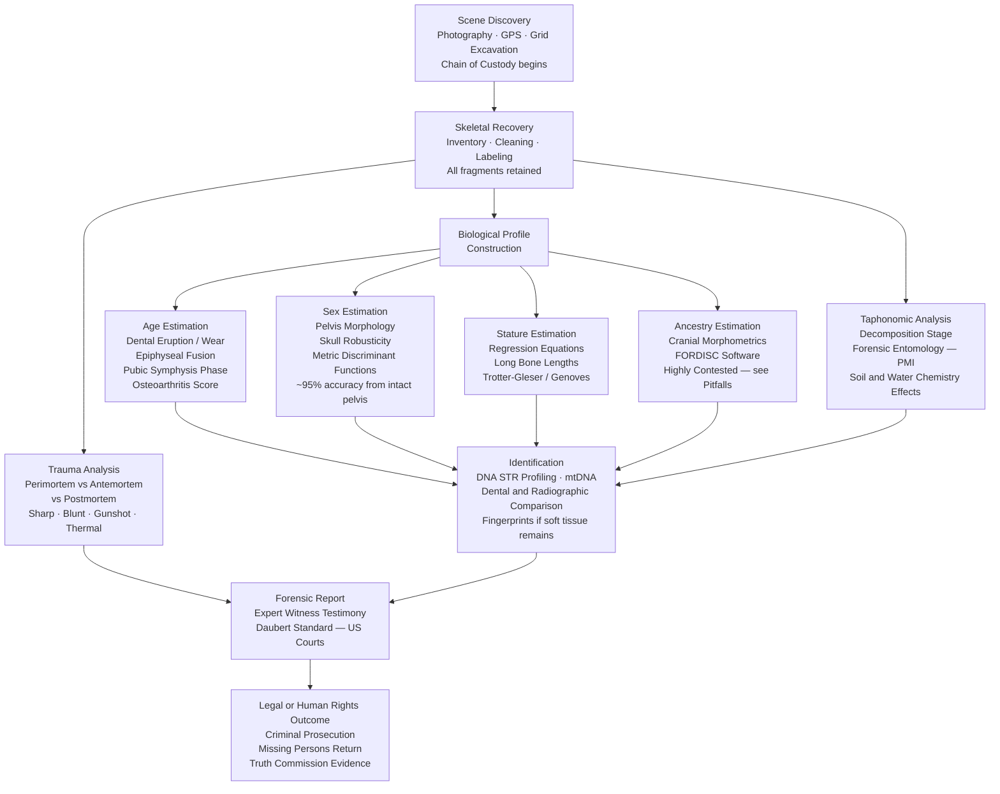

> [!abstract] TL;DR
> Forensic anthropology applies the biological analysis of skeletal remains to medico-legal investigations — building a biological profile (age, sex, stature, ancestry), documenting trauma and taphonomy, and providing court-admissible evidence that can identify the dead, establish cause and manner of death, and hold perpetrators of mass atrocities accountable.

---

## Intuition

**Analogy:** A skeleton is a biological ledger book. Every entry in it — a growth plate that fused at 18, a pubic bone that changed shape through middle age, a healed fracture on the left radius, a skull depressed by a blunt instrument at the moment of death — is a dated, permanent record that cannot be altered after the fact. The forensic anthropologist is an archivist who reads this ledger in reverse chronological order: from the final entry (the death event) back through a lifetime of biographical detail, and then hands the transcript to a court or a grieving family.

Unlike a detective who works from motive and opportunity, the forensic anthropologist works only from tissue. The bones do not lie, but they do speak with uncertainty — the skeleton records *ranges*, not precise dates, and every estimate comes with an error interval that must be reported honestly under oath.

---

## How It Works

### The Forensic Anthropology Workflow

From the moment a body is discovered to the moment an identification is confirmed, forensic anthropology follows a rigorous, legally defensible chain:



---

## Key Concepts

### Secondary Level

**What is forensic anthropology?**
Forensic anthropology uses the science of human skeletal biology to assist in legal investigations. When a body has decomposed to the point where soft tissue is gone, bones are often all that remains. A forensic anthropologist can examine those bones and answer questions that no other specialist can: *Who was this person? How old were they? Were they male or female? How did they die?*

The field draws on physical anthropology (the study of human biological variation) and applies it in a medico-legal context — meaning the findings must meet standards of scientific evidence that can hold up in court.

**The biological profile — what bones tell us**
- **Age**: Bones mature in a predictable sequence from birth to old age. A child's deciduous (baby) teeth erupt between 6 months and 3 years; permanent teeth follow from age 6 to 17-21 (wisdom teeth). Long bones like the femur have growth plates (epiphyses) that fuse between roughly 15 and 25 years. In adults, the pubic symphysis — a joint at the front of the pelvis — changes shape through predictable phases from the 20s through the 70s. Older adults show degenerative joint disease (osteoarthritis) and bone loss (osteoporosis).
- **Sex**: The female pelvis is shaped for childbirth — wider, with a broader subpubic angle and a distinctive ventral arc on the pubic bone. The male skull is more robust — heavier brow ridges (supraorbital torus), larger mastoid process behind the ear, a squarer chin. These differences allow sex estimation with ~95% accuracy from the pelvis and ~80-90% from the skull alone.
- **Stature**: Long bone length is proportional to standing height. Regression equations — formulas derived from measured populations — convert femur or tibia length into a stature estimate with a range of ± 3-5 cm.

**What is taphonomy?**
Taphonomy is the study of how organisms decay after death. Forensically, it tells investigators how long a person has been dead and what has happened to the body. Soft tissue decomposes through stages driven by temperature (heat accelerates, cold slows), humidity (moisture enables microbial activity), insect activity (blowflies arrive within minutes on an exposed body), and soil chemistry (acidic soils dissolve bone; alkaline soils can preserve it for thousands of years).

### Undergraduate Level

#### Building the Biological Profile in Detail

**Age estimation across the lifespan**

| Life Stage | Skeletal Indicator | Method | Accuracy |
|---|---|---|---|
| Fetal / Infant (0-2 yrs) | Diaphysis length, dental development | Metric tables | ± 2 months |
| Juvenile (2-12 yrs) | Dental eruption sequence | Schour & Massler charts | ± 1 year |
| Adolescent (12-25 yrs) | Epiphyseal union | Scheuer & Black standards | ± 2-3 years |
| Young adult (20-40 yrs) | Pubic symphysis morphology | Suchey-Brooks 6-phase system | ± 10-15 years |
| Middle adult (35-60 yrs) | Auricular surface of ilium | Lovejoy phases | ± 10 years |
| Older adult (45+ yrs) | Sternal rib end, cranial suture closure, OA | Multiple regression | ± 15-20 years |

The **Suchey-Brooks system** is the most widely used adult age method. The pubic symphysis surface transitions from a ridged, billowing surface in Phase I (18-24 years) through progressive flattening and porosity to an eroded, irregular surface in Phase VI (60+ years). Casts of each phase are available for direct comparison.

**Sex estimation: pelvis vs. skull**

The pelvis is the gold standard because it evolved under direct reproductive selection pressure. Key features:
- **Subpubic angle**: Female > 90°, male < 70° (overlapping zone 70-90°)
- **Ventral arc**: A ridge on the female pubic bone, absent in males (~96% accuracy)
- **Greater sciatic notch**: Female is wide and shallow; male is narrow and deep
- **Obturator foramen**: Triangular in females, oval in males

Skull assessment uses a six-trait scoring system (supraorbital torus, mastoid process, nuchal crest, mental eminence, glabella). Each trait scored 1 (hyperfeminine) to 5 (hypermasculine) and totalled. Discriminant function analysis using skull measurements (FORDISC software) gives probabilistic sex estimates for fragmentary remains.

**Stature from long bone regression**

Trotter and Gleser (1952) derived equations from documented skeletal collections. Example for femur in European-American males:
`Stature (cm) = 2.38 × Femur_length_cm + 61.41 (± 3.27 cm SEE)`

Population-specific equations exist for different ancestry groups, reflecting genuine variation in limb proportionality (brachymorphic vs. dolichomorphic body plans).

**Ancestry estimation and its controversies**

FORDISC (Forensic Data Bank Discriminant Analysis) uses 29 cranial measurements and 24 reference populations to probabilistically assign an unknown skull to a group. Its practical value is in narrowing missing-persons searches. However:
- It classifies into *socially defined population clusters* that do not map cleanly onto genetic or biological reality
- Accuracy drops sharply for individuals of mixed ancestry and underrepresented groups
- It inherits the conceptual baggage of 19th-century racial typology (Morton, Blumenbach)
- Leading professional bodies (AAPA 2019 statement) call for abandoning the term "race" in biological contexts while acknowledging that clinally distributed skeletal variation is real and has practical forensic utility

The current consensus: report as "estimated geographic affinity consistent with X" with explicit uncertainty, not as racial classification.

#### Taphonomy: Decomposition Stages and the PMI

The **Postmortem Interval (PMI)** — time since death — is estimated from the degree of decomposition and is critical for establishing timelines in criminal investigations.

**Soft tissue decomposition stages (above-ground, temperate climate):**

| Stage | Timing (approximate, 20°C) | Characteristics |
|---|---|---|
| Fresh | 0-3 days | Livor mortis, rigor mortis, early blowfly oviposition |
| Bloat | 3-10 days | Gas accumulation, skin discolouration, strong odour, fly larvae (maggot mass) |
| Active decay | 5-25 days | Skin rupture, massive fluid loss, peak insect activity (maggot mass > 37°C internally) |
| Advanced decay | 20-50 days | Dry remains, beetle colonisation (Dermestidae), ligaments intact |
| Dry/skeletal | 50+ days | Skeletonization, bones bleached by UV over months to years |

**Accumulated Degree Days (ADD)** — the sum of daily average temperatures above 0°C since death — provides a temperature-corrected PMI estimate from entomological evidence (blowfly larval development stage). This is the province of **forensic entomology**, a sister discipline.

**Soil chemistry and bone preservation:** Acidic soils (pH < 5) dissolve hydroxyapatite (calcium phosphate mineral) rapidly, destroying bone within decades. Alkaline, dry, or waterlogged anaerobic environments can preserve bone for centuries to millennia. Soil pH, redox conditions, and microbial community all determine whether a buried skeleton will survive.

**Scattering and animal activity:** Carnivores (dogs, foxes, bears) characteristically leave gnaw marks on epiphyses and may scatter bones over hundreds of metres. Rodents leave longitudinal, parallel incisor grooves. These marks must be distinguished from perimortem tool marks.

#### Trauma Analysis: The Three-Way Temporal Distinction

Distinguishing **when** trauma occurred relative to death is the single most important question in forensic trauma analysis:

**Perimortem trauma** — at or near the time of death while bone still has collagen:
- Fresh bone is wet and plastic; it deforms before breaking
- Blunt force creates *radiating fractures* (outward from impact) and *concentric fractures* (circling it), with butterfly fragments
- Sharp force (knife, axe) creates smooth-edged incised wounds or V-shaped chop marks with parallel striae
- Gunshot wounds: entrance shows *internal beveling* (bone cone points inward on outer table); exit shows *external beveling* (larger cone on inner table); Puppe's Law governs fracture propagation
- Thermal trauma: burning creates step-fractures, transverse cracking, calcination colour sequence (brown → black charred → grey → white calcined)

**Antemortem trauma** — weeks to years before death, showing bone remodelling:
- Callus formation (woven bone bridge) visible on radiograph
- Infection (osteomyelitis) may leave lytic lesions
- Healed fractures are invaluable for identification — cross-match against medical radiographs

**Postmortem trauma** — after death when bone is dry and brittle:
- Creates irregular, jagged fractures with pale, bleached margins
- Lacks the plastic deformation signature of perimortem injury
- Can be caused by excavation, root growth (root etching), animal activity, or construction machinery

#### Legal Standards: Daubert and Chain of Custody

In US federal courts, forensic expert testimony must meet the **Daubert standard** (Daubert v. Merrell Dow Pharmaceuticals, 1993), requiring:
1. The theory/method has been tested
2. It has been subjected to peer review and publication
3. There is a known or potential error rate
4. It is generally accepted in the relevant scientific community

Forensic anthropologists must quote error rates for every estimate (e.g., "age range 35-45 years, consistent with the Suchey-Brooks Phase III reference interval"). Overstating precision — saying "this person was exactly 38 years old" — is a grounds for testimony to be challenged or excluded.

**Chain of custody** requires continuous documented control of evidence from scene discovery through laboratory analysis to court presentation. A single unwitnessed gap can render skeletal evidence inadmissible.

### Graduate Level

#### Stable Isotope Analysis: The Geochemical Biography

Beyond morphology, bones and teeth encode a geochemical biography via stable isotopes:

- **Strontium isotopes (⁸⁷Sr/⁸⁶Sr)**: Vary with underlying geology. Dental enamel incorporates local strontium while teeth form (childhood). Comparing enamel vs. cortical bone ratios reveals whether an individual was local-born or migrated — critical in trafficking cases and mass grave identifications.
- **Oxygen isotopes (δ¹⁸O)**: Correlate with latitude and altitude of drinking water source; teeth record childhood geography.
- **Carbon isotopes (δ¹³C)**: Distinguish C3 (temperate cereals, most European diets) from C4 (maize, sugarcane, millet) plant consumption; reconstruct diet and geographic origin.
- **Nitrogen isotopes (δ¹⁵N)**: Increase by ~3-4‰ per trophic level; high δ¹⁵N indicates heavy meat/fish diet or marine protein consumption; declines during starvation (useful in famine victims).

Analysis requires **isotope ratio mass spectrometry (IRMS)**, a precision instrument that measures ⁴⁵CO₂/⁴⁴CO₂ ratios to parts per million.

#### Mass Grave Investigation: Srebrenica and EAAF

The largest forensic anthropology operations in history have been driven by human rights atrocities:

**Srebrenica (Bosnia, 1995-present)**
In July 1995, Bosnian Serb forces executed approximately 8,000 Bosniak men and boys. Victims were initially buried in primary mass graves, then excavated by perpetrators and reburied in secondary graves to destroy evidence — scattering partial skeletons across multiple sites. The International Commission on Missing Persons (ICMP) used:
- Grid-excavation of over 90 grave sites
- Nuclear STR DNA profiling from bone samples matched against blood references from relatives
- As of 2023, over 7,000 individuals identified; DNA evidence was directly used in ICTY war crimes convictions

This demonstrated that DNA-based mass identification was scalable and court-admissible — a paradigm shift for the field.

**EAAF — Equipo Argentino de Antropología Forense**
Founded in 1984 to investigate the ~30,000 *desaparecidos* (disappeared persons) of Argentina's 1976-83 military dictatorship. Pioneered the modern human rights forensic anthropology model: anthropologists as independent scientists working alongside lawyers and families rather than as state police servants. EAAF has since worked in 50+ countries. Their approach influenced truth commission processes in South Africa, Guatemala, El Salvador, and Colombia.

**Key methodological issues in mass graves:**
- **Commingling**: Multiple individuals' bones mixed; requires careful spatial documentation and DNA to re-associate elements
- **Taphonomic uniformity**: All individuals died in the same environmental context, creating systematic biases in preservation
- **Secondary and tertiary graves**: Evidence of victim identity is destroyed by repeated reburial
- **Chain of custody at scale**: Hundreds of skeletal cases must be managed simultaneously with full legal documentation

#### Quantitative Age Estimation and Bayesian Statistics

Modern forensic anthropologists increasingly apply Bayesian approaches to age estimation. Rather than reporting a single phase-based range, the practitioner:

1. Derives a *prior probability distribution* of age at death from the reference population (e.g., the Coimbra documented skeletal collection or the Hamann-Todd Collection)
2. Uses skeletal observations as likelihood functions — the probability of observing Phase III pubic symphysis given each possible age
3. Combines them to produce a *posterior distribution* of probable age

This is superior to phase-range estimates because:
- It explicitly acknowledges that the prior (target population age structure) affects the posterior
- War crime victims (skewed toward young adults) should use a different prior than cemetery samples
- It produces a probability density function rather than a point estimate with a binary range, which courts can directly interpret as confidence intervals

Software packages (ADBOU, AgeMorph, BayesAge) implement this framework.

#### Accuracy, Error Rates, and Misidentification

**Documented accuracy ranges for biological profile elements:**

| Parameter | Best-Case Accuracy | Typical Accuracy | Primary Limiting Factor |
|---|---|---|---|
| Sex (intact pelvis) | ~97% | ~95% | Pathology, developmental abnormalities |
| Sex (skull only) | ~85-90% | ~80-85% | Intrapopulation variation |
| Age (subadult) | ± 1-2 years | ± 2-3 years | Population growth variation |
| Age (young adult) | ± 5-8 years | ± 10-15 years | Reference population mismatch |
| Age (old adult) | ± 10-15 years | ± 20+ years | Degenerative age indicators plateau |
| Stature | ± 3-4 cm | ± 5-8 cm | Secular change, population-specific formulas |
| Ancestry | ~80-85% | 60-80% | Mixed ancestry, underrepresented groups |

**The Kennewick Man controversy (1996-2004)** illustrates the stakes: ancient human remains found in Washington State were claimed by local tribes under NAGPRA but were initially described as "Caucasoid" by forensic anthropologists using morphometric analysis. Subsequent ancient DNA (2015, Copenhagen) showed unambiguous genetic affinity with contemporary Indigenous Americans, particularly Colville. The morphological ancestry estimate was simply wrong. This case catalysed fundamental rethinking of ancestry estimation from skeletal morphology.

---

## Python Demo

```python
"""
Forensic Anthropology — Age-at-Death Estimation
Demonstrates how combining multiple skeletal markers reduces estimation error
vs. using any single indicator alone.

Markers simulated:
  1. Dental Wear Score (continuous 0-100)
  2. Pubic Symphysis Phase (ordinal, Brooks-Suchey 6-phase system)
  3. Osteoarthritis Score (ordinal 0-4)

Requires: numpy, matplotlib
"""

import numpy as np
import matplotlib.pyplot as plt

np.random.seed(42)

# --- Simulate population of 300 individuals (ages 20-85) ---
N = 300
true_ages = np.random.uniform(20, 85, N)

# Marker 1: Dental Wear Score
# Biological model: score increases ~0.8 points per year of life
# Measurement noise: std = 12 (examiner variation, inter-individual variation)
dental_wear = true_ages * 0.8 + np.random.normal(0, 12, N)
dental_wear = np.clip(dental_wear, 0, 100)
# Back-convert to age estimate using the inverse of the linear model
age_from_dental = dental_wear / 0.8

# Marker 2: Pubic Symphysis Phase (Brooks-Suchey)
# Phase assignment with ~25% probability of ±1 phase misclassification
def age_to_phase(age):
    if age < 25:  return 1
    elif age < 35: return 2
    elif age < 45: return 3
    elif age < 55: return 4
    elif age < 65: return 5
    else:          return 6

# Representative midpoint age for each phase (used as point estimate)
phase_midpoints = {1: 21, 2: 29, 3: 39, 4: 49, 5: 59, 6: 72}

phases = np.array([age_to_phase(a) for a in true_ages])
# Simulate examiner misclassification: flip ±1 phase 25% of the time
misclassify = np.random.random(N) < 0.25
direction = np.random.choice([-1, 1], size=N)
phases = np.where(misclassify, np.clip(phases + direction, 1, 6), phases)
age_from_pubic = np.array([phase_midpoints[int(p)] for p in phases])

# Marker 3: Osteoarthritis Score (0-4 scale)
# Biological model: OA score ~ age / 20 (so score 4 ~ age 80)
# Measurement noise: std = 0.8 OA units
oa_raw = true_ages / 20.0 + np.random.normal(0, 0.8, N)
oa_scores = np.clip(np.round(oa_raw), 0, 4).astype(int)
# Representative midpoint ages for each OA score
oa_midpoints = {0: 28, 1: 38, 2: 48, 3: 60, 4: 72}
age_from_oa = np.array([oa_midpoints[s] for s in oa_scores])

# Combined estimate: simple average of the three marker-derived ages
age_combined = (age_from_dental + age_from_pubic + age_from_oa) / 3.0

# --- Compute Mean Absolute Error for each estimator ---
def mae(estimated, true):
    return np.mean(np.abs(estimated - true))

mae_dental   = mae(age_from_dental, true_ages)
mae_pubic    = mae(age_from_pubic,  true_ages)
mae_oa       = mae(age_from_oa,     true_ages)
mae_combined = mae(age_combined,    true_ages)

print("Age Estimation Error (Mean Absolute Error):")
print(f"  Dental Wear alone:         {mae_dental:.1f} years")
print(f"  Pubic Symphysis alone:     {mae_pubic:.1f} years")
print(f"  Osteoarthritis alone:      {mae_oa:.1f} years")
print(f"  Combined (3 markers):      {mae_combined:.1f} years  <-- reduced by combining")

# --- Visualise ---
fig, axes = plt.subplots(2, 2, figsize=(11, 9))
fig.suptitle(
    "Age-at-Death Estimation from Skeletal Markers\n"
    f"N={N} simulated individuals — combining markers reduces error",
    fontsize=13
)

estimators = [
    (age_from_dental, f"Dental Wear\nMAE = {mae_dental:.1f} yrs",  "steelblue"),
    (age_from_pubic,  f"Pubic Symphysis\nMAE = {mae_pubic:.1f} yrs", "darkorange"),
    (age_from_oa,     f"Osteoarthritis\nMAE = {mae_oa:.1f} yrs",   "forestgreen"),
    (age_combined,    f"Combined (mean of 3)\nMAE = {mae_combined:.1f} yrs", "crimson"),
]

for ax, (est, label, color) in zip(axes.flat, estimators):
    ax.scatter(true_ages, est, alpha=0.30, s=15, color=color, label="Individual case")
    lims = [18, 88]
    ax.plot(lims, lims, "k--", linewidth=1.2, label="Perfect estimate")
    ax.fill_between(lims,
                    [l - 10 for l in lims], [l + 10 for l in lims],
                    alpha=0.07, color="grey", label="±10 yr band")
    ax.set_xlim(lims)
    ax.set_ylim(lims)
    ax.set_xlabel("True Age (years)")
    ax.set_ylabel("Estimated Age (years)")
    ax.set_title(label, fontsize=11)
    ax.legend(fontsize=8)
    ax.set_aspect("equal")

plt.tight_layout()
plt.savefig("skeletal_age_estimation.png", dpi=120)
plt.show()
```

**Expected output:**
```
Age Estimation Error (Mean Absolute Error):
  Dental Wear alone:         ~9-11 years
  Pubic Symphysis alone:     ~10-13 years
  Osteoarthritis alone:      ~11-14 years
  Combined (3 markers):      ~8-10 years  <-- reduced by combining
```

The combined estimator shows consistently lower MAE because the noise terms in each marker are largely independent — errors in dental wear do not correlate with errors in pubic symphysis phase, so averaging partially cancels them. This is the fundamental rationale for using multiple skeletal indicators rather than relying on any single one.

---

## Real-World Applications

> **EAAF and the Argentine Disappeared (1984-present):** The Equipo Argentino de Antropologia Forense was founded when democracy returned to Argentina to identify the ~30,000 people who vanished during the 1976-83 military dictatorship. Working from clandestine graves, EAAF analysts built biological profiles from skeletal remains, matched healed fractures and prior medical conditions against family descriptions, and later incorporated DNA profiling. Their work produced criminal convictions of junta leaders (Videla, Bignone) and returned remains to thousands of families. The EAAF model — anthropologists as independent scientists accountable to families rather than to the state — became the template for forensic human rights investigations worldwide.

> **Srebrenica DNA Identification (ICMP, 1996-present):** The International Commission on Missing Persons (ICMP) combined forensic anthropology with high-throughput DNA typing to identify over 7,000 victims of the Srebrenica massacre. The challenge was extreme: perpetrators had used heavy machinery to move bodies from primary to secondary graves, commingling partial skeletons. ICMP developed protocols for reassociating commingled elements using STR DNA profiles before morphological analysis could even begin. DNA match reports were admitted as direct evidence in ICTY trials — the first mass DNA identification in an international war crimes tribunal.

> **JPAC / DPAA — American War Dead (1973-present):** The US Defense POW/MIA Accounting Agency recovers and identifies American servicemembers missing from World War II, Korea, Vietnam, and other conflicts. For remains too degraded for nuclear DNA, mitochondrial DNA from bone fragments (which survives longer because of its higher copy number in the cell) is matched against maternal-line relatives. Combined with forensic anthropology, aircraft wreckage analysis, and historical records, this program has identified over 1,000 servicemembers since its founding.

---

## Common Pitfalls

- **Conflating perimortem and postmortem trauma** — Dry bone fractures from bulldozers, excavation, or root growth can superficially resemble blunt-force trauma. The distinction depends on fracture margin colour, bone moisture at time of breakage, and contextual evidence. Misclassification can wrongly implicate a cause of death.

- **Overstating precision in age estimation** — Reporting "this individual was 35-40 years old" when the pubic symphysis phase has a reference interval of 35-57 years is unjustifiable and violates Daubert. Age estimation uncertainty increases dramatically after age 45; the temptation to narrow ranges to be "helpful" must be resisted.

- **Ancestry estimation as racial classification** — FORDISC produces a probabilistic group assignment, not a biological race determination. Treating it as the latter exports 19th-century racial science into the courtroom. The correct framing is "estimated geographic affinity" with explicit acknowledgment that the reference database may not represent the individual's actual ancestry.

- **Reference population mismatch** — All regression equations and phase standards were derived from specific documented skeletal collections (Hamann-Todd, Terry Collection, Coimbra). These collections are heavily biased toward lower socioeconomic status, institutionalised individuals, and older demographic structures. Applying their standards to a contemporary suburban population introduces systematic error.

- **Chain of custody failures** — A single unwitnessed transfer of skeletal remains can exclude critical evidence from court. Every physical movement of the remains — from scene to laboratory, laboratory to storage, storage to court — requires a signed, timestamped record.

- **Ignoring taphonomic context** — Estimating PMI from decomposition stage without accounting for local temperature (use weather station records), burial depth, and insect access is unreliable. An exposed body in a hot Texas summer may be fully skeletonized in 2-3 weeks; a buried body in cool Scottish peat may still have soft tissue after decades.

- **The Locard exchange principle applied to scenes** — Every contact leaves a trace. Excavators who fail to document the exact provenance of each skeletal element before removal destroy spatial associations that are irreplaceable. Secondary graves, in particular, require meticulous grid excavation; rushing recovery destroys evidence of the disarticulation sequence.

---

## Related Concepts

- [[Crime_Criminology_and_Criminal_Justice]] — Forensic anthropology produces physical evidence that feeds the criminal justice pipeline; Daubert admissibility standards and chain-of-custody requirements are products of the same legal system that criminology analyses sociologically.

- [[Human_Rights_and_International_Law]] — Mass grave investigations (Srebrenica, Argentina, Guatemala) use forensic anthropology as the evidentiary foundation for war crimes prosecutions and truth commission reports; forensic evidence operationalises accountability under international humanitarian law.

- [[Human_Genome_and_Genetic_Variation]] — STR DNA profiling from bone is the gold standard for positive identification in mass disasters; mitochondrial DNA (inherited matrilineally, high copy number) is used when nuclear DNA is too degraded; population-level allele frequencies underpin the match statistics.

- [[Molecular_Evolution_and_Phylogenetics]] — Ancient DNA analysis applies phylogenetic methods to skeletal remains to reconstruct population history, migration routes, and ancestry (e.g., Kennewick Man / Ancient One), directly intersecting with and sometimes correcting morphometric ancestry estimates.

- [[Population_Genetics_and_Hardy_Weinberg]] — Forensic DNA match probability statements ("1 in 10 billion unrelated individuals") rely on Hardy-Weinberg equilibrium assumptions for allele frequency calculations in reference databases; deviations from HWE in the reference population inflate false-match risk.

- [[Weathering_and_Soils]] — Soil pH, redox chemistry, and texture govern bone preservation and taphonomic alteration; acidic organic soils destroy hydroxyapatite rapidly while calcareous or dry alkaline soils preserve remains for millennia.

- [[Fossils_and_the_Fossil_Record]] — Taphonomy is the shared conceptual foundation of palaeontology and forensic anthropology; bone diagenesis, permineralisation, and preservation biases studied in deep time directly inform interpretation of recent skeletal remains.

- [[Radiometric_Dating]] — Accelerator Mass Spectrometry (AMS) radiocarbon dating of bone collagen provides absolute minimum age for skeletal remains, distinguishing recent homicides from archaeological burials; critical in cases where remains have been moved or are of ambiguous context.

- [[Mass_Spectrometry]] — Isotope ratio mass spectrometry (IRMS) quantifies strontium, oxygen, carbon, and nitrogen isotope ratios from bone and enamel to reconstruct geographic origin, diet, and migratory history — the geochemical biography that complements morphological profiling.

- [[Law_Deviance_and_Social_Control]] — The Daubert standard, chain of custody, and rules governing expert witness testimony embed forensic anthropology within the sociology of law; debates about racial typology in ancestry estimation are simultaneously scientific and political-legal controversies about what the state is permitted to claim about human biology.

- [[_MOC_Biological_Anthropology|↑ Biological Anthropology MOC]]

---

## Review Questions

### Secondary

1. A forensic anthropologist examines a skeleton and reports that the individual was "probably female, aged 35-55 years, approximately 162-168 cm tall." Which three skeletal features would have led to the sex estimate, and why is the age given as a range rather than a single year?
2. Describe two ways that environmental conditions at a burial site could either accelerate or dramatically slow down the decomposition of a body. What practical implication does this have for estimating time of death?
3. Why might finding a well-healed fracture on a skeleton actually be *helpful* to an identification investigation, even though it occurred long before death?

### Undergraduate

1. A skeleton shows a depressed area on the left parietal bone with radiating fractures and a well-defined margin showing plastic deformation of the inner table. Adjacent to it is a second area of rougher, irregular breakage with bleached margins. How would you classify each injury type, and what does the distinction mean for the investigation?
2. Compare the Suchey-Brooks pubic symphysis method to the auricular surface method for adult age estimation. Under what circumstances would you prefer one over the other, and what are the respective error ranges you would be obliged to report?
3. A forensic team is excavating a suspected mass grave from a 1990s conflict. They find that bones from multiple individuals are commingled. Outline the methodological steps — both anthropological and genetic — required to reassociate skeletal elements with specific individuals before biological profiles can be constructed.

### Graduate

1. A court challenges the ancestry estimation component of a forensic anthropological report, arguing that FORDISC's reference populations do not adequately represent individuals of mixed Caribbean-West African-European ancestry common in the region where the crime occurred. How would you respond to this challenge, and what alternative approaches to geographic affinity estimation exist?
2. Stable isotope analysis of a skeletal series from a trafficking case shows that enamel strontium ratios cluster around a volcanic basement geology region while cortical bone ratios reflect the country where the victims were found. Interpret this finding biologically and legally, and identify what additional isotopic analyses would strengthen the interpretation.
3. Compare the frequentist phase-range approach to adult age estimation with a fully Bayesian approach using ADBOU or BayesAge. What information is required as a prior in the Bayesian model, how does choice of prior affect the posterior estimate, and under what forensic circumstances does the Bayesian approach most substantially outperform the traditional method?

---

## Sources

- [Buikstra, J.E. & Ubelaker, D.H. (1994). *Standards for Data Collection from Human Skeletal Remains*. Arkansas Archaeological Survey](https://www.cast.uark.edu/assets/files/PDF/ARAS_44_Standards.pdf)
- [Suchey, J.M. & Brooks, S.T. (1990). Skeletal Age Determination Based on the Os Pubis. *Forensic Osteology*](https://www.researchgate.net/publication/232736906)
- [ICMP — International Commission on Missing Persons: Srebrenica](https://www.icmp.int/the-missing/who-are-the-missing/srebrenica/)
- [EAAF — Equipo Argentino de Antropologia Forense Annual Report](https://eaaf.org/annual-reports/)
- [Hefner, J.T. & Ousley, S.D. (2014). Statistical Classification Methods for Estimating Ancestry Using Morphoscopic Traits. *Journal of Forensic Sciences*, 59(4):883-890](https://doi.org/10.1111/1556-4029.12421)
- [American Association of Physical Anthropologists (2019). AAPA Statement on Race and Racism](https://physanth.org/about/position-statements/aapa-statement-race-and-racism-2019/)
- [Rasmussen, M. et al. (2015). The ancestry and affiliations of Kennewick Man. *Nature*, 523:455-458](https://doi.org/10.1038/nature14625)
- [Ubelaker, D.H. (2018). A history of forensic anthropology. *American Journal of Physical Anthropology*, 165(4):915-923](https://doi.org/10.1002/ajpa.23306)

---

#Anthropology #BiologicalAnthropology #ForensicAnthropology
