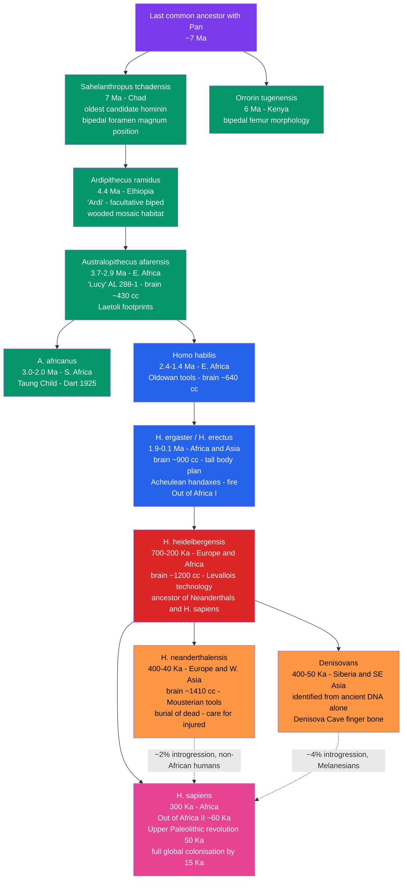

# 🦴 Human Evolution and Paleoanthropology

> [!abstract] TL;DR
> Paleoanthropology reconstructs the ~7-million-year history of the human lineage from African ape ancestors to *Homo sapiens* by integrating fossil anatomy, archaeological assemblages, and — since the 2010s — ancient DNA extracted from archaic bones. The field has confirmed a recent African origin for modern humans, overthrown a simple replacement model with evidence of 2–4% Neanderthal and Denisovan admixture in living non-African populations, and traced cognitive and behavioural modernity as a mosaic trait assembled over hundreds of thousands of years rather than a single "revolution."

---

## Intuition — analogy FIRST

Imagine all living humans as the single surviving twig at the end of a branch that was pruned heavily over seven million years. The original bush was dense: at least a dozen hominin species co-existed at various points, occupying different ecological niches across Africa and Eurasia. Most branches died without issue. One — ours — kept growing. Paleoanthropology is the detective discipline that pieces together the pruned branches from fossil fragments, campfire ash, and the shape of stone flakes, then reads the family history in strands of DNA extracted from 50,000-year-old bones.

The DNA reveals the pruning was never total: roughly 2% of the genome of every non-African human alive today is a living relic of Neanderthals — a memento of encounters as our ancestors spread out of Africa and met distant cousins who had occupied Eurasia for 300,000 years. Understanding where we came from, anatomically and genetically, is inseparable from understanding what diseases we are susceptible to, how our brains evolved language, and why genetic diversity is lower in Tokyo than in Nairobi.

---

## How It Works

### Core Mechanics

Paleoanthropology draws on three evidence streams:

1. **Fossil record** — bones and teeth of hominin individuals preserved by sediment burial in cave sites, lake margins, or volcanic ash deposits. Diagnostic features include cranial volume, facial prognathism, foramen magnum position, pelvis shape, and limb proportions.

2. **Archaeological record** — stone tools (lithic technology), cut-marked animal bones, hearths, pigment use, personal ornaments, and art. Technological modes track cognitive evolution independent of skeletal fossils.

3. **Molecular record** — ancient DNA (aDNA) from bones and teeth preserved in cold or dry conditions; mitochondrial DNA haplogroup lineages; nuclear genome-wide SNP data from living populations; isotopic signatures (oxygen, carbon, strontium) for diet and migration reconstruction.

### Hominin Phylogeny and Timeline



---

## Key Concepts / Details

### Secondary Level

**What makes a hominin?** "Hominin" (tribe Hominini) refers to the human lineage after its divergence from *Pan* (chimpanzees and bonobos) ~6–7 million years ago. Three anatomical traits define the clade:

1. **Habitual bipedalism** — walking upright on two legs as the default mode of locomotion. Anatomical correlates: repositioned foramen magnum (from the back of the skull to its base), broadened iliac blades, valgus knee (knock-kneed alignment bringing the foot under the centre of mass), arched foot absorbing impact shock, shortened and adducted big toe.

2. **Encephalization** — disproportionate increase in brain volume relative to body size. *Australopithecus* averages ~430–500 cc; early *Homo* reaches ~600–900 cc; *H. heidelbergensis* and Neanderthals reach ~1200–1410 cc; modern *H. sapiens* averages ~1350 cc. Encephalization is quantified by the **encephalization quotient (EQ)**: observed brain mass divided by the expected mass for a mammal of that body size. Human EQ ≈ 7; chimpanzee EQ ≈ 2.5.

3. **Tool use and cultural transmission** — systematic manufacture of stone tools, use of fire, and symbolic artefacts, passed on through social learning rather than genetics.

**Why did bipedalism evolve?** No single cause accounts for all evidence; three best-supported hypotheses:

- **Thermoregulation** — upright posture reduces the body surface area exposed to overhead equatorial sun and lifts the trunk above the hottest ground-level air layer.
- **Energy efficiency** — bipedal walking on flat terrain uses ~75% less energy per kilometre than chimpanzee knuckle-walking, an advantage for wide-ranging foragers.
- **Freeing the hands** — liberating the upper limbs for carrying food, infants, and tools is likely an exaptation rather than the primary driver; earliest bipeds (Ardipithecus) lived in woodland, not open savanna.

**Stone tool cultures (lithic industries) and their cognitive implications:**

| Industry | Age (Ka) | Primary species | Signature artefact | Cognitive demand |
|----------|----------|----------------|--------------------|-----------------|
| Oldowan | 3,300–1,700 | *H. habilis*, early *H. ergaster* | simple choppers, opportunistic flakes | basic causal reasoning |
| Acheulean | 1,760–130 | *H. ergaster*, *H. erectus* | symmetric bifacial handaxe | forward planning, mental template |
| Mousterian | 300–40 | Neanderthals, archaic *H. sapiens* | Levallois prepared-core flake tools | multi-step planning |
| Upper Paleolithic | 50–10 | *H. sapiens* | blades, burins, needles, personal ornaments, cave art | full symbolic cognition |

**Anatomically modern vs behaviourally modern.** *H. sapiens* with a fully modern skeleton — high rounded braincase, flat face, pronounced chin — appears by ~300 Ka (Jebel Irhoud, Morocco; Omo Kibish, Ethiopia). Robust, persistent symbolic behaviour — shell beads, structured ochre use, long-distance exchange of raw materials, figurative art — does not become widespread until ~50 Ka, the **Upper Paleolithic transition**. The ~250,000-year gap between anatomical and behavioural modernity is one of the field's central puzzles; proposed explanations include demographic threshold effects, the assembly of a "language-ready" brain, and climate-driven population connectivity.

---

### Undergraduate Level

**Dating methods in paleoanthropology.** No single radiometric clock covers all relevant timescales:

| Method | Material | Useful range | Principle |
|--------|----------|-------------|-----------|
| K/Ar and Ar/Ar | Volcanic ash (tuff) interbedded with fossils | 100 Ka – billions of years | $^{40}$K decay to $^{40}$Ar trapped in feldspar crystals at eruption |
| Uranium-series (U-Th) | Speleothems, bone, coral | 1 Ka – 600 Ka | $^{234}$U → $^{230}$Th ingrowth in closed carbonate system |
| OSL / TL | Sediment quartz; heated flint | 100 – 800 Ka | luminescence signal reset at burial (OSL) or heating (TL); measures accumulated radiation dose since |
| ESR | Tooth enamel | 1 Ka – 3 Ma | trapped electrons from ionising radiation; dose accumulates after tooth burial |
| AMS $^{14}$C | Bone collagen, charcoal, shell | up to ~50 Ka | $^{14}$C produced by cosmic rays decays; short half-life (~5,730 yr) limits upper range |
| Palaeomagnetism | Sediment columns | any age | geomagnetic reversals (Brunhes–Matuyama at 780 Ka) recorded in magnetite; correlates with global polarity time scale |
| Ancient DNA clock | Bone / tooth aDNA | up to ~800 Ka (permafrost) | neutral substitution rate × branch length calibrated against fossil-dated nodes |

**Out of Africa model vs Multiregional Continuity.** Two competing hypotheses dominated the late 20th century:

- **Out of Africa / "replacement":** *H. sapiens* evolved in Africa ~300–200 Ka and dispersed globally ~60–40 Ka, largely replacing archaic populations (*H. erectus* in Asia, Neanderthals in Europe) with minimal interbreeding.
- **Multiregional Continuity:** Modern humans evolved in parallel across Africa, Europe, and Asia from regional *H. erectus* populations, maintained as one species by continuous inter-regional gene flow.

Ancient DNA has **settled the debate in favour of OOA with low-level introgression**. The Neanderthal nuclear genome (Green et al. 2010) showed ~2% admixture uniquely in non-African modern humans — precisely consistent with a hybridisation event as *H. sapiens* exited Africa into Neanderthal-occupied western Eurasia ~50–60 Ka. Pure replacement and pure multiregionalism are both falsified; the reality is **recent African origin with residual introgression** from at least two archaic groups.

**The Denisovans.** A finger-bone fragment and two teeth from Denisova Cave, Siberia (2010) yielded a nuclear genome more divergent from modern humans than Neanderthals are, but the bone fragments were too small to assign to any known morphological species. These "Denisovans" were the first hominin taxon defined purely by genomics, with no diagnostic skull anatomy. Denisovan DNA contributes ~3–5% of the genome of contemporary Melanesians and Aboriginal Australians and ~0.2% in East Asians, indicating admixture during the eastward spread of *H. sapiens*. The strongest example of **adaptive introgression** from Denisovans: the *EPAS1* allele (hypoxia-inducible factor 2α) at high frequency in Tibetan populations confers improved oxygen metabolism at altitude and was selected strongly after transfer to modern humans.

**Cognitive evolution and the social brain hypothesis.** Robin Dunbar (1992) proposed that primate neocortex volume scales with social group complexity rather than ecological demands such as diet range. The "Dunbar number" (~150) — the predicted maximum stable social group size for *H. sapiens* based on neocortex ratio — matches observed hunter-gatherer band sizes, traditional village sizes, and military company cohesion across unrelated cultures. The hypothesis implies that encephalization in *Homo* was driven primarily by **social intelligence** — tracking alliances, detecting reciprocal cheating, theory of mind — rather than tool manufacture or foraging efficiency alone. Evidence: the strongest correlation with neocortex size across primates is group size, not ecological variables.

**The Toba bottleneck.** The Toba supervolcano eruption in Sumatra ~74 Ka produced the largest eruption of the past 2 million years. Ambrose (1998) proposed a subsequent volcanic winter reduced *H. sapiens* to a few thousand individuals, explaining the low genetic diversity of non-African populations relative to Sub-Saharan Africans. The hypothesis is **contested**: archaeological continuity in South India across the Toba ash layer and improved PSMC modelling suggest the bottleneck, while real, was less catastrophic than originally proposed. It remains difficult to disentangle the Toba bottleneck from the Out-of-Africa founding bottleneck in the genetic record.

---

### Graduate Level

**Ancient DNA — methodology and authentication.** Endogenous aDNA is chemically damaged: cytosine deamination (C→U) at single-strand overhangs produces characteristic C→T misincorporation signals at the 5' ends of fragments that authenticate genuinely ancient sequences and distinguish them from modern contamination. Standard pipeline:

- **Library preparation** from double-stranded DNA with end-repair and adapter ligation; short mean fragment length (50–150 bp) is expected and diagnostic of genuine aDNA.
- **UDG (uracil-DNA glycosylase) treatment** removes deaminated uracil residues before PCR amplification — reduces errors but destroys the damage signal; damage-half-treated libraries retain 5' C→T for authentication while removing 3' G→A artefacts.
- **mapDamage2.0** quantifies the C→T substitution frequency at each position from fragment ends; results are compared to the expected pattern for the claimed age and environment.
- **Competitive mapping** against the human reference genome vs. closely related non-human primate genomes estimates the endogenous fraction, which may be <1% in poorly preserved specimens.
- **Dual-index library preparation** with negative (blank) extraction controls and strict clean-room protocols to exclude modern human contamination.

Current temporal limit: ~800 Ka under Siberian permafrost (Denisova Cave specimens yield exceptional preservation); tropical fossils rarely exceed ~100 Ka.

**ABBA-BABA (D-statistics) test for introgression.** Given four populations in tree topology (((P1, P2), P3), Outgroup), shared derived alleles between P2 and P3 (ABBA patterns) vs. between P1 and P3 (BABA patterns) should be equal under a clean tree with no post-divergence gene flow. An excess of ABBA — positive D statistic — indicates gene flow between P3 and the ancestor of P2 after P1 and P2 diverged:

$$D = \frac{\sum(\text{ABBA}) - \sum(\text{BABA})}{\sum(\text{ABBA}) + \sum(\text{BABA})}$$

For the tree (((Yoruba, French), Neanderthal), Chimpanzee): $D > 0$ with $Z > 3$ in the Green et al. (2010) data — the first genome-wide statistical proof of Neanderthal admixture into non-African modern humans. The statistic generalises to the $f_3$ and $f_4$ statistics of Patterson et al. (2012), which support more complex admixture graph modelling.

**Functional impact of archaic introgression.** Neanderthal-derived haplotypes are not uniformly distributed in living genomes: they are **depleted** around protein-coding exons (purifying selection removed functionally deleterious variants over 50,000 generations) but **enriched** in immune-related, skin, hair, and metabolic loci where they may have provided local adaptation to Eurasian environments. Key documented examples:

- **COVID-19 severity locus (chr3, Zeberg & Pääbo 2020):** A ~50 kb Neanderthal-inherited haplotype confers ~3× increased risk of hospitalisation and respiratory failure from SARS-CoV-2. Frequency: ~30% in South Asians, ~8% in Europeans, near-zero in East Asians and Sub-Saharan Africans.
- **TLR1/6/10 cluster (Deschamps et al.):** Neanderthal variants at Toll-like receptors 1, 6, and 10 — innate immune sentinels for bacterial pathogens — are among the most strongly Neanderthal-introgressed regions in European genomes, suggesting benefit against Eurasian bacterial infections.
- **Type 2 diabetes risk allele SLC16A11:** A Neanderthal-derived haplotype at a liver metabolic gene is associated with ~25% increased T2D risk and is found at ~50% frequency in Indigenous Americans but <1% in Africans or Europeans.

**PSMC demographic reconstruction.** The Pairwise Sequentially Markovian Coalescent (Li & Durbin 2011) infers the history of effective population size $N_e(t)$ from a single diploid genome by partitioning the genome into non-overlapping segments and treating heterozygous sites as coalescent events at different times in the past. Applied across archaic and modern genomes:

- Pre-OOA *H. sapiens* had $N_e \approx 10{,}000$–$25{,}000$ — consistent with a long-lived small African population.
- A severe reduction in $N_e$ ~60–50 Ka corresponds to the OOA bottleneck and the Toba period.
- Neanderthal PSMC reveals a more dramatic population crash beginning ~400 Ka, consistent with the isolation of small European populations during interglacial cycling.
- Denisovan PSMC shows a distinct and even more prolonged low-$N_e$ history, consistent with a lineage isolated in Central and East Asian environments.

**Reticulate hominin evolution and African ghost lineages.** Beyond the well-documented Neanderthal and Denisovan admixtures, statistical analysis of West African genomes (Durvasula & Sankararaman 2020) detects genomic segments inconsistent with the standard OOA tree — attributable to admixture from an unsampled deeply divergent African archaic lineage ("ghost population"), possibly descended from *H. heidelbergensis*-like ancestors or *H. naledi* populations. The hominin phylogeny is not a clean bifurcating tree but a **reticulate network** in which admixture was a recurring feature throughout the genus *Homo*.

---

## Python Demo

```python
# Requires: numpy, matplotlib
# Demonstrates: Out-of-Africa expansion as a stepping-stone founder-effect model.
# Each geographic deme is colonised from the previous by a small founder group,
# creating a chain of bottlenecks that progressively erode genetic diversity with
# distance from Africa — a pattern confirmed in real human population data
# (Ramachandran et al. 2005, Prugnolle et al. 2005).

import numpy as np
import matplotlib.pyplot as plt

rng = np.random.default_rng(2024)

# ── Parameters ──────────────────────────────────────────────────────────────────
N_DEMES    = 18       # geographic positions: 0 = Sub-Saharan Africa, 17 = S. America
N_LOCI     = 300      # independent neutral biallelic loci (diversity proxy)
N_FOUNDERS = 50       # diploid founders per colonisation wave (bottleneck size)
N_STABLE   = 2_000    # stable deme Ne after population recovery
GEN_SMALL  = 8        # generations drifting at founder size (severe drift)
GEN_LARGE  = 40       # generations after recovery (weak drift at large Ne)

WAYPOINTS = [
    "Sub-Saharan Africa", "East Africa",  "Horn/Arabia", "S. Asia",
    "SE Asia",            "C. Asia",      "Levant",      "Anatolia",
    "SE Europe",          "C. Europe",    "N. Europe",   "Siberia C.",
    "Siberia NE",         "Beringia",     "Alaska",      "N. America",
    "C. America",         "S. America",
]

# ── Initialise Africa with near-maximal allele-frequency diversity ───────────────
# Africa: allele frequencies spread across (0.2, 0.8) — maximum heterozygosity
p = np.empty((N_DEMES, N_LOCI))
p[0] = rng.uniform(0.2, 0.8, N_LOCI)

def mean_H(freq_row):
    """Expected heterozygosity H = 2p(1-p) averaged over loci."""
    return float(np.mean(2.0 * freq_row * (1.0 - freq_row)))

diversity = np.empty(N_DEMES)
diversity[0] = mean_H(p[0])

# ── Stepping-stone colonisation with successive founder bottlenecks ─────────────
for deme in range(1, N_DEMES):
    source = np.clip(p[deme - 1], 0.0, 1.0)

    # Step 1: sample N_FOUNDERS diploid founders from the source deme
    counts = rng.binomial(2 * N_FOUNDERS, source)
    q = counts / (2 * N_FOUNDERS)

    # Step 2: drift for GEN_SMALL generations at small founder Ne
    for _ in range(GEN_SMALL):
        q = rng.binomial(2 * N_FOUNDERS, np.clip(q, 0, 1)) / (2 * N_FOUNDERS)

    # Step 3: population recovers to large stable size; drift weakens
    for _ in range(GEN_LARGE):
        q = rng.binomial(2 * N_STABLE, np.clip(q, 0, 1)) / (2 * N_STABLE)

    p[deme]        = q
    diversity[deme] = mean_H(q)

# ── Empirical reference: Ramachandran et al. 2005 linear regression ─────────────
# H_e = 0.761 - 0.000120 * dist_km_from_Addis_Ababa  (rough waypoint distances)
DIST_KM = np.array([
    0, 1500, 3200, 6000, 8500, 7000, 3800, 4500,
    5200, 5900, 6600, 8000, 9500, 12000, 13000, 15000, 16500, 18000,
], dtype=float)
H_empirical = np.clip(0.761 - 0.000120 * DIST_KM, 0, 1)

# ── Plot ─────────────────────────────────────────────────────────────────────────
fig, axes = plt.subplots(1, 2, figsize=(14, 5))

deme_idx = np.arange(N_DEMES)

# Panel A: simulated vs empirical diversity
ax = axes[0]
ax.plot(deme_idx, diversity, "o-", color="#e84393", lw=2, ms=7,
        label="Simulated (stepping-stone founder model)")
ax.plot(deme_idx, H_empirical, "--", color="#4a9eff", lw=2,
        label="Empirical regression (Ramachandran 2005)")
ax.set_xticks(deme_idx)
ax.set_xticklabels(WAYPOINTS, fontsize=6.5, rotation=55, ha="right")
ax.set_ylabel("Mean expected heterozygosity  H = 2p(1-p)")
ax.set_title(
    "Genetic diversity along the Out-of-Africa colonisation route\n"
    "(each step = founder-effect bottleneck)",
    fontsize=10,
)
ax.grid(alpha=0.3)
ax.legend(fontsize=8)
ax.annotate(
    "ORIGIN (Africa)", xy=(0, diversity[0]),
    xytext=(1.5, diversity[0] - 0.035),
    arrowprops=dict(arrowstyle="->", color="green"),
    fontsize=8, color="darkgreen",
)

# Panel B: allele frequency trajectories for 8 selected loci
ax2 = axes[1]
for locus in range(8):
    ax2.plot(deme_idx, p[:, locus], alpha=0.75, lw=1.5,
             label=f"Locus {locus + 1}")
ax2.set_xlabel("Deme (distance from Africa)")
ax2.set_ylabel("Allele frequency  p")
ax2.set_title(
    "Allele frequency drift along expansion route\n"
    "(alleles fix or are lost far from origin)",
    fontsize=10,
)
ax2.grid(alpha=0.3)
ax2.legend(fontsize=7, loc="upper right")

plt.tight_layout()
plt.show()

# ── Summary statistics ───────────────────────────────────────────────────────────
print(f"{'Deme':>2}  {'Waypoint':<22}  {'H':>6}  bar")
print("-" * 55)
for d in range(N_DEMES):
    bar = "X" * int(diversity[d] * 35)
    print(f"{d:>2}  {WAYPOINTS[d]:<22}  {diversity[d]:.4f}  {bar}")

pct_loss = (diversity[0] - diversity[-1]) / diversity[0] * 100
print(f"\nDiversity loss Africa to S. America: {pct_loss:.1f}%")
print("Empirical human data: ~10-15% reduction per 10,000 km from Addis Ababa")
```

Expected output: Panel A shows a downward-sloping diversity curve that closely tracks the empirical Ramachandran regression, with ~15–25% total diversity loss from Africa to South America. Panel B shows allele frequencies drifting toward fixation (p = 1) or loss (p = 0) at greater distances from Africa, with maximum spread near the African origin and decreasing variance at distal demes where the allele pool has been repeatedly filtered.

---

## Real-World Applications

> **Archaic introgression and COVID-19 severity.** A 50-kilobase haplotype on chromosome 3, inherited from Neanderthals ~50,000 years ago, is the strongest known genetic risk factor for severe COVID-19 — associated with a ~3-fold increase in hospitalisation risk. It reaches ~30% frequency in South Asian populations, ~8% in Europeans, and is near-absent in East Asians and Sub-Saharan Africans (Zeberg & Pääbo 2020). Neanderthal admixture that may have conferred immune benefits against Eurasian pathogens 50 Ka became a medical liability during a novel pandemic 70,000 years later.

> **Direct-to-consumer ancestry genomics.** Services such as 23andMe and AncestryDNA use genome-wide SNP arrays against population reference panels to assign ancestral origin. Their accuracy depends entirely on the founder-effect bottleneck patterns modelled in the Python demo above: each Out-of-Africa migration wave created distinct allele-frequency spectra that persist as geographic signals strong enough to statistically place individuals in broad ancestral regions. The "Neanderthal percentage" score is a direct readout of the archaic introgression measured by D-statistics.

> **Forensic anthropology and missing persons.** Mitochondrial DNA haplogroup lineages descend from the Out-of-Africa founder events and carry geographic information. Haplogroup L2 is characteristic of West African ancestry; M and N are OOA founding lineages; R underlies European and East Asian lineages. These haplogroups are used to narrow ethnicity in unidentified skeletal remains, trace the origins of enslaved individuals in historical cemeteries, and authenticate ancient specimens. The maternal specificity of mtDNA (no recombination) makes it robust even from highly degraded bone.

---

## Common Pitfalls

- **The "ladder of progress" fallacy** — depicting evolution as a straight progression from "ape" to "modern human" misrepresents a bushy phylogeny where multiple hominin species co-existed simultaneously. *H. sapiens* did not evolve *from* Neanderthals; both co-existed and partially interbred. Evolution is not directional toward a predetermined goal.

- **Confusing anatomically modern with behaviourally modern** — *H. sapiens* skeletons appear by 300 Ka but persistent symbolic behaviour does not become widespread until ~50 Ka. Treating 300 Ka modern anatomy as equivalent to full modern cognition is unsupported by the archaeological record, which shows sporadic, discontinuous symbolic episodes before the Upper Paleolithic transition.

- **Underestimating Neanderthal cognition** — a century of popular depiction portrayed Neanderthals as dim brutes. The evidence shows: slightly larger brains than modern average (~1410 cc), burial of the dead with apparent grave goods, sustained care for severely injured individuals who survived for years, likely use of ochre pigment and eagle-feather ornamentation (Cueva de los Aviones, ~115 Ka), and Mousterian tool complexity requiring multi-step planning.

- **Treating Out-of-Africa replacement as genomically complete** — ancient DNA conclusively demonstrates introgression from Neanderthals, Denisovans, and an unknown African archaic lineage. "Replacement" implies zero gene flow; "demographic turnover with residual introgression" is the accurate framing. Non-African genomes are ~2% Neanderthal, ~0.1–5% Denisovan — small but functionally significant fractions.

- **Over-precision in Pan–Homo divergence dating** — different mutation rate calibrations (clock rates from pedigree studies vs. phylogenetic calibrations) and different generation-time assumptions shift the Pan–Homo split from ~4 Ma to ~7 Ma. No single fossil or molecular date is definitive; the consensus range is 6–8 Ma. Publishing a single year figure without error bounds is misleading.

- **The "missing link" framing** — each newly discovered fossil species is sometimes heralded as "the missing link." The concept is biologically incoherent in a bushy phylogeny with multiple branching events and many co-existing lineages. Every ancestor–descendant pair in an evolutionary tree is separated by intermediates; there is no single gap to fill.

---

## Related Concepts

- [[Natural_Selection_Genetic_Drift_and_Bottlenecks]] — the Out-of-Africa founder events are textbook genetic bottlenecks; the stepping-stone model in this note directly applies Wright-Fisher sampling theory, effective population size, and the founder effect
- [[Molecular_Evolution_and_Phylogenetics]] — the molecular clock and maximum-likelihood / Bayesian phylogenetic methods that underpin hominin divergence dating and the phylogenomic placement of Denisovans
- [[Population_Genetics_and_Hardy_Weinberg]] — HWE, $F_{ST}$, and Tajima's D are used to measure the signature of OOA bottlenecks, population structure, and selection in modern human genomes
- [[Human_Genome_and_Genetic_Variation]] — catalogues the SNP diversity patterns (including reduced heterozygosity outside Africa and Neanderthal-introgressed haplotypes) that this note explains mechanistically
- [[Speciation_and_Reproductive_Isolation]] — Neanderthal and Denisovan admixture spans a fuzzy species boundary, directly illustrating "speciation with gene flow" and biological species concept limitations
- [[DNA_Sequencing_Technologies]] — next-generation short-read and third-generation long-read sequencing underpin all ancient-DNA analyses; library preparation, damage repair, and endogenous-fraction estimation are sequencing-technology problems
- [[Geologic_Time_Scale]] — hominin evolution spans the Pliocene (5.3–2.6 Ma) and the entire Pleistocene (2.6 Ma–11.7 Ka); contextualising hominin fossils against glacial–interglacial cycles and the stratigraphic record is essential
- [[Radiometric_Dating]] — K/Ar and Ar/Ar dating of volcanic tuffs interbedded with East African hominin deposits is the primary absolute chronometric method for pre-50-Ka specimens; OSL and ESR cover cave-site contexts
- [[Fossils_and_the_Fossil_Record]] — taphonomy explains the strong bias in the hominin fossil record toward cave sites, dense skeletal elements, and specific depositional environments; the incompleteness of the record is a taphonomic artefact
- [[Language_and_the_Brain]] — Broca's area endocast anatomy in *Homo* fossils, the FOXP2 gene variant shared between Neanderthals and modern humans, and the neurobiology of language evolution bear directly on when spoken language capacity evolved
- [[Cerebral_Cortex_and_Lobes]] — encephalization, prefrontal cortex expansion, and parietal lobe reorganisation are the neuroanatomical substrates of the working-memory, planning, and theory-of-mind capacities central to behavioural modernity
- [[_MOC_Biological_Anthropology|↑ Biological Anthropology MOC]]

---

## Review Questions

### Secondary

1. List six major hominin taxa in chronological order (oldest to youngest) and for each name one anatomical feature or archaeological signature that distinguishes it from its predecessor.
2. What structural changes in the skeleton accompanied the evolution of bipedalism? Give three distinct hypotheses for why bipedalism was selectively advantageous, and for each explain what environmental evidence supports it.
3. How does the Upper Paleolithic archaeological record (50 Ka onwards) differ from the Mousterian (300–40 Ka), and what does that difference imply about changes in *H. sapiens* cognition or behaviour?

### Undergraduate

1. An archaeologist excavates a hominin molar from sediment between two volcanic tuff layers dated by Ar/Ar to 1.8 Ma (below) and 1.6 Ma (above). The enamel is also subjected to ESR dating. Explain the physical principle of each method, why they are complementary, and what would make you trust or distrust the concordance of their results.
2. Summarise the evidence from ancient DNA that led to the rejection of the strict Out-of-Africa replacement model in favour of an "OOA with introgression" model. What would D-statistic data look like in a world with *no* Neanderthal admixture into non-African humans, and what would they look like under full multiregional continuity?
3. The encephalization quotient of *H. sapiens* is ~7, versus ~2.5 for chimpanzees and ~5 for dolphins. What does EQ measure and what does it fail to capture? Explain the social brain hypothesis, identify the key predictive relationship Dunbar tested, and describe one line of evidence for and one line of evidence against it.

### Graduate

1. You sequence a 50,000-year-old hominin specimen from a Bulgarian cave. Describe the laboratory and bioinformatic steps you would use to: (a) authenticate the DNA as genuinely ancient rather than modern contamination; (b) determine whether the individual is a Neanderthal, a Denisovan, or an early modern human using $f_3$ and $f_4$ statistics; and (c) estimate the proportion of Denisovan ancestry if the result falls in an ambiguous region.
2. The Denisovan-derived *EPAS1* haplotype occurs at ~90% frequency in Tibetan populations but <1% in Han Chinese. Construct a fully specified evolutionary scenario explaining this pattern, invoking at least three of the following: introgression timing, geographic barriers, positive selection coefficients, genetic drift in small founding populations, and linkage disequilibrium decay.
3. Neanderthal-derived sequences are significantly depleted around protein-coding exons relative to intergenic regions in contemporary non-African genomes. (a) What evolutionary process produced this depletion over 50,000 years, and why was it expected before any data were collected? (b) Derive an estimator of the mean selection coefficient against Neanderthal-derived coding variants using the ratio of introgressed ancestry in coding vs non-coding regions and a simple exponential decay model under purifying selection. (c) What does the residual 2% Neanderthal ancestry — spread widely across non-coding regions — imply about the net fitness consequences of the initial admixture event?

---

## Sources

- Green, R. E. et al. (2010) "A draft sequence of the Neandertal genome" — *Science* 328: 710–722
- Reich, D. et al. (2010) "Genetic history of an archaic hominin group from Denisova Cave in Siberia" — *Nature* 468: 1053–1060
- Hublin, J.-J. et al. (2017) "New fossils from Jebel Irhoud, Morocco and the pan-African origin of *Homo sapiens*" — *Nature* 546: 289–292
- Ramachandran, S. et al. (2005) "Support from the relationship of genetic and geographic distance in human populations for a serial founder effect originating in Africa" — *PNAS* 102: 15942–15947
- Zeberg, H. & Pääbo, S. (2020) "The major genetic risk factor for severe COVID-19 is inherited from Neanderthals" — *Nature* 587: 610–612
- Li, H. & Durbin, R. (2011) "Inference of human population history from individual whole-genome sequences" — *Nature* 475: 493–496
- Patterson, N. et al. (2012) "Ancient admixture in human history" — *Genetics* 192: 1065–1093
- Durvasula, A. & Sankararaman, S. (2020) "Recovering signals of ghost archaic introgression in African populations" — *Science Advances* 6: eaax5097
- Dunbar, R. I. M. (1992) "Neocortex size as a constraint on group size in primates" — *Journal of Human Evolution* 22: 469–493
- Pääbo, S. (2014) *Neanderthal Man: In Search of Lost Genomes* — Basic Books
- Reich, D. (2018) *Who We Are and How We Got Here* — Pantheon Books
- Johanson, D. & Edey, M. (1981) *Lucy: The Beginnings of Humankind* — Simon & Schuster

---

#Anthropology #BiologicalAnthropology #HumanEvolution #Paleoanthropology #Hominins
