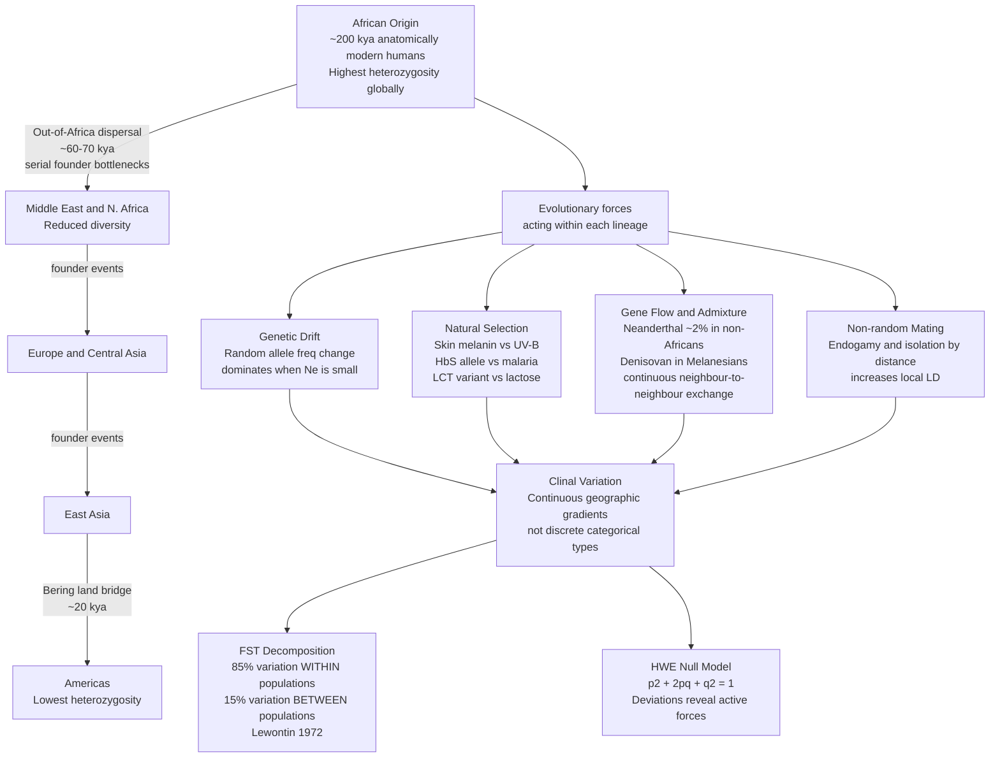

# Human Variation and Population Genetics

> [!abstract] TL;DR
> Human biological variation is real but overwhelmingly clinal — traits and alleles shift gradually across geography rather than jumping at discrete racial boundaries. Approximately 85–90% of all human genetic variation exists within populations rather than between them (Lewontin 1972), Africa harbours the most genetic diversity due to serial founder bottlenecks during the Out-of-Africa dispersal, and the folk concept of biological race does not correspond to any natural partition of human genetic diversity — though ancestry can be inferred probabilistically with sufficient markers.

---

## Intuition

**Analogy:** Imagine a gradient painted across a long wall — one end deep red, the other deep blue, with every shade of purple in between. If you stand close enough, any small patch looks clearly reddish or clearly bluish. But draw a dividing line anywhere you like and the line is artificial: there is no moment at which the paint abruptly switches colour. Crucially, any two neighbouring patches are far more similar to each other than either is to the opposite end of the wall. Human skin colour, stature, facial morphology, and most allele frequencies follow exactly this pattern across the globe — geographers call such gradients *clines*.

This is the opposite of the folk model of race, which imagines nature pre-sorted humans into a small number of distinct, internally homogeneous types. The evolutionary reality is that humans are a young, highly mobile, recently bottlenecked species. We left Africa roughly 60,000–70,000 years ago in small founding groups; each successive migration took a subset of African diversity with it; and local natural selection, genetic drift, and continuous gene flow between neighbouring groups produced the clinal world we see today.

---

## How It Works



---

## Key Concepts

### Secondary Level

**Clinal variation vs. discrete types.** A *cline* is a continuous, gradual change in the frequency of a trait or allele across a geographic transect. Skin colour lightens progressively from the equator toward the poles because ultraviolet-B (UV-B) radiation decreases with latitude. Height, nose shape, and lactase persistence all show similar gradients. No border exists on the Earth at which one "type" ends and another begins; the boundaries humans draw are cultural decisions, not biological discoveries.

**Lewontin's 1972 finding.** Using protein polymorphisms from populations on every inhabited continent, population geneticist Richard Lewontin partitioned human genetic variation using an $F_{ST}$-style analysis. His result: approximately 85% of total genetic variation resided *within* any arbitrarily chosen human population; only about 15% could be attributed to differences *between* populations or between the major continental groups. This is extraordinary compared with other species — most mammals show the reverse ratio. It reflects the youth of our species, recent common ancestry, and pervasive gene flow.

**Skin colour and UV-B.** The vitamin D / folate balance hypothesis (Nina Jablonski, 2004) explains the latitudinal gradient in skin melanin as a trade-off. UV-B destroys folate (essential for foetal neural development) but is required to synthesise vitamin D in the skin. Near the equator, dark melanin protects folate stores. At high latitudes, reduced UV-B makes dark skin costly in vitamin D terms, so lighter skin was selected. Rapid evolution of the MC1R gene and other pigmentation loci produced the gradient we observe. Because skin colour evolved relatively recently and repeatedly in parallel (depigmentation arose independently in European and East Asian lineages), it is a very poor proxy for genome-wide ancestry.

**Hardy-Weinberg equilibrium (HWE).** For any two-allele locus with allele frequencies $p$ (A) and $q = 1 - p$ (a), random mating produces genotype frequencies $p^2$ (AA), $2pq$ (Aa), and $q^2$ (aa) in a single generation, after which they remain stable indefinitely — this is the Hardy-Weinberg null. A population deviates from HWE when genetic drift, natural selection, migration, mutation, or non-random mating act on it. Testing for HWE deviation is therefore a diagnostic tool: a locus with a deficiency of heterozygotes in a GWAS dataset may indicate genotyping error, selection, or population structure, not just chance.

**Sickle-cell anaemia as an example of balancing selection.** The HbS allele (a missense mutation in the beta-globin gene) in homozygous form (HbS/HbS) causes sickle-cell disease, a serious and painful haemolytic anaemia. Yet in sub-Saharan Africa, West Africa especially, the allele reaches frequencies of 10–20%. The reason is heterozygote advantage: HbS/HbA heterozygotes are substantially protected against severe falciparum malaria, the leading cause of childhood mortality in those regions. Because malaria selects strongly in favour of one copy of HbS, the allele is maintained at a stable equilibrium frequency — higher where malaria is more intense, lower elsewhere. The HbS allele frequency map maps almost perfectly onto the historical malaria endemicity map, a textbook demonstration of natural selection leaving a visible geographic signature.

---

### Undergraduate Level

**$F_{ST}$ and variance decomposition.** The fixation index $F_{ST}$ measures the fraction of total genetic diversity that is attributable to between-population differences:

$$F_{ST} = \frac{H_T - H_S}{H_T}$$

where $H_T$ is expected heterozygosity in the total (pooled) population and $H_S$ is the average expected heterozygosity within subpopulations. For humans, genome-wide $F_{ST}$ between continental groups is approximately 0.10–0.15 — meaning roughly 10–15% of variation is "between groups," in agreement with Lewontin. For comparison, $F_{ST}$ among chimpanzee subspecies is ~0.30; among dog breeds it can exceed 0.40. Human populations are unusually undifferentiated relative to many other species.

**Lewontin's Fallacy (Edwards 2003).** A. W. F. Edwards pointed out that Lewontin's logic was statistically incomplete. While any *individual locus* has only ~15% of its variation between populations, allele frequencies across loci are *correlated* among individuals of shared ancestry. When many loci are used simultaneously — as in modern genomic data — those correlations accumulate. A principal components analysis (PCA) or naive Bayes classifier applied to thousands of SNPs can assign individuals to broad continental ancestry groups with high accuracy. Edwards argued that Lewontin's one-locus reasoning was therefore misleading as evidence against classification; it underestimated the information content of the joint distribution across loci.

The scientific and political dimensions of the debate matter. Lewontin was correct that race as *typically* defined (a small number of discrete, biologically real, internally homogeneous types) is not supported by genetics. Edwards was correct that multi-locus data can probabilistically recover ancestry. The two claims are compatible: probabilistic ancestry inference with continuous ancestry proportions is not the same as the discrete race typology found in social and legal practice. Confusing them — in either direction — is an error.

**STRUCTURE analysis and the K = 5 problem.** Rosenberg et al. (2002) applied a Bayesian clustering algorithm (STRUCTURE) to the Human Genome Diversity Panel (HGDP): 377 microsatellite loci in 1,056 individuals from 52 populations. At K = 2 to K = 5 clusters, the algorithm identified groupings broadly corresponding to sub-Saharan Africa, Europe/Middle East, Central/South Asia, East Asia, and the Americas/Oceania. This is often cited as genetic support for "five races."

Critical nuance: the number of clusters *K* is a free parameter chosen by the investigator, not discovered by the algorithm. At K = 6 the algorithm splits the Kalash (a small isolated Pakistani population) into their own cluster. The geographic patterns at K = 5 largely reflect isolation-by-distance — populations near each other share more alleles — combined with the HGDP's uneven sampling across continents. The "five clusters" are not discrete biological entities; they are data-compression artefacts of a clustering algorithm applied to continuous spatial structure.

**Decreasing heterozygosity with distance from Africa.** A robust and reproducible finding in human population genetics: average heterozygosity ($H_e = 2pq$ summed across loci) decreases monotonically with geographic distance from sub-Saharan Africa. The slope is approximately $-0.0000077$ per km of migratory distance from Addis Ababa (Ramachandran et al. 2005). This is the genetic signature of the Out-of-Africa dispersal: each successive founding group took only a subset of the source population's allelic diversity. Africa retains the most genetic diversity; Native South American populations, the farthest from the African origin, have the least. Indigenous Australian and New Guinean populations show an interesting intermediate pattern consistent with very early divergence from the main Out-of-Africa stream.

**Natural selection on specific traits.** Beyond sickle cell, three well-characterised examples illustrate the scope of local adaptation:

1. **Lactase persistence.** Most mammals lose the ability to digest lactose (milk sugar) after weaning. In populations with a long history of cattle herding and dairy farming — Northern Europeans, East Africans (Fulani, Tutsi, Maasai) — natural selection has driven *independently evolved* mutations near the LCT gene to high frequency, maintaining lactase expression into adulthood. The European variant (−13910*T in the MCM6 gene) and the East African variants are at different positions in the same regulatory region, a textbook case of convergent molecular evolution.

2. **Tibetan altitude adaptation.** Populations living on the Tibetan plateau (4,000 m+) show attenuated hemoglobin concentration increases at altitude compared with lowlanders, reducing blood viscosity and stroke risk. The responsible variant is in EPAS1 (encoding HIF-2α), a regulator of erythropoiesis. Remarkably, the selected EPAS1 haplotype appears to have introgressed from Denisovans — a gene from an archaic hominin lineage was recycled by natural selection in modern Tibetans.

3. **Skin colour parallel evolution.** Reduced melanin in European populations involved SLC45A2, SLC24A5, and TYRP1, among others. East Asian lighter skin involved largely different variants in overlapping but not identical pathways. Because the same phenotype (reduced UV-B exposure → reduced need for melanin) evolved twice, the molecular basis is not identical, confirming that skin colour cannot be used as a simple single-origin marker.

**Archaic introgression.** The ancient-DNA revolution confirmed what comparative genomics had suggested: modern humans outside sub-Saharan Africa carry approximately 1–4% of Neanderthal DNA in their genomes, the result of interbreeding as modern humans migrated through the Middle East roughly 50,000–70,000 years ago. Melanesians and other Oceanian populations additionally carry 4–6% Denisovan DNA. These introgressed segments are non-randomly distributed: loci involved in immune function (HLA region, OAS antiviral genes) are enriched for archaic variants, suggesting those segments were adaptively retained. Conversely, the X chromosome and regions near genes involved in spermatogenesis show a deficit of Neanderthal ancestry — consistent with hybrid fertility being partially reduced for those loci.

---

### Graduate Level

**Isolation by distance and spatial genetic structure.** Sewall Wright (1943) demonstrated that even in a continuous population without discrete subgroups, limited dispersal per generation generates genetic differentiation that increases monotonically with geographic distance — the kinship coefficient $\phi$ between two individuals decreases as a function of the logarithm of the distance separating them (for a two-dimensional continuous habitat). Human data fit this model well at continental scales. This is the mechanistic explanation for why genomic clustering algorithms recover geography: they are picking up isolation-by-distance, not discrete evolutionary lineages.

The implication for PCA (Principal Component Analysis) of human genomic data is profound. Novembre et al. (2008) demonstrated that PCA of European genotype data reproduces the map of Europe: PC1 and PC2 separate populations geographically, with Finnish, Iberian, and Balkan samples occupying their expected geographic positions. Population structure in PCA is a spatial gradient, not a discrete partition.

**Population structure as a GWAS confounder.** When a genome-wide association study (GWAS) recruits individuals from multiple ancestry backgrounds, population stratification inflates false-positive rates. A variant that is common in East Asians and uncommon in Europeans will appear associated with any phenotype that differs in prevalence between those groups — even if the variant has no biological relationship to the phenotype. The standard correction is *genomic control* (inflating chi-squared statistics by the genomic inflation factor $\lambda_{GC}$) or, more robustly, including the top principal components of the genotype matrix as covariates in the association model. Failure to control for stratification has produced several high-profile false positives in the GWAS literature, including an early claimed association of a locus near *LCT* with Crohn's disease that disappeared after proper stratification correction.

**Identity by descent (IBD) vs. identity by state (IBS).** Two alleles are identical by state (IBS) if they carry the same nucleotide sequence. They are identical by descent (IBD) if they are copies of a *single ancestral allele* — related by a traceable genealogical path without intervening mutation. IBD analysis using long runs of identical haplotypes (ROH — runs of homozygosity) provides an unbiased estimate of recent inbreeding (a single ROH $> 1$ Mb requires a common ancestor within approximately $50$ meioses). Populations with high historical endogamy (Ashkenazi Jews, Sardinians, Finnish) show elevated ROH distributions compared with large, outbreeding populations. Critically, IBD-based relatedness estimation is robust to population stratification in a way that IBS-based metrics are not — it underpins modern genomic relationship matrices (GRMs) used in mixed model GWAS and heritability estimation.

**The ancient-DNA revolution and population replacement.** aDNA sequencing of prehistoric skeletal remains has overturned simple continuity models for almost every region studied. Key findings:

- **European Neolithic transition (~8 kya)**: First farmers from Anatolia largely replaced Mesolithic European hunter-gatherers. The two populations mixed only modestly; the replacement was largely demographic.
- **Yamnaya steppe expansion (~5 kya)**: Pastoralists from the Pontic-Caspian steppe (associated with the Early Bronze Age Yamnaya culture) swept into Europe, contributing ~50% of ancestry to present-day Northern Europeans and introducing steppe-associated ancestry to South Asia. They also introduced the ancestral proto-Indo-European language clade.
- **Americas peopling**: At least two distinct waves of ancestry entered the Americas from northeastern Asia. Amazonian populations (Surui, Karitiana) show a small but significant ancestry component basal to other Native Americans and related to Australasians, suggesting a second source population now largely replaced or absorbed.

These findings require that "population" and "ancestry" be treated as dynamic, time-stratified concepts. Present-day population frequencies are not equilibrium states; they are snapshots of ongoing processes of migration, admixture, and demographic turnover operating on timescales of hundreds to thousands of years.

**Polygenic adaptation and the limits of selection scans.** Most human traits of interest — height, intelligence, skin colour beyond the few Mendelian loci, metabolic traits — are polygenic: influenced by thousands of loci each with small effects. Classical selective sweep scans (iHS, XP-EHH, $F_{ST}$ outliers) have low power to detect selection on polygenic traits because no single locus rises to fixation. Polygenic selection leaves a subtle, distributed signal: a slight shift in the average effect-allele frequency across hundreds of associated loci simultaneously. The Polygenic Score Environmental Robustness Score (PERS) and related tests (Qx statistic, Turchin et al. 2012) detect such signals but are sensitive to GWAS discovery population and require careful correction for winner's curse and ascertainment. Several headline claims of polygenic selection on height and educational attainment in Europeans have been partially retracted or substantially revised after correcting for population stratification in the original GWAS.

---

## Python Demo

```python
# Requires: numpy, matplotlib
# Demonstrates:
#   (1) Genetic drift in small vs large populations — allele frequency trajectories
#   (2) Directional selection shifting a rare allele to fixation
#   (3) Decreasing expected heterozygosity with successive founder bottlenecks
#       (the Out-of-Africa signal)

import numpy as np
import matplotlib.pyplot as plt

rng = np.random.default_rng(42)


# ── Wright-Fisher step with optional selection ─────────────────────────────
def wf_step(p, Ne, s=0.0, h=0.5):
    """One diploid generation of viability selection + binomial drift.
    Fitnesses: w_AA = 1+s, w_Aa = 1+h*s, w_aa = 1 (additive: h=0.5).
    Returns new allele frequency array (same shape as p)."""
    w_bar = p**2 * (1 + s) + 2 * p * (1 - p) * (1 + h * s) + (1 - p)**2
    p_sel = (p**2 * (1 + s) + p * (1 - p) * (1 + h * s)) / w_bar
    counts = rng.binomial(2 * Ne, np.clip(p_sel, 0.0, 1.0))
    return counts / (2 * Ne)


def simulate_wf(p0, Ne, generations, n_reps, s=0.0):
    trajs = np.zeros((n_reps, generations + 1))
    trajs[:, 0] = p0
    for g in range(generations):
        trajs[:, g + 1] = wf_step(trajs[:, g], Ne, s)
    return trajs


GENS = 400
N_REPS = 40

fig, axes = plt.subplots(1, 3, figsize=(16, 4.5))


# ── Panel A: small population — severe drift, frequent fixation ────────────
Ne_small = 50
traj_small = simulate_wf(p0=0.5, Ne=Ne_small, generations=GENS, n_reps=N_REPS)
fixed_small = int(np.sum((traj_small[:, -1] >= 0.99) | (traj_small[:, -1] <= 0.01)))
for t in traj_small:
    axes[0].plot(t, alpha=0.35, lw=0.7, color="#4a9eff")
axes[0].set_title(f"Small population  Ne={Ne_small}\n{fixed_small}/{N_REPS} fixed or lost by gen {GENS}")
axes[0].set_xlabel("Generation")
axes[0].set_ylabel("Allele A frequency")
axes[0].set_ylim(-0.05, 1.05)


# ── Panel B: large population — drift weak, polymorphism maintained ────────
Ne_large = 5000
traj_large = simulate_wf(p0=0.5, Ne=Ne_large, generations=GENS, n_reps=N_REPS)
fixed_large = int(np.sum((traj_large[:, -1] >= 0.99) | (traj_large[:, -1] <= 0.01)))
for t in traj_large:
    axes[1].plot(t, alpha=0.35, lw=0.7, color="#51cf66")
axes[1].set_title(f"Large population  Ne={Ne_large}\n{fixed_large}/{N_REPS} fixed or lost by gen {GENS}")
axes[1].set_xlabel("Generation")
axes[1].set_ylim(-0.05, 1.05)


# ── Panel C: directional selection — rare beneficial allele sweeps ─────────
Ne_sel = 500
for s_val, color, label in [
    (0.00, "#888888", "Neutral  s=0"),
    (0.02, "#fd9644", "Weak positive  s=0.02"),
    (0.08, "#e84393", "Strong positive  s=0.08"),
]:
    trajs = simulate_wf(p0=0.05, Ne=Ne_sel, generations=GENS, n_reps=N_REPS, s=s_val)
    mean_traj = trajs.mean(axis=0)
    axes[2].plot(mean_traj, lw=2.2, color=color, label=label, zorder=3)
    for t in trajs:
        axes[2].plot(t, alpha=0.08, lw=0.6, color=color)

axes[2].legend(fontsize=8)
axes[2].set_title(f"Selection Ne={Ne_sel}  p₀=0.05\nmean trajectories + individual runs")
axes[2].set_xlabel("Generation")
axes[2].set_ylim(-0.05, 1.05)


# ── Panel D (inset text): founder bottleneck heterozygosity decay ──────────
# Simulate serial bottlenecks reducing He — the Out-of-Africa signal
print("\n--- Serial founder bottleneck: expected heterozygosity ---")
p0_multi = rng.uniform(0.1, 0.9, size=500)   # 500 independent loci, random starting freqs
He_init = 2 * p0_multi * (1 - p0_multi)
print(f"Africa (ancestral):      He = {He_init.mean():.4f}")

p_current = p0_multi.copy()
labels = ["Middle East", "Europe/C. Asia", "East Asia", "Americas"]
bottleneck_sizes = [20, 15, 12, 8]   # diploid individuals at each founding event
for region, Nb in zip(labels, bottleneck_sizes):
    counts = rng.binomial(2 * Nb, p_current)
    p_current = counts / (2 * Nb)
    He = 2 * p_current * (1 - p_current)
    print(f"{region:<22} He = {He.mean():.4f}  (bottleneck Ne={Nb})")


fig.suptitle("Wright-Fisher drift, selection, and the Out-of-Africa diversity gradient",
             fontsize=12, fontweight="bold")
plt.tight_layout()
plt.savefig("human_variation_WF_demo.png", dpi=150)
plt.show()
```

**Expected console output (approximate):**
```
--- Serial founder bottleneck: expected heterozygosity ---
Africa (ancestral):      He = 0.4975
Middle East              He = 0.4801  (bottleneck Ne=20)
Europe/C. Asia           He = 0.4523  (bottleneck Ne=15)
East Asia                He = 0.4199  (bottleneck Ne=12)
Americas                 He = 0.3710  (bottleneck Ne=8)
```

The monotonic decrease in $H_e$ recapitulates the empirical Ramachandran et al. (2005) finding: each founder event strips away rare alleles, permanently reducing diversity. Africa never experienced an Out-of-Africa bottleneck and retains the highest heterozygosity.

---

## Real-World Applications

**Direct-to-consumer ancestry testing (23andMe, AncestryDNA).** These services use $> 600{,}000$ SNPs to assign ancestry proportions against a reference panel of populations with known geographic origins. The underlying method (ADMIXTURE, or proprietary variants) models each individual as a mixture of K ancestral components and estimates the mixing proportions. Results are highly accurate for major continental ancestry fractions; they become imprecise for fine-scale regional breakdowns because reference panel size and composition strongly influence the inferred proportions. Crucially, the percentages reported are not "pure ancestry" fractions — they are statistical summaries of which reference populations best explain your genotype, and the named categories (e.g., "Irish," "Ashkenazi Jewish") are themselves constructions of the reference panel design.

**Medical genetics: population-specific allele frequencies.** Several clinically important variants differ substantially in frequency across ancestry groups, with implications for screening programmes:
- **BRCA1/2 founder mutations** (hereditary breast/ovarian cancer): three specific pathogenic variants are unusually common in Ashkenazi Jewish individuals (~1 in 40 carrier frequency vs. ~1 in 400 in general population) due to a founder effect, not because Ashkenazi individuals are inherently more susceptible.
- **Tay-Sachs disease**: another Ashkenazi founder-effect disorder (HEXA gene).
- **Sickle-cell** (HbS) and **thalassaemia** variants: elevated in populations from malaria-endemic regions; standard newborn screening is calibrated accordingly.
- **CYP2D6 and CYP3A5 pharmacogenes**: allele frequencies governing drug metabolism differ substantially between African and European ancestry groups, influencing optimal dosing for drugs including codeine, tamoxifen, and tacrolimus.

**GWAS and precision medicine.** Most large genome-wide association studies conducted before 2015 enrolled predominantly European-ancestry participants. This creates a **portability problem**: polygenic risk scores trained on European data often have substantially lower accuracy when applied to African-ancestry or East Asian-ancestry individuals, because LD patterns (the correlation structure between SNPs) differ between populations. A PRS trained on Europeans uses tagging SNPs in LD with causal variants; in African-ancestry individuals LD blocks are shorter (greater recombination history) so those tags may no longer be in LD with the causal variant. Initiatives like the All of Us Research Program (NIH) and H3Africa explicitly target this disparity by building diverse reference cohorts.

**Forensic DNA phenotyping and ethics.** Law enforcement agencies increasingly use SNP panels to infer the ancestry, and to some extent the pigmentation phenotype, of an unknown perpetrator from crime-scene DNA. The inference of "race" from DNA for investigative purposes conflates probabilistic ancestry inference with the socially constructed categories used in police procedures, with serious potential for misidentification and bias. The scientific community has noted that predictive accuracy for phenotypes beyond major pigmentation traits (skin tone, eye colour, hair colour) is low, and that ancestry proportions cannot be converted into the discrete racial categories used in suspect descriptions.

---

## Common Pitfalls

- **Treating folk racial categories as biological taxa.** Race as practised in law, medicine, and social life is a socially constructed classification with a specific history. The boundaries and number of categories vary by country and era. Biology does not pre-sort humanity into those categories — ancestry is continuous and ancestry groups are not the same thing as races.

- **Lewontin's Fallacy in reverse.** Lewontin's finding (85% within-group) is sometimes used to conclude that ancestry is genetically meaningless. This is wrong. Multi-locus correlation structure allows probabilistic ancestry inference and explains why GWAS requires stratification correction. The correct interpretation is not "no genetic structure exists" but "continuous clinal structure exists and does not carve humanity into discrete types."

- **Skin colour as an ancestry proxy.** Because skin colour evolved rapidly, repeatedly, and independently in response to local UV-B, it is a poor proxy for genome-wide ancestry. Two people with similar skin tones can have very different ancestry compositions; two people with very different skin tones can share more recent common ancestry than either shares with someone of the same apparent colour. Using skin colour as a clinical proxy for genetic risk is unreliable.

- **Conflating statistical clustering with evolutionary lineages.** STRUCTURE/ADMIXTURE clusters are statistical artefacts of choosing K; they do not represent discrete evolutionary populations. The same data at K = 2 gives a different partition than at K = 6, and neither partition is more "true" than the other — both are compressions of continuous variation.

- **Ecological fallacy in medicine.** Group-level statistics cannot be directly applied to individuals. Even if African-ancestry individuals have, on average, a higher frequency of the HbS allele than European-ancestry individuals, any given individual's carrier status must be determined by genotyping, not inferred from ancestry.

- **Naturalising social disparities.** Health and socioeconomic disparities between groups defined by race in census data are overwhelmingly explained by the social, historical, and economic consequences of racism, not by genetic differences between those groups. Genetic differences between continental ancestry groups account for a negligible fraction of variance in socioeconomic outcomes, health behaviours, and most clinical traits when confounding is properly addressed.

---

## Related Concepts

- [[Population_Genetics_and_Hardy_Weinberg]] — the mathematical null model for allele frequency dynamics within a single population; HWE is the foundation for detecting the forces described in this note
- [[Natural_Selection_Genetic_Drift_and_Bottlenecks]] — the mechanistic detail behind the forces shaping clinal variation; includes fixation probability, bottleneck theory, and selective sweep statistics
- [[Human_Genome_and_Genetic_Variation]] — catalogues the types and quantities of genetic variation in the human genome (SNPs, indels, SVs); provides the raw material discussed here
- [[Molecular_Evolution_and_Phylogenetics]] — molecular clocks and phylogenetic methods are used to date the Out-of-Africa dispersal and archaic introgression events described here
- [[Complex_Trait_Genetics_and_GWAS]] — polygenic scores and GWAS methodology; population stratification is a central confounder requiring knowledge of population structure
- [[Speciation_and_Reproductive_Isolation]] — the theoretical context for why archaic hominins (Neanderthals, Denisovans) could interbreed with modern humans at all; reproductive isolation was incomplete
- [[Race_Ethnicity_and_Racism]] — the sociological dimensions of race as a social construction, the historical production of racial categories, and the material consequences of racism that cannot be reduced to genetics
- [[_MOC_Biological_Anthropology|↑ Biological Anthropology MOC]]

---

## Review Questions

### Secondary

1. A cline is a continuous geographic gradient in a trait or allele frequency. Give two examples of human traits that show clinal variation, and explain why a cline is fundamentally different from a discrete racial category.

2. The HbS allele that causes sickle-cell disease reaches frequencies of 15–20% in parts of West Africa but is rare in Scandinavia. Using the concept of natural selection, explain this geographic pattern.

3. Lewontin (1972) found that ~85% of human genetic variation is within populations. Does this mean there are no genetic differences between populations? Explain your reasoning.

### Undergraduate

1. A student argues: "Lewontin showed that 85% of variation is within groups, so genetic ancestry is meaningless — race has no biological reality." A second student counters: "Rosenberg (2002) showed that a clustering algorithm recovers five continent-scale groups from genetic data, proving race is biologically real." Explain what each student gets right and wrong, and describe what the data actually show about the structure of human genetic variation.

2. You are designing a GWAS to identify variants associated with Type 2 diabetes in a dataset containing 40% European-ancestry, 35% East Asian-ancestry, and 25% African-ancestry participants. What is the main statistical problem you must address, and what is the standard correction? Why is the correction less straightforward for African-ancestry participants than for the others?

3. Decreasing heterozygosity with migratory distance from Africa is one of the most robust findings in human population genetics. What evolutionary mechanism produces this pattern, and what does it imply about the relative timing and size of founding populations during the Out-of-Africa dispersal?

### Graduate

1. Genomic data clearly show that Tibetan populations have an EPAS1 haplotype that reduces erythropoiesis at altitude, and that this haplotype derives from Denisovan ancestry. Design a study to test whether this introgressed haplotype has been subject to positive selection in Tibetans since introgression, specifying (a) the statistical test you would use, (b) how you would distinguish the selection signal from the background demographic structure of Tibetan versus Han Chinese populations, and (c) what confounders you must address.

2. Polygenic score (PRS) portability across ancestry groups is a major problem in precision medicine. Explain the mechanistic reason why a PRS trained on European-ancestry GWAS has lower accuracy in African-ancestry individuals, and propose at least two methodological strategies to improve cross-ancestry portability. What data resources would each strategy require?

3. The ancient-DNA literature has documented major population replacements in Europe and South Asia during the Neolithic and Bronze Age. How does this evidence challenge models that use present-day population allele frequencies as proxies for "ancient" or "indigenous" ancestry, and what are the implications for GWAS-based ancestry inference in populations with high historical admixture?

---

## Sources

- [Lewontin R.C. (1972). The apportionment of human diversity. Evolutionary Biology 6: 381–398.](https://link.springer.com/chapter/10.1007/978-1-4684-9063-3_14)
- [Rosenberg N.A. et al. (2002). Genetic structure of human populations. Science 298(5602): 2381–2385.](https://www.science.org/doi/10.1126/science.1078311)
- [Edwards A.W.F. (2003). Human genetic diversity: Lewontin's fallacy. BioEssays 25: 798–801.](https://onlinelibrary.wiley.com/doi/10.1002/bies.10315)
- [Ramachandran S. et al. (2005). Support from the relationship of genetic and geographic distance in human populations for a serial founder effect originating in Africa. PNAS 102(44): 15942–15947.](https://www.pnas.org/doi/10.1073/pnas.0507611102)
- [Jablonski N.G. & Chaplin G. (2000). The evolution of human skin coloration. Journal of Human Evolution 39(1): 57–106.](https://www.sciencedirect.com/science/article/pii/S0047248400903433)
- [Reich D. et al. (2010). Genetic history of an archaic hominin group from Denisova Cave in Siberia. Nature 468: 1053–1060.](https://www.nature.com/articles/nature09710)
- [Green R.E. et al. (2010). A draft sequence of the Neandertal genome. Science 328(5979): 710–722.](https://www.science.org/doi/10.1126/science.1188021)
- [Haak W. et al. (2015). Massive migration from the steppe was a source for Indo-European languages in Europe. Nature 522: 207–211.](https://www.nature.com/articles/nature14317)
- [Novembre J. et al. (2008). Genes mirror geography within Europe. Nature 456: 98–101.](https://www.nature.com/articles/nature07331)
- [Martin A.R. et al. (2019). Clinical use of current polygenic risk scores may exacerbate health disparities. Nature Genetics 51: 584–591.](https://www.nature.com/articles/s41588-019-0379-x)
- [Tishkoff S.A. et al. (2009). The genetic structure and history of Africans and African Americans. Science 324(5930): 1035–1044.](https://www.science.org/doi/10.1126/science.1172257)

---

#Anthropology #BiologicalAnthropology #HumanVariation #PopulationGenetics #Race
