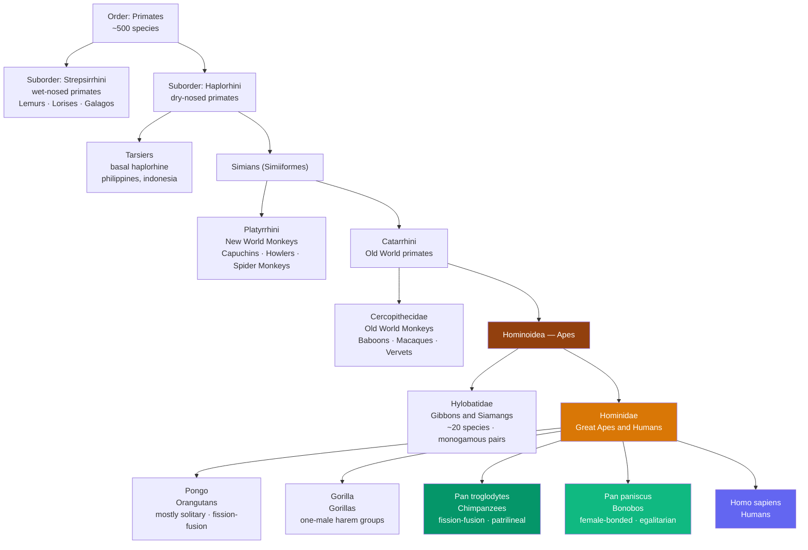

> [!abstract] TL;DR
> Primatology is the study of our closest living relatives — the ~500 species of primates, including apes, monkeys, and prosimians. Long-term field research, especially Jane Goodall's Gombe chimpanzee study and Frans de Waal's work on bonobo politics, overturned the assumption that culture, tool use, political alliance, and moral emotion were uniquely human. Robin Dunbar showed that primate neocortex size predicts stable group size, linking brain evolution to social complexity. Understanding primate societies illuminates the deep evolutionary roots of human behavior: hierarchy, coalition, reconciliation, empathy, and cultural transmission are all primate traits, not human inventions.

---

## Intuition

**Analogy:** Imagine you have just started at a new company. Within days you intuitively map who defers to whom in meetings, who allies with whom at lunch, and who smooths things over after a conflict. You track these relationships not through an org chart but through daily social observation — body language, tone of voice, who sits next to whom. You are, essentially, doing what every adult chimpanzee in a forested clearing does continuously.

Primates live in social worlds of extraordinary complexity. Managing that world — remembering who owes a favor, who is dangerous, who can be recruited as an ally — is computationally expensive. Primatologists have come to argue that this social demand is precisely why primate brains, and eventually the human brain, grew so large. Intelligence, on this view, was not primarily an adaptation for making tools or tracking prey; it was an adaptation for navigating other minds.

---

## How It Works

### Primate Taxonomy and Defining Traits

Primates constitute an order of ~500 named species within mammals. Three anatomical features define the group and are tightly linked to their ecological niche of arboreal life and social complexity:

1. **Grasping hands and feet** with opposable digits and nails (not claws) — for precision gripping of branches and objects
2. **Forward-facing eyes** with overlapping visual fields — binocular stereoscopic vision for judging distances in three-dimensional arboreal environments
3. **Large neocortex relative to body size** — the substrate for complex social cognition, flexible learning, and cultural transmission



### Humans and Chimpanzees: A Shared Ancestor

Humans and chimpanzees/bonobos share approximately **98.7% of protein-coding DNA** and diverged from a common ancestor roughly 6–7 million years ago. Gorillas diverged about 10 million years ago; orangutans about 14 million years ago. This phylogenetic proximity means that observing chimpanzee and bonobo social behavior provides an oblique window into the behavioral repertoire of our last common ancestor. This inference must be used cautiously — both lineages have been evolving independently for millions of years — but it anchors human social tendencies in an evolutionary framework.

---

## Key Concepts

### Secondary Level

#### Jane Goodall and the Gombe Revolution

Jane Goodall began her study of wild chimpanzees at Gombe Stream, Tanzania, in **1960**, under the mentorship of paleoanthropologist Louis Leakey. Her discoveries shattered prior assumptions about the boundary between humans and other animals:

**Tool use (1960):** Goodall observed chimpanzees stripping leaves from twigs and inserting them into termite mounds to extract termites — "termite fishing." This was the first confirmed instance of a non-human animal *manufacturing* a tool (modifying an object for use). Louis Leakey's famous telegram response: "Now we must redefine tool, redefine man, or accept chimpanzees as humans."

**Hunting and meat sharing:** Chimpanzees hunt cooperatively, targeting red colobus monkeys. The successful hunter distributes meat selectively, using it to reinforce social bonds, reward allies, and attract mating partners. Meat is not just food; it is social currency.

**Warfare — the Kasakela-Kahama conflict (1974–1978):** After a community split, Goodall documented the Kasakela males systematically killing every male member of the Kahama group over four years — targeted, prolonged inter-group lethal aggression. This demolished the image of the peaceful chimp and forced a reckoning with the evolutionary roots of human warfare.

**Cultural transmission:** Goodall observed that specific behaviors — particular grooming styles, tool-use techniques, rain dances — were present in some communities and absent in others, transmitted through social learning rather than genetics. This was an early recognition of non-human culture.

#### Primate Social Organization Types

Primate societies are not monolithic. Five major organizational types exist, each with distinct advantages and trade-offs:

| Type | Example Species | Key Features |
|------|----------------|--------------|
| **Solitary** | Orangutan, Aye-Aye | Low competition for food; limited protection from predators |
| **Monogamous pair** | Gibbons, Titi monkeys | High paternal investment; territorial defense by both sexes |
| **One-male / harem** | Gorilla, Hamadryas baboon | One dominant male, multiple females; infanticide risk from outside males |
| **Multi-male / multi-female** | Chimpanzee, Macaque | Complex alliances; sperm competition; high social complexity |
| **Fission-fusion** | Chimpanzee, Bonobo, Spider Monkey | Party size and composition changes daily; high cognitive demand for tracking membership |

**Fission-fusion dynamics** are particularly cognitively demanding: individuals must maintain social bonds with community members they may not see for days or weeks. Chimpanzee communities of 30–80 individuals split into smaller foraging parties that recombine fluidly. Individuals must remember their relationships with all community members across gaps in contact — a powerful driver of large brain size.

---

### Undergraduate Level

#### Frans de Waal: Primate Politics, Empathy, and the Roots of Morality

Frans de Waal's chimpanzee research at Arnhem Zoo (beginning 1975) revealed a level of political sophistication that few had attributed to non-human animals.

**Alpha male politics:** The alpha male position in chimpanzee groups is not simply won by the physically largest male. Alpha status depends on **coalition formation**: a lower-ranked male can displace a larger alpha by recruiting an ally to form an unstable coalition. de Waal documented three males at Arnhem — Yeroen, Luit, and Nikkie — engaged in sustained political maneuvering: forming alliances, breaking alliances, excluding rivals from access to females, and staging displays calibrated to audience composition.

**Reconciliation and consolation:** After aggressive conflicts, chimpanzees frequently approach former opponents for contact — grooming, kissing, embracing. de Waal documented this "reconciliation" pattern systematically and demonstrated it was distinct from normal social interaction: it was specifically elevated in the period immediately following conflict between the two parties. Reconciliation repairs social bonds damaged by aggression — it is conflict *management*, not just conflict. **Consolation** — third-party comfort given to the loser of a fight — is present in bonobos and some great apes but is surprisingly limited in chimpanzees. This distinction has implications for the evolution of empathy.

**Bonobos and female power:** Pan paniscus ("bonobos," originally "pygmy chimpanzees") were studied intensively by de Waal and others. Bonobos live in female-bonded groups where females form coalitions that constrain male aggression. Social tension is frequently defused through sexual contact (GG-rubbing between females, male-male mounting). Bonobo society is more egalitarian, less male-dominated, and less violent than chimpanzee society — a compelling natural comparison case for understanding the origins of human social variation.

**Morality's precursors:** de Waal argues against the view that morality is a veneer placed over a selfish animal nature. Instead, he identifies precursors of morality in non-human primates:
- **Empathy:** Emotional contagion (matching emotional states), targeted helping, and consolation behaviors
- **Fairness:** Capuchin monkeys reject unequal pay — when a partner receives a grape for completing a task while the subject receives a cucumber (a less preferred reward for the same task), subjects throw the cucumber away and display protest behaviors (Brosnan & de Waal, 2003)
- **Reciprocity:** Chimpanzees are more likely to share food with partners who recently groomed them

#### Sarah Blaffer Hrdy: The Female Primate

Prior to Hrdy's work, primatology was male-centered: alpha male status and male competition for females was the dominant analytical frame. Hrdy's research reframed female primates as active strategic agents.

**Female choice and cryptic mating:** Female primates are not passive recipients of male competition. They exercise mate choice, often through cryptic strategies — mating with multiple males to create paternity confusion. If multiple males believe they may be the father of an infant, each is less likely to commit infanticide (male primates frequently kill infants they cannot be the father of, to bring the female back into estrus and sire their own offspring). Hrdy showed that multi-male mating by females is often an *infanticide-avoidance strategy*.

**Alloparenting and cooperative breeding:** Hrdy proposed that humans are cooperative breeders — a relatively rare trait among primates. Unlike chimpanzees and gorillas (where mothers carry infants exclusively), humans and some New World monkeys (callitrichines) allow others ("allomothers") to carry and care for infants. Hrdy argued that cooperative breeding was a key evolutionary transition: it allowed shorter inter-birth intervals (by offloading infant care), selected for infants who could read intentions and solicit care from non-mothers, and ultimately drove the evolution of hyper-sociality and language.

#### Dunbar's Social Brain Hypothesis

Robin Dunbar's central question was: why do primates have brains so large relative to body size? His answer (1992) was the **Social Brain Hypothesis**: neocortex volume (specifically the neocortex-to-rest-of-brain ratio) is driven by the demands of tracking complex social relationships, not by ecological demands (diet, foraging range, etc.).

**The data:** Across 36 primate genera, Dunbar found a strong correlation between neocortex ratio and mean social group size (r = 0.76). Frugivores (fruit-eating primates) showed the largest neocortex ratios and largest groups; folivores (leaf-eating) showed smaller ratios and smaller groups — consistent with the idea that ecological complexity alone does not explain brain size.

**Dunbar's Number:** Extrapolating the regression to humans predicts a natural social group size of approximately **150** — now called "Dunbar's Number." Archaeological evidence (Neolithic village sizes, Roman military unit sizes, modern military company sizes, Hutterite communities) consistently cluster around 100–200 members, supporting the prediction.

**Grooming and language:** Primates use social grooming — picking through the fur of partners — to maintain social bonds. Grooming releases endorphins in both groomer and groomee; it is the primary currency of alliance building. But grooming is time-intensive: it can only be done one-on-one. Dunbar proposed that **language evolved as "grooming at a distance"** — a way to maintain bonds simultaneously with multiple individuals through conversation, gossip, and social information exchange. This is why ~60–70% of human conversation in natural settings is social gossip about people and relationships, not abstract or technical content.

---

### Graduate Level

#### Culture in Non-Human Primates: Whiten's Cross-Site Analysis

Andrew Whiten coordinated a landmark study (1999) comparing behavioral traditions across seven long-term chimpanzee study sites in Africa. The analysis identified **39 behaviors** that varied between communities in ways that could not be explained by ecological or genetic differences — the hallmark of cultural variation.

**Examples of chimpanzee cultural variation:**
- **Nut-cracking with stone hammers:** Present in West African communities (Bossou, Taï); absent in East African communities with nut trees present (Gombe) — the nuts exist but the tradition does not
- **Grooming hand-clasp:** Partners clasp hands overhead while grooming with the free hand; present in some communities, absent in others, and the variant style (A-frame vs. wrist-only) differs between adjacent communities
- **Leaf sponge:** Using a crushed leaf to drink water; technique varies between sites

The methodological debate: "culture" in anthropology typically implies symbolic content, cumulative ratcheting, and teaching. Chimpanzee behavioral traditions propagate primarily through **observation and social facilitation** (watching others makes you more likely to try the behavior), not through explicit teaching or imitation of the underlying goal. This is a thinner form of culture. Yet the evidence for population-level behavioral differences not explained by genes or environment satisfies the behavioral definition of culture.

**Orangutan cultures (van Schaik, 2003):** A parallel cross-site study found 24 behaviors varying culturally in orangutans — including social play conventions, tool-assisted insect extraction, and communication signals. Notably, cultural richness correlated with social density: populations living in higher-density groups (where social learning opportunities are frequent) showed more cultural variants, providing direct support for social transmission as the mechanism.

#### Dominance Hierarchy Dynamics and Coalition Theory

Dominance hierarchies in primate groups are not static rank orders; they are dynamic equilibria maintained by ongoing contests, coalition support, and strategic defection.

**Elo rating models** have been applied to naturalistic primate contest data (Albers & de Vries, 2001; Sanchez-Tojar et al., 2018). Each individual's dominance score updates after every pairwise encounter based on the outcome relative to expectation — exactly as in chess rating systems. This approach captures:
- **Hierarchy steepness:** The degree to which ratings are spread vs. compressed
- **Linearity:** Whether the hierarchy approximates a perfect linear dominance order
- **Stability:** Whether the rank ordering is stable over time (measured by Kendall's tau)

**Coalition game theory:** Coalitions are three-way interactions: individual A supports individual B against individual C. Game-theoretic models (Noë, 1994; van Schaik & van Hooff) predict:
- **Conservative coalitions:** Lower-rankers pool resources to challenge a higher-ranker; stable because each coalition partner gains by the arrangement
- **Revolutionary coalitions:** A lower-ranker recruits the alpha to depose a common rival; less stable because the alpha has incentives to defect
- **Bridging alliances:** An individual strategically maintains ties across rank levels to remain a valuable coalition partner

Bonobo females maintain coalitions that effectively cap male dominance — a coalition structure with no precise equivalent in chimpanzees. This species-level difference in coalition structure maps onto measurable differences in stress hormones, injury rates, and reproductive skew.

#### The Neocortex, Mirror Neurons, and the Social Brain

The neocortex in primates — especially the prefrontal cortex (PFC) and temporal-parietal junction (TPJ) — supports **theory of mind**: the ability to attribute beliefs, desires, and intentions to others. Primates vary in their theory of mind capacity:

- **Great apes** pass some gaze-following and false-belief-adjacent tests; chimpanzees understand what others can or cannot see
- **Monkeys** show more limited perspective-taking
- **Humans** have the most elaborated theory of mind, supporting nested intentionality ("I know that you think that I believe...")

**Mirror neurons** (discovered by Rizzolatti in macaques, 1992) fire both when an animal performs an action and when it observes the same action performed by another. Proposed as a neural substrate for imitation, understanding others' actions, and possibly empathy. The "mirror neuron system" has been a productive if contested concept; its role in primate culture and empathy continues to be actively researched.

**Comparative neuroscience:** Key structural features of the social brain are shared across primates:
- **Spindle neurons (von Economo neurons)** — large, rapidly conducting neurons in the anterior cingulate cortex and anterior insula; present in great apes, cetaceans, and elephants; linked to rapid social intuitions and self-awareness
- **Amygdala connectivity to PFC** — the emotional-social-evaluative pathway; primates with more complex social lives show proportionally larger amygdala relative to their neocortex

---

## Python Demo

Simulates primate dominance hierarchy formation using **Elo rating dynamics** from pairwise contests. Compares hierarchy stability (Kendall tau) across low-volatility vs. high-volatility conditions and shows how coalition pairs alter the distribution of wins.

```python
import numpy as np
import matplotlib.pyplot as plt
from scipy.stats import kendalltau

# ── Parameters ──────────────────────────────────────────────────────────────
N            = 10    # individuals in the group
N_CONTESTS   = 1000  # pairwise contests per simulation run
K_SLOW       = 16    # low Elo K-factor  → slow, stable hierarchy formation
K_FAST       = 64    # high Elo K-factor → fast, volatile hierarchy
COAL_BONUS   = 200   # effective-rating bonus when coalition partner is present


def has_coalition_support(ind, opp, coal_set, n):
    """Return True if individual `ind` has a coalition partner other than `opp`."""
    for p in range(n):
        if p == ind or p == opp:
            continue
        if (min(ind, p), max(ind, p)) in coal_set:
            return True
    return False


def run_elo(n, n_contests, k, coalitions=None, seed=42):
    """
    Elo-rating simulation of primate dominance hierarchy.

    Parameters
    ----------
    n          : group size (number of individuals)
    n_contests : total pairwise contests to simulate
    k          : Elo K-factor (how much each contest shifts ratings)
    coalitions : list of (a, b) tuples — pairs that mutually support each other
    seed       : RNG seed for reproducibility

    Returns
    -------
    ratings        : final Elo ratings, shape (n,)
    tau_series     : Kendall tau of current vs. initial ranking at each contest
    rating_history : ratings sampled every snap_interval contests, shape (n, snapshots)
    win_counts     : total wins per individual, shape (n,)
    """
    rng = np.random.default_rng(seed)
    ratings = rng.uniform(1300, 1700, n).copy()
    initial_order = np.argsort(-ratings)   # rank 0 = highest initial rating

    coal_set = set()
    if coalitions:
        for a, b in coalitions:
            coal_set.add((min(a, b), max(a, b)))

    snap_interval = max(1, n_contests // 50)
    tau_series = []
    win_counts = np.zeros(n, dtype=int)
    history = [ratings.copy()]

    for contest in range(n_contests):
        i, j = rng.choice(n, size=2, replace=False)

        # Effective ratings include coalition support bonus
        r_i = ratings[i] + (COAL_BONUS if has_coalition_support(i, j, coal_set, n) else 0)
        r_j = ratings[j] + (COAL_BONUS if has_coalition_support(j, i, coal_set, n) else 0)

        e_i = 1.0 / (1.0 + 10.0 ** ((r_j - r_i) / 400.0))
        e_j = 1.0 - e_i

        if rng.random() < e_i:
            ratings[i] += k * (1.0 - e_i)
            ratings[j] += k * (0.0 - e_j)
            win_counts[i] += 1
        else:
            ratings[i] += k * (0.0 - e_i)
            ratings[j] += k * (1.0 - e_j)
            win_counts[j] += 1

        tau, _ = kendalltau(initial_order, np.argsort(-ratings))
        tau_series.append(tau)

        if contest % snap_interval == 0:
            history.append(ratings.copy())

    return ratings, tau_series, np.array(history).T, win_counts


# ── Run Three Conditions ────────────────────────────────────────────────────
# Condition 1: slow update rate, no coalitions
r1, tau1, hist1, wins1 = run_elo(N, N_CONTESTS, K_SLOW, coalitions=None,          seed=42)

# Condition 2: fast update rate, no coalitions (volatile hierarchy)
r2, tau2, hist2, wins2 = run_elo(N, N_CONTESTS, K_FAST, coalitions=None,          seed=42)

# Condition 3: slow update, with two coalition dyads (individuals 0+1, and 2+3)
coal_pairs = [(0, 1), (2, 3)]
r3, tau3, hist3, wins3 = run_elo(N, N_CONTESTS, K_SLOW, coalitions=coal_pairs,    seed=42)


# ── Plot ────────────────────────────────────────────────────────────────────
fig, axes = plt.subplots(2, 2, figsize=(12, 8))
fig.suptitle("Primate Dominance Hierarchy: Elo Rating Simulation", fontsize=14, fontweight="bold")
colors = plt.cm.tab10(np.linspace(0, 1, N))

# --- Panel 1: Elo trajectories over time (condition 1) ---
ax = axes[0, 0]
snap_x = np.linspace(0, N_CONTESTS, hist1.shape[1])
for ind in range(N):
    label = f"Ind {ind}" if ind < 5 else None
    ax.plot(snap_x, hist1[ind], color=colors[ind], alpha=0.85, linewidth=1.5, label=label)
ax.set_title(f"Elo Trajectories  (K={K_SLOW}, no coalitions)")
ax.set_xlabel("Contest number")
ax.set_ylabel("Elo rating")
ax.legend(fontsize=7, loc="upper right", ncol=2)

# --- Panel 2: Hierarchy stability — slow vs. fast K ---
ax = axes[0, 1]
window = 25
smooth = lambda s: np.convolve(s, np.ones(window) / window, mode="valid")
ax.plot(smooth(tau1), color="steelblue", linewidth=1.8, label=f"K={K_SLOW}  (stable)")
ax.plot(smooth(tau2), color="tomato",    linewidth=1.8, label=f"K={K_FAST}  (volatile)")
ax.axhline(0, color="gray", linestyle="--", linewidth=0.8)
ax.set_title("Hierarchy Stability: Kendall τ vs. Initial Ranking")
ax.set_xlabel("Contest number")
ax.set_ylabel("Kendall τ  (1 = identical order)")
ax.legend()
ax.set_ylim(-1.15, 1.15)
ax.annotate("High K → rank reversals", xy=(400, -0.05), fontsize=8, color="tomato")

# --- Panel 3: Win distribution — no coalitions vs. with coalitions ---
ax = axes[1, 0]
x = np.arange(N)
width = 0.38
bars1 = ax.bar(x - width / 2, wins1, width, label="No coalitions",         color="steelblue",  alpha=0.85)
bars3 = ax.bar(x + width / 2, wins3, width, label="With coalitions (0+1, 2+3)", color="darkorange", alpha=0.85)
ax.set_title("Win Distribution: Coalitions Concentrate Power")
ax.set_xlabel("Individual ID")
ax.set_ylabel("Total wins")
ax.set_xticks(x)
ax.set_xticklabels([f"Ind {i}" for i in range(N)], rotation=45, fontsize=8)
ax.legend(fontsize=8)
# Annotate the coalition members
for idx in [0, 1, 2, 3]:
    ax.annotate("C", xy=(idx + width / 2, wins3[idx] + 3), ha="center", fontsize=7, color="darkorange")

# --- Panel 4: Coalition effect on hierarchy stability ---
ax = axes[1, 1]
ax.plot(smooth(tau1), color="steelblue",  linewidth=1.8, label=f"K={K_SLOW}, no coalitions")
ax.plot(smooth(tau3), color="darkorange", linewidth=1.8, label=f"K={K_SLOW}, with coalitions")
ax.axhline(0, color="gray", linestyle="--", linewidth=0.8)
ax.set_title("Coalition Effect on Hierarchy Stability")
ax.set_xlabel("Contest number")
ax.set_ylabel("Kendall τ  vs. initial ranking")
ax.legend(fontsize=8)
ax.set_ylim(-1.15, 1.15)

plt.tight_layout()
plt.savefig("primate_elo_simulation.png", dpi=150, bbox_inches="tight")
plt.show()
print("Done. Figure saved: primate_elo_simulation.png")
print(f"\nFinal Elo ratings (no coalitions):   {dict(enumerate(r1.round(1)))}")
print(f"Final Elo ratings (with coalitions): {dict(enumerate(r3.round(1)))}")
```

**What the simulation shows:**
- **Panel 1:** Elo ratings diverge from their initial random distribution as contests accumulate; a clear stratified hierarchy emerges within ~200 contests
- **Panel 2:** Low K preserves the initial rank order (Kendall tau stays positive and high); high K produces frequent rank reversals (tau oscillates near zero), modeling an unstable, contest-driven hierarchy
- **Panel 3:** Coalition pairs (0+1, 2+3) accumulate more wins than their baseline ratings would predict — a coalition boosts effective dominance even for initially lower-rated individuals, as observed in chimpanzee alpha-male politics
- **Panel 4:** Coalitions can either stabilize or destabilize the hierarchy depending on how they align with the initial rank order — a contested phenomenon in the empirical literature

---

## Real-World Applications

**Predicting group cohesion in human organizations:** Dunbar's Number has been applied by corporations (Gore-Tex, Valve) and military planners. Teams above ~150 members show declining trust and information sharing, supporting subdivision into independent units. The underlying mechanism — limits on the number of individuals one can actively track in a social network — is a direct application of primate social brain research.

**Evolutionary medicine and mental health:** Depression, anxiety, and social isolation in industrialized societies can be partially framed through the lens of evolved primate social needs. Humans, like other social primates, have a calibrated need for face-to-face social contact, physical touch (grooming), and stable dominance-hierarchy predictability. Disruption of these through urban anonymity, digital mediation of relationships, or social exclusion activates ancient social threat systems. de Waal's concept of **consolation behavior** (observed in bonobos and great apes) directly parallels therapeutic and caregiving behaviors humans deploy.

**Conservation biology:** Understanding primate social structure is essential for conservation. Captive reintroduction programs must consider dominance hierarchies — releasing a single animal without coalition partners into an established group is often fatal. Fission-fusion dynamics in chimpanzees mean that social network disruption from habitat fragmentation can collapse communities even before population sizes fall to critical thresholds.

**Comparative psychology and AI:** Primate learning experiments (capuchin inequity aversion, chimpanzee theory of mind tasks, bonobo tool-use) inform reinforcement learning models and the design of agents with fairness constraints. Reciprocal altruism in repeated prisoner's dilemma models was directly inspired by observations of grooming exchange in primate groups (Trivers, 1971).

**Forensic and criminal anthropology:** Chimpanzee inter-group violence studies (Wrangham's "imbalance of power" hypothesis) inform evolutionary models of human warfare, genocide, and inter-group aggression. The conditions that predict lethal raiding in chimpanzees — large numerical advantage, neighboring community weakened by disease or emigration — have striking parallels in cross-cultural analyses of human warfare.

---

## Common Pitfalls

- **Anthropomorphism without rigor** — describing primate behavior in human motivational terms ("the chimp was jealous") without operational definitions is scientifically unsound. de Waal distinguishes between anthropomorphism (projecting human concepts) and *anthropodenial* (refusing to acknowledge genuine behavioral continuities). The corrective is careful behavioral description first, functional interpretation second.

- **The "killer ape" vs. "peaceful ape" false dichotomy** — early primatology oscillated between Ardrey's "killer ape" hypothesis (violence is innate) and Rousseau-influenced peaceful-nature views. The empirical record shows intra-species variation: chimpanzees are frequently violent; bonobos are not. Both are valid data points; neither is "the real human ancestor." Humans show both patterns in different contexts.

- **Mistaking behavioral diversity for culture** — not every behavioral difference between primate groups qualifies as cultural. The criteria for inferring culture require ruling out genetic difference, ecological difference (different food available, different predators), and developmental differences. Only after these alternatives are excluded can behavioral tradition be attributed to social learning. This standard was applied in Whiten (1999) and van Schaik (2003).

- **Dunbar's Number as a hard ceiling** — the number 150 is a statistical prediction from a regression, not a universal law. Human populations vary enormously in network size; the relationship is probabilistic, not deterministic. It is misused when treated as a hard organizational rule rather than a statistical tendency.

- **Ignoring female primates** — pre-Hrdy primatology systematically under-studied female behavior, producing a distorted picture of primate societies organized around male competition. Female choice, alloparenting networks, female coalitions (bonobos), and inter-female competition are equally important axes of primate social structure.

- **Universalizing from a single species** — chimpanzees are not "the" model for human evolution. Gibbons are monogamous; bonobos are female-bonded; orangutans are semi-solitary. The diversity of primate social organization is itself the data, not noise to be explained away.

---

## Related Concepts

- [[Group_Dynamics]] — Dominance hierarchies, coalition formation, and social loafing in human groups echo primate hierarchy mechanisms studied by de Waal; Dunbar's social brain hypothesis provides the evolutionary substrate
- [[Prosocial_Behavior]] — Reciprocal altruism (Trivers, 1971), kin selection (Hamilton, 1964), and empathy-based consolation studied in primates by de Waal provide the evolutionary scaffolding for human prosocial psychology
- [[Social_Networks_and_Social_Ties]] — Primate grooming networks are the ancestral form of the tie-strength and bridging-bond dynamics analyzed by Granovetter; Dunbar's hypothesis links neocortex size directly to network size
- [[Natural_Selection_Genetic_Drift_and_Bottlenecks]] — The evolutionary pressures shaping primate social complexity; Hamilton's rule for kin selection; bottleneck effects visible in chimpanzee population genetics
- [[Molecular_Evolution_and_Phylogenetics]] — Phylogenetic placement of the Hominidae; molecular clock dating of the human-chimp divergence at ~6–7 Ma; comparative genomics of social behavior genes (FOXP2, AVPR1A)
- [[Limbic_System_and_Diencephalon]] — The amygdala-PFC axis underpins primate social evaluation and threat assessment; homologous structures across primate taxa support evolutionary interpretations
- [[Decision_Making_and_Reward_Circuits]] — Dopaminergic reward pathways in primates drive reciprocal exchange and grooming; capuchin inequity aversion studies directly probe this circuitry
- [[Family_Marriage_and_Kinship]] — Primate kinship systems (matrilineal in chimpanzees and macaques, bi-parental in gibbons) provide comparative baselines for the anthropological study of human kinship universals
- [[_MOC_Biological_Anthropology|↑ Biological Anthropology MOC]]

---

## Review Questions

### Secondary

1. What three physical traits define primates, and how does each one reflect their evolutionary history as tree-dwelling animals?
2. Jane Goodall's observation of chimpanzee tool use was described as "revolutionary." What exactly had been assumed before, what did she observe, and why did it matter?
3. Describe two distinct types of primate social organization (e.g., one-male harem vs. fission-fusion). What behavioral consequences follow from each organizational type?

### Undergraduate

1. Frans de Waal identifies "reconciliation" as a distinct behavioral category in chimpanzees. What is the evidence that it is more than ordinary social contact? What does it reveal about the cognitive capacities required for conflict management?
2. Dunbar's social brain hypothesis links neocortex size to social group size. What is the causal claim being made, what is the evidence for it, and what alternative explanations must be ruled out?
3. Sarah Blaffer Hrdy argued that female primates are active strategic agents, not passive recipients of male competition. Choose one specific behavioral strategy she identified (cryptic mating, alloparenting, or cooperative breeding) and explain the evolutionary logic behind it, the empirical evidence for it, and its implications for understanding human families.

### Graduate

1. Whiten et al. (1999) claim to have demonstrated "culture" in chimpanzees based on cross-site behavioral variation. A critic responds that "social learning is not sufficient for culture — cumulative ratcheting and teaching are required." Evaluate this debate: what criteria for culture are appropriate, what does chimpanzee behavioral tradition satisfy, and what does it not satisfy?
2. The Elo rating model is increasingly applied to naturalistic primate dominance data. What assumptions does Elo make (transitivity, linearity, independence of contests) that may be violated in real primate groups? How do coalitions specifically violate these assumptions, and what modeling approaches address this?
3. de Waal argues that human morality has evolutionary precursors in primate empathy, reciprocity, and fairness responses. Assess this claim: what is the strongest evidence in favor, what is the strongest counter-argument (e.g., the "veneer theory" associated with Dawkins/Ghiselin), and what empirical findings would most decisively settle the debate?

---

## Sources

- Goodall, J. (1986). *The Chimpanzees of Gombe: Patterns of Behavior*. Harvard University Press.
- de Waal, F. (1982). *Chimpanzee Politics: Power and Sex Among Apes*. Johns Hopkins University Press.
- de Waal, F. (2013). *The Bonobo and the Atheist: In Search of Humanism Among the Primates*. Norton.
- Hrdy, S. B. (2009). *Mothers and Others: The Evolutionary Origins of Mutual Understanding*. Harvard University Press.
- Dunbar, R. I. M. (1992). ["Neocortex size as a constraint on group size in primates."](https://doi.org/10.1016/0047-2484(92)90081-J) *Journal of Human Evolution*, 22(6), 469–493.
- Whiten, A., et al. (1999). ["Cultures in chimpanzees."](https://doi.org/10.1038/21415) *Nature*, 399, 682–685.
- van Schaik, C. P., et al. (2003). ["Orangutan cultures and the evolution of material culture."](https://doi.org/10.1126/science.1082001) *Science*, 299, 102–105.
- Brosnan, S. F. & de Waal, F. (2003). ["Monkeys reject unequal pay."](https://doi.org/10.1038/nature01963) *Nature*, 425, 297–299.
- Albers, P. C. H. & de Vries, H. (2001). ["Elo-rating as a tool in the sequential estimation of dominance strengths."](https://doi.org/10.1006/anbe.2001.1661) *Animal Behaviour*, 61(3), 489–495.
- Wrangham, R. W. (1999). ["Evolution of coalitionary killing."](https://doi.org/10.1002/1520-6505(1999)8:1<3::AID-EVAN2>3.0.CO;2-4) *Yearbook of Physical Anthropology*, 42, 1–30.

---

#Anthropology #BiologicalAnthropology #Primatology #PrimateSocieties #Goodall #deWaal #Dunbar #SocialBrain #Evolution
