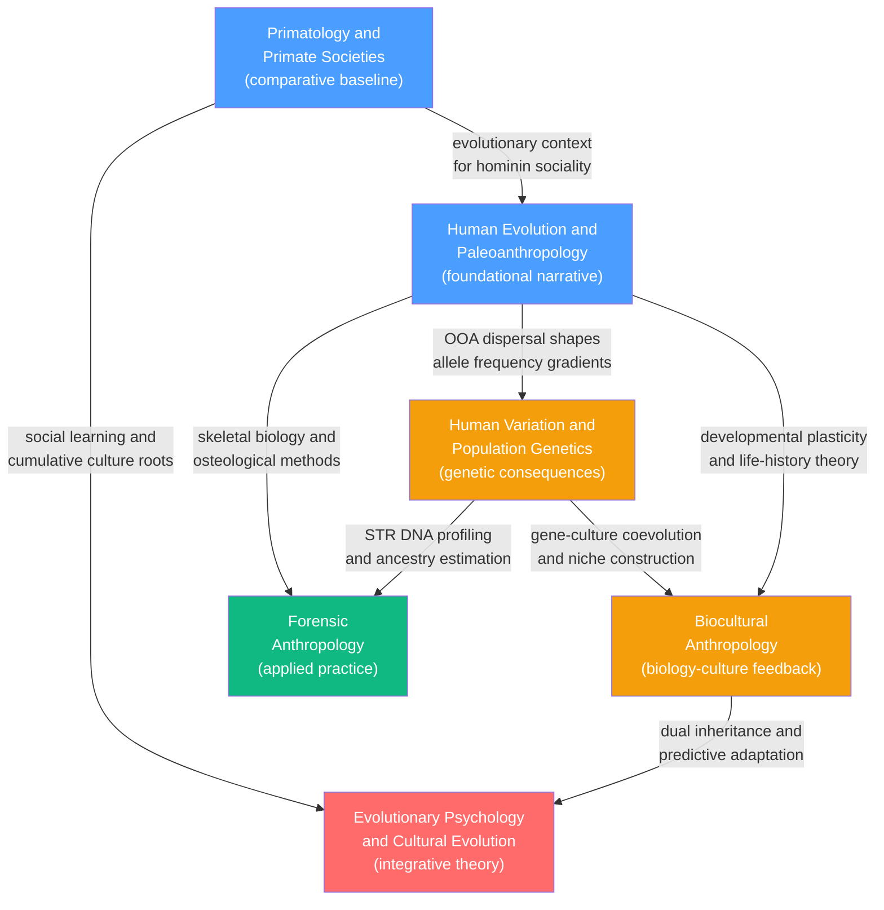

# Biological Anthropology

> [!abstract] Section Overview
> Biological anthropology studies the human species as a biological organism — its evolutionary origins among the primates, the genetic and phenotypic variation that dispersal produced across the globe, and the way biology and culture continuously reshape each other through development and evolution. The section moves from our closest living relatives through the 7-million-year fossil record of the hominin lineage, then turns to the genetic legacy of that history, the biocultural feedback loops that connect genes to lived experience, and finally the applied practice of reading skeletal evidence in legal and human-rights contexts.

---

## Notes in This Section

- [[Human_Evolution_and_Paleoanthropology]] — Reconstructs the hominin lineage from Sahelanthropus to H. sapiens via fossils, stone tools, and ancient DNA; covers Out-of-Africa dispersal, Neanderthal and Denisovan admixture, and dating methods
- [[Primatology_and_Primate_Societies]] — Goodall, de Waal, Hrdy, and Dunbar on chimpanzee politics, bonobo empathy, cooperative breeding, and the social brain hypothesis that links neocortex size to group complexity
- [[Human_Variation_and_Population_Genetics]] — Human biological variation is clinal, not racial; 85-90% of genetic diversity lies within populations; serial founder bottlenecks created the heterozygosity gradient from Africa outward
- [[Biocultural_Anthropology]] — Biology and culture are mutually constitutive; fetal programming, developmental plasticity, niche construction, and embodied inequality all show culture reaching inside the body to rewrite its biology
- [[Evolutionary_Psychology_and_Cultural_Evolution]] — Evolved psychological mechanisms plus dual inheritance theory plus gene-culture coevolution via niche construction explain how H. sapiens acquired uniquely cumulative culture
- [[Forensic_Anthropology]] — Applies skeletal biology to medico-legal investigations: biological profile construction, taphonomy, perimortem trauma analysis, and DNA-based mass identification for criminal prosecutions and human rights accountability

---

## Concept Map

*(Blue = foundational, Amber = integrative, Red = advanced theory, Green = applied)*

---

## Learning Path

Recommended order for a first pass through this section:

1. [[Primatology_and_Primate_Societies]] — Start here to establish the evolutionary baseline: what behaviours, social structures, and cognitive capacities existed in the lineage before it became distinctively human; Dunbar's social brain hypothesis frames why brains grew at all
2. [[Human_Evolution_and_Paleoanthropology]] — The chronological spine of the section; follow the hominin fossil record from Ardipithecus through H. sapiens, with ancient DNA settling the Out-of-Africa debate and revealing Neanderthal and Denisovan admixture
3. [[Human_Variation_and_Population_Genetics]] — The genetic legacy of that evolutionary history; understand why Africa harbours most human diversity, what clinal variation means, and why the folk concept of biological race does not map onto genetic reality
4. [[Biocultural_Anthropology]] — Bridge the biological and cultural: fetal programming, niche construction, and embodied inequality show how culture is written into biology at every timescale from gestation to millennia
5. [[Evolutionary_Psychology_and_Cultural_Evolution]] — The most theoretically integrative note; dual inheritance theory and the gene-culture coevolution framework synthesise everything above into an account of how cumulative culture became possible and what drives its spread
6. [[Forensic_Anthropology]] — Caps the section with applied practice; age, sex, stature, and ancestry estimation, taphonomy, trauma analysis, and DNA identification show biological anthropology deployed in courtrooms and mass-grave investigations

---

## All Notes in This Topic

| Note | Core Idea | Difficulty |
|------|-----------|------------|
| [[Human_Evolution_and_Paleoanthropology]] | 7-million-year hominin lineage reconstructed from fossils, stone tools, and ancient DNA; OOA with Neanderthal and Denisovan introgression | Beginner to Advanced |
| [[Primatology_and_Primate_Societies]] | Primate social organisation, tool use, culture, and the social brain hypothesis; Goodall, de Waal, Hrdy, Dunbar | Beginner to Advanced |
| [[Human_Variation_and_Population_Genetics]] | Human variation is clinal; 85-90% of genetic diversity is within populations; ancestry is probabilistic, not racial | Beginner to Advanced |
| [[Biocultural_Anthropology]] | Biology and culture are mutually constitutive; fetal programming, niche construction, and embodied inequality | Beginner to Advanced |
| [[Evolutionary_Psychology_and_Cultural_Evolution]] | Evolved psychological mechanisms plus dual inheritance theory explain cumulative culture via gene-culture coevolution | Beginner to Advanced |
| [[Forensic_Anthropology]] | Biological profile construction, taphonomy, trauma classification, and DNA identification for medico-legal investigations | Beginner to Advanced |

---

## Key Questions This Topic Answers

- What drove the evolution of large brains and symbolic culture in the hominin lineage, and when did behaviourally modern humans appear?
- Why do human populations differ in allele frequencies and phenotypic traits, and what does that variation have to do with biological race?
- How do cultural practices such as dairying, agriculture, and cooking feed back into human genetics to alter allele frequencies across generations?
- In what ways does early-life social and nutritional environment become permanently inscribed in the body — and how does inequality get transmitted biologically across generations?
- How can skeletal remains identify an individual, establish cause of death, and provide court-admissible evidence for war crimes prosecutions?

---

## Cross-Section Links

- [[Human_Origins_and_the_Paleolithic]] (Section 03 — Archaeology and Prehistory) — the archaeological record of stone tool industries, symbolic artefacts, and hominin site types that runs in parallel with the paleoanthropological fossil narrative
- [[Neolithic_Revolution_and_Agriculture]] (Section 03 — Archaeology and Prehistory) — the niche construction event that drove selection for amylase copy number variation, lactase persistence, and epidemic-disease immune variants; the canonical example of gene-culture coevolution
- [[Material_Culture_and_Technology]] (Section 03 — Archaeology and Prehistory) — lithic industries as proxies for cognitive evolution; the Oldowan-to-Upper-Paleolithic sequence maps directly onto the cognitive archaeology discussed in Evolutionary Psychology
- [[Four_Fields_of_Anthropology]] (Section 01 — History and Theory) — situates biological anthropology within the four-field model and clarifies its relationship to cultural, linguistic, and archaeological anthropology
- [[Kinship_Marriage_and_Family_Systems]] (Section 04 — Culture, Society and Religion) — primate kinship systems and cooperative breeding provide the evolutionary substrate that cultural kinship rules elaborate; Hamilton's rule underlies both primate and human kin investment
- [[Gender_Sexuality_and_the_Body]] (Section 04 — Culture, Society and Religion) — embodiment theory, sex estimation in forensic osteology, and Hrdy's research on female primate agency all converge on the body as simultaneously biological and culturally produced
- [[Semiotics_and_Symbolic_Communication]] (Section 05 — Language and Cognition) — the emergence of symbolic cognition in the Upper Paleolithic is the cognitive-evolutionary precondition for the semiotic systems that section 05 analyses; Tomasello's shared intentionality hypothesis bridges the two
