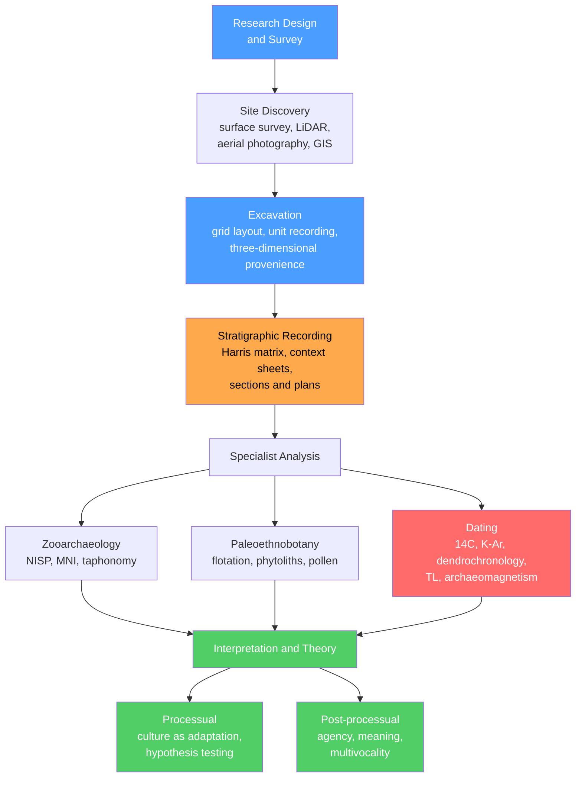

# Archaeology: Methods and Theory

> [!abstract] TL;DR
> Archaeology recovers human behaviour from material remains by combining rigorous fieldwork — systematic survey, stratigraphic excavation, and three-dimensional provenience recording — with an expanding toolkit of dating techniques (from radiocarbon calibration to LiDAR remote sensing) and two competing theoretical traditions: **processual archaeology**, which treats culture as an adaptive system testable by the scientific method, and **post-processual archaeology**, which insists on meaning, agency, and multivocality. Together, these tools and frameworks extend the human story some 3.3 million years into the past.

---

## Intuition

**Analogy:** Imagine the floor of an old library where papers have been piling up, spilled, burned, then covered by a new layer of papers every generation. The deepest layers are oldest, the dust tells you how long each pile sat, the charred edges record a fire, and the marginalia in each document encodes who was thinking what. Archaeology is the careful, three-dimensional excavation of that library — recording every sheet's exact position before lifting it, reading the dust, and arguing about what the marginalia means.

The critical point, often invisible to outsiders, is that excavation is **irreversible**. Every trowel stroke destroys a layer that cannot be re-dug. This is why recording — stratigraphy, photographs, coordinates, context sheets — is not bureaucracy. It is the data itself.

---

## How It Works



---

## Key Concepts

### Secondary Level

**Stratigraphy and the law of superposition.** Soil and debris accumulate in horizontal layers (strata). The **law of superposition** — borrowed directly from geology (see [[Relative_Dating_and_Stratigraphy]]) — states that, in an undisturbed deposit, lower layers are older. Archaeological deposits are rarely undisturbed: pits, postholes, burials, and root action all cut through earlier layers. An **intrusion** is a later feature that cuts into older strata; an **inversion** occurs when an earlier deposit is redeposited on top of a younger one. Recognising these disruptions requires reading the **context** — the texture, colour, inclusions, and contacts of each soil unit.

**Relative dating methods.** Three techniques order sites and objects without giving absolute ages:

| Method | Principle | Example use |
|--------|-----------|-------------|
| **Stratigraphy** | Lower = older; cross-cutting = younger | Sequencing occupation layers on a tell |
| **Typology** | Artefact forms change in recognisable patterns | Dating Bronze Age pottery by shape evolution |
| **Seriation** | Artefact types rise, peak, and fall in popularity | Ford's battleship curves for ceramic frequencies |

**Absolute dating methods.** These assign a calendar year or range:

| Method | Material dated | Useful range | Key limitation |
|--------|---------------|-------------|----------------|
| Radiocarbon ($^{14}$C) | Organic material (charcoal, bone, seeds) | ~500–50,000 yr BP | Requires calibration; sample contamination |
| Dendrochronology | Preserved wood | Last ~10,000 yr | Only where master chronology exists |
| Potassium-argon (K-Ar) | Volcanic rock or ash | > ~100,000 yr | Cannot date the artefacts directly; only interbedded volcanics |
| Thermoluminescence (TL) | Fired ceramics, burnt flint | ~100–500,000 yr | High analytical uncertainty |
| Archaeomagnetism | In-situ fired features (hearths, kilns) | Last ~10,000 yr | Requires local secular variation curve |
| Optically Stimulated Luminescence (OSL) | Unburnt sediment grains | ~1,000–500,000 yr | Must have been light-bleached before burial |

**Survey and remote sensing.** Archaeologists locate sites before excavating them:
- **Systematic surface survey**: teams walk equally spaced transects, recording surface finds. Controlled sampling (stratified random, systematic) allows statistical inference about site distribution.
- **Aerial photography**: crop marks reveal buried ditches and walls as differential plant growth (parched or lush strips).
- **Satellite imaging**: multispectral data detects buried soil anomalies invisible at ground level.
- **LiDAR (Light Detection and Ranging)**: airborne laser scanning strips away forest canopy digitally. In 2010 it revealed the full extent of the Classic Maya city of Caracol (Belize); in 2018, Amazonian geoglyphs invisible under forest cover were mapped at scale. LiDAR is now transforming tropical archaeology where surface survey is impossible.
- **GIS (Geographic Information Systems)**: integrates all spatial data into a single georeferenced framework, enabling predictive modelling and landscape-level analysis.

### Undergraduate Level

**The Harris matrix.** Edward Harris (1979) formalised stratigraphic recording with a directed acyclic graph (DAG). Each excavated **context** (layer, feature, cut) is a node. Edges encode three possible relationships between any pair:
1. **Stratigraphic superposition** (A is above/below B — they touch)
2. **Correlation** (A and B are the same deposit)
3. **No direct relationship** (A and B do not touch)

The matrix eliminates transitive edges (if A is above B and B is above C, A→C is implicit, not drawn). The result is a single, unambiguous sequence document for a site of any complexity. Intrusions show as "cuts" that interrupt the normal vertical sequence — a pit dug from level 5 into level 3 appears as an arrowhead pointing upward from the fill contexts back to the pit cut, which itself sits above the surfaces it truncated.

**Radiocarbon and calibration.** $^{14}$C is a radioactive isotope of carbon (6 protons, 8 neutrons) produced continuously in the upper atmosphere by cosmic-ray neutrons striking $^{14}$N. Living organisms exchange carbon with the atmosphere and maintain a constant $^{14}$C/$^{12}$C ratio. At death, exchange stops and $^{14}$C decays to $^{14}$N with a half-life of **5,730 years** (Cambridge convention):

$$N(t) = N_0\,e^{-\lambda t}, \qquad \lambda = \frac{\ln 2}{5730\;\text{yr}}$$

A measured $^{14}$C age (in "radiocarbon years BP") is not the same as a calendar age. Atmospheric $^{14}$C has fluctuated over time due to changes in solar activity, geomagnetic field strength, and ocean circulation. The **IntCal calibration curve** (updated in 2020 as IntCal20) converts radiocarbon years to calendar years using tree rings (dendrochronology), corals, speleothems, and varved sediments. During certain periods the curve is nearly flat — the **Hallstatt plateau** (~800–400 BCE) is the most notorious, where three centuries of calendar time collapse into a narrow band of radiocarbon ages, producing multi-modal calibrated distributions that are genuinely ambiguous.

**Excavation methodology.** A standard open-area excavation proceeds as follows:
1. **Grid layout**: a site-wide coordinate grid anchors all finds to known positions.
2. **Unit recording**: each excavated area is a unit; every context within it gets a unique number.
3. **Three-dimensional provenience**: every significant find is mapped in $x$, $y$, $z$ before removal.
4. **Flotation**: buckets of soil are passed through water; lightweight organic materials (seeds, charcoal, small bones) float into fine mesh sieves (**archaeobotanical** recovery). This is indispensable for paleoethnobotany.
5. **Wet screening**: sediment is washed through fine mesh (1 mm) to recover micro-artifacts (fish scales, rodent bones, tiny flints) invisible to hand excavation.
6. **Context sheets, photographs, plans, sections**: the complete written and visual record created simultaneously with the physical recovery. This documentation is the excavation.

**Zooarchaeology.** Faunal assemblages — the animal bones from a site — encode economy, seasonality, and environment. Two fundamental counting units:
- **NISP (Number of Identified Specimens)**: the count of all identifiable bone fragments. Fast to compute, but inflated by fragmentation — one cow yields more fragments than one fish.
- **MNI (Minimum Number of Individuals)**: the fewest animals that could account for all identified elements (e.g. three left tibiae = MNI of 3 cattle). More meaningful biologically, but sensitive to aggregation choices.

**Taphonomy** is the study of how organisms become fossils or bone assemblages — what happened between death and excavation. Carnivore gnawing, water transport, root etching, and heat alteration each leave diagnostic marks. Understanding taphonomy is essential before interpreting human agency: a "cut-marked" bone may have been processed by a hominin or simply trampled across a sharp flint.

**Paleoethnobotany** recovers plant use through:
- **Macro-botanicals**: charred seeds, wood, and nut shells recovered by flotation.
- **Phytoliths**: silica bodies secreted by plant cells that survive in the soil long after the plant has decayed; identifiable to genus under microscope.
- **Pollen (palynology)**: wind-borne pollen preserved in anaerobic deposits (bogs, lake sediments) reconstructs past vegetation and, by extension, land-use and climate.

### Graduate Level

**Processual archaeology (New Archaeology).** Emerging in the 1960s through Lewis Binford and David Clarke, processual archaeology applied the **hypothetico-deductive method** of the natural sciences to material culture. Core propositions:
- Culture is a **system** of interacting subsystems (technology, economy, social organisation, ideology), each functionally adapted to the environment.
- The archaeological record is a **systematic residue** of that adaptive behaviour — it is not random noise.
- Hypotheses about past behaviour must be made explicit and tested against empirical data. Untestable claims are not archaeology.
- **Middle-range theory** (Binford's term) bridges the **dynamic present** (living behaviour) and the **static past** (the material record). Ethnoarchaeology — studying living peoples as analogues — and **experimental archaeology** (making and using replicas) build the actualistic linkages needed to interpret the past.

Processualism elevated archaeological science and ended the casual "pots = people" cultural-historical narratives that preceded it, but its critics argued it reduced culture to a cold adaptive machine and marginalised meaning, power, and individual agency.

**Post-processual archaeology.** From the 1980s, Ian Hodder, Michael Shanks, and Christopher Tilley argued that the processual programme was fatally positivist: it assumed a single objective reading of the material record was possible. Post-processual positions include:
- **Hermeneutics**: meaning is contextually constructed; the same object means different things in different cultural frameworks. Interpretation is an iterative dialogue between data and theory, not a one-way test.
- **Agency theory**: individuals and groups actively use material culture to create, resist, and negotiate social identities — they are not passive adapters.
- **Feminist archaeology**: processual analyses systematically rendered women and non-elite groups archaeologically invisible. Explicitly gendered analyses recover marginalised histories.
- **Indigenous archaeology**: the communities whose heritage is being studied have intellectual, ethical, and legal standing in the interpretive process. NAGPRA (1990, USA) gave legal teeth to this principle.
- **Multivocality**: there is no single authoritative interpretation of a site. Communities, archaeologists, and descendant peoples may hold equally valid but different understandings.

The post-processual critique did not replace scientific rigour; most contemporary archaeology uses both: **hypothesis-testing methodology** (processual) combined with **interpretive sensitivity to context and meaning** (post-processual).

**Archaeometric specialist analyses.** Beyond radiocarbon, modern archaeology deploys:
- **Stable isotopes** ($\delta^{13}$C, $\delta^{15}$N, $^{87}$Sr/$^{86}$Sr) in human and animal teeth and bone — reconstructing diet (C3 vs C4 plants, protein ratio) and geographic mobility (strontium tracks geology of childhood residence).
- **Ancient DNA (aDNA)**: extracting degraded nuclear and mitochondrial DNA from bones and teeth to reconstruct kinship, population structure, migration, and ancestry. The aDNA revolution (post-2010 with next-generation sequencing) has rewritten European prehistory.
- **Residue analysis**: lipid residues absorbed into ceramic walls (GC-MS) identify the foods cooked in a pot; absorbed organic residues on lithic tools identify worked materials.
- **X-ray fluorescence (XRF) and INAA**: elemental fingerprinting of obsidian, ceramics, and metals to source raw materials and reconstruct exchange networks.

---

## Python Demo

```python
import numpy as np
import matplotlib.pyplot as plt

# -----------------------------------------------------------------------
# Radiocarbon calibration: from C-14 physics to calibrated calendar dates
# -----------------------------------------------------------------------

# --- Part 1: C-14 exponential decay ---
T_HALF = 5730.0                         # Cambridge half-life (years)
LAM    = np.log(2) / T_HALF             # decay constant λ  (per year)

t_yr  = np.linspace(0, 6 * T_HALF, 500)
frac  = np.exp(-LAM * t_yr)             # fraction of C-14 remaining

print(f"Decay constant λ = {LAM:.6e} per year")
print(f"Half-life        = {T_HALF:.0f} yr  (Cambridge convention)")

# --- Part 2: Simplified IntCal-style calibration curve ---
# Convention: cal_BP = calendar years before 1950 CE
#             rc_BP  = radiocarbon years before 1950 CE
# The real IntCal20 has 55 000 data points; this piecewise model captures
# the Hallstatt plateau (~800–400 BCE = ~2750–2350 cal BP) where the
# curve flattens, causing severe dating ambiguity.

cal_BP = np.linspace(0, 6000, 6000)

def calibration_curve(cal):
    """Piecewise approximate IntCal curve: rc_BP as a function of cal_BP."""
    rc = cal.copy().astype(float)
    # Hallstatt plateau: 2350 to 2750 cal BP all map to ~2450 14C BP
    plateau_lo, plateau_hi = 2350, 2750
    plateau_rc = 2450.0
    # Flat plateau region
    mask_flat = (cal >= plateau_lo) & (cal <= plateau_hi)
    rc[mask_flat] = plateau_rc
    # Ramp reconnecting plateau top to the linear trend above ~2750 cal BP
    ramp_lo, ramp_hi = plateau_hi, 3100
    mask_ramp = (cal > ramp_lo) & (cal < ramp_hi)
    frac_ramp = (cal[mask_ramp] - ramp_lo) / (ramp_hi - ramp_lo)
    rc[mask_ramp] = plateau_rc + frac_ramp * (ramp_hi - plateau_rc)
    return rc

rc_curve = calibration_curve(cal_BP)

# --- Part 3: Bayesian calibration of two measurements ---
# P(calibrated age | 14C measurement) ∝ likelihood × uniform prior
# Likelihood: Gaussian centred on curve value at each calendar age

# Measurement A: 14C = 2480 ± 40 BP  --> sits squarely on Hallstatt plateau
rc_A, sig_A = 2480.0, 40.0
prob_A = np.exp(-0.5 * ((rc_curve - rc_A) / sig_A) ** 2)
prob_A /= prob_A.sum()

# Measurement B: 14C = 1200 ± 40 BP  --> linear part of curve, well resolved
rc_B, sig_B = 1200.0, 40.0
prob_B = np.exp(-0.5 * ((rc_curve - rc_B) / sig_B) ** 2)
prob_B /= prob_B.sum()

peak_A = cal_BP[np.argmax(prob_A)]
peak_B = cal_BP[np.argmax(prob_B)]
print(f"\nDate A: 14C = {rc_A:.0f} ± {sig_A:.0f} BP (Hallstatt plateau)")
print(f"  Calibrated peak ≈ {peak_A:.0f} cal BP  (multi-modal -- ambiguous)")
print(f"\nDate B: 14C = {rc_B:.0f} ± {sig_B:.0f} BP (linear curve region)")
print(f"  Calibrated peak ≈ {peak_B:.0f} cal BP  (single-modal -- well resolved)")

# --- Plotting ---
fig, axes = plt.subplots(1, 3, figsize=(15, 5))

# Panel 1: C-14 decay curve
ax = axes[0]
ax.plot(t_yr / 1000, frac * 100, lw=2, color='steelblue')
ax.axhline(50, ls='--', color='gray', lw=1, label='50% remaining (1 half-life)')
ax.axvline(T_HALF / 1000, ls='--', color='gray', lw=1)
ax.set(xlabel='Time (kyr)', ylabel='14C remaining (%)',
       title='C-14 exponential decay')
ax.legend(fontsize=8); ax.grid(alpha=0.3)

# Panel 2: Calibration curve with plateau highlighted
ax = axes[1]
ax.plot(cal_BP, rc_curve, lw=2, color='darkorange', label='Calibration curve')
ax.axhspan(rc_A - sig_A, rc_A + sig_A,
           alpha=0.25, color='red', label=f'Date A: {rc_A:.0f} ± {sig_A:.0f} BP')
ax.axvspan(2350, 2750, alpha=0.15, color='purple', label='Hallstatt plateau')
ax.set(xlabel='Calendar age (cal BP)', ylabel='Radiocarbon age (14C BP)',
       title='Calibration curve (simplified IntCal)')
ax.invert_xaxis(); ax.invert_yaxis()
ax.legend(fontsize=8); ax.grid(alpha=0.3)

# Panel 3: Calibrated probability distributions
ax = axes[2]
ax.fill_between(cal_BP, prob_A * 100, alpha=0.55, color='red',
                label=f'Date A: 14C = {rc_A:.0f} BP\n(Hallstatt -- multi-modal!)')
ax.fill_between(cal_BP, prob_B * 100, alpha=0.55, color='steelblue',
                label=f'Date B: 14C = {rc_B:.0f} BP\n(linear -- resolved)')
ax.set(xlabel='Calibrated age (cal BP)', ylabel='Relative probability',
       title='Calibrated date distributions')
ax.invert_xaxis()
ax.legend(fontsize=8); ax.grid(alpha=0.3)

plt.tight_layout()
plt.show()
```

---

## Real-World Applications

> **LiDAR and the invisible cities.** In 2010, Arlen Chase and Diane Chase flew LiDAR over Caracol (Belize), the largest Classic Maya city, and in two weeks mapped more causeways, reservoirs, and agricultural terraces than 25 years of ground survey had found. In 2018, the PACUNAM LiDAR Initiative flew 2,100 km² of northern Guatemala and revealed that the Maya lowlands had sustained a population of 7–11 million at Classic peak — an order of magnitude above earlier estimates. The same technology applied to the Bolivian Amazon has uncovered an interconnected network of pre-Columbian urban settlements previously thought impossible in tropical forest environments.

> **Processual archaeology applied — Binford and Nunamiut ethnoarchaeology.** Lewis Binford spent years with the Nunamiut Inuit of Alaska, documenting exactly which bones they cracked (marrow), where they discarded carcasses (near-kill vs. far-from-camp), and how dogs and carnivores modified assemblages. These middle-range observations became the key for reading faunal assemblages from Pleistocene sites — what had been "ritual" bone distributions turned out to follow predictable butchery economics.

> **Post-processual in practice — Catalhoyuk.** Ian Hodder reopened Catalhoyuk (Turkey, 7500–6000 BCE) in 1993 explicitly as a post-processual laboratory: real-time publication on the internet, active collaboration with local communities, multiple interpretive frameworks co-existing in print. The result — a city with no streets, houses entered only from the roof, the dead buried under the floors — proved that the cultural meaning of domestic space could be archaeologically recoverable alongside processual economic data.

> **Ancient DNA rewrites European prehistory.** After 2015, large-scale aDNA studies showed that Neolithic farmers, arriving from Anatolia ~7000 BCE, largely replaced Mesolithic hunter-gatherers across Europe, and that a later migration of Yamnaya steppe herders (~3000 BCE) contributed the majority ancestry of northern Europeans today. Three massive demographic replacements in 5,000 years — invisible to artefact typology alone.

---

## Common Pitfalls

- **Confusing radiocarbon years with calendar years.** A raw $^{14}$C date of "2480 BP" is not 530 BCE. The Hallstatt plateau means it could be anywhere in a ~400-year window of the Iron Age. Always calibrate using IntCal and always report calibrated ranges.
- **Treating absence of evidence as evidence of absence.** Sites not yet found by survey are not proof that people were not there. Survey coverage, preservation bias (organic materials only survive under waterlogged or arid conditions), and visibility (vegetation, modern construction) all constrain the known record asymmetrically.
- **Excavating without recording.** Every context must be fully documented before removal. Post-hoc reconstruction from photographs is inadequate. The record IS the site.
- **NISP inflation.** Reporting specimen counts without accounting for differential fragmentation makes small fauna appear rare and large fauna appear dominant. MNI calculations are required for meaningful species abundance comparisons.
- **Ignoring taphonomy.** Attributing cut marks to hominins, charring to cooking, or bone concentrations to feasting without ruling out carnivore activity, natural burning, and hydraulic sorting is the fastest way to fabricate a narrative.
- **Uncritical ethnoarchaeological analogy.** Middle-range theory requires the analogy to be grounded ("direct historical approach") or structurally justified, not simply assumed. Nunamiut butchery patterns are not automatically the key to Pleistocene Neanderthal sites.
- **Sampling bias in flotation.** If only some contexts are floated, the absence of seeds in unexamined contexts is meaningless. Systematic flotation of representative samples from all context types is required.

---

## Related Concepts

- [[Relative_Dating_and_Stratigraphy]] — the geological law of superposition, unconformities, and cross-cutting relationships directly underpin archaeological stratigraphy; the Harris matrix is a formalisation of these geological principles for complex, disturbed anthropogenic deposits
- [[Radiometric_Dating]] — detailed treatment of the decay physics, isochron method, closure temperature, and concordia diagram; the archaeology-specific radiocarbon calibration problem is a subset of this broader geochronological framework
- [[Geologic_Time_Scale]] — provides the deep-time frame within which Paleolithic and prehistoric archaeology operates; dating of hominin fossils depends on K-Ar ages of interbedded volcanics calibrated against this timescale
- [[Fossils_and_the_Fossil_Record]] — taphonomy, preservation conditions, and the distinction between in-situ and reworked specimens apply equally to zooarchaeological faunal assemblages and to paleontological collections
- [[Sedimentary_Rocks_and_Environments]] — most archaeological sites are embedded in sedimentary matrices; understanding alluvial, colluvial, aeolian, and lacustrine depositional environments is essential for interpreting site formation processes
- [[Weathering_and_Soils]] — pedogenesis determines the preservation of organic materials; soil micromorphology (thin sections of intact sediment blocks) reads site formation processes at microscopic scale
- [[Atomic_Structure_and_Subatomic_Particles]] — isotopes, nuclear stability, and the concept of half-life are the atomic-level foundations of both radiocarbon and potassium-argon dating; understanding why $^{14}$C decays and $^{12}$C does not requires isotope physics
- [[Chemical_Kinetics]] — the exponential decay law $N = N_0 e^{-\lambda t}$ governing radiocarbon is the same first-order kinetics that governs radioactive decay in general; the chemistry of diagenesis (post-depositional alteration of bone and charcoal) is also a kinetic process
- [[Continental_Drift_and_the_Plate_Tectonics_Revolution]] — tectonic activity creates the volcanic ash layers (tephra) used for tephrochronology and K-Ar dating of hominin sites in the East African Rift; sea-level change driven by plate tectonics shapes coastal site preservation

---

## Review Questions

### Secondary

1. A site has three occupation layers. Layer 1 is at the bottom, layer 3 is at the top, and a rubbish pit cuts through all three. List the events from oldest to youngest and name the stratigraphic principle used at each step.
2. A piece of charcoal from a hearth gives a radiocarbon date of 3000 BP. Why can you not simply subtract 3000 from 2024 CE to get the calendar date of the fire? What additional step is required?
3. What is the difference between NISP and MNI, and why does it matter for interpreting whether a site was a hunting camp or a kill site?

### Undergraduate

1. Construct a Harris matrix for the following observations: (a) Pit F cuts layers A, B, and C; (b) pit F is filled by layer D; (c) layer D is sealed by layer E; (d) a posthole G cuts layer D but not layer E. List the relationships and draw the DAG. What is the relative sequence from oldest to youngest?
2. A date of 2480 ± 40 $^{14}$C BP falls on the Hallstatt plateau where the calibration curve is nearly flat. Explain, with reference to the calibrated probability distribution, why this date yields a multi-modal result spanning ~400 calendar years. What strategies can an archaeologist use to improve the precision of dating when trapped by such a plateau?
3. Compare and contrast processual and post-processual archaeology as theoretical programmes. In what specific ways did Binford's middle-range theory attempt to solve the inference problem, and what did Hodder argue this approach missed?

### Graduate

1. You are dating a Bronze Age agricultural site using multiple methods: radiocarbon on charred barley seeds, dendrochronology on a preserved roof beam, and archaeomagnetic dating of a kiln floor. Each gives slightly different results. How do you integrate these datasets, what does disagreement between them indicate, and which method would you trust most for absolute chronology and why?
2. An aDNA study of 80 skeletons from a cemetery shows that females have predominantly Anatolian Neolithic ancestry while males have predominantly Yamnaya steppe ancestry. Design two alternative archaeological hypotheses that could explain this pattern and specify what additional lines of evidence (material culture, stable isotopes, site structure) you would use to distinguish between them.
3. A taphonomic analysis of a Lower Palaeolithic faunal assemblage reveals high NISP of large bovids, cut marks on long bones, and a predominance of high-utility skeletal elements. A processual archaeologist argues this is systematic primary butchery by hominins; a post-processual critic argues the same pattern could result from carnivore accumulation and selective hominin scavenging. What actualistic (middle-range) studies would you cite to adjudicate between these interpretations, and what microscopic evidence on the bones themselves would be decisive?

---

## Sources

- Harris, E. C. (1979) — *Principles of Archaeological Stratigraphy*, Academic Press
- Binford, L. R. (1983) — *In Pursuit of the Past*, Thames and Hudson
- Hodder, I. (1986) — *Reading the Past: Current Approaches to Interpretation in Archaeology*, Cambridge University Press
- Renfrew, C. & Bahn, P. (2016) — *Archaeology: Theories, Methods, and Practice*, 7th ed., Thames and Hudson
- Reimer, P. J. et al. (2020) — "The IntCal20 Northern Hemisphere Radiocarbon Age Calibration Curve", *Radiocarbon* 62(4), 725–757
- Chase, A. F. & Chase, D. Z. (2011) — "Detection of Maya ruins by LiDAR", in *Archaeology from Historical Aerial and Satellite Archives*, Springer
- Haak, W. et al. (2015) — "Massive migration from the steppe was a source for Indo-European languages in Europe", *Nature* 522, 207–211
- Lyman, R. L. (1994) — *Vertebrate Taphonomy*, Cambridge University Press
- Pearsall, D. M. (2015) — *Paleoethnobotany: A Handbook of Procedures*, 3rd ed., Left Coast Press

---

#Anthropology #Archaeology #ArchaeologicalMethods #Stratigraphy #ProcessualArchaeology #PostProcessual #Radiocarbon #HarrisMatrix #Zooarchaeology #Paleoethnobotany #secondary #undergraduate #graduate
