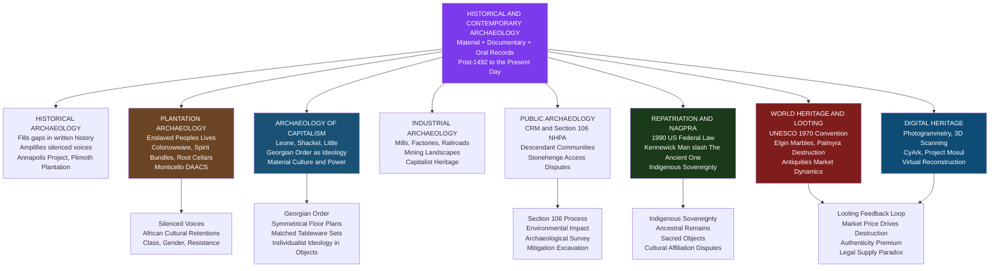

> [!abstract] TL;DR
> Historical and contemporary archaeology bridges material culture and documentary evidence to reconstruct the lives of ordinary people — especially those erased or silenced by written history — while confronting urgent present-day questions about who owns the past, who controls its interpretation, and how heritage can survive the twin threats of the antiquities market and political violence.

---

## Intuition

**Analogy:** A burned dinner receipt found beneath a floorboard tells you more about what a family actually ate on a Tuesday evening than any cookbook of the era — and the gap between the published recipe book and the charred receipt is precisely where historical archaeology operates.

Written documents are almost always produced by the literate, the powerful, and those with a stake in how events are remembered. Tax registers record property but not grief. Plantation ledgers count enslaved people as units of production but record nothing of the ceramic jar buried under a hearth, the seeds tucked into the hem of a dress, or the root cellar dug beneath a dwelling that held both food and forbidden ceremony. The material record does not replace the documentary one; it shadows it, contradicts it, and above all gives voice to the people the documents ignored. When archaeologists excavate a 17th-century tenement, a slave quarter, a factory dormitory, or a colonial port, they are conducting a systematic retrieval operation for lives that history chose not to write down.

---

## How It Works

Historical archaeology begins where written records also begin — roughly the 15th century CE for the Americas, with the arrival of European colonization — and extends to the present day. Its defining methodological advantage over purely prehistoric archaeology is the ability to triangulate between three independent sources of evidence: material culture (artifacts, architecture, soils, plant and animal remains), documentary records (tax registers, legal documents, diaries, maps, inventories), and oral history (descendant community testimony, folk memory). When these sources align, confidence is high; when they conflict, the conflict itself is analytically revealing.



The discipline is organized around a productive tension between two intellectual programs. The **documentary-materialist** tradition uses material evidence primarily to fill gaps in the written record — locating the sites mentioned in colonial journals, confirming or disconfirming the inventories in estate records, recovering the physical details behind named historical events. The **critical-materialist** tradition, emerging from the 1980s Chesapeake school (Leone, Shackel, Little), insists that material culture is not merely illustrative of written history but constitutes an independent and often subversive record of how power was lived, negotiated, and occasionally resisted at the everyday scale. Both traditions now coexist and are mutually reinforcing.

---

## Key Concepts

### Secondary Level

**What Is Historical Archaeology?**

Historical archaeology is the study of the material remains of historically documented societies — primarily, but not exclusively, those produced after European contact with the Americas in the late 15th century. The sub-discipline emerged as a distinct field in North America during the 1960s, professionalized through the Society for Historical Archaeology (founded 1967), and has since expanded into a global enterprise covering every inhabited continent.

The defining methodological challenge is the *document problem*: historical documents tend to be produced by and for elites, by literate colonial administrators, by churches recording baptisms and burials, by merchants tracking commodities. They rarely record the experiences of enslaved people, indentured laborers, women in domestic spheres, indigenous communities resisting colonization, or urban workers living in tenements. Material culture — the things people made, used, discarded, modified, and buried — is a more democratic archive. Ceramics, food bones, building foundations, clothing fasteners, coins, and personal items do not require literacy to produce; they are left by everyone.

The foundational sites that established the sub-discipline include **Plimoth Plantation** (Plymouth, Massachusetts), where excavations in the 1950s–70s confirmed and corrected the documentary record of the early English colony; the **Fortress of Louisbourg** in Cape Breton, Canada, where large-scale excavation supported a major restoration project; and **Colonial Williamsburg**, where decades of excavation beneath the restored colonial streetscape revealed the enslaved African quarter that the restoration project had initially erased. Each of these demonstrated that the ground contained evidence the archives had omitted.

**Stratigraphy and the Short Chronology**

Archaeological excavation of historical sites uses the same stratigraphic principles as prehistoric archaeology: later deposits overlie earlier ones, and artifact assemblages within a stratum date to the period of deposition. (See [[Relative_Dating_and_Stratigraphy]] for the foundational principles.) Historical archaeology benefits from a much denser chronological resolution: instead of the centuries-or-millennia intervals of prehistoric stratigraphy, historical archaeologists can often date deposits to within a decade using datable ceramic types (creamware after 1762, pearlware after 1779), coin dates, and cross-reference with documentary records. Dendrochronology (tree-ring dating) and occasionally [[Radiometric_Dating]] supplement ceramic and documentary dating for earlier or more ambiguous contexts.

**The Georgian Order as Material Ideology**

Mark Leone and Paul Shackel's work in Annapolis, Maryland, in the 1980s introduced a critical-materialist framework that transformed the sub-discipline. Their central argument: the physical ordering of colonial and early national life — the symmetrical facades of Georgian townhouses, the formal gardens laid out in geometric perspectival schemes, the matching sets of individual place settings replacing communal eating vessels — was not merely a stylistic fashion but an *ideological structure* that embedded the premises of merchant capitalism in daily domestic life.

The **Georgian Order** — Deetz's (1977) term, extended by Leone and Shackel — is the pattern of bilateral symmetry, segmentation, and individual unit organization that spread through British colonial domestic culture during the 18th century. A Georgian house has a centered front door, flanked by equal windows, opening into a central hall with symmetrically arranged rooms. The ceramic assemblage shifts from shared serving vessels and communal bowls to individual matching place settings — each person their own plate, cup, and fork, separated from others by identical boundaries. Leone and Shackel argued that this material regimentation served an ideological function: it naturalized the social logic of individualism, property ownership, and market exchange by embedding it in the most intimate routines of eating, sleeping, and domestic movement. To live in a Georgian house was to have one's body trained in the rhythms of capitalist individuality before one ever encountered a theoretical justification for it.

---

### Undergraduate Level

**The Archaeology of Capitalism (Leone, Shackel, Little)**

Building on Leone and Shackel's Annapolis work, Barbara Little and Paul Shackel edited *Meanings and Uses of Material Culture* (1992) and Leone co-authored *The Archaeology of Capitalism in Colonial Context* (2005), developing a coherent research program that archaeologists now call the "archaeology of capitalism." The core claim is that capitalism is not only an economic system but a *cultural formation* that reorganizes spatial practice, domestic life, time discipline, and bodily comportment in ways that can be read from the material record.

Three analytical moves define this program:

1. **Material culture as ideology**: following Althusser's concept of ideological state apparatuses and Bourdieu's notion of practice as embodied ideology, artifacts and architectural arrangements are read as carriers of ideological meaning — not because anyone consciously designed them to be, but because the material world has practical consequences for how people think and act. (See [[Political_Sociology_and_Social_Power]] for Bourdieu's field theory and misrecognition; see [[Conflict_Theory_and_Critical_Theory]] for Althusser's ideological state apparatuses.)

2. **The archaeology of discipline**: the arrangement of factory spaces, worker housing estates, and institutional buildings (prisons, asylums, schools) follows spatial logics that enforce time discipline, regulate movement, and separate and classify workers. Industrial capitalism's reorganization of human bodies in space is legible in the archaeological record of mill villages, mining towns, and railroad construction camps.

3. **Counter-narratives in the material record**: enslaved people, factory workers, indigenous communities, and others subject to capitalist discipline also left material traces of accommodation, negotiation, and resistance. Spirit bundles, unauthorized modifications to worker housing, hybrid ceramic forms, and spatially displaced caches of personal items are archaeological signatures of agency within constraint.

**Plantation Archaeology and Enslaved People**

Plantation archaeology emerged as a coherent sub-field in the 1970s–80s through work at sites including Monticello (Virginia), Drayton Hall (South Carolina), and Poplar Forest (Virginia). Its central contribution has been the systematic recovery of the material lives of enslaved African Americans — a population whose experience is catastrophically underrepresented in the documentary record and whose voices the dominant historical narrative was structurally organized to suppress.

Key artifact categories that plantation archaeology has identified and interpreted:

- **Colonoware**: low-fired, hand-built, unglazed earthenware found in abundance at plantation sites throughout the colonial Chesapeake and Lowcountry South Carolina. Initially classified as "Colono-Indian ware" attributed to Native American production, Leland Ferguson's reanalysis (*Uncommon Ground*, 1992) demonstrated that much colonoware was produced by enslaved African Americans, drawing on West African ceramic traditions (particularly hand-building and low-temperature firing techniques) transmitted through the slave trade. Colonoware is thus a physical document of African cultural retention under conditions of extreme coercion.

- **Spirit bundles and caches**: small deposits of unusual objects — crystals, coins, bone, pieces of mirror, buttons, shells — found beneath hearths, under doorways, and inside wall cavities at slave dwelling sites. Interpreted by archaeologists including Patricia Samford and Kenneth Brown as material expressions of African-derived spiritual practices (particularly traditions associated with Kongo cosmology and what anthropologists call "conjure"), these deposits document a hidden religious and protective material culture that the master class rarely documented and did not control.

- **Root cellars**: small earthen pits excavated beneath the floors of slave cabins, documented extensively at Monticello's Mulberry Row slave dwellings. These pits served practical functions (food storage in the absence of dedicated pantries) and potentially symbolic ones (small-scale spatial autonomy within the master's architectural frame). The Mulberry Row excavations, conducted since the 1970s under the auspices of the **Digital Archaeological Archive of Comparative Slavery (DAACS)** — a collaborative database linking Chesapeake plantation archaeology assemblages — have produced one of the most systematically analyzed collections of enslaved-life material culture in the world.

The political stakes of plantation archaeology are high and explicit. Thomas Jefferson's Monticello was for generations interpreted primarily as a monument to Enlightenment thought and architectural genius. The archaeological program, combined with descendant community engagement and a systematic reassessment of the documentary record, has progressively rebalanced this narrative: the mountain cannot be understood without the enslaved workers who built it, maintained it, and were themselves the primary economic asset on which Jefferson's philosophical leisure depended. The archaeology does not merely supplement the Enlightenment story; it reframes its conditions of possibility. (See [[Race_Ethnicity_and_Racism]] for structural racism and its historiography; [[Social_Class_and_Stratification]] for the material dimensions of social inequality.)

**Industrial Archaeology**

Industrial archaeology — the study of the physical remains of industrial production — emerged as a recognized sub-field in Britain during the 1950s–60s, catalyzed by the demolition of industrial infrastructure during post-war reconstruction. The **Ironbridge Gorge** in Shropshire, England, site of the world's first iron bridge (1779) and a concentration of early industrial production, became the type-site of the movement and was designated a UNESCO World Heritage Site in 1986.

Industrial archaeology extends the archive of capitalism's material history into the working landscape: cotton mills with their distinctive multi-storey brick construction and regulated window rhythms; mining landscapes with surface evidence of shaft positions, spoil heaps, and processing machinery; railroad infrastructure including cuttings, embankments, viaducts, and locomotive sheds; and factory complexes designed to separate and supervise workers according to the principles of Frederick Winslow Taylor's scientific management. These landscapes are physical documents of industrial capitalism's reorganization of labor, time, and space — and their preservation raises acute heritage management challenges as deindustrialization renders them obsolete.

**Public Archaeology and Cultural Resource Management (CRM)**

Public archaeology encompasses any archaeological practice that engages with public audiences, community stakeholders, or civic governance. In the United States it includes, but is not limited to, **Cultural Resource Management (CRM)** — the legally mandated archaeological work triggered by federally funded or permitted construction projects under the **National Historic Preservation Act (NHPA, 1966)**, specifically the Section 106 consultation process. The scale of CRM archaeology now dwarfs academic research archaeology in North America: the vast majority of professional archaeologists work in the CRM sector, undertaking surveys, assessments, and mitigation excavations as part of highway, pipeline, and development projects.

CRM archaeology is often criticized for being compliance-driven rather than research-driven — the goal is regulatory sign-off, not the advancement of knowledge — but the largest CRM projects have produced major research contributions. The Interstate highway program of the 1950s–70s produced systematic regional surveys across the US. The Tennessee Valley Authority dam projects of the 1930s–40s — the precursor to modern CRM — generated foundational data on Southeastern prehistory.

Public archaeology in the broader sense includes:

- **Descendant-community archaeology**: archaeological projects designed and governed in partnership with the communities whose ancestors produced the material record. Indigenous, African American, and other descendant communities are increasingly recognized as having intellectual and moral authority over the interpretation of their ancestors' material culture, not merely as informants or research subjects. This shift has produced collaborative methodological innovations and significant changes in publication ethics and data sharing.

- **Conflict archaeology and community memory**: the archaeology of battlefields, internment camps, refugee sites, and sites of atrocity — which may still be within living memory — requires particular sensitivity to community stakeholders for whom excavation is not a neutral research act but a potential retraumatization or desecration.

---

### Graduate Level

**NAGPRA and Indigenous Sovereignty Over Ancestral Heritage**

The **Native American Graves Protection and Repatriation Act (NAGPRA)**, enacted by the US Congress in 1990, is the most significant legislative intervention in the politics of archaeological heritage in US history. NAGPRA requires federal agencies and institutions that receive federal funding to:

1. Inventory human remains and associated funerary objects in their collections
2. Identify their cultural affiliation with present-day Native American tribes
3. Repatriate those remains and objects to culturally affiliated tribes upon request
4. Extend protection to Native American human remains and objects found on federal and tribal land

NAGPRA emerged from decades of advocacy by Native American organizations who had experienced generations of their ancestors' remains being excavated without consent and housed in museum storage facilities — sometimes by the thousands. The Smithsonian Institution alone held over 18,000 Native American skeletons as of 1990. NAGPRA represented a legislative recognition that Indigenous peoples' relationship to their ancestors is a sovereign right, not a research resource to be allocated by the scientific community.

The *Kennewick Man* case (1996–2017) is the most legally significant test of NAGPRA's provisions. A nearly complete human skeleton approximately 8,500 years old was discovered by two students at the bank of the Columbia River near Kennewick, Washington, on 28 July 1996. Physical anthropologist James Chatters, who examined the remains, noted skeletal morphology that he described as unlike modern Native Americans — an observation that sparked a major legal and scientific controversy. A coalition of Columbia Basin tribes (Colville, Yakama, Nez Perce, Umatilla, Wanapum) claimed the remains under NAGPRA as the "Ancient One" (*Qíilxw* in Umatilla). Eight physical anthropologists filed suit to prevent repatriation, arguing insufficient evidence of cultural affiliation and asserting the scientific community's right to study ancient human remains.

The federal court case — *Bonnichsen v. United States* — ultimately ruled in 2002 and 2004 that NAGPRA's "cultural affiliation" requirement could not be demonstrated for remains this ancient, since population continuity over 8,500 years cannot be established through material culture evidence alone. Scientists conducted extensive study of the skeleton. A 2015 ancient DNA study published in *Nature* (Rasmussen et al.) demonstrated that Kennewick Man was genetically most closely related to modern Native Americans, specifically to the Confederated Tribes of the Colville Reservation. In February 2017, the remains were formally repatriated and subsequently reburied. The case forced a critical reassessment of what "cultural affiliation" means across deep time, the limits of morphological race science, and the relative weight of genetic evidence versus tribal oral tradition in legal determinations of ancestral identity.

The broader principle at stake in NAGPRA debates — that Indigenous peoples hold sovereignty over their ancestral heritage regardless of scientific utility — connects directly to international indigenous rights law. The **UN Declaration on the Rights of Indigenous Peoples (UNDRIP, 2007)** extends this principle globally, establishing indigenous peoples' rights to maintain, protect, and develop their cultural heritage and traditional knowledge. (See [[Human_Rights_and_International_Law]] for the full international human rights framework; [[Nationalism_Ethnicity_and_Collective_Identity]] for the sociological theory of collective identity underpinning heritage claims.)

**World Heritage, Looting, and the UNESCO 1970 Convention**

The illicit antiquities trade is the third-largest illegal global market after drugs and weapons, with an estimated value of billions of dollars annually. Its mechanics are straightforward: demand from wealthy private collectors and (historically) major museums creates price signals; those signals incentivize looting of archaeological sites in source countries with weak state enforcement capacity; looted objects pass through a network of middlemen, dealers, and auction houses before entering legitimate markets and private collections, their origins laundered through false provenance documentation.

The **UNESCO Convention on the Means of Prohibiting and Preventing the Illicit Import, Export and Transfer of Ownership of Cultural Property (1970)** established the foundational international legal framework: states party to the convention agree to prohibit the import of cultural objects exported in violation of the exporting state's laws, and to return objects illicitly acquired after 1970. The "1970 date" has become the operational standard for museum acquisition ethics worldwide, with major institutions including the Metropolitan Museum of Art, the Getty, and the British Museum adopting acquisition policies requiring documented provenance before 1970.

The **Elgin Marbles** — the collection of classical Athenian architectural sculptures removed from the Parthenon and Erechtheion by Thomas Bruce, 7th Earl of Elgin, between 1801 and 1812 and sold to the British Museum in 1816 — are the most publicly contested example of the pre-1970 colonial removal problem. The Greek government has sought their return since 1983, arguing that the removal was authorized by a questionable Ottoman *firman* (permit) and that the sculptures constitute an indivisible part of a world heritage site. The British Museum's counter-argument — that it provides "universal access" to heritage from a neutral, cosmopolitan institution — enacts a particular theory of world heritage ownership that post-colonial states and source-country scholars increasingly reject as a relic of colonial cultural extraction.

The **ISIS destruction of Palmyra (2015)** demonstrated the intersection of deliberate cultural vandalism, looting economics, and digital heritage response. After ISIS captured the Syrian city in May 2015, they demolished the 1st-century Temple of Bel, the Temple of Baalshamin, and the iconic Arch of Triumph; executed the city's retired antiquities director, Khaled al-Asaad, when he refused to reveal the locations of hidden artifacts; and systematically looted and sold antiquities to fund their operations. The destruction was simultaneously ideological (erasing pre-Islamic heritage) and financial (the looting provided significant revenue). Archaeological response involved global mobilization of digital documentation resources: organizations including **CyArk**, **Project Mosul**, and **ICONEM** used existing photographs, tourist snapshots uploaded to social media, and pre-destruction 3D scans to reconstruct photogrammetric models of destroyed structures. The Triumphal Arch was reconstructed as a 1:3 scale marble replica using CNC-milled stone and displayed in Trafalgar Square (London) and Times Square (New York), raising contested questions about whether such reproductions honor or trivialize the original destruction.

**Digital Heritage and the Documentation Imperative**

**Photogrammetry** — the technique of generating three-dimensional spatial measurements and models from multiple overlapping photographs — has transformed archaeological documentation over the past decade. Structure-from-Motion (SfM) photogrammetry, implementable with consumer-grade cameras and open-source software (Agisoft Metashape, Meshroom), allows archaeologists to produce high-resolution 3D models of excavation trenches, artifact assemblages, architectural features, and entire sites in hours rather than days. The resulting models are spatially precise, permanently shareable, and reproducible — the photogrammetric archive is itself a form of excavation record that can be re-interrogated after the site has been destroyed.

Beyond post-destruction reconstruction, digital heritage tools serve proactive documentation (scanning sites before threatened destruction by development, climate change, or conflict), democratization (making heritage globally accessible through platforms like Sketchfab), and community archaeology (enabling descendant communities to access virtual replicas of objects held in distant museum collections). The political implications are significant: digital repatriation — providing high-resolution 3D scans of objects to source communities while the physical objects remain in holding institutions — is an imperfect but often practically achievable interim step toward full repatriation. (See [[Radiometric_Dating]] and [[Relative_Dating_and_Stratigraphy]] for the physical dating frameworks that digital documentation must still anchor to.)

**Community Archaeology and the Ethics of Who Speaks for the Past**

The most fundamental theoretical shift in contemporary archaeology has been the recognition that the discipline is not a politically neutral scientific enterprise but a practice embedded in power relations that determine whose past is authorized to be studied, by whom, for whom, and according to whose interpretive framework. This shift — articulated variously as "indigenous archaeology," "community-based participatory research," "collaborative archaeology," and "descendant-community archaeology" — challenges the traditional model in which professionally credentialed archaeologists hold interpretive authority over the material record of communities they study but do not belong to.

The shift has concrete methodological implications:

- **Free, prior, and informed consent (FPIC)**: before initiating research on sites associated with indigenous or descendant communities, archaeologists are increasingly expected to obtain community consent to the research design, not merely notification of its occurrence.
- **Community intellectual property rights**: the interpretive frameworks, oral histories, and cultural knowledge that communities contribute to archaeological interpretation are their intellectual property; authorship and attribution protocols should reflect this.
- **Data sovereignty**: digital data produced by archaeological work on indigenous land belongs to the community; communities should control the conditions under which it is shared with researchers and the wider public.

These principles are contested at their edges — what constitutes "community"? How is community authority determined when multiple communities claim the same heritage? What happens when scientific interpretation and community interpretation conflict? — but their direction is clear: the paternalistic model of professional archaeologists as objective arbiters of the past is no longer tenable as a default ethical position. (See [[Political_Sociology_and_Social_Power]] for the power dynamics of knowledge production; [[Global_Inequality_and_Development]] for the structural conditions of archaeological source countries and receiving countries.)

---

## Python Demo

This simulation models antiquities market dynamics — the supply-side feedback loop between market price, looting rate, and site depletion — and tests three scenarios: a baseline with no intervention, a legal-supply policy (museum replicas, certified excavations providing legal alternatives), and a demand-reduction policy (provenance requirements, criminalization of possession, education). The key insight: legal-supply policies create a market-expansion and authenticity-premium effect that paradoxically sustains high looting rates, while demand reduction is the only intervention that breaks the feedback loop.

```python
import numpy as np
import matplotlib.pyplot as plt

rng = np.random.default_rng(42)

# ── Model parameters ───────────────────────────────────────────────────────────
N_SITES  = 2000     # archaeological sites at simulation start
T        = 120      # time periods (policy years)
D0       = 400.0    # baseline collector demand (bid-units per period)
BETA     = 1.5      # demand price-sensitivity (demand falls as price rises)
ALPHA    = 1.0      # looting price-sensitivity (loot rate rises with price)
SCARCITY = 0.7      # scarcity-premium: price amplifies as sites are exhausted


def market_price(demand, alpha, beta, depletion):
    """
    Equilibrium price where collector demand equals looting supply.
    Depletion (0 to 1) amplifies price through scarcity premium.
    P* = demand * (1 + SCARCITY * depletion) / (alpha + beta)
    """
    return demand * (1.0 + SCARCITY * depletion) / (alpha + beta)


def run_scenario(scenario):
    sites = float(N_SITES)
    prices, loot_rates, sites_arr, cumulative_loss = [], [], [], []
    lost = 0.0

    for t in range(T):
        depletion = 1.0 - sites / N_SITES   # 0 at start; approaches 1 as sites are lost

        if scenario == "baseline":
            demand = D0

        elif scenario == "legal_supply":
            # Policy: museum replicas and certified excavations supply legal alternatives.
            # Effect 1 (intended): shifts ~20% of demand away from illicit market.
            # Effect 2 (perverse): normalizing collecting expands total market size;
            # authentic original items command a growing scarcity premium because no
            # legal replica can substitute for the "real" looted original.
            legal_frac = min(0.20, t * 0.002)        # up to 20% demand shifted to legal
            market_growth = 1.0 + 0.005 * t          # 0.5% market growth per period
            demand = D0 * market_growth * (1.0 - legal_frac)

        else:  # "demand_reduction"
            # Policy: criminalize possession, mandate provenance, education campaign.
            # Demand decays ~1.5% per period as collectors face legal and social costs.
            demand = D0 * max(0.10, 1.0 - 0.015 * t)

        price = market_price(demand, ALPHA, BETA, depletion)

        # Looting rate: proportional to price; diminishing returns as fewer sites remain
        # (remaining sites are harder to find, better guarded, or in remote locations)
        loot = ALPHA * price * np.sqrt(max(sites / N_SITES, 0.0))
        loot += rng.normal(0.0, 1.5)                        # stochastic enforcement noise
        loot = float(np.clip(loot, 0.0, sites * 0.08))     # cap at 8% of remaining per period

        lost  += loot
        sites  = max(sites - loot, 0.0)
        prices.append(price)
        loot_rates.append(loot)
        sites_arr.append(sites)
        cumulative_loss.append(lost)

    return (np.array(prices), np.array(loot_rates),
            np.array(sites_arr), np.array(cumulative_loss))


# ── Run all three scenarios ────────────────────────────────────────────────────
scenarios = ["baseline", "legal_supply", "demand_reduction"]
results   = {s: run_scenario(s) for s in scenarios}

colors = {
    "baseline":        "#dc2626",
    "legal_supply":    "#d97706",
    "demand_reduction":"#2563eb",
}
labels = {
    "baseline":        "Baseline (no policy)",
    "legal_supply":    "Legal-supply policy\n(replicas, certified excavations)",
    "demand_reduction":"Demand-reduction policy\n(criminalization, provenance requirements)",
}
t_axis = np.arange(T)

# ── Plot ───────────────────────────────────────────────────────────────────────
fig, axes = plt.subplots(1, 3, figsize=(15, 5))

panel_configs = [
    ("Market Price of Antiquities",           0),
    ("Site Destruction Rate (sites/period)",  1),
    ("Archaeological Sites Remaining",        2),
]

ylabels = [
    "Market price (arbitrary units)",
    "Looting rate (sites destroyed per period)",
    "Sites remaining",
]

for ax, (title, idx), ylabel in zip(axes, panel_configs, ylabels):
    for sc in scenarios:
        ax.plot(t_axis, results[sc][idx],
                color=colors[sc], lw=2.0, label=labels[sc])
    ax.set_xlabel("Time (policy periods)")
    ax.set_ylabel(ylabel)
    ax.set_title(title)
    ax.legend(fontsize=8)
    ax.grid(alpha=0.3)

fig.suptitle(
    "Heritage Looting Market Dynamics\n"
    "Legal-supply policy expands market and preserves authenticity scarcity premium;\n"
    "only demand-reduction breaks the price-looting feedback loop.",
    fontsize=11, fontweight="bold"
)
plt.tight_layout()
plt.savefig("heritage_looting_dynamics.png", dpi=120, bbox_inches="tight")
plt.show()

# ── Summary statistics ─────────────────────────────────────────────────────────
print(f"\n{'Scenario':35s}  {'Sites Remaining':>15}  {'Cumulative Loss':>15}  {'Heritage Destroyed':>20}")
print("-" * 90)
for sc in scenarios:
    _, _, sites, cum_loss = results[sc]
    pct = cum_loss[-1] / N_SITES * 100
    print(f"{labels[sc].split(chr(10))[0]:35s}  {sites[-1]:>15.0f}  "
          f"{cum_loss[-1]:>15.0f}  {pct:>19.1f}%")

print()
print("Key insight: Legal-supply policy (yellow) underperforms or matches the baseline")
print("because market-expansion and authenticity-premium effects absorb the legal competition.")
print("Demand-reduction (blue) is the only intervention that sustainably reduces site destruction.")
print("This models the 'cultural property economist' paradox identified by archaeological")
print("ethicists: well-intentioned market liberalization proposals can worsen site destruction.")
```

---

## Real-World Applications

**Annapolis Project (Leone and Shackel, 1982–present)**

The "Archaeology in Annapolis" project, directed by Mark Leone at the University of Maryland, is the most sustained application of critical archaeology in North America. Excavating 18th-century lots in Annapolis, Maryland's historic district, Leone and colleagues documented the formal gardens of the William Paca House — a Signer of the Declaration of Independence — and demonstrated that the elaborate geometric perspectival garden design created an optical illusion of depth that made the garden appear larger and more ordered than it was. Leone read this not as horticultural vanity but as a material enactment of Enlightenment ideology: the ordered landscape performed mastery over nature, symbolically enacting the same rationalist individualism that merchant capitalism required of its subjects. The project further developed a public archaeology component — guided tours that explicitly explained the archaeological interpretation to visitors, inviting them to consider how material environments shape thought — which became a model for critical public engagement with heritage sites.

**Monticello DAACS and the Archaeology of Slavery**

The Digital Archaeological Archive of Comparative Slavery (DAACS), hosted by Thomas Jefferson's Monticello, is a collaborative digital infrastructure connecting plantation archaeology assemblages from over 80 sites across the Chesapeake and Caribbean. By standardizing recording methods and sharing datasets, DAACS enables comparative analysis impossible at the single-site scale: tracking how ceramic assemblages at slave dwellings change across the Atlantic world, correlating diet diversity with plantation size and crop regime, and identifying artifact patterns that suggest specific African regional origins among the enslaved population. The Monticello excavations of Mulberry Row — the domestic and industrial work street adjacent to Jefferson's mansion — produced hundreds of thousands of artifacts from slave cabin deposits, systematically revising the interpretation of Monticello as a site of philosophical reflection toward an understanding of it as a working plantation whose intellectual output was subsidized by enslaved labor.

**The Kennewick Man Resolution (1996–2017)**

The 21-year legal and scientific dispute over the Ancient One / Kennewick Man produced lasting changes in NAGPRA's implementation and physical anthropology's relationship to indigenous communities. The 2015 aDNA study that demonstrated close genetic affinity with modern Columbia Basin tribes — resolving in favor of the tribes' oral historical claims — was a landmark not only for the specific repatriation case but for the methodology: ancient DNA evidence is now routinely used to evaluate NAGPRA cultural affiliation claims, transforming a purely osteological and material-culture determination into a genomic one. The reburial in February 2017 was conducted with ceremony by the coalition of tribes and without the scientific access that the plaintiffs had sought — a legal and ethical vindication of tribal sovereignty over ancestral remains.

**CyArk and the Digital Preservation of Palmyra**

The nonprofit organization CyArk (founded 2003 by Ben Kacyra, inventor of the long-range 3D laser scanner) had documented Palmyra's major structures with LiDAR and photogrammetric scanning before ISIS's 2015 destruction. Following the destruction, this archive enabled partial virtual reconstruction and informed the design of the 1:3-scale marble replica of the Triumphal Arch. CyArk has since documented over 500 heritage sites in 80+ countries, creating a pre-destruction digital archive that functions as insurance against future deliberate destruction, development, or climate-driven deterioration. The philosophical tension this raises — between the irreplaceable physicality of heritage and the preservation of informational content — is a live debate in heritage studies: does digital documentation preserve heritage, or does it provide a false sense of security that facilitates inaction on physical conservation?

---

## Common Pitfalls

- **Privileging documentary over material evidence** — When documents and artifacts conflict, the instinct is to trust the document. In historical archaeology, this instinct must be reversed: documents were produced by the powerful and encode their perspectives; artifacts were produced by everyone, including those the documents ignored. The discrepancy between what documents say and what artifacts show is often the most analytically productive finding.

- **Treating colonoware as passive African retention** — Leland Ferguson's corrective was crucial: colonoware is not merely a survival of African ceramic tradition but an active, contextually deployed cultural practice. Enslaved potters did not merely reproduce West African forms; they adapted them to available materials, trading networks, and the specific conditions of plantation slavery. The ceramic is a document of creative adaptation under constraint, not passive cultural inertia.

- **Misapplying NAGPRA's "cultural affiliation" standard** — "Cultural affiliation" under NAGPRA is not identity with a modern tribe but a "shared group identity that can be reasonably traced historically or prehistorically" between the human remains and a present-day tribe. It does not require proof of direct biological descent. The Kennewick Man case demonstrated both the difficulty of applying this standard across deep time and the inadequacy of relying solely on morphological assessment when aDNA evidence is available.

- **Conflating CRM with research archaeology** — CRM archaeology is compliance-driven: its primary goal is demonstrating that a federal undertaking has met its legal obligations under NHPA, not advancing archaeological knowledge. Most CRM reports are produced under non-disclosure constraints, published in limited-circulation grey literature, and lack the comparative context of research-driven projects. The enormous data produced by CRM work is systematically underutilized because it is structurally organized to serve regulatory rather than scientific ends.

- **Assuming the UNESCO 1970 Convention solves the looting problem** — The 1970 convention is a meaningful normative threshold but is not an enforcement mechanism. It does not retroactively address pre-1970 colonial removals (Elgin Marbles, Benin Bronzes, Rosetta Stone). For post-1970 objects, enforcement depends entirely on source-country national laws, destination-country import controls, and the due-diligence practices of dealers and auction houses — all of which have historically been weak. The convention establishes norms; enforcement requires domestic legal infrastructure, international cooperation, and political will that varies enormously across receiving-country contexts.

- **Treating digital documentation as equivalent to physical preservation** — 3D scans, photogrammetric models, and LiDAR point clouds preserve spatial and surface information but not material composition, micro-stratigraphic context, or the experiential qualities of the physical object. Digital archives can be rendered obsolete by format changes, depend on institutional maintenance, and can create false confidence that heritage has been "saved" when only one dimension of its information content has been captured.

---

## Related Concepts

- [[Political_Sociology_and_Social_Power]] — Leone and Shackel's archaeology of capitalism draws directly on Bourdieusian practice theory and the concept of misrecognition; the Georgian Order is a material instantiation of symbolic power that naturalizes capitalist individualism; critical archaeology applies Gramscian hegemony theory to the material record
- [[Human_Rights_and_International_Law]] — NAGPRA is a domestic legal instantiation of indigenous rights norms; UNDRIP extends NAGPRA-type provisions globally; the UNESCO 1970 Convention operates within the same international law framework as other cultural property rights instruments; ICC prosecutions of heritage destruction (Timbuktu, Ahmad al-Faqi al-Mahdi, 2016) establish cultural property destruction as a war crime
- [[Nationalism_Ethnicity_and_Collective_Identity]] — heritage disputes are fundamentally disputes about collective identity; the Elgin Marbles controversy is inseparable from Greek national identity construction; NAGPRA's "cultural affiliation" requirement operationalizes ethnic-boundary theory in a legal context; ISIS's destruction of Palmyra was simultaneously a statement about whose cultural identity is legitimate
- [[Relative_Dating_and_Stratigraphy]] — the stratigraphic principles underlying all archaeological excavation; historical archaeology's short chronology depends on the same law of superposition as prehistoric archaeology, calibrated with datable historical-period ceramic types
- [[Radiometric_Dating]] — radiocarbon dating of organic materials from historical deposits provides absolute dates that cross-check documentary and ceramic typological chronologies; AMS radiocarbon dating of small samples is now routine in historical archaeology
- [[Fossils_and_the_Fossil_Record]] — paleoanthropological context for understanding the deep human past from which historical archaeology's subjects emerged; ancient human remains at the center of NAGPRA disputes intersect with paleoanthropology's analytical frameworks
- [[Social_Class_and_Stratification]] — the material conditions of class inequality are archaeologically legible in housing quality, ceramic assemblages, diet diversity, and spatial access; industrial archaeology documents capitalism's reorganization of working-class life in physical space
- [[Conflict_Theory_and_Critical_Theory]] — Althusser's ideological state apparatuses and Gramsci's hegemony provide the theoretical framework for Leone's critical archaeology; the archaeology of capitalism is applied conflict theory working through material evidence
- [[Race_Ethnicity_and_Racism]] — plantation archaeology's core contribution is making the material dimensions of racial slavery visible; the history of physical anthropology's complicity in scientific racism shapes the NAGPRA debates and the politics of skeletal analysis
- [[Global_Inequality_and_Development]] — the structural geography of the antiquities trade maps onto global inequality: source countries are predominantly in the Global South with weak enforcement capacity; destination markets are predominantly wealthy Western and East Asian collecting centers; this asymmetry is constitutive of the looting problem
- [[State_Formation_and_Political_Development]] — historical archaeology documents the material footprint of state formation processes; the archaeology of colonial administration, frontier expansion, and resistance provides evidence for how states project power and how communities accommodate or evade it

---

## Review Questions

### Secondary

1. A plantation inventory from 1770 lists 45 enslaved people by name and occupation but no personal possessions. An archaeologist excavating a slave quarter on the same plantation recovers fragments of colonoware, a small cache of quartz crystals and a coin beneath the hearthstone, and the remains of a root cellar. What can the material evidence tell us that the documentary record cannot? What are the limits of each source?

2. The British Museum argues that keeping the Elgin Marbles in London ensures "universal access" to world heritage and protects them from political instability. Greece argues that they are an inseparable part of a world heritage site and should be returned. What values are in conflict here, and what framework would you use to adjudicate between them?

3. Why was NAGPRA necessary as federal legislation rather than something museums and universities could have done voluntarily? What does the existence of tens of thousands of unconsented human remains in US museum collections tell us about the structure of the relationship between the archaeological profession and indigenous communities before 1990?

### Undergraduate

1. Leone and Shackel argue that the Georgian Order — symmetrical house plans, matching individual place settings, formal perspectival gardens — was a material ideology that naturalized capitalist individualism. Is this argument convincing? What alternative explanations exist for the adoption of Georgian aesthetics (fashion diffusion, aspirational display, practical functionality), and how would you design an archaeological study to distinguish between ideological and non-ideological explanations?

2. The Kennewick Man case pitted scientific claims (the remains are a research resource that belongs to humanity) against indigenous sovereignty claims (the remains are an ancestor who must be reburied according to tradition). The aDNA evidence ultimately supported the tribal position. But suppose the aDNA evidence had been ambiguous or contradictory — how should the conflict between scientific access and indigenous sovereignty be resolved, and on what grounds?

3. Cultural Resource Management (CRM) archaeology accounts for the majority of professional archaeological practice in the US but produces research that is systematically underutilized. Describe the structural reasons for this underutilization and evaluate at least two proposed reforms (mandatory digital publication, a national grey literature repository, CRM-academic partnerships) in terms of their feasibility and likely impact on knowledge production.

### Graduate

1. The "archaeology of capitalism" program (Leone, Shackel, Little) claims that material culture is not merely illustrative of social history but constitutively ideological — that the physical ordering of domestic space actively reproduces the social relations of capitalist production. Evaluate this claim against two competing interpretations: (a) that Georgian-order material culture reflects rational economic choices (individual place settings are more hygienic than shared vessels) and (b) that it reflects stylistic diffusion through elite emulation unrelated to capitalist ideology. What evidence would distinguish between these three explanations, and what methodological approaches would be most productive?

2. The UNESCO 1970 Convention's "1970 date" standard creates a sharp normative boundary that leaves the largest and most iconic colonial removals — the Elgin Marbles, the Benin Bronzes, the Rosetta Stone — outside its scope. Various legal and ethical frameworks have been proposed for addressing pre-1970 removals: retroactive application of the 1970 standard, loan-based solutions, co-ownership models, and unconditional return. Evaluate each framework using international law, property ethics, and the practical politics of institutional change. Which framework best balances heritage access, cultural sovereignty, and institutional feasibility?

3. Ancient DNA evidence is increasingly used to resolve NAGPRA cultural affiliation disputes, as in the Kennewick Man case. But aDNA analysis introduces new epistemological problems: it requires destructive sampling of irreplaceable remains; its interpretation depends on reference populations whose composition is itself historically contingent; and genetic ancestry does not map straightforwardly onto cultural identity (the same objection applies in reverse to physical morphology). Develop a framework for evaluating the appropriate evidentiary role of aDNA in NAGPRA cultural affiliation determinations that takes seriously both the scientific value of genetic evidence and the tribal sovereignty argument that genetic relationships are not the appropriate basis for ancestral claims.

---

## Sources

- [Ferguson, L., *Uncommon Ground: Archaeology and Early African America, 1650–1800*, Smithsonian Institution Press, 1992](https://www.smithsonianbooks.com)
- [Leone, M. P., "A Historical Archaeology of Capitalism," *American Anthropologist* 97(2), 1995](https://anthrosource.onlinelibrary.wiley.com/doi/abs/10.1525/aa.1995.97.2.02a00050)
- [Leone, M. P., Potter, P. B. Jr., and Shackel, P. A., "Toward a Critical Archaeology," *Current Anthropology* 28(3), 1987](https://www.researchgate.net/publication/281039027_Toward_a_Critical_Archaeology)
- [Deetz, J., *In Small Things Forgotten: An Archaeology of Early American Life*, Anchor Books, 1977 (expanded ed. 1996)](https://www.penguinrandomhouse.com/books/302474/in-small-things-forgotten-by-james-deetz/)
- [Little, B. J. and Shackel, P. A. (eds.), *Meanings and Uses of Material Culture*, Society for Historical Archaeology, 1992](https://sha.org)
- [Burke Museum, "The Ancient One (Kennewick Man)"](https://www.burkemuseum.org/news/ancient-one-kennewick-man)
- [EBSCO Research Starters, "Kennewick Man Controversy"](https://www.ebsco.com/research-starters/anthropology/kennewick-man-controversy)
- [Rasmussen, M. et al., "The ancestry and affiliations of Kennewick Man," *Nature* 523, 455–458, 2015](https://www.nature.com/articles/nature14625)
- [Monticello, "Mulberry Row Reassessment — Archaeology"](https://www.monticello.org/archaeology/recent-research/mulberry-row-reassessment)
- [DAACS — Digital Archaeological Archive of Comparative Slavery](https://www.daacs.org/plantations/monticello/)
- [UNESCO, "About the 1970 Convention"](https://www.unesco.org/en/fight-illicit-trafficking/about)
- [The Art Newspaper, "Fifty years on, UNESCO's convention against illicit trafficking of cultural artefacts still shines bright"](https://www.theartnewspaper.com/2020/11/13/fifty-years-on-unescos-convention-against-illicit-trafficking-of-cultural-artefacts-still-shines-bright)
- [Smarthistory, "A market for looted antiquities"](https://smarthistory.org/elgin-marbles-debate-rages/)
- [Smarthistory, "Palmyra: the modern destruction of an ancient city"](https://smarthistory.org/palmyra-destruction-2/)
- [PBS NOVA, "The Technology That Will Resurrect ISIS-Destroyed Antiquities"](https://www.pbs.org/wgbh/nova/article/digital-preservation-syria/)
- [Trigger, B. G., *A History of Archaeological Thought* (2nd ed.), Cambridge University Press, 2006](https://www.cambridge.org/core/books/history-of-archaeological-thought/6A9DE1E3C9D71B8E0ECC00E0F22CA76F)
- [Orser, C. E. Jr. (ed.), *Encyclopedia of Historical Archaeology*, Routledge, 2002](https://www.routledge.com)
- [Michigan Journal of International Law, "Should They Go Back? Problems of International Law and the Elgin Marbles"](https://www.mjilonline.org/should-they-go-back-problems-of-international-law-and-the-elgin-marbles/)
- [Hyperallergic, "In Acts of Resistance, Artists and Scholars Digitally Reconstruct the Past"](https://hyperallergic.com/270503/in-acts-of-resistance-artists-digitally-reconstruct-the-destroyed-past/)

---

#Anthropology #Archaeology #HistoricalArchaeology #PublicArchaeology #PlantationArchaeology #NAGPRA #Repatriation #ArchaeologyOfCapitalism #IndustrialArchaeology #HeritageManagement #DigitalHeritage #CulturalProperty
