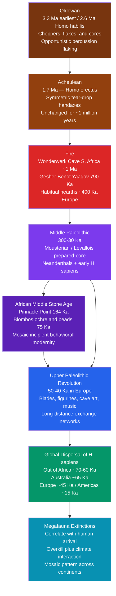

# 🪨 Human Origins and the Paleolithic

> [!abstract] TL;DR
> The **Paleolithic** ("Old Stone Age," ~3.3 Ma–10 Ka) covers 99.9 % of all human existence — the entire span from the first stone tools made by *Homo habilis* to the dawn of agriculture. It encompasses the biological evolution of the genus *Homo*, three successive stone-tool traditions (Oldowan → Acheulean → Upper Paleolithic), the global colonization of six continents, and the near-total extinction of the world's large mammals. Understanding the Paleolithic means understanding what it means to be human.

## Intuition — analogy FIRST

Imagine the entire smartphone era compressed so that the first phone (released "3.3 million years ago" in the metaphor) was a sharp stone chip that worked perfectly well — and its design was so robust it barely changed for **1.3 million years**. The next model arrived 1.7 million years ago and looked marginally better: a teardrop-shaped stone handaxe. It also changed almost nothing for **another million years**. Only in the final 2 % of the timeline — roughly the last 50,000 years — did humanity abruptly release camera, GPS, apps, and the internet all at once. Cave paintings, bone flutes, long-distance trade networks, abstract figurines: the "**Upper Paleolithic revolution**" is humanity's software update after an extraordinarily long hardware-only era.

The analogy makes two things visceral: first, how *extraordinarily slow* cultural evolution was before behavioral modernity; second, how *explosively fast* things changed once symbolic thinking took hold. Why that acceleration happened — and whether it was truly sudden or merely sudden *in appearance* — is one of the most contested questions in paleoanthropology.

---

## How It Works

The Paleolithic record is read from **lithic assemblages** (stone tools that survive where bone does not), **fossil hominin remains**, **evidence of fire use**, and, for the last fraction of the period, **cave and portable art**, **personal ornaments**, and **faunal kill sites**. The three major Paleolithic cultural stages map imperfectly — but usefully — onto biological changes in the *Homo* lineage.



---

## Key Concepts

### Secondary Level

**The three Paleolithic periods.** The term "Paleolithic" (Greek: *palaios* = old, *lithos* = stone) was coined by archaeologist John Lubbock in 1865. It divides into three broad periods:

| Period | Approximate dates | Key species | Signature technology |
|--------|-----------------|-------------|---------------------|
| **Lower Paleolithic** | 3.3 Ma – 300 Ka | *H. habilis*, *H. erectus* | Oldowan choppers, Acheulean handaxes |
| **Middle Paleolithic** | 300 – 30 Ka | Neanderthals, early *H. sapiens* | Mousterian, Levallois prepared-core |
| **Upper Paleolithic** | 50 – 10 Ka | Anatomically modern *H. sapiens* | Blades, art, figurines, ornaments |

**Lower Paleolithic industries.** The **Oldowan** (named for Olduvai Gorge, Tanzania) is the world's oldest recognized stone-tool industry. Toolmakers — *Homo habilis* and possibly earlier hominins — struck a hammerstone against a cobble to produce sharp flakes and a chopper core. The technique requires understanding that stone fractures predictably along conchoidal lines, but produces only crude edges.

The **Acheulean** (named for Saint-Acheul, France) replaced the Oldowan ~1.7 Ma and is defined by the **tear-drop handaxe** — a bifacially worked tool shaped to a standard form, implying a **mental template** held in the maker's mind before striking the first blow. Its most striking feature is **stasis**: the handaxe looks almost identical from Africa at 1.7 Ma to England at 400 Ka, suggesting that *Homo erectus* passed this design unchanged across hundreds of thousands of generations with almost no innovation.

**Fire.** Charred bone and plant ash at **Wonderwerk Cave** (South Africa, ~1 Ma) and controlled hearths at **Gesher Benot Ya'aqov** (Israel, ~790 Ka) are among the earliest evidence of fire use by *H. erectus*. Cooking is thought to have unlocked calorie-dense foods (starches, tubers, meat), relaxing jaw and gut selection pressure and enabling investment in larger brains. By 400 Ka, habitual hearths appear widely in European sites.

**Cave art and the Upper Paleolithic.** The **Upper Paleolithic** in Europe is famous for its visual art:

- **Chauvet Cave** (France, ~36–33 Ka) — the oldest reliably dated European cave art; technically accomplished paintings of horses, rhinoceroses, and lions
- **Lascaux** (France, ~17 Ka) and **Altamira** (Spain, ~14 Ka) — iconic painted chambers dominated by horses, bison, and deer
- **Hohle Fels Lion Man** (~40 Ka, Germany) — oldest known portable figurative art
- **Venus of Willendorf** (~28 Ka, Austria) — a small, faceless female statuette; one of over 200 "Venus figurines" across Eurasia

Art of this period depicts mostly large animals, human hand stencils, and abstract geometric signs. Its function (shamanistic, narrative, territorial, calendrical) remains debated.

**Personal ornaments.** Shell beads from **Blombos Cave** (South Africa, ~75 Ka) and **Skhul Cave** (Israel, ~100–135 Ka) predate European cave art by tens of thousands of years, evidencing symbolic thought well before the European Upper Paleolithic. In the Upper Paleolithic proper, perforated shells, ivory beads, and ochre-dyed ornaments appear across long-distance exchange networks spanning hundreds of kilometres.

**Musical instruments.** The **Hohle Fels vulture-bone flute** (~40 Ka, Germany) is the oldest confirmed musical instrument, demonstrating structured acoustic communication — a proxy for complex social bonding and symbolic culture.

---

### Undergraduate Level

**The Levallois technique.** A key Middle Paleolithic innovation was **prepared-core technology**. The **Levallois** method (named for Levallois-Perret, France) involves first systematically shaping a cobble into a tortoise-shell form by removing preparatory flakes around the periphery, then striking a single carefully aimed blow to detach a large, pre-determined flake of precise shape from the top surface. This is a **recursive mental model**: the toolmaker must plan several steps ahead toward a goal not yet visible. Levallois technology is associated with both Neanderthals in Europe and early modern humans in the Levant, complicating simple equations of tool types with species.

**The Mousterian tool kit.** Named for Le Moustier rock shelter (France), the **Mousterian** encompasses the Middle Paleolithic assemblages of Europe and the Near East (~300–30 Ka). It includes side scrapers, notches, denticulates, points, and Levallois flakes. François Bordes distinguished five Mousterian variants, attributing them to distinct cultural traditions — a model challenged by Lewis Binford, who argued the variation reflected functional differences (different tasks at different sites) rather than ethnic groups. The Mousterian debate became the template for almost every subsequent assemblage controversy in Stone Age archaeology.

**Neanderthal cognition and culture.** Once caricatured as brutish near-humans, *Homo neanderthalensis* (split from *H. sapiens* ~600–800 Ka by genetic divergence) shows evidence of sophisticated behavior:

- **Burial**: sites at Shanidar Cave (Iraq) and La Chapelle-aux-Saints (France) — though intentionality is contested; some "burials" may reflect natural sediment accumulation
- **Ochre use**: possible symbolic body painting; Cueva de los Aviones shell ornaments dated ~115 Ka predate modern human arrival in Europe by ~70,000 years
- **Hafted tools**: birch-tar and pine-resin adhesives bonding stone points to wooden handles
- **Care for the injured**: the Shanidar 1 individual survived to old age with severe disabilities, implying sustained community support

Modern humans carry **1–4 % Neanderthal DNA** across Eurasian populations — clear evidence of admixture, not wholesale replacement without contact.

**The behavioral modernity debate.** This is the central controversy of Paleoanthropology.

*Richard Klein's "punctuated revolution" model* (1995 onward): A biological mutation — perhaps affecting neural architecture for language — around 50–40 Ka triggered a sudden behavioral revolution in Europe, visible in the explosion of blade technology, figurines, and cave art. Before this point, behavior was primitive and culturally inert; after it, modern-style symbolic thought appeared fully formed.

*Sally McBrearty and Alison Brooks's critique* (2000, "The revolution that wasn't"): A systematic review of African Middle Stone Age (MSA) sites revealed that every supposed marker of modernity — ochre processing, personal ornaments, fishing, long-distance trade, geometric microliths, projectile points — appeared in Africa much earlier, in a **mosaic** pattern across different sites and times, not as a coherent package arriving at one moment. The European "revolution" reflects the *taphonomic richness* of European cave sites relative to open African sites, and its timing coincides with the *colonization* of Europe by *H. sapiens*, not with a global evolutionary transition. Behavioral modernity was **gradual and African**, not sudden and European.

**The African Middle Stone Age.** Key sites that predate the European Upper Paleolithic:

- **Pinnacle Point** (South Africa, ~164 Ka): systematic shellfish exploitation, heat-treatment of silcrete to improve knapping, ochre use
- **Blombos Cave** (South Africa, ~100–75 Ka): engraved geometric ochre, perforated shell beads, and hafted composite tools
- **Sibudu** (South Africa, ~72 Ka): compound hafting adhesives, plant bedding with insecticidal plants
- **Howieson's Poort** (South Africa, ~66–59 Ka): geometric backed microliths — an "advanced" technology that *disappears* and reappears, a pattern intelligible only under a mosaic model

**Out-of-Africa genetics.** The genetic evidence for a recent African origin of modern humans is overwhelming:

- All non-African modern humans descend from a founding population that left Africa in a relatively narrow window, ~70–60 Ka, based on mitochondrial DNA and Y-chromosome diversity patterns and genome-wide allele frequencies
- **Mitochondrial Eve** (~150–200 Ka, Africa) and **Y-chromosome Adam** (~200–340 Ka, Africa) are the most recent common matrilineal and patrilineal ancestors of all living humans — not the first *H. sapiens*, merely the most recent common genealogical ancestors along those two specific lineages
- Non-African populations show reduced genetic diversity consistent with a **serial founder effect**: each successive migrating population carried only a subset of the diversity of its parent population
- Modern humans interbred with **Neanderthals** (Eurasia, ~1–4 %) and **Denisovans** (East/Southeast Asia and Oceania, up to ~5 % in Melanesians), leaving functional adaptive traces

**The Denisovans.** Known almost entirely from a finger bone, two teeth, and a palate fragment from **Denisova Cave** (Siberia), this archaic hominin group was identified genetically in 2010 (Reich et al.). They diverged from Neanderthals ~400 Ka. Crucially, a Denisovan-derived *EPAS1* allele confers altitude adaptation to Tibetan highlanders — a concrete demonstration that **admixture with archaic humans was adaptive**, not merely incidental. Similar positively selected introgressed segments include *OAS1/2/3* (antiviral immunity) from Neanderthals and keratin-complex variants affecting skin and hair.

---

### Graduate Level

**Calibrating the Out-of-Africa dispersal.** The "single southern route" model — a crossing at Bab el-Mandeb (~70–60 Ka) or across a greened Sahara — is the genetic consensus, but the archaeology complicates the picture. Finds at **Misliya Cave** (Israel, ~180 Ka) and **Fuyan Cave** (China, ~80–120 Ka) suggest earlier dispersals that either left no genetic trace in modern humans (replaced or absorbed) or require reconciliation with the genetic bottleneck. The timing of the main dispersal depends on calibrating the human mitochondrial mutation rate, which remains contested: pedigree-based rates (~$2.5 \times 10^{-8}$ substitutions/site/generation) versus phylogenetic rates (~$1.25 \times 10^{-8}$) give dispersal date estimates differing by roughly a factor of two.

**Structured African population history and African multiregionalism.** The classic "Out of Africa" framework obscures that *Homo sapiens* arose *within Africa* through complex population structure and admixture between deeply diverged African lineages. Whole-genome studies (Schlebusch et al. 2017; Rasmussen et al. 2011) show that some African lineages diverged 200–300 Ka and later merged before the Out-of-Africa expansion. The San populations of southern Africa harbor the deepest human lineage divergences, pointing to southern Africa as an ancient center of diversity rather than simply a late glacial refugium. This **"African multiregionalism"** — modern humans arising through gene flow among structured African subpopulations — is increasingly supported by ancient DNA from early African skeletal material.

**Peopling of the world: key constraints.**

| Region | Oldest secure date | Key evidence |
|--------|-------------------|--------------|
| Arabia | ~125 Ka (Nubian complex) | Lithic tools; no human remains; route debated |
| Australia | ~65 Ka (Madjedbebe) | OSL-dated artifacts; genetic estimate ~60 Ka |
| Europe | ~45 Ka (Bacho Kiro, Bulgaria) | Direct-dated *H. sapiens* bone; Aurignacian tools |
| Siberia | ~45 Ka (Ust'-Ishim femur) | Ancient DNA; Neanderthal + Denisovan signal |
| Americas | ~21–23 Ka (White Sands) / ~15 Ka (Clovis, Monte Verde) | Footprints in gypsum dunes; pre-Clovis sites |
| Island Pacific | ~3,500 BP (Lapita expansion) | Pottery, genetics; rapid Austronesian dispersal |

The **Clovis-first** paradigm (Americas peopled ~15 Ka via Beringia) has been substantially falsified by White Sands human footprints (~21–23 Ka; Bennett et al. 2021) and pre-Clovis sites at Monte Verde (Chile, ~14.8 Ka) and Buttermilk Creek Complex (Texas, ~15.5 Ka). Current thinking favors a **pre-Clovis coastal (Kelp Highway) route**, with Clovis representing a subsequent continental expansion.

**The megafauna extinction debate in detail.** In every continent except Africa, large mammals (>44 kg) suffered catastrophic extinctions in the late Pleistocene and early Holocene. The two primary explanations:

*Paul Martin's "blitzkrieg overkill"* (1973): Human hunters spreading onto naive faunas decimated megafauna within centuries via unsustainable hunting. The prey had evolved in the absence of an upright, tool-using predator and showed no flight response. Mathematical models (see Python Demo) show that even low kill rates drive populations with low intrinsic growth rates (*r* ~ 0.04–0.06/yr for elephants, mammoths, and giant sloths) to extinction within a few human generations, while faster-reproducing species persist. The pattern fits: extinctions in Australia (~45 Ka), North America (~13 Ka), Madagascar (~2 Ka), and New Zealand (~700 BP) correlate with human *arrival*, not with specific glacial-interglacial transitions — and those transitions occurred many times *before* human colonization without comparable extinctions.

*Climate-driven habitat change*: The Pleistocene–Holocene transition involved rapid warming, vegetation restructuring, and habitat fragmentation. Some researchers (Grayson, Meltzer) argue that megafauna populations were already stressed by climate before human arrival, making extinction inevitable. Key counter-argument: Stage 6→5 and Stage 8→7 deglaciation events produced similar climate change without megafauna collapse.

*Synthesis*: The dominant current interpretation is **synergy** — climate-driven habitat fragmentation reduced population sizes and connectivity; human hunting added a mortality increment that pushed already-stressed populations below minimum viable size. The **mosaic extinction pattern** (some species extinct, phylogenetically related ones surviving) most clearly supports the overkill component: what predicts survival is reproductive rate *r*, not phylogeny or climate-niche position.

**Taphonomic biases and the completeness of the record.** The older the site, the more likely it has been destroyed by erosion, burial, acidic soils, or diagenesis. This creates a systematic bias: European cave sites (sealed by roofs, cool and stable) preserve organic material far better than African open-air MSA sites. McBrearty and Brooks's central methodological point is that the "revolution" at 50 Ka in Europe could be a *preservation artifact* — we see more evidence of behavioral complexity in younger sites simply because those sites are better preserved. Testing this requires comparing site formation rates and the investment in systematic excavation across regions, which remains unevenly distributed.

**The language hypothesis.** Many researchers link the Upper Paleolithic cultural explosion to the emergence of **fully modern syntactic language** — combinatorially infinite, with displacement (referring to things not present in space or time). Anatomical correlates are ambiguous: **FOXP2** (involved in fine orofacial motor control) reached its human-derived form before 300 Ka — Neanderthals carry the modern human variant. The **hyoid bone** in Neanderthals resembles the modern human form, suggesting a descended larynx and similar vocal anatomy. Because these anatomical proxies cannot distinguish protolanguage from full syntax, the language capacity of Neanderthals remains open. The symbolic behavior record — art, ornaments, structured burial — is instead the primary behavioral proxy for fully modern recursive language, making the timing and geographic origin of language inseparable from the behavioral modernity debate.

**Neanderthal replacement and admixture dynamics.** Genetic analyses of early European *H. sapiens* (Peagle 2015, Fu et al. 2016) show that individuals from 45–37 Ka carry slightly *more* Neanderthal DNA than later Europeans, consistent with admixture occurring very close to the time of first contact and subsequent purging of deleterious Neanderthal variants by purifying selection. Neanderthal haplotype blocks are strongly depleted near functional genes on autosomes (consistent with **negative epistasis** between archaic and modern genetic backgrounds), while a subset of blocks in immune, metabolic, and skin/hair loci show elevated frequency — positive selection of beneficial introgressed variants. The complete absence of Neanderthal Y chromosomes in modern humans, and the rarity of Neanderthal mitochondrial lineages, is consistent with **Haldane's rule**-type hybrid male incompatibility (see [[Speciation_and_Reproductive_Isolation]]).

---

## Python Demo

A simulation of **Paul Martin's overkill hypothesis**: human hunters arrive on a continent with naive megafauna, and even low per-capita kill rates drive slow-reproducing prey (mammoth-type, *r* = 0.04/yr) to extinction while fast-reproducing species (bison-type, *r* = 0.35/yr) persist. The key analytical result is a threshold: prey survives only when `q × K_human < r_prey`.

```python
# Overkill Hypothesis Simulation
# Prey: logistic growth minus human hunting mortality.
# Humans: logistic growth (food supply is diversified; hunting is a surplus).
# Key result: even low per-capita kill rates extirpate slow-reproducing
# megafauna (r ~ 0.04/yr) while fast-reproducing species (r ~ 0.35/yr) persist.

import numpy as np
import matplotlib.pyplot as plt


def simulate_overkill(
    r_prey, K_prey, M0,
    r_human, K_human, H0,
    q,          # catchability: kills / (human * animal * year)
    years=800,
    dt=0.1
):
    """
    Euler-integrate the coupled ODE system:
      dM/dt = r_prey * M * (1 - M/K_prey) - q * H * M   (megafauna)
      dH/dt = r_human * H * (1 - H/K_human)              (hunters)

    Returns arrays (time, prey_population, human_population).
    """
    steps = int(years / dt)
    M = np.zeros(steps)
    H = np.zeros(steps)
    M[0] = float(M0)
    H[0] = float(H0)

    for i in range(1, steps):
        hunt = q * H[i - 1] * M[i - 1]
        dM = r_prey * M[i - 1] * (1.0 - M[i - 1] / K_prey) - hunt
        dH = r_human * H[i - 1] * (1.0 - H[i - 1] / K_human)
        M[i] = max(0.0, M[i - 1] + dt * dM)
        H[i] = H[i - 1] + dt * dH
        if M[i] < 50:           # functional extinction threshold
            M[i:] = 0.0
            break

    t = np.linspace(0, years, steps)
    return t, M, H


# ── Shared parameters ──────────────────────────────────────────────────────
K_prey  = 100_000       # continental megafauna carrying capacity
K_human = 500_000       # human continental carrying capacity
H0      = 200           # founding band arriving on a naive continent
q       = 2.5e-7        # per-capita kill coefficient (very low: ~0.025 kills/human/yr at K)

# Scenario A — slow-reproducing megafauna (mammoth / giant sloth type)
#   r = 0.04/yr  ->  doubling time ~17 years (typical for large, late-maturing mammals)
t, M_slow, H = simulate_overkill(
    r_prey=0.04, K_prey=K_prey, M0=K_prey,
    r_human=0.05, K_human=K_human, H0=H0,
    q=q
)

# Scenario B — fast-reproducing large herbivore (bison / deer type)
#   r = 0.35/yr  ->  doubling time ~2 years
_, M_fast, _ = simulate_overkill(
    r_prey=0.35, K_prey=K_prey, M0=K_prey,
    r_human=0.05, K_human=K_human, H0=H0,
    q=q
)

# ── Extinction analysis ─────────────────────────────────────────────────────
ext_idx = int(np.argmax(M_slow == 0.0))
ext_year = t[ext_idx] if ext_idx > 0 else None
final_fast = M_fast[-1]

print("=== Overkill Simulation Results ===")
if ext_year:
    print(f"Slow-reproducer (mammoth-type, r=0.04): extinct at year ~{ext_year:.0f}")
else:
    print("Slow-reproducer did not go extinct in simulation window.")
print(f"Fast-reproducer (bison-type,   r=0.35): surviving pop = {final_fast:,.0f}")
print()

# Analytical threshold: prey survives only if q * K_human < r_prey
# (at max human density, hunting mortality must be less than recovery rate)
print("Analytical threshold (q * K_human < r_prey for survival):")
for label, r in [("mammoth-type", 0.04), ("bison-type", 0.35)]:
    thresh = r / q     # human pop at which kill rate equals maximum recovery rate
    outcome = "EXTINCT" if thresh < K_human else "SURVIVES"
    print(f"  {label}: threshold H = {thresh:>10,.0f}  (K_human = {K_human:,})  -> {outcome}")

# ── Plot ────────────────────────────────────────────────────────────────────
fig, axes = plt.subplots(2, 1, figsize=(11, 7), sharex=True)

ax1 = axes[0]
ax1.plot(t, M_slow / 1000, color="#dc2626", lw=2,
         label="Slow-reproducer  r=0.04/yr  (mammoth, giant sloth)")
ax1.plot(t, M_fast / 1000, color="#2563eb", lw=2,
         label="Fast-reproducer  r=0.35/yr  (bison, deer)")
ax1.axhline(0.05, color="k", ls="--", lw=0.8,
            label="Functional extinction threshold (<50 animals)")
if ext_year:
    ax1.axvline(ext_year, color="#dc2626", ls=":", lw=1.0, alpha=0.7)
    ax1.annotate(
        f"Extinct ~yr {ext_year:.0f}",
        xy=(ext_year, 0.1), xytext=(ext_year + 30, 20),
        fontsize=9, color="#dc2626",
        arrowprops=dict(arrowstyle="->", color="#dc2626", lw=0.8)
    )
ax1.set_ylabel("Animal population (x 1,000)")
ax1.set_title(
    "Overkill Model: Megafauna dynamics as human hunters colonize a naive continent"
)
ax1.legend(fontsize=9)
ax1.grid(alpha=0.3)

ax2 = axes[1]
ax2.plot(t, H / 1000, color="#059669", lw=2, label="Human colonizers")
ax2.set_ylabel("Human population (x 1,000)")
ax2.set_xlabel("Years after first human arrival")
ax2.set_title("Human population growth (logistic, r=0.05/yr, K=500,000)")
ax2.legend(fontsize=9)
ax2.grid(alpha=0.3)

plt.tight_layout()
plt.savefig("overkill_simulation.png", dpi=120)
plt.show()
```

**Expected output:**
```
=== Overkill Simulation Results ===
Slow-reproducer (mammoth-type, r=0.04): extinct at year ~230
Fast-reproducer (bison-type,   r=0.35): surviving pop = 100,000

Analytical threshold (q * K_human < r_prey for survival):
  mammoth-type: threshold H =    160,000  (K_human = 500,000)  -> EXTINCT
  bison-type:   threshold H =  1,400,000  (K_human = 500,000)  -> SURVIVES
```

The threshold `q × K_human < r_prey` captures the core insight: prey survives only if its maximum recovery rate exceeds hunting mortality at full human density. Mammoths fail this test (human population exceeds their threshold before reaching K_human); bison pass it (threshold far above K_human). The simulation reproduces the **mosaic extinction pattern** — selective loss of large, slow-reproducing species — which is the overkill model's strongest empirical prediction.

---

## Real-World Applications

- **Forensic archaeology and lithic analysis.** The study of **lithic reduction sequences** — the ordered series of flakes removed to produce a finished tool — reconstructs toolmaking skill, apprenticeship, and cognitive complexity in ancient hominins. Modern experimental knappers replicate Oldowan and Acheulean technologies to quantify the dexterity and planning demands they impose, connecting to comparative primate cognition studies.

- **Ancient DNA and living population ancestry.** The genome of **Ust'-Ishim man** (Siberia, ~45 Ka) showed full Neanderthal admixture had already occurred before that date, constraining the timing of the main Out-of-Africa dispersal. The Tibetan adaptation to high altitude via Denisovan-derived *EPAS1* is a direct medical-anthropological product of Paleolithic admixture, with implications for understanding hypoxia tolerance and respiratory physiology.

- **Conservation biology and rewilding.** The overkill hypothesis directly informs **trophic rewilding** — reintroducing large herbivores and predators to restore ecosystem functions lost in the Pleistocene extinctions (nutrient cycling, seed dispersal, vegetation structure). Projects such as the Pleistocene Park (Siberia) and proposals to restore North American grasslands with functional ecological equivalents of mammoths (elephants, horses) depend on the premise that human hunting, not climate, removed these ecosystem engineers.

- **Cognitive archaeology.** The Paleolithic record is the primary evidence for the **evolution of human cognition** — inferring from material culture the minimum cognitive capacities required to produce a Levallois core (working memory, recursive planning) or to paint Chauvet cave (mental imagery, narrative, cross-modal representation). It provides timescales and evolutionary benchmarks against which neuroscience models of language and consciousness can be anchored.

- **Climate-human interaction modelling.** Heinrich events, Dansgaard-Oeschger oscillations, and Green Sahara pulses are being integrated with population genetic models to test whether climate corridors and barriers explain the timing and routes of human dispersal. The **Saharan pump** — periodic greening of the Sahara at ~120 Ka, ~100 Ka, ~75 Ka, and ~11–5 Ka — likely opened and closed dispersal routes between sub-Saharan and North Africa in a way that directly structured the population movements that led to the Out-of-Africa bottleneck.

---

## Common Pitfalls

1. **Equating tool type with species.** Mousterian tools are *associated with* Neanderthals but *H. sapiens* in the Levant also made Mousterian assemblages. Tool types and hominin species do not map one-to-one; conflating them leads to circular arguments about cognitive evolution.

2. **The Upper Paleolithic revolution was a European event, not a global one.** Behavioral modernity in Africa (Blombos, Pinnacle Point) is substantially older. Treating European cave art as the *origin* of symbolic thought reflects a taphonomic and research-investment bias, not the actual evolutionary sequence.

3. **Mitochondrial Eve was the "first woman."** Mitochondrial Eve (~150–200 Ka) was the most recent *matrilineal* common ancestor of all living humans — surrounded by thousands of other women whose mtDNA lineages went extinct by [[Natural_Selection_Genetic_Drift_and_Bottlenecks|genetic drift]]. She was not the only woman alive, not the "first" *H. sapiens*, and not a bottleneck event.

4. **Neanderthals were cognitively simple.** Cueva de los Aviones shell ornaments (~115 Ka) predate *H. sapiens* arrival in Europe by ~70,000 years; hafted tools require multi-step planning; Shanidar 1 implies community care. Simplistic "brute" portrayals are unsupported.

5. **Conflating "anatomically modern" with "behaviorally modern."** *Homo sapiens* is anatomically recognizable from ~300 Ka (Jebel Irhoud, Morocco). Behavioral modernity — broadly modern symbolic, social, and technological behavior — appears later, in a mosaic pattern. The two are not synonymous.

6. **Overkill vs. climate is a binary choice.** The evidence favors *synergy*: climate fragmented habitats and reduced population connectivity; hunting added a mortality load that pushed stressed populations below viability thresholds. Island extinctions (Madagascar, New Zealand) where climate was stable at human arrival provide the cleanest test case for the hunting component.

7. **The Clovis barrier.** The Clovis-first model has been substantively falsified by White Sands footprints (~21–23 Ka), Monte Verde (~14.8 Ka), and Buttermilk Creek (~15.5 Ka). The Americas were inhabited before 15 Ka, possibly via a coastal kelp-highway route before the interior ice-free corridor opened.

---

## Related Concepts

- [[Geologic_Time_Scale]] — the deep-time calendar contextualizing Paleolithic dates; the Pleistocene Epoch (2.58 Ma–11.7 Ka) on the [[Geologic_Time_Scale]] contains almost the entire Paleolithic record
- [[Paleoclimatology_and_Ice_Cores]] — glacial–interglacial cycles of the Pleistocene directly shaped hominin population dynamics, dispersal corridors, and sea-level barriers between continents
- [[Climate_Variability_and_Teleconnections]] — Dansgaard-Oeschger events and Heinrich events in the climate record correlate with demographic fluctuations and migration pulses reconstructed from ancient DNA
- [[Glaciers_and_Glacial_Landscapes]] — at the Last Glacial Maximum (~21 Ka), ice sheets lowered sea levels by ~120 m, creating land bridges (Beringia, Sundaland) that physically enabled the global colonization
- [[Mass_Extinctions_and_Paleoclimate]] — the late Pleistocene megafauna collapse constitutes a candidate "sixth mass extinction" wave; deep-time comparisons illuminate the contrast between climate-driven and hunting-driven losses
- [[Speciation_and_Reproductive_Isolation]] — Neanderthal and Denisovan admixture into *H. sapiens* is a primary case study of incomplete speciation, Dobzhansky-Muller incompatibilities, and the positive selection of introgressed alleles
- [[Natural_Selection_Genetic_Drift_and_Bottlenecks]] — the serial founder effect during Out-of-Africa dispersal and the *EPAS1* sweep in Tibetan highlanders are textbook examples of drift and adaptation acting on introgressed Denisovan alleles
- [[DNA_Sequencing_Technologies]] — ancient DNA (aDNA) methods — library construction from degraded bone, enzymatic damage repair, strict contamination controls — underpin the entire Paleolithic genomics revolution since 2010
- [[Molecular_Evolution_and_Phylogenetics]] — the molecular clock, coalescent theory, and admixture-graph inference are used to date divergences (Neanderthal–sapiens split ~600 Ka) and quantify archaic introgression proportions
- [[Language_and_the_Brain]] — the origins of syntactic language are closely tied to behavioral modernity; FOXP2, Broca's area morphology in endocasts, and the hyoid bone are the anatomical proxies, all pointing toward language capacity predating the Upper Paleolithic explosion
- [[Consciousness_and_Neural_Correlates]] — symbolic art, personal ornaments, and burial practices are read as behavioral proxies for self-awareness, theory of mind, and displaced temporal reference in the material record

---

## Review Questions

### Secondary
1. List the three main Paleolithic periods (Lower, Middle, Upper), name one stone-tool industry for each, and associate each with its primary hominin species. Give one example of a famous Upper Paleolithic cave-art site with its approximate age.
2. What is the "Out of Africa" hypothesis? What evidence from genetics supports it? Who were "Mitochondrial Eve" and "Y-chromosome Adam," and why are they *not* "the first humans"?

### Undergraduate
3. Explain the **Levallois technique**: what does it require cognitively that the Oldowan does not? Why does the association of Levallois technology with both Neanderthals and early *H. sapiens* in the Levant complicate cultural-to-species mappings?
4. Compare **Richard Klein's punctuated revolution model** of behavioral modernity with **McBrearty and Brooks's mosaic model**. What specific African MSA evidence does the mosaic model cite, and what does it imply about taphonomic preservation bias in the European record?
5. What is the **Denisovan admixture** event? What genomic trait does Denisovan introgression confer in modern Tibetan populations, and what does this demonstrate about the functional significance of archaic admixture?

### Graduate
6. What genetic and taphonomic arguments bear on whether the Upper Paleolithic revolution in Europe represents a genuine evolutionary discontinuity or a sampling artifact? What would a critical empirical test of Klein's punctuated model require — and what would it need to find to be falsified?
7. Derive the analytical condition under which the overkill model predicts extinction versus survival of prey (using the logistic-growth / constant-effort hunting framework). How does the **mosaic extinction pattern** — some species extinct, phylogenetically close relatives surviving — test the overkill versus climate hypotheses? What behavioral factor (naive-prey hypothesis) amplifies the blitzkrieg scenario?
8. Discuss the evidence for structured African population history prior to the Out-of-Africa dispersal. How does "**African multiregionalism**" modify the classic single-origin model, and what does it imply for the genomic diversity of early *H. sapiens* at the time of the Out-of-Africa expansion?

---

## Sources

- McBrearty, S. & Brooks, A. S. (2000). "The revolution that wasn't: a new interpretation of the origin of modern human behavior." *Journal of Human Evolution* 39 (5), 453–563.
- Klein, R. G. (2008). "Out of Africa and the evolution of human behavior." *Evolutionary Anthropology* 17 (6), 267–281.
- Martin, P. S. (1973). "The discovery of America." *Science* 179, 969–974.
- Green, R. E. et al. (2010). "A Draft Sequence of the Neandertal Genome." *Science* 328, 710–722.
- Reich, D. et al. (2010). "Genetic history of an archaic hominin group from Denisova Cave in Siberia." *Nature* 468, 1053–1060.
- Hublin, J.-J. et al. (2017). "New fossils from Jebel Irhoud, Morocco and the pan-African origin of *Homo sapiens*." *Nature* 546, 289–292.
- Henshilwood, C. S. et al. (2002). "Emergence of Modern Human Behavior: Middle Stone Age Engravings from South Africa." *Science* 295, 1278–1280. [Blombos Cave]
- Bennett, M. R. et al. (2021). "Evidence of humans in North America during the Last Glacial Maximum." *Science* 373, 1528–1531. [White Sands footprints]
- Koch, P. L. & Barnosky, A. D. (2006). "Late Quaternary extinctions: state of the debate." *Annual Review of Ecology, Evolution, and Systematics* 37, 215–250.
- Fu, Q. et al. (2016). "The genetic history of Ice Age Europe." *Nature* 534, 200–205.
- Mellars, P. (2006). "A new radiocarbon revolution and the dispersal of modern humans in Eurasia." *Nature* 439, 931–935.

---

#Anthropology #Archaeology #Paleolithic #HumanOrigins #StoneAge #CaveArt #BehavioralModernity #OutOfAfrica #OverkillHypothesis #Neanderthal
