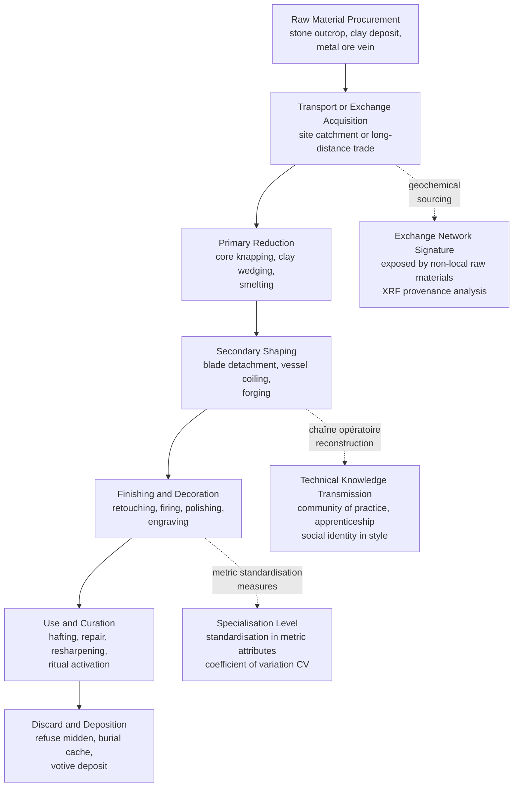

# Material Culture and Technology

> [!abstract] TL;DR
> Material culture — the objects people make and use — is not just functional hardware but encoded social text: the chaîne opératoire reveals technical knowledge, apprenticeship networks, and identity in every flake scar; exchange networks mapped through obsidian trace-element analysis expose social ties across hundreds of kilometres; prestige goods circulate as political currency between elites; and artifact seriation lets archaeologists reconstruct time without a single absolute date. Together these frameworks transform mute objects into a record of human social organisation reaching back millions of years.

---

## Intuition

**Analogy:** A grandmother's recipe is technology. But it is also a social document. The way she folds the dough — a specific wrist movement learned by watching her mother — encodes a lineage of embodied knowledge. The spice she imports from a particular market signals her community's long-distance trading connections. The decorated serving platter she uses only at festivals communicates status. When archaeologists excavate a site, they are reading thousands of such recipes simultaneously, trying to reconstruct not just what was made but who made it, who taught them, who they traded with, and what objects meant in a world that left no written testimony.

This is the animating question of material culture studies: things are never merely things. They are frozen actions, crystallised social relations, and materialised meanings. The goal is to reverse that crystallisation — to read the object backwards into the society that produced it.

---

## How It Works

### Core Mechanics

The analysis of material culture proceeds through three complementary lenses:

1. **Production analysis** — how was the object made? Reconstructing the sequence of technical gestures (chaîne opératoire) reveals the skill level of producers, the social organisation of craft production, and the cultural templates that constrained choices at each step.

2. **Distribution and exchange analysis** — where did the raw materials and finished objects come from and go? Geochemical sourcing, stylistic analysis, and spatial distribution mapping expose the social networks through which objects moved, the social relations those movements sustained or created, and the political economy behind differential access.

3. **Use and discard analysis** — how was the object used, by whom, and how was it ultimately deposited? Microwear traces, residue analysis, and depositional context reveal functional use, identity and status of users, and the ritual or practical significance of final deposition.

### Chaîne Opératoire: The Operational Chain

The concept of the *chaîne opératoire* (operational chain) — developed by Marcel Mauss in his 1934 essay "Les techniques du corps" and systematized by André Leroi-Gourhan in *Le Geste et la Parole* (1964) — describes the full ordered sequence of technical operations, from procurement of raw material to the object's discard. Every step in this sequence is simultaneously a technical act and a social act: choices at each stage are constrained not just by physics but by cultural tradition, apprenticeship learning, and social identity.

For a flint handaxe, the chaîne opératoire runs from selecting a specific nodule (selecting criteria encode geological knowledge and aesthetic standards), through core preparation, flake removals in prescribed sequences, finishing retouch, hafting, use, resharpening, and final discard. Refitting scattered flakes at an excavation site literally reassembles this sequence across space, exposing the choreography of gestures performed tens of thousands of years ago.

### Flow: From Raw Material to Archaeological Record



---

## Key Concepts

### Secondary Level

**What is material culture?** At its simplest, material culture is the set of physical objects produced, used, and discarded by a human group. What makes material culture analytically powerful is that objects are not passive reflections of social life — they actively constitute it. The same object can carry different meanings depending on who owns it, how it is displayed, and what transaction brought it to its current location. Archaeologists cannot interview their subjects, so material culture is their primary text.

**Typology and the logic of classification.** Before archaeologists can interpret objects, they must organise them. Typology — the classification of artefacts into types based on shared attributes (form, material, decoration, technology) — is the foundational analytical procedure of archaeology. Types matter because the relative frequencies of types across different deposits can reveal time.

**Seriation and relative dating.** James A. Ford's *ceramic seriation* (1950s, American Southeast) formalised the insight that artifact styles rise, peak, and decline in popularity over time, producing a characteristic "battleship curve" shape — like the silhouette of a WWI battleship — when assemblages are correctly arranged in chronological order. The practical power of seriation is that it allows archaeologists to establish a relative temporal sequence across sites without any absolute dates, using only the internal logic of stylistic frequency change. If assemblages are correctly ordered, every type's relative frequency should trace a smooth unimodal curve: rising, peaking, and then declining.

**Artefact attributes and the information they carry:**

| Attribute Class | Examples | Information Type |
|----------------|----------|-----------------|
| Raw material | Flint type, clay fabric, alloy composition | Procurement, exchange, trade |
| Technology | Flaking pattern, wheel vs. hand building, casting | Chaîne opératoire, specialisation |
| Morphology | Size, shape, proportions | Function, typological period |
| Style | Decoration, surface treatment | Identity, ethnicity, status |
| Use-wear | Edge damage, residues, polish | Function, users |
| Deposition context | Midden, burial, hoard, floor | Meaning, discard behaviour |

---

### Undergraduate Level

**Technology as Social Practice: Pfaffenberger's Framework**

Bryan Pfaffenberger (1992) challenged the dominant view of technology as a neutral, instrumental domain — a set of tools that simply "do things." He proposed instead a *social constructivist* approach: technology systems are composed not just of physical tools but of the social organisation, knowledge systems, ideological frames, and political relationships that give tools their meaning and direct their use. The same object — a plough, a loom, a smartphone — operates within radically different "technological dramas" depending on who controls it, who is compelled to use it, and what symbolic weight it carries.

For archaeologists, this means asking not just "what did this tool do?" but "who had access to it, who was excluded, what social relations did its production and use reproduce, and how did control of technology translate into social power?" The politics of technology — who controls metallurgical knowledge, who has access to obsidian, whose chaîne opératoire is spatially separate from domestic contexts — is social history.

**Exchange Networks and Obsidian Sourcing**

Obsidian — volcanic glass with properties ideal for producing razor-sharp stone tools — was one of prehistory's most extensively traded materials. Crucially, obsidian sources are geologically distinct: each volcanic source has a unique trace-element signature (strontium, barium, zirconium, titanium ratios) measurable by X-ray fluorescence (XRF) spectroscopy or neutron activation analysis. By matching the geochemistry of excavated obsidian to known source signatures, archaeologists can trace individual artefacts back to specific volcanoes hundreds of kilometres away.

The distribution patterns of sourced obsidian are proxies for the social networks that carried them. Three models of distribution are archaeologically distinguishable:

| Exchange Model | Signature Pattern | Social Implications |
|---------------|------------------|---------------------|
| **Down-the-line exchange** | Exponential decline in quantity with distance from source | Embedded in existing social ties; no specialist traders; information and obligations travel with goods |
| **Direct access** | Absence of distance-decay; distant groups obtain as much as nearby groups | Specialised procurement expeditions; controlled by particular groups |
| **Prestige-goods distribution** | Elite sites far from source have *more* than ordinary nearby sites | Politically mediated redistribution; objects detached from subsistence logic |

In Mesoamerica, obsidian networks centred on the Pachuca and Ucareo-Zinapécuaro sources were operating by the Early Formative period (before 1000 BCE) and became major arteries of interaction connecting the central Mexican highlands to the Gulf Coast and beyond. At Teotihuacan (c. 100–600 CE), control of Pachuca obsidian supply was a key pillar of political power — the city acted as a processing and redistribution centre, converting raw nodules into blades that circulated across Mesoamerica.

**Craft Specialisation: Costin's Framework**

Cathy Costin (1991, "Craft Specialization: Issues in Defining, Documenting, and Explaining the Organization of Production") provided the field's most influential classification of craft production organisation, built around four dimensions:

- **Context** — who controls production: independent (producers work for open exchange) vs. attached (producers work under elite or institutional patronage)
- **Concentration** — where production occurs: dispersed (household, domestic context) vs. nucleated (specialised workshops)
- **Scale** — size of producing unit: household to large workshop
- **Intensity** — how much of the producer's time is devoted: part-time to full-time

These dimensions combine to produce distinct organisational types:

| Type | Context | Concentration | Scale | Archaeological Signature |
|------|---------|---------------|-------|--------------------------|
| **Household specialisation** | Independent | Dispersed | Small | Craft debris in domestic contexts; low standardisation |
| **Individual specialisation** | Independent | Dispersed | Small | Itinerant specialists; difficult to detect archaeologically |
| **Workshop specialisation** | Independent | Nucleated | Large | Discrete workshop areas; greater standardisation; raw material storage |
| **Attached specialisation** | Attached | Variable | Variable | Adjacent to elite contexts; high standardisation; controlled raw material access; luxury goods |

**Standardisation as an Archaeological Indicator.** If production is organised by attached specialists working under institutional supervision to fill quotas or meet specifications, the resulting objects should be more uniform in size, shape, and decoration than objects produced by independent household specialists responding to individual tastes. Costin and Hagstrum (1995) proposed using the *coefficient of variation* (CV = standard deviation / mean × 100) of metric attributes as a quantitative measure of standardisation: lower CV signals more standardised (and likely more specialised) production.

---

### Graduate Level

**Prestige Goods and Peer-Polity Interaction (Renfrew)**

Colin Renfrew's concept of *peer-polity interaction* (1986) describes the dense web of competitive and emulative exchanges — diplomatic gifts, marriage alliances, shared ceremonial practices, prestige goods circulation — that linked contemporary chiefdoms or early states of roughly equal political scale. In the European Bronze Age (c. 2300–800 BCE), Renfrew documented networks of bronze weapons, gold ornaments, amber beads, and faience objects spanning from Ireland to the Aegean. These objects moved not primarily as commodities (their use value was not the point) but as instruments of political authority: to give a prestige good was to create a debt, affirm an alliance, and display the capacity to command exotic resources.

The political logic of prestige goods depends on their non-substitutability: they must be unavailable through any other channel, impossible to produce locally, and clearly exotic. This is why obsidian, Mediterranean copper, and Alpine salt appear so disproportionately in elite burial contexts — they were the hard currency of Bronze Age politics.

**The Social Life of Things: Appadurai and Commodity Exchange**

Arjun Appadurai's edited volume *The Social Life of Things* (1986) introduced the argument — developed most forcefully in his introduction and in Igor Kopytoff's essay "The Cultural Biography of Things" — that objects are not simply commodities or gifts but move between these statuses across their lifecycles. An object begins as a commodity (produced for exchange), may be singularised (withdrawn from circulation and given unique personal meaning), can be re-commodified (sold again), or can be sacralized (dedicated to ritual use and placed outside exchange entirely).

This has profound archaeological implications: the same class of object found in different depositional contexts (midden vs. burial vs. cache) may represent entirely different statuses in this commodity-singularization cycle. A bronze sword in a warrior's grave is not the same "thing" as an identical sword in a scrap metal hoard — they have undergone different biographical trajectories that reflect the social meanings their owners invested in them.

**Gift vs. Commodity Exchange (Mauss → Sahlins → Appadurai).** Marcel Mauss's *Essai sur le don* (1925, "The Gift") established that gift exchange — unlike commodity exchange — is never purely economic. To give a gift is to give something of oneself; to receive is to incur an obligation; to reciprocate is to affirm the social bond. Prestige-goods exchange in non-state societies operates on gift logic: the transaction is as much about social relations as about material transfer. Marshall Sahlins (1972) further systematised this into a spectrum from "generalised reciprocity" (sharing among close kin, no expectation of direct return) through "balanced reciprocity" (equivalent exchange with partners) to "negative reciprocity" (maximising one's advantage: trade, barter, theft). The type of exchange is diagnostic of the social relationship.

**Consumption and Identity: Miller's Post-Processual Approach**

Daniel Miller's *Material Culture and Mass Consumption* (1987) and subsequent work shifted the analytical focus from production and exchange to consumption: how do people use, display, modify, and interpret objects to constitute social identities? Drawing on Hegel's concept of objectification, Miller argued that material culture is not a passive reflection of pre-existing social identities but a medium through which identities are actively constructed and communicated. To choose a particular ceramic style, to decorate a vessel in a specific way, or to display certain prestige goods in a house is to perform identity — gender, status, ethnic affiliation, religious commitment.

For archaeologists, this means that stylistic choices in material culture are not trivial: they are the archaeological signature of identity politics. Changes in ceramic style can map migration, ethnic boundary maintenance, or assimilation. The distribution of prestige goods within a settlement can map internal social stratification. The spatial clustering of particular tool types can map gendered activity areas. Post-processual archaeology (Hodder, Shanks, Tilley) built extensively on Miller's framework to argue that material culture is *polysemic* — carrying multiple simultaneous meanings — and that archaeologists must interpret it contextually rather than seeking universal functional explanations.

---

## Python Demo

```python
# Artifact Seriation — Battleship Curve Simulation
#
# Simulates Ford's ceramic seriation: each artifact type rises, peaks, and declines
# in popularity over time (a "battleship curve"). Assemblages from different time
# periods are SHUFFLED to simulate the archaeologist's problem of unknown order.
# A center-of-mass seriation algorithm then recovers the correct temporal sequence.
# Visualised as heatmaps (before and after sorting) and a classic spindle diagram.
# Only numpy and matplotlib are used.

import numpy as np
import matplotlib.pyplot as plt
import matplotlib.cm as cm

rng = np.random.default_rng(42)

# ─── Parameters ──────────────────────────────────────────────────────────────
N_PERIODS   = 20    # true chronological periods
N_TYPES     = 8     # ceramic or lithic type categories (each peaks at a different time)
N_ARTIFACTS = 60    # total artifacts sampled per assemblage
SIGMA       = 4.0   # spread of each type's popularity bell curve

# ─── Build true battleship-curve frequency matrix ────────────────────────────
# Peak time for each type: spread evenly across the timeline
peaks = np.linspace(2.0, N_PERIODS - 3.0, N_TYPES)

true_freq = np.zeros((N_PERIODS, N_TYPES))
for j, pk in enumerate(peaks):
    for t in range(N_PERIODS):
        true_freq[t, j] = np.exp(-0.5 * ((t - pk) / SIGMA) ** 2)

# Normalise so each period's type frequencies sum to 1
true_freq /= true_freq.sum(axis=1, keepdims=True)

# ─── Simulate observed assemblage counts via multinomial sampling ─────────────
# Each period's assemblage is a random draw from the underlying true frequencies
counts = np.array([
    rng.multinomial(N_ARTIFACTS, true_freq[t])
    for t in range(N_PERIODS)
], dtype=float)
observed_freq = counts / counts.sum(axis=1, keepdims=True)

# ─── Shuffle to simulate unknown temporal order ───────────────────────────────
shuffle_idx  = rng.permutation(N_PERIODS)
shuffled_mat = observed_freq[shuffle_idx]   # what the archaeologist initially sees

# ─── Seriation via weighted centre-of-mass ───────────────────────────────────
# Assign each type an index 0..N_TYPES-1 (in order of true peak time).
# An assemblage dominated by early-peaking types gets a LOW centre of mass
# → it is chronologically earlier.  Sorting by ascending CoM recovers time order.
col_idx       = np.arange(N_TYPES, dtype=float)
row_com       = shuffled_mat @ col_idx          # CoM for each shuffled assemblage
recovered_idx = np.argsort(row_com)             # ascending = oldest first
recovered_mat = shuffled_mat[recovered_idx]

# True period index for each row in the recovered matrix (for quality evaluation)
true_periods = shuffle_idx[recovered_idx]

# Spearman rank correlation: recovered order vs. true chronological order
def spearman_rho(a, b):
    n = len(a)
    ra = np.argsort(np.argsort(a)).astype(float)
    rb = np.argsort(np.argsort(b)).astype(float)
    return 1.0 - 6.0 * float(np.sum((ra - rb) ** 2)) / (n * (n ** 2 - 1))

rho = spearman_rho(np.arange(N_PERIODS), true_periods.astype(float))

# ─── Panel figure: three heatmaps ────────────────────────────────────────────
fig, axes = plt.subplots(1, 3, figsize=(15, 6))
fig.suptitle(
    f"Artifact Seriation — Battleship Curves  "
    f"(N={N_PERIODS} assemblages, {N_TYPES} types, Spearman ρ = {rho:.3f})",
    fontsize=13, fontweight="bold"
)

def draw_heatmap(ax, mat, row_labels, title):
    ax.imshow(mat, aspect="auto", cmap="YlOrRd", vmin=0, vmax=0.35)
    ax.set_xticks(range(N_TYPES))
    ax.set_xticklabels([f"T{j+1}" for j in range(N_TYPES)], fontsize=8)
    ax.set_yticks(range(N_PERIODS))
    ax.set_yticklabels(row_labels, fontsize=7)
    ax.set_xlabel("Artifact Type", fontsize=9)
    ax.set_title(title, fontsize=10, fontweight="bold")

draw_heatmap(
    axes[0], observed_freq,
    [f"Period {i:02d}" for i in range(N_PERIODS)],
    "Ground Truth\n(true chronological order)"
)
draw_heatmap(
    axes[1], shuffled_mat,
    [f"Assemblage {i:02d}" for i in range(N_PERIODS)],
    "Scrambled Input\n(order unknown to archaeologist)"
)
draw_heatmap(
    axes[2], recovered_mat,
    [f"True P{p:02d}" for p in true_periods],
    f"After Seriation\n(Spearman ρ = {rho:.3f})"
)

plt.tight_layout()
plt.show()

# ─── Battleship spindle diagram ───────────────────────────────────────────────
COLORS = cm.tab10(np.linspace(0, 1, N_TYPES))
scale  = 3.5

fig2, ax = plt.subplots(figsize=(11, 7))
y_positions = np.arange(N_PERIODS, dtype=float)

for j in range(N_TYPES):
    x_center = j * 1.5
    for i, y in enumerate(y_positions):
        half_w = recovered_mat[i, j] * scale
        ax.fill_betweenx(
            [y - 0.38, y + 0.38],
            x_center - half_w, x_center + half_w,
            color=COLORS[j], alpha=0.78
        )

ax.set_yticks(y_positions)
ax.set_yticklabels([f"True P{p:02d}" for p in true_periods], fontsize=8)
ax.set_xticks([j * 1.5 for j in range(N_TYPES)])
ax.set_xticklabels([f"Type {j+1}" for j in range(N_TYPES)], fontsize=9)
ax.set_ylabel("Assemblages (seriated order, oldest top)", fontsize=10)
ax.set_title(
    "Battleship Spindle Diagram\n"
    "(bar width = relative type frequency; each type forms a lens shape = correct ordering)",
    fontsize=10, fontweight="bold"
)
ax.invert_yaxis()
ax.grid(axis="y", alpha=0.2)
plt.tight_layout()
plt.show()

# ─── Summary ──────────────────────────────────────────────────────────────────
print(f"\nSeriation quality: Spearman rho = {rho:.4f}  (1.0 = perfect recovery)")
print(f"\nType peak times (true): {peaks.round(1)}")
print(f"\nRecovered order vs. true: {true_periods.tolist()}")
```

**Reading the output.** Panel 1 (Ground Truth) shows the battleship curves clearly — each type's column has a strong diagonal band of high frequency that rises and fades. Panel 2 (Scrambled Input) is visually incoherent — the rows are in random order. Panel 3 (After Seriation) should closely resemble Panel 1 if the algorithm has recovered the correct order — confirmed by a Spearman rho near 1.0. The spindle diagram makes the battleship shape visually explicit: each type column should form a symmetric lens (wide in the middle, narrow at both ends) when the assemblages are correctly ordered. In practice, real assemblages have more noise, multiple overlapping types, and spatial variation — but the logic is identical to what Ford applied to Mississippi Valley ceramics in the 1950s.

---

## Real-World Applications

> **Pachuca Obsidian and the Teotihuacan Political Economy.** Geochemical sourcing of obsidian from hundreds of sites across Mesoamerica has established that green Pachuca obsidian — from a source 80 km northeast of Teotihuacan in the state of Hidalgo, Mexico — was distributed across an area of over 2,000 km during the Classic period (c. 150–650 CE). At its peak, Teotihuacan controlled the processing and redistribution of Pachuca blades across Mesoamerica. Sites as distant as Tikal in the Maya lowlands and Oaxacan Monte Albán showed spikes in Pachuca obsidian at precisely the periods of closest political interaction with Teotihuacan. When Teotihuacan collapsed around 600 CE, Pachuca obsidian distribution contracted sharply, and regional obsidian sources filled the gap — a material-culture signature of political network collapse legible entirely from geochemistry and frequency data.

> **Châtelperronian vs. Aurignacian Chaîne Opératoire.** One of Palaeolithic archaeology's most contested debates concerns whether Neanderthals independently developed blade technology or imitated Anatomically Modern Humans (AMH). The chaîne opératoire approach has been central to this debate. Analysis of Châtelperronian assemblages (associated with late Neanderthals, c. 45,000–40,000 BP in France and northern Spain) versus contemporaneous Aurignacian assemblages (AMH) shows distinct operational chains: Neanderthals producing Châtelperronian backed knives used a different core preparation and flaking strategy from Aurignacian blade production, suggesting independent technological invention rather than simple copying. This demonstrates the chaîne opératoire's power to distinguish cultural transmission pathways in assemblages separated by tens of thousands of years.

> **Costin's Attached Specialisation at Huanuco Pampa (Inca, Peru).** Terry D'Altroy and Timothy Earle's work on Inca *mitmaykuna* (relocated artisan populations) and *aqllakuna* (women weavers attached to state facilities) at the Inca administrative centre of Huanuco Pampa provided a test case for Costin's attached specialisation model. Metric analysis of ceramic vessels produced at state workshops showed strikingly lower coefficients of variation (higher standardisation) than household ceramic production at the same site — confirming that attached specialist production under institutional oversight produced measurably more uniform output. The spatial separation of workshop deposits from domestic contexts, and the presence of large storage facilities for raw materials, provided the independent archaeological signatures of state-attached production predicted by Costin's framework.

> **Ford's Ceramic Seriation in the American Southeast.** James A. Ford's application of the battleship-curve principle to Mississippian ceramic sequences in the American Southeast (1950s) established relative chronologies for dozens of sites that had no stratigraphic relationship to each other. By tabulating the frequencies of ceramic types across surface collections from different sites and rearranging the assemblages until each type's frequency formed a unimodal curve, Ford produced a regional chronology that was subsequently validated against radiocarbon dates when they became available in the 1950s–60s. The seriation sequence and the independent radiometric chronology aligned closely — an early demonstration that relative dating methods, when correctly applied, recovered real temporal sequences.

---

## Common Pitfalls

- **Conflating style and function** — attribute choices encode both functional constraints (a certain edge angle is required for effective cutting) and stylistic signals (a particular decorative motif communicates ethnic identity). Treating all variability as functional misses the social information; treating all variability as stylistic ignores genuine adaptive constraints. Disentangling the two requires explicit models and comparative data.

- **Assuming the chaîne opératoire is complete at a single site** — production sequences are frequently spatially dispersed: primary reduction may happen at the quarry, secondary shaping at a base camp, finishing at a residential site, and use-wear accumulation at activity areas kilometres apart. Reconstructing the full operational chain requires regional, not just site-level, analysis. Missing stages systematically distort inferences about skill and specialisation.

- **Using standardisation as a proxy for specialisation without controls** — low coefficient of variation (high standardisation) can result from specialised production, but it can also result from highly constrained functional requirements, from copying a single highly visible prototype, or from a small sample size. Costin's framework requires that standardisation be evaluated alongside contextual evidence (workshop spatial segregation, raw material storage, proximity to elite contexts) before specialisation is inferred.

- **Confusing exchange with interaction** — the presence of non-local materials at a site demonstrates that objects moved; it does not directly reveal how they moved or what social relationships mediated their movement. XRF provenance analysis identifies the source, not the mechanism. Distinguishing down-the-line exchange from direct access requires modelling the full distribution pattern, not just identifying individual long-distance objects.

- **Cross-dating by typology without testing** — seriation and typological cross-dating produce relative chronologies that must be tested against independent dating evidence (stratigraphy, radiometric dates). Circular reasoning — using pottery types to date a site, then using the site's date to confirm the type chronology — was a methodological problem in mid-twentieth-century archaeology that was only resolved when radiocarbon dating provided independent temporal anchors.

- **Treating the chaîne opératoire as universal** — operational chains are culturally specific. The assumption that a particular sequence of reduction steps is the "obvious" or "most efficient" way to produce a given form privileges modern western engineering logic. Many prehistoric operational choices reflect aesthetic standards, ritual requirements, or identity conventions that make perfect sense within their cultural context but look "irrational" from a purely functional standpoint.

- **The deposition context fallacy** — where an object is found is not necessarily where it was primarily used or who primarily used it. Elite grave goods may include objects produced by and for non-elites that were appropriated at death; domestic rubbish contains objects that circulated through multiple households before discard. The depositional context is one moment in the object's biography, not a reliable indicator of its entire social life.

---

## Related Concepts

- [[Social_Networks_and_Social_Ties]] — Exchange networks revealed by obsidian sourcing are exactly the kind of weak-tie bridging networks Granovetter theorized: non-local obsidian carried by infrequent long-distance contacts brought novel information and goods across otherwise disconnected social clusters; network topology analysis of material distribution patterns is the archaeological analogue of social network analysis.

- [[Social_Capital_and_Trust]] — Prestige goods exchange operates on Maussian gift logic: giving a rare bronze axe or turquoise ornament creates obligation, affirms alliance, and accumulates social capital in Bourdieu's sense. The non-local raw materials of prestige goods embody Putnam's bridging capital made physical — objects that cross social boundaries and materialise inter-polity relationships.

- [[Culture_Norms_Values_and_Ideology]] — Pfaffenberger's social constructivist approach to technology and Miller's consumption theory both argue that objects are cultural texts: stylistic choices in ceramics, lithics, and dress communicate norms, values, and ideological positions. The distribution of particular material culture styles maps the spatial extent of cultural communities in the archaeological record.

- [[Family_Marriage_and_Kinship]] — Household specialisation — the most common form of ancient craft production — is organised through kinship relations: skills are transmitted within families, production is embedded in domestic spatial organisation, and exchange is mediated through affinal networks. In many prehistoric societies, marriage was the primary mechanism for establishing the inter-community alliances through which prestige goods and specialised craft products circulated.

- [[Repeated_Games_and_Folk_Theorems]] — Long-distance exchange networks require sustained trust across social boundaries. The folk theorem provides the game-theoretic basis: repeated interaction with partners whose identities are known (down-the-line exchange networks) enables cooperation without formal institutions. The collapse of long-distance trade networks in the Bronze Age Collapse (c. 1200 BCE) is archaeologically visible precisely because repeated-game conditions (stable political entities, known partners) were destroyed by systemic disruption.

- [[Ceramics_and_Glasses]] — Pottery is the archaeologist's primary chronological tool and the most common artefact class in most post-Neolithic sites. The materials science of ceramics — firing temperatures, clay mineralogy, temper composition — provides the technical basis for sourcing, identifying production techniques, and reconstructing chaîne opératoire sequences; petrographic thin-section analysis of ceramic fabrics is the pottery analogue of obsidian XRF sourcing.

---

## Review Questions

### Secondary

1. An archaeologist excavates a Neolithic site and finds stone tools made from obsidian — a volcanic glass — whose nearest source is 400 km away. What does the presence of this obsidian tell us about the people who lived at this site? What further information would you need to determine *how* the obsidian arrived (direct procurement expedition vs. down-the-line exchange vs. prestige goods distribution)?

2. Ford's ceramic seriation says that pottery styles rise in popularity, peak, and then decline — forming a "battleship curve." Why would you expect pottery styles to follow this pattern rather than appearing suddenly or persisting unchanged forever? What social processes would cause a style to rise and then fall in popularity?

### Undergraduate

3. Cathy Costin distinguishes between "household specialisation" and "attached specialisation" as two very different ways of organising craft production. Using the archaeological signatures she identifies (standardisation levels, spatial context of production debris, raw material storage), how would you distinguish the two in an excavated assemblage? What additional contextual evidence would make you more confident in your classification?

4. Pfaffenberger argues that technology is a social practice, not just a set of tools. Take a specific ancient technology — obsidian blade production, pottery firing, or bronze casting — and explain how this technology was embedded in a specific social organisation. Who controlled access to raw materials? Who possessed the knowledge? What social relations did the production and distribution of the artefacts create or reproduce?

### Graduate

5. Appadurai's "social life of things" framework argues that commodities and gifts are not different classes of objects but different phases in an object's biography — a single object can move between commodity, gift, and sacred statuses across its life. How does this framework challenge the traditional archaeological practice of inferring social organisation directly from depositional context (e.g., "luxury goods in burials = elite society")? Design an analysis of a Bronze Age burial assemblage that explicitly accounts for the possibility that objects moved between exchange statuses before deposition.

6. Seriation produces relative chronologies from stylistic frequency data. The method assumes that type frequencies are unimodal (battleship-curve shaped) and that stylistic change is directional rather than oscillating. Under what conditions might these assumptions fail? Consider cases of: (a) style revival or retro-fashion; (b) contemporaneous but socially segregated production traditions; (c) assemblages formed over very long time periods. What would each failure mode look like in the archaeological data, and how could it be detected and corrected?

7. The chaîne opératoire framework treats every technical gesture as simultaneously a social act, encoding apprenticeship history, cultural tradition, and identity. Critics argue that this risks over-interpreting the archaeological record — that some technical choices are simply the most mechanically efficient solutions and carry no social information. Construct the strongest version of this critique and then evaluate it against the empirical evidence. Under what conditions can we be confident that observed variation in operational chains reflects social/cultural differences rather than functional optimisation?

---

## Sources

- [Leroi-Gourhan, A. (1964). *Le Geste et la Parole*. Albin Michel, Paris](https://www.academia.edu/28964932/Leroi_Gourhan_a_Philosopher_of_Technique_and_Evolution)
- [Mauss, M. (1934). "Les Techniques du corps." *Journal de Psychologie*, 32(3–4)](https://doi.org/10.3406/jpsyc.1935.3666)
- [Pfaffenberger, B. (1992). "Social Anthropology of Technology." *Annual Review of Anthropology*, 21](https://doi.org/10.1146/annurev.an.21.100192.001513)
- [Costin, C. L. (1991). "Craft Specialization: Issues in Defining, Documenting, and Explaining the Organization of Production." *Archaeological Method and Theory*, 3, 1–56](https://www.researchgate.net/publication/285851810_Craft_specialization_as_an_archaeological_category)
- [Costin, C. L. & Hagstrum, M. B. (1995). "Standardization, Labor Investment, Skill, and the Organization of Ceramic Production in Late Prehispanic Highland Peru." *American Antiquity*, 60(4)](https://os.pennds.org/archaeobib_filestore/pdf_articles/ANTH501/1995_CostinHagstrum.pdf)
- [Appadurai, A. (ed.) (1986). *The Social Life of Things: Commodities in Cultural Perspective*. Cambridge University Press](https://doi.org/10.1017/CBO9780511819582)
- [Renfrew, C. (1986). "Introduction: Peer polity interaction and socio-political change." In Renfrew & Cherry (eds.), *Peer Polity Interaction and Socio-Political Change*. Cambridge University Press](https://doi.org/10.1017/CBO9780511552496)
- [Miller, D. (1987). *Material Culture and Mass Consumption*. Blackwell, Oxford](https://www.wiley.com/en-us/Material+Culture+and+Mass+Consumption-p-9780631146773)
- [Mauss, M. (1925 [1990]). *The Gift: The Form and Reason for Exchange in Archaic Societies*. Translated by W. D. Halls. Routledge](https://www.routledge.com/The-Gift-The-Form-and-Reason-for-Exchange-in-Archaic-Societies/Mauss/p/book/9780415267496)
- [Ford, J. A. (1954). "The Type Concept Revisited." *American Anthropologist*, 56(1)](https://doi.org/10.1525/aa.1954.56.1.02a00030)
- [Chaîne opératoire: 70 years in French prehistory — *Journal of Lithic Studies*](https://journals.ed.ac.uk/lithicstudies/article/view/2539)
- [Marble Bead Chaîne Opératoire, Copper Age Tuscany — *Open Archaeology* (2022)](https://www.degruyterbrill.com/document/doi/10.1515/opar-2022-0334/html?lang=en)

---

#Anthropology #Archaeology #MaterialCulture #Technology #ChaineOperatoire #ExchangeNetworks #CraftSpecialization #Seriation
