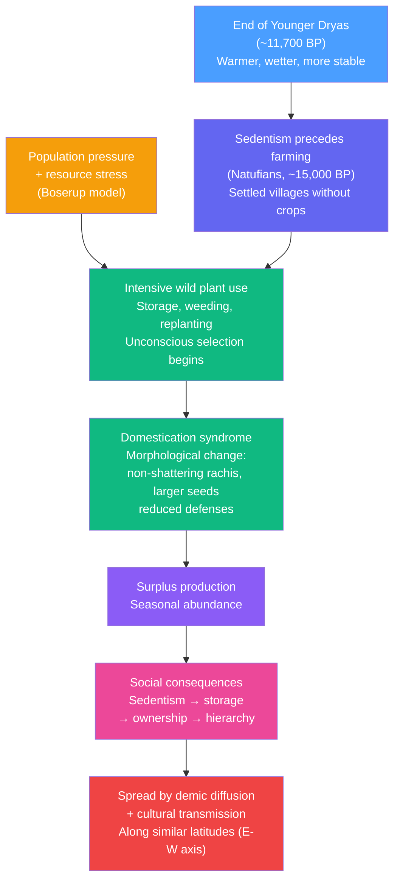

# The Neolithic Revolution and Origins of Agriculture

> [!abstract] TL;DR
> The Neolithic Revolution (~11,000 BP onward) was the independent invention of food production across at least six world regions — the most consequential behavioral shift in human history. Counterintuitively, early farmers were *shorter, sicker, and worked harder* than the foragers they replaced. The long-run "winners" were not individual farmers but farming populations: higher carrying capacity K meant that even a depressed per-capita growth rate produced population densities foragers could never match. Understanding why people adopted agriculture despite immediate health costs — and what it did to social organization, inequality, and disease — is the central puzzle of Neolithic studies.

---

## Intuition

**Analogy:** Imagine two restaurants. The first is an intimate, high-quality bistro that seats 20 people and serves excellent food; everyone who gets a seat eats well. The second is a large canteen that seats 2,000 people but serves mediocre, monotonous food, with frequent outbreaks of food poisoning from the kitchen. Over centuries, the canteen wins — not because life there is better for any individual, but because it can pack in forty times as many people, and numbers eventually overwhelm quality.

Agriculture is the canteen. Foraging is the bistro. The Neolithic Revolution was humanity's involuntary move from one to the other — and the consequences rippled through every dimension of human life, from the length of people's bones to the structure of their societies, the diseases they carried, and the wars they fought.

---

## How It Works



### The Core Sequence

Farming did not appear suddenly because someone had a clever idea. The archaeological record shows a long gradient:

1. **Post-Pleistocene warming (~12,000 BP):** The Younger Dryas cold snap ended abruptly (~11,700 BP), ushering in the warmer, more stable Holocene. In the Fertile Crescent, wild cereals expanded enormously in range and density, making intensive harvesting newly viable.

2. **Pre-agricultural sedentism:** The Natufian culture of the Levant (~15,000–11,500 BP) demonstrates that *sedentism preceded farming*. Natufians built stone-walled villages, had cemeteries implying territorial attachment, and stored wild grains in plastered pits — without yet managing plant reproduction. Sedentism is not caused by farming; it is a precondition for it.

3. **Intensive foraging and unconscious selection:** Groups harvesting wild wheat for weeks at a time inadvertently selected for traits useful to humans. Wild wheat has a **shattering rachis** — the grain-bearing stem breaks at maturity to scatter seeds. A rare genetic mutant with a **non-shattering rachis** retains all its seeds on the stalk at harvest time; it would go extinct in the wild but was disproportionately collected, brought back to camp, and accidentally re-sown near villages. Over hundreds of generations, this unconscious selection produced morphologically distinct domesticated plants.

4. **Intensification under population pressure (Boserup model):** Ester Boserup (1965) inverted the traditional Malthusian argument. Rather than food supply driving population up, she argued that population pressure drives agricultural *intensification*. When foraging territories become crowded, groups invest in farming not because it is preferable but because it is necessary. The health costs of agriculture are the literal price of feeding more people.

5. **Surplus, storage, and social complexity:** Storable grain created a new social good that did not exist in mobile foraging bands: *accumulated wealth*. Ownership of stored food is defensible, heritable, and exchangeable — the preconditions for inequality, specialization, and eventually statehood.

---

## Key Concepts

### Secondary Level

**What makes a plant or animal "domesticated"?**

Domestication is not a single event but a syndrome — a cluster of heritable morphological and behavioral changes that accumulate under human management:

| Trait | Wild form | Domesticated form | Why it matters |
|-------|-----------|-------------------|----------------|
| Rachis (cereals) | Shattering — seeds self-disperse | Non-shattering — seeds held on stalk | Allows mechanical harvest |
| Seed size | Small, many | Larger, fewer | More calories per grain |
| Seed coat dormancy | Hard coat, delayed germination | Thinner coat, synchronized germination | Predictable planting schedule |
| Animal flight distance | High — flee from humans | Low — tolerates human proximity | Herding possible |
| Animal reproductive cycle | Seasonal, slow | Year-round, accelerated | Higher off-take rate |
| Plant defense chemicals | High (toxins, thorns) | Reduced | Edibility and palatability |

The key insight: most of these changes were initially *unconscious*. Deliberate selective breeding (the mental model most people have) came much later, if at all, in the Neolithic.

**Multiple independent origins of agriculture:**

Agriculture was not invented once and spread everywhere. It arose at least six times, independently:

| Region | Approximate date (BP) | Key crops | Key animals |
|--------|----------------------|-----------|-------------|
| Fertile Crescent (SW Asia) | ~11,000 | Emmer wheat, einkorn, barley, lentils, peas | Sheep, goat, pig, cattle |
| Yangtze / Yellow River (China) | ~9,000 | Rice (south), millet (north) | Pig, silkworm |
| Mesoamerica | ~9,000 | Maize (from teosinte), squash, beans | Turkey, dog |
| New Guinea | ~9,000 | Taro, banana, sugarcane | — |
| Sub-Saharan Africa (Sahel) | ~5,000 | Sorghum, pearl millet, cowpea | Donkey, guinea fowl |
| Eastern North America | ~4,000 | Sunflower, goosefoot, squash | — |

The fact that agriculture emerged independently under similar ecological conditions (Holocene warming, sedentary lifestyles, dense plant resources) strongly suggests it is *convergent behavior* driven by comparable demographic pressures, not a single cultural invention.

**The paradox of agriculture:**

Early farming populations experienced:
- Shorter average stature (reflecting chronic nutritional stress — evidence from skeletal remains)
- More dental caries (sugar-rich starchy diet vs. mixed forager diet)
- More bone pathology from repetitive stress (grinding grain, digging)
- Smaller brain volumes on average (marginal nutritional deficiency across populations)
- Far higher infectious disease loads (zoonoses from domesticated animals; high population density enabling transmission)

Yet farming populations expanded and replaced or absorbed foraging populations almost everywhere. The resolution: **population density, not individual fitness, is the relevant evolutionary variable once groups compete for territory**.

---

### Undergraduate Level

**Why agriculture? Four competing models:**

1. **Boserup (population pressure):** Population grows first, then agricultural intensification follows as the *response* to resource stress, not the cause of population growth. Predicts that intensification happens at the margins — on less productive land, under more pressure — which fits the archaeological record better than the "garden of Eden" model where farming spread from areas of abundance.

2. **Climate change (Younger Dryas trigger):** The abrupt return to cold, dry, variable conditions during the Younger Dryas (~12,900–11,700 BP) may have disrupted wild cereal harvests, forcing experimentation with management. The subsequent warming created the stable, predictable Holocene climate in which annual crops thrive. Climate provides the *enabling condition*; pressure provides the *motivation*.

3. **Sedentism-first (Hayden, Kuijt):** Settled life in resource-rich environments created social contexts — feasting, storage, territorial defense — that *rewarded* surplus production before farming was strictly necessary. On this view, agriculture arose partly from elite social competition and the desire to host elaborate feasts, not purely from subsistence need.

4. **Risk buffering:** Agriculture provides a hedge against the year-to-year variability of wild resources. A bad year for hunting might be a good year for stored grain. Under sufficiently high environmental variance, the certainty of a modest but predictable harvest may outweigh the average superiority of foraging.

No single model is sufficient. Most archaeologists today favor a *multi-causal* account in which all four factors operated simultaneously and interacted.

**The Natufian case — sedentism before farming:**

The Natufian culture of the Levant is the clearest evidence that sedentism is causally prior to, not caused by, agriculture. Key features:
- Semi-permanent stone architecture with plastered floors (sites at 'Ain Ghazal, Eynan/Ain Mallaha)
- Ground stone tools (mortars, pestles) for processing wild cereals
- Cemeteries — fixed burial grounds imply sustained territorial attachment
- Evidence of dog domestication (~15,000 BP — the first domesticated animal)
- No evidence of deliberate crop planting until late Natufian at earliest

The Natufians were sedentary because they lived in the Levantine corridor at the peak productivity of the Mediterranean woodland, not because they farmed. When the Younger Dryas dried out this woodland, late Natufians either dispersed or — in the Jordan Valley micro-refugia — intensified their management of wild cereals. The PPNA (Pre-Pottery Neolithic A) culture that followed took the final step to cultivation.

**Çatalhöyük (central Anatolia, ~9,500–8,000 BP):**

One of the largest and best-documented Neolithic towns anywhere, with up to 8,000 inhabitants at its peak. Its archaeology overturns many assumptions about early complex societies:
- **No streets, no doorways at ground level.** All access was through holes in the roof; ladders were the circulation system. This suggests a community that organized space around roof activity and resisted any single axis of circulation that could be controlled or taxed.
- **Egalitarian burial:** The dead were buried under house floors, with similar grave goods regardless of sex. No rich burials, no evidence of hereditary leadership. Social status appears to have been achieved, not ascribed.
- **Bucranium installations:** Cattle skulls and horn cores were plastered into the walls of houses, sometimes in elaborate arrangements. Suggests cattle held ritual as well as subsistence significance — consistent with later evidence of cattle as a prestige good and medium of social competition.
- **Ian Hodder's post-processual excavation (since 1993):** Hodder treated the site as requiring interpretive engagement with multiple voices (local communities, specialists, archive users), challenging the processual assumption that the archaeologist is a neutral scientific observer extracting objective data.

**Diamond's geographic determinism (Guns, Germs, and Steel, 1997):**

Jared Diamond argued that Eurasia's agricultural head start — which ultimately produced the guns, germs, and steel that enabled European conquest of other continents — was itself caused by geography:
- **East-West axis:** Eurasia's major continental axis runs east-west, so crops and animals could spread along similar latitudes (similar daylength, seasons, temperature regimes) without needing to re-adapt. The Americas' and Africa's north-south axes meant crops faced completely different climates as they moved, dramatically slowing diffusion.
- **Domesticable species:** Eurasia had a disproportionate share of the world's large-seeded annual grasses (the "big 8" founder crops) and domesticable large mammals (the "big 5": cow, horse, sheep, goat, pig). The Americas had maize (requiring millennia of selection from teosinte) and only the llama/alpaca and turkey.
- **Dense animal contact → epidemic disease:** Millennia of close contact with domesticated animals gave Eurasian populations both devastating epidemic diseases (smallpox, measles, plague) and partial genetic immunity. When these populations contacted isolated American populations, the result was demographic catastrophe.

**Critique of Diamond:** While the geographic argument captures real structural constraints, it understates human agency, technological creativity, and the specific political and institutional factors that concentrated power in some Eurasian states. It also struggles to explain *within-Eurasia* variation: why did industrialization begin in Northwest Europe rather than China, which had a more advanced agricultural base for millennia? Critics (notably James Blaut, Dipesh Chakrabarty) argue that geographic determinism inadvertently rehabilitates a racially-neutral-sounding version of European exceptionalism.

---

### Graduate Level

**Molecular archaeology of domestication:**

Ancient DNA and archaeobotanical genomics have transformed our understanding of where and how often domestication occurred:

- **Single vs. multiple origins per crop:** Wheat and barley appear to have been domesticated once (in the northern Fertile Crescent) with subsequent spread by demic diffusion. Rice appears to have been domesticated at least twice independently — *japonica* in the Yangtze valley, *indica* possibly in South Asia — though debate continues. Maize was domesticated once from *Balsas teosinte* (*Zea mays* ssp. *parviglumis*) in lowland Mexico, ~9,000 BP, with subsequent improvement involving introgression from other teosinte populations.
- **Domestication syndrome genes:** Modern genomics has identified specific loci responsible for domestication traits. In maize, a regulatory change at the *tb1* locus (teosinte branched 1) suppresses lateral branching, converting the multi-branched teosinte into single-stalked maize. In wheat, the *Q* locus on chromosome 5A underlies the free-threshing trait; the non-shattering rachis involves mutations at *Br1* and *Br2* loci. These mutations appear to have accumulated over centuries to millennia, not in a single generation.
- **Demic diffusion vs. cultural diffusion:** Genetic analysis of Neolithic European skeletons shows that agriculture spread into Europe primarily by population movement (demic diffusion) from Anatolian farmers, not by indigenous European hunter-gatherers adopting farming independently. Ancient DNA of Anatolian Neolithic skeletons clusters with modern Sardinians — a genetic isolate that preserved early-farmer ancestry — while indigenous European hunter-gatherers (Western Hunter-Gatherers, WHGs) were largely replaced or absorbed, though with geographic variation.

**Zoonotic disease and the Neolithic epidemiological transition:**

The domestication of animals created the single largest vector for novel human pathogens in evolutionary history:

- **Smallpox** — from a cowpox-like ancestor in cattle
- **Measles** — from rinderpest-like morbillivirus in cattle
- **Influenza** — from pigs and waterfowl
- **Tuberculosis** — bovine TB (*Mycobacterium bovis*) crossed to humans in cattle-herding populations
- **Malaria** — facilitated by standing water in irrigated fields; selection pressure for sickle-cell trait visible in the archaeogenetics of early farming populations in West Africa

The Neolithic village — dense, sedentary, in contact with livestock, drinking water contaminated by animal feces — was an epidemiological revolution as much as an agricultural one. The immunological naivety of New World populations relative to Old World peoples at the moment of contact is the long-run demographic echo of this asymmetric pathogen history.

**Sedentism, storage, and the origins of inequality:**

The most important social consequence of the Neolithic was not the plow or the granary in themselves, but the creation of *storable, defensible, heritable surplus*. The transition from mobile bands (where accumulation is physically impossible and socially punished) to sedentary villages with grain stores created the material preconditions for hierarchy:

1. *Ownership* becomes possible when you cannot carry everything you possess away with you.
2. *Inheritance* becomes important when the next generation will live in the same place and use the same fields.
3. *Defense* of stored resources requires coordination, which selects for leadership roles.
4. *Specialization* becomes viable when not everyone must spend all their time securing food — leading to craft production, religious specialists, and eventually administrators.

The sequence runs: sedentism → surplus → storage → ownership → defense → coordination → leadership → specialization → hierarchy. Çatalhöyük's egalitarian burials suggest this sequence was not inevitable or immediate — large sedentary communities persisted for millennia without hereditary inequality. The crucial additional ingredient appears to have been *intergroup competition* and *intensified land use* that created pressure for more centralized coordination.

**Post-processual archaeology and the critique of grand narratives:**

The processual archaeology of the 1960s–80s (Binford, Clarke) treated the Neolithic as a *process* to be explained by universal cultural-ecological laws. The post-processual turn (Hodder, Shanks, Tilley), emerging in the 1980s, challenged this on three grounds:

1. **Material culture is not just adaptive.** The bucranium installations at Çatalhöyük, the deliberately non-functional house access patterns, and the elaborate mortuary practices are not explained by carrying capacity or caloric optimization. They are *meaningful* in ways that require interpretive rather than nomothetic explanation.
2. **The past is always mediated by the present.** The archaeologist's theoretical framework determines what counts as evidence and what questions get asked. Explicitly acknowledging this is more rigorous, not less.
3. **Multiple pasts are valid.** Indigenous communities, descendant populations, and local stakeholders have legitimate interpretive authority over the material remains of their ancestors that academic archaeologists do not simply override with "scientific" interpretations.

These debates have practical stakes: they determine how Neolithic sites are excavated, published, conserved, and repatriated.

---

## Python Demo

This simulation models the **demographic paradox of agriculture**: farming populations suffer individual health costs (lower per-capita growth rate) but achieve population dominance through higher carrying capacity. Uses logistic growth dynamics to show why a costlier subsistence strategy wins in the long run.

```python
import numpy as np
import matplotlib.pyplot as plt

# --- Parameters ---
dt = 1.0   # time step (years)
t_max = 600
t = np.arange(0, t_max, dt)

# Foraging regime:
#   modest r (density-dependent resource limitation, high individual quality)
#   low K (territory-limited; bands of ~25, territory ~500 km^2)
r_forage = 0.015
K_forage = 500
P0 = 50   # shared starting population

# Farming regime:
#   higher long-run r (more births per year once surplus is established)
#   but initial health penalty for first ~50 years post-adoption
#   much higher K (landscape can support 10-100x more people)
r_farm_penalty = 0.008   # growth rate during health-cost window (disease, malnutrition)
r_farm_normal  = 0.028   # growth rate after adaptation
K_farm = 10000
transition_year = 100    # population adopts farming at t=100


def logistic(r, K, P0, t):
    """Analytic solution to dP/dt = r*P*(1 - P/K)."""
    return K / (1.0 + ((K - P0) / P0) * np.exp(-r * t))


# --- Foraging trajectory (runs the whole time) ---
P_forage = logistic(r_forage, K_forage, P0, t)

# --- Farming trajectory (forages until t=transition_year, then switches) ---
P_farm = np.zeros(len(t))
P_farm[:transition_year] = logistic(r_forage, K_forage, P0, t[:transition_year])

for i in range(transition_year, len(t)):
    prev = P_farm[i - 1]
    years_since_transition = i - transition_year
    # Health-cost window: first 50 years of farming have depressed growth
    r_now = r_farm_penalty if years_since_transition < 50 else r_farm_normal
    dP = r_now * prev * (1.0 - prev / K_farm)
    P_farm[i] = prev + dP

# --- Per-capita growth rates ---
def per_capita_r(P, r, K):
    return r * (1.0 - P / K)

pc_forage = per_capita_r(P_forage, r_forage, K_forage)

pc_farm = np.where(
    t < transition_year,
    per_capita_r(P_farm, r_forage, K_forage),
    np.where(
        (t - transition_year) < 50,
        per_capita_r(P_farm, r_farm_penalty, K_farm),
        per_capita_r(P_farm, r_farm_normal, K_farm),
    )
)

# --- Plot ---
fig, axes = plt.subplots(1, 2, figsize=(14, 5))

ax = axes[0]
ax.plot(t, P_forage, color='forestgreen', lw=2.5, label=f'Foraging  (K={K_forage}, r={r_forage})')
ax.plot(t, P_farm,   color='saddlebrown', lw=2.5, label=f'Farming   (K={K_farm}, long-run r={r_farm_normal})')
ax.axvline(transition_year, color='dimgray', ls='--', alpha=0.8, label='Farming adopted (t=100)')
ax.axvspan(transition_year, transition_year + 50, alpha=0.12, color='red',
           label='Health-cost window (50 yr)')
ax.set_title('Neolithic Demographic Paradox\nLogistic Growth Comparison', fontsize=11)
ax.set_xlabel('Years')
ax.set_ylabel('Population')
ax.legend(fontsize=8)
ax.grid(alpha=0.25)

ax2 = axes[1]
ax2.plot(t, pc_forage, color='forestgreen', lw=2.5, label='Foraging per-capita growth')
ax2.plot(t, pc_farm,   color='saddlebrown', lw=2.5, label='Farming per-capita growth')
ax2.axvline(transition_year, color='dimgray', ls='--', alpha=0.8)
ax2.axvspan(transition_year, transition_year + 50, alpha=0.12, color='red')
ax2.axhline(0, color='black', lw=0.8)
ax2.set_title('Per-Capita Growth Rate Over Time', fontsize=11)
ax2.set_xlabel('Years')
ax2.set_ylabel('Per-capita growth rate (yr⁻¹)')
ax2.legend(fontsize=8)
ax2.grid(alpha=0.25)

plt.tight_layout()
plt.savefig('neolithic_demographic_transition.png', dpi=120, bbox_inches='tight')
plt.show()

# Summary statistics
crossover = np.argmax(P_farm > P_forage)
print(f"Foraging plateau (K):           {K_forage} people")
print(f"Farming plateau (K):            {K_farm} people")
print(f"Year farming population exceeds foraging: t={int(t[crossover])}")
print(f"Final foraging population (t={t_max}):    {P_forage[-1]:.0f}")
print(f"Final farming population  (t={t_max}):    {P_farm[-1]:.0f}")
print()
print("Key insight: farming per-capita health drops sharply at adoption,")
print("yet the 20x higher carrying capacity means farming ultimately supports")
print("far more people — explaining why it spread even though it was worse for individuals.")
```

**What to observe:** The foraging population plateaus quickly at 500 — territory is the binding constraint. The farming population dips in per-capita growth terms during the health-cost window, then accelerates through the foraging ceiling and climbs toward 10,000. The crossover typically occurs ~150–200 years after adoption, consistent with the archaeological evidence that Neolithic demographic expansion became visible roughly 5–10 generations after farming adoption in each region.

---

## Real-World Applications

**1. Çatalhöyük and egalitarian complexity**
Çatalhöyük (~9,500–8,000 BP, central Anatolia) housed up to 8,000 people in closely packed mud-brick houses accessed exclusively through roof openings. Bioarchaeological analysis of skeletons by Clark Spencer Larsen's team found no significant differences in nutrition, physical workload, or burial wealth between males and females, or between higher and lower spatial zones of the settlement — a remarkable finding for a community of this size. This challenges the assumption that scale necessarily implies hierarchy and that the Neolithic immediately produced stratification.

**2. The Fertile Crescent founder crops and the Green Revolution**
The eight "founder crops" of SW Asian agriculture — emmer wheat, einkorn wheat, barley, lentil, pea, chickpea, bitter vetch, and flax — remain the foundation of global caloric supply. The high-yield wheat and rice varieties of the 20th-century Green Revolution were modern domesticates built on this 11,000-year-old genetic substrate. Understanding the original domestication events — which genes were selected and which wild genetic diversity was lost — is directly relevant to building climate-resilient crop varieties through introgression from wild relatives.

**3. Zoonotic disease and the COVID-19 context**
The pattern established at the Neolithic — dense human populations living in proximity to domesticated animals, creating cross-species pathogen jumps — is exactly the mechanism behind influenza pandemics, SARS, MERS, and COVID-19. The "wet markets" of modern China are structurally analogous to the Neolithic farmyard: high density of humans and multiple animal species in close contact. Tracing zoonotic disease origins to the Neolithic provides the deepest-time context for understanding modern pandemic risk.

**4. Ancient DNA and European population replacement**
Genome-wide ancient DNA studies (Haak et al. 2015, Olalde et al. 2019) showed that European hunter-gatherers were largely replaced by Anatolian Neolithic farmers who migrated into Europe ~8,500–6,000 BP, bringing agriculture with them. This population then experienced a second replacement/admixture event from Steppe pastoralists (the Yamnaya horizon) ~4,500–3,000 BP. Modern Northern Europeans are roughly a three-way mixture of Western Hunter-Gatherers, Anatolian Early Farmers, and Steppe Pastoralists. This demic diffusion model directly refutes the older "cultural diffusion" consensus that farming spread by idea alone.

**5. Diamond's axis hypothesis tested against archaeology**
The E-W vs. N-S axis argument predicts that African agriculture should have spread more slowly and less completely than Eurasian agriculture. The archaeological record partially supports this: sorghum and pearl millet domesticated in the Sahel ~5,000 BP spread widely across sub-Saharan Africa within ~1,000 years along the savanna belt (broadly east-west), while spreading southward into equatorial rainforest was much slower and remained incomplete. However, the speed of spread also reflects the existing social networks and trade routes of Iron Age pastoralist populations, complicating a purely geographical account.

---

## Common Pitfalls

- **"Agriculture was obviously beneficial — it led to civilization"** — This teleological framing projects the long-run outcome onto the decision faced by any individual group at the time. Early farmers were measurably less healthy, shorter-lived, and harder-worked than the foragers they replaced. They adopted farming because of demographic pressure and resource stress, not foresight about cities 6,000 years later.

- **"The Neolithic Revolution was a revolution"** — The word "revolution" implies rapid discontinuous change. In reality, the transition from foraging to full dependence on cultivation typically took 1,000–3,000 years in each region, with long periods of mixed strategies. The revolutionary framing (introduced by V. Gordon Childe in 1936) was geologically apt but archaeologically misleading.

- **"Agriculture was invented once in the Fertile Crescent and spread everywhere"** — Multiple independent origins are firmly established by both archaeobotanical evidence and ancient DNA. Rice, maize, sorghum, and New Guinea root crops were domesticated independently with no contact with SW Asian traditions. The Fertile Crescent was the first, the most influential for Eurasia, and the best-studied — but it was not unique.

- **"Sedentism was caused by agriculture"** — The Natufian evidence demonstrates the reverse: sedentism can precede and enable agriculture rather than follow from it. Confusing cause and effect here inverts the causal sequence that the archaeological record actually supports.

- **"Diamond's geography explains everything about wealth inequality today"** — Diamond's account stops at explaining why *some* Eurasian populations had an early agricultural advantage ~10,000 years ago. It does not, and cannot, explain within-Eurasian variation in industrial development, colonial expansion, or contemporary income inequality. Stretching the framework to cover the last 500 years requires additional arguments that Diamond himself does not fully provide.

- **"Domestication was deliberate selective breeding"** — The initial stages of domestication almost certainly proceeded through *unconscious* selection — humans preferring morphological variants (non-shattering grains, tamable individuals) without understanding genetics. Deliberate artificial selection for specific heritable traits came much later, if at all, in the Neolithic. The distinction matters for interpreting the pace and independence of multiple domestication events.

---

## Related Concepts

- [[Paleoclimatology_and_Ice_Cores]] — the end of the Younger Dryas cold event (~11,700 BP) is the climatic trigger for Holocene agricultural emergence; ice core data document the abrupt warming that made annual cereal cultivation viable in the Fertile Crescent
- [[Weathering_and_Soils]] — agriculture depends fundamentally on soil formation; the loessic and alluvial soils of the Fertile Crescent and Chinese river valleys were uniquely productive and formed the physical substrate for the first farming communities
- [[Family_Marriage_and_Kinship]] — the Neolithic created the material conditions (heritable land, stored wealth, fixed residence) that transformed kinship from flexible forager band networks into patrilineal, patrilocal descent groups designed to transmit agricultural property across generations
- [[Development_Economics]] — Diamond's geographic determinism thesis (domesticable species, continental axis) is the deep-time version of the geography vs. institutions debate central to development economics; Acemoglu & Robinson's institutional critique of Diamond is directly relevant
- [[Population_Genetics_and_Hardy_Weinberg]] — ancient DNA studies track allele frequency changes during the Neolithic (e.g., lactase persistence, selection against Neanderthal variants) and document demic diffusion of Anatolian farmers across Europe
- [[Natural_Selection_Genetic_Drift_and_Bottlenecks]] — domestication itself is an extreme bottleneck event; the founding domesticated populations of wheat, barley, and maize experienced severe genetic bottlenecks, reducing diversity relative to wild progenitors — a fact with implications for crop resilience

---

## Review Questions

### Secondary

1. The first farmers were shorter, had more tooth decay, and suffered more repetitive stress injuries than the foragers who preceded them. If agriculture made life worse for individuals, why did it spread across almost the entire planet within a few thousand years? What does this tell us about the difference between individual fitness and population success?

2. What is the "domestication syndrome"? Give two examples of morphological changes in a crop plant and explain why each change was useful to humans but would have been disadvantageous for the wild plant's survival without human management.

3. Çatalhöyük was a town of up to 8,000 people with no streets, no doorways at ground level, and no evidence of inherited inequality in burials. What does this tell us about the relationship between population size and social hierarchy in early Neolithic societies?

### Undergraduate

1. Compare the Boserup model and the climate-change model as explanations for the origins of agriculture. What archaeological evidence would you need to distinguish between them in a specific region? Which model do you find more persuasive for the Fertile Crescent case, and why?

2. The Natufian culture demonstrates that sedentism preceded farming. What are the social and economic implications of sedentism that might *enable* or *incentivize* agriculture even before any intentional cultivation? How does this complicate the standard narrative in which agriculture causes sedentism?

3. Jared Diamond argues that Eurasia's east-west axis allowed crops and domesticates to spread quickly along similar latitudes, giving Eurasian populations a decisive head start. What are the three strongest arguments for this thesis, and what are the three strongest objections to it? Does the critique of geographic determinism require abandoning Diamond's insights entirely, or only qualifying them?

### Graduate

1. Ancient DNA evidence shows that farming spread into Europe primarily through *demic diffusion* — population movement by Anatolian farmers — rather than *cultural diffusion* — indigenous hunter-gatherers adopting farming independently. What are the implications of this finding for (a) the processual model of cultural evolution that emphasized in-situ development, and (b) debates about the relationship between biological ancestry and cultural identity? Does demic diffusion imply "replacement," and what political stakes attach to that word in contemporary archaeology?

2. Ester Boserup argued that population pressure causes agricultural intensification, inverting the Malthusian model. Evaluate this thesis against the evidence from the multiple independent origins of agriculture: do all six centers of domestication show signs of pre-agricultural population pressure, or do some appear to have adopted farming under conditions of relative abundance (e.g., Hayden's feasting/competitive model)? What does a multi-center comparison reveal about the adequacy of any single-factor explanation?

3. Ian Hodder's post-processual excavation of Çatalhöyük involved publishing "reflexive" field reports, inviting local community members into the interpretive process, and explicitly theorizing the archaeologist's subjectivity. Critics argue this produces interpretive relativism that undermines archaeological science. Defenders argue it is more epistemically honest than the false objectivism of processual archaeology. Evaluate both positions: is there a principled methodological middle ground, and what would it look like in practice for a large-scale prehistoric excavation?

---

## Sources

- [Barker, G. (2006). *The Agricultural Revolution in Prehistory*. Oxford University Press.](https://global.oup.com/academic/product/the-agricultural-revolution-in-prehistory-9780199281091)
- [Diamond, J. (1997). *Guns, Germs, and Steel: The Fates of Human Societies*. W.W. Norton.](https://wwnorton.com/books/Guns-Germs-and-Steel/)
- [Haak, W. et al. (2015). Massive migration from the steppe was a source for Indo-European languages in Europe. *Nature*, 522, 207–211.](https://www.nature.com/articles/nature14317)
- [Hodder, I. (2006). *The Leopard's Tale: Revealing the Mysteries of Çatalhöyük*. Thames & Hudson.](https://www.thamesandhudson.com/the-leopards-tale/9780500051474)
- [Larsen, C.S. (1995). Biological changes in human populations with agriculture. *Annual Review of Anthropology*, 24, 185–213.](https://www.annualreviews.org/doi/10.1146/annurev.an.24.100195.001153)
- [Purugganan, M.D. & Fuller, D.Q. (2009). The nature of selection during plant domestication. *Nature*, 457, 843–848.](https://www.nature.com/articles/nature07895)
- [Smith, B.D. (1995). *The Emergence of Agriculture*. Scientific American Library.](https://www.scientificamerican.com/)
- [Weisdorf, J.L. (2005). From foraging to farming: explaining the Neolithic Revolution. *Journal of Economic Surveys*, 19(4), 561–586.](https://onlinelibrary.wiley.com/doi/10.1111/j.0950-0804.2005.00259.x)

---

#Anthropology #Archaeology #Neolithic #Agriculture #Domestication #FertileCrescent #Prehistory
