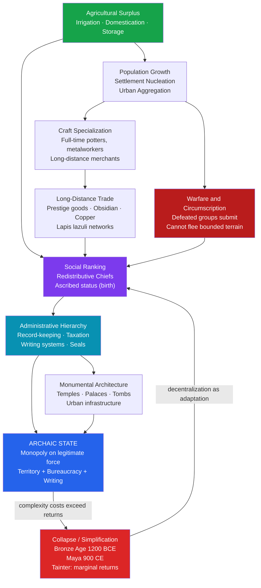

# State Formation and Early Civilizations

> [!abstract] TL;DR
> State formation is the process by which small, egalitarian human societies transformed — over millennia — into territorially bounded, hierarchically governed polities with cities, writing, and standing armies; understanding *why* this happened, and whether it was inevitable, is one of archaeology's central debates.

---

## Intuition

**Analogy:** Imagine a neighborhood where everyone does their own cooking, grows their own garden, and handles their own disputes. Now the neighborhood grows. Some people become better cooks and start feeding others in exchange for garden produce; one household accumulates enough surplus food to feed a small army of assistants; disputes grow too complex for informal resolution and one family gains the reputation — enforced by a stockpile of food and loyal fighters — of being the final word. The neighborhood is no longer a neighborhood. It is a proto-state.

This is, in compressed form, what happened across the ancient world between roughly 5000 and 1500 BCE. The critical engine is not individual ambition but collective circumstance: surplus agriculture makes stored wealth possible; stored wealth makes hierarchy possible; hierarchy, once established, makes itself harder to dismantle. The archaeologist's job is to reconstruct which local circumstances — a bounded river valley, a trade route, a seasonal flood — tipped any particular neighborhood into statehood.

---

## How It Works



---

## Key Concepts

### Secondary Level

**Service's Social Evolution Typology**

Elman Service (1962) proposed that human societies evolved through four stages, each representing increasing social complexity:

| Stage | Scale | Leadership | Economic Base | Example |
|-------|-------|-----------|---------------|---------|
| **Band** | 20–50 persons | None (egalitarian) | Foraging | !Kung San, Hadza |
| **Tribe** | Hundreds | Big-man (earned, not inherited) | Horticulture/pastoralism | New Guinea highlanders |
| **Chiefdom** | Thousands | Chief (hereditary, redistributive) | Intensive agriculture | Mississippian cultures, Hawaii |
| **State** | Tens of thousands+ | Ruling class (bureaucratic) | Surplus extraction + trade | Mesopotamia, Egypt, Inca |

The progression is not inevitable or irreversible — it is an analytical typology, not a historical law. Many societies remained bands or tribes for millennia; some chiefdoms appeared, collapsed, and re-emerged.

**Morton Fried's Stratification Framework**

Morton Fried (1967) focused specifically on *inequality* rather than complexity, producing a parallel but distinct sequence:

- **Egalitarian society**: as many prestige positions as people capable of filling them (no fixed hierarchy)
- **Rank society**: fewer positions of prestige than qualified people (hereditary chiefs, but no differential access to basic resources)
- **Stratified society**: differential access to basic resources (land, food, water) based on birth — true inequality begins here
- **State**: a stratified society with institutionalized coercive authority

Fried's contribution: the state is not just about administrative complexity but about *enforced inequality*. The state emerged to protect the property of those who had accumulated surplus — a class-conflict reading that anticipates Marxist archaeology.

**Archaeological Markers of State-Level Society**

Archaeologists cannot directly observe "rulers" or "bureaucracies" in the soil, but they identify states through material correlates:

| Marker | What It Indicates | Archaeological Evidence |
|--------|------------------|------------------------|
| Monumental architecture | Centralized labor mobilization | Ziggurats (Ur), pyramids (Giza), platform mounds (Cahokia) |
| Writing / record-keeping | Administrative taxation and tribute tracking | Cuneiform tablets (Uruk), Linear B (Mycenae) |
| Craft specialization | Full-time non-food producers supported by surplus | Workshop districts, standardized pottery assemblages |
| Long-distance trade goods | Prestige economy and elite networks | Obsidian, lapis lazuli, turquoise, copper far from sources |
| Administrative hierarchy | Multi-tiered settlement system | Primate cities surrounded by secondary and tertiary centers |
| Differential mortuary treatment | Ascribed status (inherited, not earned) | Royal tombs with sacrificed retainers (Ur, Anyang) |

---

### Undergraduate Level

**Theories of State Formation**

No single theory explains all cases. The major competing frameworks:

**1. Hydraulic Theory (Karl Wittfogel, 1957)**

Wittfogel argued that irrigation agriculture in arid environments required coordinated construction and maintenance of canals and dikes. Only a centralized authority could organize this labor and adjudicate water rights. Therefore, *hydraulic civilizations* (Mesopotamia, Egypt, China, Mesoamerica) were "Oriental despotisms" — states caused by irrigation management.

*Critique:* Archaeological evidence frequently shows that states *preceded* large irrigation systems, not the other way around. In Mesopotamia, early Uruk-period administrative complexity appears before major canal networks. Irrigation appears to be a product of state power as much as its cause. Wittfogel overgeneralized from a few cases.

**2. Circumscription Theory (Robert Carneiro, 1970)**

Carneiro's model is the most archaeologically testable. His argument:

- In *unbounded* environments (forests, open plains), when a village is defeated in warfare, the losers can simply move away — no political incorporation results
- In *circumscribed* environments — bounded by mountains, sea, desert, or neighboring populations so dense that flight is impossible — defeated groups cannot flee; they must submit to the winner's authority
- Repeated warfare in circumscribed environments forces losers to join winners; polities grow through successive military incorporation
- Result: bounded geographies produce states; open geographies do not (or do so much more slowly)

*Supporting evidence:* The first states all appear in circumscribed environments: the Nile valley (desert on both sides), the Tigris-Euphrates valley (surrounded by mountains and desert), coastal Peru (Pacific + Andes + desert). The Amazon basin, geographically open, produced no states.

*Critique:* Circumscription is necessary but not sufficient — many circumscribed environments never produced states. The model also underweights trade and ideology as drivers.

**3. Population Pressure (Ester Boserup, 1965; modified for state formation)**

Population growth forces agricultural intensification (more labor per unit of land). Intensification requires coordination and generates surplus. Surplus creates the raw material for hierarchy. In this view, population growth is the prime mover.

*Critique:* Causality is unclear — population growth and agricultural surplus are correlated, but which causes which? Some state-forming regions show population growth *following* political consolidation, not preceding it.

**4. Trade and Prestige Goods (Jonathan Friedman and Michael Rowlands, 1977)**

Chiefs accumulate political power by monopolizing access to exotic prestige goods (objects whose value depends on rarity and distance-of-origin). Controlling the flow of prestige goods lets elites cement alliances through gift-giving and deny competitors the means to build followings. Long-distance trade networks become both the medium and the reward of political power.

*Evidence:* The Hopewell interaction sphere in North America (100 BCE – 500 CE) distributed copper from the Great Lakes, obsidian from Yellowstone, and marine shells from the Gulf Coast across the entire eastern continent — without producing a state, but demonstrating the continental reach of prestige exchange. Mesopotamia's earliest administrative records (Uruk IV, ~3300 BCE) are accounting tablets tracking traded commodities.

**5. Internal Stratification / Class Conflict (Marxist Archaeology)**

Drawing on Friedrich Engels (*The Origin of the Family, Private Property and the State*, 1884) and developed by V. Gordon Childe, this view holds that the state emerged to manage and enforce class divisions that arose once surplus production made differential accumulation possible. The state is fundamentally a tool of class domination — an apparatus for preventing the expropriated majority from reclaiming the surplus.

*Childe's Urban Revolution (1950):* V. Gordon Childe identified ten criteria for the first cities — large population, craft specialization, tax/tribute extraction, monumental architecture, ruling class, writing, science, trade, resident artisans, state religion. Childe explicitly linked this transformation to the accumulation of surplus.

**6. Peer-Polity Interaction (Colin Renfrew, 1986)**

States did not form in isolation. When multiple chiefdoms or proto-states existed in proximity, they competed and imitated each other — borrowing administrative techniques, military innovations, and prestige symbols. This competitive interaction accelerated the development of all polities simultaneously. The rise of city-states in Mesopotamia, the emergence of Mayan lowland polities, and the Bronze Age palace economies of the Aegean all show this pattern.

**Case Studies**

**Mesopotamia — The Uruk Period (3500–3000 BCE)**

The Uruk period in southern Iraq is the best-documented origin of statehood. The city of Uruk grew to ~250 hectares and perhaps 50,000 people by 3100 BCE — the largest settlement on earth. Archaeological hallmarks:

- Cylinder seals (administrative signatures for tracking goods)
- Proto-cuneiform tablets: the world's first writing, initially entirely economic (commodity lists, labor rations)
- The Anu Ziggurat and White Temple: massive religious-administrative complexes requiring thousands of labor-days
- Uruk expansion: Uruk-style artifacts appear 1,000 km away in Iran, Syria, and Turkey — a "world system" of trade and colonization

The Uruk state was likely administered through temple institutions (the *é* — "house" — of a deity managed redistributive economy) before secular kingship (the *lugal*, "big man") consolidated power in the Early Dynastic period.

**Egypt — Nile Unification (3100 BCE)**

The Nile valley is Carneiro's circumscription model in near-perfect form: a narrow ribbon of fertile land flanked by absolute desert, subdivided into nome-territories. Competing chiefdoms in Upper and Lower Egypt engaged in warfare that archaeological evidence (the Narmer Palette, 3100 BCE) shows resolved in unification under a single pharaoh. The Egyptian state was characterized by:

- Divine kingship: the pharaoh was not merely a ruler but an incarnation of Horus, guaranteeing cosmic order (*ma'at*)
- A remarkably stable administrative hierarchy persisting for 3,000 years
- Monument-building as a state-making technology: the pyramids were not just tombs but demonstrations of the state's capacity to mobilize labor

**Indus Valley Civilization (2600–1900 BCE)**

The Indus (or Harappan) civilization challenges every standard model. Its cities — Mohenjo-daro, Harappa, Dholavira — were meticulously planned with grid streets, standardized fired-brick dimensions, sophisticated drainage systems, and citadel mounds. Yet:

- No evidence of royal tombs, monumental palaces, or a warrior ruling class
- No deciphered writing (Indus script remains undeciphered)
- Remarkably standardized weights and measures across a 1-million km² area

The Indus state (if it was a state) may have been organized around merchant elites and ritual specialists rather than warrior-kings — or it may have been a confederation of city-states without a single center.

**Mesoamerica — Olmec to Aztec**

Mesoamerica provides a laboratory for multiple independent cycles of state formation and collapse:

- **Olmec (1500–400 BCE)**: The "mother culture" of Mesoamerica. La Venta and San Lorenzo feature colossal stone heads (portraits of rulers), elaborate jade offerings, and evidence of long-distance exchange. Whether the Olmec constituted a state or a complex chiefdom is debated.
- **Classic Maya (250–900 CE)**: A peer-polity system of competing city-states (Tikal, Palenque, Copan) unified by shared cosmology, writing (hieroglyphic), calendar, and ball game — but never by a single imperial authority.
- **Aztec Triple Alliance (1428–1521 CE)**: A genuine conquest state extracting tribute from subject polities across central Mexico. Tenochtitlan's 200,000+ inhabitants depended on systematic tribute from a network of 400+ towns.

**Cahokia (900–1350 CE) — North American Complexity**

At its height around 1100 CE, Cahokia (near modern St. Louis) covered 15 km² and housed 10,000–20,000 people — the largest pre-Columbian city north of Mexico. Monk's Mound, its central platform, is larger by volume than the Great Pyramid of Giza. Cahokia represents a chiefdom or incipient state that emerged, flourished, and collapsed without leaving writing — a reminder that political complexity does not require writing.

---

### Graduate Level

**Collapse and Complexity: Tainter's Marginal Returns Theory**

Joseph Tainter's *The Collapse of Complex Societies* (1988) is the most theoretically rigorous treatment of societal collapse. His argument:

Societies solve problems by adding complexity — more layers of administration, more specialists, more infrastructure. Each increment of complexity initially yields high returns (solving a real problem). But as the society scales, **marginal returns on complexity decline**: each additional administrator, defensive wall, or aqueduct solves progressively less important problems at progressively greater cost. When the cost of maintaining existing complexity exceeds the benefit, rational actors reduce investment — the society "collapses" to a lower level of complexity that is actually economically rational.

Tainter explicitly rejects collapse as catastrophe. Collapse is *simplification*: citizens experience it as liberation from taxation and bureaucratic burden, not merely as disaster. The Roman peasant who stops paying taxes to a distant emperor in exchange for local warlord protection may be better off.

**The Bronze Age Collapse (1200–1150 BCE)**

The most dramatic systemic collapse in ancient history. Between 1200 and 1150 BCE, virtually every major Bronze Age palace society collapsed simultaneously: the Mycenaean palaces of Greece, the Hittite Empire, Ugarit, the Levantine city-states. Egypt survived but was severely weakened. Causes remain debated:

| Proposed cause | Evidence for | Evidence against |
|----------------|-------------|------------------|
| "Sea Peoples" invasions | Egyptian inscriptions at Medinet Habu | Sea Peoples appear *after* many collapses; may be refugees, not cause |
| Drought | Pollen cores, stable isotopes from Aegean lakes show drought 1200–1150 BCE | Drought alone does not explain simultaneous collapse across diverse climates |
| Earthquake storms | Destruction layers in multiple cities | Cannot explain political collapse of unaffected inland polities |
| Systems collapse (Cline) | All causes interact in a complex, interconnected Bronze Age world-system | Difficult to test; nearly unfalsifiable |

Eric Cline (*1177 B.C.: The Year Civilization Collapsed*, 2014) argues the most convincing explanation is *systems collapse*: the Late Bronze Age was a globalized, interconnected network of trade and mutual dependence. When any node in the system was stressed (drought, internal rebellion, disrupted trade), cascading failures propagated through the entire network. No single cause is sufficient; the fragility was systemic.

**The Maya Classic Collapse (800–900 CE)**

The collapse of Classic Maya cities in the southern lowlands is the best-studied case of complex regional collapse. Population fell by 50–90% in two generations. Causes:

- **Drought**: Lake sediment cores show severe multi-decadal droughts 800–1000 CE
- **Internecine warfare**: epigraphy reveals intensifying conflict between city-states in the Terminal Classic
- **Agricultural degradation**: soil erosion from intensive terraced farming; phosphorus depletion
- **Political fragmentation**: the peer-polity system had no mechanism to coordinate response to systemic stress

The Maya collapse was not total: northern lowland cities (Chichen Itza, Uxmal) flourished through the Terminal Classic. The collapse was regional, not civilizational — another reminder that collapse is partial simplification, not extinction.

**Critiques of Unilinear Typologies**

Service's band-tribe-chiefdom-state sequence has been heavily criticized:

- **Teleological bias**: implies all societies are "on the way to" statehood; privileges Western political forms as the endpoint of social evolution
- **Ethnographic present problem**: using contemporary foragers as proxies for Paleolithic ancestors ignores that modern hunter-gatherers have been shaped by millennia of interaction with states
- **Agency and resistance**: James C. Scott (*The Art of Not Being Governed*, 2009) documents how many "simple" societies in Southeast Asia actively *chose* to remain stateless to escape taxation and forced labor — complexity avoidance, not complexity failure
- **Non-Western alternatives**: the Indus Valley, the Hopewell interaction sphere, and Amazonian raised-field agriculture suggest pathways to large-scale social coordination that do not require hierarchical states

**Gender and State Formation**

Recent feminist archaeology (Cynthia Robin, Elizabeth Brumfiel) has emphasized that state formation was not a gender-neutral process. The domestication of women's labor — their increasing confinement to household production and reproductive roles — often accompanied the emergence of patriarchal states. In Mesopotamia, the transition from the Ubaid to the Uruk period shows women's productive roles shifting from craft production (formerly visible in public contexts) to household weaving and food processing (invisible archaeologically). State formation and patriarchal household formation are coeval processes, not independent ones.

---

## Python Demo

```python
import numpy as np
import matplotlib.pyplot as plt

# ---------------------------------------------------------------
# Carneiro's Circumscription Model — Simulation
#
# Two landscapes: BOUNDED (finite usable land) vs UNBOUNDED
# (infinite land to flee into). Villages engage in warfare.
# In bounded landscapes, losers cannot flee and must join the
# winner. In unbounded landscapes, losers flee to empty land.
#
# We track: number of independent polities over time,
# and the size of the largest polity.
# ---------------------------------------------------------------

rng = np.random.default_rng(42)

def run_simulation(n_villages, bounded, n_steps=300):
    """
    Parameters
    ----------
    n_villages : int   — initial number of independent villages
    bounded    : bool  — True = circumscribed landscape (cannot flee)
                         False = open landscape (losers found new village)
    n_steps    : int   — number of warfare rounds

    Returns
    -------
    polity_counts : list of int   — number of independent polities per step
    max_sizes     : list of int   — size of largest polity per step
    """
    # Each village starts as a polity of size 1
    polities = list(np.ones(n_villages, dtype=int))
    polity_counts = [len(polities)]
    max_sizes = [max(polities)]

    for _ in range(n_steps):
        if len(polities) < 2:
            # Only one polity remains — simulation complete
            polity_counts.append(len(polities))
            max_sizes.append(max(polities))
            continue

        # Select two polities to fight at random;
        # larger polity wins with probability proportional to its size
        idx_a, idx_b = rng.choice(len(polities), size=2, replace=False)
        size_a = polities[idx_a]
        size_b = polities[idx_b]
        prob_a_wins = size_a / (size_a + size_b)

        if rng.random() < prob_a_wins:
            winner_idx, loser_idx = idx_a, idx_b
        else:
            winner_idx, loser_idx = idx_b, idx_a

        loser_size = polities[loser_idx]

        if bounded:
            # Loser cannot flee — absorbed into winner
            polities[winner_idx] += loser_size
            polities.pop(loser_idx)
        else:
            # Loser flees — splits into two new independent villages
            # of size 1 each (abandons old territory, founds new one)
            # Winner absorbs nothing; loser disperses
            # Net effect: number of polities stays the same or rises
            polities.pop(loser_idx)
            polities.append(1)   # new independent village in open land
            # (winner gains nothing; the defeated simply scatter)

        polity_counts.append(len(polities))
        max_sizes.append(max(polities))

    # Pad to n_steps+1 if simulation ended early
    while len(polity_counts) < n_steps + 1:
        polity_counts.append(polity_counts[-1])
        max_sizes.append(max_sizes[-1])

    return polity_counts, max_sizes


N_VILLAGES = 80
N_STEPS = 300

counts_bounded,   sizes_bounded   = run_simulation(N_VILLAGES, bounded=True,  n_steps=N_STEPS)
counts_unbounded, sizes_unbounded = run_simulation(N_VILLAGES, bounded=False, n_steps=N_STEPS)

steps = np.arange(N_STEPS + 1)

fig, axes = plt.subplots(1, 2, figsize=(13, 5))
fig.suptitle(
    "Carneiro's Circumscription Model: Bounded vs Unbounded Landscapes",
    fontsize=12, fontweight="bold"
)

# --- Left: Number of independent polities ---
ax1 = axes[0]
ax1.plot(steps, counts_bounded,   color="#2563eb", linewidth=2.5, label="Bounded (circumscribed)")
ax1.plot(steps, counts_unbounded, color="#dc2626", linewidth=2.5, linestyle="--", label="Unbounded (open)")
ax1.set_xlabel("Warfare Rounds", fontsize=10)
ax1.set_ylabel("Number of Independent Polities", fontsize=10)
ax1.set_title("Political Consolidation Over Time", fontsize=11)
ax1.legend(fontsize=9)
ax1.grid(True, alpha=0.25)
ax1.axhline(y=1, color="#16a34a", linestyle=":", alpha=0.7)
ax1.text(N_STEPS * 0.65, 2.5, "Unified state\n(1 polity)", fontsize=8, color="#16a34a")

# --- Right: Size of largest polity ---
ax2 = axes[1]
ax2.plot(steps, sizes_bounded,   color="#2563eb", linewidth=2.5, label="Bounded — largest polity")
ax2.plot(steps, sizes_unbounded, color="#dc2626", linewidth=2.5, linestyle="--", label="Unbounded — largest polity")
ax2.set_xlabel("Warfare Rounds", fontsize=10)
ax2.set_ylabel("Size of Largest Polity (villages incorporated)", fontsize=10)
ax2.set_title("Growth of the Dominant Polity", fontsize=11)
ax2.legend(fontsize=9)
ax2.grid(True, alpha=0.25)

# Annotate final values
final_bounded_count   = counts_bounded[-1]
final_unbounded_count = counts_unbounded[-1]
final_bounded_size    = sizes_bounded[-1]
final_unbounded_size  = sizes_unbounded[-1]

ax1.annotate(
    f"Bounded: {final_bounded_count} polit{'y' if final_bounded_count == 1 else 'ies'}",
    xy=(N_STEPS, final_bounded_count),
    xytext=(N_STEPS - 80, final_bounded_count + 4),
    fontsize=8, color="#2563eb",
    arrowprops=dict(arrowstyle="->", color="#2563eb", lw=1.2)
)
ax1.annotate(
    f"Unbounded: {final_unbounded_count} polities",
    xy=(N_STEPS, final_unbounded_count),
    xytext=(N_STEPS - 80, final_unbounded_count + 8),
    fontsize=8, color="#dc2626",
    arrowprops=dict(arrowstyle="->", color="#dc2626", lw=1.2)
)

plt.tight_layout()
plt.savefig("carneiro_circumscription.png", dpi=150, bbox_inches="tight")
plt.show()

print("Carneiro Circumscription Model — Summary")
print("-" * 52)
print(f"  Initial villages     : {N_VILLAGES}")
print(f"  Warfare rounds       : {N_STEPS}")
print(f"  Bounded   — final polity count : {final_bounded_count:>4}  |  largest: {final_bounded_size}")
print(f"  Unbounded — final polity count : {final_unbounded_count:>4}  |  largest: {final_unbounded_size}")
print()
print("Key insight: In a bounded landscape, every defeat forces incorporation.")
print("The dominant polity grows because there is nowhere for losers to escape.")
print("In an open landscape, losers found new villages — polity count stays high.")
```

**What the model shows:**

- The bounded simulation converges toward a single dominant polity (a state) within a few hundred warfare rounds because each defeat removes one independent unit and adds its population to the winner
- The unbounded simulation maintains a large number of independent villages indefinitely — defeated groups reconstitute elsewhere, preventing consolidation
- This reproduces Carneiro's core prediction: the Nile valley, coastal Peru, and the Tigris-Euphrates basin (all bounded) produced early states; the Amazon and the North American interior (open) did not

---

## Real-World Applications

> **Uruk-period Mesopotamia (3500 BCE):** The earliest literate administrative system emerged not to record literature or religion but to track commodity flows — ration lists, livestock counts, labor assignments. The first "text" is an accountant's spreadsheet. This supports the trade-and-redistribution model: the state originated as a logistical machine managing economic complexity, not as a political or military entity. The cylinder seal — a bureaucrat's personal signature rolled in wet clay — is the world's first administrative technology.

> **Colonial state formation by analogy:** European colonial administrations in Africa and Asia represent a second-order case of state formation. Colonial states were imposed on circumscribed territories (bounded by colonial borders), extracted surplus through taxation, and built administrative infrastructure specifically to enable extraction — reproducing, in compressed historical time, many of the dynamics Carneiro and Wittfogel identified in ancient cases. The difference: colonial states were designed to extract *for an external metropole*, not to invest in territorial capacity — which is why, as Jeffrey Herbst argues, they left a legacy of administrative shells rather than functional states.

> **Tainter's framework and modern governance:** Tainter's marginal returns argument has been applied to contemporary states. The United States federal government, the European Union's regulatory apparatus, and large-scale healthcare bureaucracies all face versions of the same problem: each increment of regulatory or administrative complexity was added to solve a real problem, but accumulated complexity now generates overhead costs that exceed its benefits in many domains. The policy debate about regulatory reform is, in Tainter's terms, a debate about where a society sits on its marginal returns curve.

---

## Common Pitfalls

- **Confusing typology with sequence** — Service's band-tribe-chiefdom-state typology describes *structural types*, not an inevitable historical sequence. Societies do not graduate through these stages; many skipped stages, reverted, or achieved complexity through entirely different pathways. Treating the typology as a developmental ladder produces the Eurocentric error of ranking non-Western societies as "less evolved."

- **Monocausal explanations** — No single theory (hydraulic, circumscription, population pressure, trade) explains all cases. The Indus Valley defies hydraulic determinism; the Maya highlands contradict circumscription (open terrain, but produced complex polities); Egypt supports both hydraulic and circumscription readings simultaneously. State formation is multi-causal and context-dependent.

- **Conflating writing with civilization** — The Indus Valley had a script we cannot read; Cahokia had no writing at all; the Inca used quipus (knotted strings) rather than script. Writing is one archaeological marker of states, not a defining criterion. The equation "no writing = no civilization" is a bias toward literate traditions and systematically undervalues oral and material record-keeping.

- **Collapse as catastrophe** — The Bronze Age Collapse and the Maya Classic Collapse are often narrated as civilizational endings. Tainter's framework reframes them: collapse is simplification, which can be adaptive. Post-collapse populations were often smaller, less burdened by tribute, and more resilient. The "Dark Ages" that followed the Bronze Age Collapse saw the spread of iron technology and alphabetic writing — transformations that became the foundation of the next cycle of complexity.

- **Treating ancient states as modern states** — Archaic states lacked the infrastructural reach of modern states. The Ur III Sumerian state (2112–2004 BCE) had remarkable administrative records but controlled a core territory of perhaps 100 km radius; most of its nominal domain was administered through local kinship networks. Projecting modern state attributes (census, police, border control) onto ancient polities distorts the evidence.

- **Gender-blind archaeology** — The default assumption that state formation was driven by male warriors and male administrators has been challenged by feminist archaeologists who identify women's labor, female ritual specialists, and gender-stratified craft production as central to state formation processes. Ignoring gender produces systematically incomplete models.

---

## Related Concepts

- [[State_Formation_and_Political_Development]] — The political science perspective on the same process: Weber's monopoly on violence, Tilly's war-makes-states, Acemoglu's extractive vs. inclusive institutions; the Anthropology note provides the deep-time archaeological foundations that the Political Science note presupposes
- [[Classical_Sociological_Theory]] — Weber's typology of legitimate domination (traditional, charismatic, rational-legal) maps directly onto the transition from chiefdom to archaic state; Durkheim's mechanical vs. organic solidarity describes the social bond shift that accompanies state formation
- [[Development_Economics]] — Acemoglu and Robinson's institutions hypothesis extends the archaeologist's question ("why did states form differently?") into the modern period; the Indus Valley and Mesoamerican cases show that development pathways were multiple from the very beginning
- [[Conflict_Theory_and_Critical_Theory]] — Engels and Childe's class-conflict model of state origins is a direct application of Marxist conflict theory to archaeology; the state as enforcer of class hierarchy is both a sociological and an archaeological proposition
- [[Family_Marriage_and_Kinship]] — Kinship systems (lineages, clans, moieties) are the organizational substrate from which chiefdoms and early states emerged; the transition to the state involved partly dismantling kinship-based redistribution and replacing it with territorial administration
- [[Social_Class_and_Stratification]] — Fried's rank-to-stratified-to-state sequence is an archaeological account of how social stratification hardened into class — permanent, inherited, and enforced by institutional violence

---

## Review Questions

### Secondary

1. What are three things that archaeologists look for in the ground to determine whether a society was a state? Why can't they just look for a "government building"?
2. Explain Carneiro's circumscription theory in your own words. Draw a simple diagram showing why defeated villagers in a river valley surrounded by desert would behave differently from defeated villagers in the middle of a forest.
3. The Bronze Age Collapse destroyed almost every major civilization around the Mediterranean in about fifty years (1200–1150 BCE). Why do historians think no single cause is enough to explain it?

### Undergraduate

1. Compare and contrast Wittfogel's hydraulic theory and Carneiro's circumscription theory as explanations for state formation. For each, identify one case study where the evidence supports the theory and one where it creates problems.
2. V. Gordon Childe coined the term "Urban Revolution" to describe the emergence of cities. Using Childe's ten criteria and at least two case studies (e.g., Mesopotamia, Indus Valley), evaluate how well the concept travels across different early civilizations. Does it illuminate or obscure variation?
3. James C. Scott argues that many "simple" societies in Southeast Asia were not primitive predecessors of states but sophisticated *avoiders* of statehood. How does this argument challenge unilinear evolutionary typologies, and what methodological problems does it raise for interpreting the archaeological record of non-state societies?

### Graduate

1. Tainter's marginal returns theory proposes that collapse is economically rational simplification, not civilizational failure. Evaluate this claim using at least two cases (e.g., Bronze Age Collapse, Maya Classic, Western Roman Empire). Does Tainter's framework explain the *causes* of declining returns, or only describe the *pattern* of collapse? What are its limits?
2. Feminist archaeologists argue that state formation and patriarchal household formation are coeval processes, not independent ones. Using Mesopotamian or other archaeological evidence, construct an argument for or against the proposition that you cannot explain state formation without explaining the simultaneous transformation of gender relations.
3. The Indus Valley Civilization challenges all standard models of state formation: no warrior kings, no decipherable writing, no monumental royal tombs, but remarkable standardization across a million square kilometers. What does the Indus case suggest about the necessary and sufficient conditions for state-level social organization? How should comparative archaeologists revise their typologies to accommodate non-hierarchical pathways to large-scale coordination?

---

## Sources

- Elman Service, *Primitive Social Organization: An Evolutionary Perspective*, Random House, 1962
- Morton Fried, *The Evolution of Political Society: An Essay in Political Anthropology*, Random House, 1967
- Robert Carneiro, "A Theory of the Origin of the State," *Science* 169(3947), 1970
- Karl Wittfogel, *Oriental Despotism: A Comparative Study of Total Power*, Yale University Press, 1957
- V. Gordon Childe, "The Urban Revolution," *Town Planning Review* 21(1), 1950
- Joseph Tainter, *The Collapse of Complex Societies*, Cambridge University Press, 1988
- Eric H. Cline, *1177 B.C.: The Year Civilization Collapsed*, Princeton University Press, 2014
- James C. Scott, *The Art of Not Being Governed: An Anarchist History of Upland Southeast Asia*, Yale University Press, 2009
- Colin Renfrew, "Peer Polity Interaction and Socio-political Change," in *Peer Polity Interaction and Socio-Political Change*, Cambridge University Press, 1986
- Jonathan Friedman and Michael Rowlands, "Notes Towards an Epigenetic Model of the Evolution of Civilisation," in *The Evolution of Social Systems*, 1977
- Friedrich Engels, *The Origin of the Family, Private Property and the State*, 1884
- Gil Stein, "Rethinking World-Systems: Power, Distance, and Diasporas in the Dynamics of Interregional Interaction," in *World-Systems Theory in Practice*, 1999

---

#Anthropology #Archaeology #StateFormation #EarlyCivilizations #Chiefdoms #UrbanRevolution #Carneiro #Wittfogel #Tainter #BronzeAgeCollapse
