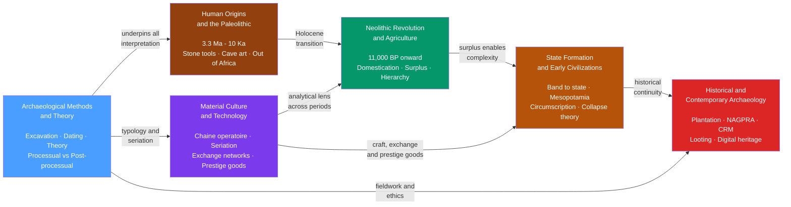

# Archaeology and Prehistory

> [!abstract] Section Overview
> This section reconstructs the human story from the first stone tools 3.3 million years ago to the living controversies of contemporary heritage management — using material culture, not documents, as its primary evidence. It covers the full methodological toolkit archaeologists deploy to read artifacts, soils, and bones, then follows the chronological arc from Paleolithic hunters through the Neolithic farming revolution and the rise of the first states, while a crosscutting note on material culture theory applies across all periods, and a final note on historical and contemporary archaeology extends the discipline into the present and its urgent ethical debates.

---

## Notes in This Section

- [[Archaeological_Methods_and_Theory]] — the field's foundational toolkit: excavation, stratigraphy, the Harris matrix, dating methods from radiocarbon to aDNA, and the processual vs. post-processual theory debate
- [[Human_Origins_and_the_Paleolithic]] — 3.3 Ma to ~10 Ka: Oldowan, Acheulean, and Upper Paleolithic industries; behavioral modernity; Out of Africa; megafauna extinctions
- [[Neolithic_Revolution_and_Agriculture]] — independent origins of farming across six world regions, the domestication syndrome, the health paradox of agriculture, and the social consequences of storable surplus
- [[State_Formation_and_Early_Civilizations]] — from band to state: competing theories of state origins, case studies in Mesopotamia, Egypt, Indus Valley, and Mesoamerica, and collapse theory from Tainter to the Bronze Age
- [[Material_Culture_and_Technology]] — the chaîne opératoire, artifact seriation, obsidian exchange networks, craft specialization, prestige goods, and the social life of things
- [[Historical_and_Contemporary_Archaeology]] — plantation archaeology, the archaeology of capitalism, public archaeology, NAGPRA and indigenous sovereignty, heritage looting, and digital preservation

---

## Concept Map

*(Blue = methodological foundation; purple = crosscutting analytical framework; brown tones = chronological sequence; red = advanced contemporary applications)*

---

## Learning Path

*Recommended order for a first pass through this section:*

1. [[Archaeological_Methods_and_Theory]] — start here to understand how archaeologists read the material record; every subsequent note depends on these tools and debates
2. [[Human_Origins_and_the_Paleolithic]] — apply the methods to the deepest human past; establishes the baseline of human cognitive and behavioral evolution
3. [[Material_Culture_and_Technology]] — learn the analytical vocabulary for objects, exchange, and seriation before tackling the more socially complex periods
4. [[Neolithic_Revolution_and_Agriculture]] — the pivotal transition: surplus, sedentism, and the material paradox of farming; builds directly on Paleolithic background and material culture frameworks
5. [[State_Formation_and_Early_Civilizations]] — follow the logic of surplus into hierarchy, urbanism, and collapse; the most theoretically dense note benefits from the prior four as scaffolding
6. [[Historical_and_Contemporary_Archaeology]] — the section closes with the discipline turned back on itself: who owns the past, whose voices the record preserves, and what archaeology owes living communities

---

## Key Themes

- **Material evidence as primary text.** Across all six notes, objects — stone flakes, ceramics, obsidian blades, spirit bundles, plantation root cellars — outrank documents as evidence precisely because they are left by everyone, not only the literate and the powerful. The section is unified by this commitment to reading human life from its physical residue.

- **Deep chronological arc with methodological continuity.** The same stratigraphic and dating principles that situate a 3.3-million-year-old Oldowan chopper also date a 17th-century plantation deposit. The section deliberately spans from the first stone tools to living repatriation disputes to show that prehistoric and historical archaeology are one discipline applied across different time scales.

- **Theory in tension: science versus interpretation.** The processual vs. post-processual debate introduced in the methods note echoes through every subsequent note — in the behavioral modernity controversy, in Hodder's Catalhoyuk excavation, in Diamond's geographic determinism versus agency-based critiques, and in Leone and Shackel's archaeology of capitalism. Students should track how this tension is never fully resolved.

- **Ethics and politics of the past.** NAGPRA, the UNESCO 1970 Convention, plantation archaeology, and the Kennewick Man case establish that archaeology is a politically contested practice. Who excavates, who interprets, who owns remains and objects, and whose heritage counts are not peripheral issues but central to what the discipline is for.

---

## Cross-Section Links

- [[Human_Evolution_and_Paleoanthropology]] *(Section 02 — Biological Anthropology)* — the biological complement to Human Origins and the Paleolithic; covers the same hominin fossil record from the anatomical and phylogenetic side; the two notes triangulate the same evidence from behavioral-archaeological and biological-evolutionary angles
- [[Human_Variation_and_Population_Genetics]] *(Section 02 — Biological Anthropology)* — the genetics of the Out of Africa dispersal, Neolithic demic diffusion into Europe, and archaic admixture with Neanderthals and Denisovans; directly extends the Paleolithic and Neolithic notes' aDNA findings
- [[Forensic_Anthropology]] *(Section 02 — Biological Anthropology)* — shares skeletal analysis and taphonomy methods with zooarchaeology and bioarchaeology; NAGPRA disputes over ancestral remains connect the two sub-fields
- [[Evolutionary_Psychology_and_Cultural_Evolution]] *(Section 02 — Biological Anthropology)* — the cognitive and evolutionary underpinnings of behavioral modernity, language origins, and the Upper Paleolithic revolution complement the Paleolithic note's behavioral archaeology
- [[Classical_Anthropological_Theory]] *(Section 01 — History and Theory)* — Morgan and Engels on unilinear social evolution and the origins of the state; Marx on class and surplus; Childe's Urban Revolution; these foundational theories are the intellectual backstory for every state formation debate in this section
- [[Interpretive_and_Postmodern_Anthropology]] *(Section 01 — History and Theory)* — post-processual archaeology is the archaeological expression of the wider interpretive and postmodern turn; Hodder, Shanks, and Tilley belong equally to this section's intellectual history
- [[Kinship_Marriage_and_Family_Systems]] *(Section 04 — Culture, Society and Religion)* — the Neolithic creation of heritable surplus transformed kinship from flexible forager networks into property-transmitting patrilineal households; the State Formation note traces this material transition
- [[Political_Anthropology_and_Power]] *(Section 04 — Culture, Society and Religion)* — Elman Service's evolutionary typology, Weber's monopoly on violence, and Scott's stateless peoples are the political anthropology context for the archaeological state formation debates
- [[Religion_Magic_and_Ritual]] *(Section 04 — Culture, Society and Religion)* — Upper Paleolithic cave art, Neanderthal burial, Çatalhöyük bucranium installations, and plantation spirit bundles are all archaeological evidence for the ritual and symbolic dimensions of religion analyzed in the cultural section
