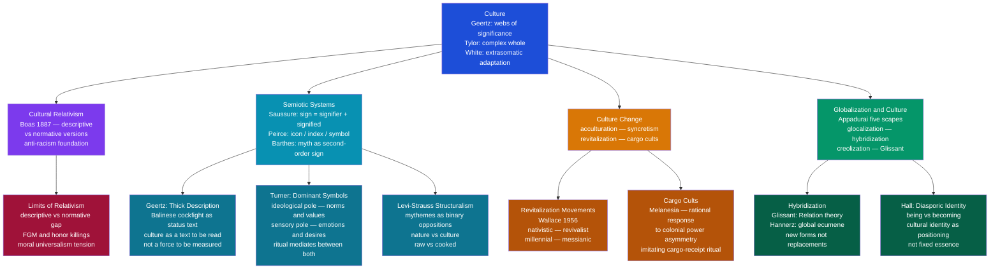

# Culture, Symbols, and Meaning

> [!abstract] TL;DR
> Culture is the web of shared meanings through which humans interpret the world and act within it; symbolic anthropology — from Geertz's thick description to Lévi-Strauss's binary oppositions — reveals that every ritual, object, and gesture encodes status, cosmology, and power, while cultural relativism remains anthropology's most productive and most contested methodological commitment.

---

## Intuition

**Analogy:** Watch a chess match without knowing the rules. You see two people staring at a board, occasionally moving small carved pieces, and registering quiet satisfaction or distress at outcomes you cannot predict. The physical events — hands moving wood across wood — are entirely visible. But the *game itself* is invisible: the meaning of checkmate, the social stakes of victory, whether this is casual play or a championship, whether losing damages the loser's reputation — none of this is readable from the physical surface alone. The pieces only make sense *inside* a system of shared rules and social understandings that the players carry in their heads and enact together.

That is culture. The physical event — a cockfight in Bali, a potlatch feast on the Pacific Northwest Coast, a corporate handshake in Tokyo — is just pieces moving on a board. Clifford Geertz called the anthropologist's task **thick description**: not just recording that the piece moved, but decoding what that move *means* inside the game — which requires mapping the entire rule system, the social stakes, the histories of the players, and the cultural vocabulary that makes a rooster fight more than a rooster fight. The chess analogy also captures the key move anthropology made against Victorian evolutionism: there is no "primitive" or "advanced" chess. Every game is complete on its own terms, internally coherent, and fully meaningful to those playing it.

---

## How It Works



The diagram captures the four major analytical frameworks in symbolic and cultural anthropology: the semiotic turn (Geertz, Turner, Lévi-Strauss) reading culture as a system of signs; cultural relativism as the discipline's foundational ethical stance and its limits; the mechanisms of culture change under conditions of contact and power asymmetry; and globalization theory's account of what happens to cultural meaning when the sources of symbols become global while their interpretation remains local.

---

## Key Concepts

### Secondary Level

**Defining Culture: From Tylor to Geertz**

Anthropology has struggled with no concept more than its own central object. Kroeber and Kluckhohn (1952) surveyed over 300 definitions — a number that itself indicates the difficulty. Several have proven durable:

| Theorist | Year | Definition | Key Emphasis |
|---|---|---|---|
| **Edward Tylor** | 1871 | "That complex whole which includes knowledge, belief, art, morals, law, custom, and any other capabilities and habits acquired by man as a member of society" | Accumulated, learned totality |
| **Franz Boas** | 1887 | Each culture is a historically specific configuration; there is no single evolutionary ladder | Historical particularity, anti-racism |
| **Leslie White** | 1959 | Culture is the extrasomatic means of adaptation — uniquely human capacity for "symboling" | Tool-like function; evolution of culture |
| **Clifford Geertz** | 1973 | "Man is an animal suspended in webs of significance he himself has spun" — culture is those webs | Semiotic, interpretive |

The Tylor-to-Geertz arc marks a fundamental methodological shift: from culture as a list of traits to be counted and ranked (Victorian anthropology) to culture as a system of meanings to be interpreted (symbolic anthropology). Geertz borrowed from Max Weber the image of humans as meaning-making animals and from Gilbert Ryle the concept of *thick description* — the ethnographer's task is not to record behavior (thin description) but to decode its meaning in context (thick description).

**Cultural Relativism: Descriptive vs. Normative**

Franz Boas (1887) introduced cultural relativism as a methodological response to Victorian racism. The argument has two distinct forms that must not be conflated:

- **Descriptive cultural relativism**: every culture has its own internal logic, history, and coherence; practices must be understood in their own context before any judgment is possible. This is sound and methodologically indispensable. It simply says: *understand before you evaluate*.

- **Normative cultural relativism**: no culture's practices can be judged from the outside; all cultural practices are equally valid. This position is far more contestable. It implies that we have no grounds to criticize female genital cutting, honor killings, or chattel slavery in societies that practice them — a conclusion most anthropologists reject on universalist grounds.

The productive position: apply *descriptive* cultural relativism as a starting point for ethnographic work, while retaining the capacity for moral evaluation once genuine understanding is achieved. Boas's own commitment was to anti-racism, not to relativizing away human rights. His critique was directed at European claims of biological superiority — not at the idea that human suffering is bad.

**Symbols: The Anthropological Definition**

Anthropologists distinguish three kinds of signs (following Peirce):

| Type | Basis of Meaning | Example |
|---|---|---|
| **Icon** | Resemblance to what it represents | A portrait; a map; onomatopoeia |
| **Index** | Causal or existential connection | Smoke indexing fire; a footprint indexing a person |
| **Symbol** | Arbitrary convention; socially agreed | The word "tree"; a national flag; a wedding ring |

Culture operates primarily through symbols: signs whose meaning is not inherent in their physical form but assigned by a community's shared conventions. A red octagon means "stop" not because of any natural property of redness but because a community has agreed it does. This means culture is inherently *social* — a symbol that only one person knows is not yet a cultural symbol — and *learnable/teachable* — no one is born knowing what a flag means.

White's concept of "symboling" is the capacity to bestow meaning on things and events arbitrarily. He argued this capacity is uniquely human and is what makes culture — rather than instinct or individual learning — the primary mode of human adaptation.

---

### Undergraduate Level

**Geertz's Thick Description and the Balinese Cockfight**

In "Deep Play: Notes on the Balinese Cockfight" (1973, *The Interpretation of Cultures*), Geertz demonstrates thick description at its most powerful. A thin description of a Balinese cockfight is: "two roosters fight in an arena while men bet on the outcome." A thick description reads the event as a *text* — a story the Balinese tell themselves about themselves.

What the thick description reveals:
- Cockfights are not primarily about money. The amounts bet are "deep" (Bentham's term for stakes large enough to hurt) but structurally organized around *status*, not profit maximization.
- The cock is a symbolic extension of the man who owns it — Balinese men care for their cocks with extraordinary tenderness. To lose a cock is to suffer a public diminishment of masculinity and social status.
- The betting pattern mirrors Balinese social structure: the largest center bets are between men of roughly equal social standing; the side bets are structured by kinship and village allegiances.
- The cockfight is a "simulation of the social matrix" — it renders visible the status hierarchy that ordinarily remains implicit and plays out what it would mean to win and lose in that hierarchy, without the permanent consequences.

Geertz's method: the ethnographer is like a literary critic reading a poem. The goal is not prediction, measurement, or causal explanation — it is *interpretation*. This is what he means by culture being a "document" that can be read. The cockfight is not merely a game; it is a text through which Balinese society comments on itself.

**Victor Turner: Dominant Symbols and Ritual Process**

Victor Turner (*The Forest of Symbols*, 1967; *The Ritual Process*, 1969) developed a theory of symbols grounded in Ndembu (Zambia) ritual ethnography. His key distinction is between **dominant symbols** and **instrumental symbols**:

- **Dominant symbols** appear across many rituals; they condense a wide range of meanings; they are multivocal (carrying many meanings simultaneously); they cannot be fully paraphrased. The mudyi (milk tree) in Ndembu girls' initiation rituals stands simultaneously for: mother's milk, matrilineal descent, the unity of Ndembu society, and the principle of womanhood itself.

- **Instrumental symbols** are specific to a particular ritual and serve as means toward that ritual's ends.

Turner's dominant symbols have two poles:
1. **Ideological (normative) pole**: abstract social norms, values, and moral rules — what the symbol means in the cosmic or social order
2. **Sensory (orectic) pole**: physical, bodily, emotionally charged content — what the symbol makes people *feel*

The power of ritual lies in the *unification* of these poles: a ritual symbol fuses the moral ought with the bodily is, lending social norms the emotional force of physiological experience. Ritual is not merely about transmitting beliefs; it transforms affect, making the moral feel natural and urgent.

Turner also introduced **liminality** (from Van Gennep's rites of passage): the threshold state in ritual process where normal social categories dissolve, creating *communitas* — an undifferentiated sense of social unity before the new social identity is installed.

**Ferdinand de Saussure: The Linguistic Foundation of Semiotics**

Claude Lévi-Strauss applied Ferdinand de Saussure's structural linguistics to cultural analysis. Saussure's key distinctions:

| Concept | Definition | Example |
|---|---|---|
| **Signifier** | The sound-image or written form | The sound /tri:/ |
| **Signified** | The mental concept | The concept of a tree |
| **Sign** | The inseparable union of signifier + signified | The word "tree" as meaning |
| **Langue** | The underlying system of language rules | English grammar as a system |
| **Parole** | Actual utterances within that system | This specific sentence |
| **Arbitrary** | No natural bond between signifier and signified | "Tree" vs "Baum" vs "árbol" — same concept |

The crucial insight for anthropology: if meaning arises not from the intrinsic properties of signs but from the *differences* between signs in a system, then cultural meaning works the same way. The color "red" means danger not because of anything about redness, but because it is *different from green* in a traffic-light system. Culture is a system of differences, not a collection of positive meanings.

**Roland Barthes: Myth as Second-Order Signification**

Roland Barthes (*Mythologies*, 1957) extended Saussure's schema to analyze how ideology operates through cultural signs. Barthes distinguished two levels of meaning:

- **Denotation**: the literal, first-order meaning of a sign (a photograph of a Black French soldier saluting the tricolor flag means: a soldier saluting a flag)
- **Connotation / Myth**: the second-order meaning that naturalizes ideology (the same image means: French imperialism is benign, multicultural, and just — France's colonial subjects embrace it)

**Myth** for Barthes is not false belief — it is any second-order sign system that *naturalizes history*: it presents what is historically contingent (French imperialism, bourgeois domestic arrangements, white beauty standards) as natural, inevitable, and universal. Myth works by making ideology invisible — it does not say "imperialism is good," it says "of course a French soldier would salute the flag." The ideological work is done before the audience has a chance to evaluate the claim.

This analysis maps directly onto contemporary media: an advertisement that depicts a family in a suburban house with a car in the garage is not selling a product — it is naturalizing a historically specific form of domesticity as what "family" simply looks like.

---

### Graduate Level

**Lévi-Strauss: Structuralism and Mythemes**

Claude Lévi-Strauss applied Saussure's structural method to myth and kinship. His central claim: myths are not random stories but structured systems for thinking through contradictions that cannot be resolved in practice. The myth works by producing an apparent mediation between binary opposites.

The method (*The Raw and the Cooked*, 1964):
1. Decompose myths into their minimal constituent units: **mythemes** — bundles of relations
2. Arrange mythemes in two axes: syntagmatic (sequential narrative order) and paradigmatic (thematic groupings across myths)
3. Identify the **binary oppositions** the myth is working through: nature/culture, raw/cooked, life/death, male/female, self/other

Example: The Oedipus myth works through the opposition between the affirmation of blood relations (Oedipus kills the dragon = overcomes autochthonous origin) and the denial of blood relations (Oedipus kills his father, marries his mother). The myth is a machine for thinking the unthinkable — where do humans come from if we cannot both be born from earth and be born from women simultaneously?

Lévi-Strauss's method proved enormously generative and deeply contested. Critics (Geertz, Sahlins, Evans-Pritchard) argued that structural analysis drains myths of their historical specificity, local color, and the irreducible particularity of what actually happened to real people in real times and places.

**Marshall Sahlins: Structure and Event — The Death of Captain Cook**

Marshall Sahlins (*Islands of History*, 1985) conducted perhaps the most sophisticated analysis of the relationship between cultural structure and historical event through the death of Captain James Cook in Hawaii in 1779.

The context: Cook arrived in Hawaii during the Makahili festival season — the time when the god Lono (associated with fertility, peace, and the return of rains) was said to return. Cook's ships sailed clockwise around the island (as Lono was said to do), he arrived with extraordinary material abundance, and the Hawaiians welcomed him in terms appropriate for the return of Lono. Cook was treated as the god. He departed — and then returned out of season when his ship was damaged. The unexpected, out-of-season return violated the ritual calendar. In an altercation over a stolen boat, Cook was killed.

Sahlins's analysis: the Hawaiians were not simply "wrong" or "irrational." They were *acting culturally* — applying their existing cosmological structure to make sense of an unprecedented event. The structure (Lono-cycle mythology, the ritual calendar, the categories of god and man) provided the interpretive resources through which an entirely new event (European contact) was made meaningful. But the event also *transformed* the structure: after Cook's death, the Hawaiian kapu system was reorganized around the new political dynamics his death had introduced.

The theoretical payoff: culture is not a cage of fixed meanings but an active process of applying categorical schemas to novel events — and those events, in the very process of being categorized, sometimes transform the categories themselves. Structure enables action; action transforms structure. This is Sahlins's critique of both pure structuralism (which denies history) and pure event-driven history (which denies structure).

**Revitalization Movements: Wallace and the Logic of Crisis Response**

Anthony Wallace (*American Anthropologist*, 1956) developed a general theory of **revitalization movements** — organized, conscious efforts by members of a society to construct a more satisfying culture when the existing one has been destabilized, typically by colonial conquest, forced acculturation, or epidemic disease.

Wallace identified four subtypes:

| Type | Orientation | Example |
|---|---|---|
| **Nativistic** | Purge foreign elements, return to pure ancestral culture | Ghost Dance Movement (Lakota, 1890) |
| **Revivalist** | Revive a past golden age, whether historically real or mythologized | Many 19th-century evangelical awakenings |
| **Millennial / Messianic** | Anticipate a supernaturally transformed new world | Melanesian cargo cults; early Christianity |
| **Transformative** | Create an entirely new culture, neither old nor borrowed | Handsome Lake religion (Seneca, 1799) |

The process follows a sequence: steady state → period of increased stress (famine, disease, conquest) → cultural distortion → revitalization movement → new steady state (or movement failure and disintegration).

**Cargo Cults as Rational Response to Colonial Power Asymmetry**

Melanesian cargo cults (observed from the late 19th century onward) are among the most misunderstood phenomena in anthropology. The standard colonial account — "primitive peoples irrationally mimic European behavior hoping magical goods will arrive" — is precisely backwards. A more accurate analysis:

1. Pacific Island peoples observed that Europeans received extraordinary quantities of manufactured goods (*kago*) — steel, cloth, firearms, canned food — with no visible labor producing them. The goods arrived on ships and airplanes after Europeans performed certain rituals: writing in books, speaking into boxes, moving pieces across tables.

2. Since Pacific cosmologies often understood wealth as flowing from the spirit world through ritual mediation, the inference that Europeans had discovered the correct ritual formula for accessing that flow was *internally logical* — a rational application of existing cosmological categories to a new phenomenon (exactly as Sahlins describes for Hawaii).

3. Cults therefore replicated the visible behaviors associated with cargo receipt: constructing airstrip simulacra, marching with wooden rifles, establishing "offices" with desks and papers.

Peter Worsley (*The Trumpet Shall Sound*, 1957) and Kenelm Burridge (*Mambu*, 1960) reread cargo cults as *political* movements: implicit critiques of colonial inequality, assertions of indigenous dignity, and — in many cases — the organizational precursors of explicit anticolonial political movements.

**Appadurai's Five Scapes: Culture in Global Flows**

Arjun Appadurai ("Disjuncture and Difference in the Global Cultural Economy," 1990) theorized globalization as a set of five *disjunctive* flows — moving at different speeds, in different directions, with different actors:

| Scape | Content | Example |
|---|---|---|
| **Ethnoscapes** | Moving persons: tourists, immigrants, refugees, guest workers | Syrian diaspora reshaping European cities |
| **Technoscapes** | Global distribution of mechanical and informational technology | iPhone supply chain spanning 43 countries |
| **Finanscapes** | Currency flows, capital markets, derivatives, speculation | 2008 crisis transmitting from U.S. mortgage market globally |
| **Mediascapes** | Media production capabilities and the images/narratives they generate | Netflix content shaping ideas of family and romance globally |
| **Ideoscapes** | Political ideologies, counter-ideologies, and the images attached to them | "Democracy," "freedom," "rights" traveling with NGO infrastructure |

Crucially, these scapes are **disjunctive**: they do not move in lockstep. A country can be integrated into finanscapes (foreign capital dominates its economy) while being relatively insulated from ideoscapes (authoritarian government controls information). The disjunctures between scapes produce cultural turbulence: a village with smartphones and satellite television but no running water is experiencing a specific configuration of mediascapes, technoscapes, and ethnoscapes that earlier theories of modernization could not predict.

**Creolization and Cultural Hybridization**

Édouard Glissant (*Caribbean Discourse*, 1981; *Poetics of Relation*, 1990) developed creolization as a theory of cultural encounter in the context of Atlantic slavery. Creolization is not simply mixture — it is the production of *new and unpredictable cultural forms* from elements that could not have been foreseen in any of the contributing cultures. The Caribbean creole languages (not just pidgins, but fully complex grammatical systems) emerged from the forced encounter of West African languages, French, English, Spanish, and Portuguese under conditions of extreme power asymmetry.

The key insight: creolization does not mean the weaker culture simply adopts the stronger. Under conditions of extreme violence (slavery), African cultural elements survived, transformed, combined with European elements and indigenous Amerindian traces, and produced something entirely new — Vodou, jazz, calypso, creole cuisines. Neither the "original" African nor the European form is recoverable in the creole product; but the product is not thereby diminished. It is a new form.

Ulf Hannerz (*Cultural Complexity*, 1992) developed a parallel concept — the **global ecumene** — the interconnected world cultural system in which no culture is any longer isolated. All cultures are now in permanent dialogue with a global flow of images, commodities, and practices. But dialogue is not erasure: local cultures engage with global flows through their own existing frameworks, producing hybridizations that are neither pure global nor pure local.

**Stuart Hall: Cultural Identity in Diaspora**

Stuart Hall ("Cultural Identity and Diaspora," 1990) distinguished two ways of thinking about cultural identity:

- **Identity as being**: a shared culture, a stable collective self that people in diaspora carry with them — the idea that there is a continuous "Jamaican" or "Black Atlantic" identity beneath historical experience. This view provides the basis for solidarity and political mobilization.

- **Identity as becoming**: identity is not an essence but a *positioning* — it is made, not found; it is always in process; it is constituted through, not outside, representation. The diaspora experience does not merely displace an original identity; it produces new subject positions that could not have existed before the displacement.

Hall insists both are true. The first view is necessary for political solidarity — there must be something to identify *with*. The second view is necessary for historical accuracy — that "something" is itself a cultural construction, and diaspora identities are genuinely new forms, not degraded versions of an original.

---

## Python Demo

```python
# Cultural Contact: Hybridization vs. Assimilation
#
# Two cultures are represented as binary trait vectors of length N_TRAITS.
# A "trait" is any cultural element: food practice, kinship term, ritual form,
# decorative motif. On contact, traits transfer from the dominant culture to
# the receiving culture with a probability set by the power asymmetry ratio.
#
# Hybridization scenario  (power_ratio = 0.30): balanced influence;
#   the receiving culture ends up as a novel blend, similar to neither original.
# Assimilation scenario   (power_ratio = 0.85): dominant culture overwhelms;
#   the receiving culture converges toward the dominant one (acculturative loss).
#
# Key anthropological mappings:
#   power_ratio = 0.30  -> trade contact, mutual borrowing, glocalization
#   power_ratio = 0.85  -> colonial conquest, forced assimilation, boarding schools
#
# Uses: numpy, matplotlib only

import numpy as np
import matplotlib
matplotlib.use("Agg")
import matplotlib.pyplot as plt

rng = np.random.default_rng(42)

N_TRAITS = 60    # number of cultural traits
T        = 120   # time steps (each = one generation of contact)

# ── Build initial cultures ──────────────────────────────────────────────────
# Culture A: dominant (e.g., colonial power); Culture B: receiving (e.g., colonized)
# Start them completely different for maximum clarity.
culture_a = rng.integers(0, 2, N_TRAITS)
culture_b_original = 1 - culture_a          # B is initially the inverse of A

def run_contact(culture_dominant, culture_receiving, power_ratio, steps):
    """
    Simulate cultural contact over `steps` generations.

    Each step:
      - For every trait where dominant != receiving, receiving adopts the
        dominant trait with probability `power_ratio`.
      - Traits already shared are stable (no change).

    power_ratio interpretation:
      0.5  = perfectly symmetric (mutual diffusion)
      0.85 = strong dominance (assimilation / forced acculturation)
      0.30 = weak dominance (hybridization / glocalization)

    Returns:
      sim_to_dominant  : array[steps+1] — fraction of traits shared with dominant culture
      sim_to_original  : array[steps+1] — fraction of traits retained from original culture
      final_culture    : array[N_TRAITS] — the receiving culture's state after contact
    """
    c = culture_receiving.copy()

    sim_to_dominant = [float(np.mean(c == culture_dominant))]
    sim_to_original = [1.0]

    for _ in range(steps):
        differ = culture_dominant != c
        adopt  = differ & (rng.random(N_TRAITS) < power_ratio)
        c      = np.where(adopt, culture_dominant, c)
        sim_to_dominant.append(float(np.mean(c == culture_dominant)))
        sim_to_original.append(float(np.mean(c == culture_receiving)))

    return np.array(sim_to_dominant), np.array(sim_to_original), c

# ── Run both scenarios ──────────────────────────────────────────────────────
sim_a_hyb,  sim_b_hyb,  final_hyb  = run_contact(
    culture_a, culture_b_original, power_ratio=0.30, steps=T)

sim_a_asim, sim_b_asim, final_asim = run_contact(
    culture_a, culture_b_original, power_ratio=0.85, steps=T)

# ── Diagnostic summary ─────────────────────────────────────────────────────
steps_arr = np.arange(T + 1)

print("=== Cultural Contact Simulation ===")
print(f"N_TRAITS = {N_TRAITS}  |  T = {T} generations\n")

print(f"{'Scenario':<30}  {'Final sim. to A':>16}  {'Traits retained from B':>22}")
print("-" * 74)
for label, s_a, s_b in [
    ("Hybridization  (ratio=0.30)", sim_a_hyb,  sim_b_hyb),
    ("Assimilation   (ratio=0.85)", sim_a_asim, sim_b_asim),
]:
    print(f"{label:<30}  {s_a[-1]:>16.3f}  {s_b[-1]:>22.3f}")

print()
print("Anthropological interpretation:")
print("  Hybridization: final culture is ~50-70% similar to both A and B.")
print("  It is NEITHER the original A nor the original B — a new third form.")
print("  This is Glissant's creolization: not mixture, but emergence.")
print()
print("  Assimilation: final culture converges strongly toward A (>90%).")
print("  B's original traits are nearly erased — acculturative loss.")
print("  This maps to colonial boarding-school policies (residential schools,")
print("  Stolen Generations) designed to eliminate indigenous cultural forms.")

# ── Identify which traits were retained, lost, or borrowed in hybridization ─
retained_b = (final_hyb == culture_b_original).sum()
adopted_a  = (final_hyb == culture_a).sum()
print(f"\n  Hybridization final state:")
print(f"    Traits from B (retained):  {retained_b}/{N_TRAITS}")
print(f"    Traits from A (adopted):   {adopted_a}/{N_TRAITS}")
print(f"    Traits neither A nor B:    {N_TRAITS - retained_b - adopted_a}/{N_TRAITS}")

# ── Plot ────────────────────────────────────────────────────────────────────
fig, axes = plt.subplots(1, 2, figsize=(12, 4.5), sharey=True)
fig.suptitle(
    "Cultural Contact: Hybridization vs. Assimilation\n"
    "(Anthropological trait-vector model)",
    fontsize=11
)

configs = [
    (axes[0], sim_a_hyb,  sim_b_hyb,  "Hybridization  (power ratio = 0.30)", "#2980b9"),
    (axes[1], sim_a_asim, sim_b_asim, "Assimilation   (power ratio = 0.85)", "#c0392b"),
]

for ax, s_a, s_b, title, col in configs:
    ax.plot(steps_arr, s_a, lw=2.5, color=col,
            label="Similarity to dominant culture (A)")
    ax.plot(steps_arr, s_b, lw=2.5, color=col, ls="--",
            label="Retention of receiving culture (B)")
    ax.axhline(0.5, lw=1, ls=":", color="gray", alpha=0.6)
    ax.set_title(title, fontsize=10)
    ax.set_xlabel("Generations of Contact", fontsize=10)
    ax.legend(fontsize=8, loc="center right")
    ax.set_xlim(0, T)
    ax.set_ylim(-0.03, 1.06)

axes[0].set_ylabel("Cultural Similarity (proportion of traits)", fontsize=10)
plt.tight_layout()
plt.savefig("culture_contact_simulation.png", dpi=140, bbox_inches="tight")
print("\nFigure saved: culture_contact_simulation.png")
```

**What the model demonstrates:**

- **Hybridization** (power ratio 0.30 — balanced contact, e.g., trade, migration, glocalization): the receiving culture ends at roughly 50–65% similarity to the dominant culture while retaining 35–50% of its original traits. Critically, the *unique* traits of the hybrid — those that are neither pure A nor pure B — represent genuine cultural innovation. This is Glissant's creolization, Hannerz's global ecumene, and Appadurai's hybridization: contact generates new cultural forms that could not have been predicted from either contributing culture alone.

- **Assimilation** (power ratio 0.85 — forced contact, e.g., colonial conquest, residential school systems): the receiving culture converges rapidly toward the dominant one. Within 60-80 generations of contact, over 90% of original cultural traits are displaced. This maps to deliberate assimilationist policies — the Canadian residential school system, the Australian Stolen Generations, U.S. Bureau of Indian Affairs boarding schools — which were explicitly designed to maximize this kind of cultural power asymmetry.

- **Policy and advocacy implication**: revitalization movements (Wallace 1956) and language revitalization programs operate to *reverse* the assimilation trajectory by deliberately reintroducing and reinvesting in suppressed cultural traits — lowering the effective power ratio through cultural sovereignty.

---

## Real-World Applications

> **Example 1 — Geertz and Development Policy:** The U.S. Agency for International Development's early modernization-era programs in Indonesia (1950s–60s) operated on thin description: they measured economic output, caloric intake, school enrollment. They systematically ignored the thick cultural context in which these metrics were embedded — the symbolic significance of land ownership in Javanese cosmology, the role of ritual feasting in maintaining social solidarity, the meaning of "progress" in a culture organized around hierarchical obligation rather than individualist striving. The result was interventions that achieved their numerical targets and shattered the social fabric they depended on. Geertz's ethnographic work in Java and Morocco was in part a sustained critique of this failure mode.

> **Example 2 — Turner's Liminality in Organizational Change:** Management consultants and organizational theorists have applied Turner's ritual process to corporate transformation. A company undergoing a major restructuring — office relocation, merger, rebranding — passes through a liminal phase: existing hierarchies dissolve, role definitions blur, normal rules are temporarily suspended. Turner's analysis predicts that this phase is experienced as disorienting anxiety (the dissolution of structure) but also as a potential moment of communitas — genuine solidarity among people who normally occupy different hierarchical positions. Organizations that manage liminality well (creating clear transition rituals, honoring what is being left behind before installing the new structure) achieve higher post-change cohesion than those that rush through it.

> **Example 3 — Cargo Cults and Contemporary Finance:** Peter Worsley's political reinterpretation of cargo cults maps surprisingly well onto contemporary financial behavior. The investors who buy NFTs or meme stocks, observing that certain actions (buying certain tokens, following certain influencers) appear to produce extraordinary wealth without visible productive labor, are applying a rational inference to a genuinely opaque causal system — exactly as Melanesian cargo cultists applied their cosmological categories to the equally opaque causal system of colonial trade logistics. The inference is not irrational; the cosmological framework is simply incomplete.

> **Example 4 — Appadurai's Scapes and the Arab Spring:** The 2010–12 Arab uprisings illustrate scape disjuncture in action. The mediascape (Al Jazeera, Twitter, Facebook) moved faster than the ideoscape (pan-Arab democracy discourse) faster than the technoscape (state infrastructure) faster than the finanscape (Gulf petrodollar patronage networks) faster than the ethnoscape (actual migration of activists). Each scape created conditions for and constraints on the others — the Twitter revolution framing was both enabled by mediascape integration and overturned by the finanscape and ethnoscape dynamics it could not control. Appadurai's framework correctly predicted that the outcome would not be simple democratization; scape disjuncture produces turbulence, not linear progress.

> **Example 5 — Barthes's Myth in Brand Marketing:** Nike's "Just Do It" campaign is a textbook Barthesian myth-machine. Denotation: an advertisement showing a person running. Connotation: the image naturalizes a particular set of values — individualism, self-overcoming, the equation of product consumption with authentic identity — as simply what human striving looks like. The ideological work is invisible because it has been rendered natural: of course aspiration requires the right shoe. Barthes's method reveals that every brand identity is a second-order sign system whose primary function is to naturalize historically contingent consumption patterns as expressions of eternal human desires.

---

## Common Pitfalls

- **Confusing thick description with mere detail** — Geertz's thick description is not simply "writing more about what you observe." It is interpretive: it requires the analyst to reconstruct the *meaning* of an action from the participant's perspective, situate it in the broader cultural system, and make explicit the rules and conventions that make the action intelligible. Adding more ethnographic detail without interpretive work is still thin description.

- **Sliding from descriptive to normative cultural relativism** — The most common error in introductory anthropology. Descriptive relativism (understand before evaluating) is methodologically sound and ethically productive. Normative relativism (therefore never evaluate) is neither — it provides cover for human rights violations and is inconsistent with Boas's own anti-racist commitments. The concepts are distinct and should always be kept separate.

- **Treating Peirce's icon/index/symbol as mutually exclusive** — In practice, most signs function through multiple registers simultaneously. A national anthem is symbolic (arbitrary convention), indexical (its occurrence indexes a ceremonial occasion), and may incorporate iconic elements (a melody that imitates military drums). The categories are analytical tools, not mutually exclusive properties of signs.

- **Reading Lévi-Strauss as making claims about individual psychology** — Lévi-Strauss explicitly argued that structural oppositions are properties of the *myth as cultural object*, not of the minds of individual myth-tellers. He is not saying that Balinese people consciously think in binary oppositions; he is saying that a structural analysis of the myth reveals an underlying logic. Critics who object that informants never say anything about binary oppositions are missing the level of analysis.

- **Treating cargo cults as evidence of cognitive inferiority** — This is precisely the colonial framing that Worsley, Burridge, and subsequent scholars overturned. Cargo cults are evidence of rational inference under conditions of radical information asymmetry and extreme power inequality. The logical error (inferring ritual causation from correlated observation) is ubiquitous in human cognition regardless of culture; its cultural expression reflects the available cosmological vocabulary, not intellectual capacity.

- **Misreading hybridization as pure loss for the weaker culture** — Glissant insists that creolization is not the diminishment of contributing cultures but the emergence of genuinely new forms. This is not sentimentality: Caribbean creole languages are grammatically complex systems with their own literary traditions, not degraded versions of European languages. Hybridization can involve the loss of specific practices, but the hybrid form is not a deficit; it is a new thing.

---

## Related Concepts

- [[_MOC_Culture_Society_and_Religion|↑ Culture, Society and Religion MOC]]
- [[Culture_Norms_Values_and_Ideology]] — The sociological parallel: where anthropology analyzes culture through symbolic interpretation and ethnographic fieldwork, sociology analyzes it through the mechanisms of norm enforcement, ideological reproduction (Althusser, Gramsci), and cultural capital (Bourdieu); the two disciplines converge on Geertz's semiotic definition
- [[Globalization_and_Social_Change]] — Appadurai's five scapes provide the anthropological framework for what Wallerstein's world-system and Robertson's glocalization describe at the macro-sociological level; hybridization theory is the cultural dimension of globalization theory
- [[Language_and_Thought]] — Saussure's structural linguistics is the foundation of symbolic anthropology; the Sapir-Whorf hypothesis (linguistic relativity) is the cognitive-psychological parallel to Geertz's claim that cultural categories shape perception; both argue that the systems through which meaning is made constrain what can be meaningfully thought
- [[Nationalism_Ethnicity_and_Collective_Identity]] — Anderson's imagined communities thesis applies the anthropological insight that nations are symbolic constructions; Barth's ethnic boundary theory maps directly onto symbolic anthropology's analysis of how symbols mark and maintain group identity
- [[Religion_Sacred_and_Secular]] — Turner's ritual process and the concept of liminality emerged from religious ethnography; cargo cults are simultaneously religious and political movements; Durkheim's sacred/profane distinction (which runs through Turner) is a semiotic distinction as much as a sociological one
- [[Family_Marriage_and_Kinship]] — Lévi-Strauss's structural analysis of kinship and marriage exchange systems (alliance theory, the elementary structures of kinship) is the direct application of his structural method to social organization; the incest taboo as a universal is the founding move of culture over nature
- [[Migration_and_Diaspora]] — Hall's cultural identity in diaspora theory, and Glissant's creolization, are both rooted in the specific experience of forced and voluntary migration; the diaspora condition is the site where hybridization, cultural retention, and identity politics become most visible
- [[Media_Culture_and_Cultural_Industries]] — Barthes's mythological analysis of media images and Appadurai's mediascape both theorize how mass media transmit cultural meanings globally; the culture industry (Adorno/Horkheimer) and Barthes's myth converge on the claim that media naturalize ideological meanings
- [[Socialization_and_the_Self]] — Symbolic anthropology's analysis of how cultural meanings are transmitted through ritual and symbol is the anthropological counterpart to sociology's analysis of socialization; both address how the individual internalizes the cultural system as a self

---

## Review Questions

### Secondary

1. Clifford Geertz calls culture "webs of significance." What does he mean by this, and how does it differ from earlier anthropologists who described culture as a "complex whole" (Tylor) or as a "means of adaptation" (White)? Which definition do you find most useful, and why?
2. Your friend argues: "All cultures are equally valid — who are we to judge anyone else's practices?" Using the distinction between descriptive and normative cultural relativism, evaluate this claim. Identify one case where descriptive relativism seems clearly right and one where normative relativism seems clearly wrong.

### Undergraduate

3. Geertz argues that the Balinese cockfight is "a story Balinese tell about themselves." Using the concepts of thick description and the cockfight essay, explain: (a) what it means to read a cultural practice as a "text," and (b) what methodological limitations this approach has — what kinds of questions does it leave unanswered?
4. Compare and contrast Turner's "dominant symbols" with Barthes's concept of "myth." Both argue that symbols condense multiple meanings and naturalize social arrangements. Where do the two analyses converge, and where do they diverge in their understanding of *how* symbols carry ideological weight?
5. Wallace's revitalization movement typology and the anthropological literature on cargo cults both analyze how colonized peoples respond to the destruction of their cultural systems. Compare the two frameworks: what does Wallace's typology capture that the cargo cult literature misses, and vice versa?

### Graduate

6. Sahlins argues that "structure" and "event" must be analyzed together — that events are always culturally mediated and that events transform structures. Use the Captain Cook case to evaluate this argument against two competing positions: (a) a strictly materialist account that reads Cook's death as a result of political-economic tensions over trade goods, and (b) a purely structuralist account that sees the Hawaiians as simply applying pre-existing categories without transformation. Which account is most adequate to the historical record?
7. Appadurai's "disjunctive scapes" model and Glissant's creolization theory both theorize cultural globalization, but from very different starting points (postcolonial social science vs. Caribbean literary theory). Develop a synthesis: what does each concept illuminate that the other cannot? Identify a specific contemporary case — choose one from digital culture, migration, or food systems — and apply both frameworks to it.
8. Hall argues that diasporic cultural identity is both "being" (a shared stable culture) and "becoming" (a positioning that is always in process). This creates a tension: if cultural identity is always in process, what grounds political solidarity movements that mobilize around shared cultural identity (Black Lives Matter, indigenous sovereignty movements, LGBTQ+ liberation)? How does Hall resolve this tension, and do you find his resolution adequate?

---

## Sources

- [Tylor, E.B. (1871). *Primitive Culture*. Murray.](https://archive.org/details/primitiveculture01tylouoft)
- [Geertz, C. (1973). *The Interpretation of Cultures*. Basic Books.](https://www.goodreads.com/book/show/53204.The_Interpretation_of_Cultures)
- [Geertz, C. (1973). "Deep Play: Notes on the Balinese Cockfight." *Daedalus* 101(1), 1–37.](https://www.jstor.org/stable/20024056)
- [Turner, V. (1967). *The Forest of Symbols: Aspects of Ndembu Ritual*. Cornell University Press.](https://www.goodreads.com/book/show/534428.The_Forest_of_Symbols)
- [Turner, V. (1969). *The Ritual Process: Structure and Anti-Structure*. Aldine.](https://www.goodreads.com/book/show/425413.The_Ritual_Process)
- [Lévi-Strauss, C. (1964). *The Raw and the Cooked* (*Mythologiques* I). Plon. (English trans. Harper & Row, 1969.)](https://www.goodreads.com/book/show/295898.The_Raw_and_the_Cooked)
- [Sahlins, M. (1985). *Islands of History*. University of Chicago Press.](https://www.goodreads.com/book/show/477543.Islands_of_History)
- [Wallace, A.F.C. (1956). "Revitalization Movements." *American Anthropologist* 58(2), 264–281.](https://doi.org/10.1525/aa.1956.58.2.02a00040)
- [Worsley, P. (1957). *The Trumpet Shall Sound: A Study of Cargo Cults in Melanesia*. MacGibbon and Kee.](https://www.goodreads.com/book/show/953682.The_Trumpet_Shall_Sound)
- [Appadurai, A. (1990). "Disjuncture and Difference in the Global Cultural Economy." *Public Culture* 2(2), 1–24.](https://doi.org/10.1215/08992363-2-2-1)
- [Barthes, R. (1957). *Mythologies*. Éditions du Seuil. (English trans. Cape, 1972.)](https://www.goodreads.com/book/show/51714.Mythologies)
- [Glissant, É. (1990). *Poetics of Relation*. Gallimard. (English trans. University of Michigan Press, 1997.)](https://www.goodreads.com/book/show/463271.Poetics_of_Relation)
- [Hannerz, U. (1992). *Cultural Complexity: Studies in the Social Organization of Meaning*. Columbia University Press.](https://www.goodreads.com/book/show/1272726.Cultural_Complexity)
- [Hall, S. (1990). "Cultural Identity and Diaspora." In J. Rutherford (Ed.), *Identity: Community, Culture, Difference*. Lawrence & Wishart.](https://www.goodreads.com/book/show/1310074.Identity)
- [Kroeber, A.L. & Kluckhohn, C. (1952). *Culture: A Critical Review of Concepts and Definitions*. Peabody Museum.](https://www.worldcat.org/title/culture-a-critical-review-of-concepts-and-definitions/oclc/3131606)
- [White, L.A. (1959). *The Evolution of Culture*. McGraw-Hill.](https://www.goodreads.com/book/show/1369234.The_Evolution_of_Culture)
- [Anthropology Review: Geertz's Thick Description and the Balinese Cockfight](https://anthropologyreview.org/anthropology-explainers/clifford-geertz-thick-description-balinese-cockfight/)
- [Helpful Professor: Appadurai's 5 Scapes of Globalization](https://helpfulprofessor.com/appadurai-scapes/)

---

#Anthropology #CultureSociety #Culture #Symbols #Meaning #CulturalRelativism
