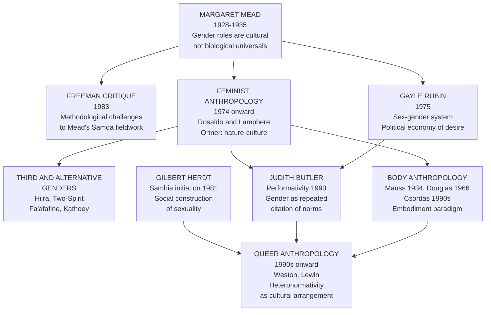

> [!abstract] TL;DR
> Gender and sexuality are not biological givens but cultural constructs that vary dramatically across societies — a claim established by Margaret Mead's Pacific fieldwork, deepened by feminist and queer anthropologists, and given its sharpest theoretical form in Judith Butler's performativity; the anthropology of the body shows further that the very way humans inhabit and use their physical form is culturally trained, socially mapped, and politically contested.

---

## Intuition

**Analogy:** Imagine learning to swim. You are not simply moving your body through water however feels natural — you are executing a culturally specific technique. The front crawl was invented in particular historical circumstances, spread through Olympic competition and swimming instruction manuals, and is now so naturalized that Western swimmers experience it as the only efficient way to move through water. Indigenous Pacific islanders developed entirely different strokes, equally efficient in their contexts, that feel completely natural to those who learned them. Marcel Mauss called this a *technique of the body*: the culturally specific, socially transmitted repertoire of ways a body learns to walk, sit, carry loads, give birth, eat, and swim. There is no pre-cultural body.

Now extend this to gender. What counts as a masculine walk, a feminine gesture, a proper sexual partner, or a natural family arrangement is no less culturally trained than a swimming stroke. The feeling of naturalness is itself the product of training so early, so pervasive, and so socially enforced that its cultural origins become invisible. Anthropology of gender and sexuality is, at its core, the project of making those origins visible again — not to dissolve gender and sexuality, but to understand what they actually are and what work they do in human social life.

---

## How It Works

The field developed through three successive but overlapping theoretical movements, each building on and revising the last.



---

## Key Concepts

### Secondary Level

#### Mead's Foundational Challenge

**Margaret Mead** (1901–1978) conducted two studies that permanently disrupted the assumption that gender and adolescence are biologically determined.

**Coming of Age in Samoa (1928)** was Mead's first major fieldwork, conducted when she was 23 in American Samoa. She asked: is adolescent stress and sexual conflict universal, or is it a product of specific cultural arrangements? Her answer was that Samoan adolescents experienced adolescence as a period of relative ease and sexual exploration — not the storm-and-stress that G. Stanley Hall's biologically grounded theory predicted. The implication was radical: if the experience of adolescence is cultural, then the psychological turbulence Western societies associate with puberty is not a fixed feature of human nature but an artifact of social organization.

**Sex and Temperament in Three Primitive Societies (1935)** compared three New Guinea societies to ask whether "masculine" and "feminine" personality traits were universal:

| Society | Dominant temperament of both sexes | How it compared to Western expectations |
|---------|------------------------------------|-----------------------------------------|
| **Arapesh** | Cooperative, gentle, nurturing | Both sexes displayed traits Western culture labeled feminine |
| **Mundugumor** | Aggressive, fierce, competitive | Both sexes displayed traits Western culture labeled masculine |
| **Tchambuli** | Men: dependent, ornamental; Women: dominant, practical | Reversed from Western gender expectations |

The conclusion: gender temperaments are shaped by culture, not fixed by biology. What counts as naturally masculine or feminine varies enough cross-culturally to undermine any claim to biological determination of personality along gendered lines.

**The Freeman Controversy**: In 1983, Derek Freeman published *Margaret Mead and Samoa: The Making and Unmaking of an Anthropological Myth*, arguing that Mead had been misled by informants who joked about their sexual activities and that Samoan society was in fact hierarchical, sexually repressive, and violent. The controversy was bitter and technically inconclusive. The consensus among anthropologists is that Freeman overstated his critique — possible informant deceptions would not invalidate all of Mead's observations — but that she had romanticized Samoa and did not adequately account for internal variation. The broader methodological lesson: single ethnographies conducted by a single researcher cannot bear the weight of sweeping universal claims, and cross-cultural fieldwork is inherently interpretive.

#### The Sex/Gender Distinction

The distinction between **biological sex** (chromosomes, hormones, anatomy) and **socially constructed gender** (roles, identities, norms, performances) became the foundational analytical tool of feminist social science.

Gayle Rubin's **"The Traffic in Women" (1975)** gave this distinction its most influential anthropological formulation through the concept of the *sex/gender system*: "the set of arrangements by which a society transforms biological sexuality into products of human activity." Every society takes the raw material of biological sex difference and constructs from it a specific system of gender roles, sexual identities, and kinship arrangements. Rubin drew on Lévi-Strauss's exchange theory to argue that this system — not capitalism alone — is the mechanism through which women are subordinated. The political implication: gender inequality is not natural but is produced through specific cultural arrangements that can, in principle, be otherwise.

#### Third and Alternative Genders

One of the strongest pieces of evidence for the social construction of gender is the cross-cultural documentation of **third and alternative genders** — categories that do not map onto a simple male/female binary:

| Term | Society | Description |
|------|---------|-------------|
| **Hijra** | South Asia (India, Pakistan, Bangladesh) | Individuals assigned male at birth who identify as a third gender; formally associated with the goddess Bahuchara Mata; recognized social role with both sacred blessings and social marginality |
| **Two-Spirit** | Many Indigenous North American nations | A pan-Indian umbrella term adopted in 1990 for individuals who fulfill third- or fourth-gender roles combining masculine and feminine elements; specific nations have distinct terms (winkte among Lakota, nádleehí among Navajo) |
| **Fa'afafine** | Samoa | Individuals raised male who embody feminine gender roles; valued community members; not equivalent to gay or transgender in the Western clinical sense |
| **Kathoey** | Thailand | Individuals assigned male at birth who adopt feminine presentation; historically associated with Buddhist cosmological frameworks; distinct from Western transgender identity categories |

The anthropological point is not that these categories are identical to one another — each is embedded in different cosmological, social, and economic systems. It is that the *existence* of formally recognized gender positions outside the male/female binary across unrelated cultures is powerful evidence that binary gender is a cultural arrangement, not an exhaustive natural fact. Gilbert Herdt's edited volume *Third Sex, Third Gender* (1994) remains the definitive cross-cultural survey.

---

### Undergraduate Level

#### Feminist Anthropology: The Public/Domestic Framework

The foundational text of feminist anthropology is **Rosaldo and Lamphere's *Women, Culture and Society* (1974)**. In her introductory essay, Michelle Rosaldo proposed the **public/domestic framework**: in every known society, women are more associated with the domestic sphere — household, childcare, kin maintenance — while men dominate the public sphere of politics, ritual, exchange, and warfare. This asymmetry explains why, despite enormous cross-cultural variation in gender roles, no fully matriarchal society — one in which women systematically dominate men across all domains — has been documented.

Rosaldo was careful to distinguish cultural pattern from biological determination: the public/domestic split is itself a cultural product, and its specific form varies enormously. But the pattern is general enough to require structural explanation, not merely cultural description.

Sherry Ortner's essay **"Is Female to Male as Nature Is to Culture?" (1974)** proposed a structuralist answer: every culture devalues nature relative to culture (because culture transcends and transforms nature), and every culture symbolically associates women with nature — through reproductive functions, bodily processes, and association with the domestic domain — while associating men with culture. Therefore women are universally devalued. This is not biological determination; it is a structural logic of symbolic classification that reproduces subordination cross-culturally regardless of the specific content of gender roles.

Ortner's argument was controversial and was later modified by Ortner herself — the equation of women with nature is not universal, and the nature/culture distinction is itself a cultural construct — but it generated a productive research program examining how symbolic systems reproduce gender hierarchy across otherwise very different societies.

#### Body Anthropology: Mauss, Douglas, Csordas

**Marcel Mauss's "Techniques of the Body" (1934)** introduced the concept that defines the field: the *technique du corps*. Mauss observed that different societies train bodies to perform basic biological functions — walking, swimming, digging, carrying, giving birth — in culturally specific ways transmitted through imitation and social learning, not instinct. The body is the first and most fundamental instrument of culture. Mauss also introduced the concept of the *habitus* — durable, acquired dispositions embodied in the person — a concept Pierre Bourdieu later systematized into one of sociology's most powerful analytical tools.

**Mary Douglas** developed the idea of the **body as social map**. In *Purity and Danger* (1966) and *Natural Symbols* (1970), she argued that the human body is a symbol of society: its surfaces, orifices, and margins represent the boundaries of the social body. What counts as dirty or polluting about the physical body is not random — it corresponds to what is socially threatening or boundary-crossing. Menstrual blood is strongly polluted in societies where gender boundaries are strictly enforced. Food taboos encode social hierarchies and group identities. The individual body is always a microcosm of the social order it inhabits.

**Thomas Csordas** made the decisive paradigm shift in "Embodiment as a Paradigm for Anthropology" (1990), drawing on Merleau-Ponty's phenomenology. The classical approach treated the body as an *object* — a surface inscribed with cultural meanings, a text to be read. Csordas argued for treating embodiment as the *subject*: the body as the ground of all perception, the pre-reflective starting point from which cultural experience is lived. The body is not merely a carrier of culture; it is the medium through which culture is constituted. In practice, this means studying how chronic illness is not just diagnosed and treated but *lived* — how people construct bodily identity when the body no longer performs as the social self requires.

#### Sexuality Cross-Culturally: Ford, Beach, and Herdt

**Ford and Beach's *Patterns of Sexual Behavior* (1951)** was the first systematic cross-cultural survey, drawing on Human Relations Area Files data from 190 societies. Key findings:
- Heterosexual intercourse is universal but its rules — who, when, how, in what ceremonial context — vary enormously
- Some form of same-sex sexual behavior was reported in the majority of surveyed societies
- No society approves of all sexual behavior; all societies regulate sexuality, but the content of regulation varies
- The incest taboo is universal but its scope varies — who counts as too closely related differs across kinship systems

**Gilbert Herdt's fieldwork among the Sambia of Papua New Guinea** (first published as *Guardians of the Flutes*, 1981) produced the most debated case in the anthropology of sexuality. Sambia initiation rites required that boys between ages 7 and 10 ritually ingest the semen of older youths for years, on the cultural theory that masculinity cannot be generated from within the male body but must be introduced from outside. The same boys, on reaching adulthood, took wives and became exclusively heterosexually active.

Herdt's analysis challenged Western developmental models of sexuality in two fundamental ways:
1. It showed that same-sex sexual acts can be *ritually mandated* and *culturally required* for the constitution of adult heterosexuality — the categories cannot be mapped onto Western identity labels without serious distortion
2. It showed that sexuality is not a fixed essence expressed in behavior but a cultural system that produces and organizes erotic experience within a specific symbolic and ritual framework

Herdt called for distinguishing *sexual acts* (behaviors), *sexual identities* (how people conceptualize themselves), and *sexual cultures* (the systems of meaning that organize both), recognizing that these do not map neatly onto one another across cultures.

---

### Graduate Level

#### Butler's Performativity: Anthropological Reading

Judith Butler's *Gender Trouble: Feminism and the Subversion of Identity* (1990) is primarily a work of philosophy and literary theory, but it has reshaped anthropological thinking about gender.

Butler's core argument: there is no pre-discursive biological sex that gender represents, and there is no inner gender identity that gender expression expresses. Gender is **performative** — it is constituted through repeated, regulated performances of acts, styles, and dispositions that *cite* (reference and reproduce) prior norms. Gender does not express an inner essence; it enacts the norm repeatedly, and those enactments *produce* the appearance of a natural, prior essence.

The concept of **citationality** (drawn from Derrida's analysis of speech acts): gender norms are never original — they are always citations of citations. Every performance of being a woman references prior performances that were themselves references to prior performances. This citational chain is what makes gender feel compulsory and natural — not biology but a sedimented history of socially enforced performance.

**Heteronormativity** (developed by Michael Warner, 1993, building on Butler) names the cultural regime that makes heterosexuality appear as the natural, default sexual orientation while marking all other arrangements as deviant. Anthropologically, heteronormativity is a specific cultural formation whose intensity and form vary across societies. Some societies organize sexuality through categories of act or role (active/passive) rather than identity; others embed third genders in cosmological frameworks that make gender diversity sacred rather than deviant. Heteronormativity is one cultural arrangement, not the universal baseline.

For anthropologists, Butler's framework is powerful but requires ethnographic supplementation: performativity theory was constructed from Western philosophical and literary sources. Its applicability to non-Western gender systems requires careful fieldwork rather than top-down theoretical application, or it risks theoretical ventriloquism — making other cultures' gender practices speak in the language of Western poststructuralism.

#### Queer Anthropology

Queer anthropology developed in the 1990s to examine the cultural and historical variability of sexual and gender identities, the operation of heteronormativity, and the diverse forms non-normative sexualities and genders take across societies.

**Kath Weston's *Families We Choose* (1991)** is the foundational text: an ethnography of gay and lesbian kinship in San Francisco examining how LGBTQ individuals created chosen families based on friendship, love, and solidarity when biological families rejected them. Weston showed that kinship — assumed by many anthropologists to be structured by biology and descent — could be constituted through affection and deliberate choice, challenging the nature/culture boundary that had organized kinship theory since Lévi-Strauss.

The **universalism/cultural specificity debate** is the central tension in cross-cultural LGBTQ research:

| Position | Claim | Evidence cited | Problem |
|----------|-------|----------------|---------|
| **Universalist** | Same-sex desire is a human universal; gay/lesbian are appropriate cross-cultural categories; global LGBTQ movement represents transnational human rights | Ford and Beach cross-cultural data; biological research on sexual orientation | Imposes historically specific Western identity framework; erases local forms of same-sex practice |
| **Cultural specificity** | Western LGBT identity categories are products of 19th-century European sexology and 20th-century identity politics; imposing them globally distorts local realities | Herdt's Sambia research; hijra, two-spirit, kathoey ethnographies | Can undermine solidarity and rights claims for people who do use Western categories and benefit from international frameworks |

The anthropological consensus is that same-sex sexual behavior appears cross-culturally, but that **sexual identity** as an organizing principle of selfhood — a stable inner essence to be expressed, disclosed, and protected — is a historically specific cultural formation, not a universal. This distinction has direct practical implications for international human rights advocacy: solidarity is possible, but the vocabulary must be locally grounded, not assumed.

#### Medical Anthropology of the Body

Medical anthropology at the graduate level examines how cultural systems produce specific experiences of the body in health and illness. Three frameworks define the field:

**Biomedicine as culture**: Rather than treating biomedicine as the natural baseline against which other medical systems are compared as mere folk beliefs, medical anthropologists analyze biomedicine itself as a cultural system with specific assumptions about the body (mechanistic, individual, detached from social context), knowledge production (randomized trials, statistical inference), and institutional power (hospitals, pharmaceutical industry, insurance). This comparative stance does not deny biomedical efficacy but insists that its cultural embedding shapes what gets defined as disease, who gets treatment, and how illness is experienced.

**Chronic illness and the illness narrative**: Arthur Kleinman's *The Illness Narratives* (1988) distinguished between *disease* (the biomedical account: disordered function) and *illness* (the patient's experience: disruption of meaning, identity, and relationships). Chronic illness involves not just managing symptoms but reconstituting identity in a body that no longer performs as the social self requires. Disability studies anthropology extends this by examining how "disability" is produced through social and material environments, not merely physical difference.

**Reproductive politics**: Emily Martin's *The Woman in the Body* (1987) analyzed how American women's experiences of menstruation, childbirth, and menopause were shaped by — and sometimes actively resisted — biomedical metaphors of the body as factory and reproduction as production. Cross-culturally, childbirth practices from medicalized hospital delivery to traditional midwifery embed specific assumptions about risk, nature, agency, and the proper relationship between women's bodies and institutional authority. The female body emerges as a site of ongoing political regulation in which biomedical, state, and community interests frequently conflict.

---

## Python Demo

```python
# Gender norm diffusion through social networks
# Simulates agents who update their gender norm beliefs through social learning
# from network neighbors. Compares tight (high-clustering ring lattice) vs open
# (Watts-Strogatz-rewired) networks and bimodal vs uniform initial distributions.
# Tight networks homogenize beliefs rapidly; open networks preserve more variation —
# modeling how norm diversity correlates with social connectedness and openness.
# Uses numpy and matplotlib only.

import numpy as np
import matplotlib.pyplot as plt

rng = np.random.default_rng(42)

N          = 80      # number of agents
K          = 6       # ring lattice connections per side (K//2 neighbors each direction)
STEPS      = 300     # simulation steps
CONFORMITY = 0.25    # fraction of gap toward neighbor mean closed per step

# ── Network construction ──────────────────────────────────────────────────────

def make_ring_lattice(n, k):
    """Each node connected to k//2 neighbors on each side — tight clustering."""
    adj = np.zeros((n, n), dtype=bool)
    for i in range(n):
        for j in range(1, k // 2 + 1):
            adj[i, (i + j) % n] = True
            adj[(i + j) % n, i] = True
    return adj

def rewire_network(adj, beta):
    """Watts-Strogatz rewiring at probability beta — produces open, diverse network."""
    n      = adj.shape[0]
    result = adj.copy()
    edges  = [(i, j) for i in range(n) for j in range(i + 1, n) if adj[i, j]]
    for i, j in edges:
        if rng.random() < beta:
            candidates = [k for k in range(n) if k != i and not result[i, k]]
            if candidates:
                new_j          = int(rng.choice(candidates))
                result[i, j]   = result[j, i]     = False
                result[i, new_j] = result[new_j, i] = True
    return result

adj_tight = make_ring_lattice(N, K)
adj_open  = rewire_network(adj_tight, beta=0.85)

# ── Initial belief distributions ──────────────────────────────────────────────
# Beliefs represent gender norm stance: 0.0 = fully traditional, 1.0 = fully egalitarian

# Bimodal: two opposed subcultures (traditional vs egalitarian)
bimodal = np.where(rng.random(N) < 0.5,
                   rng.normal(0.15, 0.06, N),
                   rng.normal(0.85, 0.06, N))
bimodal = np.clip(bimodal, 0.0, 1.0)

# Uniform: beliefs spread across the full spectrum
uniform = rng.uniform(0.0, 1.0, N)

# ── Simulation ────────────────────────────────────────────────────────────────

def run_simulation(adj, initial_beliefs, steps, conformity):
    """
    Each step: agent i adjusts belief by conformity * (mean_neighbor_belief - own_belief).
    Returns history array shape (steps+1, N).
    """
    beliefs    = initial_beliefs.copy()
    history    = np.empty((steps + 1, N))
    history[0] = beliefs
    for t in range(1, steps + 1):
        new_beliefs = beliefs.copy()
        for i in range(N):
            nbrs = np.where(adj[i])[0]
            if nbrs.size > 0:
                mean_nb        = beliefs[nbrs].mean()
                new_beliefs[i] = beliefs[i] + conformity * (mean_nb - beliefs[i])
        history[t] = np.clip(new_beliefs, 0.0, 1.0)
        beliefs    = history[t]
    return history

configs = [
    ("Tight Network\nBimodal Initial", adj_tight, bimodal),
    ("Open Network\nBimodal Initial",  adj_open,  bimodal),
    ("Tight Network\nUniform Initial", adj_tight, uniform),
    ("Open Network\nUniform Initial",  adj_open,  uniform),
]

histories = {label: run_simulation(adj, init, STEPS, CONFORMITY)
             for label, adj, init in configs}

# ── Plot ──────────────────────────────────────────────────────────────────────

fig, axes        = plt.subplots(2, 2, figsize=(14, 8))
axes             = axes.flatten()
agent_colors     = plt.cm.plasma(np.linspace(0.05, 0.95, N))
steps_range      = np.arange(STEPS + 1)

for ax, (label, adj, init) in zip(axes, configs):
    hist = histories[label]
    for i in range(N):
        ax.plot(steps_range, hist[:, i], lw=0.5, alpha=0.22, color=agent_colors[i])
    mean = hist.mean(axis=1)
    std  = hist.std(axis=1)
    ax.plot(steps_range, mean, 'k-', lw=2.2, label='Population mean')
    ax.fill_between(steps_range, mean - std, mean + std,
                    color='black', alpha=0.18, label='+/-1 SD')
    final_std = hist[-1].std()
    ax.set_title(f'{label}\nFinal belief spread (SD) = {final_std:.3f}', fontsize=9)
    ax.set_xlabel('Time steps')
    ax.set_ylabel('Gender norm belief\n(0 = traditional, 1 = egalitarian)')
    ax.set_ylim(-0.05, 1.05)
    ax.legend(fontsize=7, loc='upper right')
    ax.grid(True, alpha=0.25)

plt.suptitle(
    'Gender Norm Diffusion Through Social Networks\n'
    'Tight networks homogenize beliefs; open networks preserve variation',
    fontsize=11, fontweight='bold'
)
plt.tight_layout()
plt.savefig('gender_norm_diffusion.png', dpi=150, bbox_inches='tight')
plt.show()

# Summary
print(f"\n{'Configuration':<40} {'Final Mean':>10} {'Final SD':>9} {'Convergence':>13}")
print('-' * 76)
for label, adj, init in configs:
    final     = histories[label][-1]
    converged = 'HIGH' if final.std() < 0.08 else ('MED' if final.std() < 0.20 else 'LOW')
    print(f"{label.replace(chr(10), ' '):<40} {final.mean():>10.3f}"
          f" {final.std():>9.3f} {converged:>13}")
```

**What the output shows:** Tight networks (high local clustering, equivalent to isolated small-scale societies or close-knit subcultures) produce rapid normative convergence — agents who interact almost exclusively within their community quickly align beliefs. Open rewired networks (equivalent to societies with extensive inter-group contact, trade, or media) maintain greater belief diversity across the same number of interaction steps. Starting from a bimodal distribution (two opposed subcultures), tight networks lock in one dominant norm or entrench polarization; open networks allow gradual blending. The anthropological translation: urban, cosmopolitan, trade-connected societies historically showed more gender and sexual diversity than geographically or socially isolated ones, and increasing global connectivity since the 20th century has both diffused Western LGBTQ identity frameworks and exposed local forms of gender diversity to new outside audiences.

---

## Real-World Applications

> **Hijra in South Asia:** The hijra constitute one of the world's most thoroughly documented third-gender communities. They were recognized as a legal third gender in India (2014 Supreme Court judgment), Pakistan (2009), and Bangladesh (2013). The hijra case demonstrates a critical anthropological finding: formal cultural recognition of a third gender does not automatically produce social equality. Hijra perform sacred blessings at births and weddings — their traditional religious function — and simultaneously face systematic economic marginalization and social discrimination. The relationship between cultural category and social status is historically contingent and politically contested, not structurally determined.

> **Sambia Research and the Limits of Western Categories:** Follow-up research on the Sambia showed that adult men who had participated in the insemination rites during initiation showed no elevated rate of same-sex attraction as adults — the sexual acts were entirely organized by ritual framework rather than by desire structured along Western identity lines. This finding became pivotal in debates over the biological versus social construction of sexual orientation: it is the clearest ethnographic challenge to models in which sexual orientation is a fixed, inner biological property expressed consistently regardless of cultural context.

> **Two-Spirit People and Indigenous Resurgence:** The term two-spirit was coined in 1990 at the Third Annual Inter-tribal Native American, First Nations, Gay and Lesbian American Conference in Winnipeg to provide an Indigenous alternative to Western LGBTQ categories. It reflects specifically Indigenous cosmological frameworks in which gender diversity was historically part of a sacred world-view, not a pathology. Two-spirit activism illustrates the central tension in queer anthropology: global LGBTQ solidarity can inadvertently impose Western identity frameworks on non-Western communities, while Indigenous cultural sovereignty insists on the right to understand gender diversity through Indigenous conceptual systems that do not map onto Western clinical or political categories.

> **WHO ICD-11 Reclassification (2022):** The WHO's International Classification of Diseases 11th revision removed gender incongruence from its chapter on mental and behavioral disorders, reclassifying it under conditions relating to sexual health. This decision was explicitly informed by cross-cultural anthropological evidence that gender diversity is a documented human universal across unrelated cultures — not a psychiatric condition requiring a disease label. The reclassification directly illustrates how ethnographic fieldwork on third genders shapes international health policy and, through it, the legal and social status of gender-nonconforming people globally.

---

## Common Pitfalls

- **Biological essentialism in anthropological clothing** — Treating gender differences as natural while citing selective cross-cultural data. The fact that men on average perform certain roles across many societies does not establish biological determination; the cross-cultural variation in which roles they perform is precisely the evidence that the content is cultural, not the existence of some gender division.

- **Ethnocentric universalism** — Assuming that Western categories translate straightforwardly into other cultural contexts. Hijra are not Indian transgender women; fa'afafine are not Samoan gay men; two-spirit is not a pre-colonial equivalent of non-binary. Each category has its own cosmological, social, and historical specificity that is distorted when collapsed into Western frameworks.

- **The matriarchy myth** — Claiming that pre-historical or non-Western societies were matriarchal as a counterpoint to patriarchy. The anthropological evidence does not support the existence of societies in which women systematically dominate men across all domains. Societies with significant female authority, bilateral kinship, and matrilineal descent exist — but these are not matriarchies in the strong structural sense.

- **Collapsing acts, identities, and cultures** — Treating the presence of same-sex acts in a society as evidence of a gay community or homosexual identity within it. Herdt's framework for distinguishing acts, identities, and cultures is essential: a Sambia boy who participates in ritual insemination is not expressing a sexual identity; the distinction matters both analytically and politically.

- **Treating Butler as ethnography** — Performativity theory is powerful but was developed from Western philosophical and literary sources. Applying it to non-Western gender systems without ethnographic grounding can produce theoretical ventriloquism — making other cultures' gender practices speak in the language of Western poststructuralism rather than their own frameworks.

- **Neglecting political economy** — Analyzing gender and sexuality as purely cultural or symbolic phenomena while ignoring the material conditions — property rights, labor division, access to resources, state enforcement — that sustain and reproduce gender arrangements. Symbolic analysis without structural analysis produces incomplete explanations: Ortner's nature/culture schema describes a pattern but cannot explain why that pattern serves the interests it does without connecting it to material power.

---

## Related Concepts

- [[_MOC_Culture_Society_and_Religion|↑ Culture, Society and Religion MOC]]
- [[Gender_Sex_and_Patriarchy]] — The direct sociological counterpart: feminist theory, patriarchy, de Beauvoir, Butler, and intersectionality examined through a structural sociological lens; essential for connecting anthropological findings about cross-cultural gender diversity to the analysis of systematic gender inequality
- [[Intersectionality]] — Crenshaw's framework for analyzing how gender, race, class, and sexuality intersect to produce specific forms of domination; the anthropological documentation of third genders and sexual diversity must be read through an intersectional lens to avoid erasing class and racial dimensions of gender-nonconforming lives
- [[Family_Marriage_and_Kinship]] — Kinship systems determine legitimate sexual access, allocate gender roles within the household, and organize reproductive function; Rubin's sex/gender system is explicitly built on Lévi-Strauss's exchange theory; the two fields are inseparable
- [[Socialization_and_the_Self]] — The mechanisms through which individuals internalize gender norms and come to experience them as natural; Mead's insight that gender is cultural requires an account of how cultural training is somatized into individual habitus, which socialization theory provides
- [[Identity_Stigma_and_Impression_Management]] — Goffman's dramaturgical framework connects directly to Butler's performativity; his stigma theory is essential for understanding how gender-nonconforming individuals manage social identities in contexts of normative pressure
- [[Health_Inequality_and_Medical_Sociology]] — Medical anthropology of the body intersects with medical sociology's analysis of how health systems produce and reproduce gender inequality; the historical treatment of gender incongruence as a disorder, and its recent reclassification, is a direct site of convergence
- [[Ethnographic_Methods_and_Fieldwork]] — All major findings in this note — Mead's Samoa research, Herdt's Sambia fieldwork, Weston's San Francisco ethnography — were produced through long-term participant observation; the epistemological status of claims about gender diversity depends on understanding the methods that produced them
- [[Classical_Anthropological_Theory]] — Boas's cultural relativism is the intellectual foundation for the claim that gender and sexuality are cultural; Mauss's techniques of the body is the foundational text for body anthropology; understanding the theoretical lineage contextualizes every concept in this note

---

## Review Questions

### Secondary

1. Margaret Mead found that the Arapesh, Mundugumor, and Tchambuli of New Guinea had very different gender temperaments. What was the main conclusion she drew from this comparison, and why was it considered a challenge to biological explanations of gender?
2. What is a third gender? Name two examples from different societies and explain what they tell us about the relationship between biological sex and culturally constructed gender.
3. What is the difference between biological sex and socially constructed gender? Provide a specific cross-cultural example that illustrates the distinction clearly.

### Undergraduate

1. Ortner argued that women are universally devalued because they are symbolically associated with nature while men are associated with culture. Critically evaluate this argument: what evidence supports it, what evidence challenges it, and what theoretical revisions has Ortner herself subsequently offered?
2. Herdt's Sambia research showed that boys who participated in ritual same-sex acts during initiation became exclusively heterosexually active as adults. Some researchers used this to argue against the biological basis of sexual orientation; others argued it proved the opposite. Reconstruct both arguments fully, then explain which you find more analytically compelling and why.
3. Using Mary Douglas's concept of the body as social map, analyze one specific cultural practice — a food taboo, a pollution rule, a dress code, or a birth ritual — and explain precisely which social boundary it encodes and why that boundary is important to the society that maintains it.

### Graduate

1. Queer anthropology faces a fundamental tension between universalism (same-sex desire appears everywhere and deserves universal rights protections) and cultural specificity (Western LGBTQ identity categories distort non-Western forms of gender and sexual diversity). This tension shapes policy at the WHO, the UN Human Rights Council, and international NGOs. How would you resolve it methodologically and politically? What principles distinguish solidarity from imperialism in this domain?
2. Butler's performativity theory argues that gender is constituted through the repeated citation of norms, with no original that citations reproduce. Design a research question that tests the explanatory purchase of performativity theory against alternative frameworks — social role theory, structural-functionalist analysis, political economy — in a non-Western context. What empirical evidence would allow you to distinguish between these frameworks' predictions?
3. Thomas Csordas distinguished between the body as *object* (inscribed with cultural meanings, readable as a text) and the body as *subject* (the lived medium of cultural experience, the pre-reflective ground of perception). Apply this distinction to the anthropology of chronic illness: how does it change what a researcher observes in the field, what they ask informants, and what claims they can legitimately make about the relationship between cultural meaning systems and bodily suffering?

---

## Sources

- Mead, M. (1928). *Coming of Age in Samoa: A Psychological Study of Primitive Youth for Western Civilisation*. William Morrow.
- Mead, M. (1935). *Sex and Temperament in Three Primitive Societies*. William Morrow.
- Freeman, D. (1983). *Margaret Mead and Samoa: The Making and Unmaking of an Anthropological Myth*. Harvard University Press.
- Rubin, G. (1975). The traffic in women: Notes on the political economy of sex. In R. Reiter (Ed.), *Toward an Anthropology of Women* (pp. 157–210). Monthly Review Press.
- Rosaldo, M.Z. & Lamphere, L. (Eds.). (1974). *Women, Culture and Society*. Stanford University Press.
- Ortner, S.B. (1974). Is female to male as nature is to culture? *Feminist Studies*, 1(2), 5–31.
- Mauss, M. (1973 [1934]). Techniques of the body. *Economy and Society*, 2(1), 70–88.
- Douglas, M. (1966). *Purity and Danger: An Analysis of Concepts of Pollution and Taboo*. Routledge.
- Douglas, M. (1970). *Natural Symbols: Explorations in Cosmology*. Barrie & Rockliff.
- Csordas, T.J. (1990). Embodiment as a paradigm for anthropology. *Ethos*, 18(1), 5–47.
- Herdt, G. (1981). *Guardians of the Flutes: Idioms of Masculinity*. McGraw-Hill.
- Herdt, G. (Ed.). (1994). *Third Sex, Third Gender: Beyond Sexual Dimorphism in Culture and History*. Zone Books.
- Butler, J. (1990). *Gender Trouble: Feminism and the Subversion of Identity*. Routledge.
- Ford, C.S. & Beach, F.A. (1951). *Patterns of Sexual Behavior*. Harper & Brothers.
- Weston, K. (1991). *Families We Choose: Lesbians, Gays, Kinship*. Columbia University Press.
- Nanda, S. (1990). *Neither Man nor Woman: The Hijras of India*. Wadsworth.
- Kleinman, A. (1988). *The Illness Narratives: Suffering, Healing, and the Human Condition*. Basic Books.
- Martin, E. (1987). *The Woman in the Body: A Cultural Analysis of Reproduction*. Beacon Press.
- Warner, M. (1993). Introduction. In M. Warner (Ed.), *Fear of a Queer Planet: Queer Politics and Social Theory*. University of Minnesota Press.
- Lewin, E. (1993). *Lesbian Mothers: Accounts of Gender in American Culture*. Cornell University Press.

---

#Anthropology #CultureSociety #Gender #Sexuality #Body
